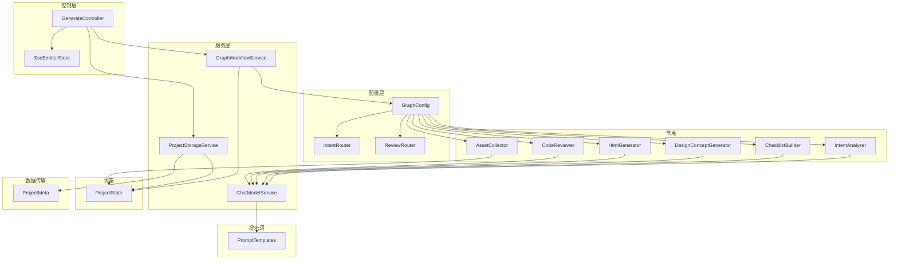
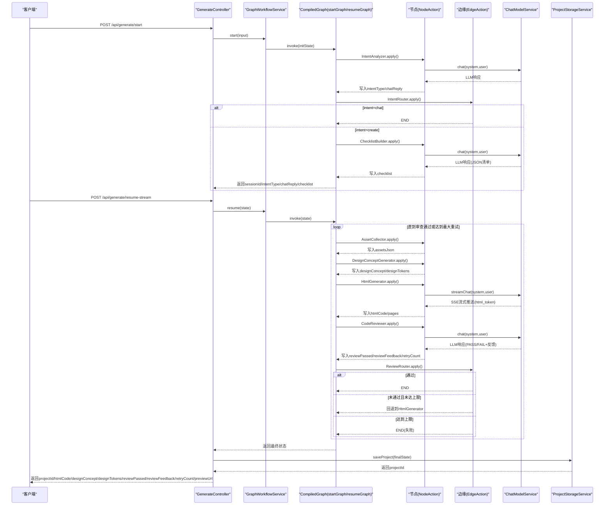
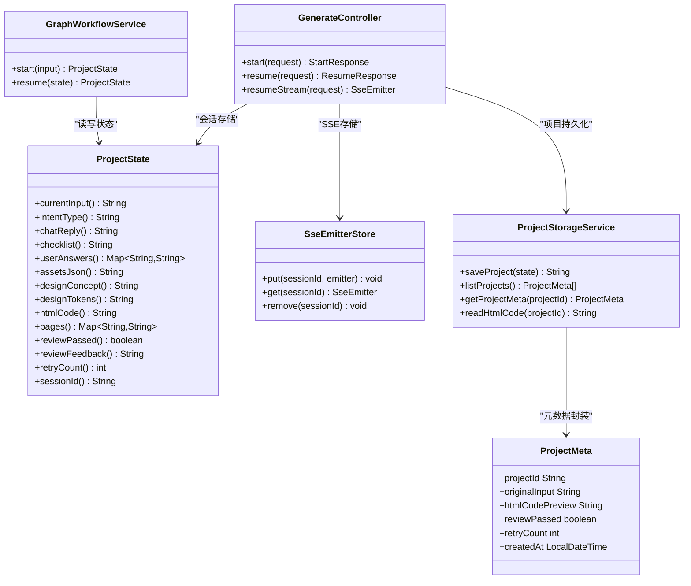
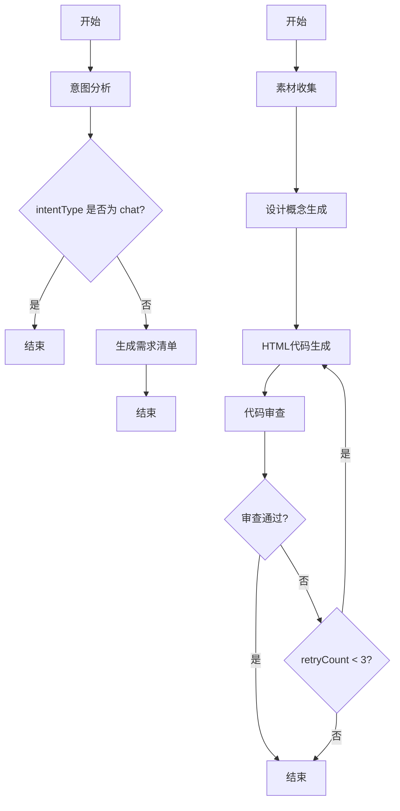
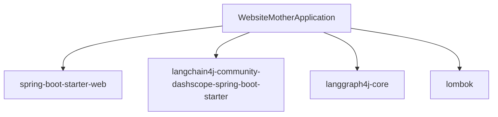
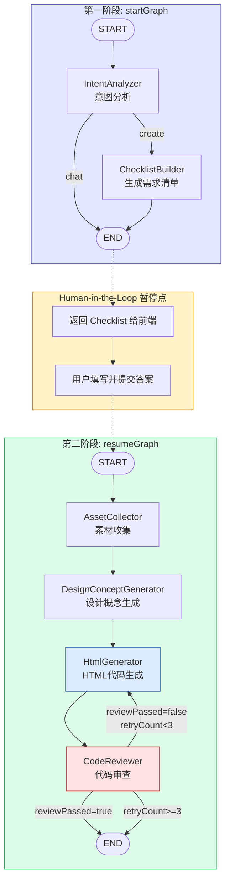

# AI工作流系统

<cite>
**本文档引用的文件**
- [WebsiteMotherApplication.java](file://src/main/java/com/example/websitemother/WebsiteMotherApplication.java)
- [ProjectState.java](file://src/main/java/com/example/websitemother/state/ProjectState.java)
- [GraphWorkflowService.java](file://src/main/java/com/example/websitemother/service/GraphWorkflowService.java)
- [ChatModelService.java](file://src/main/java/com/example/websitemother/service/ChatModelService.java)
- [GenerateController.java](file://src/main/java/com/example/websitemother/controller/GenerateController.java)
- [SseEmitterStore.java](file://src/main/java/com/example/websitemother/controller/SseEmitterStore.java)
- [GraphConfig.java](file://src/main/java/com/example/websitemother/config/GraphConfig.java)
- [IntentAnalyzer.java](file://src/main/java/com/example/websitemother/node/IntentAnalyzer.java)
- [ChecklistBuilder.java](file://src/main/java/com/example/websitemother/node/ChecklistBuilder.java)
- [AssetCollector.java](file://src/main/java/com/example/websitemother/node/AssetCollector.java)
- [DesignConceptGenerator.java](file://src/main/java/com/example/websitemother/node/DesignConceptGenerator.java)
- [HtmlGenerator.java](file://src/main/java/com/example/websitemother/node/HtmlGenerator.java)
- [CodeReviewer.java](file://src/main/java/com/example/websitemother/node/CodeReviewer.java)
- [IntentRouter.java](file://src/main/java/com/example/websitemother/edge/IntentRouter.java)
- [ReviewRouter.java](file://src/main/java/com/example/websitemother/edge/ReviewRouter.java)
- [PromptTemplates.java](file://src/main/java/com/example/websitemother/prompt/PromptTemplates.java)
- [ProjectStorageService.java](file://src/main/java/com/example/websitemother/service/ProjectStorageService.java)
- [ProjectMeta.java](file://src/main/java/com/example/websitemother/dto/ProjectMeta.java)
- [application.yml](file://src/main/resources/application.yml)
- [pom.xml](file://pom.xml)
- [workflow.mmd](file://workflow.mmd)
</cite>

## 更新摘要
**所做更改**
- 更新了工作流架构图，反映新的四阶段工作流设计：资产收集→设计概念生成→HTML生成→代码审查
- 新增了设计概念生成节点，支持结构化设计系统输出
- 新增了HTML生成节点，支持多页面HTML项目生成和流式SSE推送
- 新增了Streaming控制器和SseEmitterStore，支持实时进度反馈
- 更新了状态管理，包含设计概念和页面集合的完整跟踪
- 新增了流式API接口：POST /api/generate/resume-stream
- 完善了工作流调试和监控的最佳实践

## 目录
1. [简介](#简介)
2. [项目结构](#项目结构)
3. [核心组件](#核心组件)
4. [架构总览](#架构总览)
5. [详细组件分析](#详细组件分析)
6. [依赖关系分析](#依赖关系分析)
7. [性能考虑](#性能考虑)
8. [故障排查指南](#故障排查指南)
9. [结论](#结论)
10. [附录](#附录)

## 简介
本项目为WebsiteMother的AI工作流系统，基于LangGraph4J构建状态图工作流引擎，实现从用户意图识别到HTML静态网站生成与审查的自动化流水线。系统采用四阶段工作流：第一阶段完成意图分析与需求清单生成；第二阶段在用户补充信息后，完成素材收集、设计概念生成、HTML代码生成与多轮代码审查，直至通过或达到最大重试次数。新增的流式SSE支持提供实时进度反馈，每个项目保存在独立目录中，包含完整的HTML项目骨架。

## 项目结构
项目采用Spring Boot三层结构组织，核心模块如下：
- 控制层：REST接口负责接收请求、管理会话状态并协调工作流执行，新增流式SSE接口
- 服务层：封装工作流编排与LLM调用，新增项目存储服务
- 配置层：定义状态图、节点与条件边
- 状态层：统一的状态载体，承载工作流中的所有中间与最终结果
- 提示词模板：集中管理各节点的提示词工程
- 边缘路由：根据状态值决定工作流分支
- 数据传输对象：封装API响应数据结构

**图表来源**
- [GenerateController.java:1-245](file://src/main/java/com/example/websitemother/controller/GenerateController.java#L1-245)
- [SseEmitterStore.java:1-27](file://src/main/java/com/example/websitemother/controller/SseEmitterStore.java#L1-27)
- [GraphWorkflowService.java:1-65](file://src/main/java/com/example/websitemother/service/GraphWorkflowService.java#L1-65)
- [GraphConfig.java:1-104](file://src/main/java/com/example/websitemother/config/GraphConfig.java#L1-104)
- [ProjectState.java:1-95](file://src/main/java/com/example/websitemother/state/ProjectState.java#L1-95)
- [PromptTemplates.java:1-229](file://src/main/java/com/example/websitemother/prompt/PromptTemplates.java#L1-229)
- [ProjectStorageService.java:1-235](file://src/main/java/com/example/websitemother/service/ProjectStorageService.java#L1-235)
- [ProjectMeta.java:1-19](file://src/main/java/com/example/websitemother/dto/ProjectMeta.java#L1-19)

**章节来源**
- [WebsiteMotherApplication.java:1-14](file://src/main/java/com/example/websitemother/WebsiteMotherApplication.java#L1-14)
- [pom.xml:1-115](file://pom.xml#L1-115)

## 核心组件
- ProjectState：LangGraph状态载体，提供键常量与类型安全的访问器，支持整数解析与默认值处理，确保工作流中数据一致性与健壮性
- GraphWorkflowService：封装startGraph与resumeGraph的执行，负责初始化状态、异常处理与结果封装
- ChatModelService：统一LLM调用入口，封装SystemMessage/UserMessage组装与响应解析，屏蔽底层模型差异
- GenerateController：对外提供/start与/resume接口，新增/resume-stream流式接口，内存级会话存储（演示用途），生产需替换为Redis，新增项目ID返回
- SseEmitterStore：SSE发射器全局存储，解决SseEmitter不可序列化的限制
- GraphConfig：定义两个CompiledGraph，分别对应startGraph与resumeGraph，注册节点与条件边
- PromptTemplates：集中管理各节点提示词，便于统一维护与迭代
- ProjectStorageService：新增项目存储服务，负责生成项目的文件持久化与项目骨架创建
- ProjectMeta：项目元数据传输对象，封装项目基本信息用于API响应

**章节来源**
- [ProjectState.java:1-95](file://src/main/java/com/example/websitemother/state/ProjectState.java#L1-95)
- [GraphWorkflowService.java:1-65](file://src/main/java/com/example/websitemother/service/GraphWorkflowService.java#L1-65)
- [ChatModelService.java:1-58](file://src/main/java/com/example/websitemother/service/ChatModelService.java#L1-58)
- [GenerateController.java:1-245](file://src/main/java/com/example/websitemother/controller/GenerateController.java#L1-245)
- [SseEmitterStore.java:1-27](file://src/main/java/com/example/websitemother/controller/SseEmitterStore.java#L1-27)
- [GraphConfig.java:1-104](file://src/main/java/com/example/websitemother/config/GraphConfig.java#L1-104)
- [PromptTemplates.java:1-229](file://src/main/java/com/example/websitemother/prompt/PromptTemplates.java#L1-229)
- [ProjectStorageService.java:1-235](file://src/main/java/com/example/websitemother/service/ProjectStorageService.java#L1-235)
- [ProjectMeta.java:1-19](file://src/main/java/com/example/websitemother/dto/ProjectMeta.java#L1-19)

## 架构总览
系统采用"控制器-服务-配置-节点-状态-提示词"的分层架构，结合LangGraph4J的状态图实现条件路由与多轮迭代。整体流程分为两段：
- 第一阶段：意图分析 → 条件路由 → 清单生成 → 结束
- 第二阶段：素材收集 → 设计概念生成 → HTML代码生成 → 代码审查 → 条件路由（通过则结束，未通过且未达上限则回退重新生成）

新增的流式SSE支持在工作流执行过程中实时推送阶段状态和HTML代码片段，提供更好的用户体验。项目存储服务在工作流完成后自动创建可运行的HTML项目骨架，包含完整的页面结构和设计系统。

**图表来源**
- [GenerateController.java:1-245](file://src/main/java/com/example/websitemother/controller/GenerateController.java#L1-245)
- [GraphWorkflowService.java:1-65](file://src/main/java/com/example/websitemother/service/GraphWorkflowService.java#L1-65)
- [GraphConfig.java:1-104](file://src/main/java/com/example/websitemother/config/GraphConfig.java#L1-104)
- [IntentRouter.java:1-31](file://src/main/java/com/example/websitemother/edge/IntentRouter.java#L1-31)
- [ReviewRouter.java:1-43](file://src/main/java/com/example/websitemother/edge/ReviewRouter.java#L1-43)
- [IntentAnalyzer.java:1-61](file://src/main/java/com/example/websitemother/node/IntentAnalyzer.java#L1-61)
- [ChecklistBuilder.java:1-51](file://src/main/java/com/example/websitemother/node/ChecklistBuilder.java#L1-51)
- [AssetCollector.java:1-170](file://src/main/java/com/example/websitemother/node/AssetCollector.java#L1-170)
- [DesignConceptGenerator.java:1-140](file://src/main/java/com/example/websitemother/node/DesignConceptGenerator.java#L1-140)
- [HtmlGenerator.java:1-271](file://src/main/java/com/example/websitemother/node/HtmlGenerator.java#L1-271)
- [CodeReviewer.java:1-233](file://src/main/java/com/example/websitemother/node/CodeReviewer.java#L1-233)
- [ChatModelService.java:1-58](file://src/main/java/com/example/websitemother/service/ChatModelService.java#L1-58)
- [ProjectStorageService.java:1-235](file://src/main/java/com/example/websitemother/service/ProjectStorageService.java#L1-235)

## 详细组件分析

### 状态管理与数据持久化
- ProjectState继承AgentState，提供键常量与类型安全访问器，支持字符串、布尔、整数与映射类型的读取与默认值处理，确保工作流中数据的强一致与容错
- GraphWorkflowService在start阶段以Map初始化状态，resume阶段直接复用ProjectState对象，保持跨阶段状态连续性
- GenerateController使用ConcurrentHashMap模拟会话存储，key为sessionId，value为ProjectState；生产环境建议替换为Redis以支持分布式与持久化
- SseEmitterStore提供全局SSE发射器存储，解决SseEmitter不可序列化的限制，通过sessionId作为键存取
- ProjectStorageService负责生成项目的文件持久化，每个项目保存在generated-projects/{projectId}/目录下，包含完整的HTML项目骨架

**图表来源**
- [ProjectState.java:1-95](file://src/main/java/com/example/websitemother/state/ProjectState.java#L1-95)
- [GraphWorkflowService.java:1-65](file://src/main/java/com/example/websitemother/service/GraphWorkflowService.java#L1-65)
- [GenerateController.java:1-245](file://src/main/java/com/example/websitemother/controller/GenerateController.java#L1-245)
- [SseEmitterStore.java:1-27](file://src/main/java/com/example/websitemother/controller/SseEmitterStore.java#L1-27)
- [ProjectStorageService.java:1-235](file://src/main/java/com/example/websitemother/service/ProjectStorageService.java#L1-235)
- [ProjectMeta.java:1-19](file://src/main/java/com/example/websitemother/dto/ProjectMeta.java#L1-19)

**章节来源**
- [ProjectState.java:1-95](file://src/main/java/com/example/websitemother/state/ProjectState.java#L1-95)
- [GraphWorkflowService.java:1-65](file://src/main/java/com/example/websitemother/service/GraphWorkflowService.java#L1-65)
- [GenerateController.java:1-245](file://src/main/java/com/example/websitemother/controller/GenerateController.java#L1-245)
- [SseEmitterStore.java:1-27](file://src/main/java/com/example/websitemother/controller/SseEmitterStore.java#L1-27)
- [ProjectStorageService.java:1-235](file://src/main/java/com/example/websitemother/service/ProjectStorageService.java#L1-235)

### AI节点工作原理与处理逻辑

#### 意图分析节点(IntentAnalyzer)
- 输入：当前输入currentInput
- 处理：调用LLM输出固定格式，解析INTENT与REPLY
- 输出：intentType与chatReply写入状态
- 优化：严格格式约束减少解析歧义；日志记录输入与结果

**章节来源**
- [IntentAnalyzer.java:1-61](file://src/main/java/com/example/websitemother/node/IntentAnalyzer.java#L1-61)
- [PromptTemplates.java:13-23](file://src/main/java/com/example/websitemother/prompt/PromptTemplates.java#L13-23)
- [ChatModelService.java:1-58](file://src/main/java/com/example/websitemother/service/ChatModelService.java#L1-58)

#### 需求清单生成节点(ChecklistBuilder)
- 输入：当前输入currentInput
- 处理：要求LLM输出JSON数组，清理可能的代码块标记
- 输出：checklist写入状态
- 优化：统一JSON输出格式与清洗逻辑，降低下游解析成本

**章节来源**
- [ChecklistBuilder.java:1-51](file://src/main/java/com/example/websitemother/node/ChecklistBuilder.java#L1-51)
- [PromptTemplates.java:27-52](file://src/main/java/com/example/websitemother/prompt/PromptTemplates.java#L27-52)
- [ChatModelService.java:1-58](file://src/main/java/com/example/websitemother/service/ChatModelService.java#L1-58)

#### 素材收集节点(AssetCollector)
- 输入：userAnswers映射
- 处理：为每个非空答案提取关键词，构造Pexels图片URL和Logo生成，保证至少一张hero图
- 输出：assetsJson写入状态
- 优化：关键词提取与URL构造具备确定性，利于缓存与复现；支持Pexels搜索失败回退到占位图

**章节来源**
- [AssetCollector.java:1-170](file://src/main/java/com/example/websitemother/node/AssetCollector.java#L1-170)
- [ProjectState.java:1-95](file://src/main/java/com/example/websitemother/state/ProjectState.java#L1-95)

#### 设计概念生成节点(DesignConceptGenerator)
- 输入：requirement（由currentInput和userAnswers构建）、assetsJson
- 处理：生成结构化设计概念JSON，提取CSS变量定义
- 输出：designConcept与designTokens写入状态
- 优化：支持多种设计维度（配色、字体、间距、布局方向），自动提取CSS变量

**章节来源**
- [DesignConceptGenerator.java:1-140](file://src/main/java/com/example/websitemother/node/DesignConceptGenerator.java#L1-140)
- [PromptTemplates.java:56-97](file://src/main/java/com/example/websitemother/prompt/PromptTemplates.java#L56-97)
- [ChatModelService.java:1-58](file://src/main/java/com/example/websitemother/service/ChatModelService.java#L1-58)

#### HTML代码生成节点(HtmlGenerator)
- 输入：currentInput、userAnswers、assetsJson、designConcept、designTokens、reviewFeedback、previousHtmlCode
- 处理：组装完整需求描述，调用LLM生成HTML代码，支持流式SSE推送和分块增量修改
- 输出：htmlCode与pages写入状态
- 优化：支持多文件输出、分块增量修改、自动链接目标注入、流式token推送

**章节来源**
- [HtmlGenerator.java:1-271](file://src/main/java/com/example/websitemother/node/HtmlGenerator.java#L1-271)
- [PromptTemplates.java:101-208](file://src/main/java/com/example/websitemother/prompt/PromptTemplates.java#L101-208)
- [ChatModelService.java:1-58](file://src/main/java/com/example/websitemother/service/ChatModelService.java#L1-58)

#### 代码审查节点(CodeReviewer)
- 输入：htmlCode、retryCount
- 处理：快速结构检查，自动修复常见问题，解析RESULT与FEEDBACK
- 输出：reviewPassed、reviewFeedback、retryCount递增
- 优化：严格格式输出与严格解析，确保条件路由稳定；支持自动修复

**章节来源**
- [CodeReviewer.java:1-233](file://src/main/java/com/example/websitemother/node/CodeReviewer.java#L1-233)
- [PromptTemplates.java:212-227](file://src/main/java/com/example/websitemother/prompt/PromptTemplates.java#L212-227)
- [ChatModelService.java:1-58](file://src/main/java/com/example/websitemother/service/ChatModelService.java#L1-58)

### 条件路由与状态转换
- 意图路由(IntentRouter)：intentType为chat时结束，为create时进入ChecklistBuilder
- 审查路由(ReviewRouter)：通过则结束；未通过且retryCount小于阈值则回退到HtmlGenerator；达到上限则结束

**图表来源**
- [GraphConfig.java:1-104](file://src/main/java/com/example/websitemother/config/GraphConfig.java#L1-104)
- [IntentRouter.java:1-31](file://src/main/java/com/example/websitemother/edge/IntentRouter.java#L1-31)
- [ReviewRouter.java:1-43](file://src/main/java/com/example/websitemother/edge/ReviewRouter.java#L1-43)

**章节来源**
- [IntentRouter.java:1-31](file://src/main/java/com/example/websitemother/edge/IntentRouter.java#L1-31)
- [ReviewRouter.java:1-43](file://src/main/java/com/example/websitemother/edge/ReviewRouter.java#L1-43)
- [GraphConfig.java:1-104](file://src/main/java/com/example/websitemother/config/GraphConfig.java#L1-104)

### 提示词工程设计原则与优化方法
- 明确格式约束：要求LLM输出固定格式（如RESULT/FEEDBACK、INTENT/REPLY），便于程序化解析
- 严格指令规范：限定输出结构（JSON数组、HTML文件），减少无关信息与代码块标记
- 上下文完备：在HTML生成中整合原始需求、设计概念、设计令牌、素材与反馈，提升生成质量
- 可验证性：审查标准清晰，便于LLM稳定输出可解析的结果
- 流式支持：HTML生成器支持分块增量修改和SSE流式推送

**章节来源**
- [PromptTemplates.java:1-229](file://src/main/java/com/example/websitemother/prompt/PromptTemplates.java#L1-229)

### 工作流调试与监控最佳实践
- 日志分级：在节点与服务层记录关键输入、输出与中间状态，便于定位问题
- 异常处理：统一捕获与包装异常，保留原始错误信息并记录上下文
- 会话追踪：使用sessionId串联请求与状态，便于端到端追踪
- 监控指标：记录生成代码长度、重试次数、LLM调用耗时等指标，辅助性能优化
- 项目持久化：自动生成可运行的HTML项目骨架，便于测试与部署
- SSE监控：通过SSE事件流实时监控工作流执行进度

**章节来源**
- [GraphWorkflowService.java:1-65](file://src/main/java/com/example/websitemother/service/GraphWorkflowService.java#L1-65)
- [GenerateController.java:1-245](file://src/main/java/com/example/websitemother/controller/GenerateController.java#L1-245)
- [ChatModelService.java:1-58](file://src/main/java/com/example/websitemother/service/ChatModelService.java#L1-58)
- [ProjectStorageService.java:1-235](file://src/main/java/com/example/websitemother/service/ProjectStorageService.java#L1-235)

## 依赖关系分析
系统依赖Spring Boot、LangGraph4J与LangChain4J(DashScope)，通过Maven管理版本与生命周期。

**图表来源**
- [pom.xml:1-115](file://pom.xml#L1-115)
- [WebsiteMotherApplication.java:1-14](file://src/main/java/com/example/websitemother/WebsiteMotherApplication.java#L1-14)

**章节来源**
- [pom.xml:1-115](file://pom.xml#L1-115)

## 性能考虑
- LLM调用成本：合理设置提示词长度与上下文，避免冗余信息；必要时对用户输入做摘要
- 并发与会话：生产环境使用Redis存储会话，避免内存瓶颈；对热点会话做缓存
- 重试策略：审查失败时的回退需控制最大重试次数，防止无限循环
- 编译图复用：CompiledGraph在容器启动时编译一次，减少运行时开销
- 文件I/O优化：项目存储服务使用异步文件操作，避免阻塞主线程
- SSE流式优化：流式SSE推送采用无缓冲模式，实时性更好但需注意网络稳定性

## 故障排查指南
- LLM调用异常：检查DashScope配置与API密钥；查看ChatModelService错误日志
- 工作流中断：确认节点输出键是否与状态键一致；核对条件边路由逻辑
- 会话丢失：确认GenerateController的会话存储是否正确更新；生产环境替换为Redis
- 审查不通过：查看CodeReviewer输出格式与反馈内容，针对性优化提示词
- 项目保存失败：检查generated-projects目录权限与磁盘空间
- 项目读取异常：确认项目ID有效性与文件完整性
- SSE连接异常：检查SseEmitterStore中是否存在过期的发射器；确认客户端SSE连接状态
- HTML生成失败：检查设计概念JSON格式；验证CSS变量提取是否正确

**章节来源**
- [application.yml:1-9](file://src/main/resources/application.yml#L1-9)
- [ChatModelService.java:1-58](file://src/main/java/com/example/websitemother/service/ChatModelService.java#L1-58)
- [GenerateController.java:1-245](file://src/main/java/com/example/websitemother/controller/GenerateController.java#L1-245)
- [CodeReviewer.java:1-233](file://src/main/java/com/example/websitemother/node/CodeReviewer.java#L1-233)
- [ProjectStorageService.java:1-235](file://src/main/java/com/example/websitemother/service/ProjectStorageService.java#L1-235)

## 结论
本系统以LangGraph4J为核心，实现了从意图识别到HTML代码生成与审查的完整闭环。通过集中式提示词工程、严格的输出格式约束与条件路由控制，系统在可解释性与可控性方面表现良好。新增的流式SSE支持和设计概念生成节点进一步增强了系统的实用性和用户体验。建议在生产环境中完善会话存储、监控与告警体系，并持续迭代提示词以提升生成质量与稳定性。

## 附录
- API定义
  - POST /api/generate/start：启动工作流，返回sessionId、intentType、chatReply与checklist
  - POST /api/generate/resume：提交答案继续执行，返回projectId、htmlCode、designConcept、designTokens、reviewPassed、reviewFeedback与retryCount
  - POST /api/generate/resume-stream：流式接口，实时推送stage、html_token、complete、error事件

**章节来源**
- [GenerateController.java:1-245](file://src/main/java/com/example/websitemother/controller/GenerateController.java#L1-245)

### 工作流架构图
系统采用四阶段工作流设计，通过workflow.mmd文件可视化展示：

**图表来源**
- [workflow.mmd:1-35](file://workflow.mmd#L1-35)

### SSE事件流说明
- stage事件：推送当前执行阶段名称（asset_collector、design_concept、html_generator、code_reviewer）
- html_token事件：流式推送HTML代码片段（仅在流式接口中）
- complete事件：推送最终结果JSON（包含htmlCode、designConcept、designTokens、reviewPassed等）
- error事件：推送错误信息

**章节来源**
- [HtmlGenerator.java:188-195](file://src/main/java/com/example/websitemother/node/HtmlGenerator.java#L188-L195)
- [DesignConceptGenerator.java:89-96](file://src/main/java/com/example/websitemother/node/DesignConceptGenerator.java#L89-L96)
- [AssetCollector.java:148-155](file://src/main/java/com/example/websitemother/node/AssetCollector.java#L148-L155)
- [CodeReviewer.java:129-136](file://src/main/java/com/example/websitemother/node/CodeReviewer.java#L129-L136)
- [GenerateController.java:126-128](file://src/main/java/com/example/websitemother/controller/GenerateController.java#L126-L128)