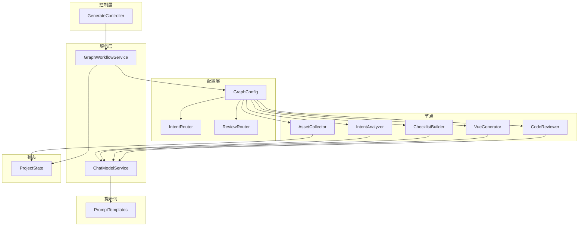
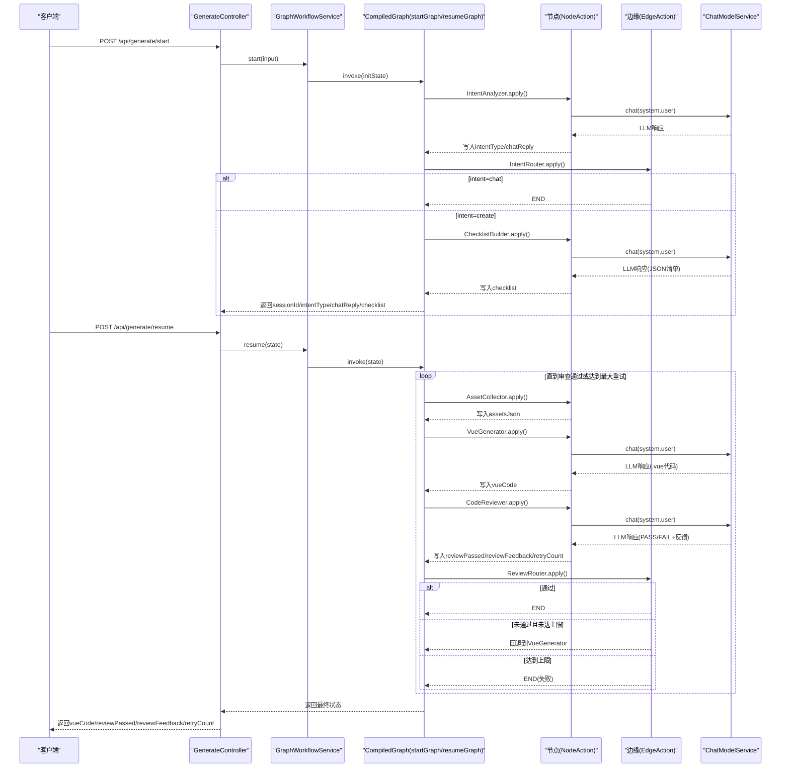
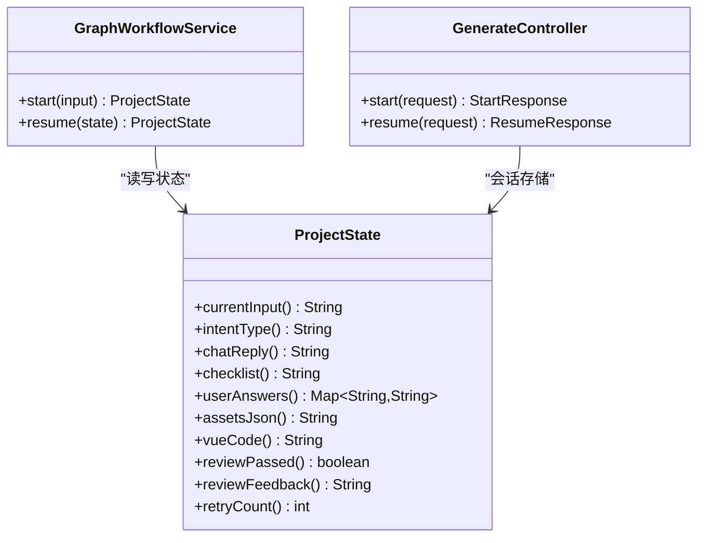
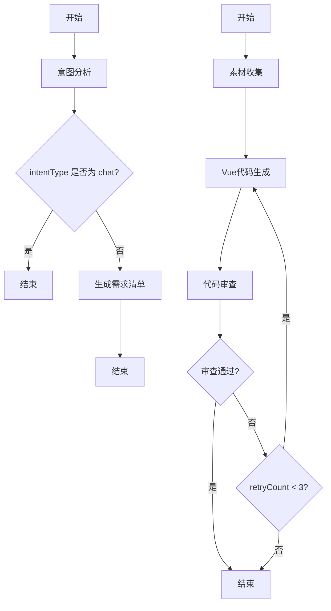
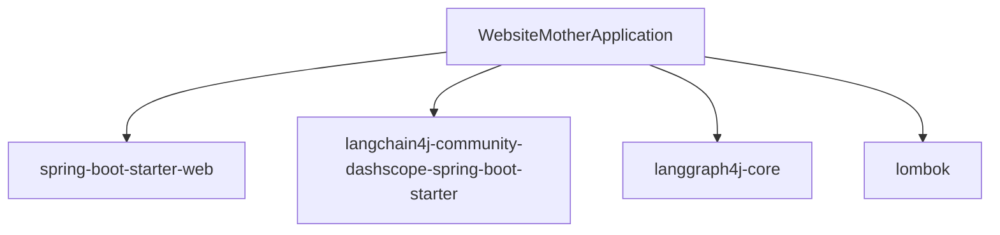

# AI工作流系统

<cite>
**本文引用的文件**
- [WebsiteMotherApplication.java](file://src/main/java/com/example/websitemother/WebsiteMotherApplication.java)
- [ProjectState.java](file://src/main/java/com/example/websitemother/state/ProjectState.java)
- [GraphWorkflowService.java](file://src/main/java/com/example/websitemother/service/GraphWorkflowService.java)
- [ChatModelService.java](file://src/main/java/com/example/websitemother/service/ChatModelService.java)
- [GenerateController.java](file://src/main/java/com/example/websitemother/controller/GenerateController.java)
- [GraphConfig.java](file://src/main/java/com/example/websitemother/config/GraphConfig.java)
- [IntentAnalyzer.java](file://src/main/java/com/example/websitemother/node/IntentAnalyzer.java)
- [ChecklistBuilder.java](file://src/main/java/com/example/websitemother/node/ChecklistBuilder.java)
- [AssetCollector.java](file://src/main/java/com/example/websitemother/node/AssetCollector.java)
- [VueGenerator.java](file://src/main/java/com/example/websitemother/node/VueGenerator.java)
- [CodeReviewer.java](file://src/main/java/com/example/websitemother/node/CodeReviewer.java)
- [IntentRouter.java](file://src/main/java/com/example/websitemother/edge/IntentRouter.java)
- [ReviewRouter.java](file://src/main/java/com/example/websitemother/edge/ReviewRouter.java)
- [PromptTemplates.java](file://src/main/java/com/example/websitemother/prompt/PromptTemplates.java)
- [application.yml](file://src/main/resources/application.yml)
- [pom.xml](file://pom.xml)
</cite>

## 目录
1. [简介](#简介)
2. [项目结构](#项目结构)
3. [核心组件](#核心组件)
4. [架构总览](#架构总览)
5. [详细组件分析](#详细组件分析)
6. [依赖关系分析](#依赖关系分析)
7. [性能考虑](#性能考虑)
8. [故障排查指南](#故障排查指南)
9. [结论](#结论)
10. [附录](#附录)

## 简介
本项目为WebsiteMother的AI工作流系统，基于LangGraph4J构建状态图工作流引擎，实现从用户意图识别到Vue前端代码生成与审查的自动化流水线。系统采用双阶段工作流：第一阶段完成意图分析与需求清单生成；第二阶段在用户补充信息后，完成素材收集、Vue代码生成与多轮代码审查，直至通过或达到最大重试次数。

## 项目结构
项目采用Spring Boot三层结构组织，核心模块如下：
- 控制层：REST接口负责接收请求、管理会话状态并协调工作流执行
- 服务层：封装工作流编排与LLM调用
- 配置层：定义状态图、节点与条件边
- 状态层：统一的状态载体，承载工作流中的所有中间与最终结果
- 提示词模板：集中管理各节点的提示词工程
- 边缘路由：根据状态值决定工作流分支

图表来源
- [GenerateController.java:1-115](file://src/main/java/com/example/websitemother/controller/GenerateController.java#L1-115)
- [GraphWorkflowService.java:1-60](file://src/main/java/com/example/websitemother/service/GraphWorkflowService.java#L1-60)
- [GraphConfig.java:1-99](file://src/main/java/com/example/websitemother/config/GraphConfig.java#L1-99)
- [ProjectState.java:1-78](file://src/main/java/com/example/websitemother/state/ProjectState.java#L1-78)
- [PromptTemplates.java:1-93](file://src/main/java/com/example/websitemother/prompt/PromptTemplates.java#L1-93)

章节来源
- [WebsiteMotherApplication.java:1-14](file://src/main/java/com/example/websitemother/WebsiteMotherApplication.java#L1-14)
- [pom.xml:1-115](file://pom.xml#L1-115)

## 核心组件
- ProjectState：LangGraph状态载体，提供键常量与类型安全的访问器，支持整数解析与默认值处理，确保工作流中数据一致性与健壮性
- GraphWorkflowService：封装startGraph与resumeGraph的执行，负责初始化状态、异常处理与结果封装
- ChatModelService：统一LLM调用入口，封装SystemMessage/UserMessage组装与响应解析，屏蔽底层模型差异
- GenerateController：对外提供/start与/resume接口，内存级会话存储（演示用途），生产需替换为Redis
- GraphConfig：定义两个CompiledGraph，分别对应startGraph与resumeGraph，注册节点与条件边
- PromptTemplates：集中管理各节点提示词，便于统一维护与迭代

章节来源
- [ProjectState.java:1-78](file://src/main/java/com/example/websitemother/state/ProjectState.java#L1-78)
- [GraphWorkflowService.java:1-60](file://src/main/java/com/example/websitemother/service/GraphWorkflowService.java#L1-60)
- [ChatModelService.java:1-58](file://src/main/java/com/example/websitemother/service/ChatModelService.java#L1-58)
- [GenerateController.java:1-115](file://src/main/java/com/example/websitemother/controller/GenerateController.java#L1-115)
- [GraphConfig.java:1-99](file://src/main/java/com/example/websitemother/config/GraphConfig.java#L1-99)
- [PromptTemplates.java:1-93](file://src/main/java/com/example/websitemother/prompt/PromptTemplates.java#L1-93)

## 架构总览
系统采用“控制器-服务-配置-节点-状态-提示词”的分层架构，结合LangGraph4J的状态图实现条件路由与多轮迭代。整体流程分为两段：
- 第一阶段：意图分析 → 条件路由 → 清单生成 → 结束
- 第二阶段：素材收集 → 代码生成 → 代码审查 → 条件路由（通过则结束，未通过且未达上限则回退重新生成）

图表来源
- [GenerateController.java:1-115](file://src/main/java/com/example/websitemother/controller/GenerateController.java#L1-115)
- [GraphWorkflowService.java:1-60](file://src/main/java/com/example/websitemother/service/GraphWorkflowService.java#L1-60)
- [GraphConfig.java:1-99](file://src/main/java/com/example/websitemother/config/GraphConfig.java#L1-99)
- [IntentRouter.java:1-31](file://src/main/java/com/example/websitemother/edge/IntentRouter.java#L1-31)
- [ReviewRouter.java:1-43](file://src/main/java/com/example/websitemother/edge/ReviewRouter.java#L1-43)
- [IntentAnalyzer.java:1-61](file://src/main/java/com/example/websitemother/node/IntentAnalyzer.java#L1-61)
- [ChecklistBuilder.java:1-51](file://src/main/java/com/example/websitemother/node/ChecklistBuilder.java#L1-51)
- [AssetCollector.java:1-89](file://src/main/java/com/example/websitemother/node/AssetCollector.java#L1-89)
- [VueGenerator.java:1-64](file://src/main/java/com/example/websitemother/node/VueGenerator.java#L1-64)
- [CodeReviewer.java:1-61](file://src/main/java/com/example/websitemother/node/CodeReviewer.java#L1-61)
- [ChatModelService.java:1-58](file://src/main/java/com/example/websitemother/service/ChatModelService.java#L1-58)

## 详细组件分析

### 状态管理与数据持久化
- ProjectState继承AgentState，提供键常量与类型安全访问器，支持字符串、布尔、整数与映射类型的读取与默认值处理，确保工作流中数据的强一致与容错
- GraphWorkflowService在start阶段以Map初始化状态，resume阶段直接复用ProjectState对象，保持跨阶段状态连续性
- GenerateController使用ConcurrentHashMap模拟会话存储，key为sessionId，value为ProjectState；生产环境建议替换为Redis以支持分布式与持久化

图表来源
- [ProjectState.java:1-78](file://src/main/java/com/example/websitemother/state/ProjectState.java#L1-78)
- [GraphWorkflowService.java:1-60](file://src/main/java/com/example/websitemother/service/GraphWorkflowService.java#L1-60)
- [GenerateController.java:1-115](file://src/main/java/com/example/websitemother/controller/GenerateController.java#L1-115)

章节来源
- [ProjectState.java:1-78](file://src/main/java/com/example/websitemother/state/ProjectState.java#L1-78)
- [GraphWorkflowService.java:1-60](file://src/main/java/com/example/websitemother/service/GraphWorkflowService.java#L1-60)
- [GenerateController.java:1-115](file://src/main/java/com/example/websitemother/controller/GenerateController.java#L1-115)

### AI节点工作原理与处理逻辑

#### 意图分析节点(IntentAnalyzer)
- 输入：当前输入currentInput
- 处理：调用LLM输出固定格式，解析INTENT与REPLY
- 输出：intentType与chatReply写入状态
- 优化：严格格式约束减少解析歧义；日志记录输入与结果

章节来源
- [IntentAnalyzer.java:1-61](file://src/main/java/com/example/websitemother/node/IntentAnalyzer.java#L1-61)
- [PromptTemplates.java:11-23](file://src/main/java/com/example/websitemother/prompt/PromptTemplates.java#L11-23)
- [ChatModelService.java:1-58](file://src/main/java/com/example/websitemother/service/ChatModelService.java#L1-58)

#### 需求清单生成节点(ChecklistBuilder)
- 输入：当前输入currentInput
- 处理：要求LLM输出JSON数组，清理可能的代码块标记
- 输出：checklist写入状态
- 优化：统一JSON输出格式与清洗逻辑，降低下游解析成本

章节来源
- [ChecklistBuilder.java:1-51](file://src/main/java/com/example/websitemother/node/ChecklistBuilder.java#L1-51)
- [PromptTemplates.java:25-42](file://src/main/java/com/example/websitemother/prompt/PromptTemplates.java#L25-42)
- [ChatModelService.java:1-58](file://src/main/java/com/example/websitemother/service/ChatModelService.java#L1-58)

#### 素材收集节点(AssetCollector)
- 输入：userAnswers映射
- 处理：为每个非空答案提取关键词，构造picsum.photos图片URL，保证至少一张hero图
- 输出：assetsJson写入状态
- 优化：关键词提取与URL构造具备确定性，利于缓存与复现

章节来源
- [AssetCollector.java:1-89](file://src/main/java/com/example/websitemother/node/AssetCollector.java#L1-89)
- [ProjectState.java:1-78](file://src/main/java/com/example/websitemother/state/ProjectState.java#L1-78)

#### Vue代码生成节点(VueGenerator)
- 输入：currentInput、userAnswers、assetsJson、reviewFeedback
- 处理：组装完整需求描述，调用LLM生成.vue代码，清理可能的代码块标记
- 输出：vueCode写入状态
- 优化：按需拼接素材与反馈，提升生成质量；长度日志便于监控

章节来源
- [VueGenerator.java:1-64](file://src/main/java/com/example/websitemother/node/VueGenerator.java#L1-64)
- [PromptTemplates.java:44-72](file://src/main/java/com/example/websitemother/prompt/PromptTemplates.java#L44-72)
- [ChatModelService.java:1-58](file://src/main/java/com/example/websitemother/service/ChatModelService.java#L1-58)

#### 代码审查节点(CodeReviewer)
- 输入：vueCode、retryCount
- 处理：调用LLM进行结构与语法审查，解析RESULT与FEEDBACK
- 输出：reviewPassed、reviewFeedback、retryCount递增
- 优化：固定格式输出与严格解析，确保条件路由稳定

章节来源
- [CodeReviewer.java:1-61](file://src/main/java/com/example/websitemother/node/CodeReviewer.java#L1-61)
- [PromptTemplates.java:74-91](file://src/main/java/com/example/websitemother/prompt/PromptTemplates.java#L74-91)
- [ChatModelService.java:1-58](file://src/main/java/com/example/websitemother/service/ChatModelService.java#L1-58)

### 条件路由与状态转换
- 意图路由(IntentRouter)：intentType为chat时结束，为create时进入ChecklistBuilder
- 审查路由(ReviewRouter)：通过则结束；未通过且retryCount小于阈值则回退到VueGenerator；达到上限则结束

图表来源
- [GraphConfig.java:1-99](file://src/main/java/com/example/websitemother/config/GraphConfig.java#L1-99)
- [IntentRouter.java:1-31](file://src/main/java/com/example/websitemother/edge/IntentRouter.java#L1-31)
- [ReviewRouter.java:1-43](file://src/main/java/com/example/websitemother/edge/ReviewRouter.java#L1-43)

章节来源
- [IntentRouter.java:1-31](file://src/main/java/com/example/websitemother/edge/IntentRouter.java#L1-31)
- [ReviewRouter.java:1-43](file://src/main/java/com/example/websitemother/edge/ReviewRouter.java#L1-43)
- [GraphConfig.java:1-99](file://src/main/java/com/example/websitemother/config/GraphConfig.java#L1-99)

### 提示词工程设计原则与优化方法
- 明确格式约束：要求LLM输出固定格式（如RESULT/FEEDBACK、INTENT/REPLY），便于程序化解析
- 严格指令规范：限定输出结构（JSON数组、.vue文件），减少无关信息与代码块标记
- 上下文完备：在Vue生成中整合原始需求、用户答案、素材与反馈，提升生成质量
- 可验证性：审查标准清晰，便于LLM稳定输出可解析的结果

章节来源
- [PromptTemplates.java:1-93](file://src/main/java/com/example/websitemother/prompt/PromptTemplates.java#L1-93)

### 工作流调试与监控最佳实践
- 日志分级：在节点与服务层记录关键输入、输出与中间状态，便于定位问题
- 异常处理：统一捕获与包装异常，保留原始错误信息并记录上下文
- 会话追踪：使用sessionId串联请求与状态，便于端到端追踪
- 监控指标：记录生成代码长度、重试次数、LLM调用耗时等指标，辅助性能优化

章节来源
- [GraphWorkflowService.java:1-60](file://src/main/java/com/example/websitemother/service/GraphWorkflowService.java#L1-60)
- [GenerateController.java:1-115](file://src/main/java/com/example/websitemother/controller/GenerateController.java#L1-115)
- [ChatModelService.java:1-58](file://src/main/java/com/example/websitemother/service/ChatModelService.java#L1-58)

## 依赖关系分析
系统依赖Spring Boot、LangGraph4J与LangChain4J(DashScope)，通过Maven管理版本与生命周期。

图表来源
- [pom.xml:1-115](file://pom.xml#L1-115)
- [WebsiteMotherApplication.java:1-14](file://src/main/java/com/example/websitemother/WebsiteMotherApplication.java#L1-14)

章节来源
- [pom.xml:1-115](file://pom.xml#L1-115)

## 性能考虑
- LLM调用成本：合理设置提示词长度与上下文，避免冗余信息；必要时对用户输入做摘要
- 并发与会话：生产环境使用Redis存储会话，避免内存瓶颈；对热点会话做缓存
- 重试策略：审查失败时的回退需控制最大重试次数，防止无限循环
- 编译图复用：CompiledGraph在容器启动时编译一次，减少运行时开销

## 故障排查指南
- LLM调用异常：检查DashScope配置与API密钥；查看ChatModelService错误日志
- 工作流中断：确认节点输出键是否与状态键一致；核对条件边路由逻辑
- 会话丢失：确认GenerateController的会话存储是否正确更新；生产环境替换为Redis
- 审查不通过：查看CodeReviewer输出格式与反馈内容，针对性优化提示词

章节来源
- [application.yml:1-9](file://src/main/resources/application.yml#L1-9)
- [ChatModelService.java:1-58](file://src/main/java/com/example/websitemother/service/ChatModelService.java#L1-58)
- [GenerateController.java:1-115](file://src/main/java/com/example/websitemother/controller/GenerateController.java#L1-115)
- [CodeReviewer.java:1-61](file://src/main/java/com/example/websitemother/node/CodeReviewer.java#L1-61)

## 结论
本系统以LangGraph4J为核心，实现了从意图识别到代码生成与审查的完整闭环。通过集中式提示词工程、严格的输出格式约束与条件路由控制，系统在可解释性与可控性方面表现良好。建议在生产环境中完善会话存储、监控与告警体系，并持续迭代提示词以提升生成质量与稳定性。

## 附录
- API定义
  - POST /api/generate/start：启动工作流，返回sessionId、intentType、chatReply与checklist
  - POST /api/generate/resume：提交答案继续执行，返回vueCode、reviewPassed、reviewFeedback与retryCount

章节来源
- [GenerateController.java:1-115](file://src/main/java/com/example/websitemother/controller/GenerateController.java#L1-115)