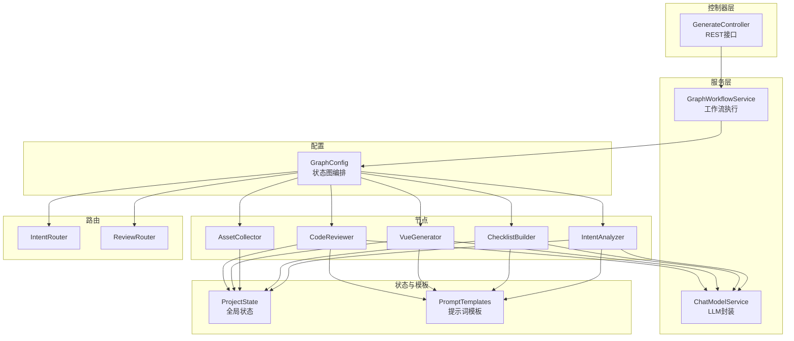
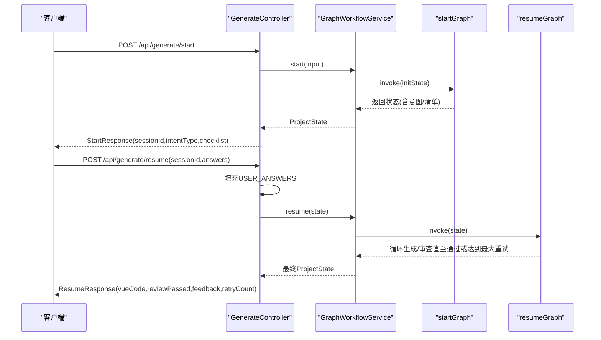
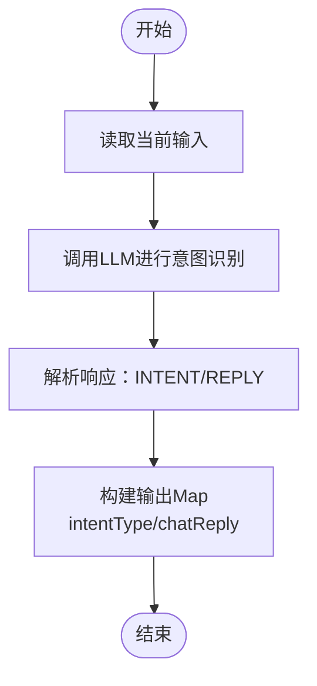
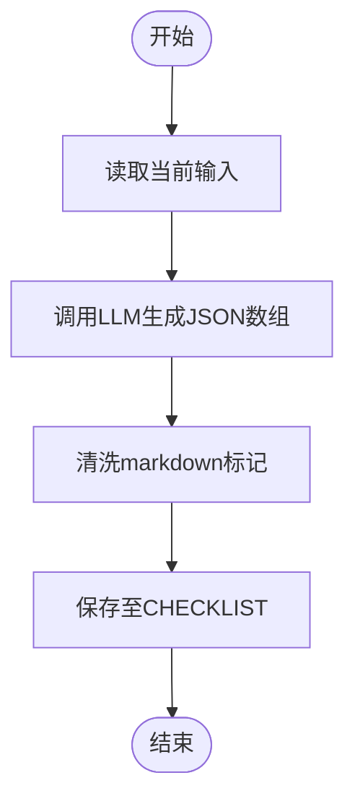
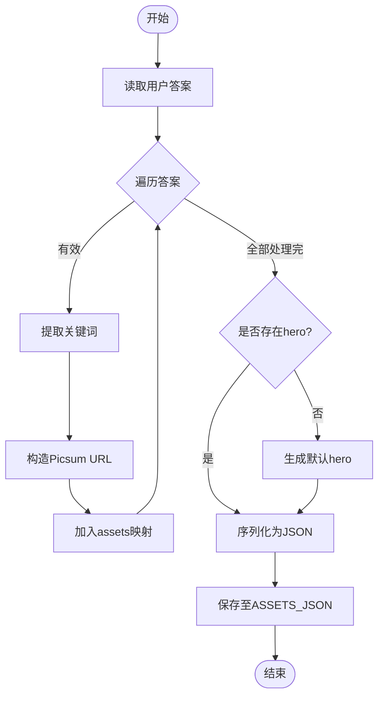
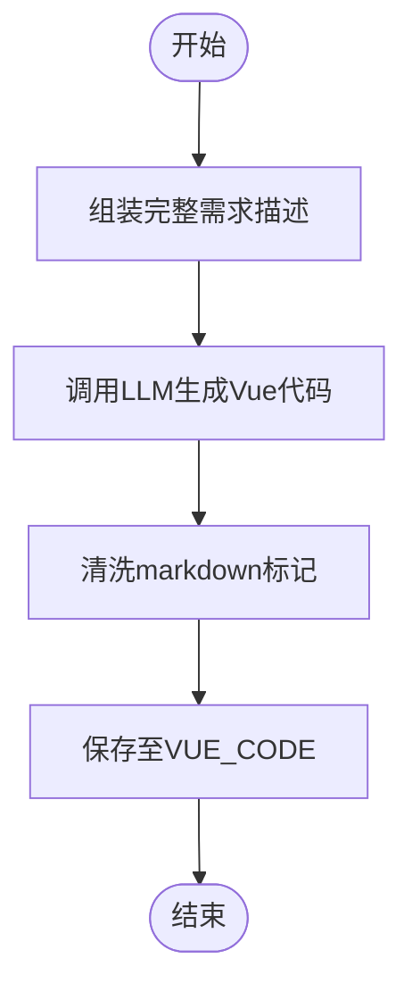
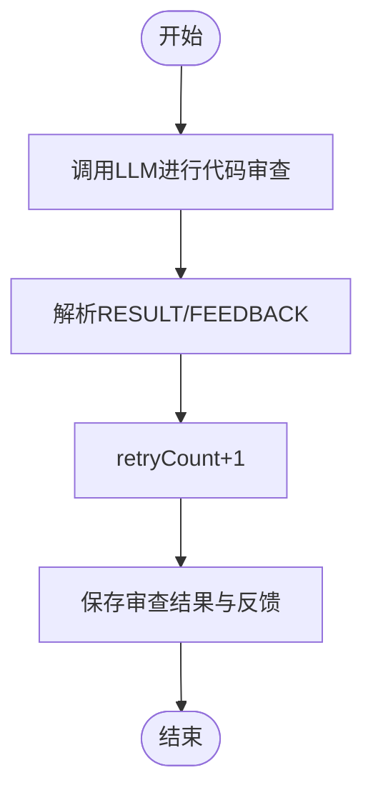
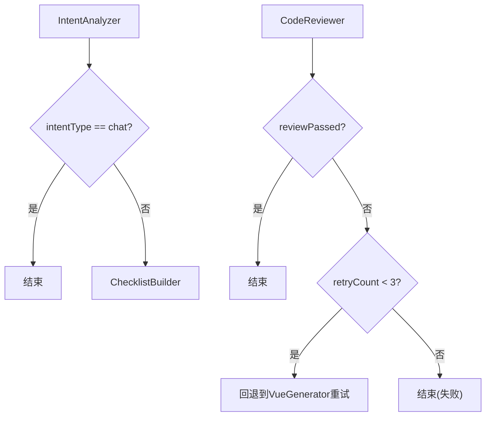
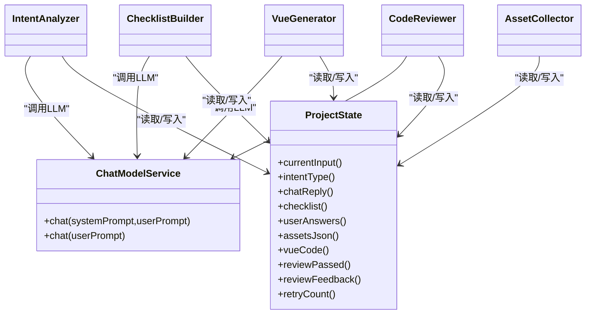

# AI节点分析

<cite>
**本文引用的文件**
- [IntentAnalyzer.java](file://src/main/java/com/example/websitemother/node/IntentAnalyzer.java)
- [ChecklistBuilder.java](file://src/main/java/com/example/websitemother/node/ChecklistBuilder.java)
- [AssetCollector.java](file://src/main/java/com/example/websitemother/node/AssetCollector.java)
- [VueGenerator.java](file://src/main/java/com/example/websitemother/node/VueGenerator.java)
- [CodeReviewer.java](file://src/main/java/com/example/websitemother/node/CodeReviewer.java)
- [ChatModelService.java](file://src/main/java/com/example/websitemother/service/ChatModelService.java)
- [ProjectState.java](file://src/main/java/com/example/websitemother/state/ProjectState.java)
- [PromptTemplates.java](file://src/main/java/com/example/websitemother/prompt/PromptTemplates.java)
- [GraphWorkflowService.java](file://src/main/java/com/example/websitemother/service/GraphWorkflowService.java)
- [GraphConfig.java](file://src/main/java/com/example/websitemother/config/GraphConfig.java)
- [IntentRouter.java](file://src/main/java/com/example/websitemother/edge/IntentRouter.java)
- [ReviewRouter.java](file://src/main/java/com/example/websitemother/edge/ReviewRouter.java)
- [GenerateController.java](file://src/main/java/com/example/websitemother/controller/GenerateController.java)
- [application.yml](file://src/main/resources/application.yml)
</cite>

## 目录
1. [简介](#简介)
2. [项目结构](#项目结构)
3. [核心组件](#核心组件)
4. [架构总览](#架构总览)
5. [详细组件分析](#详细组件分析)
6. [依赖分析](#依赖分析)
7. [性能考虑](#性能考虑)
8. [故障排除指南](#故障排除指南)
9. [结论](#结论)
10. [附录](#附录)

## 简介
本文件面向WebsiteMother的AI节点系统，围绕“意图识别—需求清单—素材收集—代码生成—代码审查”的工作流，系统化梳理各AI节点的功能职责、输入输出规范、处理逻辑与协作关系。重点解析：
- IntentAnalyzer的意图识别算法与输出格式
- ChecklistBuilder的需求清单生成策略与JSON约束
- AssetCollector的素材收集机制与占位图生成
- VueGenerator的代码生成算法与多源输入整合
- CodeReviewer的代码审查逻辑与重试控制

同时，结合状态传递、结果合并与错误传播机制，提供配置参数说明、性能调优建议与故障排除指南，并给出可复用的使用场景与扩展思路。

## 项目结构
WebsiteMother采用Spring Boot + LangGraph4j的状态图工作流，将AI节点封装为可组合的步骤，通过条件边实现分支与循环控制。核心目录与文件如下：
- node：AI节点实现（意图分析、清单生成、素材收集、Vue生成、代码审查）
- service：工作流执行与LLM调用封装
- state：全局状态容器
- prompt：统一的提示词模板
- edge：条件边（路由）
- config：LangGraph4j图编排
- controller：对外HTTP接口
- resources：应用配置（包含DashScope Qwen模型密钥）

图表来源
- [GraphConfig.java:52-96](file://src/main/java/com/example/websitemother/config/GraphConfig.java#L52-L96)
- [GenerateController.java:33-84](file://src/main/java/com/example/websitemother/controller/GenerateController.java#L33-L84)
- [ChatModelService.java:33-49](file://src/main/java/com/example/websitemother/service/ChatModelService.java#L33-L49)
- [PromptTemplates.java:13-91](file://src/main/java/com/example/websitemother/prompt/PromptTemplates.java#L13-L91)
- [ProjectState.java:15-76](file://src/main/java/com/example/websitemother/state/ProjectState.java#L15-L76)

章节来源
- [GraphConfig.java:52-96](file://src/main/java/com/example/websitemother/config/GraphConfig.java#L52-L96)
- [GenerateController.java:33-84](file://src/main/java/com/example/websitemother/controller/GenerateController.java#L33-L84)

## 核心组件
本节概述各AI节点的核心职责、输入输出与关键处理逻辑。

- 意图分析（IntentAnalyzer）
  - 职责：判断用户输入是闲聊还是建站需求，输出意图类型与可选回复
  - 输入：当前输入（来自状态）
  - 输出：意图类型（chat/create）、闲聊回复（可空）
  - 关键点：严格解析LLM输出中的INTENT与REPLY行，确保格式一致性

- 需求清单（ChecklistBuilder）
  - 职责：基于建站需求生成3-5个关键补充字段，输出JSON数组
  - 输入：当前输入（来自状态）
  - 输出：JSON字符串（字段数组）
  - 关键点：清理可能的markdown代码块标记，仅保留纯JSON

- 素材收集（AssetCollector）
  - 职责：根据用户答案生成占位图片URL集合，保证至少一张主图
  - 输入：用户答案映射（来自状态）
  - 输出：assets JSON字符串
  - 关键点：关键词提取与URL构造，确保种子安全与尺寸合理

- Vue代码生成（VueGenerator）
  - 职责：综合原始需求、用户补充与素材JSON，生成完整单文件Vue代码
  - 输入：当前输入、assets JSON、审查反馈（可空）
  - 输出：Vue代码字符串
  - 关键点：组装完整需求描述，清理可能的代码块标记

- 代码审查（CodeReviewer）
  - 职责：检查Vue代码完整性与语法正确性，输出通过/失败与反馈
  - 输入：Vue代码、重试计数
  - 输出：审查结果（布尔）、反馈、新的重试计数
  - 关键点：解析RESULT与FEEDBACK行，配合ReviewRouter实现最多3次重试

章节来源
- [IntentAnalyzer.java:24-59](file://src/main/java/com/example/websitemother/node/IntentAnalyzer.java#L24-L59)
- [ChecklistBuilder.java:24-49](file://src/main/java/com/example/websitemother/node/ChecklistBuilder.java#L24-L49)
- [AssetCollector.java:22-58](file://src/main/java/com/example/websitemother/node/AssetCollector.java#L22-L58)
- [VueGenerator.java:24-62](file://src/main/java/com/example/websitemother/node/VueGenerator.java#L24-L62)
- [CodeReviewer.java:24-59](file://src/main/java/com/example/websitemother/node/CodeReviewer.java#L24-L59)

## 架构总览
WebsiteMother以LangGraph4j为核心，构建两条工作流：
- startGraph：意图分析 → 清单生成（人类暂停点），支持chat直通结束或进入清单生成
- resumeGraph：素材收集 → Vue生成 → 代码审查（循环），通过ReviewRouter控制重试与结束

图表来源
- [GenerateController.java:33-84](file://src/main/java/com/example/websitemother/controller/GenerateController.java#L33-L84)
- [GraphWorkflowService.java:31-57](file://src/main/java/com/example/websitemother/service/GraphWorkflowService.java#L31-L57)
- [GraphConfig.java:52-96](file://src/main/java/com/example/websitemother/config/GraphConfig.java#L52-L96)

## 详细组件分析

### 意图分析（IntentAnalyzer）
- 功能职责
  - 识别用户输入属于“闲聊”或“建站需求”
  - 为闲聊场景生成友好回复，为建站需求生成空回复占位
- 输入输出
  - 输入：ProjectState.currentInput
  - 输出：ProjectState.INTENT_TYPE、ProjectState.CHAT_REPLY
- 处理逻辑
  - 使用系统提示词与用户提示词调用LLM
  - 严格解析响应中的INTENT与REPLY行，确保大小写与空值处理
- 错误处理
  - LLM异常统一包装为运行时异常并记录日志

图表来源
- [IntentAnalyzer.java:24-59](file://src/main/java/com/example/websitemother/node/IntentAnalyzer.java#L24-L59)
- [PromptTemplates.java:13-23](file://src/main/java/com/example/websitemother/prompt/PromptTemplates.java#L13-L23)

章节来源
- [IntentAnalyzer.java:24-59](file://src/main/java/com/example/websitemother/node/IntentAnalyzer.java#L24-L59)
- [PromptTemplates.java:13-23](file://src/main/java/com/example/websitemother/prompt/PromptTemplates.java#L13-L23)

### 需求清单（ChecklistBuilder）
- 功能职责
  - 生成3-5个关键补充字段，覆盖主题/行业、风格、功能模块、配色、受众等维度
- 输入输出
  - 输入：ProjectState.currentInput
  - 输出：ProjectState.CHECKLIST（JSON字符串）
- 处理逻辑
  - 清洗LLM输出中的markdown代码块标记，仅保留JSON数组
  - 字段类型支持text、textarea、select，select需提供options
- 错误处理
  - 保持输出为纯JSON，避免上层解析异常

图表来源
- [ChecklistBuilder.java:24-49](file://src/main/java/com/example/websitemother/node/ChecklistBuilder.java#L24-L49)
- [PromptTemplates.java:27-42](file://src/main/java/com/example/websitemother/prompt/PromptTemplates.java#L27-L42)

章节来源
- [ChecklistBuilder.java:24-49](file://src/main/java/com/example/websitemother/node/ChecklistBuilder.java#L24-L49)
- [PromptTemplates.java:27-42](file://src/main/java/com/example/websitemother/prompt/PromptTemplates.java#L27-L42)

### 素材收集（AssetCollector）
- 功能职责
  - 将用户答案映射转换为assets JSON，包含每项的URL、描述与关键词
  - 若缺少主图（hero），自动补全一张
- 输入输出
  - 输入：ProjectState.userAnswers()
  - 输出：ProjectState.ASSETS_JSON（JSON字符串）
- 处理逻辑
  - 逐项提取关键词，构造picsum.photos确定性URL（基于seed）
  - 保证至少一张hero图，尺寸与关键词合理
- 错误处理
  - 空值跳过，避免无效条目

图表来源
- [AssetCollector.java:22-58](file://src/main/java/com/example/websitemother/node/AssetCollector.java#L22-L58)

章节来源
- [AssetCollector.java:22-58](file://src/main/java/com/example/websitemother/node/AssetCollector.java#L22-L58)

### Vue代码生成（VueGenerator）
- 功能职责
  - 综合原始需求、用户补充与素材JSON，生成完整单文件Vue代码
- 输入输出
  - 输入：currentInput、assetsJson、reviewFeedback（可空）
  - 输出：ProjectState.VUE_CODE
- 处理逻辑
  - 组装完整需求描述（含原始需求与用户答案）
  - 可选附加上次审查反馈，指导修复
  - 清洗可能的代码块标记，仅保留.vue内容
- 错误处理
  - 保持输出为纯代码，避免上层解析异常

图表来源
- [VueGenerator.java:24-62](file://src/main/java/com/example/websitemother/node/VueGenerator.java#L24-L62)
- [PromptTemplates.java:46-72](file://src/main/java/com/example/websitemother/prompt/PromptTemplates.java#L46-L72)

章节来源
- [VueGenerator.java:24-62](file://src/main/java/com/example/websitemother/node/VueGenerator.java#L24-L62)
- [PromptTemplates.java:46-72](file://src/main/java/com/example/websitemother/prompt/PromptTemplates.java#L46-L72)

### 代码审查（CodeReviewer）
- 功能职责
  - 检查Vue代码的完整性与语法正确性，输出通过/失败与反馈
- 输入输出
  - 输入：ProjectState.vueCode()、ProjectState.retryCount()
  - 输出：ProjectState.REVIEW_PASSED、ProjectState.REVIEW_FEEDBACK、ProjectState.RETRY_COUNT
- 处理逻辑
  - 解析RESULT行决定通过与否
  - 解析FEEDBACK行获取具体问题与修复建议
  - 重试计数自增，配合ReviewRouter控制循环
- 错误处理
  - 异常统一包装并记录日志

图表来源
- [CodeReviewer.java:24-59](file://src/main/java/com/example/websitemother/node/CodeReviewer.java#L24-L59)
- [PromptTemplates.java:76-91](file://src/main/java/com/example/websitemother/prompt/PromptTemplates.java#L76-L91)

章节来源
- [CodeReviewer.java:24-59](file://src/main/java/com/example/websitemother/node/CodeReviewer.java#L24-L59)
- [PromptTemplates.java:76-91](file://src/main/java/com/example/websitemother/prompt/PromptTemplates.java#L76-L91)

### 条件边与路由
- 意图路由（IntentRouter）
  - chat → 结束
  - create → checklist_builder
- 代码审查路由（ReviewRouter）
  - 通过 → 结束
  - 未通过且重试次数 < 3 → 回到vue_generator
  - 达到最大重试 → 结束（失败）

图表来源
- [IntentRouter.java:20-29](file://src/main/java/com/example/websitemother/edge/IntentRouter.java#L20-L29)
- [ReviewRouter.java:22-41](file://src/main/java/com/example/websitemother/edge/ReviewRouter.java#L22-L41)

章节来源
- [IntentRouter.java:20-29](file://src/main/java/com/example/websitemother/edge/IntentRouter.java#L20-L29)
- [ReviewRouter.java:22-41](file://src/main/java/com/example/websitemother/edge/ReviewRouter.java#L22-L41)

## 依赖分析
- 组件耦合
  - 节点均依赖ChatModelService与PromptTemplates，耦合度低，便于替换与扩展
  - GraphConfig集中编排节点与路由，清晰分离关注点
- 状态传递
  - ProjectState作为全局载体，贯穿所有节点，字段命名统一，便于跨节点共享
- 外部依赖
  - DashScope Qwen模型通过LangChain4j封装调用
  - LangGraph4j负责状态图编排与执行

图表来源
- [ProjectState.java:15-76](file://src/main/java/com/example/websitemother/state/ProjectState.java#L15-L76)
- [ChatModelService.java:33-49](file://src/main/java/com/example/websitemother/service/ChatModelService.java#L33-L49)
- [IntentAnalyzer.java:24-59](file://src/main/java/com/example/websitemother/node/IntentAnalyzer.java#L24-L59)
- [ChecklistBuilder.java:24-49](file://src/main/java/com/example/websitemother/node/ChecklistBuilder.java#L24-L49)
- [AssetCollector.java:22-58](file://src/main/java/com/example/websitemother/node/AssetCollector.java#L22-L58)
- [VueGenerator.java:24-62](file://src/main/java/com/example/websitemother/node/VueGenerator.java#L24-L62)
- [CodeReviewer.java:24-59](file://src/main/java/com/example/websitemother/node/CodeReviewer.java#L24-L59)

章节来源
- [ProjectState.java:15-76](file://src/main/java/com/example/websitemother/state/ProjectState.java#L15-L76)
- [ChatModelService.java:33-49](file://src/main/java/com/example/websitemother/service/ChatModelService.java#L33-L49)

## 性能考虑
- LLM调用成本控制
  - 合理设置提示词长度，避免冗余上下文
  - 在生成阶段尽量复用已有的assets JSON，减少重复描述
- 状态最小化
  - 仅在必要时将中间结果写入ProjectState，避免状态膨胀
- 并发与会话
  - 当前会话存储为内存级（ConcurrentHashMap），生产环境建议迁移到Redis
- 重试上限
  - ReviewRouter设定最大重试次数，防止无限循环导致资源浪费

## 故障排除指南
- LLM调用异常
  - 现象：调用失败并抛出运行时异常
  - 排查：检查模型密钥与网络连通性，确认提示词模板格式
  - 参考
    - [ChatModelService.java:45-48](file://src/main/java/com/example/websitemother/service/ChatModelService.java#L45-L48)
    - [application.yml:4-8](file://src/main/resources/application.yml#L4-L8)
- 意图识别结果异常
  - 现象：INTENT/REPLY格式不匹配
  - 排查：确认PromptTemplates输出格式要求，检查解析逻辑
  - 参考
    - [IntentAnalyzer.java:38-51](file://src/main/java/com/example/websitemother/node/IntentAnalyzer.java#L38-L51)
    - [PromptTemplates.java:13-19](file://src/main/java/com/example/websitemother/prompt/PromptTemplates.java#L13-L19)
- 清单生成JSON解析失败
  - 现象：上层无法解析CHECKLIST
  - 排查：确认ChecklistBuilder已清理markdown标记，仅输出JSON数组
  - 参考
    - [ChecklistBuilder.java:34-44](file://src/main/java/com/example/websitemother/node/ChecklistBuilder.java#L34-L44)
    - [PromptTemplates.java:27-38](file://src/main/java/com/example/websitemother/prompt/PromptTemplates.java#L27-L38)
- 素材收集缺失主图
  - 现象：生成的assets缺少hero
  - 排查：确认用户答案中是否包含主题，否则按默认逻辑生成
  - 参考
    - [AssetCollector.java:46-53](file://src/main/java/com/example/websitemother/node/AssetCollector.java#L46-L53)
- Vue代码生成失败
  - 现象：生成内容被markdown包裹或为空
  - 排查：确认VueGenerator已清理代码块标记，必要时增加reviewFeedback辅助修复
  - 参考
    - [VueGenerator.java:47-57](file://src/main/java/com/example/websitemother/node/VueGenerator.java#L47-L57)
    - [PromptTemplates.java:60-71](file://src/main/java/com/example/websitemother/prompt/PromptTemplates.java#L60-L71)
- 代码审查未通过循环
  - 现象：超过最大重试仍失败
  - 排查：检查ReviewRouter阈值与CodeReviewer反馈，定位具体问题
  - 参考
    - [ReviewRouter.java:22-41](file://src/main/java/com/example/websitemother/edge/ReviewRouter.java#L22-L41)
    - [CodeReviewer.java:36-48](file://src/main/java/com/example/websitemother/node/CodeReviewer.java#L36-L48)

## 结论
WebsiteMother的AI节点系统通过LangGraph4j实现了清晰的工作流编排，各节点职责单一、输入输出规范明确。借助统一的提示词模板与状态容器，系统具备良好的可扩展性与可维护性。建议在生产环境中强化会话持久化、监控与告警，并持续优化提示词以提升生成质量与稳定性。

## 附录
- 使用场景示例
  - 场景A：用户输入“我想做个美食分享网站”，系统识别为建站需求，返回需求清单，用户补充主题、风格、功能模块后，系统生成Vue代码并通过审查
  - 场景B：用户输入“你好”，系统识别为闲聊，直接返回友好回复并结束
- 配置参数说明
  - DashScope Qwen模型配置位于application.yml，包含API密钥与模型名称
  - 参考
    - [application.yml:4-8](file://src/main/resources/application.yml#L4-L8)
- API参考
  - POST /api/generate/start：启动工作流，返回sessionId、意图类型、清单
  - POST /api/generate/resume：提交答案继续执行，返回Vue代码、审查结果与重试次数
  - 参考
    - [GenerateController.java:33-84](file://src/main/java/com/example/websitemother/controller/GenerateController.java#L33-L84)