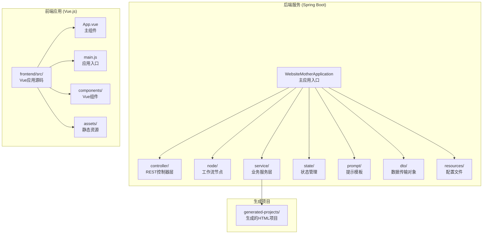
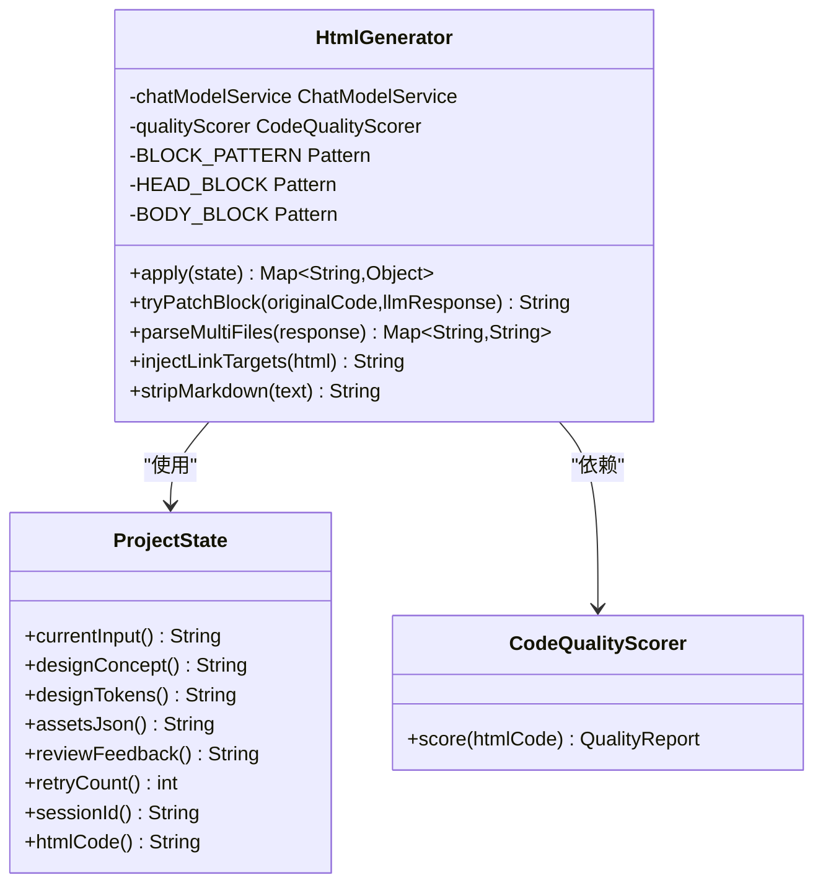
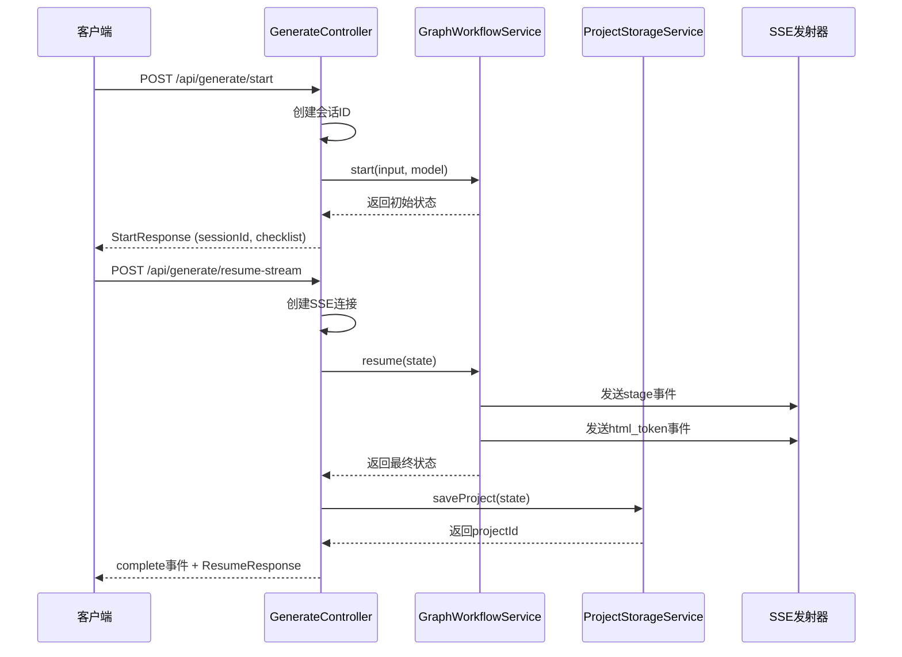
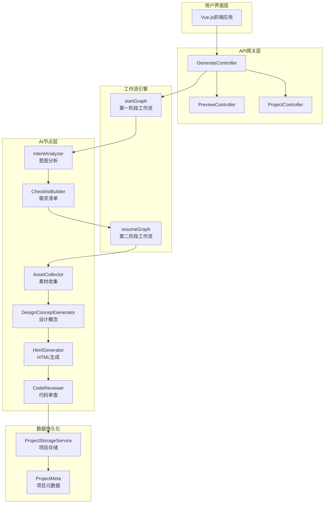
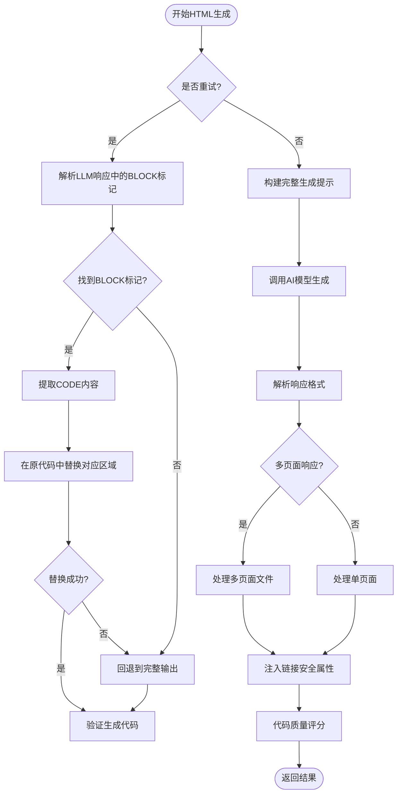
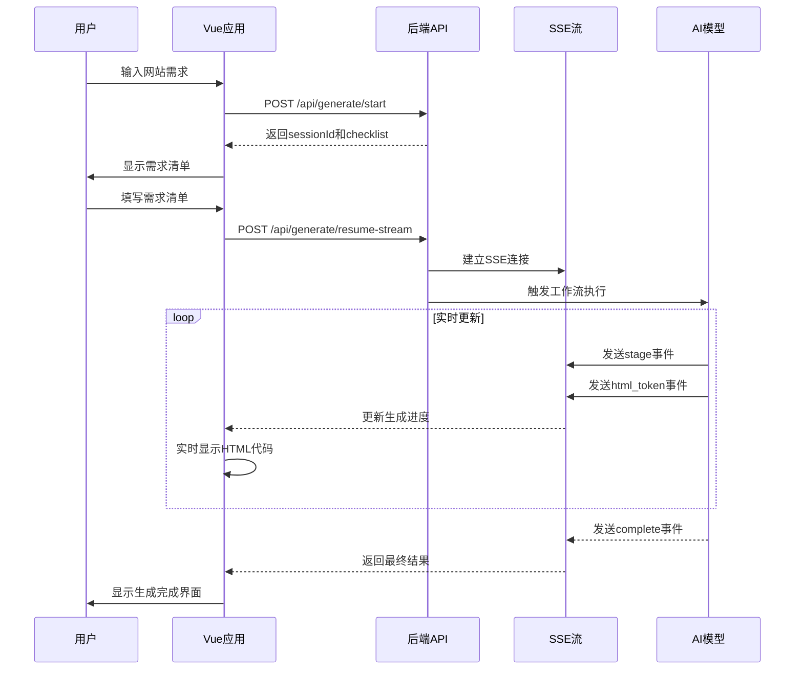
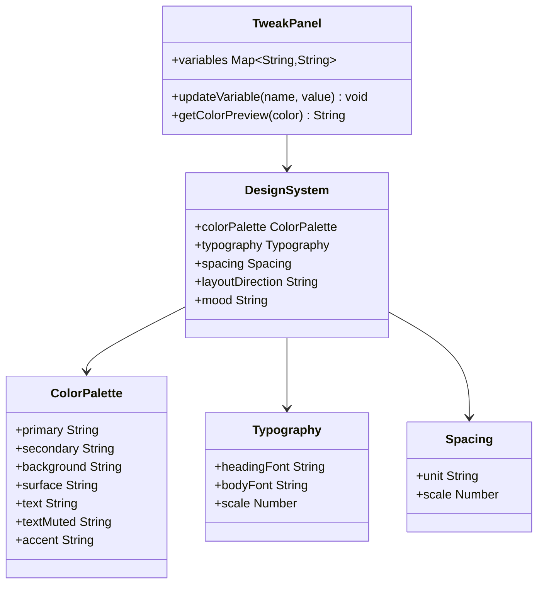
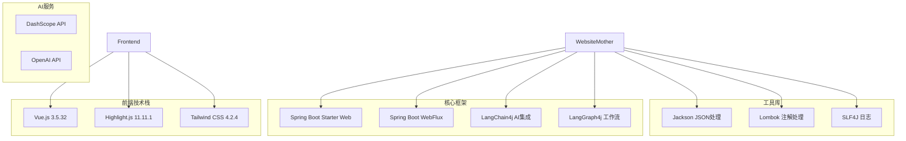

# HTML生成器

<cite>
**本文档中引用的文件**
- [HtmlGenerator.java](file://src/main/java/com/example/websitemother/node/HtmlGenerator.java)
- [GenerateController.java](file://src/main/java/com/example/websitemother/controller/GenerateController.java)
- [ProjectStorageService.java](file://src/main/java/com/example/websitemother/service/ProjectStorageService.java)
- [ProjectState.java](file://src/main/java/com/example/websitemother/state/ProjectState.java)
- [GraphWorkflowService.java](file://src/main/java/com/example/websitemother/service/GraphWorkflowService.java)
- [PromptTemplates.java](file://src/main/java/com/example/websitemother/prompt/PromptTemplates.java)
- [ProjectMeta.java](file://src/main/java/com/example/websitemother/dto/ProjectMeta.java)
- [App.vue](file://frontend/src/App.vue)
- [main.js](file://frontend/src/main.js)
- [pom.xml](file://pom.xml)
- [application.yml](file://src/main/resources/application.yml)
- [README.md](file://README.md)
</cite>

## 目录
1. [简介](#简介)
2. [项目结构](#项目结构)
3. [核心组件](#核心组件)
4. [架构概览](#架构概览)
5. [详细组件分析](#详细组件分析)
6. [依赖关系分析](#依赖关系分析)
7. [性能考虑](#性能考虑)
8. [故障排除指南](#故障排除指南)
9. [结论](#结论)

## 简介

WebsiteMother 是一个基于人工智能的HTML生成器，能够根据用户的需求自动生成完整的静态网站。该项目采用前后端分离的架构，后端使用Spring Boot构建RESTful API，前端使用Vue.js提供实时交互体验。

该系统的核心功能包括：
- 智能需求分析和意图识别
- 设计概念生成和设计系统定义
- 多页面HTML代码生成
- 代码质量审查和自动修复
- 实时流式生成和预览

系统支持多种AI模型，包括通义千问系列和DeepSeek系列，用户可以通过SSE（Server-Sent Events）实时查看生成进度。

## 项目结构

项目采用标准的Spring Boot项目结构，分为后端Java应用和前端Vue.js应用两个主要部分：

**图表来源**
- [pom.xml:1-124](file://pom.xml#L1-L124)
- [main.js:1-6](file://frontend/src/main.js#L1-L6)

**章节来源**
- [pom.xml:1-124](file://pom.xml#L1-L124)
- [README.md:1-3](file://README.md#L1-L3)

## 核心组件

### HTML生成器节点 (HtmlGenerator)

HtmlGenerator是工作流中的核心节点，负责将设计概念、素材和用户需求转换为完整的HTML代码。该组件支持两种生成模式：

1. **多页面生成模式**：生成包含多个HTML文件的完整网站
2. **单页面生成模式**：生成单一的HTML文件

**图表来源**
- [HtmlGenerator.java:26-134](file://src/main/java/com/example/websitemother/node/HtmlGenerator.java#L26-L134)
- [ProjectState.java:13-95](file://src/main/java/com/example/websitemother/state/ProjectState.java#L13-L95)

### 生成控制器 (GenerateController)

GenerateController提供REST API接口，处理用户请求并协调整个生成流程：

- `/api/generate/start`：启动生成流程
- `/api/generate/resume-stream`：流式继续生成
- `/api/generate/resume`：同步继续生成

**图表来源**
- [GenerateController.java:53-142](file://src/main/java/com/example/websitemother/controller/GenerateController.java#L53-L142)
- [GraphWorkflowService.java:32-63](file://src/main/java/com/example/websitemother/service/GraphWorkflowService.java#L32-L63)

### 项目存储服务 (ProjectStorageService)

ProjectStorageService负责将生成的HTML项目持久化到文件系统：

- 每个项目保存在`generated-projects/{projectId}/`目录下
- 支持多页面项目和单页面项目的统一存储
- 自动生成项目元数据文件

**章节来源**
- [HtmlGenerator.java:26-134](file://src/main/java/com/example/websitemother/node/HtmlGenerator.java#L26-L134)
- [GenerateController.java:53-188](file://src/main/java/com/example/websitemother/controller/GenerateController.java#L53-L188)
- [ProjectStorageService.java:27-102](file://src/main/java/com/example/websitemother/service/ProjectStorageService.java#L27-L102)

## 架构概览

系统采用LangGraph工作流框架，将复杂的生成过程分解为多个独立的节点：

**图表来源**
- [GenerateController.java:28-31](file://src/main/java/com/example/websitemother/controller/GenerateController.java#L28-L31)
- [GraphWorkflowService.java:18-24](file://src/main/java/com/example/websitemother/service/GraphWorkflowService.java#L18-L24)

## 详细组件分析

### HTML生成算法流程

HtmlGenerator实现了智能的增量修复机制，支持三种不同的生成策略：

**图表来源**
- [HtmlGenerator.java:140-186](file://src/main/java/com/example/websitemother/node/HtmlGenerator.java#L140-L186)
- [HtmlGenerator.java:197-223](file://src/main/java/com/example/websitemother/node/HtmlGenerator.java#L197-L223)

### 前端交互流程

前端Vue.js应用提供了完整的用户交互体验，支持实时流式显示和代码编辑：

**图表来源**
- [App.vue:102-212](file://frontend/src/App.vue#L102-L212)
- [GenerateController.java:82-142](file://src/main/java/com/example/websitemother/controller/GenerateController.java#L82-L142)

### 设计系统集成

系统实现了完整的CSS设计系统，支持动态调整和实时预览：

**图表来源**
- [PromptTemplates.java:56-86](file://src/main/java/com/example/websitemother/prompt/PromptTemplates.java#L56-L86)
- [App.vue:273-287](file://frontend/src/App.vue#L273-L287)

**章节来源**
- [HtmlGenerator.java:136-186](file://src/main/java/com/example/websitemother/node/HtmlGenerator.java#L136-L186)
- [App.vue:44-83](file://frontend/src/App.vue#L44-L83)
- [PromptTemplates.java:99-208](file://src/main/java/com/example/websitemother/prompt/PromptTemplates.java#L99-L208)

## 依赖关系分析

系统使用Maven管理依赖，主要依赖包括：

**图表来源**
- [pom.xml:33-68](file://pom.xml#L33-L68)

**章节来源**
- [pom.xml:33-68](file://pom.xml#L33-L68)
- [application.yml:9-14](file://src/main/resources/application.yml#L9-L14)

## 性能考虑

### 流式处理优化

系统采用了多项性能优化措施：

1. **SSE流式传输**：使用Server-Sent Events实现实时进度更新
2. **增量生成**：支持部分代码修复而非全量重新生成
3. **内存管理**：使用ConcurrentHashMap存储会话状态
4. **异步执行**：通过ExecutorService处理长时间运行的任务

### 代码质量保证

- **自动代码审查**：集成代码质量评分系统
- **设计系统约束**：强制使用CSS变量和设计令牌
- **链接安全性**：自动为外部链接添加安全属性
- **多模型支持**：支持不同性能级别的AI模型选择

## 故障排除指南

### 常见问题及解决方案

| 问题类型 | 症状 | 可能原因 | 解决方案 |
|---------|------|---------|---------|
| 生成超时 | SSE连接中断 | AI模型响应慢 | 检查API密钥配置，切换到更快速的模型 |
| 代码质量差 | 审查未通过 | 设计概念不明确 | 重新生成设计概念，完善需求清单 |
| 文件保存失败 | 项目无法持久化 | 磁盘权限问题 | 检查generated-projects目录权限 |
| 前端加载失败 | 页面空白 | 资源文件缺失 | 运行npm install安装依赖 |

### 调试信息

系统提供了详细的日志记录，包括：
- 工作流执行状态
- AI模型调用详情
- 代码生成进度
- 错误堆栈跟踪

**章节来源**
- [GenerateController.java:129-136](file://src/main/java/com/example/websitemother/controller/GenerateController.java#L129-L136)
- [HtmlGenerator.java:50-51](file://src/main/java/com/example/websitemother/node/HtmlGenerator.java#L50-L51)

## 结论

WebsiteMother HTML生成器是一个功能完整、架构清晰的AI驱动开发工具。它成功地将复杂的设计和开发流程抽象为可管理的工作流节点，为用户提供了直观的交互体验和高质量的代码输出。

### 主要优势

1. **智能化程度高**：完整的AI工作流支持从需求分析到代码生成的全流程自动化
2. **用户体验优秀**：实时流式显示和丰富的交互功能
3. **扩展性强**：模块化的架构设计便于功能扩展和定制
4. **质量保障**：内置的代码审查和质量评分系统

### 技术特色

- 基于LangGraph的工作流引擎
- 多模型AI集成支持
- 实时SSE流式传输
- 完整的设计系统实现
- 多页面项目生成能力

该系统为现代Web开发提供了一个高效、智能的解决方案，特别适合需要快速原型开发和设计验证的场景。