# Vue代码生成节点

<cite>
**本文档引用的文件**
- [VueGenerator.java](file://src/main/java/com/example/websitemother/node/VueGenerator.java)
- [CodeQualityScorer.java](file://src/main/java/com/example/websitemother/service/CodeQualityScorer.java)
- [AssetCollector.java](file://src/main/java/com/example/websitemother/node/AssetCollector.java)
- [IntentAnalyzer.java](file://src/main/java/com/example/websitemother/node/IntentAnalyzer.java)
- [CodeReviewer.java](file://src/main/java/com/example/websitemother/node/CodeReviewer.java)
- [ChatModelService.java](file://src/main/java/com/example/websitemother/service/ChatModelService.java)
- [PromptTemplates.java](file://src/main/java/com/example/websitemother/prompt/PromptTemplates.java)
- [ProjectState.java](file://src/main/java/com/example/websitemother/state/ProjectState.java)
- [GraphWorkflowService.java](file://src/main/java/com/example/websitemother/service/GraphWorkflowService.java)
- [GraphConfig.java](file://src/main/java/com/example/websitemother/config/GraphConfig.java)
- [ReviewRouter.java](file://src/main/java/com/example/websitemother/edge/ReviewRouter.java)
- [GenerateController.java](file://src/main/java/com/example/websitemother/controller/GenerateController.java)
- [App.vue](file://frontend/src/App.vue)
- [application.yml](file://src/main/resources/application.yml)
</cite>

## 更新摘要
**变更内容**
- 新增智能重试机制和分块增量修改支持
- 添加JavaScript保留字自动修复功能
- 集成代码质量评分系统
- 更新VueGenerator核心算法实现
- 增强代码审查和质量保证机制

## 目录
1. [简介](#简介)
2. [项目结构](#项目结构)
3. [核心组件](#核心组件)
4. [架构概览](#架构概览)
5. [详细组件分析](#详细组件分析)
6. [依赖关系分析](#依赖关系分析)
7. [性能考虑](#性能考虑)
8. [故障排除指南](#故障排除指南)
9. [结论](#结论)
10. [附录](#附录)

## 简介
本文件为VueGenerator Vue代码生成节点的全面技术文档。该节点位于LangGraph工作流的第四阶段，负责将用户需求与收集到的素材整合后，通过大语言模型生成完整的单文件Vue 3组件代码。**最新版本**增强了智能重试机制、块级增量修改支持、JavaScript保留字修复和代码质量评分系统，显著提升了代码生成的准确性和可靠性。

## 项目结构
系统采用前后端分离架构，后端使用Spring Boot + LangGraph4j构建状态图工作流，前端使用Vue 3 + Vite提供交互界面。核心流程分为两个阶段：
- 第一阶段：意图分析 → 清单生成（Human-in-the-loop暂停）
- 第二阶段：素材收集 → Vue代码生成 → 代码审查（条件循环）

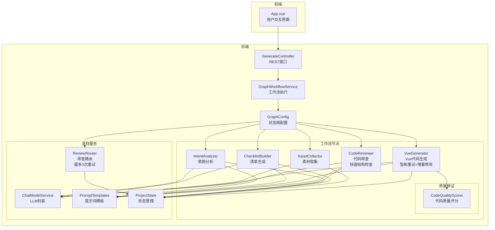

**图表来源**
- [GraphConfig.java:52-96](file://src/main/java/com/example/websitemother/config/GraphConfig.java#L52-L96)
- [GenerateController.java:33-84](file://src/main/java/com/example/websitemother/controller/GenerateController.java#L33-L84)
- [ChatModelService.java:33-49](file://src/main/java/com/example/websitemother/service/ChatModelService.java#L33-L49)

**章节来源**
- [GraphConfig.java:52-96](file://src/main/java/com/example/websitemother/config/GraphConfig.java#L52-L96)
- [GenerateController.java:33-84](file://src/main/java/com/example/websitemother/controller/GenerateController.java#L33-L84)

## 核心组件
VueGenerator作为工作流的第四节点，承担着将用户需求和素材转化为完整Vue代码的关键职责。**最新版本**具备以下增强功能：

### 主要职责
- 整合用户原始需求和补充信息
- 调用大语言模型生成Vue代码
- **智能重试机制**：支持分块增量修改修复
- **JavaScript保留字修复**：自动修正常见语法错误
- **代码质量评分**：提供量化质量评估
- 处理Markdown代码块标记清理
- 返回标准化的代码结果

### 关键特性
- **需求整合**：将currentInput和userAnswers合并为完整的业务需求描述
- **LLM集成**：通过ChatModelService调用DashScope Qwen模型
- **智能重试**：当代码审查失败时，支持精确的块级修改
- **代码清理**：自动移除```vue等代码块包装标记
- **保留字修复**：自动修正function等JavaScript保留字问题
- **质量评分**：提供结构完整性、视觉丰富度等多维度评分
- **状态管理**：通过ProjectState传递和接收数据

**章节来源**
- [VueGenerator.java:19-87](file://src/main/java/com/example/websitemother/node/VueGenerator.java#L19-L87)
- [ProjectState.java:15-24](file://src/main/java/com/example/websitemother/state/ProjectState.java#L15-L24)

## 架构概览
VueGenerator在整个系统架构中处于核心位置，连接着前端交互、工作流控制和LLM服务层。**新增的质量保证体系**确保代码生成的可靠性和准确性。

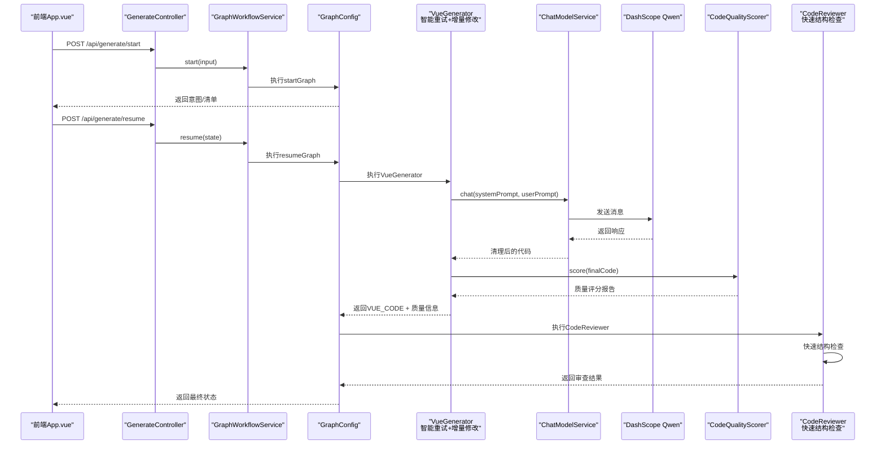

**图表来源**
- [GenerateController.java:33-84](file://src/main/java/com/example/websitemother/controller/GenerateController.java#L33-L84)
- [GraphWorkflowService.java:31-57](file://src/main/java/com/example/websitemother/service/GraphWorkflowService.java#L31-L57)
- [GraphConfig.java:78-96](file://src/main/java/com/example/websitemother/config/GraphConfig.java#L78-L96)
- [VueGenerator.java:42-87](file://src/main/java/com/example/websitemother/node/VueGenerator.java#L42-L87)
- [CodeReviewer.java:25-65](file://src/main/java/com/example/websitemother/node/CodeReviewer.java#L25-L65)

## 详细组件分析

### VueGenerator组件分析
VueGenerator实现了NodeAction接口，是工作流的核心节点。**最新版本**引入了多项重大增强功能。

#### 类结构设计
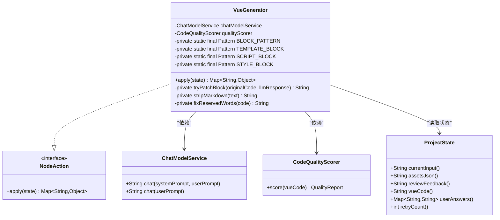

**图表来源**
- [VueGenerator.java:19-177](file://src/main/java/com/example/websitemother/node/VueGenerator.java#L19-L177)
- [ProjectState.java:30-76](file://src/main/java/com/example/websitemother/state/ProjectState.java#L30-L76)
- [ChatModelService.java:21-57](file://src/main/java/com/example/websitemother/service/ChatModelService.java#L21-L57)
- [CodeQualityScorer.java:16-101](file://src/main/java/com/example/websitemother/service/CodeQualityScorer.java#L16-L101)

#### 核心处理流程
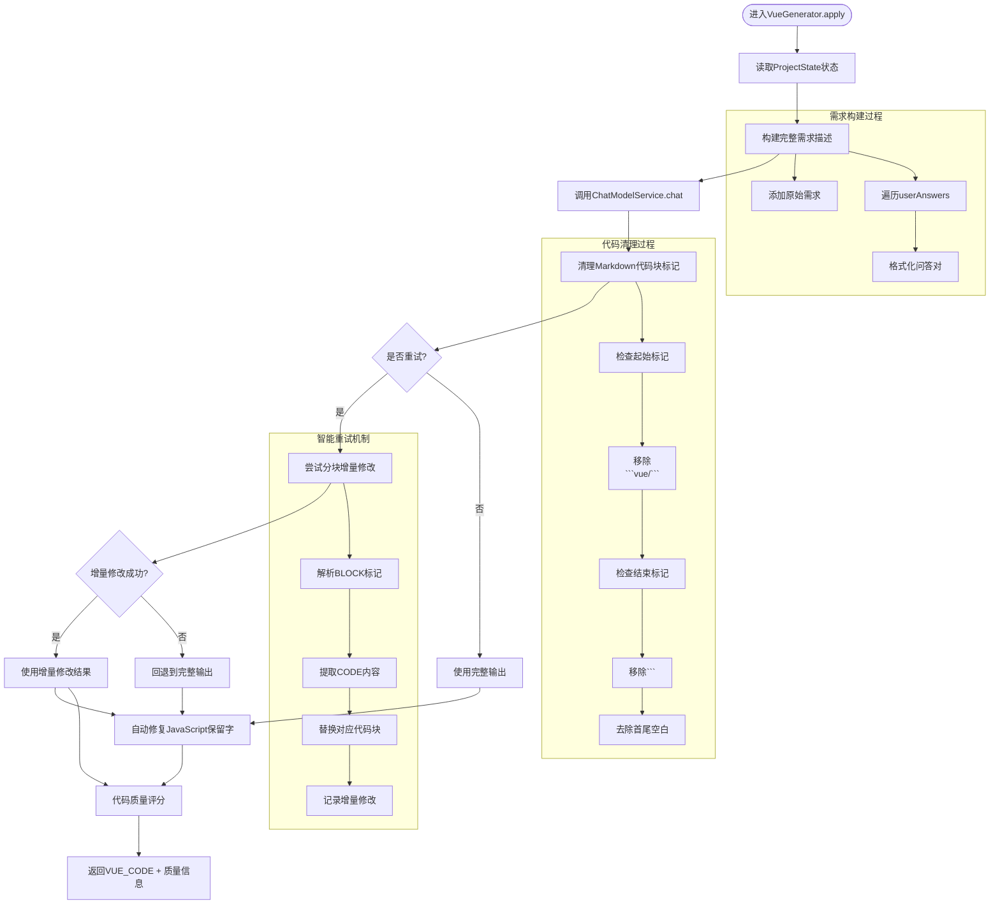

**图表来源**
- [VueGenerator.java:36-87](file://src/main/java/com/example/websitemother/node/VueGenerator.java#L36-L87)

#### 关键实现细节
1. **智能重试机制**：检测重试场景，支持分块增量修改而非完整重生成
2. **块级增量修改**：通过BLOCK和CODE标记实现精确的代码块替换
3. **JavaScript保留字修复**：自动修正function等保留字作为变量名的问题
4. **代码质量评分**：提供结构完整性、视觉丰富度等多维度质量评估
5. **需求整合策略**：将原始需求和用户补充信息组合成结构化文本
6. **LLM调用参数**：使用预定义的系统提示词和用户提示词模板
7. **代码清理机制**：智能识别并移除Markdown代码块包装
8. **错误处理**：通过日志记录和异常传播确保流程稳定性

**章节来源**
- [VueGenerator.java:19-177](file://src/main/java/com/example/websitemother/node/VueGenerator.java#L19-L177)
- [PromptTemplates.java:80-111](file://src/main/java/com/example/websitemother/prompt/PromptTemplates.java#L80-L111)

### 代码质量评分系统
**新增功能**：CodeQualityScorer提供全面的代码质量评估，基于规则化算法而非LLM调用。

#### 质量评分维度
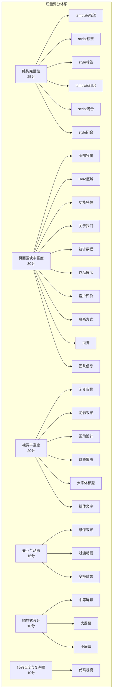

**图表来源**
- [CodeQualityScorer.java:18-90](file://src/main/java/com/example/websitemother/service/CodeQualityScorer.java#L18-L90)

#### 评分算法实现
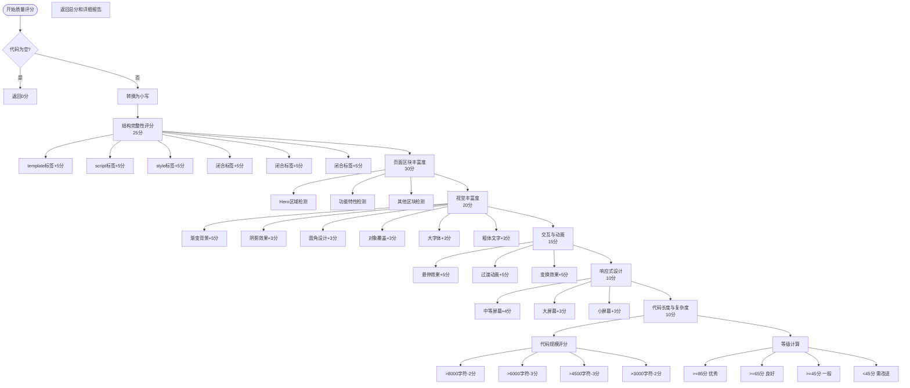

**图表来源**
- [CodeQualityScorer.java:18-90](file://src/main/java/com/example/websitemother/service/CodeQualityScorer.java#L18-L90)

**章节来源**
- [CodeQualityScorer.java:16-101](file://src/main/java/com/example/websitemother/service/CodeQualityScorer.java#L16-L101)

### 智能重试机制与块级增量修改
**新增功能**：当代码审查失败时，VueGenerator支持精确的块级修改而非完整重生成。

#### 增量修改流程
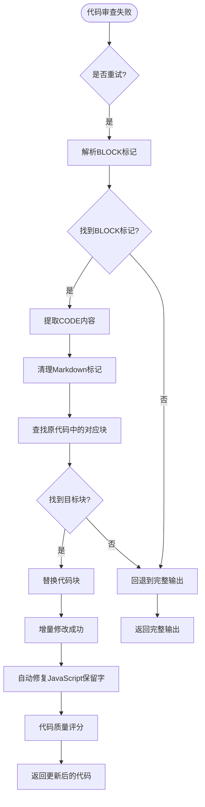

**图表来源**
- [VueGenerator.java:63-140](file://src/main/java/com/example/websitemother/node/VueGenerator.java#L63-L140)

#### 增量修改算法
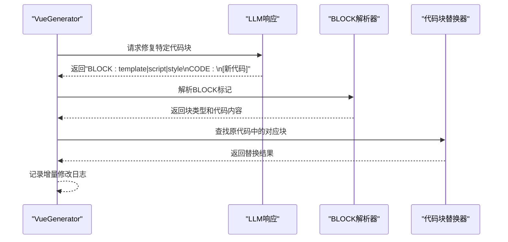

**图表来源**
- [VueGenerator.java:93-140](file://src/main/java/com/example/websitemother/node/VueGenerator.java#L93-L140)

**章节来源**
- [VueGenerator.java:63-140](file://src/main/java/com/example/websitemother/node/VueGenerator.java#L63-L140)
- [PromptTemplates.java:95-99](file://src/main/java/com/example/websitemother/prompt/PromptTemplates.java#L95-L99)

### JavaScript保留字修复
**新增功能**：自动修复JavaScript保留字作为变量名的常见问题。

#### 保留字修复机制
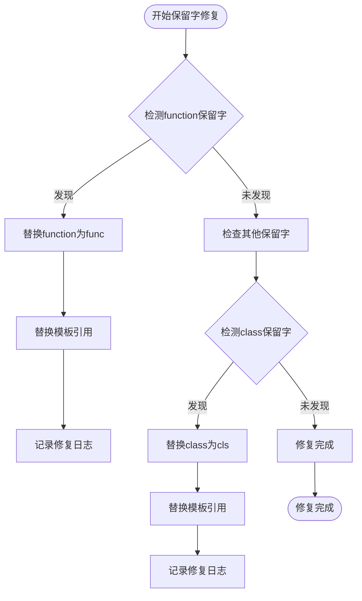

**图表来源**
- [VueGenerator.java:162-175](file://src/main/java/com/example/websitemother/node/VueGenerator.java#L162-L175)

#### 修复规则实现
```mermaid
graph TB
subgraph "function保留字修复"
FuncDetect["检测v-for=\"(function, 或 v-for='(function,'"]
FuncReplace["替换为v-for=\"(func,"]
FuncReplace2["替换为v-for='(func,'"]
FuncRefs["替换模板引用{{ function."]
FuncRefs2["替换属性绑定:function."]
FuncLog["记录修复日志"]
end
```

**图表来源**
- [VueGenerator.java:162-175](file://src/main/java/com/example/websitemother/node/VueGenerator.java#L162-L175)

**章节来源**
- [VueGenerator.java:162-175](file://src/main/java/com/example/websitemother/node/VueGenerator.java#L162-L175)

### 资源收集与处理
虽然VueGenerator不直接处理图片资源，但其上游节点AssetCollector负责生成占位图片URL，为代码生成提供素材支持。

#### 素材收集流程


**图表来源**
- [AssetCollector.java:23-58](file://src/main/java/com/example/websitemother/node/AssetCollector.java#L23-L58)

**章节来源**
- [AssetCollector.java:23-89](file://src/main/java/com/example/websitemother/node/AssetCollector.java#L23-L89)

### LLM集成与提示词系统
系统通过ChatModelService封装了对DashScope Qwen模型的调用，PromptTemplates集中管理所有提示词模板。**新增了智能重试的提示词格式**。

#### 提示词模板结构
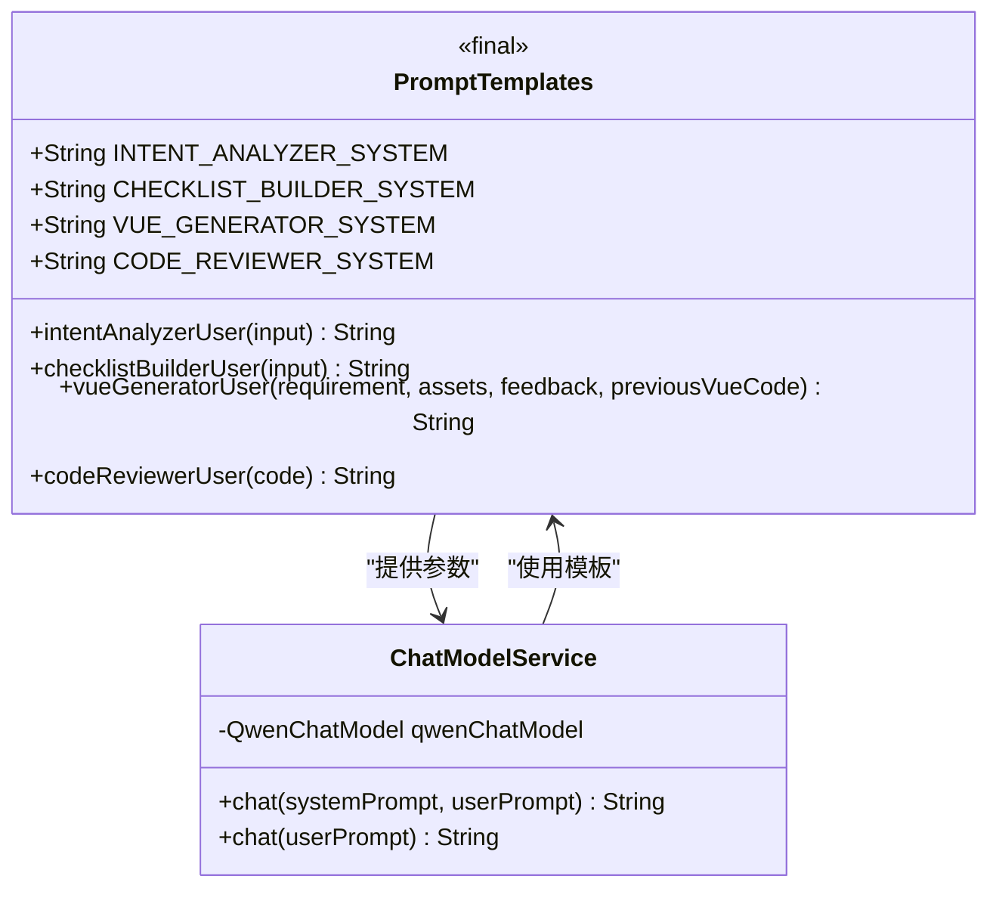

**图表来源**
- [PromptTemplates.java:7-92](file://src/main/java/com/example/websitemother/prompt/PromptTemplates.java#L7-L92)
- [ChatModelService.java:21-57](file://src/main/java/com/example/websitemother/service/ChatModelService.java#L21-L57)

#### LLM调用流程
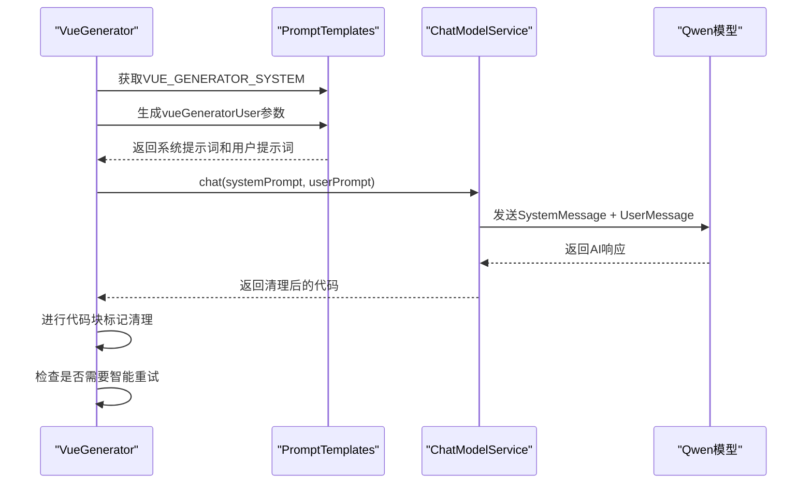

**图表来源**
- [VueGenerator.java:55-76](file://src/main/java/com/example/websitemother/node/VueGenerator.java#L55-L76)
- [ChatModelService.java:33-49](file://src/main/java/com/example/websitemother/service/ChatModelService.java#L33-L49)

**章节来源**
- [PromptTemplates.java:80-111](file://src/main/java/com/example/websitemother/prompt/PromptTemplates.java#L80-L111)
- [ChatModelService.java:33-49](file://src/main/java/com/example/websitemother/service/ChatModelService.java#L33-L49)

### 代码审查与质量保证
**增强功能**：CodeReviewer节点现在集成了快速结构检查和自动修复能力，配合VueGenerator的质量评分系统。

#### 审查流程设计
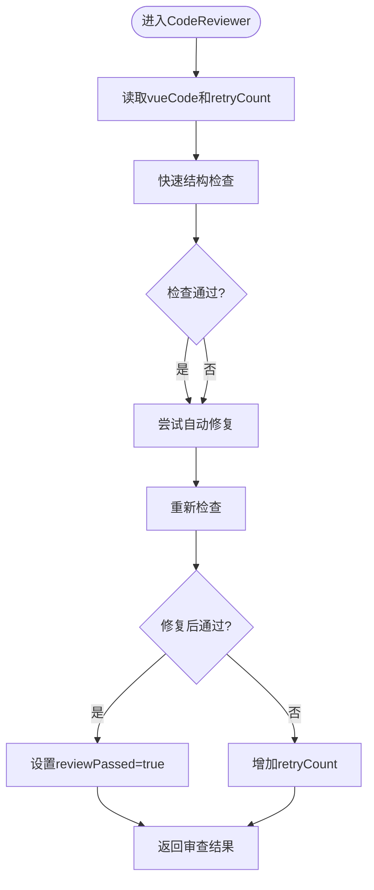

**图表来源**
- [CodeReviewer.java:25-65](file://src/main/java/com/example/websitemother/node/CodeReviewer.java#L25-L65)

#### 快速结构检查算法
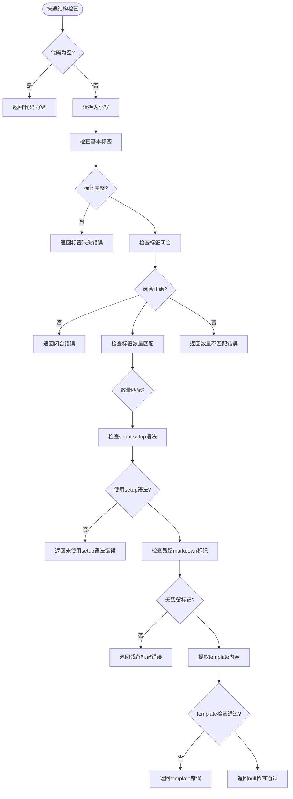

**图表来源**
- [CodeReviewer.java:72-128](file://src/main/java/com/example/websitemother/node/CodeReviewer.java#L72-L128)

**章节来源**
- [CodeReviewer.java:25-199](file://src/main/java/com/example/websitemother/node/CodeReviewer.java#L25-L199)

## 依赖关系分析
系统采用松耦合设计，各组件通过接口和状态共享实现解耦。**新增的CodeQualityScorer**为VueGenerator提供了独立的质量评估能力。

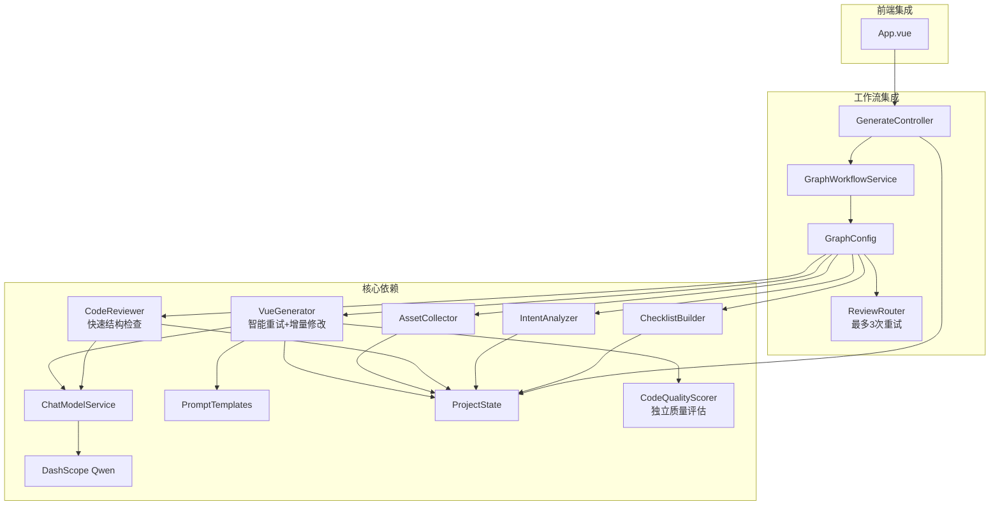

**图表来源**
- [GraphConfig.java:32-45](file://src/main/java/com/example/websitemother/config/GraphConfig.java#L32-L45)
- [GraphWorkflowService.java:19-23](file://src/main/java/com/example/websitemother/service/GraphWorkflowService.java#L19-L23)
- [GenerateController.java:24-25](file://src/main/java/com/example/websitemother/controller/GenerateController.java#L24-L25)

### 组件耦合度分析
- **低耦合设计**：各节点通过ProjectState进行数据交换，减少直接依赖
- **接口隔离**：NodeAction接口统一了节点行为规范
- **服务封装**：ChatModelService封装了LLM调用细节
- **模板管理**：PromptTemplates集中管理提示词，便于维护和优化
- **独立质量评估**：CodeQualityScorer提供独立的服务，不依赖LLM调用

**章节来源**
- [GraphConfig.java:52-96](file://src/main/java/com/example/websitemother/config/GraphConfig.java#L52-L96)
- [ProjectState.java:13-77](file://src/main/java/com/example/websitemother/state/ProjectState.java#L13-L77)

## 性能考虑
系统在多个层面进行了性能优化设计，**新增的质量评分系统完全基于规则算法，无需额外的LLM调用**。

### 异步处理
- 使用node_async和edge_async实现异步节点和边处理
- 避免阻塞操作影响整体工作流性能

### 缓存策略
- 前端使用内存会话存储（演示用途）
- 生产环境建议使用Redis等分布式缓存

### 错误处理
- 统一日志记录，便于性能监控和问题定位
- 异常向上抛出，确保工作流完整性

### LLM调用优化
- 参数化提示词模板，减少重复计算
- 结果清理采用高效字符串处理
- **智能重试机制避免不必要的完整重生成**

### 质量评分优化
- **零额外token消耗**：完全基于规则算法的质量评估
- **快速执行**：字符串匹配和正则表达式操作
- **可扩展性**：易于添加新的评分维度

## 故障排除指南
针对VueGenerator相关的常见问题提供排查指导，**新增了智能重试和质量评分相关的故障排除**。

### LLM调用失败
**症状**：工作流执行异常，出现AI服务调用异常错误
**排查步骤**：
1. 检查application.yml中的API密钥配置
2. 验证网络连通性和防火墙设置
3. 查看ChatModelService的日志输出
4. 确认DashScope服务可用性

**章节来源**
- [application.yml:4-8](file://src/main/resources/application.yml#L4-L8)
- [ChatModelService.java:45-48](file://src/main/java/com/example/websitemother/service/ChatModelService.java#L45-L48)

### 智能重试机制问题
**症状**：代码审查失败但重试无效
**排查步骤**：
1. 检查LLM响应格式是否包含正确的BLOCK标记
2. 验证代码块解析器能否正确识别原代码中的对应块
3. 查看日志中关于增量修改的记录
4. 确认ProjectState中的retryCount状态

**章节来源**
- [VueGenerator.java:63-140](file://src/main/java/com/example/websitemother/node/VueGenerator.java#L63-L140)
- [PromptTemplates.java:95-99](file://src/main/java/com/example/websitemother/prompt/PromptTemplates.java#L95-L99)

### JavaScript保留字修复问题
**症状**：保留字修复未生效或过度修复
**排查步骤**：
1. 检查保留字检测正则表达式的准确性
2. 验证修复规则的适用范围
3. 查看日志中的修复记录
4. 确认修复后的代码语法正确性

**章节来源**
- [VueGenerator.java:162-175](file://src/main/java/com/example/websitemother/node/VueGenerator.java#L162-L175)

### 代码质量评分异常
**症状**：质量评分结果不符合预期
**排查步骤**：
1. 检查CodeQualityScorer的评分逻辑
2. 验证各评分维度的权重分配
3. 查看评分详情中的具体扣分原因
4. 确认代码中是否包含预期的特征

**章节来源**
- [CodeQualityScorer.java:18-90](file://src/main/java/com/example/websitemother/service/CodeQualityScorer.java#L18-L90)

### 工作流执行问题
**症状**：工作流中断或状态异常
**排查步骤**：
1. 检查GraphConfig中的节点配置和边连接
2. 验证ReviewRouter的条件判断逻辑（最多3次重试）
3. 确认ProjectState的状态字段完整性
4. 查看GraphWorkflowService的执行日志

**章节来源**
- [GraphConfig.java:78-96](file://src/main/java/com/example/websitemother/config/GraphConfig.java#L78-L96)
- [ReviewRouter.java:22-43](file://src/main/java/com/example/websitemother/edge/ReviewRouter.java#L22-L43)

## 结论
VueGenerator节点通过**重大功能增强**实现了更智能、更可靠的Vue代码生成。新增的智能重试机制支持精确的块级增量修改，JavaScript保留字修复确保代码语法正确性，代码质量评分系统提供量化的质量评估。这些改进使得系统能够更好地处理复杂的代码生成场景，显著提升了用户体验和代码质量。

## 附录

### 最佳实践指南
1. **提示词优化**：定期更新PromptTemplates以提升代码质量
2. **状态管理**：合理使用ProjectState确保数据一致性
3. **错误处理**：完善异常捕获和日志记录机制
4. **性能监控**：建立工作流执行时间监控体系
5. **质量保证**：利用CodeQualityScorer进行持续的质量监控
6. **智能重试**：合理使用重试机制避免无限循环

### 模板定制指南
- 系统提示词应明确代码规范和约束条件
- 用户提示词需包含足够的上下文信息
- **智能重试提示词**应明确BLOCK和CODE的格式要求
- 审查提示词应覆盖常见的代码质量问题

### 调试技巧
- 使用详细的日志输出追踪工作流执行
- 通过单元测试验证各个节点的功能
- 利用前端界面观察状态变化和错误信息
- **质量评分调试**：查看CodeQualityScorer的详细评分报告
- **重试机制调试**：监控BLOCK标记解析和代码块替换过程

### 新功能使用指南
1. **智能重试机制**：当代码审查失败时，LLM响应中应包含BLOCK和CODE标记
2. **块级增量修改**：支持template、script、style三种代码块的精确替换
3. **JavaScript保留字修复**：自动修正function、class等保留字问题
4. **代码质量评分**：系统会自动计算并记录代码质量分数