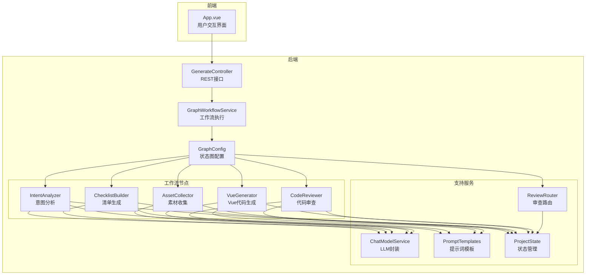
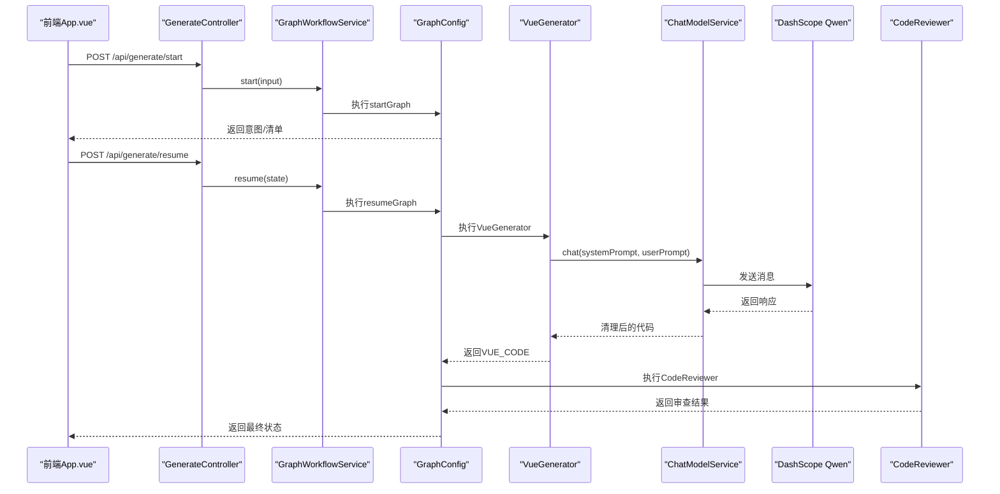
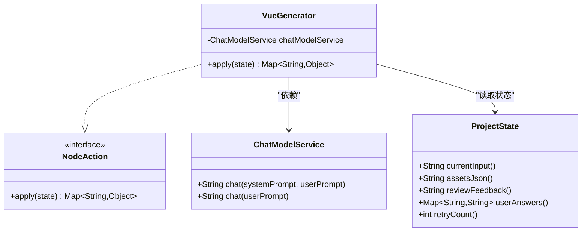
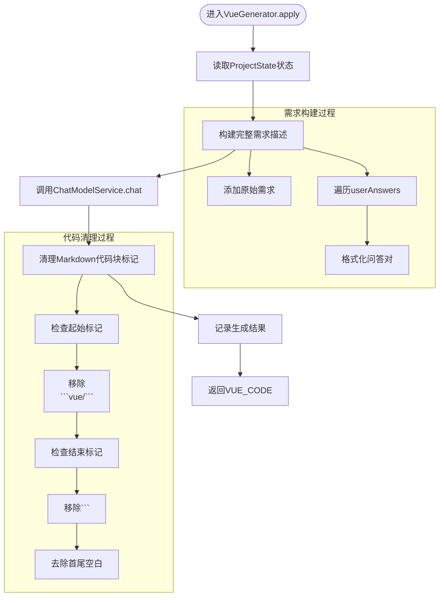
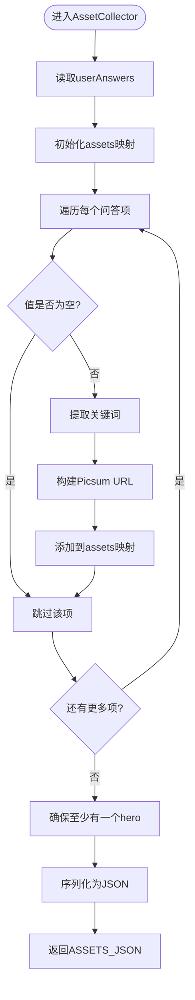
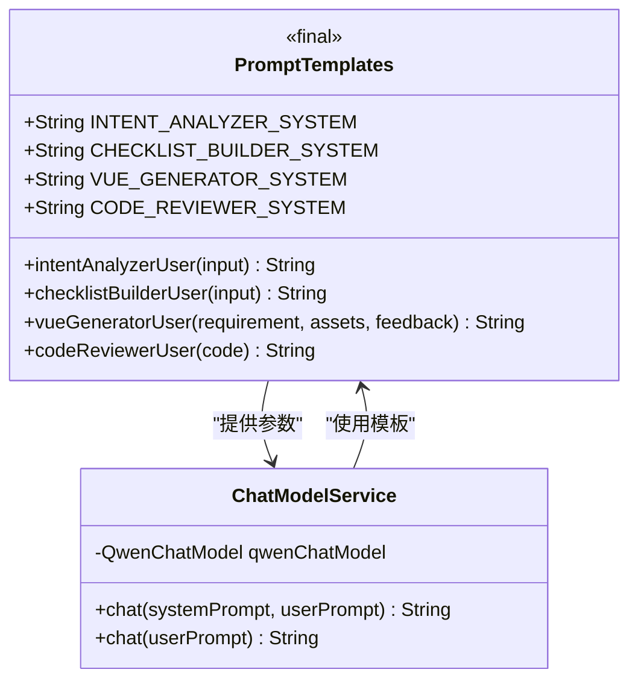
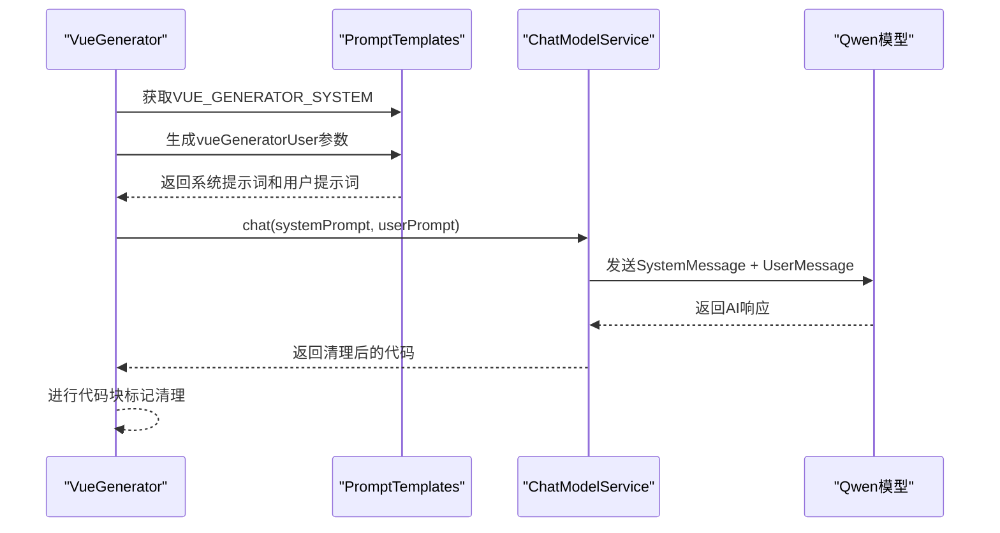
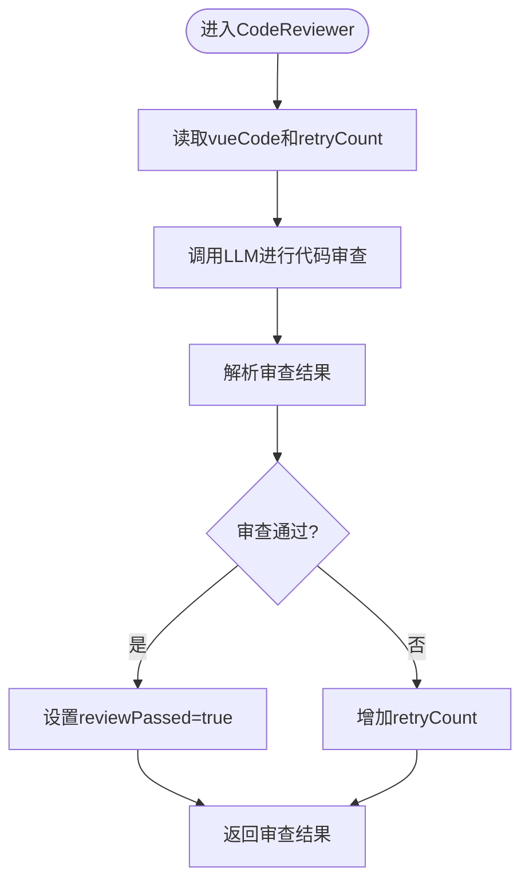
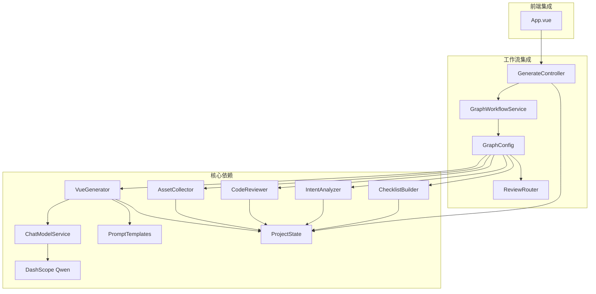

# Vue代码生成节点

<cite>
**本文档引用的文件**
- [VueGenerator.java](file://src/main/java/com/example/websitemother/node/VueGenerator.java)
- [AssetCollector.java](file://src/main/java/com/example/websitemother/node/AssetCollector.java)
- [IntentAnalyzer.java](file://src/main/java/com/example/websitemother/node/IntentAnalyzer.java)
- [CodeReviewer.java](file://src/main/java/com/example/websitemother/node/CodeReviewer.java)
- [ChatModelService.java](file://src/main/java/com/example/websitemother/service/ChatModelService.java)
- [PromptTemplates.java](file://src/main/java/com/example/websitemother/prompt/PromptTemplates.java)
- [ProjectState.java](file://src/main/java/com/example/websitemother/state/ProjectState.java)
- [GraphWorkflowService.java](file://src/main/java/com/example/websitemother/service/GraphWorkflowService.java)
- [GraphConfig.java](file://src/main/java/com/example/websitemother/config/GraphConfig.java)
- [ReviewRouter.java](file://src/main/java/com/example/websitemother/edge/ReviewRouter.java)
- [GenerateController.java](file://src/main/java/com/example/websitemother/controller/GenerateController.java)
- [App.vue](file://frontend/src/App.vue)
- [application.yml](file://src/main/resources/application.yml)
</cite>

## 目录
1. [简介](#简介)
2. [项目结构](#项目结构)
3. [核心组件](#核心组件)
4. [架构概览](#架构概览)
5. [详细组件分析](#详细组件分析)
6. [依赖关系分析](#依赖关系分析)
7. [性能考虑](#性能考虑)
8. [故障排除指南](#故障排除指南)
9. [结论](#结论)
10. [附录](#附录)

## 简介
本文件为VueGenerator Vue代码生成节点的全面技术文档。该节点位于LangGraph工作流的第四阶段，负责将用户需求与收集到的素材整合后，通过大语言模型生成完整的单文件Vue 3组件代码。文档将深入解析代码模板系统、组件生成逻辑、样式集成机制以及图片资源处理流程，同时说明LLM在代码生成中的作用、模板渲染策略和代码结构优化方法。

## 项目结构
系统采用前后端分离架构，后端使用Spring Boot + LangGraph4j构建状态图工作流，前端使用Vue 3 + Vite提供交互界面。核心流程分为两个阶段：
- 第一阶段：意图分析 → 清单生成（Human-in-the-loop暂停）
- 第二阶段：素材收集 → Vue代码生成 → 代码审查（条件循环）



**图表来源**
- [GraphConfig.java:52-96](file://src/main/java/com/example/websitemother/config/GraphConfig.java#L52-L96)
- [GenerateController.java:33-84](file://src/main/java/com/example/websitemother/controller/GenerateController.java#L33-L84)
- [ChatModelService.java:33-49](file://src/main/java/com/example/websitemother/service/ChatModelService.java#L33-L49)

**章节来源**
- [GraphConfig.java:52-96](file://src/main/java/com/example/websitemother/config/GraphConfig.java#L52-L96)
- [GenerateController.java:33-84](file://src/main/java/com/example/websitemother/controller/GenerateController.java#L33-L84)

## 核心组件
VueGenerator作为工作流的第四节点，承担着将用户需求和素材转化为完整Vue代码的关键职责。其核心功能包括：

### 主要职责
- 整合用户原始需求和补充信息
- 调用大语言模型生成Vue代码
- 处理Markdown代码块标记清理
- 返回标准化的代码结果

### 关键特性
- **需求整合**：将currentInput和userAnswers合并为完整的业务需求描述
- **LLM集成**：通过ChatModelService调用DashScope Qwen模型
- **代码清理**：自动移除```vue等代码块包装标记
- **状态管理**：通过ProjectState传递和接收数据

**章节来源**
- [VueGenerator.java:24-62](file://src/main/java/com/example/websitemother/node/VueGenerator.java#L24-L62)
- [ProjectState.java:15-24](file://src/main/java/com/example/websitemother/state/ProjectState.java#L15-L24)

## 架构概览
VueGenerator在整个系统架构中处于核心位置，连接着前端交互、工作流控制和LLM服务层。



**图表来源**
- [GenerateController.java:33-84](file://src/main/java/com/example/websitemother/controller/GenerateController.java#L33-L84)
- [GraphWorkflowService.java:31-57](file://src/main/java/com/example/websitemother/service/GraphWorkflowService.java#L31-L57)
- [GraphConfig.java:78-96](file://src/main/java/com/example/websitemother/config/GraphConfig.java#L78-L96)
- [VueGenerator.java:42-45](file://src/main/java/com/example/websitemother/node/VueGenerator.java#L42-L45)
- [CodeReviewer.java:31-34](file://src/main/java/com/example/websitemother/node/CodeReviewer.java#L31-L34)

## 详细组件分析

### VueGenerator组件分析
VueGenerator实现了NodeAction接口，是工作流的核心节点。

#### 类结构设计


**图表来源**
- [VueGenerator.java:19-62](file://src/main/java/com/example/websitemother/node/VueGenerator.java#L19-L62)
- [ProjectState.java:30-76](file://src/main/java/com/example/websitemother/state/ProjectState.java#L30-L76)
- [ChatModelService.java:21-57](file://src/main/java/com/example/websitemother/service/ChatModelService.java#L21-L57)

#### 核心处理流程


**图表来源**
- [VueGenerator.java:25-61](file://src/main/java/com/example/websitemother/node/VueGenerator.java#L25-L61)

#### 关键实现细节
1. **需求整合策略**：将原始需求和用户补充信息组合成结构化文本
2. **LLM调用参数**：使用预定义的系统提示词和用户提示词模板
3. **代码清理机制**：智能识别并移除Markdown代码块包装
4. **错误处理**：通过日志记录和异常传播确保流程稳定性

**章节来源**
- [VueGenerator.java:24-62](file://src/main/java/com/example/websitemother/node/VueGenerator.java#L24-L62)
- [PromptTemplates.java:46-72](file://src/main/java/com/example/websitemother/prompt/PromptTemplates.java#L46-L72)

### 资源收集与处理
虽然VueGenerator不直接处理图片资源，但其上游节点AssetCollector负责生成占位图片URL，为代码生成提供素材支持。

#### 素材收集流程


**图表来源**
- [AssetCollector.java:23-58](file://src/main/java/com/example/websitemother/node/AssetCollector.java#L23-L58)

**章节来源**
- [AssetCollector.java:23-89](file://src/main/java/com/example/websitemother/node/AssetCollector.java#L23-L89)

### LLM集成与提示词系统
系统通过ChatModelService封装了对DashScope Qwen模型的调用，PromptTemplates集中管理所有提示词模板。

#### 提示词模板结构


**图表来源**
- [PromptTemplates.java:7-92](file://src/main/java/com/example/websitemother/prompt/PromptTemplates.java#L7-L92)
- [ChatModelService.java:21-57](file://src/main/java/com/example/websitemother/service/ChatModelService.java#L21-L57)

#### LLM调用流程


**图表来源**
- [VueGenerator.java:42-45](file://src/main/java/com/example/websitemother/node/VueGenerator.java#L42-L45)
- [ChatModelService.java:33-49](file://src/main/java/com/example/websitemother/service/ChatModelService.java#L33-L49)

**章节来源**
- [PromptTemplates.java:46-91](file://src/main/java/com/example/websitemother/prompt/PromptTemplates.java#L46-L91)
- [ChatModelService.java:33-49](file://src/main/java/com/example/websitemother/service/ChatModelService.java#L33-L49)

### 代码审查与质量保证
CodeReviewer节点负责验证生成的Vue代码质量，确保代码符合规范要求。

#### 审查流程设计


**图表来源**
- [CodeReviewer.java:25-58](file://src/main/java/com/example/websitemother/node/CodeReviewer.java#L25-L58)

**章节来源**
- [CodeReviewer.java:25-61](file://src/main/java/com/example/websitemother/node/CodeReviewer.java#L25-L61)

## 依赖关系分析
系统采用松耦合设计，各组件通过接口和状态共享实现解耦。



**图表来源**
- [GraphConfig.java:32-45](file://src/main/java/com/example/websitemother/config/GraphConfig.java#L32-L45)
- [GraphWorkflowService.java:19-23](file://src/main/java/com/example/websitemother/service/GraphWorkflowService.java#L19-L23)
- [GenerateController.java:24-25](file://src/main/java/com/example/websitemother/controller/GenerateController.java#L24-L25)

### 组件耦合度分析
- **低耦合设计**：各节点通过ProjectState进行数据交换，减少直接依赖
- **接口隔离**：NodeAction接口统一了节点行为规范
- **服务封装**：ChatModelService封装了LLM调用细节
- **模板管理**：PromptTemplates集中管理提示词，便于维护和优化

**章节来源**
- [GraphConfig.java:52-96](file://src/main/java/com/example/websitemother/config/GraphConfig.java#L52-L96)
- [ProjectState.java:13-77](file://src/main/java/com/example/websitemother/state/ProjectState.java#L13-L77)

## 性能考虑
系统在多个层面进行了性能优化设计：

### 异步处理
- 使用node_async和edge_async实现异步节点和边处理
- 避免阻塞操作影响整体工作流性能

### 缓存策略
- 前端使用内存会话存储（演示用途）
- 生产环境建议使用Redis等分布式缓存

### 错误处理
- 统一日志记录，便于性能监控和问题定位
- 异常向上抛出，确保工作流完整性

### LLM调用优化
- 参数化提示词模板，减少重复计算
- 结果清理采用高效字符串处理

## 故障排除指南
针对VueGenerator相关的常见问题提供排查指导：

### LLM调用失败
**症状**：工作流执行异常，出现AI服务调用异常错误
**排查步骤**：
1. 检查application.yml中的API密钥配置
2. 验证网络连通性和防火墙设置
3. 查看ChatModelService的日志输出
4. 确认DashScope服务可用性

**章节来源**
- [application.yml:4-8](file://src/main/resources/application.yml#L4-L8)
- [ChatModelService.java:45-48](file://src/main/java/com/example/websitemother/service/ChatModelService.java#L45-L48)

### 代码生成异常
**症状**：VueGenerator无法生成有效代码
**排查步骤**：
1. 检查PromptTemplates中的系统提示词配置
2. 验证用户输入和素材数据的完整性
3. 查看代码清理逻辑是否正确处理Markdown标记
4. 确认ProjectState状态数据传递正常

**章节来源**
- [VueGenerator.java:47-57](file://src/main/java/com/example/websitemother/node/VueGenerator.java#L47-L57)
- [PromptTemplates.java:46-72](file://src/main/java/com/example/websitemother/prompt/PromptTemplates.java#L46-L72)

### 工作流执行问题
**症状**：工作流中断或状态异常
**排查步骤**：
1. 检查GraphConfig中的节点配置和边连接
2. 验证ReviewRouter的条件判断逻辑
3. 确认ProjectState的状态字段完整性
4. 查看GraphWorkflowService的执行日志

**章节来源**
- [GraphConfig.java:78-96](file://src/main/java/com/example/websitemother/config/GraphConfig.java#L78-L96)
- [ReviewRouter.java:22-41](file://src/main/java/com/example/websitemother/edge/ReviewRouter.java#L22-L41)

## 结论
VueGenerator节点通过精心设计的提示词模板、严格的代码清理机制和完善的错误处理，实现了高质量的Vue代码生成。系统采用LangGraph4j构建的工作流架构，确保了流程的可控性和可扩展性。通过LLM与传统工程实践的结合，为用户提供了一种全新的低代码开发体验。

## 附录

### 最佳实践指南
1. **提示词优化**：定期更新PromptTemplates以提升代码质量
2. **状态管理**：合理使用ProjectState确保数据一致性
3. **错误处理**：完善异常捕获和日志记录机制
4. **性能监控**：建立工作流执行时间监控体系

### 模板定制指南
- 系统提示词应明确代码规范和约束条件
- 用户提示词需包含足够的上下文信息
- 审查提示词应覆盖常见的代码质量问题

### 调试技巧
- 使用详细的日志输出追踪工作流执行
- 通过单元测试验证各个节点的功能
- 利用前端界面观察状态变化和错误信息