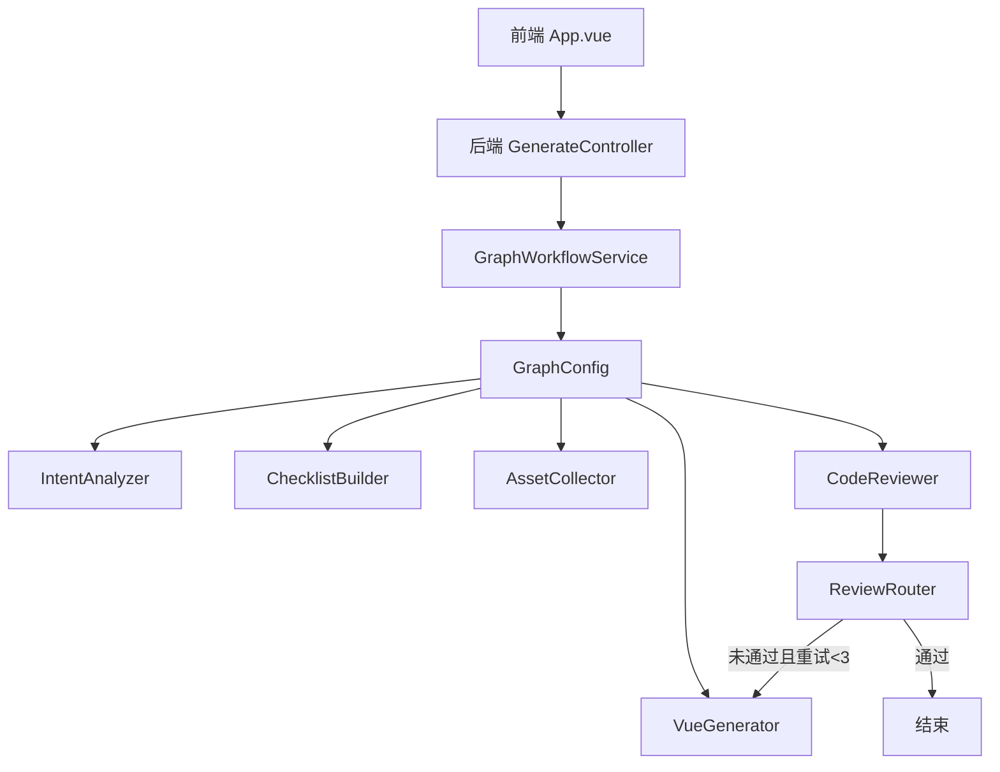
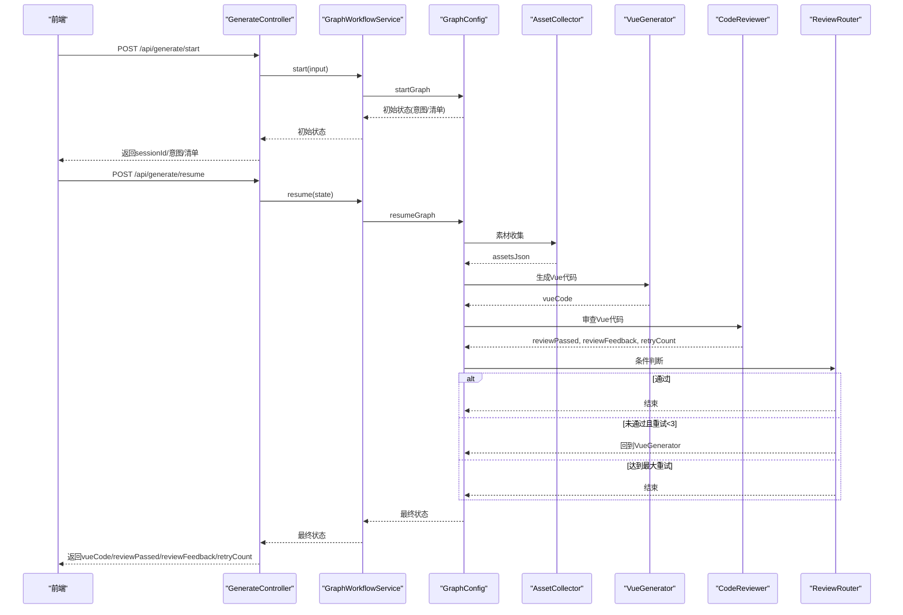
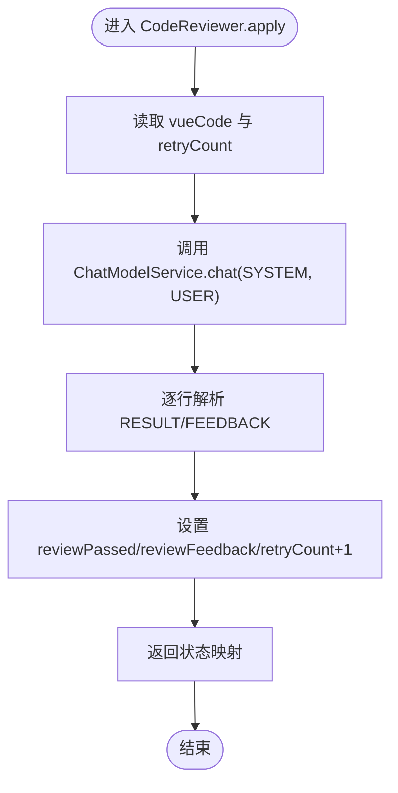
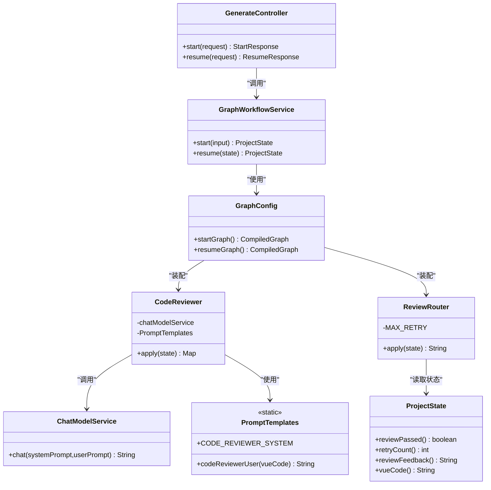
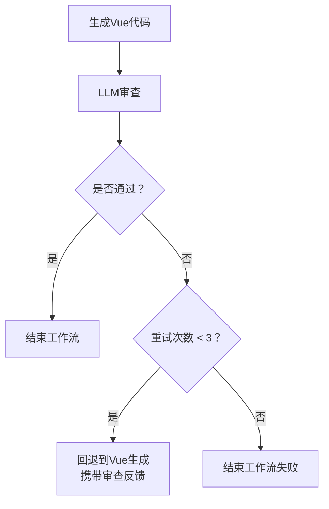

# 代码审查节点

<cite>
**本文引用的文件列表**
- [CodeReviewer.java](file://src/main/java/com/example/websitemother/node/CodeReviewer.java)
- [ReviewRouter.java](file://src/main/java/com/example/websitemother/edge/ReviewRouter.java)
- [PromptTemplates.java](file://src/main/java/com/example/websitemother/prompt/PromptTemplates.java)
- [ChatModelService.java](file://src/main/java/com/example/websitemother/service/ChatModelService.java)
- [ProjectState.java](file://src/main/java/com/example/websitemother/state/ProjectState.java)
- [GraphWorkflowService.java](file://src/main/java/com/example/websitemother/service/GraphWorkflowService.java)
- [GraphConfig.java](file://src/main/java/com/example/websitemother/config/GraphConfig.java)
- [GenerateController.java](file://src/main/java/com/example/websitemother/controller/GenerateController.java)
- [VueGenerator.java](file://src/main/java/com/example/websitemother/node/VueGenerator.java)
- [AssetCollector.java](file://src/main/java/com/example/websitemother/node/AssetCollector.java)
- [IntentAnalyzer.java](file://src/main/java/com/example/websitemother/node/IntentAnalyzer.java)
- [App.vue](file://frontend/src/App.vue)
- [HelloWorld.vue](file://frontend/src/components/HelloWorld.vue)
</cite>

## 目录
1. [简介](#简介)
2. [项目结构](#项目结构)
3. [核心组件](#核心组件)
4. [架构总览](#架构总览)
5. [详细组件分析](#详细组件分析)
6. [依赖关系分析](#依赖关系分析)
7. [性能考量](#性能考量)
8. [故障排查指南](#故障排查指南)
9. [结论](#结论)
10. [附录](#附录)

## 简介
本文件面向“代码审查节点”（CodeReviewer），系统化阐述其在生成Vue代码的质量控制与优化中的作用与实现。重点包括：
- 审查标准与规则制定逻辑
- 语法与规范检查机制
- 错误修复建议生成策略
- LLM在代码分析中的角色
- 审查流程、问题检测与修复建议的推荐方式
- 最佳实践、质量标准与持续改进策略

## 项目结构
该项目采用前后端分离架构，后端以Spring Boot + LangGraph4j构建状态机工作流，前端使用Vue 3 + Vite。代码审查节点位于后端LangGraph工作流的第二阶段，负责对生成的Vue代码进行严格审查，并通过条件边决定是否重生成或结束流程。

图表来源
- [GraphConfig.java:76-97](file://src/main/java/com/example/websitemother/config/GraphConfig.java#L76-L97)
- [GenerateController.java:33-84](file://src/main/java/com/example/websitemother/controller/GenerateController.java#L33-L84)
- [GraphWorkflowService.java:31-58](file://src/main/java/com/example/websitemother/service/GraphWorkflowService.java#L31-L58)

章节来源
- [GraphConfig.java:24-97](file://src/main/java/com/example/websitemother/config/GraphConfig.java#L24-L97)
- [GenerateController.java:14-115](file://src/main/java/com/example/websitemother/controller/GenerateController.java#L14-L115)
- [GraphWorkflowService.java:11-59](file://src/main/java/com/example/websitemother/service/GraphWorkflowService.java#L11-L59)

## 核心组件
- 代码审查节点（CodeReviewer）：调用LLM对Vue代码进行质量审查，解析结果并更新状态。
- 审查路由（ReviewRouter）：根据审查结果与重试次数决定流程走向。
- 提示模板（PromptTemplates）：集中管理各节点的系统提示词与用户提示词。
- LLM服务（ChatModelService）：封装DashScope Qwen模型调用，组装SystemMessage与UserMessage。
- 工作流状态（ProjectState）：LangGraph状态容器，承载当前输入、清单、素材、Vue代码、审查结果与重试计数。
- 工作流服务（GraphWorkflowService）：封装startGraph与resumeGraph的执行。
- 前端控制器（GenerateController）：对外提供启动与继续接口，驱动工作流执行。
- 其他节点：意图分析、清单构建、素材收集、Vue生成等。

章节来源
- [CodeReviewer.java:13-61](file://src/main/java/com/example/websitemother/node/CodeReviewer.java#L13-L61)
- [ReviewRouter.java:8-43](file://src/main/java/com/example/websitemother/edge/ReviewRouter.java#L8-L43)
- [PromptTemplates.java:74-92](file://src/main/java/com/example/websitemother/prompt/PromptTemplates.java#L74-L92)
- [ChatModelService.java:15-58](file://src/main/java/com/example/websitemother/service/ChatModelService.java#L15-L58)
- [ProjectState.java:9-78](file://src/main/java/com/example/websitemother/state/ProjectState.java#L9-L78)
- [GraphWorkflowService.java:11-59](file://src/main/java/com/example/websitemother/service/GraphWorkflowService.java#L11-L59)
- [GenerateController.java:14-115](file://src/main/java/com/example/websitemother/controller/GenerateController.java#L14-L115)

## 架构总览
代码审查节点处于LangGraph工作流的第二阶段，与素材收集、Vue生成、审查路由共同构成“生成-审查-迭代”的闭环。审查结果通过状态传递，驱动条件边选择“结束”或“回到生成节点”。

图表来源
- [GraphConfig.java:76-97](file://src/main/java/com/example/websitemother/config/GraphConfig.java#L76-L97)
- [CodeReviewer.java:24-59](file://src/main/java/com/example/websitemother/node/CodeReviewer.java#L24-L59)
- [ReviewRouter.java:22-41](file://src/main/java/com/example/websitemother/edge/ReviewRouter.java#L22-L41)
- [GenerateController.java:33-84](file://src/main/java/com/example/websitemother/controller/GenerateController.java#L33-L84)

## 详细组件分析

### 代码审查节点（CodeReviewer）
职责与流程
- 读取当前状态中的Vue代码与重试计数
- 调用LLM服务，使用审查系统提示词与用户提示词进行审查
- 解析LLM响应，提取“通过/未通过”与“反馈”
- 更新状态：reviewPassed、reviewFeedback、retryCount

关键实现要点
- 使用统一的提示模板进行审查，确保标准一致
- 严格解析响应格式，仅接受“RESULT: PASS|FAIL”和“FEEDBACK: ...”
- 重试计数自增，配合ReviewRouter实现最多3次循环

图表来源
- [CodeReviewer.java:24-59](file://src/main/java/com/example/websitemother/node/CodeReviewer.java#L24-L59)
- [PromptTemplates.java:74-92](file://src/main/java/com/example/websitemother/prompt/PromptTemplates.java#L74-L92)
- [ChatModelService.java:33-49](file://src/main/java/com/example/websitemother/service/ChatModelService.java#L33-L49)

章节来源
- [CodeReviewer.java:13-61](file://src/main/java/com/example/websitemother/node/CodeReviewer.java#L13-L61)
- [PromptTemplates.java:74-92](file://src/main/java/com/example/websitemother/prompt/PromptTemplates.java#L74-L92)
- [ChatModelService.java:15-58](file://src/main/java/com/example/websitemother/service/ChatModelService.java#L15-L58)

### 审查路由（ReviewRouter）
职责与流程
- 依据reviewPassed与retryCount决定流向
- 通过则结束；未通过且重试次数小于阈值则回到VueGenerator；达到最大重试则结束

图表来源
- [ReviewRouter.java:22-41](file://src/main/java/com/example/websitemother/edge/ReviewRouter.java#L22-L41)

章节来源
- [ReviewRouter.java:8-43](file://src/main/java/com/example/websitemother/edge/ReviewRouter.java#L8-L43)

### 提示模板（PromptTemplates）
- 审查系统提示词定义了审查标准与输出格式，确保LLM按固定格式返回结果
- 审查用户提示词包含待审查的Vue代码，必要时附加上一次审查反馈

审查标准要点
- 是否包含完整的template/script/style标签
- 是否存在明显Vue语法错误
- Tailwind CSS类名是否正确
- 组件是否可作为独立文件直接运行

章节来源
- [PromptTemplates.java:74-92](file://src/main/java/com/example/websitemother/prompt/PromptTemplates.java#L74-L92)

### LLM服务（ChatModelService）
- 统一封装SystemMessage与UserMessage的组装与调用
- 异常处理：捕获并记录错误，抛出统一异常供上层处理

章节来源
- [ChatModelService.java:15-58](file://src/main/java/com/example/websitemother/service/ChatModelService.java#L15-L58)

### 工作流状态（ProjectState）
- 统一的状态键：currentInput、intentType、chatReply、checklist、userAnswers、assetsJson、vueCode、reviewPassed、reviewFeedback、retryCount
- 提供类型安全的访问器方法，便于各节点读取与更新

章节来源
- [ProjectState.java:9-78](file://src/main/java/com/example/websitemother/state/ProjectState.java#L9-L78)

### 工作流服务（GraphWorkflowService）
- startGraph：执行第一阶段（意图分析+清单生成）
- resumeGraph：执行第二阶段（素材收集+Vue生成+代码审查循环）

章节来源
- [GraphWorkflowService.java:11-59](file://src/main/java/com/example/websitemother/service/GraphWorkflowService.java#L11-L59)

### 前端控制器（GenerateController）
- /api/generate/start：启动工作流，返回sessionId、意图类型、聊天回复或清单
- /api/generate/resume：提交清单答案，继续执行并返回最终状态（包含vueCode、reviewPassed、reviewFeedback、retryCount）

章节来源
- [GenerateController.java:14-115](file://src/main/java/com/example/websitemother/controller/GenerateController.java#L14-L115)

### 其他节点（辅助理解）
- 意图分析（IntentAnalyzer）：判断用户输入是闲聊还是建站需求
- 素材收集（AssetCollector）：根据用户答案生成占位图片URL JSON
- Vue生成（VueGenerator）：结合需求与素材生成Vue代码，支持接收审查反馈进行针对性修复

章节来源
- [IntentAnalyzer.java:13-61](file://src/main/java/com/example/websitemother/node/IntentAnalyzer.java#L13-L61)
- [AssetCollector.java:12-89](file://src/main/java/com/example/websitemother/node/AssetCollector.java#L12-L89)
- [VueGenerator.java:13-64](file://src/main/java/com/example/websitemother/node/VueGenerator.java#L13-L64)

## 依赖关系分析
- CodeReviewer依赖ChatModelService与PromptTemplates
- ReviewRouter依赖ProjectState中的审查结果与重试计数
- GraphConfig将各节点与条件边装配为两套CompiledGraph
- GenerateController协调前端与工作流服务
- VueGenerator与AssetCollector共同为CodeReviewer提供输入

图表来源
- [CodeReviewer.java:21-34](file://src/main/java/com/example/websitemother/node/CodeReviewer.java#L21-L34)
- [ReviewRouter.java:22-41](file://src/main/java/com/example/websitemother/edge/ReviewRouter.java#L22-L41)
- [ChatModelService.java:33-49](file://src/main/java/com/example/websitemother/service/ChatModelService.java#L33-L49)
- [PromptTemplates.java:74-92](file://src/main/java/com/example/websitemother/prompt/PromptTemplates.java#L74-L92)
- [ProjectState.java:59-76](file://src/main/java/com/example/websitemother/state/ProjectState.java#L59-L76)
- [GraphWorkflowService.java:19-23](file://src/main/java/com/example/websitemother/service/GraphWorkflowService.java#L19-L23)
- [GraphConfig.java:32-45](file://src/main/java/com/example/websitemother/config/GraphConfig.java#L32-L45)
- [GenerateController.java:24-25](file://src/main/java/com/example/websitemother/controller/GenerateController.java#L24-L25)

章节来源
- [GraphConfig.java:32-45](file://src/main/java/com/example/websitemother/config/GraphConfig.java#L32-L45)
- [GraphWorkflowService.java:19-23](file://src/main/java/com/example/websitemother/service/GraphWorkflowService.java#L19-L23)
- [GenerateController.java:24-25](file://src/main/java/com/example/websitemother/controller/GenerateController.java#L24-L25)

## 性能考量
- LLM调用成本：每次审查都会触发一次LLM调用，建议在生产环境启用缓存与限流策略
- 状态传递开销：ProjectState在各节点间传递，保持键值稳定有助于减少序列化成本
- 重试机制：最多3次重试，避免无限循环；可通过调整阈值平衡质量与性能
- 前端渲染：前端高亮显示代码，建议在大量代码时考虑分页或懒加载

## 故障排查指南
常见问题与定位
- LLM调用异常：检查ChatModelService的日志与异常堆栈，确认模型可用性与网络连通性
- 审查结果解析失败：确认LLM输出严格遵循“RESULT: PASS|FAIL”和“FEEDBACK: ...”格式
- 审查未通过但无反馈：检查审查系统提示词是否被修改，或上一次反馈是否为空
- 重试次数耗尽：确认ReviewRouter的MAX_RETRY配置与前端展示逻辑一致

章节来源
- [ChatModelService.java:45-49](file://src/main/java/com/example/websitemother/service/ChatModelService.java#L45-L49)
- [CodeReviewer.java:40-48](file://src/main/java/com/example/websitemother/node/CodeReviewer.java#L40-L48)
- [ReviewRouter.java:20](file://src/main/java/com/example/websitemother/edge/ReviewRouter.java#L20)

## 结论
代码审查节点通过标准化的审查提示词与严格的响应解析，将LLM能力与LangGraph工作流紧密结合，形成“生成-审查-迭代”的闭环。其设计强调：
- 明确的审查标准与输出格式
- 可控的重试上限与清晰的失败路径
- 与生成节点的协同，支持基于反馈的定向修复
- 前后端联动，提供直观的审查结果展示

## 附录

### 审查规则与最佳实践
- 规则制定逻辑
  - 以“是否满足Vue单文件组件基本要求”为核心，涵盖结构完整性、语法正确性与样式规范
  - 通过固定格式输出（RESULT/FEEDBACK）确保自动化解析的稳定性
- 错误修复建议生成策略
  - 当审查未通过时，优先指出具体问题（如缺失标签、语法错误、类名拼写等），并给出可操作的修复建议
  - 若存在多次未通过，建议在Vue生成阶段引入“基于反馈的修复”提示，提升修复效率
- 质量标准定义
  - 结构：template/script/style三部分齐全
  - 语法：无明显Vue语法错误
  - 样式：Tailwind类名正确
  - 可运行性：组件可作为独立文件直接运行
- 持续改进策略
  - 增加更细粒度的规则（如可访问性、性能指标）
  - 引入多轮审查与评分体系
  - 在Vue生成阶段加入“审查前置校验”，降低LLM负担
  - 前端增加“审查历史”与“修复建议对比”视图，提升可追溯性

### 审查流程示例（概念）

[此图为概念流程示意，不对应具体源码结构]