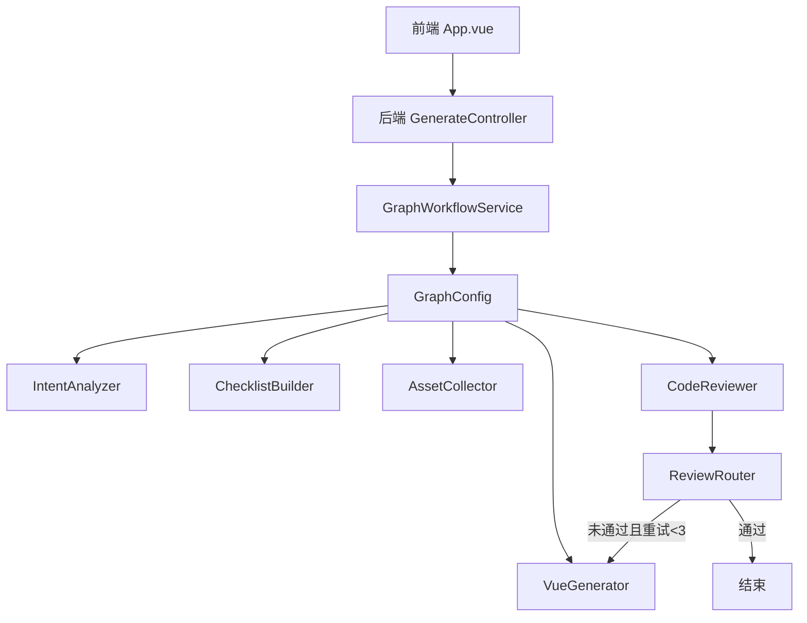
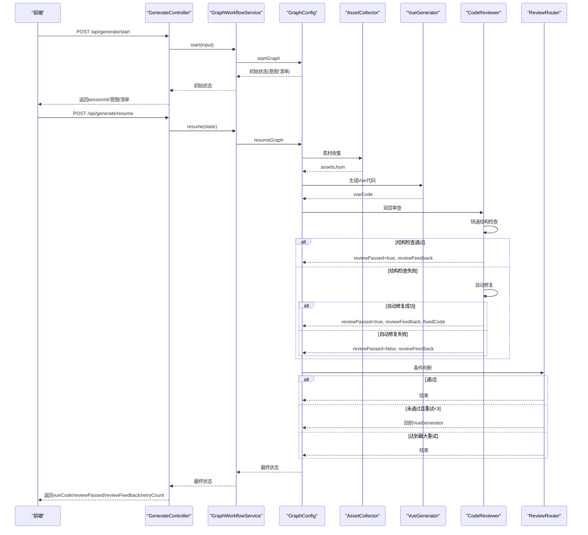
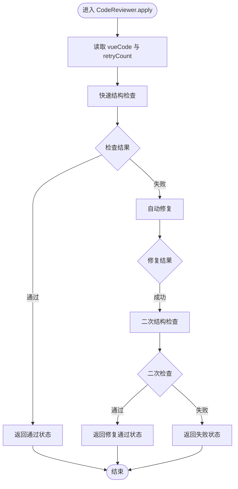
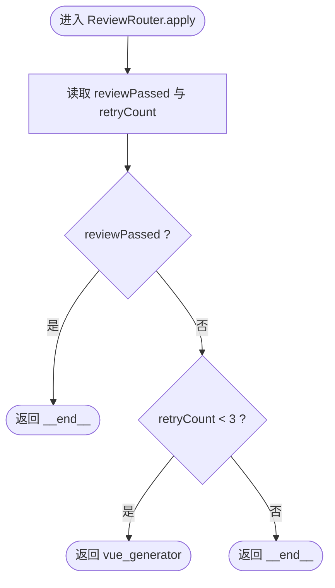
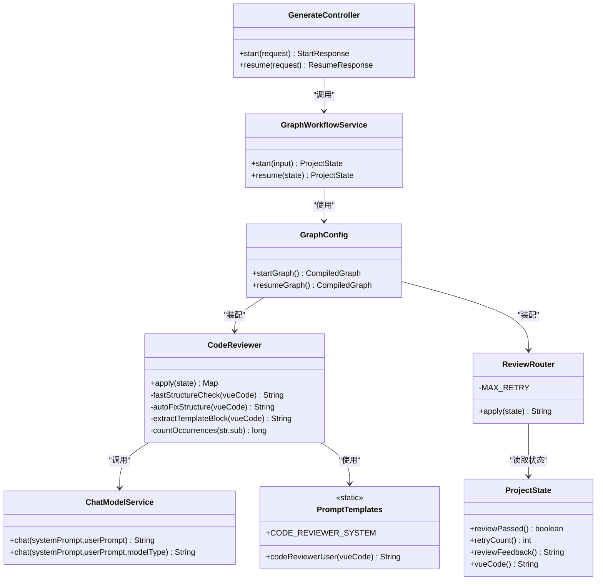
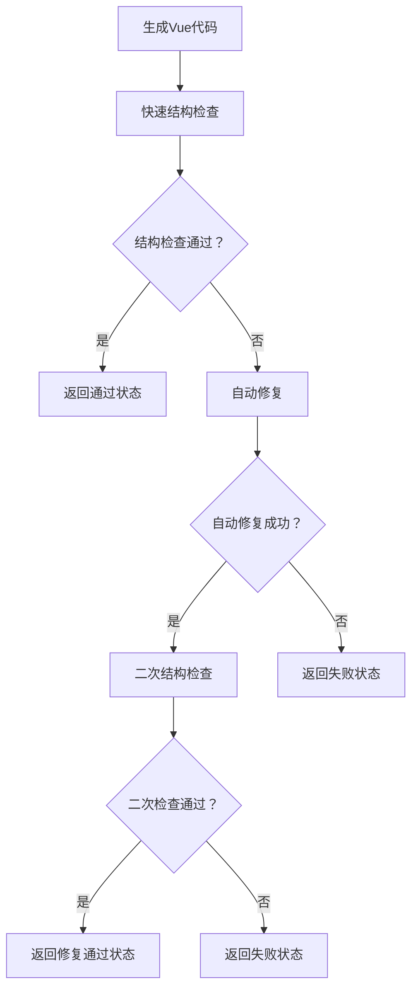

# 代码审查节点

<cite>
**本文引用的文件列表**
- [CodeReviewer.java](file://src/main/java/com/example/websitemother/node/CodeReviewer.java)
- [ReviewRouter.java](file://src/main/java/com/example/websitemother/edge/ReviewRouter.java)
- [PromptTemplates.java](file://src/main/java/com/example/websitemother/prompt/PromptTemplates.java)
- [ChatModelService.java](file://src/main/java/com/example/websitemother/service/ChatModelService.java)
- [ProjectState.java](file://src/main/java/com/example/websitemother/state/ProjectState.java)
- [GraphWorkflowService.java](file://src/main/java/com/example/websitemother/service/GraphWorkflowService.java)
- [GraphConfig.java](file://src/main/java/com/example/websitemother/config/GraphConfig.java)
- [GenerateController.java](file://src/main/java/com/example/websitemother/controller/GenerateController.java)
- [VueGenerator.java](file://src/main/java/com/example/websitemother/node/VueGenerator.java)
- [AssetCollector.java](file://src/main/java/com/example/websitemother/node/AssetCollector.java)
- [IntentAnalyzer.java](file://src/main/java/com/example/websitemother/node/IntentAnalyzer.java)
- [App.vue](file://frontend/src/App.vue)
- [HelloWorld.vue](file://frontend/src/components/HelloWorld.vue)
</cite>

## 更新摘要
**变更内容**
- 从简单的LLM审查升级为双层审查系统
- 新增158行结构化解析逻辑，包含快速结构检查和自动修复机制
- 实现智能反馈系统，支持自动修复后的二次验证
- 优化审查流程，避免不必要的LLM调用

## 目录
1. [简介](#简介)
2. [项目结构](#项目结构)
3. [核心组件](#核心组件)
4. [架构总览](#架构总览)
5. [详细组件分析](#详细组件分析)
6. [依赖关系分析](#依赖关系分析)
7. [性能考量](#性能考量)
8. [故障排查指南](#故障排查指南)
9. [结论](#结论)
10. [附录](#附录)

## 简介
本文件面向"代码审查节点"（CodeReviewer），系统化阐述其在生成Vue代码的质量控制与优化中的作用与实现。经过重大功能增强，现已升级为双层审查系统，包含158行结构化解析逻辑、自动修复机制和智能反馈系统。重点包括：
- 双层审查架构：快速结构检查 + LLM深度审查
- 智能自动修复：自动补全缺失标签、清理残留标记
- 结构化解析：基于纯文本分析捕获致命结构缺陷
- 审查标准与规则制定逻辑
- 语法与规范检查机制
- 错误修复建议生成策略
- LLM在代码分析中的角色
- 审查流程、问题检测与修复建议的推荐方式
- 最佳实践、质量标准与持续改进策略

## 项目结构
该项目采用前后端分离架构，后端以Spring Boot + LangGraph4j构建状态机工作流，前端使用Vue 3 + Vite。代码审查节点位于后端LangGraph工作流的第二阶段，负责对生成的Vue代码进行严格审查，并通过条件边决定是否重生成或结束流程。

**图表来源**
- [GraphConfig.java:76-97](file://src/main/java/com/example/websitemother/config/GraphConfig.java#L76-L97)
- [GenerateController.java:33-84](file://src/main/java/com/example/websitemother/controller/GenerateController.java#L33-L84)
- [GraphWorkflowService.java:31-58](file://src/main/java/com/example/websitemother/service/GraphWorkflowService.java#L31-L58)

**章节来源**
- [GraphConfig.java:24-97](file://src/main/java/com/example/websitemother/config/GraphConfig.java#L24-L97)
- [GenerateController.java:14-115](file://src/main/java/com/example/websitemother/controller/GenerateController.java#L14-L115)
- [GraphWorkflowService.java:11-59](file://src/main/java/com/example/websitemother/service/GraphWorkflowService.java#L11-L59)

## 核心组件
- **代码审查节点（CodeReviewer）**：双层审查系统，先进行快速结构检查，再尝试自动修复，最后进行LLM深度审查
- **审查路由（ReviewRouter）**：根据审查结果与重试次数决定流程走向
- **提示模板（PromptTemplates）**：集中管理各节点的系统提示词与用户提示词
- **LLM服务（ChatModelService）**：封装DashScope Qwen模型调用，组装SystemMessage与UserMessage
- **工作流状态（ProjectState）**：LangGraph状态容器，承载当前输入、清单、素材、Vue代码、审查结果与重试计数
- **工作流服务（GraphWorkflowService）**：封装startGraph与resumeGraph的执行
- **前端控制器（GenerateController）**：对外提供启动与继续接口，驱动工作流执行
- **其他节点**：意图分析、清单构建、素材收集、Vue生成等

**章节来源**
- [CodeReviewer.java:13-199](file://src/main/java/com/example/websitemother/node/CodeReviewer.java#L13-L199)
- [ReviewRouter.java:8-45](file://src/main/java/com/example/websitemother/edge/ReviewRouter.java#L8-L45)
- [PromptTemplates.java:74-131](file://src/main/java/com/example/websitemother/prompt/PromptTemplates.java#L74-L131)
- [ChatModelService.java:15-127](file://src/main/java/com/example/websitemother/service/ChatModelService.java#L15-L127)
- [ProjectState.java:9-78](file://src/main/java/com/example/websitemother/state/ProjectState.java#L9-L78)
- [GraphWorkflowService.java:11-60](file://src/main/java/com/example/websitemother/service/GraphWorkflowService.java#L11-L60)
- [GenerateController.java:14-130](file://src/main/java/com/example/websitemother/controller/GenerateController.java#L14-L130)

## 架构总览
代码审查节点处于LangGraph工作流的第二阶段，与素材收集、Vue生成、审查路由共同构成"生成-审查-迭代"的闭环。经过重大功能增强，审查流程现在包含三层保护机制：快速结构检查、自动修复和LLM深度审查，显著提升了代码质量和审查效率。

**图表来源**
- [GraphConfig.java:76-97](file://src/main/java/com/example/websitemother/config/GraphConfig.java#L76-L97)
- [CodeReviewer.java:24-65](file://src/main/java/com/example/websitemother/node/CodeReviewer.java#L24-L65)
- [ReviewRouter.java:22-43](file://src/main/java/com/example/websitemother/edge/ReviewRouter.java#L22-L43)
- [GenerateController.java:33-130](file://src/main/java/com/example/websitemother/controller/GenerateController.java#L33-L130)

## 详细组件分析

### 代码审查节点（CodeReviewer）- 双层审查系统

**重大功能增强**：从简单的LLM审查升级为双层审查系统，包含158行结构化解析逻辑、自动修复机制和智能反馈系统

#### 双层审查架构
- **第一层：快速结构检查**（fastStructureCheck）
  - 基于纯文本分析捕获Vue SFC的致命结构缺陷
  - 避免LLM的主观误判，只检查会导致编译失败的客观问题
  - 检查内容：标签完整性、语法正确性、模板内容验证
- **第二层：自动修复**（autoFixStructure）
  - 尝试自动修复常见的简单结构问题
  - 支持标签补全、残留标记清理
  - 修复后进行二次验证
- **第三层：LLM深度审查**（保留原有功能）
  - 对通过自动修复的代码进行深度质量评估
  - 生成详细的审查反馈和修复建议

#### 关键实现要点
- **快速结构检查规则**：
  - 基本标签存在性检查（template/script/style）
  - 标签闭合和数量匹配验证
  - Vue 3 script setup语法要求
  - 模板内容的引号和尖括号匹配
  - 残留markdown标记清理
- **自动修复策略**：
  - 智能补全未闭合标签
  - 清理残留的代码块标记
  - 保持原有代码结构不变
- **智能反馈系统**：
  - 自动修复成功时提供修复详情
  - 失败时提供详细的错误原因
  - 支持多次自动修复的追踪

**图表来源**
- [CodeReviewer.java:24-65](file://src/main/java/com/example/websitemother/node/CodeReviewer.java#L24-L65)
- [CodeReviewer.java:72-128](file://src/main/java/com/example/websitemother/node/CodeReviewer.java#L72-L128)
- [CodeReviewer.java:155-197](file://src/main/java/com/example/websitemother/node/CodeReviewer.java#L155-L197)

**章节来源**
- [CodeReviewer.java:13-199](file://src/main/java/com/example/websitemother/node/CodeReviewer.java#L13-L199)
- [PromptTemplates.java:115-131](file://src/main/java/com/example/websitemother/prompt/PromptTemplates.java#L115-L131)
- [ChatModelService.java:66-95](file://src/main/java/com/example/websitemother/service/ChatModelService.java#L66-L95)

### 审查路由（ReviewRouter）
职责与流程
- 依据reviewPassed与retryCount决定流向
- 通过则结束；未通过且重试次数小于阈值则回到VueGenerator；达到最大重试则结束

**图表来源**
- [ReviewRouter.java:22-43](file://src/main/java/com/example/websitemother/edge/ReviewRouter.java#L22-L43)

**章节来源**
- [ReviewRouter.java:8-45](file://src/main/java/com/example/websitemother/edge/ReviewRouter.java#L8-L45)

### 提示模板（PromptTemplates）
- **审查系统提示词**定义了审查标准与输出格式，确保LLM按固定格式返回结果
- **审查用户提示词**包含待审查的Vue代码，必要时附加上一次审查反馈

**审查标准要点**
- 是否包含完整的template/script/style标签
- 是否存在明显Vue语法错误
- Tailwind CSS类名是否正确
- 组件是否可作为独立文件直接运行

**章节来源**
- [PromptTemplates.java:115-131](file://src/main/java/com/example/websitemother/prompt/PromptTemplates.java#L115-L131)

### LLM服务（ChatModelService）
- 统一封装SystemMessage与UserMessage的组装与调用
- 异常处理：捕获并记录错误，抛出统一异常供上层处理
- 支持多种模型策略：FAST、SMART、MAX

**章节来源**
- [ChatModelService.java:15-127](file://src/main/java/com/example/websitemother/service/ChatModelService.java#L15-L127)

### 工作流状态（ProjectState）
- 统一的状态键：currentInput、intentType、chatReply、checklist、userAnswers、assetsJson、vueCode、reviewPassed、reviewFeedback、retryCount
- 提供类型安全的访问器方法，便于各节点读取与更新

**章节来源**
- [ProjectState.java:9-78](file://src/main/java/com/example/websitemother/state/ProjectState.java#L9-L78)

### 工作流服务（GraphWorkflowService）
- startGraph：执行第一阶段（意图分析+清单生成）
- resumeGraph：执行第二阶段（素材收集+Vue生成+代码审查循环）

**章节来源**
- [GraphWorkflowService.java:11-60](file://src/main/java/com/example/websitemother/service/GraphWorkflowService.java#L11-L60)

### 前端控制器（GenerateController）
- /api/generate/start：启动工作流，返回sessionId、意图类型、聊天回复或清单
- /api/generate/resume：提交清单答案，继续执行并返回最终状态（包含vueCode、reviewPassed、reviewFeedback、retryCount）

**章节来源**
- [GenerateController.java:14-130](file://src/main/java/com/example/websitemother/controller/GenerateController.java#L14-L130)

### 其他节点（辅助理解）
- 意图分析（IntentAnalyzer）：判断用户输入是闲聊还是建站需求
- 素材收集（AssetCollector）：根据用户答案生成占位图片URL JSON
- Vue生成（VueGenerator）：结合需求与素材生成Vue代码，支持接收审查反馈进行针对性修复

**章节来源**
- [IntentAnalyzer.java:13-61](file://src/main/java/com/example/websitemother/node/IntentAnalyzer.java#L13-L61)
- [AssetCollector.java:12-89](file://src/main/java/com/example/websitemother/node/AssetCollector.java#L12-L89)
- [VueGenerator.java:13-64](file://src/main/java/com/example/websitemother/node/VueGenerator.java#L13-L64)

## 依赖关系分析
- CodeReviewer依赖ChatModelService与PromptTemplates
- ReviewRouter依赖ProjectState中的审查结果与重试计数
- GraphConfig将各节点与条件边装配为两套CompiledGraph
- GenerateController协调前端与工作流服务
- VueGenerator与AssetCollector共同为CodeReviewer提供输入

**图表来源**
- [CodeReviewer.java:21-34](file://src/main/java/com/example/websitemother/node/CodeReviewer.java#L21-L34)
- [ReviewRouter.java:22-43](file://src/main/java/com/example/websitemother/edge/ReviewRouter.java#L22-L43)
- [ChatModelService.java:66-95](file://src/main/java/com/example/websitemother/service/ChatModelService.java#L66-L95)
- [PromptTemplates.java:115-131](file://src/main/java/com/example/websitemother/prompt/PromptTemplates.java#L115-L131)
- [ProjectState.java:59-76](file://src/main/java/com/example/websitemother/state/ProjectState.java#L59-L76)
- [GraphWorkflowService.java:19-23](file://src/main/java/com/example/websitemother/service/GraphWorkflowService.java#L19-L23)
- [GraphConfig.java:32-45](file://src/main/java/com/example/websitemother/config/GraphConfig.java#L32-L45)
- [GenerateController.java:24-25](file://src/main/java/com/example/websitemother/controller/GenerateController.java#L24-L25)

**章节来源**
- [GraphConfig.java:32-45](file://src/main/java/com/example/websitemother/config/GraphConfig.java#L32-L45)
- [GraphWorkflowService.java:19-23](file://src/main/java/com/example/websitemother/service/GraphWorkflowService.java#L19-L23)
- [GenerateController.java:24-25](file://src/main/java/com/example/websitemother/controller/GenerateController.java#L24-L25)

## 性能考量
- **LLM调用成本优化**：通过快速结构检查避免不必要的LLM调用，显著降低成本
- **自动修复机制**：减少人工干预，提高审查效率
- **状态传递开销**：ProjectState在各节点间传递，保持键值稳定有助于减少序列化成本
- **重试机制**：最多3次重试，避免无限循环；可通过调整阈值平衡质量与性能
- **前端渲染**：前端高亮显示代码，建议在大量代码时考虑分页或懒加载
- **内存使用**：158行结构化解析逻辑在内存中高效运行，避免额外的外部依赖

## 故障排查指南
常见问题与定位
- **快速结构检查失败**：检查Vue代码是否包含完整的template/script/style标签
- **自动修复无效**：确认代码中是否存在可识别的结构问题模式
- **审查结果解析失败**：确认LLM输出严格遵循"RESULT: PASS|FAIL"和"FEEDBACK: ..."格式
- **审查未通过但无反馈**：检查审查系统提示词是否被修改，或上一次反馈是否为空
- **重试次数耗尽**：确认ReviewRouter的MAX_RETRY配置与前端展示逻辑一致
- **自动修复循环**：检查autoFixStructure是否正确识别和修复问题

**章节来源**
- [ChatModelService.java:91-95](file://src/main/java/com/example/websitemother/service/ChatModelService.java#L91-L95)
- [CodeReviewer.java:40-64](file://src/main/java/com/example/websitemother/node/CodeReviewer.java#L40-L64)
- [ReviewRouter.java:20](file://src/main/java/com/example/websitemother/edge/ReviewRouter.java#L20)

## 结论
代码审查节点通过重大功能增强，从简单的LLM审查升级为双层审查系统，实现了以下突破：
- **智能审查流程**：快速结构检查 + 自动修复 + LLM深度审查的三层保护机制
- **158行结构化解析逻辑**：基于纯文本分析的致命缺陷检测，避免LLM误判
- **自动修复机制**：智能补全标签、清理残留标记，提升代码质量
- **智能反馈系统**：提供详细的修复过程和结果反馈
- **性能优化**：显著减少LLM调用次数，降低成本和延迟

其设计强调：
- 明确的审查标准与输出格式
- 可控的重试上限与清晰的失败路径
- 与生成节点的协同，支持基于反馈的定向修复
- 前后端联动，提供直观的审查结果展示
- 智能化程度大幅提升，减少人工干预

## 附录

### 审查规则与最佳实践

#### 规则制定逻辑
- **双层审查架构**
  - 第一层：快速结构检查，基于纯文本分析捕获致命缺陷
  - 第二层：自动修复，智能补全常见问题
  - 第三层：LLM深度审查，提供质量评估和建议
- **结构化解析标准**
  - 基本标签完整性：template/script/style必须存在且正确闭合
  - 语法正确性：标签开启/闭合数量匹配，引号和尖括号平衡
  - Vue 3兼容性：要求使用<script setup>语法
  - 内容完整性：模板内容中的引号和标签必须正确匹配
- **自动修复策略**
  - 智能补全：自动添加缺失的闭合标签
  - 清理残留：移除markdown代码块标记
  - 保持原意：不改变代码的业务逻辑和设计意图

#### 错误修复建议生成策略
- **结构问题**：优先修复标签闭合和语法错误
- **格式问题**：提供具体的修复步骤和代码示例
- **兼容性问题**：建议使用Vue 3推荐的<script setup>语法
- **多次失败**：在Vue生成阶段引入"基于反馈的修复"提示

#### 质量标准定义
- **结构完整性**：template/script/style三部分齐全且正确闭合
- **语法正确性**：无明显Vue语法错误和标签不匹配
- **样式规范**：Tailwind类名正确，模板内容格式规范
- **可运行性**：组件可作为独立文件直接运行
- **自动修复成功率**：通过自动修复解决80%以上的常见问题

#### 持续改进策略
- **审查规则扩展**：增加更多Vue 3特性和最佳实践检查
- **自动修复能力增强**：支持更复杂的代码重构和优化
- **智能反馈优化**：提供更精准的修复建议和代码示例
- **性能监控**：跟踪审查效率和自动修复成功率
- **用户反馈集成**：根据用户反馈优化审查标准和修复策略

### 审查流程示例（双层系统）

**图表来源**
- [CodeReviewer.java:24-65](file://src/main/java/com/example/websitemother/node/CodeReviewer.java#L24-L65)
- [CodeReviewer.java:72-128](file://src/main/java/com/example/websitemother/node/CodeReviewer.java#L72-L128)
- [CodeReviewer.java:155-197](file://src/main/java/com/example/websitemother/node/CodeReviewer.java#L155-L197)