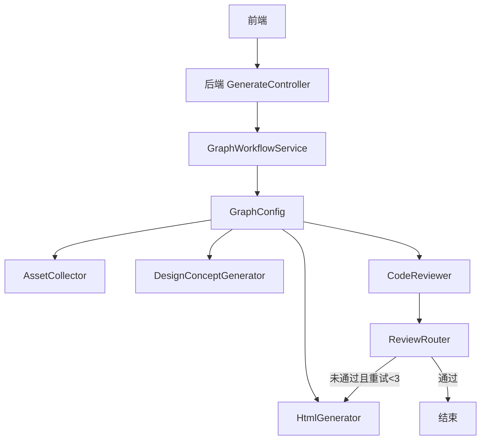
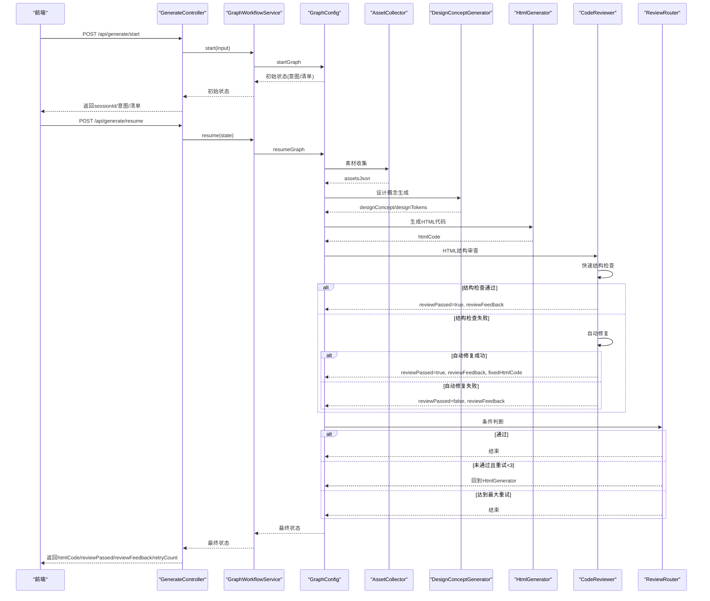
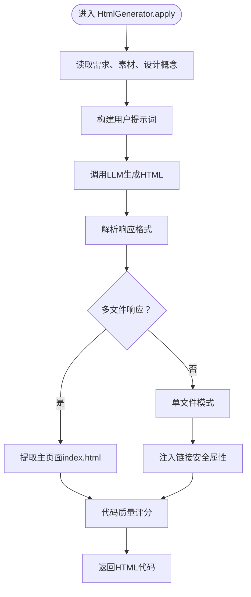
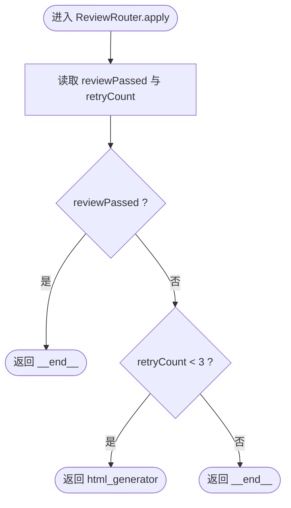
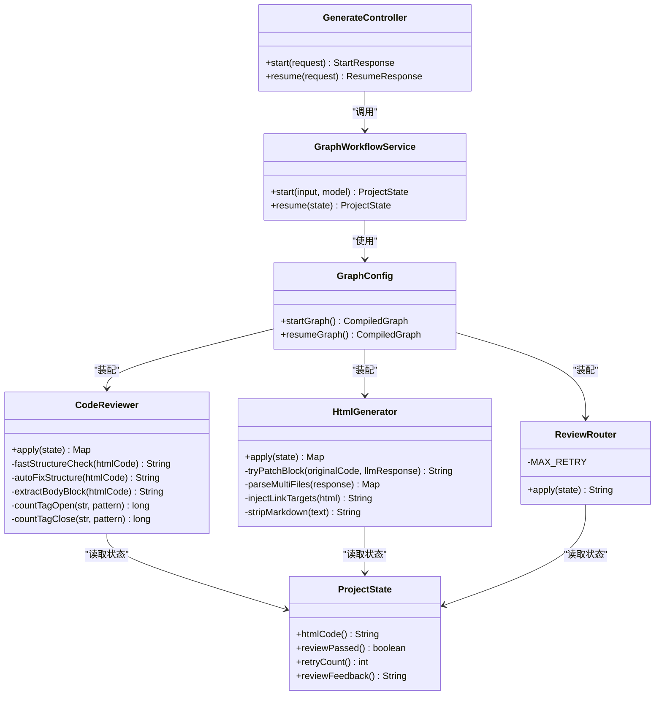
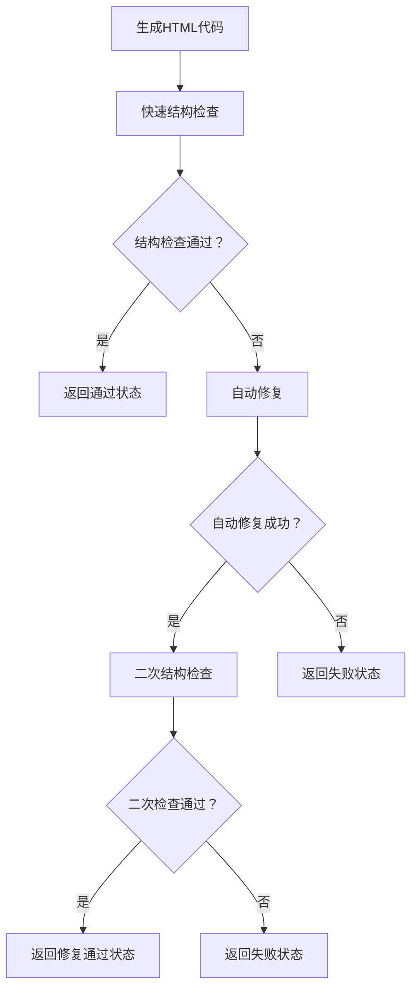

# 代码审查节点

<cite>
**本文引用的文件列表**
- [CodeReviewer.java](file://src/main/java/com/example/websitemother/node/CodeReviewer.java)
- [HtmlGenerator.java](file://src/main/java/com/example/websitemother/node/HtmlGenerator.java)
- [ReviewRouter.java](file://src/main/java/com/example/websitemother/edge/ReviewRouter.java)
- [PromptTemplates.java](file://src/main/java/com/example/websitemother/prompt/PromptTemplates.java)
- [ChatModelService.java](file://src/main/java/com/example/websitemother/service/ChatModelService.java)
- [ProjectState.java](file://src/main/java/com/example/websitemother/state/ProjectState.java)
- [GraphWorkflowService.java](file://src/main/java/com/example/websitemother/service/GraphWorkflowService.java)
- [GraphConfig.java](file://src/main/java/com/example/websitemother/config/GraphConfig.java)
- [GenerateController.java](file://src/main/java/com/example/websitemother/controller/GenerateController.java)
- [AssetCollector.java](file://src/main/java/com/example/websitemother/node/AssetCollector.java)
- [IntentAnalyzer.java](file://src/main/java/com/example/websitemother/node/IntentAnalyzer.java)
- [DesignConceptGenerator.java](file://src/main/java/com/example/websitemother/node/DesignConceptGenerator.java)
- [index.html](file://generated-projects/22c2d1db-bb2f-4eda-8a6c-d03ceb55c6da/index.html)
- [index.html](file://generated-projects/2454044e-f6c6-43bf-8913-8aa0db3013c7/index.html)
</cite>

## 更新摘要
**变更内容**
- 代码审查节点从Vue代码审查更新为HTML结构审查
- 现在验证DOCTYPE声明、html、head、body标签等HTML元素的正确性
- 支持HTML结构修复，包括自动补全缺失的DOCTYPE和标签
- 审查标准从Vue SFC转向HTML5标准结构
- 审查流程仍保持三层保护机制：快速结构检查、自动修复、条件循环

## 目录
1. [简介](#简介)
2. [项目结构](#项目结构)
3. [核心组件](#核心组件)
4. [架构总览](#架构总览)
5. [详细组件分析](#详细组件分析)
6. [依赖关系分析](#依赖关系分析)
7. [性能考量](#性能考量)
8. [故障排查指南](#故障排查指南)
9. [结论](#结论)
10. [附录](#附录)

## 简介
本文件面向"代码审查节点"（CodeReviewer），系统化阐述其在生成HTML代码的质量控制与优化中的作用与实现。经过重大功能更新，现已从Vue代码审查升级为HTML结构审查，专注于验证HTML5标准结构的完整性。重点包括：
- HTML结构审查：验证DOCTYPE声明、html、head、body标签的正确性
- 智能自动修复：自动补全缺失的DOCTYPE和未闭合标签
- 结构化解析：基于纯文本分析捕获致命HTML结构缺陷
- 审查标准与规则制定逻辑
- 语法与规范检查机制
- 错误修复建议生成策略
- LLM在HTML代码分析中的角色
- 审查流程、问题检测与修复建议的推荐方式
- 最佳实践、质量标准与持续改进策略

## 项目结构
该项目采用前后端分离架构，后端以Spring Boot + LangGraph4j构建状态机工作流，前端使用Vue 3 + Vite。代码审查节点位于后端LangGraph工作流的第二阶段，负责对生成的HTML代码进行严格审查，并通过条件边决定是否重生成或结束流程。

**图表来源**
- [GraphConfig.java:75-102](file://src/main/java/com/example/websitemother/config/GraphConfig.java#L75-L102)
- [GenerateController.java:53-188](file://src/main/java/com/example/websitemother/controller/GenerateController.java#L53-L188)
- [GraphWorkflowService.java:32-63](file://src/main/java/com/example/websitemother/service/GraphWorkflowService.java#L32-L63)

**章节来源**
- [GraphConfig.java:25-102](file://src/main/java/com/example/websitemother/config/GraphConfig.java#L25-L102)
- [GenerateController.java:23-245](file://src/main/java/com/example/websitemother/controller/GenerateController.java#L23-L245)
- [GraphWorkflowService.java:12-65](file://src/main/java/com/example/websitemother/service/GraphWorkflowService.java#L12-L65)

## 核心组件
- **代码审查节点（CodeReviewer）**：HTML结构审查系统，验证DOCTYPE声明和基本HTML结构的完整性
- **HTML生成器（HtmlGenerator）**：根据设计概念和素材生成完整的HTML单文件
- **审查路由（ReviewRouter）**：根据审查结果与重试次数决定流程走向
- **提示模板（PromptTemplates）**：集中管理各节点的系统提示词与用户提示词
- **LLM服务（ChatModelService）**：封装DashScope Qwen模型调用，组装SystemMessage与UserMessage
- **工作流状态（ProjectState）**：LangGraph状态容器，承载当前输入、清单、素材、HTML代码、审查结果与重试计数
- **工作流服务（GraphWorkflowService）**：封装startGraph与resumeGraph的执行
- **前端控制器（GenerateController）**：对外提供启动与继续接口，驱动工作流执行

**章节来源**
- [CodeReviewer.java:17-71](file://src/main/java/com/example/websitemother/node/CodeReviewer.java#L17-L71)
- [HtmlGenerator.java:19-134](file://src/main/java/com/example/websitemother/node/HtmlGenerator.java#L19-L134)
- [ReviewRouter.java:8-45](file://src/main/java/com/example/websitemother/edge/ReviewRouter.java#L8-L45)
- [PromptTemplates.java:99-200](file://src/main/java/com/example/websitemother/prompt/PromptTemplates.java#L99-L200)
- [ChatModelService.java:15-127](file://src/main/java/com/example/websitemother/service/ChatModelService.java#L15-L127)
- [ProjectState.java:9-95](file://src/main/java/com/example/websitemother/state/ProjectState.java#L9-L95)
- [GraphWorkflowService.java:12-65](file://src/main/java/com/example/websitemother/service/GraphWorkflowService.java#L12-L65)
- [GenerateController.java:23-245](file://src/main/java/com/example/websitemother/controller/GenerateController.java#L23-L245)

## 架构总览
代码审查节点处于LangGraph工作流的第二阶段，与素材收集、设计概念生成、HTML生成、审查路由共同构成"生成-审查-迭代"的闭环。经过功能更新，审查流程现在专注于HTML5标准结构的验证，包含三层保护机制：快速结构检查、自动修复和条件循环。

**图表来源**
- [GraphConfig.java:75-102](file://src/main/java/com/example/websitemother/config/GraphConfig.java#L75-L102)
- [CodeReviewer.java:28-71](file://src/main/java/com/example/websitemother/node/CodeReviewer.java#L28-L71)
- [ReviewRouter.java:22-43](file://src/main/java/com/example/websitemother/edge/ReviewRouter.java#L22-L43)
- [GenerateController.java:82-188](file://src/main/java/com/example/websitemother/controller/GenerateController.java#L82-L188)

## 详细组件分析

### 代码审查节点（CodeReviewer）- HTML结构审查系统

**重大功能更新**：从Vue代码审查升级为HTML结构审查，专注于验证HTML5标准结构的完整性

#### HTML结构审查架构
- **第一层：快速结构检查**（fastStructureCheck）
  - 基于纯文本分析捕获HTML的致命结构缺陷
  - 避免LLM的主观误判，只检查会导致页面无法渲染的客观问题
  - 检查内容：DOCTYPE声明、基本HTML标签、标签闭合、CSS变量设计系统、引号匹配
- **第二层：自动修复**（autoFixStructure）
  - 尝试自动修复常见的简单HTML结构问题
  - 支持DOCTYPE补全、标签补全、残留标记清理
  - 修复后进行二次验证
- **第三层：条件循环**（保留原有功能）
  - 通过审查则结束工作流
  - 未通过且重试次数小于阈值则回到HtmlGenerator重新生成

#### 关键实现要点
- **快速结构检查规则**：
  - 基本HTML结构存在性检查（DOCTYPE、html、head、body标签）
  - 标签闭合和数量匹配验证
  - CSS变量设计系统检查（:root元素）
  - 残留的markdown代码块标记清理
  - body内引号匹配检查
- **自动修复策略**：
  - 智能补全DOCTYPE声明
  - 自动补全未闭合的html、head、body标签
  - 清理残留的代码块标记
  - 保持原有HTML结构不变
- **智能反馈系统**：
  - 自动修复成功时提供修复详情
  - 失败时提供详细的错误原因
  - 支持多次自动修复的追踪

**图表来源**
- [CodeReviewer.java:28-71](file://src/main/java/com/example/websitemother/node/CodeReviewer.java#L28-L71)
- [CodeReviewer.java:78-127](file://src/main/java/com/example/websitemother/node/CodeReviewer.java#L78-L127)
- [CodeReviewer.java:183-231](file://src/main/java/com/example/websitemother/node/CodeReviewer.java#L183-L231)

**章节来源**
- [CodeReviewer.java:17-233](file://src/main/java/com/example/websitemother/node/CodeReviewer.java#L17-L233)
- [PromptTemplates.java:101-169](file://src/main/java/com/example/websitemother/prompt/PromptTemplates.java#L101-L169)
- [ChatModelService.java:66-95](file://src/main/java/com/example/websitemother/service/ChatModelService.java#L66-L95)

### HTML生成器（HtmlGenerator）
职责与流程
- 根据设计概念、素材和需求生成完整的HTML单文件
- 支持分块增量修改：重试时只让LLM修改一个代码区域
- 解析多文件响应并提取主页面index.html
- 注入外部链接的安全target属性

**图表来源**
- [HtmlGenerator.java:38-134](file://src/main/java/com/example/websitemother/node/HtmlGenerator.java#L38-L134)
- [HtmlGenerator.java:140-186](file://src/main/java/com/example/websitemother/node/HtmlGenerator.java#L140-L186)
- [HtmlGenerator.java:229-253](file://src/main/java/com/example/websitemother/node/HtmlGenerator.java#L229-L253)

**章节来源**
- [HtmlGenerator.java:19-271](file://src/main/java/com/example/websitemother/node/HtmlGenerator.java#L19-L271)

### 审查路由（ReviewRouter）
职责与流程
- 依据reviewPassed与retryCount决定流向
- 通过则结束；未通过且重试次数小于阈值则回到HtmlGenerator；达到最大重试则结束

**图表来源**
- [ReviewRouter.java:22-43](file://src/main/java/com/example/websitemother/edge/ReviewRouter.java#L22-L43)

**章节来源**
- [ReviewRouter.java:8-45](file://src/main/java/com/example/websitemother/edge/ReviewRouter.java#L8-L45)

### 提示模板（PromptTemplates）
- **HTML生成系统提示词**定义了HTML生成的标准格式和设计原则
- **HTML生成用户提示词**包含设计需求、设计概念、素材资源和审查反馈
- **审查系统提示词**定义了审查标准与输出格式，确保LLM按固定格式返回结果

**HTML生成标准要点**
- 必须包含完整的<!DOCTYPE html>和<html><head><body>结构
- 在<style>中定义:root CSS变量设计系统
- 使用React 18 + Babel standalone（如需要交互组件）
- 导航栏链接使用相对路径
- 外部链接必须添加target="_blank" rel="noopener noreferrer"

**章节来源**
- [PromptTemplates.java:101-200](file://src/main/java/com/example/websitemother/prompt/PromptTemplates.java#L101-L200)

### LLM服务（ChatModelService）
- 统一封装SystemMessage与UserMessage的组装与调用
- 异常处理：捕获并记录错误，抛出统一异常供上层处理
- 支持多种模型策略：FAST、SMART、MAX

**章节来源**
- [ChatModelService.java:15-127](file://src/main/java/com/example/websitemother/service/ChatModelService.java#L15-L127)

### 工作流状态（ProjectState）
- 统一的状态键：currentInput、intentType、chatReply、checklist、userAnswers、assetsJson、htmlCode、reviewPassed、reviewFeedback、retryCount、sessionId、model、pages
- 提供类型安全的访问器方法，便于各节点读取与更新

**章节来源**
- [ProjectState.java:9-95](file://src/main/java/com/example/websitemother/state/ProjectState.java#L9-L95)

### 工作流服务（GraphWorkflowService）
- startGraph：执行第一阶段（意图分析+清单生成）
- resumeGraph：执行第二阶段（素材收集+设计概念生成+HTML生成+代码审查循环）

**章节来源**
- [GraphWorkflowService.java:12-65](file://src/main/java/com/example/websitemother/service/GraphWorkflowService.java#L12-L65)

### 前端控制器（GenerateController）
- /api/generate/start：启动工作流，返回sessionId、意图类型、聊天回复或清单
- /api/generate/resume：提交清单答案，继续执行并返回最终状态（包含htmlCode、reviewPassed、reviewFeedback、retryCount）

**章节来源**
- [GenerateController.java:23-245](file://src/main/java/com/example/websitemother/controller/GenerateController.java#L23-L245)

### 其他节点（辅助理解）
- 意图分析（IntentAnalyzer）：判断用户输入是闲聊还是建站需求
- 素材收集（AssetCollector）：根据用户答案生成占位图片URL JSON
- 设计概念生成（DesignConceptGenerator）：生成设计系统方案

**章节来源**
- [IntentAnalyzer.java:13-61](file://src/main/java/com/example/websitemother/node/IntentAnalyzer.java#L13-L61)
- [AssetCollector.java:12-89](file://src/main/java/com/example/websitemother/node/AssetCollector.java#L12-L89)
- [DesignConceptGenerator.java:13-64](file://src/main/java/com/example/websitemother/node/DesignConceptGenerator.java#L13-L64)

## 依赖关系分析
- CodeReviewer依赖ProjectState中的htmlCode和审查结果
- HtmlGenerator依赖ChatModelService与PromptTemplates
- ReviewRouter依赖ProjectState中的审查结果与重试计数
- GraphConfig将各节点与条件边装配为两套CompiledGraph
- GenerateController协调前端与工作流服务

**图表来源**
- [CodeReviewer.java:28-71](file://src/main/java/com/example/websitemother/node/CodeReviewer.java#L28-L71)
- [HtmlGenerator.java:38-134](file://src/main/java/com/example/websitemother/node/HtmlGenerator.java#L38-L134)
- [ReviewRouter.java:22-43](file://src/main/java/com/example/websitemother/edge/ReviewRouter.java#L22-L43)
- [ProjectState.java:60-89](file://src/main/java/com/example/websitemother/state/ProjectState.java#L60-L89)
- [GraphWorkflowService.java:32-63](file://src/main/java/com/example/websitemother/service/GraphWorkflowService.java#L32-L63)
- [GraphConfig.java:79-102](file://src/main/java/com/example/websitemother/config/GraphConfig.java#L79-L102)
- [GenerateController.java:147-188](file://src/main/java/com/example/websitemother/controller/GenerateController.java#L147-L188)

**章节来源**
- [GraphConfig.java:33-102](file://src/main/java/com/example/websitemother/config/GraphConfig.java#L33-L102)
- [GraphWorkflowService.java:19-24](file://src/main/java/com/example/websitemother/service/GraphWorkflowService.java#L19-L24)
- [GenerateController.java:147-188](file://src/main/java/com/example/websitemother/controller/GenerateController.java#L147-L188)

## 性能考量
- **LLM调用成本优化**：通过快速结构检查避免不必要的LLM调用，显著降低成本
- **自动修复机制**：减少人工干预，提高审查效率
- **状态传递开销**：ProjectState在各节点间传递，保持键值稳定有助于减少序列化成本
- **重试机制**：最多3次重试，避免无限循环；可通过调整阈值平衡质量与性能
- **HTML解析效率**：158行结构化解析逻辑在内存中高效运行，避免额外的外部依赖
- **流式生成支持**：HtmlGenerator支持SSE流式输出，提升用户体验

## 故障排查指南
常见问题与定位
- **快速结构检查失败**：检查HTML代码是否包含完整的DOCTYPE声明和基本HTML标签
- **自动修复无效**：确认代码中是否存在可识别的HTML结构问题模式
- **审查结果解析失败**：确认LLM输出严格遵循"RESULT: PASS|FAIL"和"FEEDBACK: ..."格式
- **审查未通过但无反馈**：检查审查系统提示词是否被修改，或上一次反馈是否为空
- **重试次数耗尽**：确认ReviewRouter的MAX_RETRY配置与前端展示逻辑一致
- **HTML生成失败**：检查设计概念和素材资源是否正确传递到HtmlGenerator

**章节来源**
- [ChatModelService.java:91-95](file://src/main/java/com/example/websitemother/service/ChatModelService.java#L91-L95)
- [CodeReviewer.java:78-127](file://src/main/java/com/example/websitemother/node/CodeReviewer.java#L78-L127)
- [ReviewRouter.java:20](file://src/main/java/com/example/websitemother/edge/ReviewRouter.java#L20)

## 结论
代码审查节点通过重大功能更新，从Vue代码审查升级为HTML结构审查，实现了以下突破：
- **专注HTML5标准**：专门验证DOCTYPE声明、基本HTML标签和CSS变量设计系统
- **智能审查流程**：快速结构检查 + 自动修复 + 条件循环的三层保护机制
- **158行结构化解析逻辑**：基于纯文本分析的致命缺陷检测，避免LLM误判
- **自动修复机制**：智能补全DOCTYPE和标签，清理残留标记，提升HTML质量
- **性能优化**：显著减少LLM调用次数，降低成本和延迟

其设计强调：
- 明确的HTML结构审查标准与输出格式
- 可控的重试上限与清晰的失败路径
- 与生成节点的协同，支持基于反馈的定向修复
- 前后端联动，提供直观的审查结果展示
- 智能化程度大幅提升，减少人工干预

## 附录

### HTML审查规则与最佳实践

#### 规则制定逻辑
- **HTML结构审查架构**
  - 第一层：快速结构检查，基于纯文本分析捕获致命HTML缺陷
  - 第二层：自动修复，智能补全常见HTML问题
  - 第三层：条件循环，通过审查则结束，未通过则重新生成
- **HTML结构化解析标准**
  - 基本HTML结构完整性：DOCTYPE、html、head、body必须存在且正确闭合
  - 标签闭合和数量匹配：使用正则避免误判，确保标签开启/闭合数量一致
  - CSS变量设计系统：要求使用:root元素定义设计系统
  - 内容完整性：模板内容中的引号和标签必须正确匹配
- **自动修复策略**
  - 智能补全：自动添加缺失的DOCTYPE声明和未闭合标签
  - 清理残留：移除markdown代码块标记
  - 保持原意：不改变HTML的业务逻辑和设计意图

#### 错误修复建议生成策略
- **结构问题**：优先修复DOCTYPE声明和标签闭合问题
- **格式问题**：提供具体的修复步骤和代码示例
- **兼容性问题**：建议使用标准HTML5结构和CSS变量设计系统
- **多次失败**：在HTML生成阶段引入"基于反馈的修复"提示

#### 质量标准定义
- **结构完整性**：DOCTYPE声明、html、head、body四部分齐全且正确闭合
- **语法正确性**：无明显HTML语法错误和标签不匹配
- **设计系统规范**：:root CSS变量设计系统正确实现
- **可运行性**：HTML代码可直接在浏览器打开运行
- **自动修复成功率**：通过自动修复解决80%以上的常见HTML问题

#### 持续改进策略
- **审查规则扩展**：增加更多HTML5特性和最佳实践检查
- **自动修复能力增强**：支持更复杂的HTML重构和优化
- **智能反馈优化**：提供更精准的修复建议和代码示例
- **性能监控**：跟踪审查效率和自动修复成功率
- **用户反馈集成**：根据用户反馈优化审查标准和修复策略

### HTML审查流程示例

**图表来源**
- [CodeReviewer.java:28-71](file://src/main/java/com/example/websitemother/node/CodeReviewer.java#L28-L71)
- [CodeReviewer.java:78-127](file://src/main/java/com/example/websitemother/node/CodeReviewer.java#L78-L127)
- [CodeReviewer.java:183-231](file://src/main/java/com/example/websitemother/node/CodeReviewer.java#L183-L231)

### HTML代码示例
以下是从生成项目中提取的HTML代码示例，展示了完整的HTML5结构：

**章节来源**
- [index.html:1-597](file://generated-projects/22c2d1db-bb2f-4eda-8a6c-d03ceb55c6da/index.html#L1-L597)
- [index.html:1-563](file://generated-projects/2454044e-f6c6-43bf-8913-8aa0db3013c7/index.html#L1-L563)