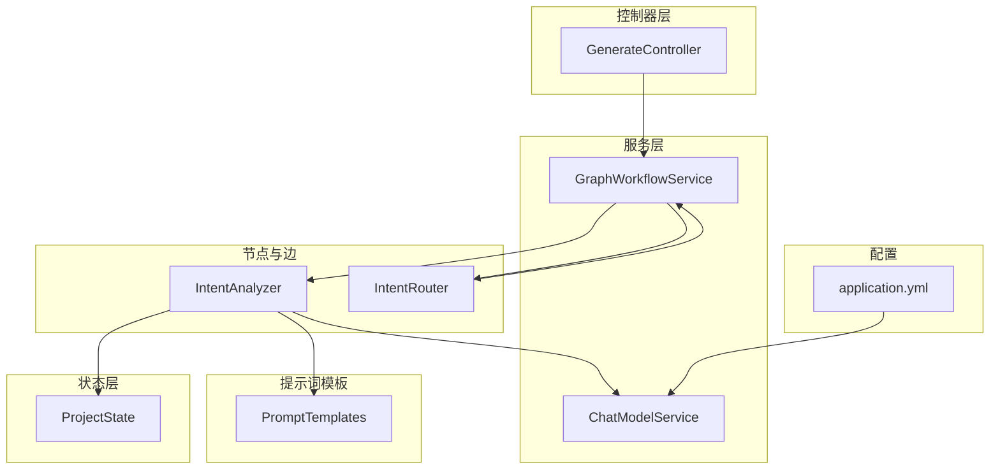
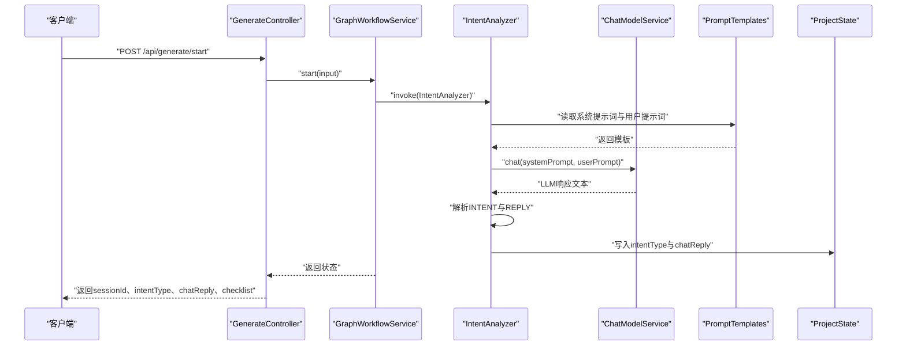
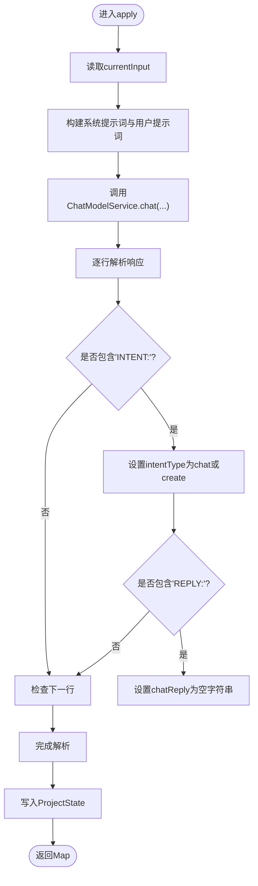
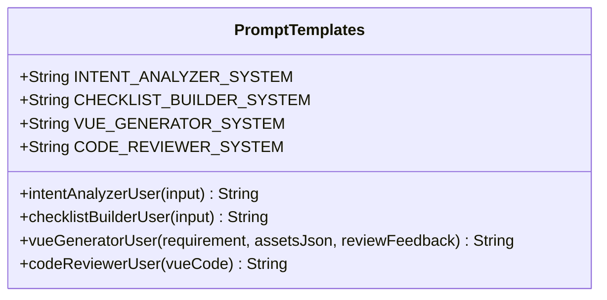
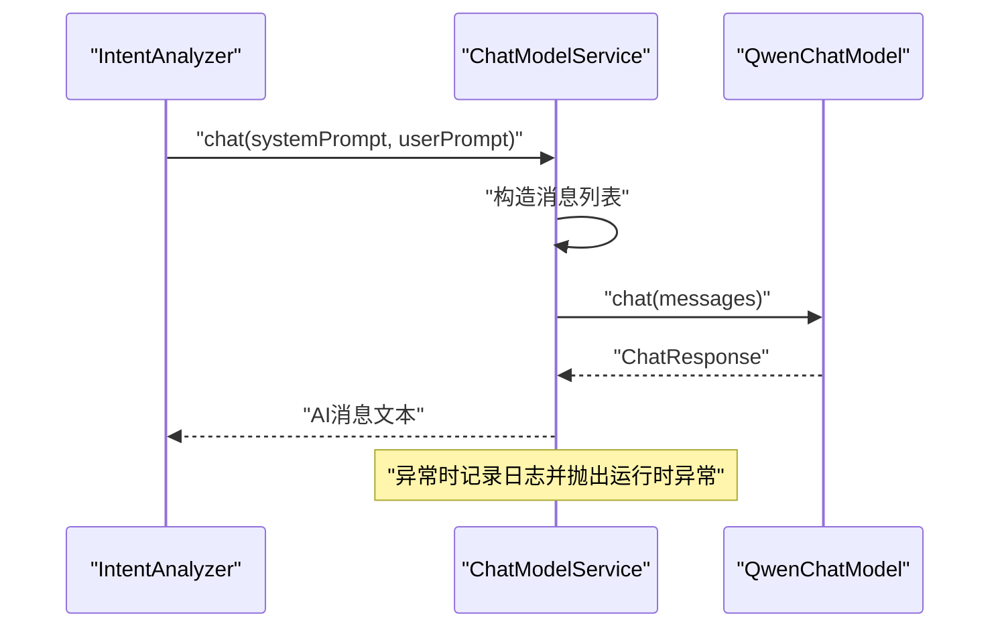
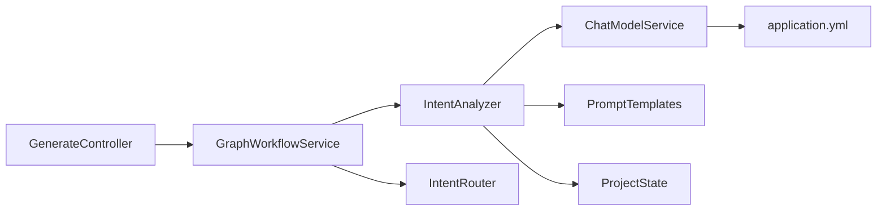

# 意图分析节点

<cite>
**本文引用的文件列表**
- [IntentAnalyzer.java](file://src/main/java/com/example/websitemother/node/IntentAnalyzer.java)
- [PromptTemplates.java](file://src/main/java/com/example/websitemother/prompt/PromptTemplates.java)
- [ChatModelService.java](file://src/main/java/com/example/websitemother/service/ChatModelService.java)
- [ProjectState.java](file://src/main/java/com/example/websitemother/state/ProjectState.java)
- [IntentRouter.java](file://src/main/java/com/example/websitemother/edge/IntentRouter.java)
- [GraphWorkflowService.java](file://src/main/java/com/example/websitemother/service/GraphWorkflowService.java)
- [GenerateController.java](file://src/main/java/com/example/websitemother/controller/GenerateController.java)
- [application.yml](file://src/main/resources/application.yml)
</cite>

## 目录
1. [简介](#简介)
2. [项目结构](#项目结构)
3. [核心组件](#核心组件)
4. [架构总览](#架构总览)
5. [详细组件分析](#详细组件分析)
6. [依赖关系分析](#依赖关系分析)
7. [性能考虑](#性能考虑)
8. [故障排查指南](#故障排查指南)
9. [结论](#结论)
10. [附录](#附录)

## 简介
本文件面向开发者，系统性阐述“意图分析节点”（IntentAnalyzer）的技术实现与使用方法。该节点负责判断用户输入是“闲聊”（chat）还是“建站需求”（create），并据此驱动后续工作流走向。文档将深入解析：
- 输入处理逻辑与状态流转
- 大语言模型（LLM）调用流程与错误处理
- 响应解析机制与意图分类决策
- 系统提示词模板与用户提示词动态生成规则
- 从LLM响应中提取INTENT与REPLY的策略
- 实际使用场景、调试技巧与性能优化建议

## 项目结构
该项目采用Spring Boot + LangGraph4J的工作流框架，按职责分层组织：
- 控制器层：对外提供REST API，封装会话与状态管理
- 服务层：工作流编排与LLM调用封装
- 状态层：统一的状态容器，承载多阶段数据
- 节点与边：LangGraph4J节点与路由边，定义工作流步骤与分支
- 提示词模板：集中管理各节点的系统与用户提示词

图表来源
- [GenerateController.java:1-131](file://src/main/java/com/example/websitemother/controller/GenerateController.java#L1-L131)
- [GraphWorkflowService.java:1-60](file://src/main/java/com/example/websitemother/service/GraphWorkflowService.java#L1-L60)
- [IntentAnalyzer.java:1-61](file://src/main/java/com/example/websitemother/node/IntentAnalyzer.java#L1-L61)
- [ChatModelService.java:1-58](file://src/main/java/com/example/websitemother/service/ChatModelService.java#L1-L58)
- [ProjectState.java:1-78](file://src/main/java/com/example/websitemother/state/ProjectState.java#L1-L78)
- [IntentRouter.java:1-31](file://src/main/java/com/example/websitemother/edge/IntentRouter.java#L1-L31)
- [PromptTemplates.java:1-93](file://src/main/java/com/example/websitemother/prompt/PromptTemplates.java#L1-L93)
- [application.yml:1-11](file://src/main/resources/application.yml#L1-L11)

章节来源
- [GenerateController.java:1-131](file://src/main/java/com/example/websitemother/controller/GenerateController.java#L1-L131)
- [GraphWorkflowService.java:1-60](file://src/main/java/com/example/websitemother/service/GraphWorkflowService.java#L1-L60)
- [application.yml:1-11](file://src/main/resources/application.yml#L1-L11)

## 核心组件
- 意图分析节点（IntentAnalyzer）：接收当前输入，调用LLM进行意图识别，解析响应中的INTENT与REPLY，并写回状态
- 提示词模板（PromptTemplates）：集中管理系统提示词与用户提示词生成规则
- LLM服务（ChatModelService）：封装DashScope Qwen模型调用，组装SystemMessage与UserMessage
- 工作流服务（GraphWorkflowService）：编排LangGraph4J工作流，执行start与resume阶段
- 状态容器（ProjectState）：统一的数据载体，提供键常量与类型安全的读取方法
- 意图路由边（IntentRouter）：根据intentType决定工作流分支（chat结束或进入checklist_builder）

章节来源
- [IntentAnalyzer.java:1-61](file://src/main/java/com/example/websitemother/node/IntentAnalyzer.java#L1-L61)
- [PromptTemplates.java:1-93](file://src/main/java/com/example/websitemother/prompt/PromptTemplates.java#L1-L93)
- [ChatModelService.java:1-58](file://src/main/java/com/example/websitemother/service/ChatModelService.java#L1-L58)
- [GraphWorkflowService.java:1-60](file://src/main/java/com/example/websitemother/service/GraphWorkflowService.java#L1-L60)
- [ProjectState.java:1-78](file://src/main/java/com/example/websitemother/state/ProjectState.java#L1-L78)
- [IntentRouter.java:1-31](file://src/main/java/com/example/websitemother/edge/IntentRouter.java#L1-L31)

## 架构总览
意图分析节点位于工作流的起始阶段，作为第一个节点执行。其典型调用序列如下：

图表来源
- [GenerateController.java:38-56](file://src/main/java/com/example/websitemother/controller/GenerateController.java#L38-L56)
- [GraphWorkflowService.java:31-41](file://src/main/java/com/example/websitemother/service/GraphWorkflowService.java#L31-L41)
- [IntentAnalyzer.java:24-59](file://src/main/java/com/example/websitemother/node/IntentAnalyzer.java#L24-L59)
- [ChatModelService.java:33-49](file://src/main/java/com/example/websitemother/service/ChatModelService.java#L33-L49)
- [PromptTemplates.java:13-23](file://src/main/java/com/example/websitemother/prompt/PromptTemplates.java#L13-L23)
- [ProjectState.java:15-24](file://src/main/java/com/example/websitemother/state/ProjectState.java#L15-L24)

## 详细组件分析

### 意图分析节点（IntentAnalyzer）
- 角色定位：LangGraph4J节点，负责意图识别与状态写回
- 输入来源：从ProjectState读取currentInput
- LLM调用：使用系统提示词与用户提示词调用ChatModelService
- 响应解析：逐行扫描LLM响应，提取INTENT与REPLY键值
- 输出写回：向状态写入intentType与chatReply

关键实现要点
- 系统提示词约束：要求严格输出INTENT与REPLY两行，便于解析
- 用户提示词生成：将用户输入包裹为"用户输入："...""格式
- 解析策略：大小写不敏感匹配"create"，REPLY为"null"或空字符串时转为空字符串
- 日志记录：记录输入与识别结果，便于调试

图表来源
- [IntentAnalyzer.java:24-59](file://src/main/java/com/example/websitemother/node/IntentAnalyzer.java#L24-L59)

章节来源
- [IntentAnalyzer.java:1-61](file://src/main/java/com/example/websitemother/node/IntentAnalyzer.java#L1-L61)

### 提示词模板（PromptTemplates）
- 系统提示词（INTENT_ANALYZER_SYSTEM）：明确两类意图类型与严格输出格式
- 用户提示词（intentAnalyzerUser）：将用户输入包装为固定格式字符串
- 其他节点模板：ChecklistBuilder、VueGenerator、CodeReviewer的系统与用户提示词模板

图表来源
- [PromptTemplates.java:1-93](file://src/main/java/com/example/websitemother/prompt/PromptTemplates.java#L1-L93)

章节来源
- [PromptTemplates.java:1-93](file://src/main/java/com/example/websitemother/prompt/PromptTemplates.java#L1-L93)

### LLM服务（ChatModelService）
- 功能：封装DashScope Qwen模型调用，组装SystemMessage与UserMessage
- 错误处理：捕获异常并抛出带明确信息的RuntimeException
- 调用简化：提供仅传入用户提示词的重载方法

图表来源
- [ChatModelService.java:33-49](file://src/main/java/com/example/websitemother/service/ChatModelService.java#L33-L49)

章节来源
- [ChatModelService.java:1-58](file://src/main/java/com/example/websitemother/service/ChatModelService.java#L1-L58)

### 工作流服务（GraphWorkflowService）
- start阶段：初始化CURRENT_INPUT，执行startGraph
- resume阶段：基于已有状态执行resumeGraph
- 异常处理：统一捕获并抛出带上下文的运行时异常

章节来源
- [GraphWorkflowService.java:1-60](file://src/main/java/com/example/websitemother/service/GraphWorkflowService.java#L1-L60)

### 状态容器（ProjectState）
- 定义了工作流中使用的键常量（CURRENT_INPUT、INTENT_TYPE、CHAT_REPLY等）
- 提供类型安全的读取方法，支持默认值与类型转换

章节来源
- [ProjectState.java:1-78](file://src/main/java/com/example/websitemother/state/ProjectState.java#L1-L78)

### 意图路由边（IntentRouter）
- 根据intentType决定分支：chat -> __end__，create -> checklist_builder
- 作为LangGraph4J的EdgeAction参与条件路由

章节来源
- [IntentRouter.java:1-31](file://src/main/java/com/example/websitemother/edge/IntentRouter.java#L1-L31)

## 依赖关系分析
- IntentAnalyzer依赖ChatModelService与PromptTemplates，同时读写ProjectState
- GraphWorkflowService编排IntentAnalyzer节点与IntentRouter边
- GenerateController负责会话生命周期与状态存储，调用GraphWorkflowService
- ChatModelService依赖DashScope Qwen模型，配置来源于application.yml

图表来源
- [IntentAnalyzer.java:1-61](file://src/main/java/com/example/websitemother/node/IntentAnalyzer.java#L1-L61)
- [ChatModelService.java:1-58](file://src/main/java/com/example/websitemother/service/ChatModelService.java#L1-L58)
- [PromptTemplates.java:1-93](file://src/main/java/com/example/websitemother/prompt/PromptTemplates.java#L1-L93)
- [ProjectState.java:1-78](file://src/main/java/com/example/websitemother/state/ProjectState.java#L1-L78)
- [IntentRouter.java:1-31](file://src/main/java/com/example/websitemother/edge/IntentRouter.java#L1-L31)
- [GraphWorkflowService.java:1-60](file://src/main/java/com/example/websitemother/service/GraphWorkflowService.java#L1-L60)
- [GenerateController.java:1-131](file://src/main/java/com/example/websitemother/controller/GenerateController.java#L1-L131)
- [application.yml:1-11](file://src/main/resources/application.yml#L1-L11)

章节来源
- [application.yml:1-11](file://src/main/resources/application.yml#L1-L11)

## 性能考虑
- LLM调用成本：每次意图分析都会触发一次LLM调用，建议在批量场景中合并请求或引入缓存
- 响应解析复杂度：逐行扫描，时间复杂度O(n)，空间复杂度O(1)，满足一般需求
- 状态写入：仅写入少量键值，开销极低
- 并发与会话：会话状态存储在内存中（演示用途），生产环境需替换为分布式缓存（如Redis）
- 配置优化：合理设置模型参数（如温度、最大令牌数）以平衡准确性与延迟

## 故障排查指南
常见问题与解决思路
- LLM调用失败
  - 现象：抛出运行时异常，日志记录错误信息
  - 排查：检查DashScope API密钥与模型名称配置，确认网络连通性
  - 参考：[ChatModelService.java:45-48](file://src/main/java/com/example/websitemother/service/ChatModelService.java#L45-L48)
- 响应格式不符合预期
  - 现象：INTENT或REPLY未被正确识别
  - 排查：确认系统提示词严格要求输出INTENT与REPLY两行，且REPLY为"null"或空字符串时应视为空字符串
  - 参考：[IntentAnalyzer.java:38-51](file://src/main/java/com/example/websitemother/node/IntentAnalyzer.java#L38-L51)
- 会话状态丢失
  - 现象：/resume接口报会话不存在或已过期
  - 排查：确认sessionId有效，检查内存会话存储是否过期清理
  - 参考：[GenerateController.java:70-73](file://src/main/java/com/example/websitemother/controller/GenerateController.java#L70-L73)
- 工作流启动/恢复失败
  - 现象：startGraph或resumeGraph执行异常
  - 排查：查看日志堆栈，确认节点依赖与状态键一致
  - 参考：[GraphWorkflowService.java:37-39](file://src/main/java/com/example/websitemother/service/GraphWorkflowService.java#L37-L39)

章节来源
- [ChatModelService.java:45-48](file://src/main/java/com/example/websitemother/service/ChatModelService.java#L45-L48)
- [IntentAnalyzer.java:38-51](file://src/main/java/com/example/websitemother/node/IntentAnalyzer.java#L38-L51)
- [GenerateController.java:70-73](file://src/main/java/com/example/websitemother/controller/GenerateController.java#L70-L73)
- [GraphWorkflowService.java:37-39](file://src/main/java/com/example/websitemother/service/GraphWorkflowService.java#L37-L39)

## 结论
IntentAnalyzer通过严格的提示词约束与稳健的响应解析，实现了对用户输入的意图识别，并与工作流系统无缝集成。其设计遵循单一职责原则，便于扩展与维护。建议在生产环境中：
- 使用分布式缓存替代内存会话存储
- 为LLM调用增加超时与重试策略
- 对提示词模板进行A/B测试与持续优化
- 在前端增加意图识别的可视化反馈与重试机制

## 附录

### 输入输出格式与示例
- 输入
  - 请求体：StartRequest.input
  - 示例：见[GenerateController.java:104-106](file://src/main/java/com/example/websitemother/controller/GenerateController.java#L104-L106)
- 输出
  - 响应体：StartResponse.sessionId、intentType、chatReply、checklist
  - 示例：见[GenerateController.java:109-114](file://src/main/java/com/example/websitemother/controller/GenerateController.java#L109-L114)

章节来源
- [GenerateController.java:103-131](file://src/main/java/com/example/websitemother/controller/GenerateController.java#L103-L131)

### 提示词模板使用方式
- 系统提示词：用于约束LLM输出格式，确保INTENT与REPLY两行
- 用户提示词：将用户输入包裹为固定格式字符串
- 参考：[PromptTemplates.java:13-23](file://src/main/java/com/example/websitemother/prompt/PromptTemplates.java#L13-L23)

章节来源
- [PromptTemplates.java:13-23](file://src/main/java/com/example/websitemother/prompt/PromptTemplates.java#L13-L23)

### 从LLM响应提取INTENT与REPLY
- INTENT解析：大小写不敏感匹配"create"，否则视为chat
- REPLY解析：去除前后空白，若为"null"或空字符串则设为空字符串
- 参考：[IntentAnalyzer.java:38-51](file://src/main/java/com/example/websitemother/node/IntentAnalyzer.java#L38-L51)

章节来源
- [IntentAnalyzer.java:38-51](file://src/main/java/com/example/websitemother/node/IntentAnalyzer.java#L38-L51)

### 错误处理策略
- LLM调用异常：记录错误并抛出运行时异常
- 工作流异常：捕获并抛出带上下文的运行时异常
- 参考：
  - [ChatModelService.java:45-48](file://src/main/java/com/example/websitemother/service/ChatModelService.java#L45-L48)
  - [GraphWorkflowService.java:37-39](file://src/main/java/com/example/websitemother/service/GraphWorkflowService.java#L37-L39)

章节来源
- [ChatModelService.java:45-48](file://src/main/java/com/example/websitemother/service/ChatModelService.java#L45-L48)
- [GraphWorkflowService.java:37-39](file://src/main/java/com/example/websitemother/service/GraphWorkflowService.java#L37-L39)

### 性能优化建议
- 缓存：对常见输入进行缓存，减少重复LLM调用
- 批处理：合并多个意图分析请求
- 超时与重试：为LLM调用设置超时与指数退避重试
- 配置：调整模型参数以平衡准确率与延迟
- 参考：[application.yml:6-11](file://src/main/resources/application.yml#L6-L11)

章节来源
- [application.yml:6-11](file://src/main/resources/application.yml#L6-L11)

### 实际使用场景与调试技巧
- 场景一：用户输入"你好" → 意图识别为chat，返回友好回复
- 场景二：用户输入"帮我做个个人博客" → 意图识别为create，进入checklist_builder
- 调试技巧：
  - 查看日志：关注IntentAnalyzer与ChatModelService的日志输出
  - 校验提示词：确保系统提示词严格要求INTENT与REPLY两行
  - 会话追踪：使用sessionId定位会话状态，避免并发冲突
  - 参考：
    - [IntentAnalyzer.java:27-27](file://src/main/java/com/example/websitemother/node/IntentAnalyzer.java#L27-L27)
    - [GenerateController.java:40-41](file://src/main/java/com/example/websitemother/controller/GenerateController.java#L40-L41)

章节来源
- [IntentAnalyzer.java:27-27](file://src/main/java/com/example/websitemother/node/IntentAnalyzer.java#L27-L27)
- [GenerateController.java:40-41](file://src/main/java/com/example/websitemother/controller/GenerateController.java#L40-L41)