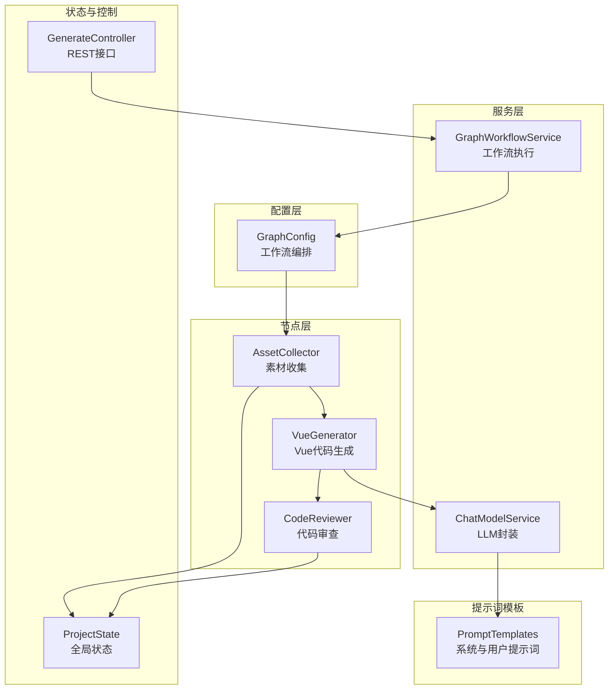
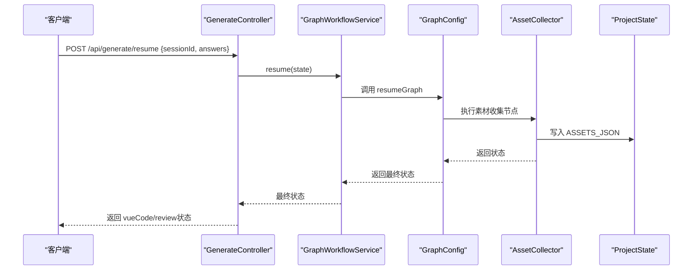
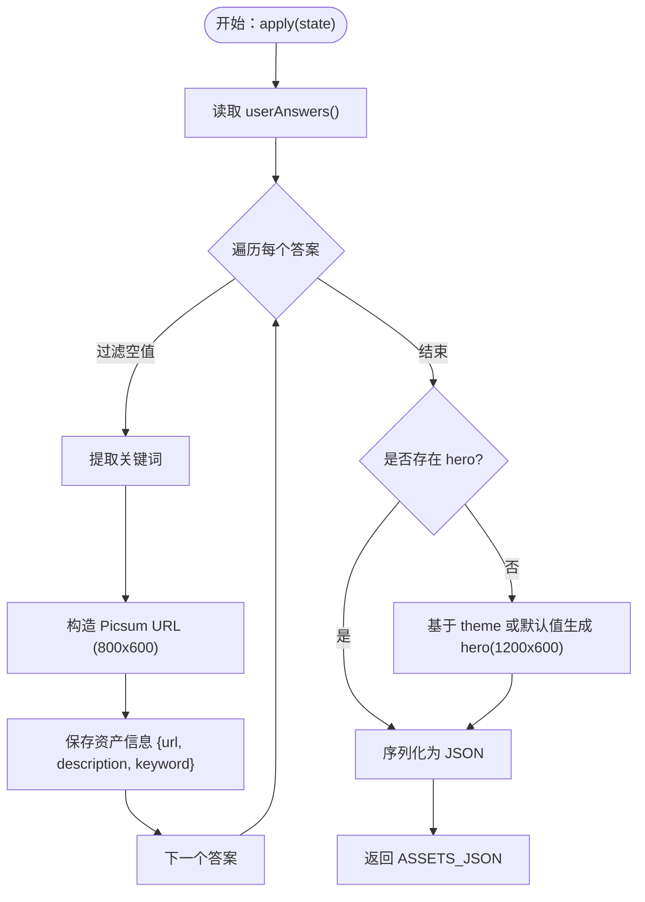
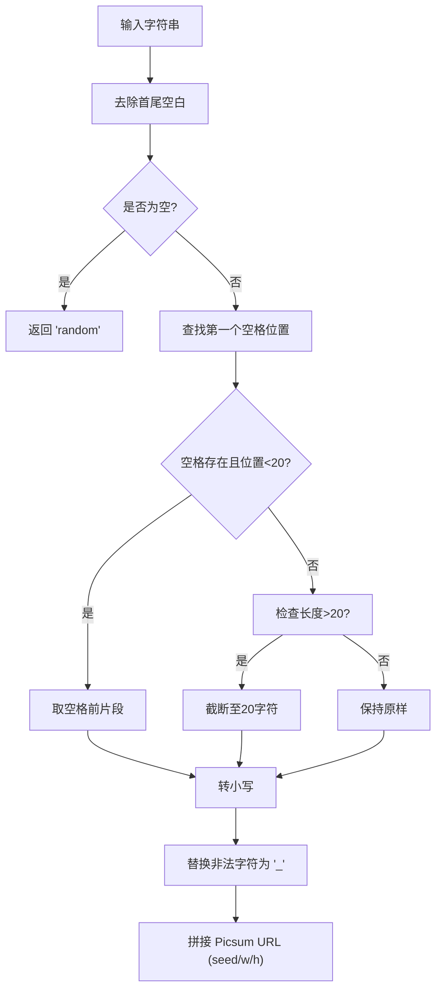
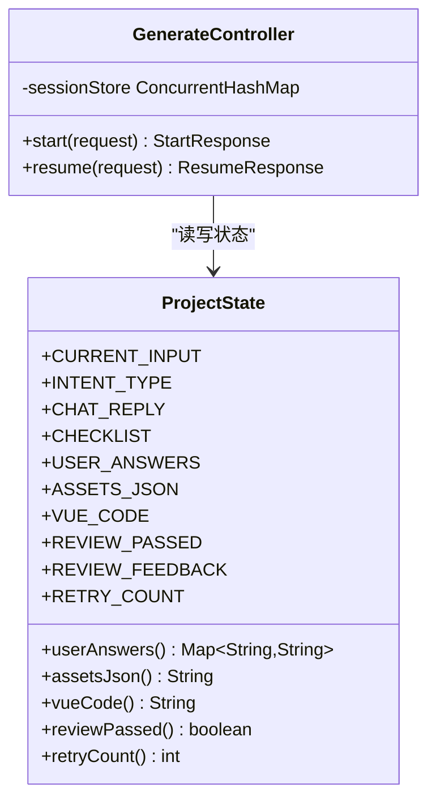
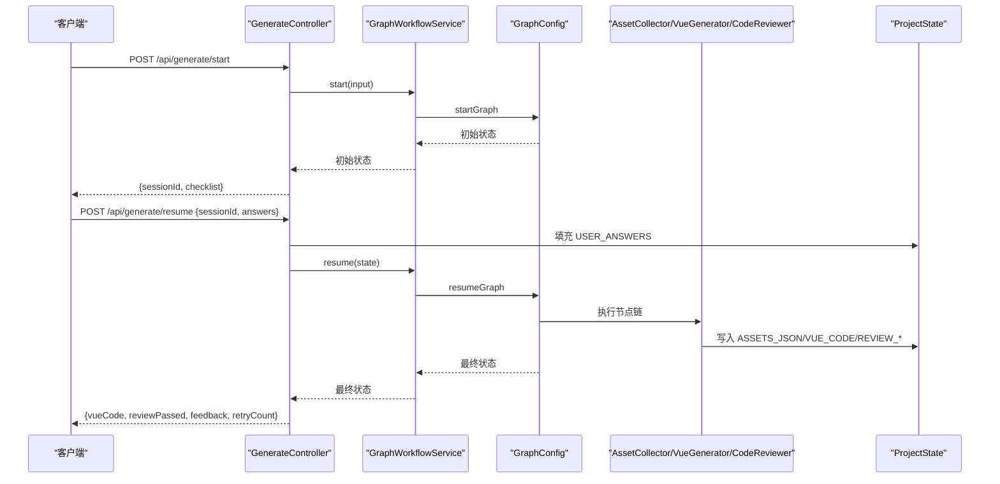
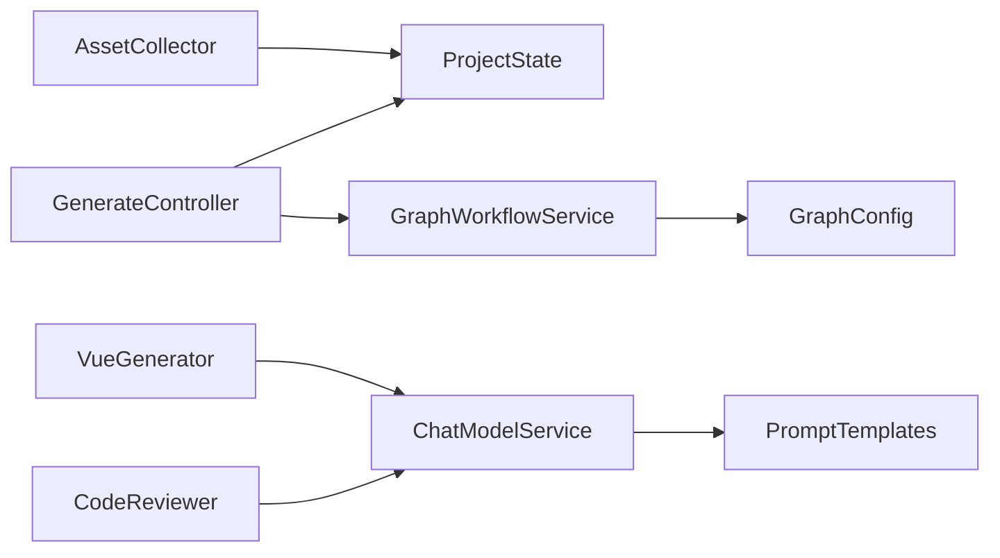

# 素材收集节点

<cite>
**本文引用的文件**
- [AssetCollector.java](file://src/main/java/com/example/websitemother/node/AssetCollector.java)
- [GraphConfig.java](file://src/main/java/com/example/websitemother/config/GraphConfig.java)
- [GraphWorkflowService.java](file://src/main/java/com/example/websitemother/service/GraphWorkflowService.java)
- [ProjectState.java](file://src/main/java/com/example/websitemother/state/ProjectState.java)
- [GenerateController.java](file://src/main/java/com/example/websitemother/controller/GenerateController.java)
- [ChatModelService.java](file://src/main/java/com/example/websitemother/service/ChatModelService.java)
- [PromptTemplates.java](file://src/main/java/com/example/websitemother/prompt/PromptTemplates.java)
- [VueGenerator.java](file://src/main/java/com/example/websitemother/node/VueGenerator.java)
- [application.yml](file://src/main/resources/application.yml)
</cite>

## 目录
1. [简介](#简介)
2. [项目结构](#项目结构)
3. [核心组件](#核心组件)
4. [架构总览](#架构总览)
5. [详细组件分析](#详细组件分析)
6. [依赖关系分析](#依赖关系分析)
7. [性能考虑](#性能考虑)
8. [故障排除指南](#故障排除指南)
9. [结论](#结论)
10. [附录](#附录)

## 简介
本技术文档围绕 AssetCollector 素材收集节点展开，系统阐述其在网站生成工作流中的职责与实现细节。该节点负责根据用户完善的需求，自动生成占位图片素材（基于 Picsum.photos），并以 JSON 形式输出，供后续 Vue 代码生成节点使用。文档将深入解析素材搜索策略、关键词提取与 URL 构造、Picsum.photos API 集成方式、素材描述与元数据处理、质量筛选机制、LLM 在素材描述生成中的作用、素材分类逻辑以及存储管理策略，并提供 API 调用流程、数据处理管道与错误恢复机制的具体示例路径，最后给出最佳实践、性能优化建议与故障排除指南。

## 项目结构
本项目采用 Spring Boot + LangGraph4j 的状态图工作流架构，按“配置-节点-服务-状态-控制器”的层次组织。AssetCollector 作为工作流中的一个节点，位于“素材收集”阶段，承接上一阶段的用户答案，输出 assetsJson，供下一阶段的 Vue 代码生成使用。

图表来源
- [GraphConfig.java:51-97](file://src/main/java/com/example/websitemother/config/GraphConfig.java#L51-L97)
- [AssetCollector.java:18-59](file://src/main/java/com/example/websitemother/node/AssetCollector.java#L18-L59)
- [GraphWorkflowService.java:31-58](file://src/main/java/com/example/websitemother/service/GraphWorkflowService.java#L31-L58)
- [ProjectState.java:13-78](file://src/main/java/com/example/websitemother/state/ProjectState.java#L13-L78)
- [GenerateController.java:33-84](file://src/main/java/com/example/websitemother/controller/GenerateController.java#L33-L84)
- [ChatModelService.java:23-49](file://src/main/java/com/example/websitemother/service/ChatModelService.java#L23-L49)
- [PromptTemplates.java:46-72](file://src/main/java/com/example/websitemother/prompt/PromptTemplates.java#L46-L72)

章节来源
- [GraphConfig.java:51-97](file://src/main/java/com/example/websitemother/config/GraphConfig.java#L51-L97)
- [GraphWorkflowService.java:31-58](file://src/main/java/com/example/websitemother/service/GraphWorkflowService.java#L31-L58)
- [ProjectState.java:13-78](file://src/main/java/com/example/websitemother/state/ProjectState.java#L13-L78)
- [GenerateController.java:33-84](file://src/main/java/com/example/websitemother/controller/GenerateController.java#L33-L84)

## 核心组件
- AssetCollector：实现素材收集节点，依据用户答案生成占位图 URL 并构造资产元数据，确保至少包含一张 hero 主图，最终输出 assetsJson。
- ProjectState：LangGraph 全局状态容器，承载当前输入、意图类型、清单、用户答案、素材 JSON、Vue 代码、审查结果与重试计数等键值。
- GraphWorkflowService：封装 startGraph 与 resumeGraph 的执行逻辑，负责工作流的启动与恢复。
- GraphConfig：工作流编排配置，定义节点与边的关系，形成两阶段工作流。
- GenerateController：对外提供 /api/generate/start 与 /api/generate/resume 接口，管理会话与状态流转。
- ChatModelService：封装 DashScope Qwen 模型调用，统一组装 SystemMessage 与 UserMessage。
- PromptTemplates：集中管理各节点的提示词模板，包括 VueGenerator 的系统提示词与用户提示词拼装。

章节来源
- [AssetCollector.java:18-59](file://src/main/java/com/example/websitemother/node/AssetCollector.java#L18-L59)
- [ProjectState.java:15-24](file://src/main/java/com/example/websitemother/state/ProjectState.java#L15-L24)
- [GraphWorkflowService.java:31-58](file://src/main/java/com/example/websitemother/service/GraphWorkflowService.java#L31-L58)
- [GraphConfig.java:51-97](file://src/main/java/com/example/websitemother/config/GraphConfig.java#L51-L97)
- [GenerateController.java:33-84](file://src/main/java/com/example/websitemother/controller/GenerateController.java#L33-L84)
- [ChatModelService.java:23-49](file://src/main/java/com/example/websitemother/service/ChatModelService.java#L23-L49)
- [PromptTemplates.java:46-72](file://src/main/java/com/example/websitemother/prompt/PromptTemplates.java#L46-L72)

## 架构总览
AssetCollector 处于工作流的第二阶段，接收来自前端的用户答案（USER_ANSWERS），生成 assetsJson，再进入 VueGenerator 进行代码生成。审查不通过时，通过 ReviewRouter 控制回到 VueGenerator 重试，最多三次。

图表来源
- [GenerateController.java:56-84](file://src/main/java/com/example/websitemother/controller/GenerateController.java#L56-L84)
- [GraphWorkflowService.java:49-58](file://src/main/java/com/example/websitemother/service/GraphWorkflowService.java#L49-L58)
- [GraphConfig.java:77-97](file://src/main/java/com/example/websitemother/config/GraphConfig.java#L77-L97)
- [AssetCollector.java:22-59](file://src/main/java/com/example/websitemother/node/AssetCollector.java#L22-L59)
- [ProjectState.java:51-53](file://src/main/java/com/example/websitemother/state/ProjectState.java#L51-L53)

## 详细组件分析

### 素材收集节点（AssetCollector）
- 输入：ProjectState.userAnswers()，即用户完善后的键值对（如主题、风格、模块等）。
- 关键处理逻辑：
  - 遍历用户答案，对每个非空值提取关键词，构造 Picsum URL（800x600），并记录 url/description/keyword。
  - 若未包含 hero 字段，则基于 theme 或默认值生成一张 1200x600 的主图。
  - 将资产集合序列化为 JSON，写入 ASSETS_JSON 键。
- 输出：Map.of(ProjectState.ASSETS_JSON, assetsJson)。

图表来源
- [AssetCollector.java:22-59](file://src/main/java/com/example/websitemother/node/AssetCollector.java#L22-L59)
- [ProjectState.java:47-49](file://src/main/java/com/example/websitemother/state/ProjectState.java#L47-L49)

章节来源
- [AssetCollector.java:22-59](file://src/main/java/com/example/websitemother/node/AssetCollector.java#L22-L59)
- [ProjectState.java:47-53](file://src/main/java/com/example/websitemother/state/ProjectState.java#L47-L53)

### 关键词提取与 URL 构造策略
- 关键词提取规则：
  - 去除首尾空白；若为空返回 "random"。
  - 优先取第一个空格前的词，且长度小于 20。
  - 若超过 20 字符则截断至 20。
  - 统一转为小写，确保 URL 安全性。
- URL 构造：
  - 使用 Picsum.photos 的 seed 参数，结合宽高参数，生成确定性图片 URL。
  - 对 seed 中的特殊字符进行替换，避免非法字符。

图表来源
- [AssetCollector.java:64-87](file://src/main/java/com/example/websitemother/node/AssetCollector.java#L64-L87)

章节来源
- [AssetCollector.java:64-87](file://src/main/java/com/example/websitemother/node/AssetCollector.java#L64-L87)

### 素材搜索策略与质量筛选
- 搜索策略：
  - 以用户输入为主题关键词，通过 Picsum.photos 的 seed 机制生成与主题一致的占位图，提升视觉一致性。
  - 对于 hero 主图，采用更大尺寸（1200x600）以满足主视觉展示需求。
- 质量筛选：
  - 仅保留非空值，避免无效素材。
  - 通过关键词长度与字符安全化，确保 URL 可用性与稳定性。
- 素材分类逻辑：
  - 以用户答案的键名为分类标识（如 hero、banner、icon 等），每个键对应一组元数据（url、description、keyword）。
  - 若缺少 hero，自动补全，保证主视觉素材可用。

章节来源
- [AssetCollector.java:29-53](file://src/main/java/com/example/websitemother/node/AssetCollector.java#L29-L53)

### LLM 在素材描述生成中的作用
- 当前实现中，素材描述直接来源于用户输入（description 字段）。LLM 未直接参与素材描述生成。
- LLM 的作用体现在后续 VueGenerator 中，用于根据需求与素材生成 Vue 代码，确保组件正确使用素材并具备良好结构与样式。

章节来源
- [AssetCollector.java:38-42](file://src/main/java/com/example/websitemother/node/AssetCollector.java#L38-L42)
- [VueGenerator.java:24-62](file://src/main/java/com/example/websitemother/node/VueGenerator.java#L24-L62)
- [ChatModelService.java:23-49](file://src/main/java/com/example/websitemother/service/ChatModelService.java#L23-L49)
- [PromptTemplates.java:46-72](file://src/main/java/com/example/websitemother/prompt/PromptTemplates.java#L46-L72)

### 存储管理策略
- 会话状态存储：
  - GenerateController 使用内存级 ConcurrentHashMap 存储会话状态，键为 sessionId，值为 ProjectState。
  - /api/generate/start 创建会话并返回 sessionId；/api/generate/resume 通过 sessionId 获取状态并继续执行。
- 状态键管理：
  - ProjectState 统一管理所有键值，包括 ASSETS_JSON，确保跨节点共享与传递。

图表来源
- [ProjectState.java:15-76](file://src/main/java/com/example/websitemother/state/ProjectState.java#L15-L76)
- [GenerateController.java:27-84](file://src/main/java/com/example/websitemother/controller/GenerateController.java#L27-L84)

章节来源
- [GenerateController.java:27-84](file://src/main/java/com/example/websitemother/controller/GenerateController.java#L27-L84)
- [ProjectState.java:15-76](file://src/main/java/com/example/websitemother/state/ProjectState.java#L15-L76)

### API 调用流程与数据处理管道
- /api/generate/start：接收用户输入，启动第一阶段工作流，返回 sessionId、意图类型、聊天回复与需求清单。
- /api/generate/resume：接收 sessionId 与用户答案，填充 ProjectState.USER_ANSWERS，执行第二阶段工作流，返回 Vue 代码、审查结果与重试计数。
- 数据处理管道：
  - AssetCollector 生成 assetsJson 并写入状态。
  - VueGenerator 读取 assetsJson 与用户答案，调用 LLM 生成 Vue 代码。
  - CodeReviewer 读取 Vue 代码，调用 LLM 进行审查，输出 RESULT 与 FEEDBACK，并更新 retryCount。

图表来源
- [GenerateController.java:33-84](file://src/main/java/com/example/websitemother/controller/GenerateController.java#L33-L84)
- [GraphWorkflowService.java:31-58](file://src/main/java/com/example/websitemother/service/GraphWorkflowService.java#L31-L58)
- [GraphConfig.java:51-97](file://src/main/java/com/example/websitemother/config/GraphConfig.java#L51-L97)
- [AssetCollector.java:22-59](file://src/main/java/com/example/websitemother/node/AssetCollector.java#L22-L59)
- [VueGenerator.java:24-62](file://src/main/java/com/example/websitemother/node/VueGenerator.java#L24-L62)
- [ProjectState.java:51-76](file://src/main/java/com/example/websitemother/state/ProjectState.java#L51-L76)

## 依赖关系分析
- 节点依赖：
  - AssetCollector 依赖 ProjectState 读取用户答案，输出 assetsJson。
  - VueGenerator 依赖 ChatModelService 与 PromptTemplates，读取 assetsJson 与用户答案生成 Vue 代码。
  - CodeReviewer 依赖 ChatModelService 与 PromptTemplates，对 Vue 代码进行审查。
- 配置与执行：
  - GraphConfig 定义节点与边，GraphWorkflowService 负责执行。
  - GenerateController 作为入口，管理会话与状态。

图表来源
- [GraphConfig.java:32-45](file://src/main/java/com/example/websitemother/config/GraphConfig.java#L32-L45)
- [GraphWorkflowService.java:19-23](file://src/main/java/com/example/websitemother/service/GraphWorkflowService.java#L19-L23)
- [AssetCollector.java:3,20](file://src/main/java/com/example/websitemother/node/AssetCollector.java#L3,L20)
- [VueGenerator.java:21-22](file://src/main/java/com/example/websitemother/node/VueGenerator.java#L21-L22)
- [CodeReviewer.java:21-22](file://src/main/java/com/example/websitemother/node/CodeReviewer.java#L21-L22)
- [ChatModelService.java:23-24](file://src/main/java/com/example/websitemother/service/ChatModelService.java#L23-L24)
- [PromptTemplates.java:46-72](file://src/main/java/com/example/websitemother/prompt/PromptTemplates.java#L46-L72)
- [GenerateController.java:24-25](file://src/main/java/com/example/websitemother/controller/GenerateController.java#L24-L25)

章节来源
- [GraphConfig.java:32-45](file://src/main/java/com/example/websitemother/config/GraphConfig.java#L32-L45)
- [GraphWorkflowService.java:19-23](file://src/main/java/com/example/websitemother/service/GraphWorkflowService.java#L19-L23)
- [AssetCollector.java:3,20](file://src/main/java/com/example/websitemother/node/AssetCollector.java#L3,L20)
- [VueGenerator.java:21-22](file://src/main/java/com/example/websitemother/node/VueGenerator.java#L21-L22)
- [CodeReviewer.java:21-22](file://src/main/java/com/example/websitemother/node/CodeReviewer.java#L21-L22)
- [ChatModelService.java:23-24](file://src/main/java/com/example/websitemother/service/ChatModelService.java#L23-L24)
- [PromptTemplates.java:46-72](file://src/main/java/com/example/websitemother/prompt/PromptTemplates.java#L46-L72)
- [GenerateController.java:24-25](file://src/main/java/com/example/websitemother/controller/GenerateController.java#L24-L25)

## 性能考虑
- 图片加载性能：
  - 使用 Picsum.photos 的固定尺寸（如 800x600、1200x600）可减少带宽与渲染开销；若需更高分辨率，建议在前端懒加载与缩放。
- 关键词提取与 URL 构造：
  - 关键词长度限制与字符安全化可避免过长 URL 与非法字符导致的网络错误。
- LLM 调用成本：
  - ChatModelService 的调用应尽量合并消息与复用会话，避免重复构造 SystemMessage/UserMessage。
- 工作流并发：
  - GenerateController 使用内存存储会话，生产环境建议替换为 Redis 等持久化缓存，以支持多实例部署与会话恢复。

## 故障排除指南
- 素材收集失败：
  - 检查用户答案是否为空或仅包含空白字符；确认 ProjectState.USER_ANSWERS 是否正确填充。
  - 查看日志中 [AssetCollector] 的输入与输出，定位关键词提取与 URL 构造问题。
- LLM 调用异常：
  - ChatModelService 在调用失败时会抛出异常并记录错误日志；检查 application.yml 中的 API Key 与模型名称配置。
- 工作流执行异常：
  - GraphWorkflowService 在 start/resume 执行失败时会抛出异常；查看错误堆栈并确认 GraphConfig 的节点装配与边条件。
- 审查循环：
  - ReviewRouter 最多重试 3 次；若多次失败，检查 VueGenerator 的输出是否符合预期，或调整 PromptTemplates 的约束。

章节来源
- [AssetCollector.java:22-59](file://src/main/java/com/example/websitemother/node/AssetCollector.java#L22-L59)
- [ChatModelService.java:33-49](file://src/main/java/com/example/websitemother/service/ChatModelService.java#L33-L49)
- [application.yml:4-9](file://src/main/resources/application.yml#L4-L9)
- [GraphWorkflowService.java:31-58](file://src/main/java/com/example/websitemother/service/GraphWorkflowService.java#L31-L58)
- [GraphConfig.java:51-97](file://src/main/java/com/example/websitemother/config/GraphConfig.java#L51-L97)
- [ReviewRouter.java:16-42](file://src/main/java/com/example/websitemother/edge/ReviewRouter.java#L16-L42)

## 结论
AssetCollector 通过简洁而稳健的关键词提取与 Picsum.photos URL 构造策略，实现了对网站构建所需图片、图标与媒体素材的自动化采集。配合 ProjectState 的状态管理与 GraphWorkflowService 的工作流编排，形成了从素材收集到 Vue 代码生成再到代码审查的闭环。尽管当前素材描述直接来源于用户输入，但后续可通过 LLM 增强描述生成与分类能力，进一步提升素材的可用性与一致性。建议在生产环境中引入持久化缓存与更完善的错误恢复机制，以保障系统的稳定性与可扩展性。

## 附录
- 配置项参考：
  - application.yml 中的 LangChain4J DashScope Qwen 模型配置，用于后续增强素材描述与分类。
- API 示例路径：
  - /api/generate/start：[GenerateController.java:33-51](file://src/main/java/com/example/websitemother/controller/GenerateController.java#L33-L51)
  - /api/generate/resume：[GenerateController.java:56-84](file://src/main/java/com/example/websitemother/controller/GenerateController.java#L56-L84)
- 关键实现路径：
  - 素材收集节点：[AssetCollector.java:22-59](file://src/main/java/com/example/websitemother/node/AssetCollector.java#L22-L59)
  - 关键词提取与 URL 构造：[AssetCollector.java:64-87](file://src/main/java/com/example/websitemother/node/AssetCollector.java#L64-L87)
  - LLM 封装与提示词：[ChatModelService.java:23-49](file://src/main/java/com/example/websitemother/service/ChatModelService.java#L23-L49)，[PromptTemplates.java:46-72](file://src/main/java/com/example/websitemother/prompt/PromptTemplates.java#L46-L72)
  - 工作流编排与执行：[GraphConfig.java:51-97](file://src/main/java/com/example/websitemother/config/GraphConfig.java#L51-L97)，[GraphWorkflowService.java:31-58](file://src/main/java/com/example/websitemother/service/GraphWorkflowService.java#L31-L58)