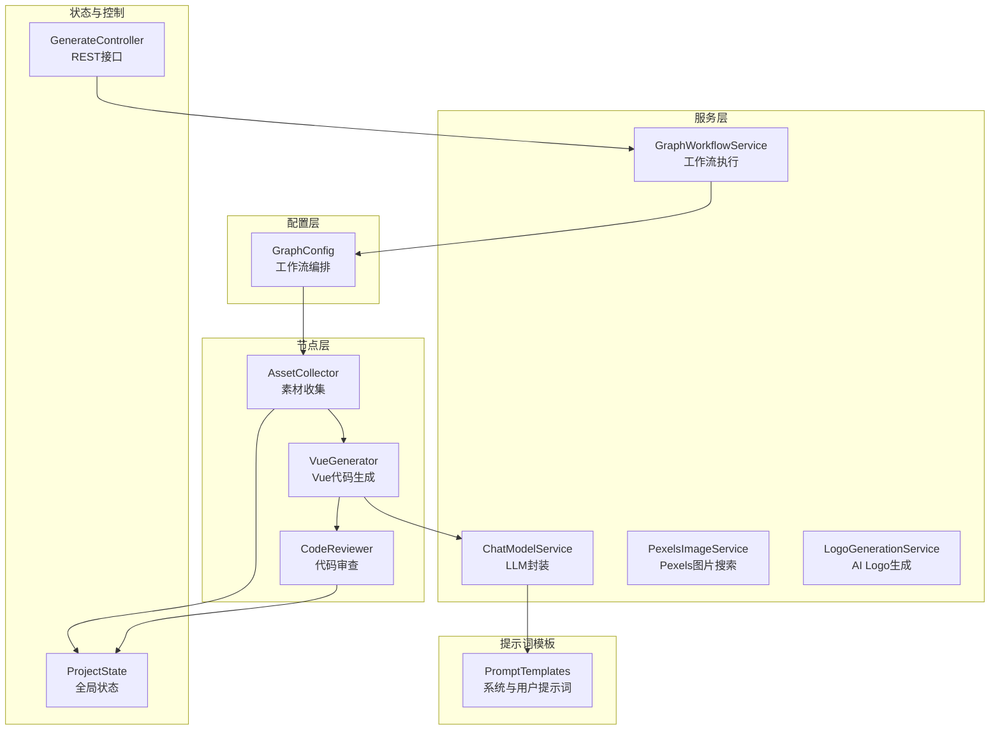
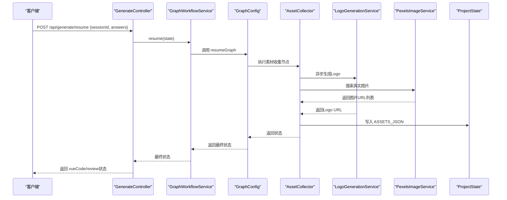
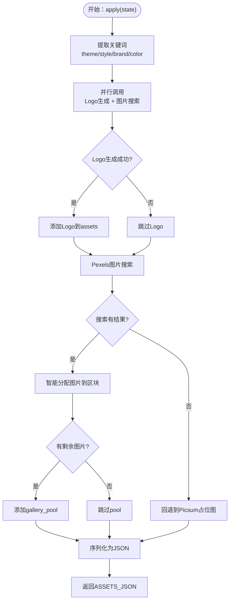
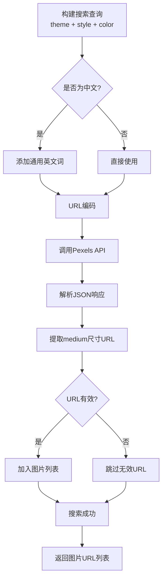
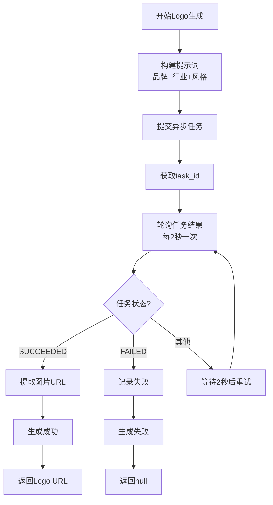
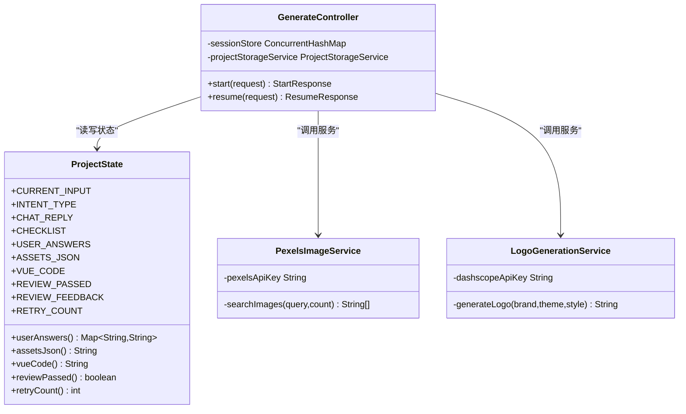
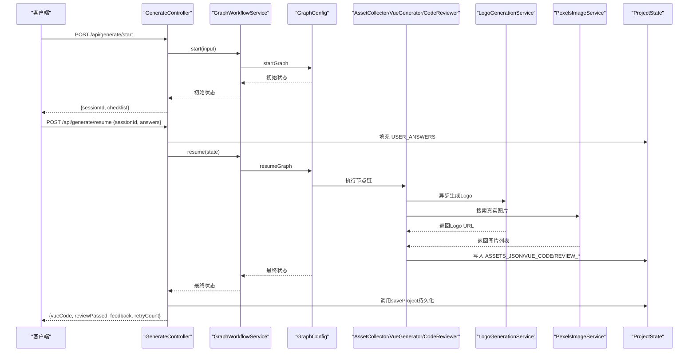
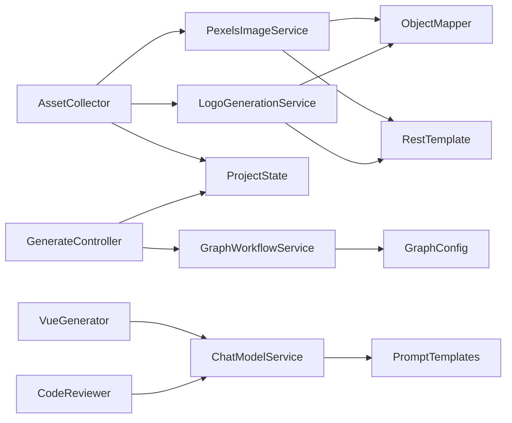

# 素材收集节点

<cite>
**本文引用的文件**
- [AssetCollector.java](file://src/main/java/com/example/websitemother/node/AssetCollector.java)
- [PexelsImageService.java](file://src/main/java/com/example/websitemother/service/PexelsImageService.java)
- [LogoGenerationService.java](file://src/main/java/com/example/websitemother/service/LogoGenerationService.java)
- [GraphConfig.java](file://src/main/java/com/example/websitemother/config/GraphConfig.java)
- [GraphWorkflowService.java](file://src/main/java/com/example/websitemother/service/GraphWorkflowService.java)
- [ProjectState.java](file://src/main/java/com/example/websitemother/state/ProjectState.java)
- [GenerateController.java](file://src/main/java/com/example/websitemother/controller/GenerateController.java)
- [ChatModelService.java](file://src/main/java/com/example/websitemother/service/ChatModelService.java)
- [PromptTemplates.java](file://src/main/java/com/example/websitemother/prompt/PromptTemplates.java)
- [VueGenerator.java](file://src/main/java/com/example/websitemother/node/VueGenerator.java)
- [application.yml](file://src/main/resources/application.yml)
</cite>

## 更新摘要
**所做更改**
- 完全重构素材收集策略：从Picsum占位图系统迁移到Pexels API集成
- 新增AI Logo生成服务集成，基于通义万相实现品牌Logo自动生成
- 实现智能关键词提取与多源图片搜索策略
- 增加Pexels搜索失败的回退机制，确保系统稳定性
- 更新素材分类逻辑，支持gallery_pool额外素材池

## 目录
1. [简介](#简介)
2. [项目结构](#项目结构)
3. [核心组件](#核心组件)
4. [架构总览](#架构总览)
5. [详细组件分析](#详细组件分析)
6. [依赖关系分析](#依赖关系分析)
7. [性能考虑](#性能考虑)
8. [故障排除指南](#故障排除指南)
9. [结论](#结论)
10. [附录](#附录)

## 简介
本技术文档围绕 AssetCollector 素材收集节点展开，系统阐述其在网站生成工作流中的职责与实现细节。该节点负责根据用户完善的需求，**完全迁移**到基于 Pexels API 的真实图片搜索与 AI Logo 生成相结合的智能素材收集系统。文档将深入解析新的素材搜索策略、Pexels API 集成方式、AI Logo 生成服务、智能关键词提取机制、素材分类逻辑以及存储管理策略，并提供 API 调用流程、数据处理管道与错误恢复机制的具体示例路径，最后给出最佳实践、性能优化建议与故障排除指南。

## 项目结构
本项目采用 Spring Boot + LangGraph4j 的状态图工作流架构，按"配置-节点-服务-状态-控制器"的层次组织。AssetCollector 作为工作流中的一个节点，位于"素材收集"阶段，承接上一阶段的用户答案，输出 assetsJson，供下一阶段的 Vue 代码生成使用。

**图表来源**
- [GraphConfig.java:51-97](file://src/main/java/com/example/websitemother/config/GraphConfig.java#L51-L97)
- [AssetCollector.java:18-59](file://src/main/java/com/example/websitemother/node/AssetCollector.java#L18-L59)
- [GraphWorkflowService.java:31-58](file://src/main/java/com/example/websitemother/service/GraphWorkflowService.java#L31-L58)
- [ProjectState.java:13-78](file://src/main/java/com/example/websitemother/state/ProjectState.java#L13-L78)
- [GenerateController.java:33-84](file://src/main/java/com/example/websitemother/controller/GenerateController.java#L33-L84)
- [ChatModelService.java:23-49](file://src/main/java/com/example/websitemother/service/ChatModelService.java#L23-L49)
- [PromptTemplates.java:46-72](file://src/main/java/com/example/websitemother/prompt/PromptTemplates.java#L46-L72)
- [PexelsImageService.java:17-87](file://src/main/java/com/example/websitemother/service/PexelsImageService.java#L17-L87)
- [LogoGenerationService.java:14-158](file://src/main/java/com/example/websitemother/service/LogoGenerationService.java#L14-L158)

**章节来源**
- [GraphConfig.java:51-97](file://src/main/java/com/example/websitemother/config/GraphConfig.java#L51-L97)
- [GraphWorkflowService.java:31-58](file://src/main/java/com/example/websitemother/service/GraphWorkflowService.java#L31-L58)
- [ProjectState.java:13-78](file://src/main/java/com/example/websitemother/state/ProjectState.java#L13-L78)
- [GenerateController.java:33-84](file://src/main/java/com/example/websitemother/controller/GenerateController.java#L33-L84)

## 核心组件
- **AssetCollector**：实现智能素材收集节点，集成 Pexels 图片搜索与 AI Logo 生成服务，依据用户答案生成真实相关图片与品牌Logo，确保至少包含一张 hero 主图，最终输出 assetsJson。
- **PexelsImageService**：封装 Pexels API 调用，提供基于关键词的真实图片搜索服务，支持高质量图片获取与错误处理。
- **LogoGenerationService**：基于通义万相（DashScope）实现 AI Logo 自动生成，支持异步任务提交与轮询查询，提供品牌化Logo设计。
- **ProjectState**：LangGraph 全局状态容器，承载当前输入、意图类型、清单、用户答案、素材 JSON、Vue 代码、审查结果与重试计数等键值。
- **GraphWorkflowService**：封装 startGraph 与 resumeGraph 的执行逻辑，负责工作流的启动与恢复。
- **GraphConfig**：工作流编排配置，定义节点与边的关系，形成两阶段工作流。
- **GenerateController**：对外提供 /api/generate/start 与 /api/generate/resume 接口，管理会话与状态流转。
- **ChatModelService**：封装 DashScope Qwen 模型调用，统一组装 SystemMessage 与 UserMessage。
- **PromptTemplates**：集中管理各节点的提示词模板，包括 VueGenerator 的系统提示词与用户提示词拼装。

**章节来源**
- [AssetCollector.java:18-59](file://src/main/java/com/example/websitemother/node/AssetCollector.java#L18-L59)
- [PexelsImageService.java:17-87](file://src/main/java/com/example/websitemother/service/PexelsImageService.java#L17-L87)
- [LogoGenerationService.java:14-158](file://src/main/java/com/example/websitemother/service/LogoGenerationService.java#L14-L158)
- [ProjectState.java:15-24](file://src/main/java/com/example/websitemother/state/ProjectState.java#L15-L24)
- [GraphWorkflowService.java:31-58](file://src/main/java/com/example/websitemother/service/GraphWorkflowService.java#L31-L58)
- [GraphConfig.java:51-97](file://src/main/java/com/example/websitemother/config/GraphConfig.java#L51-L97)
- [GenerateController.java:33-84](file://src/main/java/com/example/websitemother/controller/GenerateController.java#L33-L84)
- [ChatModelService.java:23-49](file://src/main/java/com/example/websitemother/service/ChatModelService.java#L23-L49)
- [PromptTemplates.java:46-72](file://src/main/java/com/example/websitemother/prompt/PromptTemplates.java#L46-L72)

## 架构总览
AssetCollector 处于工作流的第二阶段，接收来自前端的用户答案（USER_ANSWERS），通过智能关键词提取与多源服务集成生成 assetsJson，再进入 VueGenerator 进行代码生成。审查不通过时，通过 ReviewRouter 控制回到 VueGenerator 重试，最多三次。

**图表来源**
- [GenerateController.java:56-84](file://src/main/java/com/example/websitemother/controller/GenerateController.java#L56-L84)
- [GraphWorkflowService.java:49-58](file://src/main/java/com/example/websitemother/service/GraphWorkflowService.java#L49-L58)
- [GraphConfig.java:77-97](file://src/main/java/com/example/websitemother/config/GraphConfig.java#L77-L97)
- [AssetCollector.java:34-93](file://src/main/java/com/example/websitemother/node/AssetCollector.java#L34-L93)
- [LogoGenerationService.java:41-63](file://src/main/java/com/example/websitemother/service/LogoGenerationService.java#L41-L63)
- [PexelsImageService.java:40-77](file://src/main/java/com/example/websitemother/service/PexelsImageService.java#L40-L77)
- [ProjectState.java:51-53](file://src/main/java/com/example/websitemother/state/ProjectState.java#L51-L53)

## 详细组件分析

### 素材收集节点（AssetCollector）
**重大更新**：完全重构为智能素材收集系统，集成多种服务与回退机制。

- **输入**：ProjectState.userAnswers()，即用户完善后的键值对（如 website_industry、design_style、brand_name、color_preference 等）。
- **关键处理逻辑**：
  - **智能关键词提取**：从多个候选键中提取主题、风格、品牌名称、颜色偏好等关键信息
  - **并行服务调用**：异步生成 Logo（LogoGenerationService）与搜索图片（PexelsImageService）
  - **多源素材整合**：优先使用 Pexels 真实图片，失败时回退到 Picsum 占位图
  - **智能分类分配**：将图片分配到 hero、about、feature、gallery、team、testimonial、contact 等区块
  - **额外素材池**：剩余图片放入 gallery_pool 供 LLM 选择使用
  - **统一元数据**：记录 url、description、source 等资产信息
- **输出**：Map.of(ProjectState.ASSETS_JSON, assetsJson)

**图表来源**
- [AssetCollector.java:34-93](file://src/main/java/com/example/websitemother/node/AssetCollector.java#L34-L93)
- [ProjectState.java:47-49](file://src/main/java/com/example/websitemother/state/ProjectState.java#L47-L49)

**章节来源**
- [AssetCollector.java:34-93](file://src/main/java/com/example/websitemother/node/AssetCollector.java#L34-L93)
- [ProjectState.java:47-53](file://src/main/java/com/example/websitemother/state/ProjectState.java#L47-L53)

### Pexels API 集成与图片搜索
**新增功能**：基于 Pexels API 的高质量真实图片搜索服务。

- **API 集成**：
  - 使用 PEXELS_API_URL 进行图片搜索
  - 支持 Authorization 头部认证
  - 限制每页最大 80 张图片
- **搜索策略**：
  - 构建英文关键词查询（主题 + 风格 + 颜色）
  - 自动处理纯中文查询，添加通用英文词汇
  - 支持单张图片与批量图片搜索
- **错误处理**：
  - API Key 缺失时返回空列表
  - HTTP 错误状态记录警告日志
  - 异常捕获与错误日志记录

**图表来源**
- [PexelsImageService.java:40-77](file://src/main/java/com/example/websitemother/service/PexelsImageService.java#L40-L77)

**章节来源**
- [PexelsImageService.java:40-77](file://src/main/java/com/example/websitemother/service/PexelsImageService.java#L40-L77)

### AI Logo 生成服务
**新增功能**：基于通义万相的智能 Logo 生成服务。

- **服务特性**：
  - 异步任务模式（X-DashScope-Async: enable）
  - 支持轮询查询任务状态
  - 最大轮询时间 30 秒，间隔 2 秒
  - 使用 wanx-v1 模型进行图像生成
- **提示词工程**：
  - 动态构建品牌 Logo 设计提示词
  - 包含品牌名称、行业主题、设计风格
  - 固定设计要求：简洁现代、适合网站使用、白色或透明背景
- **任务管理**：
  - 提交任务后获取 task_id
  - 轮询查询任务状态（SUCCEEDED/FAILED）
  - 成功时提取生成的图片 URL

**图表来源**
- [LogoGenerationService.java:41-156](file://src/main/java/com/example/websitemother/service/LogoGenerationService.java#L41-L156)

**章节来源**
- [LogoGenerationService.java:41-156](file://src/main/java/com/example/websitemother/service/LogoGenerationService.java#L41-L156)

### 智能关键词提取策略
**重大更新**：从简单的字符串处理升级为多键值智能提取。

- **多键值支持**：
  - 主题关键词：website_industry、theme、industry、business_type
  - 风格关键词：design_style、style、brand_tone
  - 品牌名称：brand_name、business
  - 颜色偏好：color_preference、color
- **提取规则**：
  - 去除首尾空白字符
  - 优先取第一个空格前的词，长度限制 25 字符
  - 超过 30 字符自动截断
  - 空值时返回 "website" 作为默认关键词
- **查询构建**：
  - 组合主题 + 风格 + 颜色关键词
  - 自动检测纯中文查询，添加通用英文词汇
  - 确保 Pexels 搜索的最佳效果

**章节来源**
- [AssetCollector.java:95-120](file://src/main/java/com/example/websitemother/node/AssetCollector.java#L95-L120)
- [AssetCollector.java:144-155](file://src/main/java/com/example/websitemother/node/AssetCollector.java#L144-L155)

### 素材分类与分配逻辑
**重大更新**：从固定模板升级为智能分配策略。

- **区块映射**：
  - hero → 主视觉Banner图（1200x600）
  - about → 品牌介绍配图（800x600）
  - feature → 功能特色展示图（800x600）
  - gallery → 产品/作品展示图（600x600）
  - team → 团队风采图（800x600）
  - testimonial → 客户评价配图
  - contact → 联系区配图
- **智能分配**：
  - 按顺序分配，不足时自动跳过
  - 剩余图片自动放入 gallery_pool
  - 每个区块都有对应的描述信息
- **回退机制**：
  - Pexels 搜索失败时使用 Picsum 占位图
  - 确保至少包含 hero 主图

**章节来源**
- [AssetCollector.java:62-87](file://src/main/java/com/example/websitemother/node/AssetCollector.java#L62-L87)
- [AssetCollector.java:130-142](file://src/main/java/com/example/websitemother/node/AssetCollector.java#L130-L142)

### 存储管理策略
- **会话状态存储**：
  - GenerateController 使用内存级 ConcurrentHashMap 存储会话状态，键为 sessionId，值为 ProjectState。
  - /api/generate/start 创建会话并返回 sessionId；/api/generate/resume 通过 sessionId 获取状态并继续执行。
- **状态键管理**：
  - ProjectState 统一管理所有键值，包括 ASSETS_JSON，确保跨节点共享与传递。
- **持久化集成**：
  - GenerateController 在 /api/generate/resume 后调用 ProjectStorageService.saveProject 持久化项目。

**图表来源**
- [ProjectState.java:15-76](file://src/main/java/com/example/websitemother/state/ProjectState.java#L15-L76)
- [GenerateController.java:27-84](file://src/main/java/com/example/websitemother/controller/GenerateController.java#L27-L84)
- [PexelsImageService.java:25-28](file://src/main/java/com/example/websitemother/service/PexelsImageService.java#L25-L28)
- [LogoGenerationService.java:27-28](file://src/main/java/com/example/websitemother/service/LogoGenerationService.java#L27-L28)

**章节来源**
- [GenerateController.java:27-84](file://src/main/java/com/example/websitemother/controller/GenerateController.java#L27-L84)
- [ProjectState.java:15-76](file://src/main/java/com/example/websitemother/state/ProjectState.java#L15-L76)

### API 调用流程与数据处理管道
**重大更新**：增加了 AI Logo 生成与 Pexels 图片搜索的并行处理。

- **/api/generate/start**：接收用户输入，启动第一阶段工作流，返回 sessionId、意图类型、聊天回复与需求清单。
- **/api/generate/resume**：接收 sessionId 与用户答案，填充 ProjectState.USER_ANSWERS，执行第二阶段工作流，返回 Vue 代码、审查结果与重试计数。
- **数据处理管道**：
  - AssetCollector 并行调用 LogoGenerationService 与 PexelsImageService
  - 生成 assetsJson 并写入状态
  - VueGenerator 读取 assetsJson 与用户答案，调用 LLM 生成 Vue 代码
  - CodeReviewer 读取 Vue 代码，调用 LLM 进行审查，输出 RESULT 与 FEEDBACK，并更新 retryCount

**图表来源**
- [GenerateController.java:33-84](file://src/main/java/com/example/websitemother/controller/GenerateController.java#L33-L84)
- [GraphWorkflowService.java:31-58](file://src/main/java/com/example/websitemother/service/GraphWorkflowService.java#L31-L58)
- [GraphConfig.java:51-97](file://src/main/java/com/example/websitemother/config/GraphConfig.java#L51-L97)
- [AssetCollector.java:34-93](file://src/main/java/com/example/websitemother/node/AssetCollector.java#L34-L93)
- [VueGenerator.java:24-62](file://src/main/java/com/example/websitemother/node/VueGenerator.java#L24-L62)
- [ProjectState.java:51-76](file://src/main/java/com/example/websitemother/state/ProjectState.java#L51-L76)

## 依赖关系分析
**重大更新**：增加了 PexelsImageService 与 LogoGenerationService 的依赖。

- **节点依赖**：
  - AssetCollector 依赖 PexelsImageService 进行图片搜索，依赖 LogoGenerationService 进行 Logo 生成
  - VueGenerator 依赖 ChatModelService 与 PromptTemplates，读取 assetsJson 与用户答案生成 Vue 代码
  - CodeReviewer 依赖 ChatModelService 与 PromptTemplates，对 Vue 代码进行审查
- **配置与执行**：
  - GraphConfig 定义节点与边，GraphWorkflowService 负责执行
  - GenerateController 作为入口，管理会话与状态
- **服务依赖**：
  - PexelsImageService 依赖 RestTemplate 与 Jackson 进行 HTTP 请求与 JSON 解析
  - LogoGenerationService 依赖 RestTemplate 与 Jackson 进行 DashScope API 调用

**图表来源**
- [GraphConfig.java:32-45](file://src/main/java/com/example/websitemother/config/GraphConfig.java#L32-L45)
- [GraphWorkflowService.java:19-23](file://src/main/java/com/example/websitemother/service/GraphWorkflowService.java#L19-L23)
- [AssetCollector.java:3,26](file://src/main/java/com/example/websitemother/node/AssetCollector.java#L3,L26)
- [PexelsImageService.java:30-31](file://src/main/java/com/example/websitemother/service/PexelsImageService.java#L30-L31)
- [LogoGenerationService.java:30-31](file://src/main/java/com/example/websitemother/service/LogoGenerationService.java#L30-L31)
- [VueGenerator.java:21-22](file://src/main/java/com/example/websitemother/node/VueGenerator.java#L21-L22)
- [CodeReviewer.java:21-22](file://src/main/java/com/example/websitemother/node/CodeReviewer.java#L21-L22)
- [ChatModelService.java:23-24](file://src/main/java/com/example/websitemother/service/ChatModelService.java#L23-L24)
- [PromptTemplates.java:46-72](file://src/main/java/com/example/websitemother/prompt/PromptTemplates.java#L46-L72)
- [GenerateController.java:24-25](file://src/main/java/com/example/websitemother/controller/GenerateController.java#L24-L25)

**章节来源**
- [GraphConfig.java:32-45](file://src/main/java/com/example/websitemother/config/GraphConfig.java#L32-L45)
- [GraphWorkflowService.java:19-23](file://src/main/java/com/example/websitemother/service/GraphWorkflowService.java#L19-L23)
- [AssetCollector.java:3,26](file://src/main/java/com/example/websitemother/node/AssetCollector.java#L3,L26)
- [PexelsImageService.java:30-31](file://src/main/java/com/example/websitemother/service/PexelsImageService.java#L30-L31)
- [LogoGenerationService.java:30-31](file://src/main/java/com/example/websitemother/service/LogoGenerationService.java#L30-L31)
- [VueGenerator.java:21-22](file://src/main/java/com/example/websitemother/node/VueGenerator.java#L21-L22)
- [CodeReviewer.java:21-22](file://src/main/java/com/example/websitemother/node/CodeReviewer.java#L21-L22)
- [ChatModelService.java:23-24](file://src/main/java/com/example/websitemother/service/ChatModelService.java#L23-L24)
- [PromptTemplates.java:46-72](file://src/main/java/com/example/websitemother/prompt/PromptTemplates.java#L46-L72)
- [GenerateController.java:24-25](file://src/main/java/com/example/websitemother/controller/GenerateController.java#L24-L25)

## 性能考虑
**重大更新**：新增并行处理与异步任务优化。

- **并行处理优化**：
  - Logo 生成与图片搜索采用异步并行调用，显著提升整体响应速度
  - 使用线程池管理异步任务，避免阻塞主线程
- **缓存策略**：
  - Pexels API 响应结果可考虑本地缓存热门关键词
  - Logo 生成结果支持缓存机制，避免重复生成相同设计
- **资源管理**：
  - RestTemplate 实例复用，减少连接开销
  - 轮询查询设置合理的时间限制，防止长时间占用资源
- **图片优化**：
  - Pexels 返回 medium 尺寸图片，平衡质量和加载速度
  - 支持 gallery_pool 额外素材池，提高 LLM 选择灵活性
- **错误恢复**：
  - Pexels 搜索失败自动回退到 Picsum 占位图
  - API Key 缺失时优雅降级，不影响核心功能

## 故障排除指南
**重大更新**：新增 Pexels API 与 Logo 生成服务的故障处理。

- **Pexels API 配置问题**：
  - 检查 application.yml 中的 pexels.api-key 配置
  - 确认 Pexels API Key 有效性与配额情况
  - 查看 PexelsImageService 日志中的 HTTP 状态码
- **Logo 生成失败**：
  - 检查 application.yml 中的 langchain4j.community.dashscope.chat-model.api-key 配置
  - 确认 DashScope API Key 有效性与 wanx 模型权限
  - 查看 LogoGenerationService 日志中的任务状态轮询结果
- **并行任务异常**：
  - AssetCollector 中的异步调用可能出现部分失败
  - 检查线程池配置与资源限制
  - 查看日志中的异常堆栈信息
- **回退机制失效**：
  - 确认 Picsum 占位图服务可用性
  - 检查 fallbackToPicsum 方法的种子字符串生成
- **关键词提取问题**：
  - 检查用户答案中是否存在有效的关键词键值
  - 确认 getAnswer 方法的多键值支持逻辑
  - 查看 extractKeyword 方法的长度限制与截断逻辑

**章节来源**
- [AssetCollector.java:34-93](file://src/main/java/com/example/websitemother/node/AssetCollector.java#L34-L93)
- [PexelsImageService.java:42-44](file://src/main/java/com/example/websitemother/service/PexelsImageService.java#L42-L44)
- [LogoGenerationService.java:42-44](file://src/main/java/com/example/websitemother/service/LogoGenerationService.java#L42-L44)
- [application.yml:6-13](file://src/main/resources/application.yml#L6-L13)
- [GraphWorkflowService.java:31-58](file://src/main/java/com/example/websitemother/service/GraphWorkflowService.java#L31-L58)
- [GraphConfig.java:51-97](file://src/main/java/com/example/websitemother/config/GraphConfig.java#L51-L97)

## 结论
AssetCollector 通过重大架构重构，从简单的 Picsum 占位图系统完全升级为智能化的多源素材收集系统。新系统集成了 Pexels API 的高质量真实图片搜索、AI Logo 自动生成服务，以及智能关键词提取与多键值支持。通过并行异步处理、智能回退机制与完整的错误处理，显著提升了素材收集的质量与效率。配合 ProjectState 的状态管理与 GraphWorkflowService 的工作流编排，形成了从智能素材收集到 Vue 代码生成再到代码审查的完整闭环。

建议在生产环境中：
- 配置可靠的 Pexels API Key 与 DashScope API Key
- 实施合理的缓存策略与资源限制
- 监控异步任务的执行状态与性能指标
- 建立完善的日志监控与告警机制
- 考虑引入持久化缓存替代内存存储

## 附录
- **配置项参考**：
  - application.yml 中的 Pexels API 配置：pexels.api-key
  - application.yml 中的 DashScope API 配置：langchain4j.community.dashscope.chat-model.api-key
- **API 示例路径**：
  - /api/generate/start：[GenerateController.java:33-51](file://src/main/java/com/example/websitemother/controller/GenerateController.java#L33-L51)
  - /api/generate/resume：[GenerateController.java:56-84](file://src/main/java/com/example/websitemother/controller/GenerateController.java#L56-L84)
- **关键实现路径**：
  - 素材收集节点：[AssetCollector.java:34-93](file://src/main/java/com/example/websitemother/node/AssetCollector.java#L34-L93)
  - Pexels 图片搜索：[PexelsImageService.java:40-77](file://src/main/java/com/example/websitemother/service/PexelsImageService.java#L40-L77)
  - AI Logo 生成：[LogoGenerationService.java:41-156](file://src/main/java/com/example/websitemother/service/LogoGenerationService.java#L41-L156)
  - LLM 封装与提示词：[ChatModelService.java:23-49](file://src/main/java/com/example/websitemother/service/ChatModelService.java#L23-L49)，[PromptTemplates.java:46-72](file://src/main/java/com/example/websitemother/prompt/PromptTemplates.java#L46-L72)
  - 工作流编排与执行：[GraphConfig.java:51-97](file://src/main/java/com/example/websitemother/config/GraphConfig.java#L51-L97)，[GraphWorkflowService.java:31-58](file://src/main/java/com/example/websitemother/service/GraphWorkflowService.java#L31-L58)