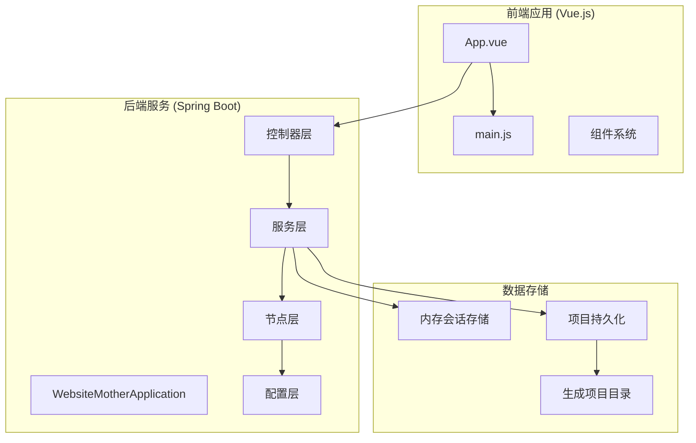
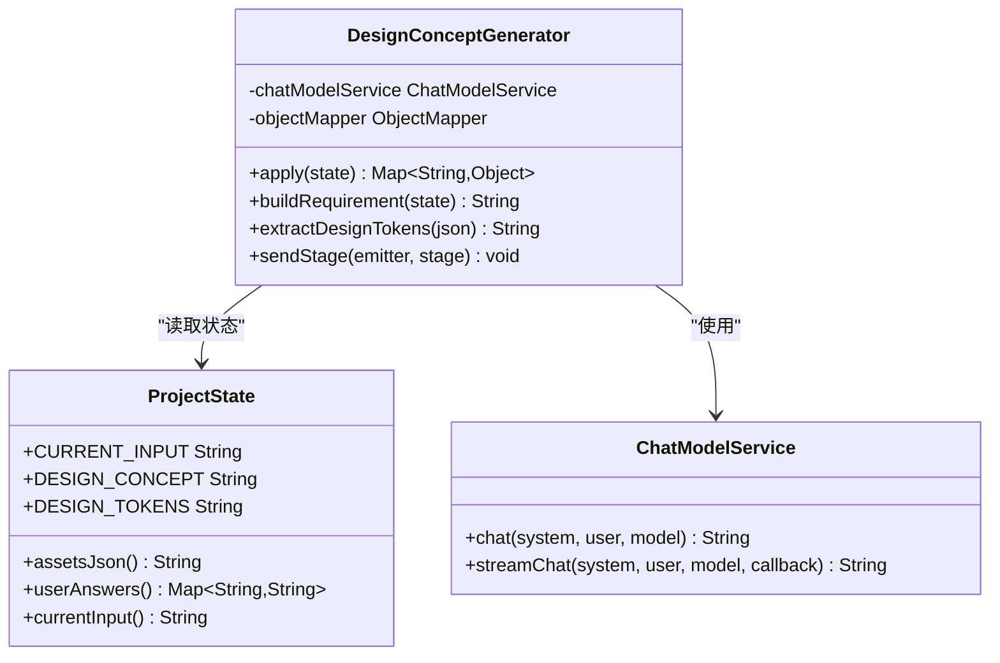
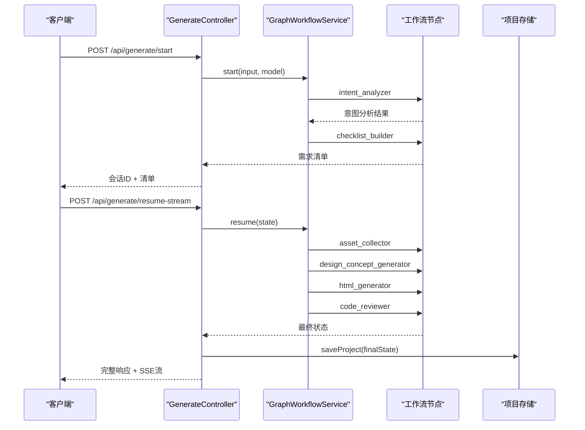
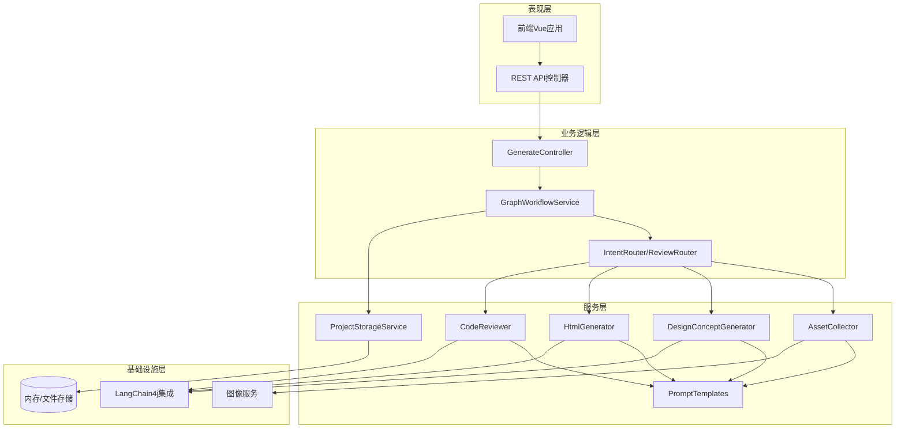
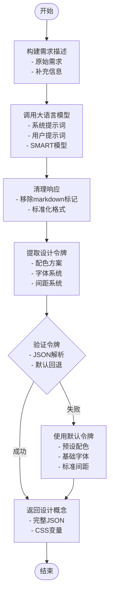
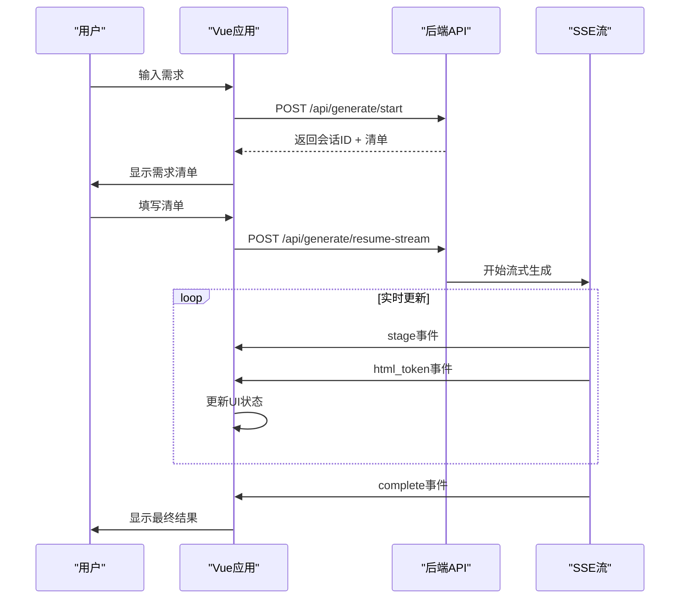
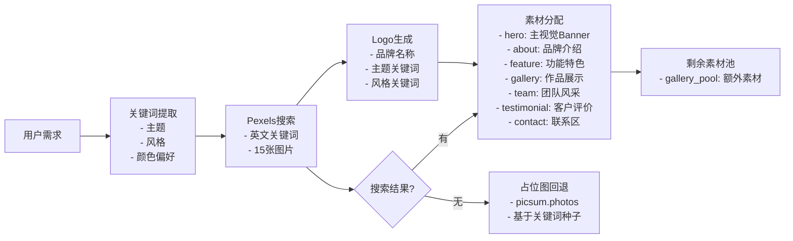
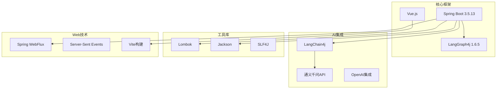

# 设计概念生成器

<cite>
**本文档引用的文件**
- [WebsiteMotherApplication.java](file://src/main/java/com/example/websitemother/WebsiteMotherApplication.java)
- [DesignConceptGenerator.java](file://src/main/java/com/example/websitemother/node/DesignConceptGenerator.java)
- [GenerateController.java](file://src/main/java/com/example/websitemother/controller/GenerateController.java)
- [PromptTemplates.java](file://src/main/java/com/example/websitemother/prompt/PromptTemplates.java)
- [GraphWorkflowService.java](file://src/main/java/com/example/websitemother/service/GraphWorkflowService.java)
- [ProjectState.java](file://src/main/java/com/example/websitemother/state/ProjectState.java)
- [ProjectMeta.java](file://src/main/java/com/example/websitemother/dto/ProjectMeta.java)
- [App.vue](file://frontend/src/App.vue)
- [main.js](file://frontend/src/main.js)
- [GraphConfig.java](file://src/main/java/com/example/websitemother/config/GraphConfig.java)
- [AssetCollector.java](file://src/main/java/com/example/websitemother/node/AssetCollector.java)
- [HtmlGenerator.java](file://src/main/java/com/example/websitemother/node/HtmlGenerator.java)
- [pom.xml](file://pom.xml)
- [application.yml](file://src/main/resources/application.yml)
- [README.md](file://README.md)
</cite>

## 目录
1. [简介](#简介)
2. [项目结构](#项目结构)
3. [核心组件](#核心组件)
4. [架构概览](#架构概览)
5. [详细组件分析](#详细组件分析)
6. [依赖关系分析](#依赖关系分析)
7. [性能考虑](#性能考虑)
8. [故障排除指南](#故障排除指南)
9. [结论](#结论)

## 简介

设计概念生成器是一个基于人工智能的网站设计系统，能够根据用户需求自动生成网站的设计概念方案。该系统采用LangGraph工作流架构，结合大语言模型和图像生成技术，为用户提供从需求分析到最终设计的完整解决方案。

系统的核心功能包括：
- 智能需求分析和意图识别
- 设计概念方案生成（配色、字体、间距、布局方向）
- 多页面HTML代码生成
- 代码质量审查和自动修复
- 实时流式生成体验

## 项目结构

该项目采用前后端分离的架构设计，主要分为以下几个部分：

**图表来源**
- [WebsiteMotherApplication.java:1-14](file://src/main/java/com/example/websitemother/WebsiteMotherApplication.java#L1-L14)
- [App.vue:1-747](file://frontend/src/App.vue#L1-L747)

**章节来源**
- [pom.xml:1-124](file://pom.xml#L1-L124)
- [README.md:1-3](file://README.md#L1-L3)

## 核心组件

### 设计概念生成器节点

设计概念生成器是系统的核心组件之一，负责将用户需求转换为结构化的设计系统方案。它具备以下关键特性：

- **智能需求分析**：整合用户原始需求和补充信息
- **结构化输出**：生成JSON格式的设计概念方案
- **CSS变量提取**：自动提取设计令牌用于样式系统
- **实时状态更新**：通过SSE推送生成进度

**图表来源**
- [DesignConceptGenerator.java:24-140](file://src/main/java/com/example/websitemother/node/DesignConceptGenerator.java#L24-L140)
- [ProjectState.java:13-95](file://src/main/java/com/example/websitemother/state/ProjectState.java#L13-L95)

### LangGraph工作流系统

系统采用LangGraph框架实现复杂的工作流编排，包含两个主要阶段：

1. **第一阶段（startGraph）**：意图分析 → 清单生成
2. **第二阶段（resumeGraph）**：素材收集 → 设计概念生成 → HTML代码生成 → 代码审查

**图表来源**
- [GenerateController.java:53-142](file://src/main/java/com/example/websitemother/controller/GenerateController.java#L53-L142)
- [GraphWorkflowService.java:32-63](file://src/main/java/com/example/websitemother/service/GraphWorkflowService.java#L32-L63)

**章节来源**
- [DesignConceptGenerator.java:1-140](file://src/main/java/com/example/websitemother/node/DesignConceptGenerator.java#L1-L140)
- [GraphConfig.java:54-102](file://src/main/java/com/example/websitemother/config/GraphConfig.java#L54-L102)

## 架构概览

系统采用分层架构设计，确保各组件职责清晰、耦合度低：

**图表来源**
- [GraphConfig.java:33-48](file://src/main/java/com/example/websitemother/config/GraphConfig.java#L33-L48)
- [GenerateController.java:33-43](file://src/main/java/com/example/websitemother/controller/GenerateController.java#L33-L43)

## 详细组件分析

### 设计概念生成器详细分析

设计概念生成器实现了完整的AI设计系统，具备以下核心能力：

#### 数据处理流程

**图表来源**
- [DesignConceptGenerator.java:32-138](file://src/main/java/com/example/websitemother/node/DesignConceptGenerator.java#L32-L138)

#### 设计系统规范

系统遵循严格的设计系统规范，确保生成的网站具有一致性和专业性：

| 设计要素 | 规范要求 | 示例 |
|---------|---------|------|
| 配色方案 | 主色、辅色、背景、文本、强调色 | primary: #D97757, background: #FAFAF9, text: #1C1917 |
| 字体系统 | 标题字体、正文字体、字号比例 | heading: Georgia, body: system-ui, sans-serif |
| 间距系统 | 基础间距单位、间距比例 | unit: 1rem, scale: 1.5 |
| 布局方向 | 页面结构描述 | "居中Hero+三列特性" |

**章节来源**
- [DesignConceptGenerator.java:56-86](file://src/main/java/com/example/websitemother/node/DesignConceptGenerator.java#L56-L86)
- [PromptTemplates.java:56-86](file://src/main/java/com/example/websitemother/prompt/PromptTemplates.java#L56-L86)

### 前端交互系统

前端Vue应用提供了直观的用户交互界面，支持实时流式生成和设计调整：

#### 实时生成流程

**图表来源**
- [App.vue:102-212](file://frontend/src/App.vue#L102-L212)
- [GenerateController.java:82-142](file://src/main/java/com/example/websitemother/controller/GenerateController.java#L82-L142)

#### 设计调整功能

前端提供了强大的设计调整功能，允许用户实时修改设计系统：

- **Tweaks面板**：动态调整CSS变量
- **实时预览**：修改即时反映在预览窗口
- **代码高亮**：语法高亮显示生成的HTML代码
- **多页面支持**：支持多页面网站的生成和预览

**章节来源**
- [App.vue:273-287](file://frontend/src/App.vue#L273-L287)
- [App.vue:649-661](file://frontend/src/App.vue#L649-L661)

### 素材收集系统

素材收集系统负责为设计生成提供丰富的视觉素材：

#### 素材分配策略

**图表来源**
- [AssetCollector.java:44-96](file://src/main/java/com/example/websitemother/node/AssetCollector.java#L44-L96)

**章节来源**
- [AssetCollector.java:1-170](file://src/main/java/com/example/websitemother/node/AssetCollector.java#L1-L170)

## 依赖关系分析

系统采用现代化的技术栈，确保良好的可维护性和扩展性：

**图表来源**
- [pom.xml:33-67](file://pom.xml#L33-L67)
- [application.yml:1-14](file://src/main/resources/application.yml#L1-L14)

**章节来源**
- [pom.xml:1-124](file://pom.xml#L1-L124)
- [application.yml:1-14](file://src/main/resources/application.yml#L1-L14)

## 性能考虑

系统在设计时充分考虑了性能优化：

### 流式处理优化
- **SSE实时传输**：减少等待时间，提升用户体验
- **增量生成**：支持代码的分块增量修改
- **异步处理**：Logo生成与图片搜索并行执行

### 内存管理
- **会话状态存储**：使用ConcurrentHashMap进行高效并发访问
- **对象复用**：重用ObjectMapper实例
- **及时清理**：SSE连接结束后及时释放资源

### 缓存策略
- **默认回退机制**：JSON解析失败时使用预设设计令牌
- **占位图回退**：Pexels搜索失败时使用picsum.photos
- **模型选择**：支持多种AI模型的灵活切换

## 故障排除指南

### 常见问题及解决方案

#### API调用失败
**症状**：前端无法连接后端API
**原因**：
- 后端服务未启动
- 端口被占用
- CORS配置问题

**解决方案**：
1. 确认后端服务已成功启动
2. 检查application.yml中的端口配置
3. 验证CORS跨域设置

#### AI模型调用异常
**症状**：设计概念生成失败
**原因**：
- API密钥配置错误
- 网络连接问题
- 模型参数不正确

**解决方案**：
1. 检查application.yml中的API密钥配置
2. 验证网络连接状态
3. 确认模型名称和参数设置

#### 图像素材加载失败
**症状**：网站显示占位图而非实际图片
**原因**：
- Pexels API密钥缺失
- 网络连接问题
- 关键词搜索无结果

**解决方案**：
1. 配置有效的PEXELS_API_KEY
2. 检查网络连接
3. 调整关键词以提高搜索成功率

**章节来源**
- [GenerateController.java:90-139](file://src/main/java/com/example/websitemother/controller/GenerateController.java#L90-L139)
- [application.yml:6-14](file://src/main/resources/application.yml#L6-L14)

## 结论

设计概念生成器是一个功能完整、架构清晰的AI驱动设计系统。通过精心设计的工作流架构、严格的设计规范和优秀的用户体验，该系统能够为用户提供从需求分析到最终设计的专业级解决方案。

### 主要优势

1. **智能化程度高**：基于大语言模型的智能设计生成
2. **用户体验优秀**：实时流式生成和可视化设计调整
3. **扩展性强**：模块化设计便于功能扩展和定制
4. **技术先进**：采用最新的AI和Web技术栈

### 技术亮点

- **LangGraph工作流**：实现复杂业务逻辑的优雅编排
- **设计系统规范**：确保生成内容的一致性和专业性
- **实时交互体验**：SSE流式传输提供流畅的用户体验
- **多模型支持**：灵活的AI模型选择和配置

该系统为网站设计领域提供了一个创新的解决方案，展示了AI技术在创意设计领域的巨大潜力。