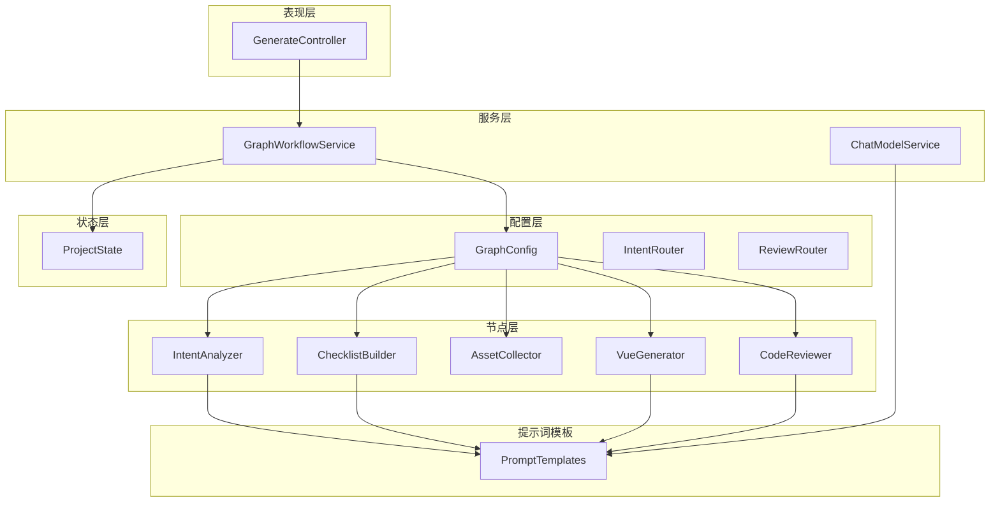
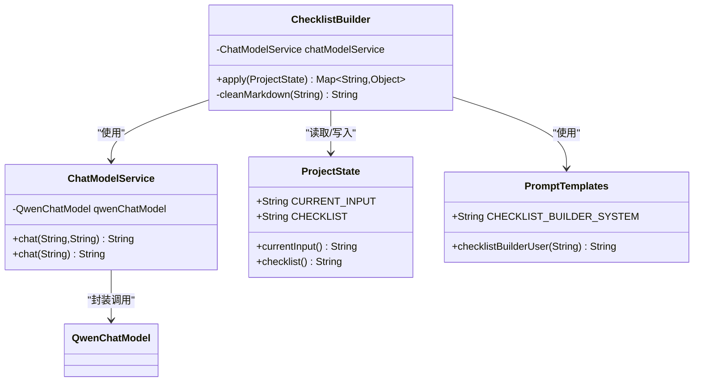
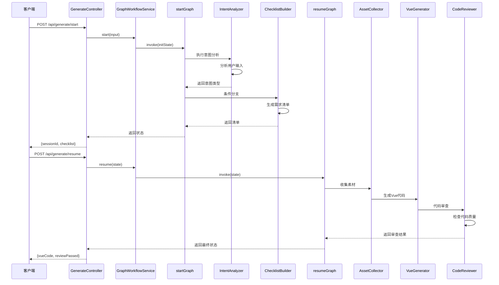
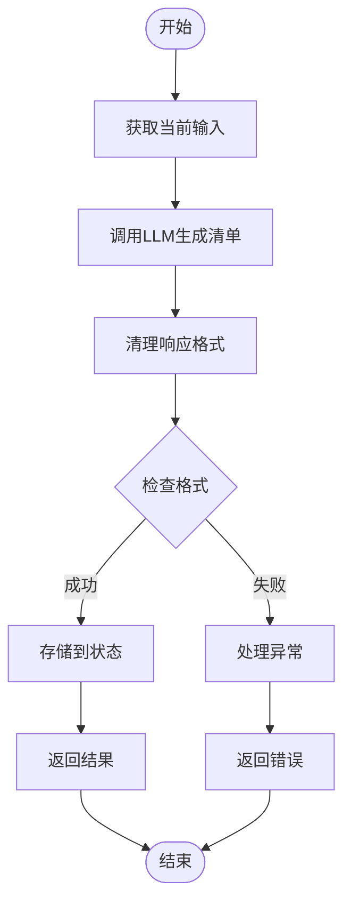
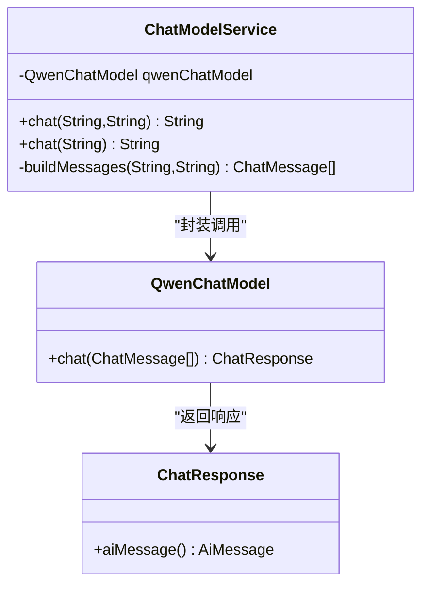
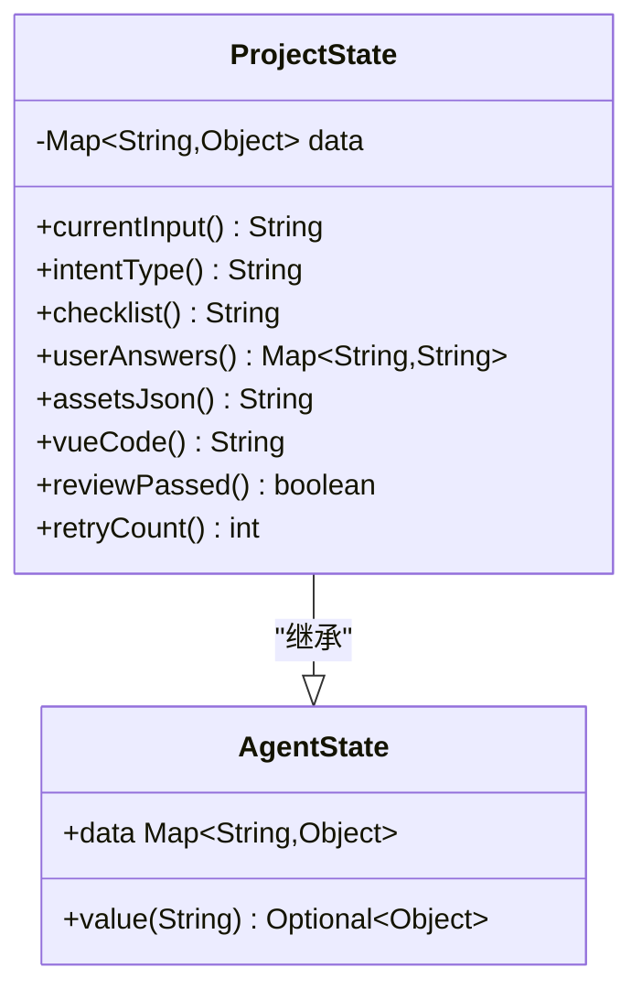
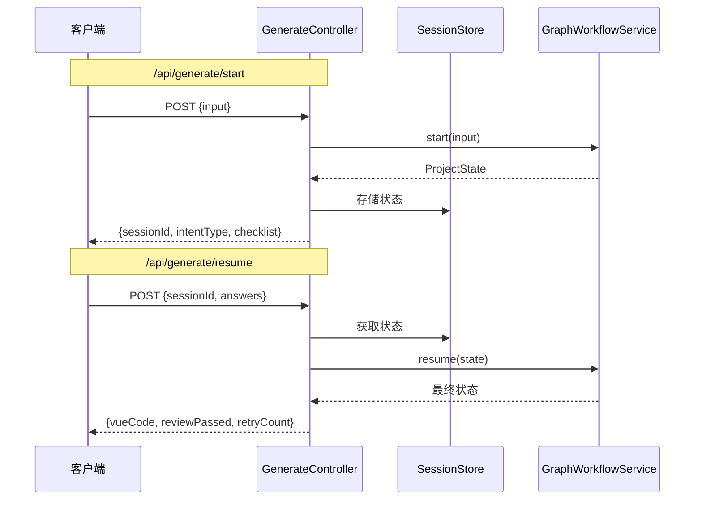
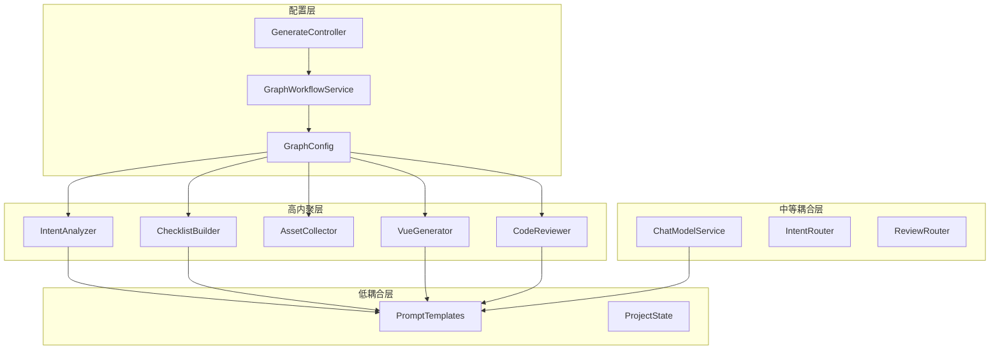

# 需求清单构建节点

<cite>
**本文档引用的文件**
- [ChecklistBuilder.java](file://src/main/java/com/example/websitemother/node/ChecklistBuilder.java)
- [PromptTemplates.java](file://src/main/java/com/example/websitemother/prompt/PromptTemplates.java)
- [ProjectState.java](file://src/main/java/com/example/websitemother/state/ProjectState.java)
- [ChatModelService.java](file://src/main/java/com/example/websitemother/service/ChatModelService.java)
- [GenerateController.java](file://src/main/java/com/example/websitemother/controller/GenerateController.java)
- [GraphWorkflowService.java](file://src/main/java/com/example/websitemother/service/GraphWorkflowService.java)
- [GraphConfig.java](file://src/main/java/com/example/websitemother/config/GraphConfig.java)
- [IntentAnalyzer.java](file://src/main/java/com/example/websitemother/node/IntentAnalyzer.java)
- [VueGenerator.java](file://src/main/java/com/example/websitemother/node/VueGenerator.java)
- [CodeReviewer.java](file://src/main/java/com/example/websitemother/node/CodeReviewer.java)
- [IntentRouter.java](file://src/main/java/com/example/websitemother/edge/IntentRouter.java)
- [ReviewRouter.java](file://src/main/java/com/example/websitemother/edge/ReviewRouter.java)
- [application.yml](file://src/main/resources/application.yml)
</cite>

## 目录
1. [简介](#简介)
2. [项目结构](#项目结构)
3. [核心组件](#核心组件)
4. [架构概览](#架构概览)
5. [详细组件分析](#详细组件分析)
6. [依赖关系分析](#依赖关系分析)
7. [性能考虑](#性能考虑)
8. [故障排除指南](#故障排除指南)
9. [结论](#结论)

## 简介

ChecklistBuilder需求清单构建节点是WebsiteMother AI网站生成系统中的关键组件，负责根据用户建站需求生成动态的建站需求清单。该节点通过大语言模型(LLM)进行需求挖掘，设计了灵活的问题类型分类和交互逻辑，为后续的Vue代码生成奠定基础。

该系统采用LangGraph4j状态图架构，实现了从意图分析到需求清单生成，再到代码生成和审查的完整工作流程。ChecklistBuilder作为第二阶段的核心节点，承担着将用户模糊的需求转化为结构化清单项的重要职责。

## 项目结构

WebsiteMother项目采用分层架构设计，主要分为以下几个层次：

**图表来源**
- [GenerateController.java:1-115](file://src/main/java/com/example/websitemother/controller/GenerateController.java#L1-L115)
- [GraphConfig.java:1-99](file://src/main/java/com/example/websitemother/config/GraphConfig.java#L1-L99)
- [GraphWorkflowService.java:1-60](file://src/main/java/com/example/websitemother/service/GraphWorkflowService.java#L1-L60)

**章节来源**
- [GenerateController.java:1-115](file://src/main/java/com/example/websitemother/controller/GenerateController.java#L1-L115)
- [GraphConfig.java:1-99](file://src/main/java/com/example/websitemother/config/GraphConfig.java#L1-L99)

## 核心组件

### ChecklistBuilder节点

ChecklistBuilder是需求清单构建的核心节点，位于LangGraph工作流的第二阶段。该节点的主要职责是：

- 接收用户建站需求输入
- 调用大语言模型生成结构化清单项
- 清理和验证生成的JSON格式
- 将结果存储到项目状态中

**图表来源**
- [ChecklistBuilder.java:1-51](file://src/main/java/com/example/websitemother/node/ChecklistBuilder.java#L1-L51)
- [ChatModelService.java:1-58](file://src/main/java/com/example/websitemother/service/ChatModelService.java#L1-L58)
- [ProjectState.java:1-78](file://src/main/java/com/example/websitemother/state/ProjectState.java#L1-L78)
- [PromptTemplates.java:25-42](file://src/main/java/com/example/websitemother/prompt/PromptTemplates.java#L25-L42)

### 项目状态管理

ProjectState类继承自AgentState，提供了统一的状态管理接口：

- **CURRENT_INPUT**: 当前用户输入
- **CHECKLIST**: 生成的需求清单
- **USER_ANSWERS**: 用户回答映射
- **VUE_CODE**: 生成的Vue代码
- **REVIEW_PASSED**: 审查结果
- **RETRY_COUNT**: 重试计数

**章节来源**
- [ProjectState.java:1-78](file://src/main/java/com/example/websitemother/state/ProjectState.java#L1-L78)
- [ChecklistBuilder.java:1-51](file://src/main/java/com/example/websitemother/node/ChecklistBuilder.java#L1-L51)

## 架构概览

系统采用双阶段工作流架构，通过LangGraph4j实现状态驱动的流程控制：

**图表来源**
- [GenerateController.java:33-84](file://src/main/java/com/example/websitemother/controller/GenerateController.java#L33-L84)
- [GraphWorkflowService.java:31-58](file://src/main/java/com/example/websitemother/service/GraphWorkflowService.java#L31-L58)
- [GraphConfig.java:52-96](file://src/main/java/com/example/websitemother/config/GraphConfig.java#L52-L96)

## 详细组件分析

### ChecklistBuilder实现分析

ChecklistBuilder节点实现了NodeAction<ProjectState>接口，采用简洁高效的实现模式：

#### 核心处理流程

**图表来源**
- [ChecklistBuilder.java:24-49](file://src/main/java/com/example/websitemother/node/ChecklistBuilder.java#L24-L49)

#### 清单生成算法

ChecklistBuilder使用专门的提示词模板来指导LLM生成结构化清单：

1. **系统提示词设计**: 强调专业性、关键性、JSON格式要求
2. **用户提示词组装**: 结合用户原始需求生成具体问题
3. **格式清理机制**: 处理可能的Markdown代码块标记
4. **结果验证**: 确保输出符合预期格式

#### 清单项设计原则

根据提示词模板，清单项遵循以下设计原则：

- **字段英文名**: 使用小写加下划线命名法
- **中文标签**: 直观易懂的用户界面标签
- **问题类型**: 支持text、textarea、select三种类型
- **选项约束**: select类型必须提供选项数组
- **覆盖范围**: 涵盖网站主题、风格、功能、配色、受众等维度

**章节来源**
- [ChecklistBuilder.java:1-51](file://src/main/java/com/example/websitemother/node/ChecklistBuilder.java#L1-L51)
- [PromptTemplates.java:25-42](file://src/main/java/com/example/websitemother/prompt/PromptTemplates.java#L25-L42)

### LLM集成机制

#### ChatModelService封装

ChatModelService提供了统一的LLM调用接口：

**图表来源**
- [ChatModelService.java:23-49](file://src/main/java/com/example/websitemother/service/ChatModelService.java#L23-L49)

#### 错误处理策略

ChatModelService实现了完善的异常处理机制：

- **日志记录**: 详细的调试信息
- **异常包装**: 将底层异常转换为业务异常
- **错误传播**: 确保异常能够正确传播到上层

**章节来源**
- [ChatModelService.java:1-58](file://src/main/java/com/example/websitemother/service/ChatModelService.java#L1-L58)

### 状态传递机制

#### ProjectState数据结构

ProjectState类提供了类型安全的状态访问方法：

**图表来源**
- [ProjectState.java:26-77](file://src/main/java/com/example/websitemother/state/ProjectState.java#L26-L77)

#### 数据流管理

状态在各个节点间传递遵循以下模式：

1. **初始化**: 通过CURRENT_INPUT传递用户输入
2. **中间状态**: 通过CHECKLIST、USER_ANSWERS等键值传递
3. **结果状态**: 通过VUE_CODE、REVIEW_PASSED等键值返回
4. **控制状态**: 通过RETRY_COUNT控制工作流循环

**章节来源**
- [ProjectState.java:1-78](file://src/main/java/com/example/websitemother/state/ProjectState.java#L1-L78)

### API接口设计

#### GenerateController接口

GenerateController提供了两个核心API端点：

**图表来源**
- [GenerateController.java:33-84](file://src/main/java/com/example/websitemother/controller/GenerateController.java#L33-L84)

**章节来源**
- [GenerateController.java:1-115](file://src/main/java/com/example/websitemother/controller/GenerateController.java#L1-L115)

## 依赖关系分析

### 组件耦合度分析

系统采用了松耦合的设计模式：

**图表来源**
- [GraphConfig.java:32-45](file://src/main/java/com/example/websitemother/config/GraphConfig.java#L32-L45)
- [GenerateController.java:24-25](file://src/main/java/com/example/websitemother/controller/GenerateController.java#L24-L25)

### 外部依赖管理

系统主要依赖以下外部组件：

- **LangGraph4j**: 状态图工作流引擎
- **LangChain4j**: LLM集成框架
- **DashScope Qwen**: 阿里云通义千问模型
- **Spring Boot**: 应用框架

**章节来源**
- [application.yml:4-9](file://src/main/resources/application.yml#L4-L9)
- [GraphConfig.java:1-99](file://src/main/java/com/example/websitemother/config/GraphConfig.java#L1-L99)

## 性能考虑

### 并发处理

系统采用ConcurrentHashMap实现内存级会话存储，支持高并发场景：

- **线程安全**: ConcurrentHashMap保证并发安全性
- **内存管理**: 基于内存的存储，避免持久化开销
- **会话隔离**: 每个会话独立的状态空间

### 缓存策略

当前实现采用内存缓存，生产环境建议：

- **Redis缓存**: 实现分布式会话存储
- **响应缓存**: 对重复查询结果进行缓存
- **模型响应缓存**: 缓存LLM生成的常用模板

### 错误恢复

系统实现了多层次的错误恢复机制：

- **工作流重试**: 审查失败时自动重试最多3次
- **状态回滚**: 异常发生时保持状态一致性
- **降级策略**: LLM不可用时提供基础功能

## 故障排除指南

### 常见问题诊断

#### LLM调用失败

**症状**: AI服务调用异常错误

**排查步骤**:
1. 检查API密钥配置
2. 验证网络连接
3. 查看日志中的详细错误信息

**解决方案**:
- 更新正确的API密钥
- 检查防火墙设置
- 实现重试机制

#### JSON格式错误

**症状**: 清单生成失败或格式不正确

**排查步骤**:
1. 检查提示词模板格式要求
2. 验证LLM响应的JSON结构
3. 查看清理过程中的字符串处理

**解决方案**:
- 确保提示词模板的严格格式要求
- 实施更严格的JSON验证
- 添加格式转换器

#### 工作流卡死

**症状**: 请求长时间无响应

**排查步骤**:
1. 检查会话存储状态
2. 验证节点间的状态传递
3. 查看条件边的路由逻辑

**解决方案**:
- 实现超时机制
- 添加健康检查
- 优化状态管理

**章节来源**
- [ChatModelService.java:45-48](file://src/main/java/com/example/websitemother/service/ChatModelService.java#L45-L48)
- [GraphWorkflowService.java:37-40](file://src/main/java/com/example/websitemother/service/GraphWorkflowService.java#L37-L40)

## 结论

ChecklistBuilder需求清单构建节点展现了现代AI应用的最佳实践：

### 技术优势

1. **模块化设计**: 清晰的职责分离和接口定义
2. **状态驱动**: 基于状态图的工作流管理
3. **LLM集成**: 专业的提示词工程和响应处理
4. **错误处理**: 完善的异常管理和恢复机制

### 架构特点

- **可扩展性**: 易于添加新的节点和工作流
- **可维护性**: 清晰的代码结构和文档
- **可测试性**: 独立的单元测试支持
- **可观测性**: 详细的日志和监控信息

### 优化建议

1. **性能优化**: 实现响应式缓存和异步处理
2. **用户体验**: 增强错误提示和进度反馈
3. **安全性**: 添加输入验证和访问控制
4. **可扩展性**: 设计插件化的节点架构

该系统为AI驱动的网站生成提供了坚实的技术基础，ChecklistBuilder节点作为关键环节，确保了从用户需求到最终产品的一致性和质量。