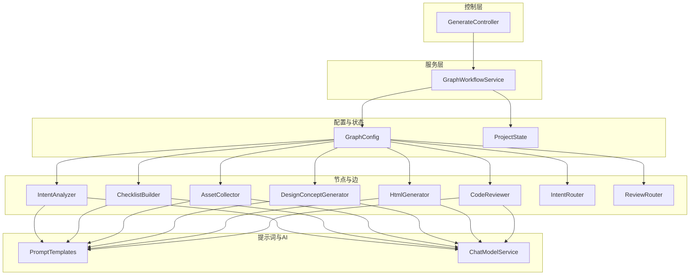
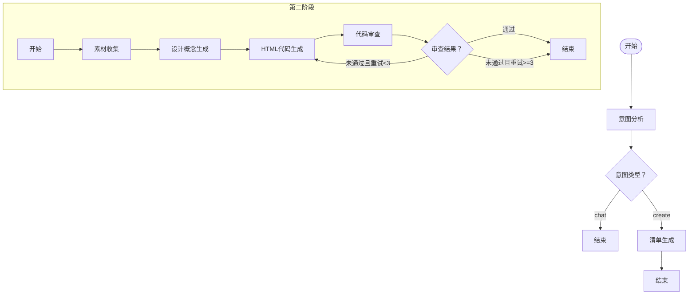
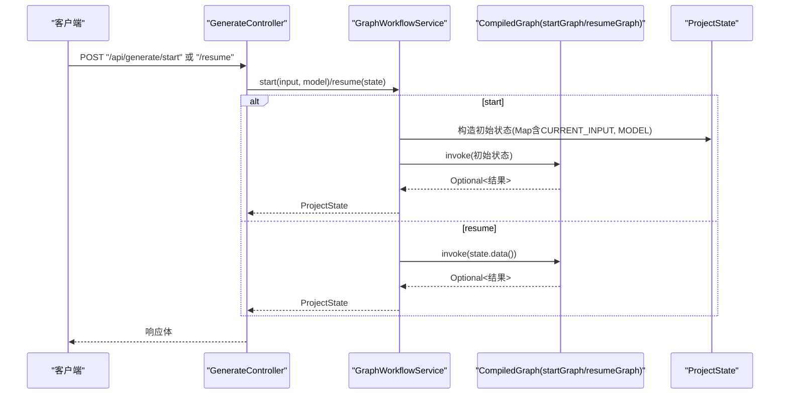
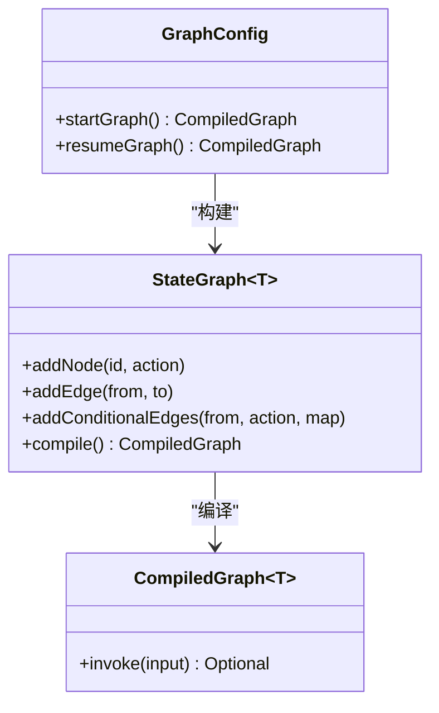
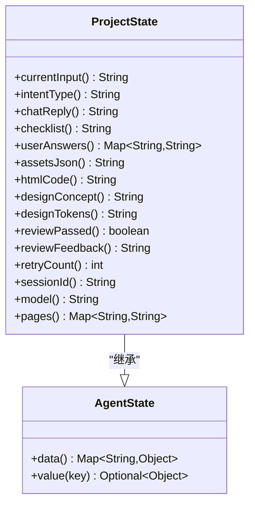
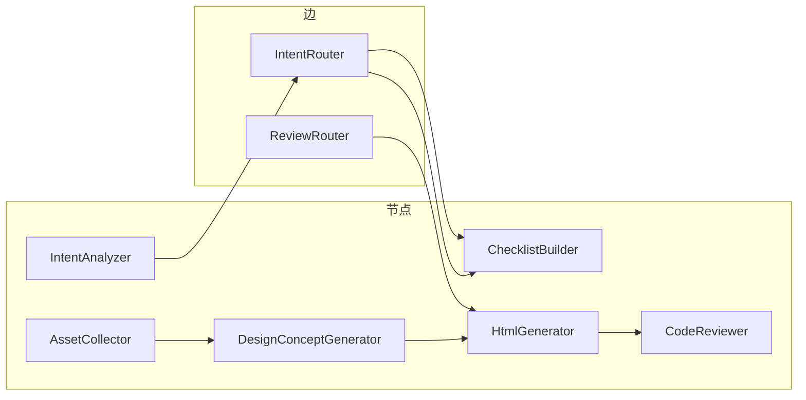
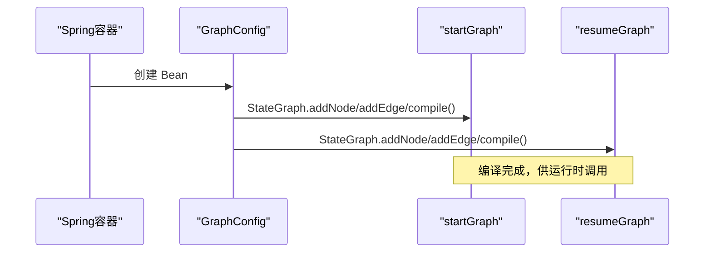
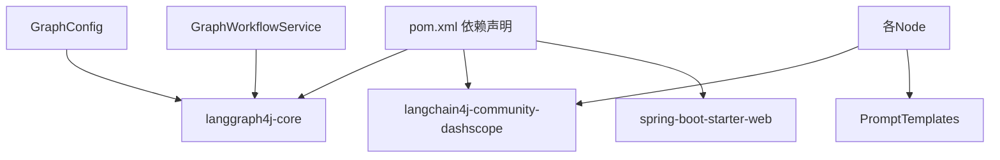

# 工作流引擎核心

<cite>
**本文引用的文件**
- [GraphWorkflowService.java](file://src/main/java/com/example/websitemother/service/GraphWorkflowService.java)
- [GraphConfig.java](file://src/main/java/com/example/websitemother/config/GraphConfig.java)
- [ProjectState.java](file://src/main/java/com/example/websitemother/state/ProjectState.java)
- [GenerateController.java](file://src/main/java/com/example/websitemother/controller/GenerateController.java)
- [IntentRouter.java](file://src/main/java/com/example/websitemother/edge/IntentRouter.java)
- [ReviewRouter.java](file://src/main/java/com/example/websitemother/edge/ReviewRouter.java)
- [IntentAnalyzer.java](file://src/main/java/com/example/websitemother/node/IntentAnalyzer.java)
- [ChecklistBuilder.java](file://src/main/java/com/example/websitemother/node/ChecklistBuilder.java)
- [AssetCollector.java](file://src/main/java/com/example/websitemother/node/AssetCollector.java)
- [DesignConceptGenerator.java](file://src/main/java/com/example/websitemother/node/DesignConceptGenerator.java)
- [HtmlGenerator.java](file://src/main/java/com/example/websitemother/node/HtmlGenerator.java)
- [CodeReviewer.java](file://src/main/java/com/example/websitemother/node/CodeReviewer.java)
- [ChatModelService.java](file://src/main/java/com/example/websitemother/service/ChatModelService.java)
- [PromptTemplates.java](file://src/main/java/com/example/websitemother/prompt/PromptTemplates.java)
- [application.yml](file://src/main/resources/application.yml)
- [pom.xml](file://pom.xml)
</cite>

## 更新摘要
**所做更改**
- 新增多页面支持功能的详细说明
- 更新页面列表提取机制的实现细节
- 增强 HTML 生成器的多文件处理能力说明
- 完善工作流状态管理中页面相关字段的描述

## 目录
1. [简介](#简介)
2. [项目结构](#项目结构)
3. [核心组件](#核心组件)
4. [架构总览](#架构总览)
5. [详细组件分析](#详细组件分析)
6. [依赖关系分析](#依赖关系分析)
7. [性能考量](#性能考量)
8. [故障排查指南](#故障排查指南)
9. [结论](#结论)
10. [附录](#附录)

## 简介
本技术文档围绕 WebsiteMother 工作流引擎的核心实现，系统阐述 GraphWorkflowService 的执行机制、GraphConfig 的状态图构建方式、ProjectState 的状态管理设计，并深入解析工作流的编译与执行生命周期、异常处理策略，最后提供调试与性能优化的实践指南。读者无需深厚的代码背景，也能通过图示与分层讲解理解整体运作。

**更新** 本次更新重点反映了工作流执行服务的改进，包括增强的多页面支持和页面列表提取功能，使系统能够生成包含多个页面的完整网站项目。

## 项目结构
WebsiteMother 采用 Spring Boot 应用，核心工作流位于 service、config、state、node、edge、prompt、controller 等包中，形成清晰的分层职责：
- controller 层：对外提供 /api/generate/start 与 /api/generate/resume 接口，负责请求入参校验、会话状态存储与响应封装。
- service 层：GraphWorkflowService 封装 startGraph 与 resumeGraph 的执行，统一异常处理与日志记录。
- config 层：GraphConfig 使用 langgraph4j 构建两个状态图（startGraph 与 resumeGraph），定义节点、边与条件路由。
- state 层：ProjectState 继承 AgentState，作为全局状态载体，提供字段访问器与序列化支持。
- node/edge 层：各节点实现 NodeAction，各边实现 EdgeAction，分别承担业务处理与条件分支决策。
- prompt 层：集中管理各节点的提示词模板，便于统一维护与调优。
- service 层：ChatModelService 封装 DashScope Qwen 的调用，统一消息组装与异常处理。



**图表来源**
- [GenerateController.java:1-262](file://src/main/java/com/example/websitemother/controller/GenerateController.java#L1-L262)
- [GraphWorkflowService.java:1-69](file://src/main/java/com/example/websitemother/service/GraphWorkflowService.java#L1-L69)
- [GraphConfig.java:1-104](file://src/main/java/com/example/websitemother/config/GraphConfig.java#L1-L104)
- [ProjectState.java:1-95](file://src/main/java/com/example/websitemother/state/ProjectState.java#L1-L95)
- [IntentAnalyzer.java:1-62](file://src/main/java/com/example/websitemother/node/IntentAnalyzer.java#L1-L62)
- [ChecklistBuilder.java:1-52](file://src/main/java/com/example/websitemother/node/ChecklistBuilder.java#L1-L52)
- [AssetCollector.java:1-278](file://src/main/java/com/example/websitemother/node/AssetCollector.java#L1-L278)
- [DesignConceptGenerator.java:1-140](file://src/main/java/com/example/websitemother/node/DesignConceptGenerator.java#L1-L140)
- [HtmlGenerator.java:1-326](file://src/main/java/com/example/websitemother/node/HtmlGenerator.java#L1-L326)
- [CodeReviewer.java:1-233](file://src/main/java/com/example/websitemother/node/CodeReviewer.java#L1-L233)
- [IntentRouter.java:1-31](file://src/main/java/com/example/websitemother/edge/IntentRouter.java#L1-L31)
- [ReviewRouter.java:1-45](file://src/main/java/com/example/websitemother/edge/ReviewRouter.java#L1-L45)
- [PromptTemplates.java:1-93](file://src/main/java/com/example/websitemother/prompt/PromptTemplates.java#L1-L93)
- [ChatModelService.java:1-58](file://src/main/java/com/example/websitemother/service/ChatModelService.java#L1-L58)

**章节来源**
- [GenerateController.java:1-262](file://src/main/java/com/example/websitemother/controller/GenerateController.java#L1-L262)
- [GraphWorkflowService.java:1-69](file://src/main/java/com/example/websitemother/service/GraphWorkflowService.java#L1-L69)
- [GraphConfig.java:1-104](file://src/main/java/com/example/websitemother/config/GraphConfig.java#L1-L104)
- [ProjectState.java:1-95](file://src/main/java/com/example/websitemother/state/ProjectState.java#L1-L95)

## 核心组件
- GraphWorkflowService：封装 startGraph 与 resumeGraph 的执行，负责状态初始化、数据传递与异常处理。
- GraphConfig：使用 langgraph4j 构建两个状态图，定义节点、边与条件路由，完成工作流编译。
- ProjectState：全局状态实体，提供字段访问器与序列化能力，承载工作流中间结果，新增页面相关字段支持多页面生成。
- GenerateController：REST 控制器，负责会话管理、请求响应与工作流入口调用，实现页面列表提取功能。
- 节点与边：IntentAnalyzer、ChecklistBuilder、AssetCollector、DesignConceptGenerator、HtmlGenerator、CodeReviewer 实现 NodeAction；IntentRouter、ReviewRouter 实现 EdgeAction。
- PromptTemplates：统一管理各节点提示词模板。
- ChatModelService：封装 DashScope Qwen 调用，统一消息组装与异常处理。

**章节来源**
- [GraphWorkflowService.java:1-69](file://src/main/java/com/example/websitemother/service/GraphWorkflowService.java#L1-L69)
- [GraphConfig.java:1-104](file://src/main/java/com/example/websitemother/config/GraphConfig.java#L1-L104)
- [ProjectState.java:1-95](file://src/main/java/com/example/websitemother/state/ProjectState.java#L1-L95)
- [GenerateController.java:1-262](file://src/main/java/com/example/websitemother/controller/GenerateController.java#L1-L262)
- [IntentRouter.java:1-31](file://src/main/java/com/example/websitemother/edge/IntentRouter.java#L1-L31)
- [ReviewRouter.java:1-45](file://src/main/java/com/example/websitemother/edge/ReviewRouter.java#L1-L45)
- [IntentAnalyzer.java:1-62](file://src/main/java/com/example/websitemother/node/IntentAnalyzer.java#L1-L62)
- [ChecklistBuilder.java:1-52](file://src/main/java/com/example/websitemother/node/ChecklistBuilder.java#L1-L52)
- [AssetCollector.java:1-278](file://src/main/java/com/example/websitemother/node/AssetCollector.java#L1-L278)
- [DesignConceptGenerator.java:1-140](file://src/main/java/com/example/websitemother/node/DesignConceptGenerator.java#L1-L140)
- [HtmlGenerator.java:1-326](file://src/main/java/com/example/websitemother/node/HtmlGenerator.java#L1-L326)
- [CodeReviewer.java:1-233](file://src/main/java/com/example/websitemother/node/CodeReviewer.java#L1-L233)
- [PromptTemplates.java:1-93](file://src/main/java/com/example/websitemother/prompt/PromptTemplates.java#L1-L93)
- [ChatModelService.java:1-58](file://src/main/java/com/example/websitemother/service/ChatModelService.java#L1-L58)

## 架构总览
WebsiteMother 的工作流采用"双阶段"设计：
- 第一阶段（startGraph）：意图分析 → 清单生成；在"意图=chat"时直接结束；否则进入"清单生成"后结束，供前端展示并等待用户补充答案。
- 第二阶段（resumeGraph）：素材收集 → 设计概念生成 → HTML代码生成 → 代码审查；若审查未通过且重试次数小于阈值，则回到"HTML代码生成"进行循环，直至通过或达到最大重试。

**更新** 第二阶段现在支持多页面生成，HtmlGenerator 能够解析多文件响应并生成完整的网站项目，包括主页和其他页面文件。



**图表来源**
- [GraphConfig.java:54-73](file://src/main/java/com/example/websitemother/config/GraphConfig.java#L54-L73)
- [GraphConfig.java:79-102](file://src/main/java/com/example/websitemother/config/GraphConfig.java#L79-L102)
- [IntentRouter.java:20-29](file://src/main/java/com/example/websitemother/edge/IntentRouter.java#L20-L29)
- [ReviewRouter.java:22-43](file://src/main/java/com/example/websitemother/edge/ReviewRouter.java#L22-L43)

## 详细组件分析

### GraphWorkflowService 执行机制
- start 方法
  - 初始化状态：将用户输入放入 ProjectState 的 CURRENT_INPUT 字段，构造初始 Map。
  - 可选模型参数：支持传入自定义模型名称，存储在 MODEL 字段中。
  - 调用 startGraph.invoke，得到 Optional 结果，映射回 ProjectState。
  - 异常捕获：记录错误日志并抛出运行时异常，便于上层控制器处理。
- resume 方法
  - 直接使用当前 ProjectState.data() 作为输入调用 resumeGraph.invoke。
  - 返回 Optional 结果映射的新 ProjectState，或保持原状态。
  - 异常捕获：记录错误日志并抛出运行时异常。



**图表来源**
- [GraphWorkflowService.java:32-67](file://src/main/java/com/example/websitemother/service/GraphWorkflowService.java#L32-L67)
- [GenerateController.java:54-191](file://src/main/java/com/example/websitemother/controller/GenerateController.java#L54-L191)

**章节来源**
- [GraphWorkflowService.java:26-67](file://src/main/java/com/example/websitemother/service/GraphWorkflowService.java#L26-L67)
- [GenerateController.java:54-191](file://src/main/java/com/example/websitemother/controller/GenerateController.java#L54-L191)

### GraphConfig 状态图构建
- startGraph（第一阶段）
  - 节点：intent_analyzer、checklist_builder。
  - 边：START → intent_analyzer → 条件边（IntentRouter）→ END 或 checklist_builder → END。
  - 条件路由：当 intentType=chat 时结束；否则进入 checklist_builder。
- resumeGraph（第二阶段）
  - 节点：asset_collector、design_concept_generator、html_generator、code_reviewer。
  - 边：START → asset_collector → design_concept_generator → html_generator → code_reviewer → 条件边（ReviewRouter）→ END 或 html_generator 循环。
  - 条件路由：审查通过则结束；未通过且重试次数小于阈值则回到 html_generator；达到阈值强制结束。

**更新** 第二阶段现在包含设计概念生成器节点，负责生成网站的设计规范和样式变量，为 HTML 生成提供结构化的设计基础。



**图表来源**
- [GraphConfig.java:54-73](file://src/main/java/com/example/websitemother/config/GraphConfig.java#L54-L73)
- [GraphConfig.java:79-102](file://src/main/java/com/example/websitemother/config/GraphConfig.java#L79-L102)

**章节来源**
- [GraphConfig.java:54-73](file://src/main/java/com/example/websitemother/config/GraphConfig.java#L54-L73)
- [GraphConfig.java:79-102](file://src/main/java/com/example/websitemother/config/GraphConfig.java#L79-L102)

### ProjectState 状态管理
- 字段定义：CURRENT_INPUT、INTENT_TYPE、CHAT_REPLY、CHECKLIST、USER_ANSWERS、ASSETS_JSON、HTML_CODE、DESIGN_CONCEPT、DESIGN_TOKENS、REVIEW_PASSED、REVIEW_FEEDBACK、RETRY_COUNT、SESSION_ID、MODEL、PAGES。
- 数据访问器：提供类型安全的 getter，内部使用 value(key) 获取并转换为期望类型；对 RETRY_COUNT 提供容错解析。
- 序列化与持久化：继承 AgentState，内部持有 Map<String, Object>，可被 langgraph4j 编译图读写；控制器层通过内存 Map 进行会话存储（演示用途，生产建议 Redis）。
- **新增页面支持**：PAGES 字段用于存储多页面生成的结果，包含页面文件名到代码内容的映射。

**更新** 新增 PAGES 字段支持多页面网站生成，HTML 生成器可以生成包含多个页面的完整网站项目。



**图表来源**
- [ProjectState.java:15-94](file://src/main/java/com/example/websitemother/state/ProjectState.java#L15-L94)

**章节来源**
- [ProjectState.java:15-94](file://src/main/java/com/example/websitemother/state/ProjectState.java#L15-L94)
- [GenerateController.java:48-49](file://src/main/java/com/example/websitemother/controller/GenerateController.java#L48-L49)

### 工作流节点与边
- 意图分析（IntentAnalyzer）
  - 输入：CURRENT_INPUT。
  - 输出：INTENT_TYPE、CHAT_REPLY。
  - 依赖：ChatModelService + PromptTemplates.INTENT_ANALYZER_SYSTEM。
- 清单生成（ChecklistBuilder）
  - 输入：CURRENT_INPUT。
  - 输出：CHECKLIST（JSON 字符串）。
  - 依赖：ChatModelService + PromptTemplates.CHECKLIST_BUILDER_SYSTEM。
- 素材收集（AssetCollector）
  - 输入：USER_ANSWERS。
  - 输出：ASSETS_JSON（图片资源元数据 JSON）。
- 设计概念生成（DesignConceptGenerator）
  - 输入：CURRENT_INPUT、ASSETS_JSON、USER_ANSWERS。
  - 输出：DESIGN_CONCEPT（设计规范 JSON）、DESIGN_TOKENS（CSS 变量）。
  - 依赖：ChatModelService + PromptTemplates.DESIGN_CONCEPT_SYSTEM。
- HTML 代码生成（HtmlGenerator）
  - 输入：CURRENT_INPUT、ASSETS_JSON、DESIGN_CONCEPT、DESIGN_TOKENS、REVIEW_FEEDBACK、HTML_CODE（重试时）。
  - 输出：HTML_CODE、PAGES（多页面映射）。
  - 支持：多文件解析、分块增量修改、导航链接修复。
  - 依赖：ChatModelService + PromptTemplates.HTML_GENERATOR_SYSTEM。
- 代码审查（CodeReviewer）
  - 输入：HTML_CODE、REVIEW_FEEDBACK。
  - 输出：REVIEW_PASSED、REVIEW_FEEDBACK、RETRY_COUNT+1。
  - 依赖：ChatModelService + PromptTemplates.CODE_REVIEWER_SYSTEM。
- 条件路由
  - IntentRouter：根据 INTENT_TYPE 决定 END 或进入清单生成。
  - ReviewRouter：根据 REVIEW_PASSED 与 RETRY_COUNT 决定 END 或回到 HtmlGenerator。

**更新** 新增设计概念生成器节点，负责生成网站的设计规范和样式变量，为 HTML 生成提供结构化的设计基础。HTML 生成器现在支持多文件输出和页面列表提取功能。



**图表来源**
- [IntentAnalyzer.java:25-59](file://src/main/java/com/example/websitemother/node/IntentAnalyzer.java#L25-L59)
- [ChecklistBuilder.java:25-49](file://src/main/java/com/example/websitemother/node/ChecklistBuilder.java#L25-L49)
- [AssetCollector.java:68-130](file://src/main/java/com/example/websitemother/node/AssetCollector.java#L68-L130)
- [DesignConceptGenerator.java:32-68](file://src/main/java/com/example/websitemother/node/DesignConceptGenerator.java#L32-L68)
- [HtmlGenerator.java:39-140](file://src/main/java/com/example/websitemother/node/HtmlGenerator.java#L39-L140)
- [CodeReviewer.java:28-70](file://src/main/java/com/example/websitemother/node/CodeReviewer.java#L28-L70)
- [IntentRouter.java:20-29](file://src/main/java/com/example/websitemother/edge/IntentRouter.java#L20-L29)
- [ReviewRouter.java:22-43](file://src/main/java/com/example/websitemother/edge/ReviewRouter.java#L22-L43)

**章节来源**
- [IntentAnalyzer.java:19-61](file://src/main/java/com/example/websitemother/node/IntentAnalyzer.java#L19-L61)
- [ChecklistBuilder.java:18-51](file://src/main/java/com/example/websitemother/node/ChecklistBuilder.java#L18-L51)
- [AssetCollector.java:17-277](file://src/main/java/com/example/websitemother/node/AssetCollector.java#L17-L277)
- [DesignConceptGenerator.java:17-139](file://src/main/java/com/example/websitemother/node/DesignConceptGenerator.java#L17-L139)
- [HtmlGenerator.java:17-325](file://src/main/java/com/example/websitemother/node/HtmlGenerator.java#L17-L325)
- [CodeReviewer.java:17-232](file://src/main/java/com/example/websitemother/node/CodeReviewer.java#L17-L232)
- [IntentRouter.java:14-30](file://src/main/java/com/example/websitemother/edge/IntentRouter.java#L14-L30)
- [ReviewRouter.java:14-44](file://src/main/java/com/example/websitemother/edge/ReviewRouter.java#L14-L44)

### 工作流编译与执行生命周期
- 编译阶段
  - GraphConfig 在容器启动时创建 StateGraph 并 compile，生成 CompiledGraph。
  - startGraph 与 resumeGraph 分别对应两套节点与边的组合。
- 执行阶段
  - start：构造初始状态，调用 startGraph.invoke，返回 ProjectState。
  - resume：使用当前 ProjectState.data() 调用 resumeGraph.invoke，返回 ProjectState。
- 上下文管理
  - ProjectState 作为全局上下文贯穿执行；USER_ANSWERS 在第二阶段由控制器注入。
  - 会话状态在 GenerateController 内存 Map 中临时存储（演示用途）。
- 异常处理
  - GraphWorkflowService 对 start/resume 包裹 try-catch，记录错误并抛出运行时异常。
  - ChatModelService 对 LLM 调用异常进行统一包装与日志记录。

**更新** 执行阶段现在包含设计概念生成和多页面处理，HTML 生成器能够智能解析多文件输出并生成完整的网站项目结构。



**图表来源**
- [GraphConfig.java:54-73](file://src/main/java/com/example/websitemother/config/GraphConfig.java#L54-L73)
- [GraphConfig.java:79-102](file://src/main/java/com/example/websitemother/config/GraphConfig.java#L79-L102)

**章节来源**
- [GraphConfig.java:54-73](file://src/main/java/com/example/websitemother/config/GraphConfig.java#L54-L73)
- [GraphConfig.java:79-102](file://src/main/java/com/example/websitemother/config/GraphConfig.java#L79-L102)
- [GraphWorkflowService.java:32-67](file://src/main/java/com/example/websitemother/service/GraphWorkflowService.java#L32-L67)
- [ChatModelService.java:33-49](file://src/main/java/com/example/websitemother/service/ChatModelService.java#L33-L49)

### 多页面支持与页面列表提取
- 多页面生成机制
  - HtmlGenerator 支持解析多文件响应格式（--- FILE: filename.html --- 分隔符）。
  - 自动生成包含主页和其他页面的完整网站项目。
  - 智能修复导航链接，确保页面间链接正确指向实际存在的文件。
- 页面列表提取
  - GenerateController.extractPageList() 方法从 ProjectState.PAGES 字段提取页面列表。
  - 返回包含所有生成页面文件名的列表，默认包含 "index.html"。
- 设计概念驱动的页面生成
  - DesignConceptGenerator 生成设计规范，指导 HtmlGenerator 生成符合设计要求的多页面结构。

**更新** 新增多页面支持功能，HtmlGenerator 能够解析多文件响应并生成完整的网站项目，GenerateController 提供页面列表提取功能。

```mermaid
flowchart TD
SUBGRAPH "多页面生成流程"
HTMLGEN["HtmlGenerator"] --> PARSE["解析多文件响应"]
PARSE --> MULTI{"检测到多文件？"}
MULTI --> |是| PAGES["生成页面映射"]
MULTI --> |否| SINGLE["生成单页面"]
PAGES --> FIXLINKS["修复导航链接"]
FIXLINKS --> STORE["存储到PAGES字段"]
SINGLE --> STORE
STORE --> LIST["extractPageList提取页面列表"]
end
```

**图表来源**
- [HtmlGenerator.java:207-230](file://src/main/java/com/example/websitemother/node/HtmlGenerator.java#L207-L230)
- [HtmlGenerator.java:266-308](file://src/main/java/com/example/websitemother/node/HtmlGenerator.java#L266-L308)
- [GenerateController.java:250-260](file://src/main/java/com/example/websitemother/controller/GenerateController.java#L250-L260)

**章节来源**
- [HtmlGenerator.java:94-140](file://src/main/java/com/example/websitemother/node/HtmlGenerator.java#L94-L140)
- [HtmlGenerator.java:207-308](file://src/main/java/com/example/websitemother/node/HtmlGenerator.java#L207-L308)
- [GenerateController.java:250-260](file://src/main/java/com/example/websitemother/controller/GenerateController.java#L250-L260)

## 依赖关系分析
- 外部依赖
  - langgraph4j-core：提供状态图编译与执行能力。
  - langchain4j-community-dashscope-spring-boot-starter：提供 DashScope Qwen 的 Spring Boot Starter。
  - spring-boot-starter-web：提供 Web 控制器能力。
- 内部依赖
  - GraphConfig 依赖各 Node 与 Edge 组件，以及 ProjectState。
  - GraphWorkflowService 依赖两个 CompiledGraph。
  - 各 Node 依赖 ChatModelService 与 PromptTemplates。
  - GenerateController 依赖 GraphWorkflowService 与 ProjectState。



**图表来源**
- [pom.xml:33-58](file://pom.xml#L33-L58)
- [GraphConfig.java:10-16](file://src/main/java/com/example/websitemother/config/GraphConfig.java#L10-L16)
- [GraphWorkflowService.java:3-6](file://src/main/java/com/example/websitemother/service/GraphWorkflowService.java#L3-L6)
- [ChatModelService.java:3-10](file://src/main/java/com/example/websitemother/service/ChatModelService.java#L3-L10)

**章节来源**
- [pom.xml:33-58](file://pom.xml#L33-L58)

## 性能考量
- 并发与会话存储
  - 当前控制器使用内存 Map 存储会话状态，适合演示；生产环境建议替换为 Redis，以支持水平扩展与高并发。
- LLM 调用成本
  - ChatModelService 的 chat 调用为同步阻塞，建议在高并发场景引入异步队列或限流熔断策略。
- 状态体积控制
  - ProjectState 中的 HTML_CODE 可能较大，建议在持久化前进行压缩或分片存储。
- 多页面处理性能
  - HtmlGenerator 的多文件解析和导航链接修复操作可能增加处理时间，建议对大型项目启用缓存机制。
- 条件路由与循环
  - ReviewRouter 的最大重试次数为固定阈值，可根据业务调整；同时建议记录每次重试的耗时与失败原因，便于统计分析。
- 日志级别
  - 控制器与服务层使用 info/warn/error 记录关键事件；建议在生产环境将 LLM 响应设置为 debug 级别，避免日志风暴。

## 故障排查指南
- 常见异常与定位
  - GraphWorkflowService：start/resume 执行失败会记录错误日志并抛出运行时异常，优先检查 LLM 调用链路与网络连通性。
  - ChatModelService：AI 服务调用异常会被包装并记录，检查 application.yml 中的 API Key 与模型名称配置。
  - ReviewRouter：若多次重试仍失败，检查 CodeReviewer 的输出格式是否符合 RESULT/FEEDBACK 规范。
  - HtmlGenerator：多文件解析失败时，检查 LLM 输出格式是否符合 --- FILE: filename.html --- 分隔符规范。
- 日志与监控
  - 控制器：记录请求入参与响应结果，便于端到端追踪。
  - 服务层：记录状态初始化与执行结果，便于定位节点问题。
  - 节点层：记录输入、输出与关键中间结果，便于调试提示词与逻辑。
- 错误恢复
  - 会话过期：控制器在 resume 时检查 sessionId，不存在则抛出参数异常；建议前端在超时后引导重新发起 /start。
  - 重试上限：ReviewRouter 达到最大重试次数后强制结束，建议在 UI 层提示用户人工干预。
  - 页面生成失败：检查 HtmlGenerator 的多文件解析日志，确认 LLM 输出格式正确。

**更新** 新增多页面支持相关的故障排查指南，包括 HtmlGenerator 多文件解析失败的诊断方法。

**章节来源**
- [GraphWorkflowService.java:42-46](file://src/main/java/com/example/websitemother/service/GraphWorkflowService.java#L42-L46)
- [GraphWorkflowService.java:63-67](file://src/main/java/com/example/websitemother/service/GraphWorkflowService.java#L63-L67)
- [ChatModelService.java:45-49](file://src/main/java/com/example/websitemother/service/ChatModelService.java#L45-L49)
- [application.yml:4-9](file://src/main/resources/application.yml#L4-L9)
- [ReviewRouter.java:39-43](file://src/main/java/com/example/websitemother/edge/ReviewRouter.java#L39-L43)
- [GenerateController.java:93-104](file://src/main/java/com/example/websitemother/controller/GenerateController.java#L93-L104)
- [HtmlGenerator.java:98-100](file://src/main/java/com/example/websitemother/node/HtmlGenerator.java#L98-L100)

## 结论
WebsiteMother 工作流引擎以 langgraph4j 为核心，结合 Spring Boot 的依赖注入与 REST 控制器，实现了"意图识别—需求清单—素材—设计概念—代码—审查"的完整闭环工作流。GraphConfig 将业务逻辑抽象为状态图，GraphWorkflowService 统一封装执行与异常处理，ProjectState 提供统一的状态载体。通过合理的日志、会话存储与重试策略，系统具备良好的可维护性与可扩展性。

**更新** 最新版本增强了多页面支持功能，HtmlGenerator 能够生成包含多个页面的完整网站项目，GenerateController 提供页面列表提取功能，使系统能够满足现代网站开发的需求。建议在生产环境中引入 Redis 会话存储、异步与限流策略，以及更完善的可观测性与告警体系。

## 附录
- 配置项参考
  - application.yml：DashScope API Key 与模型名称。
- 依赖版本
  - langgraph4j-core：1.6.5
  - langchain4j-community-dashscope：1.13.0-beta23
  - spring-boot-starter-web：随 Spring Boot 3.5.13

**章节来源**
- [application.yml:4-9](file://src/main/resources/application.yml#L4-L9)
- [pom.xml:50-53](file://pom.xml#L50-L53)