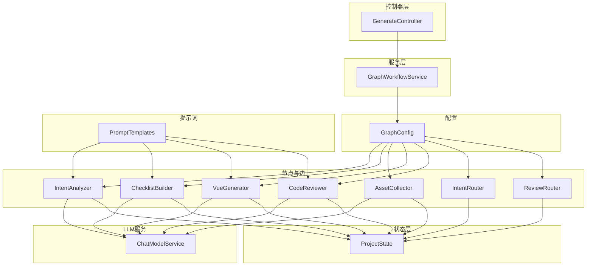
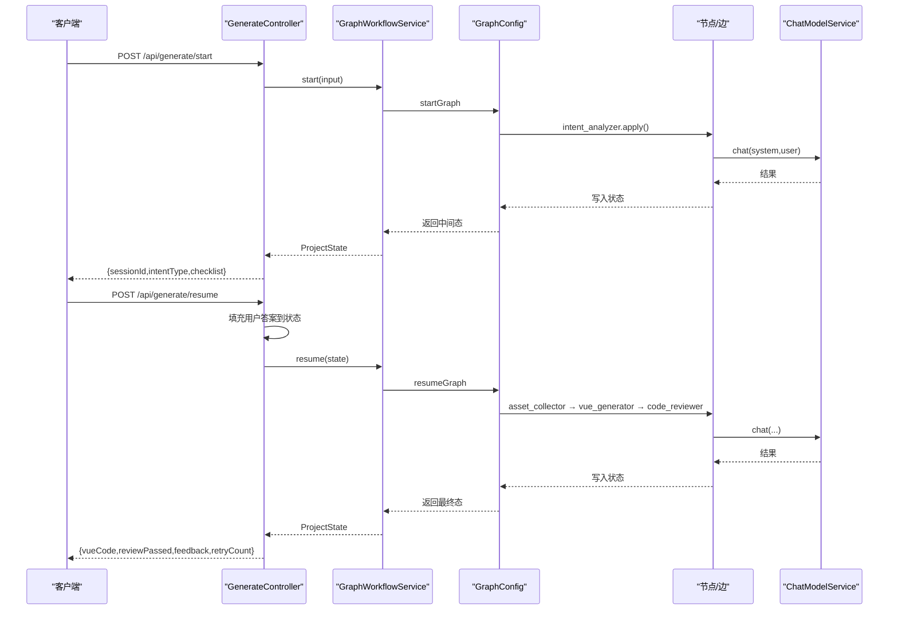
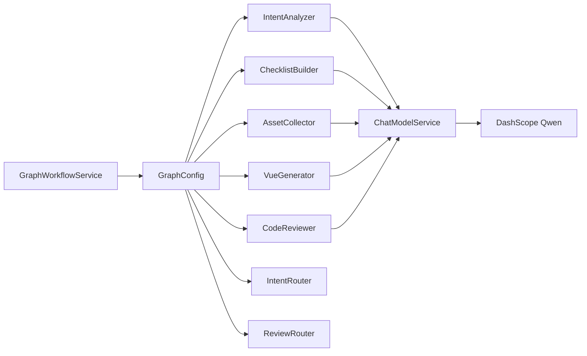

# 工作流执行服务

<cite>
**本文引用的文件列表**
- [GraphWorkflowService.java](file://src/main/java/com/example/websitemother/service/GraphWorkflowService.java)
- [ProjectState.java](file://src/main/java/com/example/websitemother/state/ProjectState.java)
- [GenerateController.java](file://src/main/java/com/example/websitemother/controller/GenerateController.java)
- [GraphConfig.java](file://src/main/java/com/example/websitemother/config/GraphConfig.java)
- [IntentAnalyzer.java](file://src/main/java/com/example/websitemother/node/IntentAnalyzer.java)
- [ChecklistBuilder.java](file://src/main/java/com/example/websitemother/node/ChecklistBuilder.java)
- [AssetCollector.java](file://src/main/java/com/example/websitemother/node/AssetCollector.java)
- [VueGenerator.java](file://src/main/java/com/example/websitemother/node/VueGenerator.java)
- [CodeReviewer.java](file://src/main/java/com/example/websitemother/node/CodeReviewer.java)
- [IntentRouter.java](file://src/main/java/com/example/websitemother/edge/IntentRouter.java)
- [ReviewRouter.java](file://src/main/java/com/example/websitemother/edge/ReviewRouter.java)
- [ChatModelService.java](file://src/main/java/com/example/websitemother/service/ChatModelService.java)
- [PromptTemplates.java](file://src/main/java/com/example/websitemother/prompt/PromptTemplates.java)
- [application.yml](file://src/main/resources/application.yml)
</cite>

## 目录
1. [简介](#简介)
2. [项目结构](#项目结构)
3. [核心组件](#核心组件)
4. [架构总览](#架构总览)
5. [详细组件分析](#详细组件分析)
6. [依赖关系分析](#依赖关系分析)
7. [性能考量](#性能考量)
8. [故障排查指南](#故障排查指南)
9. [结论](#结论)
10. [附录](#附录)

## 简介
本技术文档围绕 GraphWorkflowService 展开，系统性阐述其在网站生成工作流中的职责与实现细节。重点包括：
- startGraph 与 resumeGraph 方法的执行原理、参数传递机制与返回值处理
- 状态初始化过程（initState 构建方式与 CURRENT_INPUT 字段作用）
- 异常处理策略（日志记录、错误传播与用户体验）
- 性能优化建议（并发处理、内存管理与资源释放）
- 实际使用场景与扩展思路，帮助开发者理解并安全地扩展工作流逻辑

## 项目结构
该项目采用 Spring Boot + LangGraph4j 的分层架构，核心目录与职责如下：
- controller：对外提供 REST API，负责请求解析、会话状态管理与响应封装
- service：封装工作流执行服务，协调两阶段工作流（startGraph/resumeGraph）
- state：定义全局状态模型 ProjectState，承载工作流中各节点间共享的数据
- node/edge：实现具体节点动作与条件边逻辑，构成状态图的执行单元
- config：组装两套状态图（startGraph/resumeGraph），编译为可执行图
- prompt：集中管理各节点的提示词模板
- resources：应用配置（如 DashScope API Key）

图表来源
- [GenerateController.java:1-115](file://src/main/java/com/example/websitemother/controller/GenerateController.java#L1-115)
- [GraphWorkflowService.java:1-60](file://src/main/java/com/example/websitemother/service/GraphWorkflowService.java#L1-60)
- [GraphConfig.java:1-98](file://src/main/java/com/example/websitemother/config/GraphConfig.java#L1-98)
- [ProjectState.java:1-78](file://src/main/java/com/example/websitemother/state/ProjectState.java#L1-78)
- [IntentAnalyzer.java:1-61](file://src/main/java/com/example/websitemother/node/IntentAnalyzer.java#L1-61)
- [ChecklistBuilder.java:1-51](file://src/main/java/com/example/websitemother/node/ChecklistBuilder.java#L1-51)
- [AssetCollector.java:1-89](file://src/main/java/com/example/websitemother/node/AssetCollector.java#L1-89)
- [VueGenerator.java:1-64](file://src/main/java/com/example/websitemother/node/VueGenerator.java#L1-64)
- [CodeReviewer.java:1-61](file://src/main/java/com/example/websitemother/node/CodeReviewer.java#L1-61)
- [IntentRouter.java:1-31](file://src/main/java/com/example/websitemother/edge/IntentRouter.java#L1-31)
- [ReviewRouter.java:1-42](file://src/main/java/com/example/websitemother/edge/ReviewRouter.java#L1-42)
- [ChatModelService.java:1-58](file://src/main/java/com/example/websitemother/service/ChatModelService.java#L1-58)
- [PromptTemplates.java:1-93](file://src/main/java/com/example/websitemother/prompt/PromptTemplates.java#L1-93)

章节来源
- [GenerateController.java:1-115](file://src/main/java/com/example/websitemother/controller/GenerateController.java#L1-115)
- [GraphWorkflowService.java:1-60](file://src/main/java/com/example/websitemother/service/GraphWorkflowService.java#L1-60)
- [GraphConfig.java:1-98](file://src/main/java/com/example/websitemother/config/GraphConfig.java#L1-98)

## 核心组件
本节聚焦 GraphWorkflowService 的职责与实现要点：
- startGraph：执行第一阶段工作流，从用户输入开始，经过意图分析与清单生成，返回中间态供前端收集用户答案
- resumeGraph：执行第二阶段工作流，接收前端提交的答案，进入素材收集、Vue 代码生成与代码审查循环，直至通过或达到最大重试次数

章节来源
- [GraphWorkflowService.java:1-60](file://src/main/java/com/example/websitemother/service/GraphWorkflowService.java#L1-60)

## 架构总览
LangGraph4j 状态图由 GraphConfig 组装并编译为两套图：
- startGraph：意图分析 → 条件边（chat→END，create→清单生成）→ END
- resumeGraph：素材收集 → Vue 代码生成 → 代码审查 → 条件边（通过→END，未通过且未达上限→回到生成）→ END

图表来源
- [GenerateController.java:33-84](file://src/main/java/com/example/websitemother/controller/GenerateController.java#L33-84)
- [GraphWorkflowService.java:31-58](file://src/main/java/com/example/websitemother/service/GraphWorkflowService.java#L31-58)
- [GraphConfig.java:52-97](file://src/main/java/com/example/websitemother/config/GraphConfig.java#L52-97)
- [IntentAnalyzer.java:24-59](file://src/main/java/com/example/websitemother/node/IntentAnalyzer.java#L24-59)
- [ChecklistBuilder.java:24-49](file://src/main/java/com/example/websitemother/node/ChecklistBuilder.java#L24-49)
- [AssetCollector.java:22-58](file://src/main/java/com/example/websitemother/node/AssetCollector.java#L22-58)
- [VueGenerator.java:24-62](file://src/main/java/com/example/websitemother/node/VueGenerator.java#L24-62)
- [CodeReviewer.java:24-59](file://src/main/java/com/example/websitemother/node/CodeReviewer.java#L24-59)
- [ChatModelService.java:33-49](file://src/main/java/com/example/websitemother/service/ChatModelService.java#L33-49)

## 详细组件分析

### GraphWorkflowService：工作流执行服务
- 职责
  - 封装 startGraph 与 resumeGraph 的执行入口
  - 统一异常处理与日志记录
  - 将 LangGraph4j 的执行结果映射为 ProjectState 对象
- 关键方法
  - start(input)：构建初始状态（initState），调用 startGraph，返回中间态
  - resume(state)：直接将当前状态数据传入 resumeGraph，返回最终态
- 参数与返回
  - start：接收用户输入字符串，返回 ProjectState
  - resume：接收包含用户答案的 ProjectState，返回 ProjectState
- 异常处理
  - 捕获执行异常，记录错误日志，并抛出带明确信息的运行时异常，便于上层控制器处理

章节来源
- [GraphWorkflowService.java:15-58](file://src/main/java/com/example/websitemother/service/GraphWorkflowService.java#L15-58)

### 状态初始化与 CURRENT_INPUT 字段
- 初始化方式
  - start 方法通过 Map 构建 initState，其中包含 CURRENT_INPUT 键，值为用户输入
  - 该状态随后作为 startGraph 的输入被节点读取
- CURRENT_INPUT 的作用
  - 作为下游节点（如意图分析、清单生成）的输入源，贯穿第一阶段工作流
  - ProjectState 提供 currentInput() 辅助方法，便于节点安全读取

章节来源
- [GraphWorkflowService.java:31-41](file://src/main/java/com/example/websitemother/service/GraphWorkflowService.java#L31-41)
- [ProjectState.java:15-32](file://src/main/java/com/example/websitemother/state/ProjectState.java#L15-32)

### 第一阶段工作流：意图分析与清单生成
- 流程
  - intent_analyzer：解析用户输入，识别意图类型（chat/create），并生成回复
  - 条件边：IntentRouter 根据 intentType 决定流向 END 或 checklist_builder
  - checklist_builder：生成需求补充清单（JSON 字符串）
- 关键节点
  - IntentAnalyzer：调用 ChatModelService，解析 LLM 输出，写入 intentType 与 chatReply
  - ChecklistBuilder：调用 ChatModelService，清理 LLM 输出中的代码块标记，写入 checklist

章节来源
- [GraphConfig.java:52-70](file://src/main/java/com/example/websitemother/config/GraphConfig.java#L52-70)
- [IntentAnalyzer.java:24-59](file://src/main/java/com/example/websitemother/node/IntentAnalyzer.java#L24-59)
- [ChecklistBuilder.java:24-49](file://src/main/java/com/example/websitemother/node/ChecklistBuilder.java#L24-49)
- [IntentRouter.java:20-29](file://src/main/java/com/example/websitemother/edge/IntentRouter.java#L20-29)

### 第二阶段工作流：素材收集、代码生成与审查循环
- 流程
  - asset_collector：基于用户答案生成占位图片素材 JSON
  - vue_generator：整合需求、素材与审查反馈，生成 Vue 代码
  - code_reviewer：审查代码完整性与规范性，决定是否通过或重试
  - 条件边：ReviewRouter 根据 reviewPassed 与 retryCount 决定结束或回到生成
- 关键节点
  - AssetCollector：构造图片 URL 并序列化为 JSON
  - VueGenerator：拼装需求与素材，清理 LLM 输出中的代码块标记
  - CodeReviewer：解析 RESULT/FEEDBACK，更新 reviewPassed/reviewFeedback/retryCount

章节来源
- [GraphConfig.java:76-97](file://src/main/java/com/example/websitemother/config/GraphConfig.java#L76-97)
- [AssetCollector.java:22-58](file://src/main/java/com/example/websitemother/node/AssetCollector.java#L22-58)
- [VueGenerator.java:24-62](file://src/main/java/com/example/websitemother/node/VueGenerator.java#L24-62)
- [CodeReviewer.java:24-59](file://src/main/java/com/example/websitemother/node/CodeReviewer.java#L24-59)
- [ReviewRouter.java:22-41](file://src/main/java/com/example/websitemother/edge/ReviewRouter.java#L22-41)

### 控制器与会话状态管理
- GenerateController
  - /api/generate/start：接收用户输入，调用 GraphWorkflowService.start，生成 sessionId 并缓存状态
  - /api/generate/resume：根据 sessionId 获取状态，填充用户答案，调用 GraphWorkflowService.resume，返回最终结果
- 会话存储
  - 使用内存级 ConcurrentHashMap 存储 ProjectState（演示用途，生产建议使用 Redis）

章节来源
- [GenerateController.java:33-84](file://src/main/java/com/example/websitemother/controller/GenerateController.java#L33-84)

### 类关系图（代码级）

```mermaid
classDiagram
class GraphWorkflowService {
+start(input) ProjectState
+resume(state) ProjectState
}
class ProjectState {
+currentInput() String
+intentType() String
+chatReply() String
+checklist() String
+userAnswers() Map~String,String~
+assetsJson() String
+vueCode() String
+reviewPassed() boolean
+reviewFeedback() String
+retryCount() int
}
class GenerateController {
+start(request) StartResponse
+resume(request) ResumeResponse
}
class GraphConfig {
+startGraph() CompiledGraph
+resumeGraph() CompiledGraph
}
class IntentAnalyzer
class ChecklistBuilder
class AssetCollector
class VueGenerator
class CodeReviewer
class IntentRouter
class ReviewRouter
class ChatModelService {
+chat(systemPrompt,userPrompt) String
}
class PromptTemplates
GenerateController --> GraphWorkflowService : "依赖"
GraphWorkflowService --> GraphConfig : "使用"
GraphConfig --> IntentAnalyzer : "注册"
GraphConfig --> ChecklistBuilder : "注册"
GraphConfig --> AssetCollector : "注册"
GraphConfig --> VueGenerator : "注册"
GraphConfig --> CodeReviewer : "注册"
GraphConfig --> IntentRouter : "注册"
GraphConfig --> ReviewRouter : "注册"
IntentAnalyzer --> ChatModelService : "调用"
ChecklistBuilder --> ChatModelService : "调用"
AssetCollector --> ChatModelService : "调用"
VueGenerator --> ChatModelService : "调用"
CodeReviewer --> ChatModelService : "调用"
IntentAnalyzer --> ProjectState : "读写"
ChecklistBuilder --> ProjectState : "读写"
AssetCollector --> ProjectState : "读写"
VueGenerator --> ProjectState : "读写"
CodeReviewer --> ProjectState : "读写"
IntentRouter --> ProjectState : "读取"
ReviewRouter --> ProjectState : "读取"
PromptTemplates --> IntentAnalyzer : "提供模板"
PromptTemplates --> ChecklistBuilder : "提供模板"
PromptTemplates --> VueGenerator : "提供模板"
PromptTemplates --> CodeReviewer : "提供模板"
```

图表来源
- [GraphWorkflowService.java:17-58](file://src/main/java/com/example/websitemother/service/GraphWorkflowService.java#L17-58)
- [ProjectState.java:13-77](file://src/main/java/com/example/websitemother/state/ProjectState.java#L13-77)
- [GenerateController.java:22-84](file://src/main/java/com/example/websitemother/controller/GenerateController.java#L22-84)
- [GraphConfig.java:30-97](file://src/main/java/com/example/websitemother/config/GraphConfig.java#L30-97)
- [IntentAnalyzer.java:19-60](file://src/main/java/com/example/websitemother/node/IntentAnalyzer.java#L19-60)
- [ChecklistBuilder.java:19-50](file://src/main/java/com/example/websitemother/node/ChecklistBuilder.java#L19-50)
- [AssetCollector.java:18-88](file://src/main/java/com/example/websitemother/node/AssetCollector.java#L18-88)
- [VueGenerator.java:19-63](file://src/main/java/com/example/websitemother/node/VueGenerator.java#L19-63)
- [CodeReviewer.java:19-60](file://src/main/java/com/example/websitemother/node/CodeReviewer.java#L19-60)
- [IntentRouter.java:15-30](file://src/main/java/com/example/websitemother/edge/IntentRouter.java#L15-30)
- [ReviewRouter.java:16-41](file://src/main/java/com/example/websitemother/edge/ReviewRouter.java#L16-41)
- [ChatModelService.java:21-57](file://src/main/java/com/example/websitemother/service/ChatModelService.java#L21-57)
- [PromptTemplates.java:7-92](file://src/main/java/com/example/websitemother/prompt/PromptTemplates.java#L7-92)

## 依赖关系分析
- 组件耦合
  - GraphWorkflowService 仅依赖 GraphConfig 暴露的 CompiledGraph，保持低耦合
  - 各节点通过接口 NodeAction/EdgeAction 与状态解耦，便于替换与扩展
- 外部依赖
  - LangGraph4j：状态图编译与执行
  - LangChain4j DashScope：Qwen 大模型调用
- 潜在风险
  - 当前会话存储在内存，高并发场景需考虑扩容与持久化
  - LLM 调用失败会影响整体工作流，需完善降级与重试策略

图表来源
- [GraphWorkflowService.java:19-23](file://src/main/java/com/example/websitemother/service/GraphWorkflowService.java#L19-23)
- [GraphConfig.java:32-45](file://src/main/java/com/example/websitemother/config/GraphConfig.java#L32-45)
- [ChatModelService.java:23-24](file://src/main/java/com/example/websitemother/service/ChatModelService.java#L23-24)

章节来源
- [GraphWorkflowService.java:19-23](file://src/main/java/com/example/websitemother/service/GraphWorkflowService.java#L19-23)
- [GraphConfig.java:32-45](file://src/main/java/com/example/websitemother/config/GraphConfig.java#L32-45)
- [ChatModelService.java:23-24](file://src/main/java/com/example/websitemother/service/ChatModelService.java#L23-24)

## 性能考量
- 并发处理
  - 控制器层使用内存级会话存储，建议在高并发场景引入分布式缓存（如 Redis），并配合连接池与限流策略
  - 节点内部的 LLM 调用为同步阻塞，建议在 ChatModelService 层引入异步或超时控制，避免阻塞主线程
- 内存管理
  - ProjectState 为轻量 Map 包装，但 Vue 代码可能较大，建议在生成后及时清理不必要的中间字段，减少内存占用
  - 会话状态按需更新，避免频繁深拷贝
- 资源释放
  - LLM 客户端实例由 Spring 管理，确保在应用关闭时正确释放
  - 图编译产物 CompiledGraph 为只读对象，无需重复编译，降低启动成本
- 可观测性
  - 建议增加链路追踪（Trace ID）与指标埋点（耗时、成功率、重试次数），辅助定位瓶颈

## 故障排查指南
- 日志与错误传播
  - GraphWorkflowService 在 start/resume 中捕获异常并记录详细错误，同时抛出带明确信息的运行时异常，便于上层控制器统一处理
  - ChatModelService 对 LLM 调用失败进行日志记录与异常包装，避免泄露底层细节
- 常见问题定位
  - startGraph 失败：检查 IntentAnalyzer/ChecklistBuilder 的 LLM 输出格式是否符合预期（例如缺少 INTENT/REPLY 或 JSON 格式不正确）
  - resumeGraph 失败：检查 VueGenerator/CodeReviewer 的输入字段是否存在（assetsJson/vueCode/reviewFeedback），以及 ReviewRouter 的重试阈值设置
  - 会话丢失：确认 GenerateController 的 sessionId 是否正确传递与存储，生产环境建议使用 Redis
- 用户体验
  - 对于 LLM 调用超时或失败，建议在控制器层返回明确的错误码与提示，避免长时间等待
  - 在审查未通过时，向前端展示 reviewFeedback，指导用户补充信息或调整需求

章节来源
- [GraphWorkflowService.java:37-56](file://src/main/java/com/example/websitemother/service/GraphWorkflowService.java#L37-56)
- [ChatModelService.java:45-48](file://src/main/java/com/example/websitemother/service/ChatModelService.java#L45-48)
- [GenerateController.java:62-64](file://src/main/java/com/example/websitemother/controller/GenerateController.java#L62-64)

## 结论
GraphWorkflowService 以简洁的接口封装了两阶段工作流的执行，结合 LangGraph4j 的状态图能力，实现了从意图分析到 Vue 代码生成与审查的自动化闭环。通过清晰的状态模型与节点职责划分，系统具备良好的可扩展性。建议在生产环境中强化会话存储、LLM 调用的稳定性与可观测性，以提升整体性能与用户体验。

## 附录

### API 使用示例（路径参考）
- 启动工作流
  - 请求：POST /api/generate/start
  - 请求体：StartRequest.input
  - 响应：StartResponse.sessionId, intentType, checklist
  - 示例路径：[GenerateController.java:33-51](file://src/main/java/com/example/websitemother/controller/GenerateController.java#L33-51)
- 继续工作流
  - 请求：POST /api/generate/resume
  - 请求体：ResumeRequest.sessionId, answers
  - 响应：ResumeResponse.vueCode, reviewPassed, reviewFeedback, retryCount
  - 示例路径：[GenerateController.java:56-84](file://src/main/java/com/example/websitemother/controller/GenerateController.java#L56-84)

### 状态字段说明
- CURRENT_INPUT：用户输入
- INTENT_TYPE：意图类型（chat/create）
- CHAT_REPLY：闲聊回复
- CHECKLIST：需求补充清单（JSON）
- USER_ANSWERS：用户答案映射
- ASSETS_JSON：素材 JSON
- VUE_CODE：生成的 Vue 代码
- REVIEW_PASSED：审查是否通过
- REVIEW_FEEDBACK：审查反馈
- RETRY_COUNT：重试次数

章节来源
- [ProjectState.java:15-77](file://src/main/java/com/example/websitemother/state/ProjectState.java#L15-77)