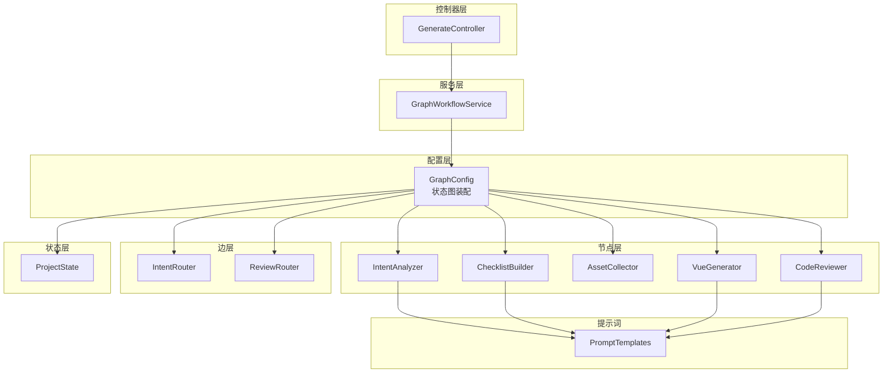
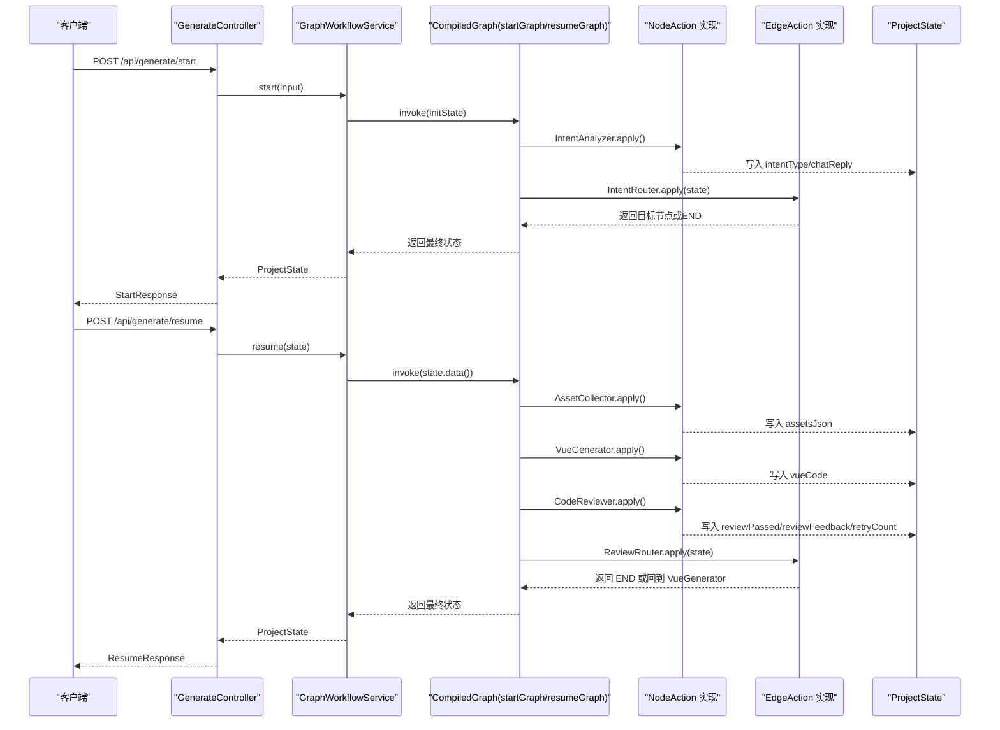
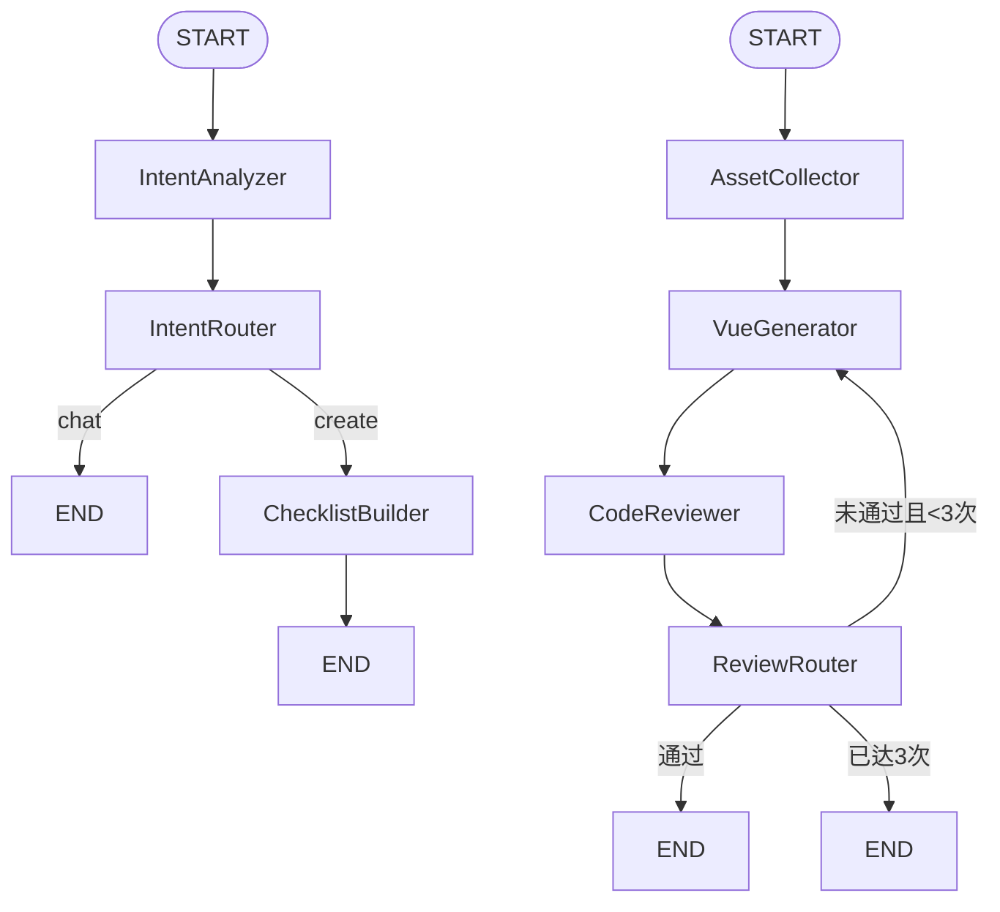
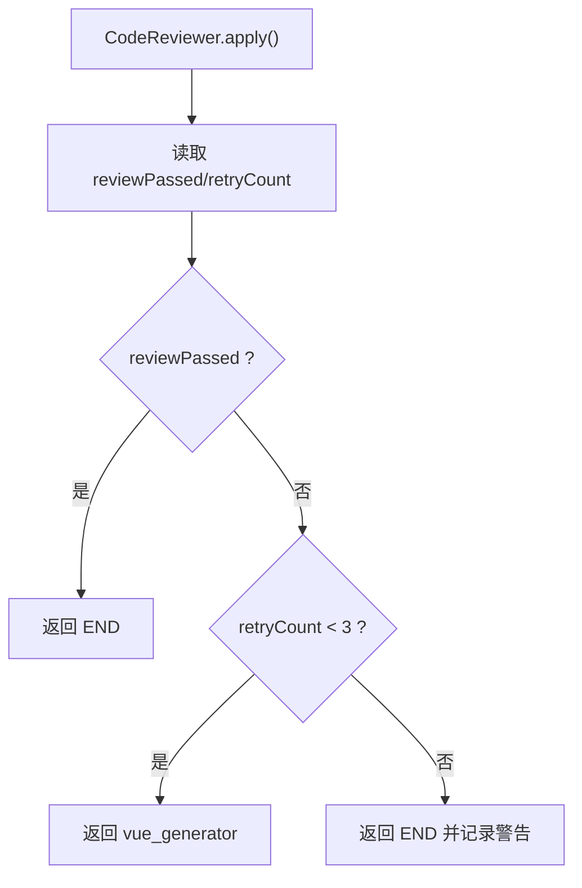
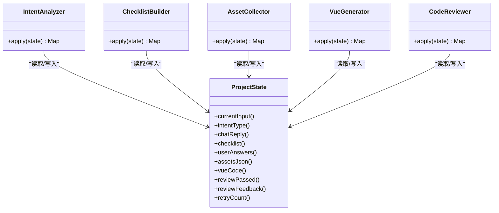
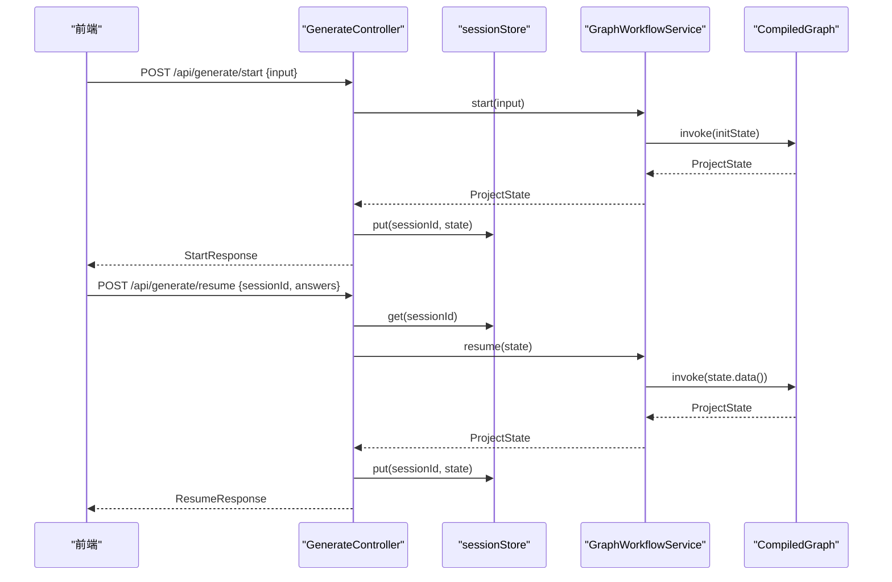
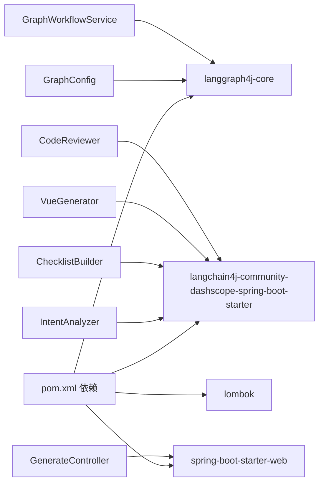

# 状态图配置系统

<cite>
**本文引用的文件**
- [GraphConfig.java](file://src/main/java/com/example/websitemother/config/GraphConfig.java)
- [IntentRouter.java](file://src/main/java/com/example/websitemother/edge/IntentRouter.java)
- [ReviewRouter.java](file://src/main/java/com/example/websitemother/edge/ReviewRouter.java)
- [ProjectState.java](file://src/main/java/com/example/websitemother/state/ProjectState.java)
- [IntentAnalyzer.java](file://src/main/java/com/example/websitemother/node/IntentAnalyzer.java)
- [ChecklistBuilder.java](file://src/main/java/com/example/websitemother/node/ChecklistBuilder.java)
- [AssetCollector.java](file://src/main/java/com/example/websitemother/node/AssetCollector.java)
- [VueGenerator.java](file://src/main/java/com/example/websitemother/node/VueGenerator.java)
- [CodeReviewer.java](file://src/main/java/com/example/websitemother/node/CodeReviewer.java)
- [GraphWorkflowService.java](file://src/main/java/com/example/websitemother/service/GraphWorkflowService.java)
- [GenerateController.java](file://src/main/java/com/example/websitemother/controller/GenerateController.java)
- [PromptTemplates.java](file://src/main/java/com/example/websitemother/prompt/PromptTemplates.java)
- [pom.xml](file://pom.xml)
</cite>

## 目录
1. [简介](#简介)
2. [项目结构](#项目结构)
3. [核心组件](#核心组件)
4. [架构总览](#架构总览)
5. [详细组件分析](#详细组件分析)
6. [依赖关系分析](#依赖关系分析)
7. [性能考虑](#性能考虑)
8. [故障排查指南](#故障排查指南)
9. [结论](#结论)
10. [附录](#附录)

## 简介
本项目基于 langgraph4j 实现了一个两阶段的状态图工作流，用于“AI 网站生成”。系统通过状态图编排多个节点（Node），在每个节点内调用大模型服务完成特定任务，并通过条件边（EdgeAction）实现智能路由与循环控制。状态图支持：
- 第一阶段：意图分析 → 清单生成（Human-in-the-loop 暂停）
- 第二阶段：素材收集 → Vue 代码生成 → 代码审查 → 条件循环（最多3次重试）

系统提供 REST API，前端可发起“开始”和“继续”流程，后端通过状态对象在各节点之间传递数据，实现端到端的自动化与可控的人机协作。

## 项目结构
项目采用 Spring Boot 结构，按功能域划分：
- config：状态图配置与编译
- node：工作流节点（任务执行者）
- edge：条件边（路由决策）
- state：全局状态模型
- service：工作流执行服务
- controller：对外 API 控制器
- prompt：提示词模板
- resources：Spring 配置资源

图表来源
- [GraphConfig.java:51-97](file://src/main/java/com/example/websitemother/config/GraphConfig.java#L51-L97)
- [GraphWorkflowService.java:17-58](file://src/main/java/com/example/websitemother/service/GraphWorkflowService.java#L17-L58)
- [GenerateController.java:22-84](file://src/main/java/com/example/websitemother/controller/GenerateController.java#L22-L84)
- [ProjectState.java:13-77](file://src/main/java/com/example/websitemother/state/ProjectState.java#L13-L77)
- [PromptTemplates.java:7-92](file://src/main/java/com/example/websitemother/prompt/PromptTemplates.java#L7-L92)

章节来源
- [GraphConfig.java:24-99](file://src/main/java/com/example/websitemother/config/GraphConfig.java#L24-L99)
- [pom.xml:33-58](file://pom.xml#L33-L58)

## 核心组件
- 状态图配置：在配置类中定义两个图（startGraph、resumeGraph），注册节点、边与条件边，并编译为 CompiledGraph。
- 节点（NodeAction）：负责具体任务，如意图分析、清单生成、素材收集、Vue 代码生成、代码审查。
- 条件边（EdgeAction）：根据状态值决定下一跳，如 IntentRouter、ReviewRouter。
- 全局状态（ProjectState）：统一承载输入、输出、中间状态（如 retryCount）。
- 工作流服务：封装 startGraph/resumeGraph 的执行入口。
- 控制器：对外暴露 /api/generate/start 与 /api/generate/resume 接口。
- 提示词模板：集中管理各节点的系统提示与用户提示。

章节来源
- [GraphConfig.java:32-97](file://src/main/java/com/example/websitemother/config/GraphConfig.java#L32-L97)
- [ProjectState.java:13-77](file://src/main/java/com/example/websitemother/state/ProjectState.java#L13-L77)
- [GraphWorkflowService.java:17-58](file://src/main/java/com/example/websitemother/service/GraphWorkflowService.java#L17-L58)
- [GenerateController.java:22-84](file://src/main/java/com/example/websitemother/controller/GenerateController.java#L22-L84)
- [PromptTemplates.java:7-92](file://src/main/java/com/example/websitemother/prompt/PromptTemplates.java#L7-L92)

## 架构总览
系统采用“配置即代码”的方式，通过 langgraph4j 的 StateGraph API 定义节点与边，再编译为可执行的 CompiledGraph。执行时，GraphWorkflowService 调用编译后的图，ProjectState 在节点间传递数据。

图表来源
- [GraphWorkflowService.java:31-58](file://src/main/java/com/example/websitemother/service/GraphWorkflowService.java#L31-L58)
- [GraphConfig.java:51-97](file://src/main/java/com/example/websitemother/config/GraphConfig.java#L51-L97)
- [IntentRouter.java:20-29](file://src/main/java/com/example/websitemother/edge/IntentRouter.java#L20-L29)
- [ReviewRouter.java:22-41](file://src/main/java/com/example/websitemother/edge/ReviewRouter.java#L22-L41)
- [IntentAnalyzer.java:24-59](file://src/main/java/com/example/websitemother/node/IntentAnalyzer.java#L24-L59)
- [ChecklistBuilder.java:24-49](file://src/main/java/com/example/websitemother/node/ChecklistBuilder.java#L24-L49)
- [AssetCollector.java:22-58](file://src/main/java/com/example/websitemother/node/AssetCollector.java#L22-L58)
- [VueGenerator.java:24-62](file://src/main/java/com/example/websitemother/node/VueGenerator.java#L24-L62)
- [CodeReviewer.java:24-58](file://src/main/java/com/example/websitemother/node/CodeReviewer.java#L24-L58)

## 详细组件分析

### 状态图配置与编译
- startGraph：从 START 到 IntentAnalyzer，再根据 IntentRouter 的返回值路由到 END 或 ChecklistBuilder，最后到 END。
- resumeGraph：从 START 到 AssetCollector → VueGenerator → CodeReviewer，再根据 ReviewRouter 的返回值路由到 END 或回到 VueGenerator（最多3次重试）。
- 编译：通过 StateGraph.compile() 生成 CompiledGraph，供 GraphWorkflowService 调用。

图表来源
- [GraphConfig.java:51-97](file://src/main/java/com/example/websitemother/config/GraphConfig.java#L51-L97)
- [IntentRouter.java:17-29](file://src/main/java/com/example/websitemother/edge/IntentRouter.java#L17-L29)
- [ReviewRouter.java:18-41](file://src/main/java/com/example/websitemother/edge/ReviewRouter.java#L18-L41)

章节来源
- [GraphConfig.java:51-97](file://src/main/java/com/example/websitemother/config/GraphConfig.java#L51-L97)

### 条件路由实现
- IntentRouter：依据 ProjectState.intentType() 决定路由到 END（chat）或 ChecklistBuilder（create）。
- ReviewRouter：依据 ProjectState.reviewPassed() 与 ProjectState.retryCount() 决定结束或回到 VueGenerator，并设置最大重试次数。

图表来源
- [ReviewRouter.java:22-41](file://src/main/java/com/example/websitemother/edge/ReviewRouter.java#L22-L41)
- [CodeReviewer.java:24-58](file://src/main/java/com/example/websitemother/node/CodeReviewer.java#L24-L58)

章节来源
- [IntentRouter.java:17-29](file://src/main/java/com/example/websitemother/edge/IntentRouter.java#L17-L29)
- [ReviewRouter.java:18-41](file://src/main/java/com/example/websitemother/edge/ReviewRouter.java#L18-L41)

### 节点职责与数据流
- IntentAnalyzer：解析用户输入，输出 intentType 与 chatReply。
- ChecklistBuilder：生成需求清单（JSON 字符串）。
- AssetCollector：根据用户答案生成图片素材 JSON。
- VueGenerator：整合需求、素材与反馈，生成 Vue 单文件组件代码。
- CodeReviewer：审查 Vue 代码，输出通过/失败与反馈，并递增重试计数。

图表来源
- [ProjectState.java:30-76](file://src/main/java/com/example/websitemother/state/ProjectState.java#L30-L76)
- [IntentAnalyzer.java:24-59](file://src/main/java/com/example/websitemother/node/IntentAnalyzer.java#L24-L59)
- [ChecklistBuilder.java:24-49](file://src/main/java/com/example/websitemother/node/ChecklistBuilder.java#L24-L49)
- [AssetCollector.java:22-58](file://src/main/java/com/example/websitemother/node/AssetCollector.java#L22-L58)
- [VueGenerator.java:24-62](file://src/main/java/com/example/websitemother/node/VueGenerator.java#L24-L62)
- [CodeReviewer.java:24-58](file://src/main/java/com/example/websitemother/node/CodeReviewer.java#L24-L58)

章节来源
- [IntentAnalyzer.java:24-59](file://src/main/java/com/example/websitemother/node/IntentAnalyzer.java#L24-L59)
- [ChecklistBuilder.java:24-49](file://src/main/java/com/example/websitemother/node/ChecklistBuilder.java#L24-L49)
- [AssetCollector.java:22-58](file://src/main/java/com/example/websitemother/node/AssetCollector.java#L22-L58)
- [VueGenerator.java:24-62](file://src/main/java/com/example/websitemother/node/VueGenerator.java#L24-L62)
- [CodeReviewer.java:24-58](file://src/main/java/com/example/websitemother/node/CodeReviewer.java#L24-L58)

### API 工作流与状态传递
- /api/generate/start：接收用户输入，执行 startGraph，返回 sessionId、intentType、chatReply、checklist。
- /api/generate/resume：根据 sessionId 获取状态，填充 userAnswers，执行 resumeGraph，返回 vueCode、reviewPassed、reviewFeedback、retryCount。
- 会话状态：使用内存 Map 存储（演示用途，生产建议使用 Redis）。

图表来源
- [GenerateController.java:33-84](file://src/main/java/com/example/websitemother/controller/GenerateController.java#L33-L84)
- [GraphWorkflowService.java:31-58](file://src/main/java/com/example/websitemother/service/GraphWorkflowService.java#L31-L58)

章节来源
- [GenerateController.java:33-84](file://src/main/java/com/example/websitemother/controller/GenerateController.java#L33-L84)
- [GraphWorkflowService.java:31-58](file://src/main/java/com/example/websitemother/service/GraphWorkflowService.java#L31-L58)

## 依赖关系分析
- langgraph4j-core：状态图核心库，提供 StateGraph、CompiledGraph、NodeAction、EdgeAction 等能力。
- langchain4j-community-dashscope-spring-boot-starter：大模型服务集成（DashScope）。
- Spring Boot Web：REST API 框架。
- Lombok：简化 POJO 与日志注解。

图表来源
- [pom.xml:33-58](file://pom.xml#L33-L58)
- [GraphConfig.java:10-22](file://src/main/java/com/example/websitemother/config/GraphConfig.java#L10-L22)
- [GraphWorkflowService.java:5](file://src/main/java/com/example/websitemother/service/GraphWorkflowService.java#L5)
- [GenerateController.java:3-7](file://src/main/java/com/example/websitemother/controller/GenerateController.java#L3-L7)

章节来源
- [pom.xml:33-58](file://pom.xml#L33-L58)

## 性能考虑
- 异步节点：使用 node_async 包装节点，提升并发吞吐。
- 条件边异步：使用 edge_async 包装路由逻辑，避免阻塞。
- 大模型调用：在节点内部进行，建议在 ChatModelService 层引入缓存与限流策略，避免频繁调用。
- 重试控制：ReviewRouter 最大重试次数为3，防止无限循环。
- 序列化开销：ProjectState 使用 Map<String,Object>，注意避免过大对象，必要时拆分状态键。
- 日志级别：生产环境建议降低 INFO 级别，仅保留关键日志。

## 故障排查指南
- 启动失败：检查 GraphConfig 中节点与边的注册顺序与命名一致性。
- 路由异常：确认 EdgeAction 的返回值与 StateGraph 中的目标节点一致。
- 状态缺失：确保节点 apply() 返回的键与 ProjectState 常量一致。
- 大模型异常：检查 ChatModelService 的配置与网络连通性。
- API 会话丢失：确认 sessionStore 中 sessionId 是否存在，生产环境替换为持久化存储。
- JSON 解析错误：检查 ChecklistBuilder 与 VueGenerator 对 JSON 的清理逻辑。

章节来源
- [GraphConfig.java:51-97](file://src/main/java/com/example/websitemother/config/GraphConfig.java#L51-L97)
- [GraphWorkflowService.java:31-58](file://src/main/java/com/example/websitemother/service/GraphWorkflowService.java#L31-L58)
- [GenerateController.java:61-64](file://src/main/java/com/example/websitemother/controller/GenerateController.java#L61-L64)

## 结论
该状态图配置系统通过清晰的节点职责与条件路由，实现了从意图分析到 Vue 代码生成的自动化工作流，并支持人类参与与多轮审查循环。借助 langgraph4j 的编译机制与 Spring Boot 的 REST 框架，系统具备良好的扩展性与可维护性。建议在生产环境中增强状态持久化、日志分级与大模型调用的稳定性保障。

## 附录
- 状态键常量：CURRENT_INPUT、INTENT_TYPE、CHAT_REPLY、CHECKLIST、USER_ANSWERS、ASSETS_JSON、VUE_CODE、REVIEW_PASSED、REVIEW_FEEDBACK、RETRY_COUNT。
- API 端点：
  - POST /api/generate/start：开始工作流
  - POST /api/generate/resume：继续工作流并提交答案

章节来源
- [ProjectState.java:15-24](file://src/main/java/com/example/websitemother/state/ProjectState.java#L15-L24)
- [GenerateController.java:33-84](file://src/main/java/com/example/websitemother/controller/GenerateController.java#L33-L84)