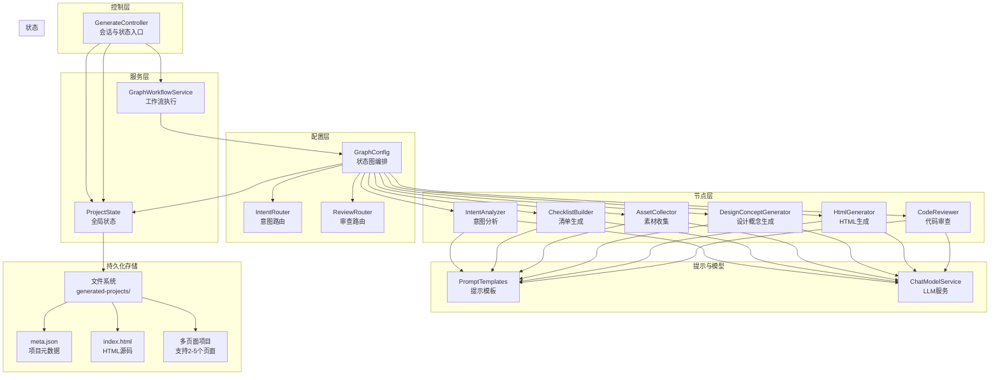
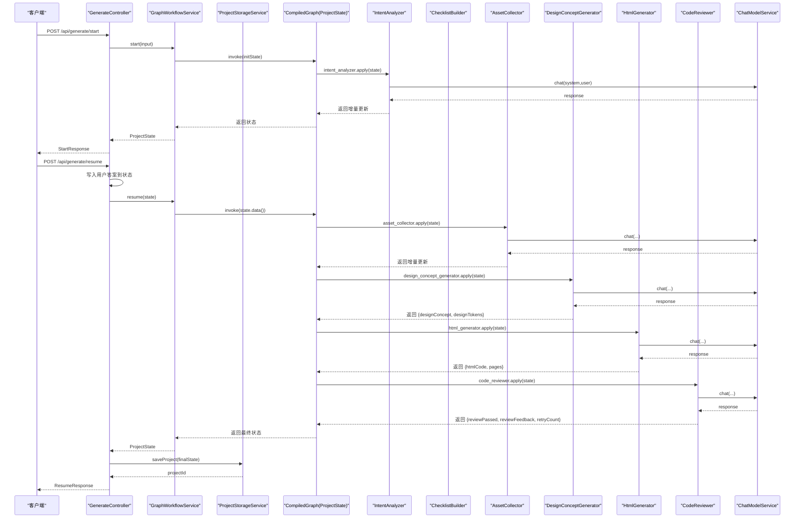
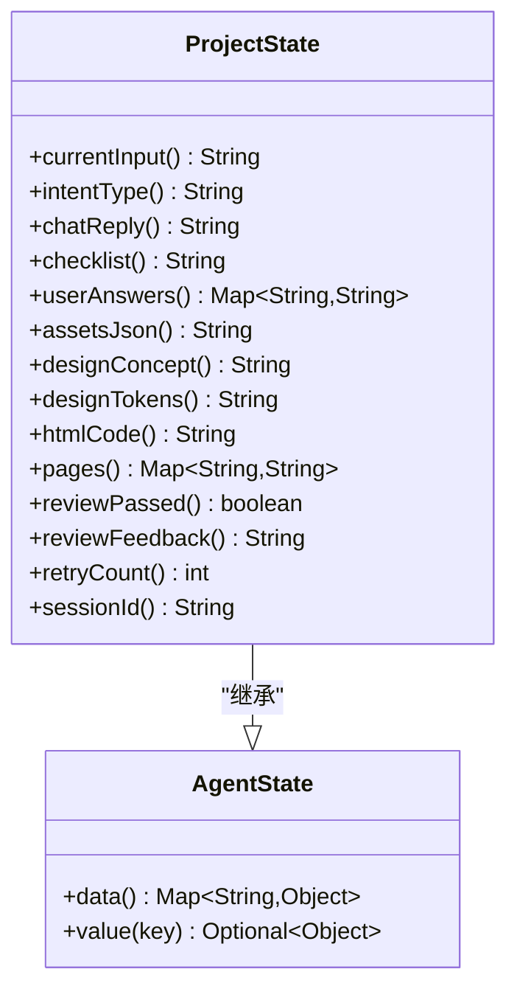
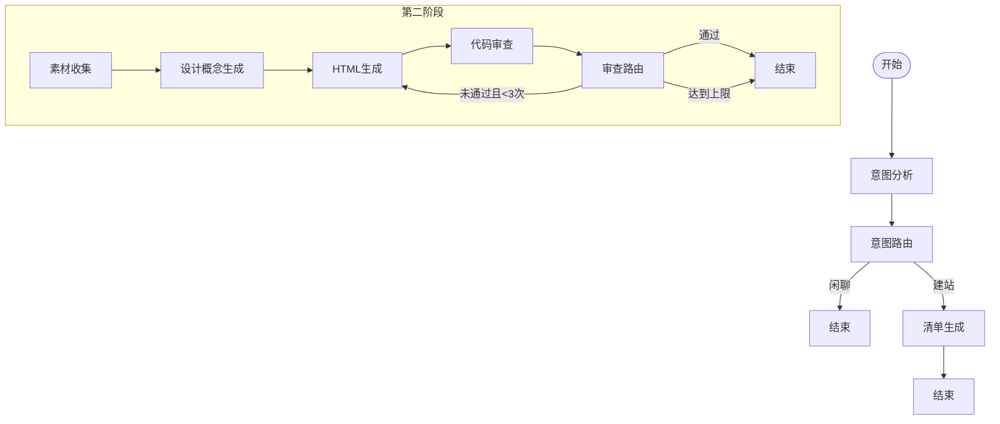
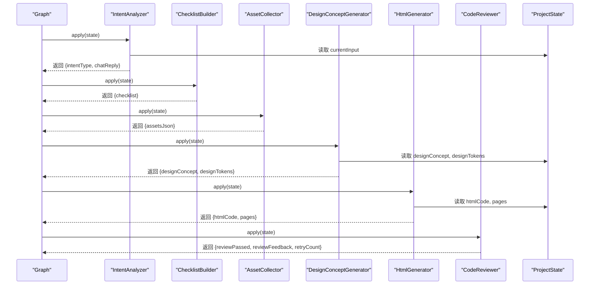
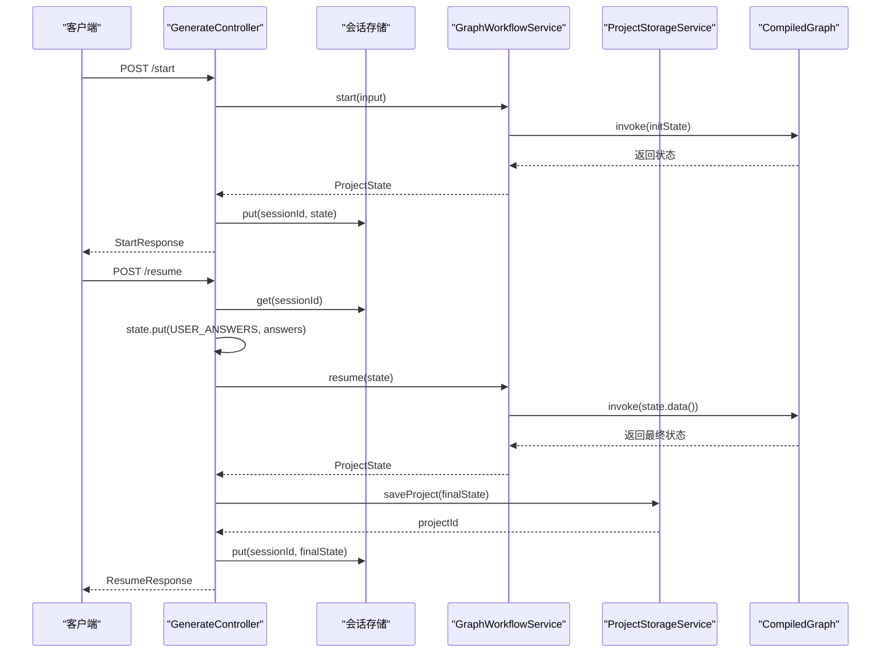
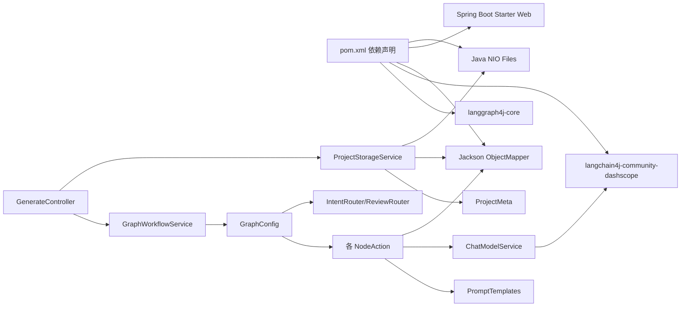

# 项目状态管理

<cite>
**本文引用的文件**
- [ProjectState.java](file://src/main/java/com/example/websitemother/state/ProjectState.java)
- [GraphWorkflowService.java](file://src/main/java/com/example/websitemother/service/GraphWorkflowService.java)
- [GenerateController.java](file://src/main/java/com/example/websitemother/controller/GenerateController.java)
- [ProjectStorageService.java](file://src/main/java/com/example/websitemother/service/ProjectStorageService.java)
- [ProjectMeta.java](file://src/main/java/com/example/websitemother/dto/ProjectMeta.java)
- [GraphConfig.java](file://src/main/java/com/example/websitemother/config/GraphConfig.java)
- [IntentAnalyzer.java](file://src/main/java/com/example/websitemother/node/IntentAnalyzer.java)
- [ChecklistBuilder.java](file://src/main/java/com/example/websitemother/node/ChecklistBuilder.java)
- [AssetCollector.java](file://src/main/java/com/example/websitemother/node/AssetCollector.java)
- [DesignConceptGenerator.java](file://src/main/java/com/example/websitemother/node/DesignConceptGenerator.java)
- [HtmlGenerator.java](file://src/main/java/com/example/websitemother/node/HtmlGenerator.java)
- [CodeReviewer.java](file://src/main/java/com/example/websitemother/node/CodeReviewer.java)
- [IntentRouter.java](file://src/main/java/com/example/websitemother/edge/IntentRouter.java)
- [ReviewRouter.java](file://src/main/java/com/example/websitemother/edge/ReviewRouter.java)
- [PromptTemplates.java](file://src/main/java/com/example/websitemother/prompt/PromptTemplates.java)
- [ChatModelService.java](file://src/main/java/com/example/websitemother/service/ChatModelService.java)
- [application.yml](file://src/main/resources/application.yml)
- [pom.xml](file://pom.xml)
</cite>

## 更新摘要
**所做更改**
- 更新了状态模型以支持HTML生成的多字段架构
- 新增了设计概念生成器和HTML生成器节点
- 更新了工作流程以支持多页面HTML项目生成
- 增强了状态字段定义和序列化机制
- 更新了API响应结构以包含新的设计相关字段

## 目录
1. [引言](#引言)
2. [项目结构](#项目结构)
3. [核心组件](#核心组件)
4. [架构总览](#架构总览)
5. [详细组件分析](#详细组件分析)
6. [依赖关系分析](#依赖关系分析)
7. [性能考量](#性能考量)
8. [故障排查指南](#故障排查指南)
9. [结论](#结论)
10. [附录](#附录)

## 引言
本文件围绕 ProjectState 项目状态管理展开，系统阐述状态模型设计理念、字段定义与数据类型选择、序列化与持久化策略、工作流中的传递与更新机制（合并、冲突与版本控制）、监控与调试方法（快照、变更追踪、性能分析），以及状态扩展与定制化（新增字段、状态校验与向后兼容）。文档同时提供最佳实践与常见陷阱的规避建议，帮助开发者在不破坏现有流程的前提下安全地演进状态模型。

**更新** 本版本进行了重大架构升级，从单一的Vue代码生成转变为支持HTML生成的多字段架构，包括设计概念生成、CSS变量系统、多页面HTML项目生成等功能。

## 项目结构
本项目采用 Spring Boot + LangGraph4j 的分层架构：
- 控制层：REST API 入口，负责会话管理与状态读写
- 服务层：封装工作流编排与执行
- 配置层：定义状态图与节点/边的编排
- 节点层：各 Agent 节点实现具体业务动作，包括设计概念生成和HTML代码生成
- 边层：条件路由，决定状态流转方向
- 提示模板：统一管理各节点的提示词
- LLM 服务：封装 DashScope Qwen 调用
- **持久化服务**：项目文件存储与管理

**图表来源**
- [GenerateController.java](file://src/main/java/com/example/websitemother/controller/GenerateController.java)
- [GraphWorkflowService.java](file://src/main/java/com/example/websitemother/service/GraphWorkflowService.java)
- [ProjectStorageService.java](file://src/main/java/com/example/websitemother/service/ProjectStorageService.java)
- [GraphConfig.java](file://src/main/java/com/example/websitemother/config/GraphConfig.java)
- [IntentAnalyzer.java](file://src/main/java/com/example/websitemother/node/IntentAnalyzer.java)
- [ChecklistBuilder.java](file://src/main/java/com/example/websitemother/node/ChecklistBuilder.java)
- [AssetCollector.java](file://src/main/java/com/example/websitemother/node/AssetCollector.java)
- [DesignConceptGenerator.java](file://src/main/java/com/example/websitemother/node/DesignConceptGenerator.java)
- [HtmlGenerator.java](file://src/main/java/com/example/websitemother/node/HtmlGenerator.java)
- [CodeReviewer.java](file://src/main/java/com/example/websitemother/node/CodeReviewer.java)
- [IntentRouter.java](file://src/main/java/com/example/websitemother/edge/IntentRouter.java)
- [ReviewRouter.java](file://src/main/java/com/example/websitemother/edge/ReviewRouter.java)
- [PromptTemplates.java](file://src/main/java/com/example/websitemother/prompt/PromptTemplates.java)
- [ChatModelService.java](file://src/main/java/com/example/websitemother/service/ChatModelService.java)
- [ProjectState.java](file://src/main/java/com/example/websitemother/state/ProjectState.java)

**章节来源**
- [GenerateController.java](file://src/main/java/com/example/websitemother/controller/GenerateController.java)
- [GraphWorkflowService.java](file://src/main/java/com/example/websitemother/service/GraphWorkflowService.java)
- [ProjectStorageService.java](file://src/main/java/com/example/websitemother/service/ProjectStorageService.java)
- [GraphConfig.java](file://src/main/java/com/example/websitemother/config/GraphConfig.java)

## 核心组件
本节聚焦 ProjectState 状态模型及其在工作流中的角色，以及新增的HTML生成和设计概念生成功能。

- **状态基类与继承**
  - ProjectState 继承自 LangGraph4j 的 AgentState，作为 StateGraph 在全图中流转的全局状态载体。
  - 通过 Map<String, Object> 存储键值对，支持动态扩展与灵活序列化。

- **字段定义与业务语义**
  - 当前输入：记录用户当前输入，驱动意图分析与需求生成。
  - 意图类型：标识用户是闲聊还是建站需求，决定工作流分支。
  - 闲聊回复：当意图是闲聊时，返回友好回复。
  - 需求清单：由模型生成的待补充字段集合，供用户填写。
  - 用户答案：用户在清单阶段的补充信息，Map 结构便于扩展。
  - 素材 JSON：收集阶段生成的图片素材元数据 JSON 字符串。
  - **更新**：设计概念：结构化的JSON格式设计概念，包含配色方案、字体系统、布局方向等。
  - **更新**：设计令牌：CSS变量形式的设计系统，用于HTML生成。
  - **更新**：HTML代码：最终生成的完整HTML代码，支持多页面项目。
  - **更新**：页面映射：多页面项目的文件名到代码的映射。
  - 审查结果：布尔值表示代码是否通过审查。
  - 审查反馈：审查专家给出的问题与修复建议。
  - 重试计数：审查未通过时的循环重试次数，上限为 3。

- **数据类型选择与复杂度**
  - 字段多为 String 或 Map<String, String>，便于 JSON 序列化与前后端传输。
  - userAnswers 使用 Map<String, String>，时间复杂度 O(1) 查找，适合频繁读取与更新。
  - assetsJson 为 JSON 字符串，解析成本低，适合跨节点传递。
  - **更新**：designConcept 和 designTokens 为结构化JSON字符串，便于前端渲染和CSS变量注入。
  - **更新**：pages 为 Map<String, String>，支持多页面HTML项目的存储和管理。

- **序列化与反序列化机制**
  - ProjectState 通过父类 AgentState 的 data() Map 进行序列化/反序列化，LangGraph4j 编译图在节点间传递 Map。
  - 控制器层在内存中以 ConcurrentHashMap 存储会话状态，便于演示；生产环境建议替换为 Redis 等持久化存储。
  - 素材收集节点使用 Jackson ObjectMapper 将 Map 转换为 JSON 字符串，确保跨语言/跨组件一致性。
  - **更新**：设计概念生成器使用 Jackson ObjectMapper 解析JSON并提取CSS变量。
  - **更新**：HTML生成器支持多文件格式解析，使用正则表达式提取页面代码。
  - **新增**：ProjectStorageService 使用 Jackson ObjectMapper 进行项目元数据的 JSON 序列化。

- **状态更新与合并**
  - 节点通过返回 Map 将增量更新合并入状态，LangGraph4j 自动覆盖同名键。
  - 控制器在 resume 阶段将用户答案写入状态，随后调用 resumeGraph 执行后续节点。
  - **更新**：设计概念生成器返回 designConcept 和 designTokens 字段。
  - **更新**：HTML生成器返回 htmlCode 和 pages 字段，支持多页面项目。
  - **新增**：控制器在 resume 操作完成后自动调用 ProjectStorageService 保存项目。

- **版本控制与冲突解决**
  - 当前实现未引入显式版本号；可通过在状态中增加版本字段并在节点间校验来实现版本控制。
  - 冲突解决策略：后写入覆盖先写入，必要时可在节点内引入"合并函数"或"条件写入"。

- **项目持久化集成**
  - **新增**：ProjectStorageService 提供完整的项目存储能力，包括多页面HTML项目保存、项目骨架创建、元数据管理。
  - **新增**：GenerateController 在 resume 操作中自动保存生成的 HTML 项目到文件系统。
  - **更新**：项目目录结构标准化，包含 HTML文件、meta.json、package.json 等标准文件。
  - **更新**：支持多页面HTML项目的完整保存和管理。

**章节来源**
- [ProjectState.java](file://src/main/java/com/example/websitemother/state/ProjectState.java)
- [AssetCollector.java](file://src/main/java/com/example/websitemother/node/AssetCollector.java)
- [GenerateController.java](file://src/main/java/com/example/websitemother/controller/GenerateController.java)
- [ProjectStorageService.java](file://src/main/java/com/example/websitemother/service/ProjectStorageService.java)
- [ProjectMeta.java](file://src/main/java/com/example/websitemother/dto/ProjectMeta.java)
- [DesignConceptGenerator.java](file://src/main/java/com/example/websitemother/node/DesignConceptGenerator.java)
- [HtmlGenerator.java](file://src/main/java/com/example/websitemother/node/HtmlGenerator.java)

## 架构总览
本项目采用"控制器-服务-配置-节点-边"的分层架构，结合 LangGraph4j 的状态图实现工作流编排。状态在节点间以 Map 形式传递，节点通过返回增量更新合并到全局状态。**更新**：集成设计概念生成和HTML生成节点，实现从需求到完整多页面HTML项目的自动化流程。

**图表来源**
- [GenerateController.java](file://src/main/java/com/example/websitemother/controller/GenerateController.java)
- [GraphWorkflowService.java](file://src/main/java/com/example/websitemother/service/GraphWorkflowService.java)
- [ProjectStorageService.java](file://src/main/java/com/example/websitemother/service/ProjectStorageService.java)
- [GraphConfig.java](file://src/main/java/com/example/websitemother/config/GraphConfig.java)
- [IntentAnalyzer.java](file://src/main/java/com/example/websitemother/node/IntentAnalyzer.java)
- [ChecklistBuilder.java](file://src/main/java/com/example/websitemother/node/ChecklistBuilder.java)
- [AssetCollector.java](file://src/main/java/com/example/websitemother/node/AssetCollector.java)
- [DesignConceptGenerator.java](file://src/main/java/com/example/websitemother/node/DesignConceptGenerator.java)
- [HtmlGenerator.java](file://src/main/java/com/example/websitemother/node/HtmlGenerator.java)
- [CodeReviewer.java](file://src/main/java/com/example/websitemother/node/CodeReviewer.java)
- [ChatModelService.java](file://src/main/java/com/example/websitemother/service/ChatModelService.java)

## 详细组件分析

### 状态模型与数据结构
ProjectState 作为全局状态，提供类型安全的访问器方法，内部以 Map<String, Object> 存储键值。其字段常量集中定义，便于跨组件引用与一致性维护。

**图表来源**
- [ProjectState.java](file://src/main/java/com/example/websitemother/state/ProjectState.java)

**章节来源**
- [ProjectState.java](file://src/main/java/com/example/websitemother/state/ProjectState.java)

### 工作流编排与状态传递
- startGraph：意图分析 → 清单生成 → 结束（闲聊）或进入清单生成（建站）
- **更新**：resumeGraph：素材收集 → 设计概念生成 → HTML生成 → 代码审查 → 条件路由（通过则结束，未通过且重试次数 < 3 则回到 HTML生成）

**图表来源**
- [GraphConfig.java](file://src/main/java/com/example/websitemother/config/GraphConfig.java)
- [IntentRouter.java](file://src/main/java/com/example/websitemother/edge/IntentRouter.java)
- [ReviewRouter.java](file://src/main/java/com/example/websitemother/edge/ReviewRouter.java)

**章节来源**
- [GraphConfig.java](file://src/main/java/com/example/websitemother/config/GraphConfig.java)
- [IntentRouter.java](file://src/main/java/com/example/websitemother/edge/IntentRouter.java)
- [ReviewRouter.java](file://src/main/java/com/example/websitemother/edge/ReviewRouter.java)

### 节点行为与状态更新
- 意图分析：读取 currentInput，调用 LLM 输出 INTENT 与 REPLY，并写回状态。
- 清单生成：根据需求生成 JSON 格式的 checklist。
- 素材收集：基于用户答案生成图片素材 JSON，写入 assetsJson。
- **更新**：设计概念生成：解析设计需求和素材，生成结构化的设计概念JSON和CSS变量系统。
- **更新**：HTML生成：汇总设计概念、素材与审查反馈，生成完整的多页面HTML项目。
- 代码审查：评估代码完整性与规范性，写回 reviewPassed、reviewFeedback 与 retryCount。

**图表来源**
- [IntentAnalyzer.java](file://src/main/java/com/example/websitemother/node/IntentAnalyzer.java)
- [ChecklistBuilder.java](file://src/main/java/com/example/websitemother/node/ChecklistBuilder.java)
- [AssetCollector.java](file://src/main/java/com/example/websitemother/node/AssetCollector.java)
- [DesignConceptGenerator.java](file://src/main/java/com/example/websitemother/node/DesignConceptGenerator.java)
- [HtmlGenerator.java](file://src/main/java/com/example/websitemother/node/HtmlGenerator.java)
- [CodeReviewer.java](file://src/main/java/com/example/websitemother/node/CodeReviewer.java)
- [ProjectState.java](file://src/main/java/com/example/websitemother/state/ProjectState.java)

**章节来源**
- [IntentAnalyzer.java](file://src/main/java/com/example/websitemother/node/IntentAnalyzer.java)
- [ChecklistBuilder.java](file://src/main/java/com/example/websitemother/node/ChecklistBuilder.java)
- [AssetCollector.java](file://src/main/java/com/example/websitemother/node/AssetCollector.java)
- [DesignConceptGenerator.java](file://src/main/java/com/example/websitemother/node/DesignConceptGenerator.java)
- [HtmlGenerator.java](file://src/main/java/com/example/websitemother/node/HtmlGenerator.java)
- [CodeReviewer.java](file://src/main/java/com/example/websitemother/node/CodeReviewer.java)

### API 流程与状态持久化
- /api/generate/start：初始化状态，写入 currentInput，返回 sessionId、intentType、chatReply、checklist。
- **更新**：/api/generate/resume：根据 sessionId 获取状态，写入 userAnswers，执行 resumeGraph，**新增**：调用 ProjectStorageService 保存多页面HTML项目，返回 projectId、htmlCode、designConcept、designTokens、reviewPassed、reviewFeedback、retryCount。
- 会话存储：当前使用内存 ConcurrentHashMap（演示用途），生产环境需替换为 Redis 等持久化存储。
- **新增**：项目持久化：保存多页面HTML项目到文件系统，创建项目骨架文件，生成 meta.json 元数据。

**图表来源**
- [GenerateController.java](file://src/main/java/com/example/websitemother/controller/GenerateController.java)
- [GraphWorkflowService.java](file://src/main/java/com/example/websitemother/service/GraphWorkflowService.java)
- [ProjectStorageService.java](file://src/main/java/com/example/websitemother/service/ProjectStorageService.java)

**章节来源**
- [GenerateController.java](file://src/main/java/com/example/websitemother/controller/GenerateController.java)
- [GraphWorkflowService.java](file://src/main/java/com/example/websitemother/service/GraphWorkflowService.java)
- [ProjectStorageService.java](file://src/main/java/com/example/websitemother/service/ProjectStorageService.java)

### 项目持久化服务详解
**新增** ProjectStorageService 提供完整的项目存储能力，包括多页面HTML项目文件系统操作、项目骨架创建和元数据管理。

- **文件存储结构**
  - 基础目录：generated-projects/
  - 项目目录：generated-projects/{projectId}/
  - **更新**：标准文件：index.html、meta.json、package.json、vite.config.js、index.html、src/main.js、src/style.css、README.md
  - **更新**：多页面支持：支持2-5个HTML页面文件的完整保存

- **保存流程**
  - 生成唯一项目ID
  - 创建项目目录
  - **更新**：保存多页面HTML项目：解析pages映射，逐个保存页面文件
  - **更新**：回退机制：如果多页面解析失败，保存单个HTML文件
  - 生成项目元数据 meta.json
  - 创建项目骨架文件
  - 记录日志并返回项目ID

- **项目骨架内容**
  - package.json：包含 Vue 3、Vite、Tailwind CSS 4 的依赖
  - vite.config.js：配置 Vue 和 Tailwind CSS 插件
  - index.html：基础 HTML 结构
  - src/main.js：应用入口
  - src/style.css：Tailwind CSS 导入
  - README.md：运行说明

- **元数据管理**
  - ProjectMeta DTO：包含项目ID、原始输入、HTML代码预览、设计概念、审查状态、重试次数、创建时间
  - **更新**：包含designConcept字段，确保设计相关信息的完整保存
  - 自动序列化和反序列化
  - 支持项目列表查询和单个项目查询

**章节来源**
- [ProjectStorageService.java](file://src/main/java/com/example/websitemother/service/ProjectStorageService.java)
- [ProjectMeta.java](file://src/main/java/com/example/websitemother/dto/ProjectMeta.java)

### 设计概念生成器详解
**新增** DesignConceptGenerator 节点负责根据用户需求和素材生成结构化的设计概念方案。

- **设计概念生成流程**
  - 组装完整需求描述，包含原始需求和用户补充信息
  - 调用LLM生成结构化JSON格式的设计概念
  - 清理可能的markdown标记，确保纯JSON输出
  - 解析JSON并提取CSS变量定义

- **设计概念结构**
  - colorPalette：配色方案，包含主色、辅色、背景色等
  - typography：字体系统，包含标题字体和正文字体
  - spacing：间距系统，包含基础间距单位
  - layoutDirection：布局方向
  - mood：整体氛围描述

- **CSS变量提取**
  - 从设计概念JSON中提取配色、字体、间距信息
  - 生成CSS :root变量定义
  - 支持前端实时调整和主题切换

**章节来源**
- [DesignConceptGenerator.java](file://src/main/java/com/example/websitemother/node/DesignConceptGenerator.java)
- [PromptTemplates.java](file://src/main/java/com/example/websitemother/prompt/PromptTemplates.java)

### HTML生成器详解
**更新** HtmlGenerator 节点现在支持生成完整的多页面HTML项目，而不仅仅是单个HTML文件。

- **多页面支持**
  - 支持2-5个HTML页面文件的生成
  - 使用精确的分隔符 --- FILE: filename.html --- 区分页面
  - 解析多文件响应，生成pages映射

- **分块增量修改**
  - 支持重试时的分块增量修改
  - 识别BLOCK: head|body_structure|body_script标记
  - 精确替换指定代码区域，避免整页重写

- **链接安全处理**
  - 为所有外部链接注入target="_blank" rel="noopener noreferrer"
  - 保持内部链接和锚点链接的原样
  - 防止iframe内点击链接跳出父页面

- **代码质量评分**
  - 对主页面进行代码质量评分
  - 提供详细的评分报告和改进建议
  - 支持前端实时显示代码质量状态

**章节来源**
- [HtmlGenerator.java](file://src/main/java/com/example/websitemother/node/HtmlGenerator.java)
- [PromptTemplates.java](file://src/main/java/com/example/websitemother/prompt/PromptTemplates.java)

## 依赖关系分析
- 外部依赖
  - LangGraph4j：状态图编排与执行
  - LangChain4J DashScope：Qwen 大模型调用
  - Jackson：JSON 序列化（素材收集节点、项目持久化、设计概念解析）
  - **新增**：Java NIO：文件系统操作
- 内部依赖
  - 控制器依赖服务层；服务层依赖配置层编译图；配置层依赖节点与边；节点依赖提示模板与 LLM 服务。
  - **新增**：控制器依赖 ProjectStorageService；持久化服务依赖 Jackson ObjectMapper。

**图表来源**
- [pom.xml](file://pom.xml)
- [GenerateController.java](file://src/main/java/com/example/websitemother/controller/GenerateController.java)
- [GraphWorkflowService.java](file://src/main/java/com/example/websitemother/service/GraphWorkflowService.java)
- [ProjectStorageService.java](file://src/main/java/com/example/websitemother/service/ProjectStorageService.java)
- [GraphConfig.java](file://src/main/java/com/example/websitemother/config/GraphConfig.java)
- [ChatModelService.java](file://src/main/java/com/example/websitemother/service/ChatModelService.java)
- [PromptTemplates.java](file://src/main/java/com/example/websitemother/prompt/PromptTemplates.java)
- [ProjectMeta.java](file://src/main/java/com/example/websitemother/dto/ProjectMeta.java)

**章节来源**
- [pom.xml](file://pom.xml)
- [application.yml](file://src/main/resources/application.yml)

## 性能考量
- LLM 调用开销
  - ChatModelService 对每次调用进行日志记录与异常包装，建议在生产环境启用超时与重试策略。
  - 提示模板统一管理，便于优化与缓存热点提示。
  - **更新**：设计概念生成和HTML生成的LLM调用成本较高，建议实施合理的超时和重试机制。
- 状态传递与序列化
  - ProjectState 以 Map 传递，避免深度拷贝；assetsJson 为 JSON 字符串，减少解析成本。
  - **更新**：designConcept 和 designTokens 为结构化JSON，便于前端渲染但增加解析成本。
  - **更新**：pages 映射包含多个HTML页面，需要考虑内存占用和序列化性能。
  - 建议对大型状态进行分片或压缩（如 gzip）以降低网络传输开销。
- 并发与会话存储
  - 当前内存存储为演示用途，生产环境需使用 Redis 等具备持久化与高可用能力的存储。
- **新增**：文件系统 I/O 性能
  - 项目保存涉及多个HTML文件写入操作，建议在高并发场景下考虑异步处理或队列化。
  - 多页面项目的文件操作比单文件项目复杂，需要优化I/O性能。
  - 元数据序列化使用 Jackson 的 pretty printer，适合开发调试但可能影响性能。
  - 建议对大文件内容（如HTML源码）进行适当的大小限制和分块处理。
- 节点执行顺序
  - 通过条件边控制重试次数，避免无限循环；合理设置 MAX_RETRY（当前为 3）。
  - **更新**：设计概念生成和HTML生成的节点执行时间较长，需要考虑整体工作流的性能优化。

## 故障排查指南
- 常见问题定位
  - LLM 调用失败：检查 API Key 与模型名称配置，查看 ChatModelService 日志。
  - 状态字段缺失：确认节点是否正确返回所需键；检查 ProjectState 访问器默认值。
  - 会话不存在：检查 sessionId 是否正确传递与存储。
  - **新增**：文件保存失败：检查 generated-projects 目录权限和磁盘空间。
  - **新增**：项目骨架创建失败：检查 Java NIO 文件系统操作权限。
  - **更新**：设计概念解析失败：检查JSON格式是否符合预期结构。
  - **更新**：HTML生成失败：检查多文件格式分隔符是否正确。
- 监控与调试
  - 日志级别：INFO 记录关键流程，DEBUG 记录 LLM 响应细节。
  - 状态快照：在关键节点打印 state.data() 的子集，便于对比前后差异。
  - 变更追踪：在节点返回 Map 中记录变更键列表，辅助审计。
  - **新增**：持久化监控：记录项目保存的完整路径和元数据信息。
  - **更新**：设计相关监控：记录设计概念生成和CSS变量提取过程。
  - **更新**：多页面监控：跟踪页面解析和保存过程。
- 性能分析
  - 统计各节点耗时与 LLM 调用耗时，定位瓶颈。
  - 观察 retryCount 与 reviewFeedback，评估模型质量与提示模板有效性。
  - **新增**：I/O 性能分析：监控文件写入耗时和磁盘使用情况。
  - **更新**：设计概念生成性能：分析JSON解析和CSS变量提取的性能。
  - **更新**：HTML生成性能：监控多页面解析和分块修改的效率。

**章节来源**
- [ChatModelService.java](file://src/main/java/com/example/websitemother/service/ChatModelService.java)
- [application.yml](file://src/main/resources/application.yml)
- [GenerateController.java](file://src/main/java/com/example/websitemother/controller/GenerateController.java)
- [ProjectStorageService.java](file://src/main/java/com/example/websitemother/service/ProjectStorageService.java)
- [DesignConceptGenerator.java](file://src/main/java/com/example/websitemother/node/DesignConceptGenerator.java)
- [HtmlGenerator.java](file://src/main/java/com/example/websitemother/node/HtmlGenerator.java)

## 结论
ProjectState 以简洁的 Map 结构承载全局状态，配合 LangGraph4j 的状态图实现清晰的工作流编排。**更新**：经过重大架构升级，系统从单一的Vue代码生成转变为支持HTML生成的多字段架构，包括设计概念生成、CSS变量系统、多页面HTML项目生成等功能。通过节点返回增量更新的方式，实现了高效的状态传递与合并。**新增**：集成 ProjectStorageService 提供完整的项目持久化能力，GenerateController 在 resume 操作中自动保存生成的多页面HTML项目到文件系统，创建可运行的项目骨架。建议在生产环境中完善会话持久化、引入版本控制与冲突解决策略，并持续优化提示模板与 LLM 调用策略，以提升稳定性与用户体验。

## 附录

### 状态扩展与定制化指南
- 新增字段
  - 在 ProjectState 中新增字段常量与访问器方法。
  - 在对应节点中返回新键值，确保下游节点可读取。
  - 在控制器层按需暴露到 API 响应对象。
  - **新增**：在 ProjectMeta 中同步新增字段，确保元数据完整性。
  - **更新**：新增designConcept、designTokens、htmlCode、pages字段的处理逻辑。
- 状态验证
  - 在节点执行前校验必需字段是否存在与类型匹配。
  - 对 JSON 字段（如 assetsJson、designConcept）进行基本格式校验。
  - **新增**：验证设计概念JSON的结构完整性。
  - **新增**：验证HTML生成的多页面格式正确性。
  - **新增**：验证项目保存路径的有效性和可写性。
- 向后兼容
  - 为新字段提供默认值，避免旧状态访问时报错。
  - 通过版本字段或迁移脚本逐步推进状态演进。
  - **新增**：项目元数据的向后兼容性处理。
  - **更新**：确保旧版本的单文件HTML项目能够正常加载。
- 最佳实践
  - 保持状态键命名一致与语义清晰。
  - 将复杂数据结构序列化为 JSON 字符串，便于跨组件传递。
  - 严格控制工作流中的循环次数，避免资源浪费。
  - **新增**：文件系统操作的异常处理和资源清理。
  - **更新**：多页面项目的内存管理和性能优化。

### 常见陷阱与规避
- 会话存储仅限内存：演示可用，生产务必迁移到 Redis。
- LLM 输出格式依赖性强：在节点中加入健壮的解析与兜底逻辑。
- 状态膨胀：避免在状态中存放大体积数据，优先使用外部存储并保留引用。
- 条件路由边界：确保 MAX_RETRY 与 reviewFeedback 的组合逻辑清晰可测。
- **新增**：文件系统权限问题：确保 generated-projects 目录具有正确的读写权限。
- **新增**：磁盘空间监控：定期检查磁盘使用情况，避免因空间不足导致保存失败。
- **新增**：并发安全：在高并发场景下考虑文件操作的原子性和锁机制。
- **更新**：设计概念JSON格式问题：确保LLM输出符合预期的JSON结构。
- **更新**：HTML多页面格式问题：确保分隔符格式正确，避免解析失败。
- **更新**：CSS变量提取失败：提供默认值和降级处理机制。

### 项目持久化最佳实践
- **目录结构设计**：标准化的项目目录结构，便于管理和维护。
- **文件命名规范**：遵循标准的前端项目命名约定。
- **元数据完整性**：确保所有重要信息都被正确记录到 meta.json 中。
- **错误处理**：完善的异常捕获和错误恢复机制。
- **性能优化**：考虑异步处理和批量操作以提高性能。
- **安全性**：验证用户输入和文件路径，防止路径遍历攻击。
- **更新**：多页面项目的完整保存和管理策略。
- **更新**：设计相关数据的持久化和版本控制。