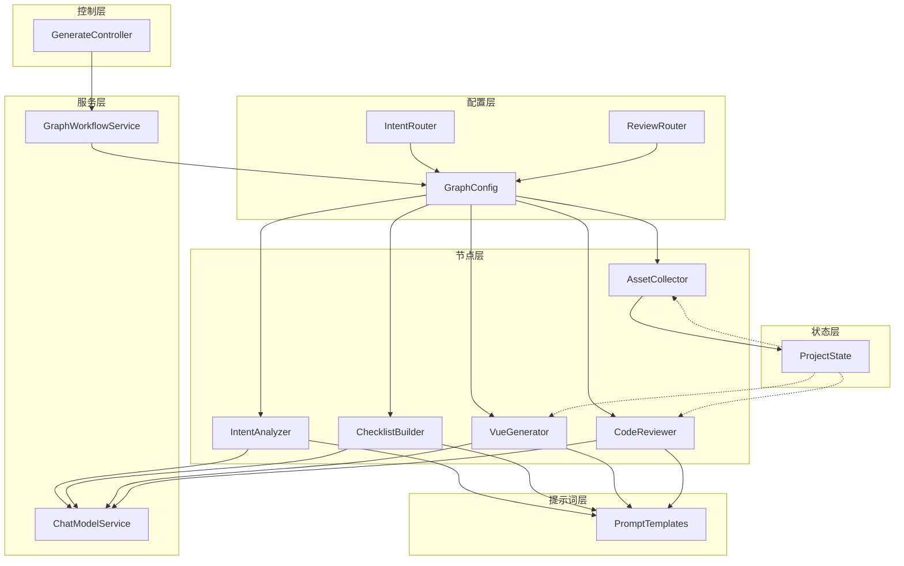
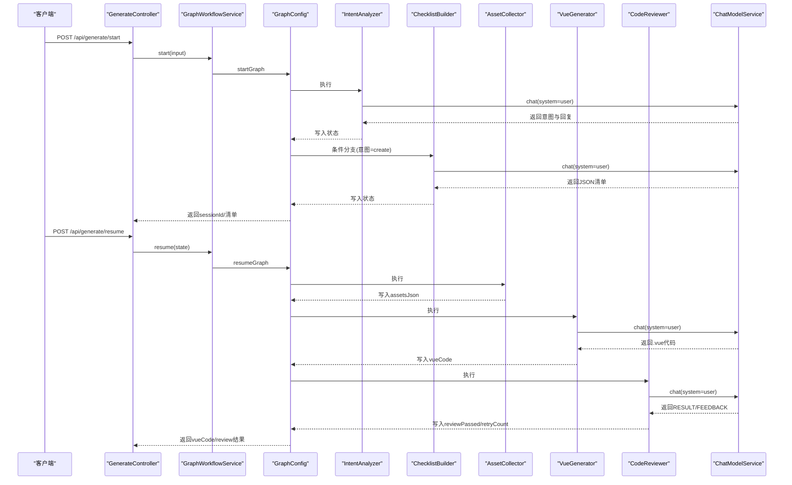
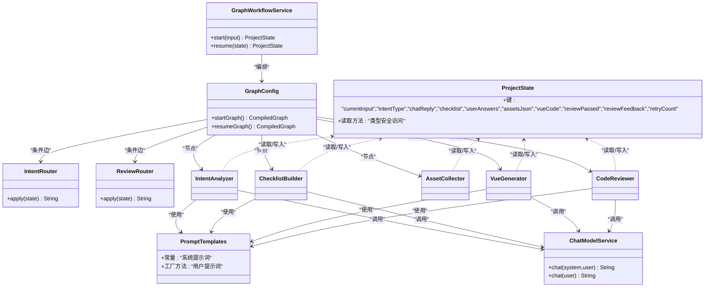

# 提示词工程

<cite>
**本文引用的文件**
- [PromptTemplates.java](file://src/main/java/com/example/websitemother/prompt/PromptTemplates.java)
- [GenerateController.java](file://src/main/java/com/example/websitemother/controller/GenerateController.java)
- [GraphWorkflowService.java](file://src/main/java/com/example/websitemother/service/GraphWorkflowService.java)
- [ChatModelService.java](file://src/main/java/com/example/websitemother/service/ChatModelService.java)
- [ProjectState.java](file://src/main/java/com/example/websitemother/state/ProjectState.java)
- [GraphConfig.java](file://src/main/java/com/example/websitemother/config/GraphConfig.java)
- [IntentRouter.java](file://src/main/java/com/example/websitemother/edge/IntentRouter.java)
- [ReviewRouter.java](file://src/main/java/com/example/websitemother/edge/ReviewRouter.java)
- [IntentAnalyzer.java](file://src/main/java/com/example/websitemother/node/IntentAnalyzer.java)
- [ChecklistBuilder.java](file://src/main/java/com/example/websitemother/node/ChecklistBuilder.java)
- [AssetCollector.java](file://src/main/java/com/example/websitemother/node/AssetCollector.java)
- [VueGenerator.java](file://src/main/java/com/example/websitemother/node/VueGenerator.java)
- [CodeReviewer.java](file://src/main/java/com/example/websitemother/node/CodeReviewer.java)
- [application.yml](file://src/main/resources/application.yml)
- [pom.xml](file://pom.xml)
</cite>

## 目录
1. [简介](#简介)
2. [项目结构](#项目结构)
3. [核心组件](#核心组件)
4. [架构总览](#架构总览)
5. [详细组件分析](#详细组件分析)
6. [依赖关系分析](#依赖关系分析)
7. [性能考量](#性能考量)
8. [故障排查指南](#故障排查指南)
9. [结论](#结论)
10. [附录](#附录)

## 简介
本技术文档围绕 WebsiteMother 的提示词工程系统展开，系统以 LangGraph4j 状态图驱动多节点工作流，结合统一的提示词模板库（PromptTemplates）实现“意图识别 → 需求清单 → 素材收集 → 代码生成 → 代码审查”的闭环。本文重点阐述：
- PromptTemplates 的设计理念、模板组织结构、命名规范与版本管理策略
- 各类提示词模板的设计原则（指令清晰性、上下文完整性、输出格式约束、错误预防）
- 提示词参数化设计（动态变量替换、条件分支、多轮对话支持）
- 提示词优化最佳实践（效果评估、A/B 测试、性能监控）
- 实际提示词示例与改进建议，帮助 AI 系统开发者提升提示词质量与系统表现

## 项目结构
WebsiteMother 采用分层与按职责划分的组织方式：
- 控制层：GenerateController 提供 REST API，负责会话生命周期与状态存储
- 服务层：GraphWorkflowService 封装 LangGraph 工作流执行；ChatModelService 封装 LLM 调用
- 状态层：ProjectState 定义跨节点共享的状态键
- 配置层：GraphConfig 组装 startGraph 与 resumeGraph 两条工作流
- 边缘路由：IntentRouter、ReviewRouter 实现条件分支
- 节点层：各 NodeAction 实现具体业务步骤（意图分析、清单生成、素材收集、代码生成、代码审查）

图表来源
- [GenerateController.java:19-84](file://src/main/java/com/example/websitemother/controller/GenerateController.java#L19-L84)
- [GraphWorkflowService.java:15-58](file://src/main/java/com/example/websitemother/service/GraphWorkflowService.java#L15-L58)
- [GraphConfig.java:28-97](file://src/main/java/com/example/websitemother/config/GraphConfig.java#L28-L97)
- [IntentRouter.java:14-29](file://src/main/java/com/example/websitemother/edge/IntentRouter.java#L14-L29)
- [ReviewRouter.java:15-42](file://src/main/java/com/example/websitemother/edge/ReviewRouter.java#L15-L42)
- [IntentAnalyzer.java:17-60](file://src/main/java/com/example/websitemother/node/IntentAnalyzer.java#L17-L60)
- [ChecklistBuilder.java:17-50](file://src/main/java/com/example/websitemother/node/ChecklistBuilder.java#L17-L50)
- [AssetCollector.java:16-88](file://src/main/java/com/example/websitemother/node/AssetCollector.java#L16-L88)
- [VueGenerator.java:17-63](file://src/main/java/com/example/websitemother/node/VueGenerator.java#L17-L63)
- [CodeReviewer.java:17-60](file://src/main/java/com/example/websitemother/node/CodeReviewer.java#L17-L60)
- [PromptTemplates.java:7-92](file://src/main/java/com/example/websitemother/prompt/PromptTemplates.java#L7-L92)

章节来源
- [GenerateController.java:19-114](file://src/main/java/com/example/websitemother/controller/GenerateController.java#L19-L114)
- [GraphWorkflowService.java:15-58](file://src/main/java/com/example/websitemother/service/GraphWorkflowService.java#L15-L58)
- [GraphConfig.java:28-97](file://src/main/java/com/example/websitemother/config/GraphConfig.java#L28-L97)

## 核心组件
- PromptTemplates：集中管理所有 Agent Node 的提示词模板，提供系统提示词常量与用户提示词工厂方法，便于统一维护与调优
- GraphWorkflowService：封装 startGraph 与 resumeGraph 的执行逻辑，负责状态初始化与工作流推进
- ChatModelService：封装 DashScope Qwen 模型调用，统一组装 SystemMessage 与 UserMessage 并处理异常
- ProjectState：LangGraph 全局状态实体，定义跨节点共享的状态键，提供类型安全的读取方法
- GraphConfig：装配两条工作流图，连接节点与路由条件边
- IntentRouter/ReviewRouter：实现条件分支，分别控制“意图分流”和“审查重试”
- 各 NodeAction：实现具体步骤，如意图分析、清单生成、素材收集、Vue 代码生成、代码审查

章节来源
- [PromptTemplates.java:7-92](file://src/main/java/com/example/websitemother/prompt/PromptTemplates.java#L7-L92)
- [GraphWorkflowService.java:15-58](file://src/main/java/com/example/websitemother/service/GraphWorkflowService.java#L15-L58)
- [ChatModelService.java:19-57](file://src/main/java/com/example/websitemother/service/ChatModelService.java#L19-L57)
- [ProjectState.java:13-77](file://src/main/java/com/example/websitemother/state/ProjectState.java#L13-L77)
- [GraphConfig.java:28-97](file://src/main/java/com/example/websitemother/config/GraphConfig.java#L28-L97)
- [IntentRouter.java:14-29](file://src/main/java/com/example/websitemother/edge/IntentRouter.java#L14-L29)
- [ReviewRouter.java:15-42](file://src/main/java/com/example/websitemother/edge/ReviewRouter.java#L15-L42)

## 架构总览
系统采用“REST API → 工作流引擎 → 大模型调用”的三层架构。控制层接收请求并维护会话状态；服务层编排工作流；节点层通过提示词模板与 LLM 交互；状态在节点间传递，路由根据状态值进行条件跳转。

图表来源
- [GenerateController.java:33-84](file://src/main/java/com/example/websitemother/controller/GenerateController.java#L33-L84)
- [GraphWorkflowService.java:31-57](file://src/main/java/com/example/websitemother/service/GraphWorkflowService.java#L31-L57)
- [GraphConfig.java:51-96](file://src/main/java/com/example/websitemother/config/GraphConfig.java#L51-L96)
- [IntentAnalyzer.java:24-59](file://src/main/java/com/example/websitemother/node/IntentAnalyzer.java#L24-L59)
- [ChecklistBuilder.java:24-49](file://src/main/java/com/example/websitemother/node/ChecklistBuilder.java#L24-L49)
- [AssetCollector.java:22-58](file://src/main/java/com/example/websitemother/node/AssetCollector.java#L22-L58)
- [VueGenerator.java:24-62](file://src/main/java/com/example/websitemother/node/VueGenerator.java#L24-L62)
- [CodeReviewer.java:24-59](file://src/main/java/com/example/websitemother/node/CodeReviewer.java#L24-L59)
- [ChatModelService.java:33-49](file://src/main/java/com/example/websitemother/service/ChatModelService.java#L33-L49)

## 详细组件分析

### PromptTemplates 设计与组织
- 设计理念
  - 集中式管理：将所有 Agent Node 的提示词模板集中于单一类，便于统一维护、版本化与复用
  - 明确职责分离：系统提示词常量与用户提示词工厂方法分离，降低耦合
  - 输出格式约束：为 LLM 输出设定严格格式（如固定前缀、固定换行），便于下游解析
- 模板分类
  - 意图分析：识别用户输入属于闲聊或建站需求
  - 需求清单：生成需用户补充的关键字段清单（JSON 数组）
  - Vue 代码生成：生成完整单文件 Vue 3 组件，约束代码规范与输出格式
  - 代码审查：对生成的 Vue 代码进行合规性审查，输出 RESULT/FEEDBACK
- 命名规范
  - 系统提示词常量：采用全大写 + 下划线，如 INTENT_ANALYZER_SYSTEM、CHECKLIST_BUILDER_SYSTEM 等
  - 用户提示词工厂方法：采用动宾结构，如 intentAnalyzerUser、checklistBuilderUser、vueGeneratorUser、codeReviewerUser
- 版本管理策略
  - 建议：为每个模板增加注释版本号与变更记录；在应用层通过配置项选择模板版本；对关键模板引入灰度发布与回滚策略

章节来源
- [PromptTemplates.java:7-92](file://src/main/java/com/example/websitemother/prompt/PromptTemplates.java#L7-L92)

### 各类提示词模板设计原则
- 指令清晰性
  - 明确角色定位与任务边界，如“意图分析专家”“前端开发专家”“代码审查专家”
  - 使用“请判断/请生成/请审查”等祈使句，减少歧义
- 上下文完整性
  - 在用户提示词中提供必要背景信息（如需求、素材、历史反馈）
  - 对缺失上下文进行兜底（如默认主图、空素材时的处理）
- 输出格式约束
  - 固定前缀与换行，便于正则或行级解析（如 INTENT:、RESULT:、FEEDBACK:）
  - 对 JSON 输出明确去除代码块标记，确保纯 JSON 文本
- 错误预防机制
  - 对异常输出进行清理（去除代码块标记、首尾空白）
  - 对空输入与空结果进行判空与兜底处理

章节来源
- [PromptTemplates.java:13-19](file://src/main/java/com/example/websitemother/prompt/PromptTemplates.java#L13-L19)
- [PromptTemplates.java:27-38](file://src/main/java/com/example/websitemother/prompt/PromptTemplates.java#L27-L38)
- [PromptTemplates.java:46-58](file://src/main/java/com/example/websitemother/prompt/PromptTemplates.java#L46-L58)
- [PromptTemplates.java:76-87](file://src/main/java/com/example/websitemother/prompt/PromptTemplates.java#L76-L87)

### 提示词参数化设计
- 动态变量替换
  - 用户输入：当前输入、用户答案、图片素材 JSON、审查反馈
  - 通过工厂方法将动态内容注入到用户提示词模板中
- 条件分支
  - 意图分流：根据意图类型决定是否进入清单生成
  - 审查重试：根据审查结果与重试次数决定是否循环生成
- 多轮对话支持
  - 通过 ProjectState 传递上下文（如 reviewFeedback），在下一轮生成中针对性修复
  - 控制层维护会话 ID 与内存状态，支持 resume 继续流程

章节来源
- [IntentAnalyzer.java:24-59](file://src/main/java/com/example/websitemother/node/IntentAnalyzer.java#L24-L59)
- [ChecklistBuilder.java:24-49](file://src/main/java/com/example/websitemother/node/ChecklistBuilder.java#L24-L49)
- [AssetCollector.java:22-58](file://src/main/java/com/example/websitemother/node/AssetCollector.java#L22-L58)
- [VueGenerator.java:24-62](file://src/main/java/com/example/websitemother/node/VueGenerator.java#L24-L62)
- [CodeReviewer.java:24-59](file://src/main/java/com/example/websitemother/node/CodeReviewer.java#L24-L59)
- [GenerateController.java:56-84](file://src/main/java/com/example/websitemother/controller/GenerateController.java#L56-L84)

### 提示词优化最佳实践
- 效果评估方法
  - 代码质量指标：是否包含 template/script/style、是否可直接运行、Tailwind 类名是否正确
  - 一致性指标：输出格式是否符合约定（固定前缀、固定换行）
  - 用户满意度：通过人工抽样评估生成结果的可用性与美观度
- A/B 测试策略
  - 对关键模板（如 Vue 生成器）进行多版本对比，随机分配用户流量
  - 指标包括：首次通过率、平均重试次数、人工评分、生成时间
- 性能监控指标
  - LLM 调用耗时、成功率、错误类型分布
  - 工作流执行时延、节点耗时分布、重试次数统计

章节来源
- [ChatModelService.java:33-49](file://src/main/java/com/example/websitemother/service/ChatModelService.java#L33-L49)
- [ReviewRouter.java:22-42](file://src/main/java/com/example/websitemother/edge/ReviewRouter.java#L22-L42)

### 实际提示词示例与改进建议
- 示例路径
  - 意图分析系统提示词：[PromptTemplates.java:13-19](file://src/main/java/com/example/websitemother/prompt/PromptTemplates.java#L13-L19)
  - 需求清单系统提示词：[PromptTemplates.java:27-38](file://src/main/java/com/example/websitemother/prompt/PromptTemplates.java#L27-L38)
  - Vue 生成器系统提示词：[PromptTemplates.java:46-58](file://src/main/java/com/example/websitemother/prompt/PromptTemplates.java#L46-L58)
  - 代码审查系统提示词：[PromptTemplates.java:76-87](file://src/main/java/com/example/websitemother/prompt/PromptTemplates.java#L76-L87)
- 改进建议
  - 引入模板版本号与变更日志，便于追踪与回滚
  - 对 JSON 输出增加 schema 校验，减少下游解析失败
  - 在用户提示词中加入“仅输出目标内容，不包含解释”的约束，提高稳定性
  - 对多轮对话场景，建议在用户提示词中显式声明“请基于上次反馈进行修复”，增强针对性

章节来源
- [PromptTemplates.java:13-19](file://src/main/java/com/example/websitemother/prompt/PromptTemplates.java#L13-L19)
- [PromptTemplates.java:27-38](file://src/main/java/com/example/websitemother/prompt/PromptTemplates.java#L27-L38)
- [PromptTemplates.java:46-58](file://src/main/java/com/example/websitemother/prompt/PromptTemplates.java#L46-L58)
- [PromptTemplates.java:76-87](file://src/main/java/com/example/websitemother/prompt/PromptTemplates.java#L76-L87)

## 依赖关系分析
- 组件耦合与内聚
  - PromptTemplates 与各 NodeAction 高内聚，通过常量与工厂方法解耦
  - GraphConfig 将节点与路由组合为工作流，保持节点内部低耦合
- 直接与间接依赖
  - NodeAction 依赖 ChatModelService 与 PromptTemplates
  - GraphWorkflowService 依赖 LangGraph 编译图与 ProjectState
  - 控制层依赖 GraphWorkflowService 与内存会话存储
- 外部依赖与集成点
  - DashScope Qwen 模型通过 LangChain4j Starter 集成
  - Spring Boot 提供 Web 与配置管理能力

图表来源
- [PromptTemplates.java:7-92](file://src/main/java/com/example/websitemother/prompt/PromptTemplates.java#L7-L92)
- [ChatModelService.java:19-57](file://src/main/java/com/example/websitemother/service/ChatModelService.java#L19-L57)
- [ProjectState.java:13-77](file://src/main/java/com/example/websitemother/state/ProjectState.java#L13-L77)
- [GraphWorkflowService.java:15-58](file://src/main/java/com/example/websitemother/service/GraphWorkflowService.java#L15-L58)
- [GraphConfig.java:28-97](file://src/main/java/com/example/websitemother/config/GraphConfig.java#L28-L97)
- [IntentRouter.java:14-29](file://src/main/java/com/example/websitemother/edge/IntentRouter.java#L14-L29)
- [ReviewRouter.java:15-42](file://src/main/java/com/example/websitemother/edge/ReviewRouter.java#L15-L42)
- [IntentAnalyzer.java:17-60](file://src/main/java/com/example/websitemother/node/IntentAnalyzer.java#L17-L60)
- [ChecklistBuilder.java:17-50](file://src/main/java/com/example/websitemother/node/ChecklistBuilder.java#L17-L50)
- [AssetCollector.java:16-88](file://src/main/java/com/example/websitemother/node/AssetCollector.java#L16-L88)
- [VueGenerator.java:17-63](file://src/main/java/com/example/websitemother/node/VueGenerator.java#L17-L63)
- [CodeReviewer.java:17-60](file://src/main/java/com/example/websitemother/node/CodeReviewer.java#L17-L60)

章节来源
- [pom.xml:33-58](file://pom.xml#L33-L58)
- [application.yml:4-8](file://src/main/resources/application.yml#L4-L8)

## 性能考量
- LLM 调用开销
  - 通过 ChatModelService 统一封装消息组装与异常处理，避免重复逻辑
  - 建议对高频调用增加缓存与限流策略，防止突发流量压垮模型服务
- 工作流执行效率
  - 优先使用异步节点 Action（node_async）提升并发能力
  - 合理设置重试上限（默认 3 次）与退避策略，避免无限循环
- 状态传递与序列化
  - ProjectState 作为轻量 Map 包装，避免复杂对象频繁序列化
  - 控制层使用内存会话存储（演示用途），生产环境建议迁移到 Redis

章节来源
- [ChatModelService.java:33-49](file://src/main/java/com/example/websitemother/service/ChatModelService.java#L33-L49)
- [GraphConfig.java:21-22](file://src/main/java/com/example/websitemother/config/GraphConfig.java#L21-L22)
- [ReviewRouter.java:20-21](file://src/main/java/com/example/websitemother/edge/ReviewRouter.java#L20-L21)
- [GenerateController.java:27-28](file://src/main/java/com/example/websitemother/controller/GenerateController.java#L27-L28)

## 故障排查指南
- LLM 调用异常
  - 现象：调用失败抛出异常
  - 排查：检查 API Key 与模型名称配置；查看日志中的错误堆栈
  - 参考：[application.yml:4-8](file://src/main/resources/application.yml#L4-L8)，[ChatModelService.java:45-48](file://src/main/java/com/example/websitemother/service/ChatModelService.java#L45-L48)
- 工作流执行失败
  - 现象：startGraph/resumeGraph 抛出异常
  - 排查：确认 LangGraph 编译图构建成功；检查节点 Action 是否抛出异常
  - 参考：[GraphWorkflowService.java:37-39](file://src/main/java/com/example/websitemother/service/GraphWorkflowService.java#L37-L39)，[GraphWorkflowService.java:54-56](file://src/main/java/com/example/websitemother/service/GraphWorkflowService.java#L54-L56)
- 审查未通过导致循环
  - 现象：超过最大重试次数仍未通过
  - 排查：检查审查反馈内容与重试计数；确认用户输入是否足够明确
  - 参考：[ReviewRouter.java:34-41](file://src/main/java/com/example/websitemother/edge/ReviewRouter.java#L34-L41)，[CodeReviewer.java:36-48](file://src/main/java/com/example/websitemother/node/CodeReviewer.java#L36-L48)
- 输出格式异常
  - 现象：JSON/代码块标记未清理导致解析失败
  - 排查：确认下游解析前已移除代码块标记
  - 参考：[ChecklistBuilder.java:34-44](file://src/main/java/com/example/websitemother/node/ChecklistBuilder.java#L34-L44)，[VueGenerator.java:47-57](file://src/main/java/com/example/websitemother/node/VueGenerator.java#L47-L57)

章节来源
- [application.yml:4-8](file://src/main/resources/application.yml#L4-L8)
- [ChatModelService.java:45-48](file://src/main/java/com/example/websitemother/service/ChatModelService.java#L45-L48)
- [GraphWorkflowService.java:37-39](file://src/main/java/com/example/websitemother/service/GraphWorkflowService.java#L37-L39)
- [GraphWorkflowService.java:54-56](file://src/main/java/com/example/websitemother/service/GraphWorkflowService.java#L54-L56)
- [ReviewRouter.java:34-41](file://src/main/java/com/example/websitemother/edge/ReviewRouter.java#L34-L41)
- [CodeReviewer.java:36-48](file://src/main/java/com/example/websitemother/node/CodeReviewer.java#L36-L48)
- [ChecklistBuilder.java:34-44](file://src/main/java/com/example/websitemother/node/ChecklistBuilder.java#L34-L44)
- [VueGenerator.java:47-57](file://src/main/java/com/example/websitemother/node/VueGenerator.java#L47-L57)

## 结论
WebsiteMother 的提示词工程系统通过 PromptTemplates 将提示词标准化、参数化与版本化，结合 LangGraph4j 的工作流编排，实现了从意图识别到代码生成的自动化闭环。建议在现有基础上进一步完善模板版本管理、输出格式校验与 A/B 测试体系，持续提升生成质量与用户体验。

## 附录
- 关键配置项
  - DashScope API Key 与模型名称：[application.yml:4-8](file://src/main/resources/application.yml#L4-L8)
- 依赖与版本
  - Spring Boot、LangChain4j DashScope Starter、LangGraph4j Core：[pom.xml:33-58](file://pom.xml#L33-L58)