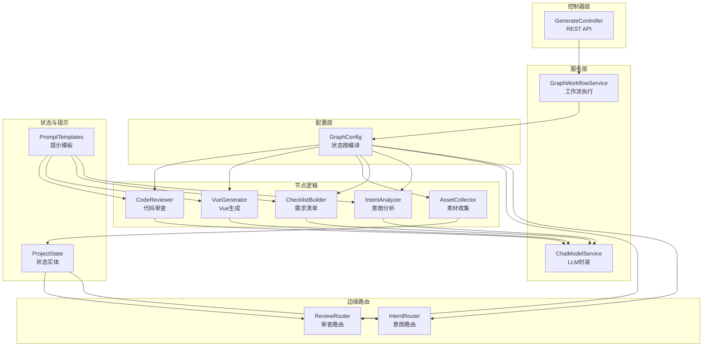
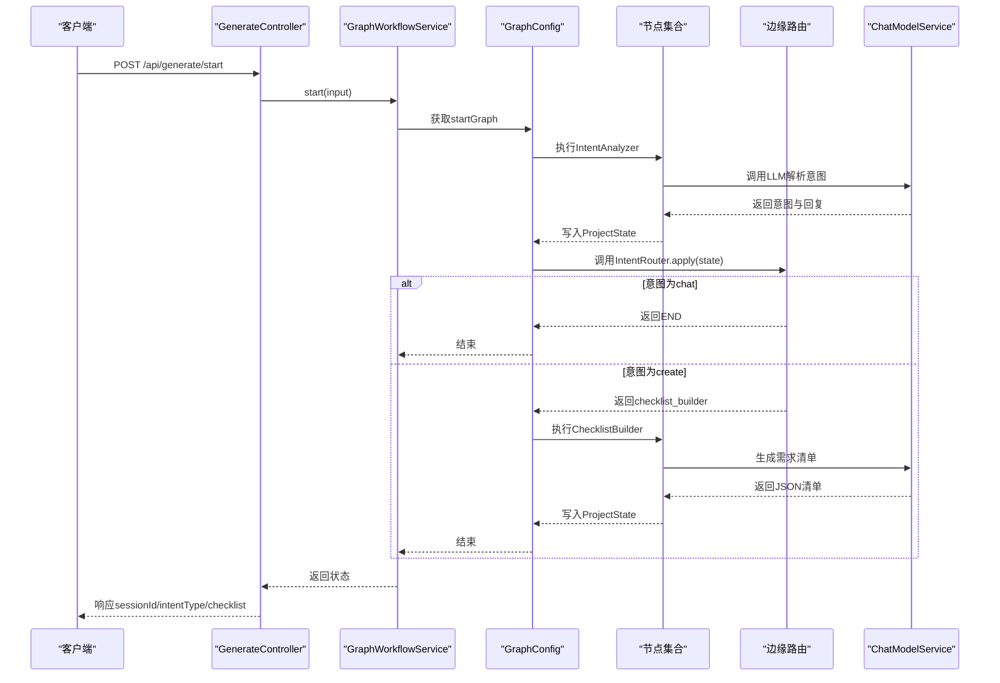
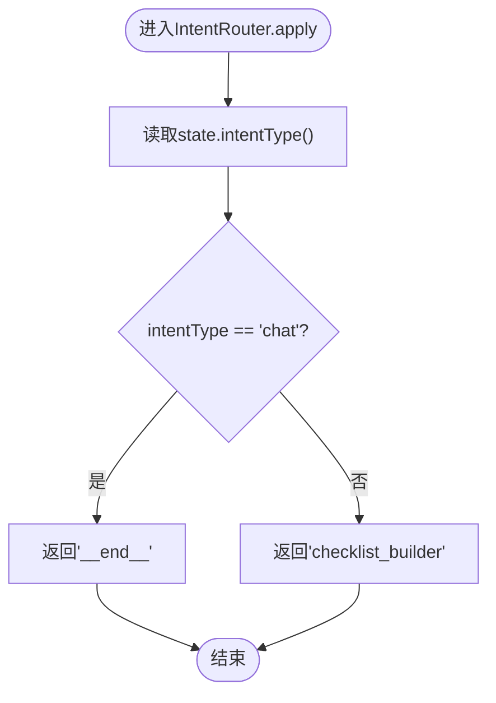
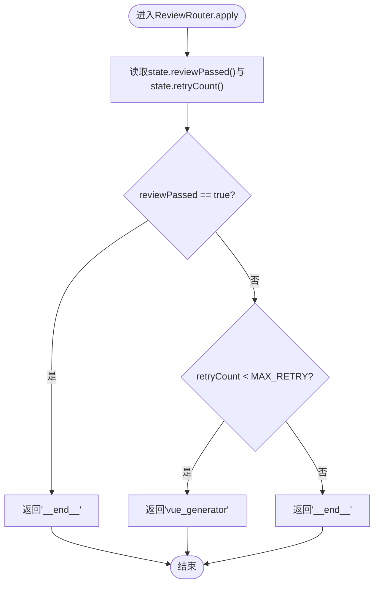
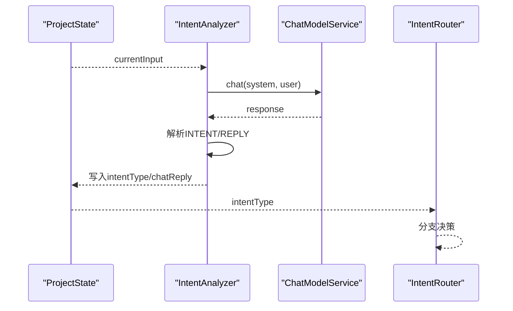
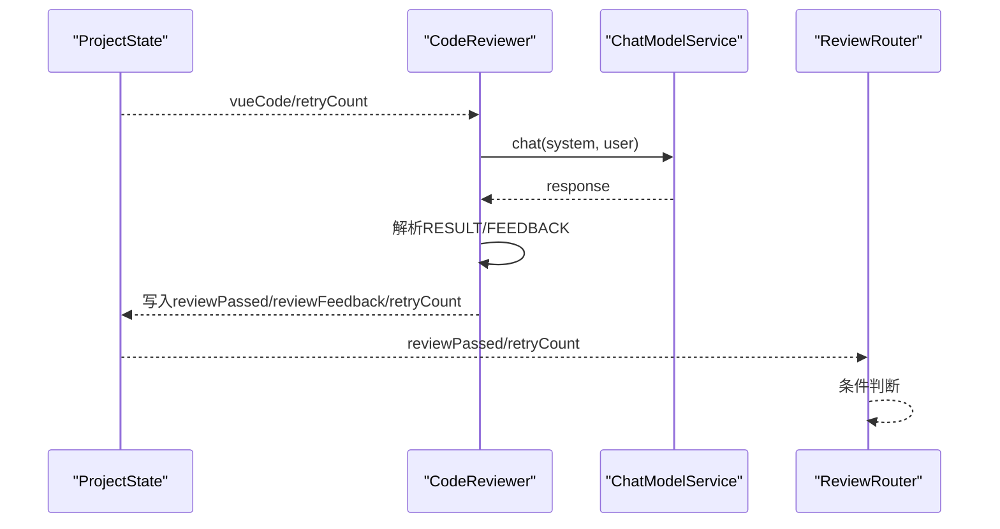
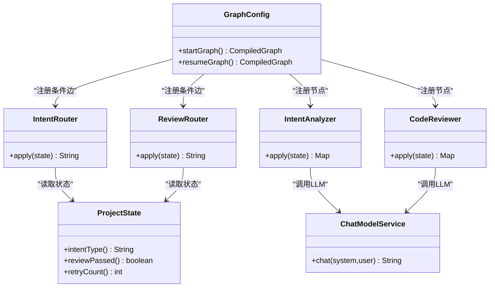

# 边缘路由控制

<cite>
**本文档引用的文件**
- [IntentRouter.java](file://src/main/java/com/example/websitemother/edge/IntentRouter.java)
- [ReviewRouter.java](file://src/main/java/com/example/websitemother/edge/ReviewRouter.java)
- [IntentAnalyzer.java](file://src/main/java/com/example/websitemother/node/IntentAnalyzer.java)
- [CodeReviewer.java](file://src/main/java/com/example/websitemother/node/CodeReviewer.java)
- [ProjectState.java](file://src/main/java/com/example/websitemother/state/ProjectState.java)
- [PromptTemplates.java](file://src/main/java/com/example/websitemother/prompt/PromptTemplates.java)
- [ChatModelService.java](file://src/main/java/com/example/websitemother/service/ChatModelService.java)
- [GenerateController.java](file://src/main/java/com/example/websitemother/controller/GenerateController.java)
- [GraphWorkflowService.java](file://src/main/java/com/example/websitemother/service/GraphWorkflowService.java)
- [GraphConfig.java](file://src/main/java/com/example/websitemother/config/GraphConfig.java)
- [application.yml](file://src/main/resources/application.yml)
</cite>

## 目录
1. [简介](#简介)
2. [项目结构](#项目结构)
3. [核心组件](#核心组件)
4. [架构总览](#架构总览)
5. [详细组件分析](#详细组件分析)
6. [依赖关系分析](#依赖关系分析)
7. [性能考虑](#性能考虑)
8. [故障排除指南](#故障排除指南)
9. [结论](#结论)
10. [附录](#附录)

## 简介
本技术文档聚焦于WebsiteMother项目的边缘路由控制系统，系统采用LangGraph4j构建状态图工作流，通过“意图路由”和“代码审查路由”两大边缘条件边实现智能分流与循环控制。本文将深入解析：
- IntentRouter的意图分类逻辑（用户输入预处理、意图识别规则、分支决策）
- ReviewRouter的代码审查反馈处理流程（结果解读、问题分类、重试策略）
- 边缘路由的条件判断算法（阈值设置、权重计算、动态调整）
- 路由决策对整体工作流的影响（状态转换、节点选择、流程重定向）
- 路由规则配置指南、性能优化建议与调试技巧
- 实际路由决策示例与异常处理策略

## 项目结构
项目采用分层与按功能域组织的结构，核心路由控制位于edge包，工作流编排在config包，节点逻辑在node包，状态与提示词在state与prompt包，服务层封装LLM调用与工作流执行，控制器对外提供REST API。

图表来源
- [GraphConfig.java:52-96](file://src/main/java/com/example/websitemother/config/GraphConfig.java#L52-L96)
- [GenerateController.java:33-84](file://src/main/java/com/example/websitemother/controller/GenerateController.java#L33-L84)
- [GraphWorkflowService.java:31-58](file://src/main/java/com/example/websitemother/service/GraphWorkflowService.java#L31-L58)

章节来源
- [GraphConfig.java:52-96](file://src/main/java/com/example/websitemother/config/GraphConfig.java#L52-L96)
- [GenerateController.java:33-84](file://src/main/java/com/example/websitemother/controller/GenerateController.java#L33-L84)

## 核心组件
- 边缘路由组件
  - IntentRouter：根据ProjectState中的intentType决定下一步流向“聊天结束”或“清单生成”
  - ReviewRouter：根据reviewPassed与retryCount决定结束或回退到VueGenerator重试
- 节点组件
  - IntentAnalyzer：调用LLM解析用户输入意图，产出intentType与chatReply
  - CodeReviewer：调用LLM审查Vue代码，产出reviewPassed与reviewFeedback，并递增retryCount
- 状态与提示
  - ProjectState：统一的状态键值访问器，提供类型安全的读取方法
  - PromptTemplates：集中管理各节点的系统提示词与用户提示词模板
- 服务与配置
  - ChatModelService：封装DashScope Qwen模型调用
  - GraphWorkflowService：封装startGraph与resumeGraph的执行
  - GraphConfig：构建两阶段工作流图，注册节点与边缘路由

章节来源
- [IntentRouter.java:15-30](file://src/main/java/com/example/websitemother/edge/IntentRouter.java#L15-L30)
- [ReviewRouter.java:16-42](file://src/main/java/com/example/websitemother/edge/ReviewRouter.java#L16-L42)
- [IntentAnalyzer.java:19-60](file://src/main/java/com/example/websitemother/node/IntentAnalyzer.java#L19-L60)
- [CodeReviewer.java:19-60](file://src/main/java/com/example/websitemother/node/CodeReviewer.java#L19-L60)
- [ProjectState.java:13-77](file://src/main/java/com/example/websitemother/state/ProjectState.java#L13-L77)
- [PromptTemplates.java:7-92](file://src/main/java/com/example/websitemother/prompt/PromptTemplates.java#L7-L92)
- [ChatModelService.java:21-57](file://src/main/java/com/example/websitemother/service/ChatModelService.java#L21-L57)
- [GraphWorkflowService.java:17-58](file://src/main/java/com/example/websitemother/service/GraphWorkflowService.java#L17-L58)
- [GraphConfig.java:32-96](file://src/main/java/com/example/websitemother/config/GraphConfig.java#L32-L96)

## 架构总览
系统通过GraphConfig装配两条工作流：
- startGraph：用户输入经IntentAnalyzer解析意图，再由IntentRouter根据intentType分流至END或ChecklistBuilder
- resumeGraph：AssetCollector收集素材，VueGenerator生成代码，CodeReviewer审查，ReviewRouter根据结果循环或结束

图表来源
- [GenerateController.java:33-51](file://src/main/java/com/example/websitemother/controller/GenerateController.java#L33-L51)
- [GraphWorkflowService.java:31-41](file://src/main/java/com/example/websitemother/service/GraphWorkflowService.java#L31-L41)
- [GraphConfig.java:52-70](file://src/main/java/com/example/websitemother/config/GraphConfig.java#L52-L70)
- [IntentRouter.java:20-29](file://src/main/java/com/example/websitemother/edge/IntentRouter.java#L20-L29)
- [IntentAnalyzer.java:25-59](file://src/main/java/com/example/websitemother/node/IntentAnalyzer.java#L25-L59)
- [ChecklistBuilder.java:25-49](file://src/main/java/com/example/websitemother/node/ChecklistBuilder.java#L25-L49)

## 详细组件分析

### IntentRouter：意图分类与分支决策
- 输入来源：ProjectState中的intentType
- 决策规则：
  - intentType为"chat"：返回END（结束工作流）
  - 其他情况：返回"checklist_builder"（进入清单生成阶段）
- 日志与可观测性：记录当前intentType与分支选择
- 复杂度：O(1)，常量时间分支

图表来源
- [IntentRouter.java:20-29](file://src/main/java/com/example/websitemother/edge/IntentRouter.java#L20-L29)

章节来源
- [IntentRouter.java:15-30](file://src/main/java/com/example/websitemother/edge/IntentRouter.java#L15-L30)
- [ProjectState.java:34-36](file://src/main/java/com/example/websitemother/state/ProjectState.java#L34-L36)

### ReviewRouter：代码审查反馈处理
- 输入来源：ProjectState中的reviewPassed与retryCount
- 决策规则：
  - reviewPassed为true：返回END（结束工作流）
  - retryCount小于最大重试次数（默认3）：返回"vue_generator"（循环重试）
  - retryCount达到或超过最大重试次数：返回END（失败结束）
- 日志与可观测性：记录审查结果与重试计数，区分通过、重试与失败
- 复杂度：O(1)，常量时间判断

图表来源
- [ReviewRouter.java:22-41](file://src/main/java/com/example/websitemother/edge/ReviewRouter.java#L22-L41)

章节来源
- [ReviewRouter.java:16-42](file://src/main/java/com/example/websitemother/edge/ReviewRouter.java#L16-L42)
- [ProjectState.java:59-76](file://src/main/java/com/example/websitemother/state/ProjectState.java#L59-L76)

### IntentAnalyzer：用户输入预处理与意图识别
- 预处理：从ProjectState读取currentInput
- LLM调用：使用PromptTemplates.INTENT_ANALYZER_SYSTEM与用户输入模板
- 结果解析：严格解析"INTENT:"与"REPLY:"行，intentType支持"create"关键字匹配，chatReply为空或"null"时置为null
- 输出：写入ProjectState.INTENT_TYPE与ProjectState.CHAT_REPLY
- 复杂度：O(n)（按行解析），n为LLM响应行数

图表来源
- [IntentAnalyzer.java:25-59](file://src/main/java/com/example/websitemother/node/IntentAnalyzer.java#L25-L59)
- [PromptTemplates.java:13-23](file://src/main/java/com/example/websitemother/prompt/PromptTemplates.java#L13-L23)
- [IntentRouter.java:20-29](file://src/main/java/com/example/websitemother/edge/IntentRouter.java#L20-L29)

章节来源
- [IntentAnalyzer.java:19-60](file://src/main/java/com/example/websitemother/node/IntentAnalyzer.java#L19-L60)
- [PromptTemplates.java:13-23](file://src/main/java/com/example/websitemother/prompt/PromptTemplates.java#L13-L23)
- [ProjectState.java:30-40](file://src/main/java/com/example/websitemother/state/ProjectState.java#L30-L40)

### CodeReviewer：审查结果解读与后续处理
- 输入：vueCode与retryCount
- LLM调用：使用PromptTemplates.CODE_REVIEWER_SYSTEM与代码模板
- 结果解析：严格解析"RESULT:"（包含"PASS"即视为通过）、"FEEDBACK:"
- 状态更新：设置reviewPassed、reviewFeedback，并将retryCount加1
- 复杂度：O(m)（按行解析），m为LLM响应行数

图表来源
- [CodeReviewer.java:24-59](file://src/main/java/com/example/websitemother/node/CodeReviewer.java#L24-L59)
- [PromptTemplates.java:76-91](file://src/main/java/com/example/websitemother/prompt/PromptTemplates.java#L76-L91)
- [ReviewRouter.java:22-41](file://src/main/java/com/example/websitemother/edge/ReviewRouter.java#L22-L41)

章节来源
- [CodeReviewer.java:19-60](file://src/main/java/com/example/websitemother/node/CodeReviewer.java#L19-L60)
- [PromptTemplates.java:76-91](file://src/main/java/com/example/websitemother/prompt/PromptTemplates.java#L76-L91)
- [ProjectState.java:59-76](file://src/main/java/com/example/websitemother/state/ProjectState.java#L59-L76)

### 边缘路由条件判断算法
- 阈值设置：
  - 意图路由：基于intentType字符串比较，无动态阈值
  - 审查路由：MAX_RETRY=3，作为重试上限阈值
- 权重计算：本项目未实现权重计算，采用固定阈值与简单布尔判断
- 动态调整机制：当前版本未实现动态阈值调整，可在ReviewRouter中扩展为可配置参数或基于历史统计的自适应阈值

章节来源
- [IntentRouter.java:25-28](file://src/main/java/com/example/websitemother/edge/IntentRouter.java#L25-L28)
- [ReviewRouter.java:18-20](file://src/main/java/com/example/websitemother/edge/ReviewRouter.java#L18-L20)

### 路由决策对整体工作流的影响
- 状态转换触发：
  - IntentRouter：将状态从"意图分析"转换为"聊天结束"或"清单生成"
  - ReviewRouter：将状态在"代码审查"与"Vue生成"之间循环，直至通过或达到最大重试
- 节点选择：GraphConfig根据条件边选择下一节点
- 流程重定向：当retryCount不足且审查未通过时，ReviewRouter将流程重定向回VueGenerator

章节来源
- [GraphConfig.java:59-66](file://src/main/java/com/example/websitemother/config/GraphConfig.java#L59-L66)
- [GraphConfig.java:87-94](file://src/main/java/com/example/websitemother/config/GraphConfig.java#L87-L94)

## 依赖关系分析
- 组件耦合
  - GraphConfig依赖所有节点与边缘路由组件，负责组装工作流
  - EdgeAction接口被IntentRouter与ReviewRouter实现，解耦了路由逻辑与工作流编排
  - ProjectState作为共享状态载体，被所有节点与路由读取
- 外部依赖
  - ChatModelService封装DashScope Qwen模型调用
  - LangGraph4j提供状态图编译与执行能力

图表来源
- [GraphConfig.java:32-96](file://src/main/java/com/example/websitemother/config/GraphConfig.java#L32-L96)
- [IntentRouter.java:15-30](file://src/main/java/com/example/websitemother/edge/IntentRouter.java#L15-L30)
- [ReviewRouter.java:16-42](file://src/main/java/com/example/websitemother/edge/ReviewRouter.java#L16-L42)
- [IntentAnalyzer.java:19-60](file://src/main/java/com/example/websitemother/node/IntentAnalyzer.java#L19-L60)
- [CodeReviewer.java:19-60](file://src/main/java/com/example/websitemother/node/CodeReviewer.java#L19-L60)
- [ProjectState.java:13-77](file://src/main/java/com/example/websitemother/state/ProjectState.java#L13-L77)
- [ChatModelService.java:21-57](file://src/main/java/com/example/websitemother/service/ChatModelService.java#L21-L57)

## 性能考虑
- LLM调用成本
  - ChatModelService对Qwen模型的调用为同步阻塞，建议在高并发场景下引入异步队列或连接池配置
  - PromptTemplates中模板长度与复杂度直接影响响应时间，建议定期评估与精简
- 状态读写开销
  - ProjectState提供类型安全的读取方法，避免频繁类型转换；建议在节点内部缓存必要字段以减少重复解析
- 工作流编译
  - GraphConfig仅在应用启动时编译一次，运行时复用CompiledGraph，降低运行时开销
- 重试策略
  - ReviewRouter的MAX_RETRY=3，建议结合业务SLA与LLM稳定性动态调整

[本节为通用性能建议，不直接分析特定文件]

## 故障排除指南
- LLM调用异常
  - ChatModelService在捕获异常时记录错误日志并抛出RuntimeException，建议在上层控制器中捕获并返回友好的错误信息
- 会话状态丢失
  - GenerateController使用内存级ConcurrentHashMap存储会话，生产环境需替换为Redis等持久化存储
- 审查循环无进展
  - 若retryCount持续增加但reviewPassed始终为false，检查CodeReviewer的解析逻辑与PromptTemplates的审查标准
- 意图识别偏差
  - 若IntentAnalyzer输出与预期不符，检查PromptTemplates.INTENT_ANALYZER_SYSTEM的格式要求与解析逻辑

章节来源
- [ChatModelService.java:45-49](file://src/main/java/com/example/websitemother/service/ChatModelService.java#L45-L49)
- [GenerateController.java:62-64](file://src/main/java/com/example/websitemother/controller/GenerateController.java#L62-L64)
- [CodeReviewer.java:39-48](file://src/main/java/com/example/websitemother/node/CodeReviewer.java#L39-L48)
- [IntentAnalyzer.java:37-51](file://src/main/java/com/example/websitemother/node/IntentAnalyzer.java#L37-L51)

## 结论
WebsiteMother的边缘路由控制系统通过IntentRouter与ReviewRouter实现了清晰的意图分流与审查循环控制。系统采用LangGraph4j的状态图模式，将路由逻辑与节点执行解耦，具备良好的可维护性与扩展性。建议在生产环境中增强会话持久化、引入异步LLM调用与动态阈值调整机制，以进一步提升稳定性与性能。

[本节为总结性内容，不直接分析特定文件]

## 附录

### 路由规则配置指南
- 意图路由
  - 通过修改IntentRouter的分支条件可扩展更多意图类型（如"help"、"demo"等）
  - 建议在ProjectState中新增意图枚举常量以提高可读性
- 审查路由
  - MAX_RETRY可通过构造函数注入或配置文件参数化，以适配不同项目质量要求
  - 可扩展ReviewRouter以支持多轮反馈与问题分级（如致命错误、警告、建议）

章节来源
- [IntentRouter.java:17-29](file://src/main/java/com/example/websitemother/edge/IntentRouter.java#L17-L29)
- [ReviewRouter.java:18-20](file://src/main/java/com/example/websitemother/edge/ReviewRouter.java#L18-L20)

### 实际路由决策示例
- 示例1：用户输入为闲聊
  - IntentAnalyzer输出intentType="chat"，IntentRouter返回END，工作流结束
- 示例2：用户输入为建站需求
  - IntentAnalyzer输出intentType="create"，IntentRouter进入ChecklistBuilder，生成需求清单
- 示例3：代码审查未通过且retryCount<3
  - ReviewRouter返回"vue_generator"，进入循环重试
- 示例4：达到最大重试次数
  - ReviewRouter返回END，工作流以失败结束

章节来源
- [IntentRouter.java:25-28](file://src/main/java/com/example/websitemother/edge/IntentRouter.java#L25-L28)
- [ReviewRouter.java:29-41](file://src/main/java/com/example/websitemother/edge/ReviewRouter.java#L29-L41)

### 调试技巧
- 启用DEBUG日志
  - ChatModelService记录LLM响应文本，便于验证提示词与输出格式
- 使用单元测试
  - 为EdgeAction实现编写断言测试，验证不同状态下的分支选择
- 状态快照
  - 在关键节点输出ProjectState的关键字段，便于定位状态流转问题

章节来源
- [ChatModelService.java:43](file://src/main/java/com/example/websitemother/service/ChatModelService.java#L43)
- [GraphConfig.java:52-96](file://src/main/java/com/example/websitemother/config/GraphConfig.java#L52-L96)