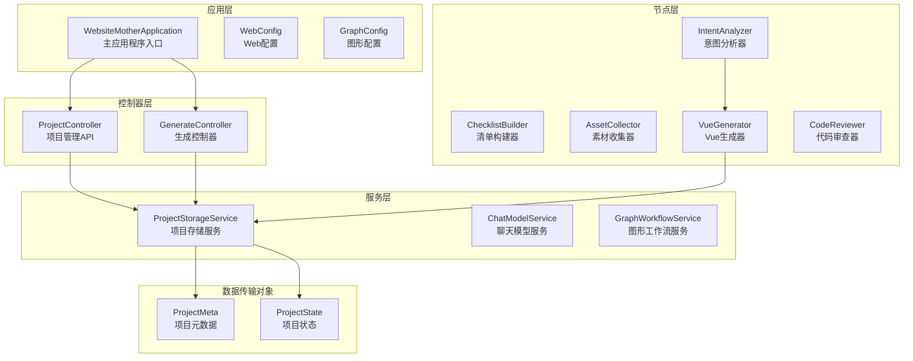
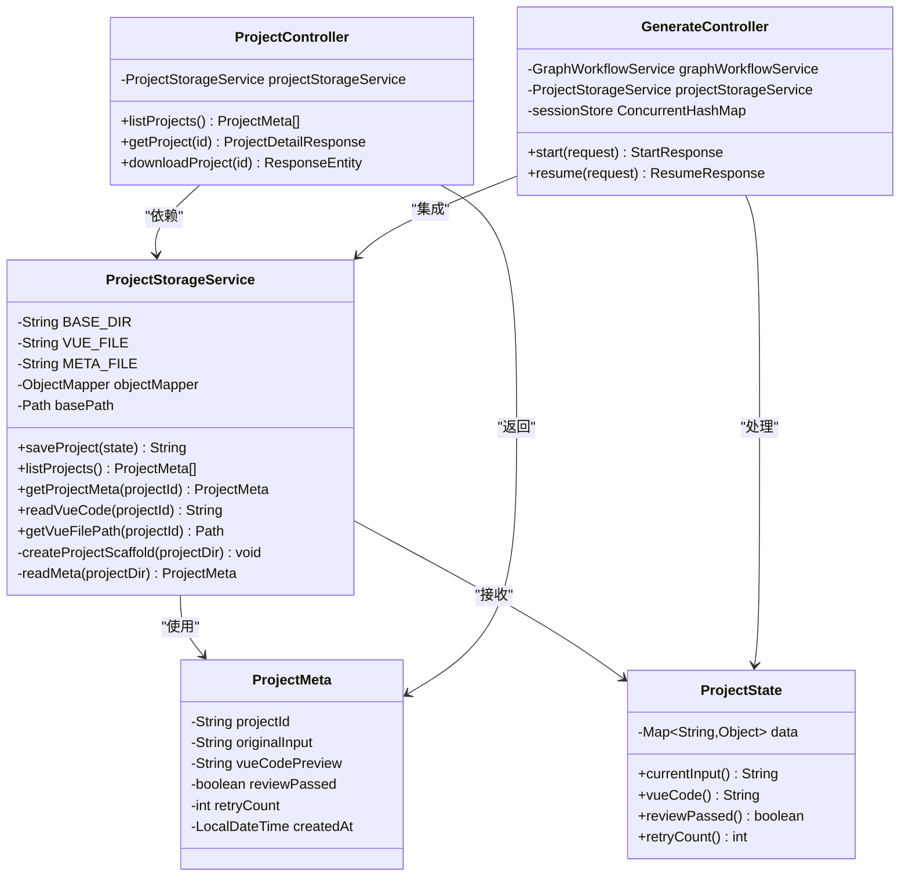
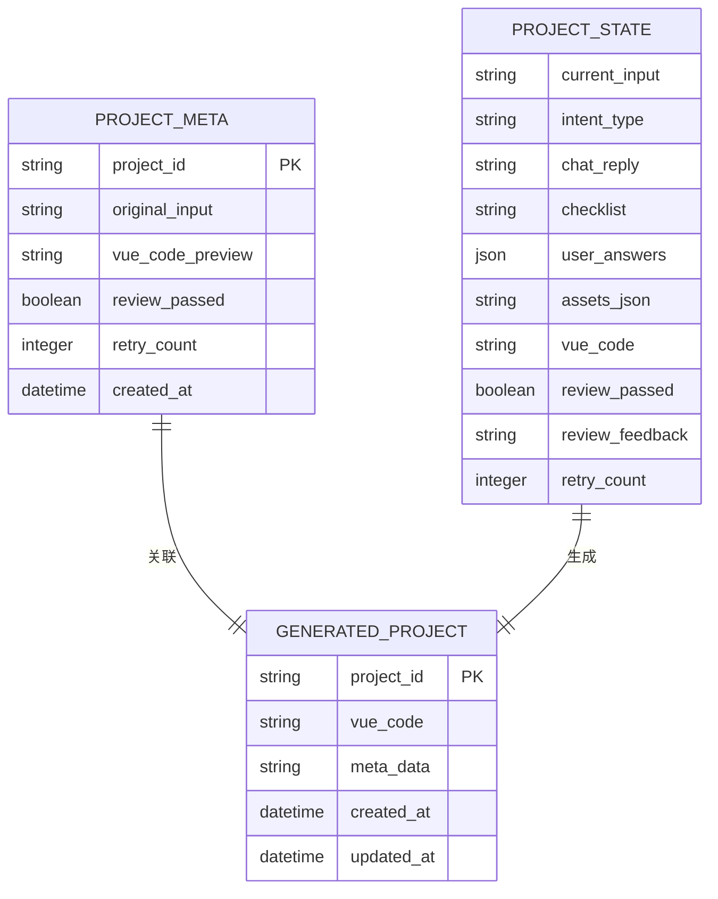
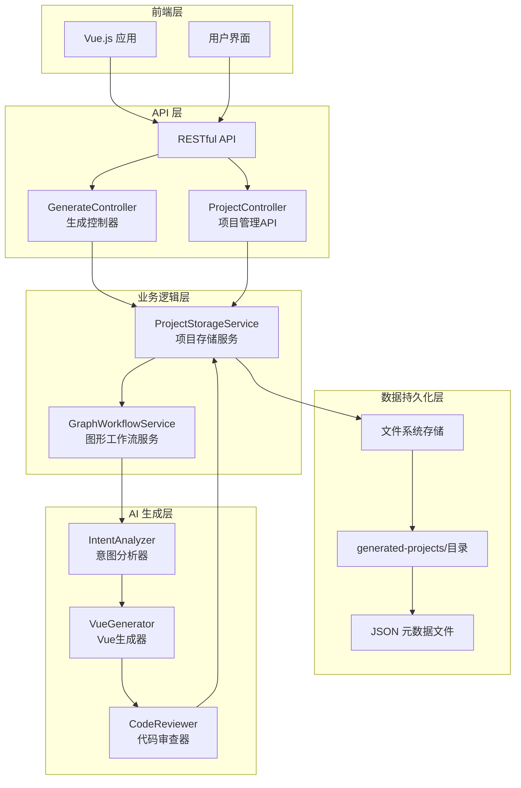
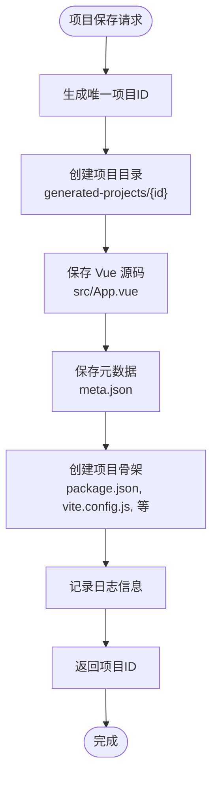
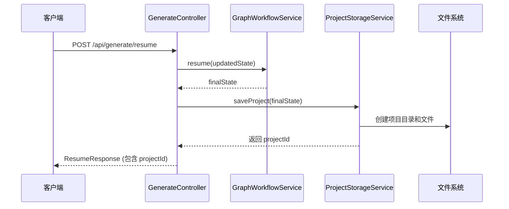
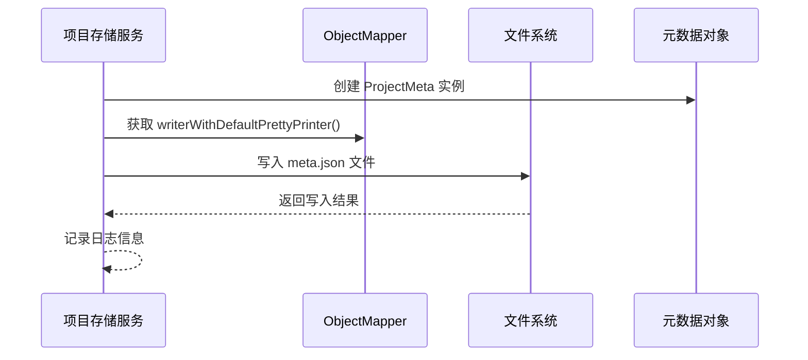
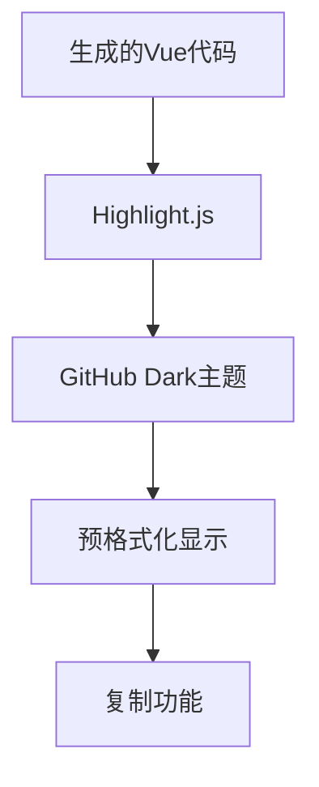
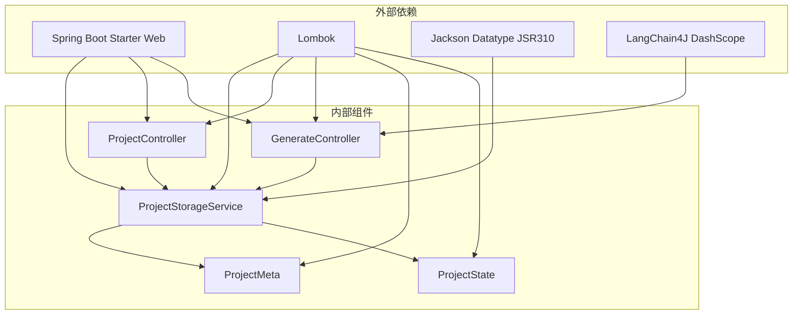

# 项目存储服务

<cite>
**本文档引用的文件**
- [ProjectStorageService.java](file://src/main/java/com/example/websitemother/service/ProjectStorageService.java)
- [ProjectMeta.java](file://src/main/java/com/example/websitemother/dto/ProjectMeta.java)
- [ProjectController.java](file://src/main/java/com/example/websitemother/controller/ProjectController.java)
- [GenerateController.java](file://src/main/java/com/example/websitemother/controller/GenerateController.java)
- [ProjectState.java](file://src/main/java/com/example/websitemother/state/ProjectState.java)
- [application.yml](file://src/main/resources/application.yml)
- [WebsiteMotherApplication.java](file://src/main/java/com/example/websitemother/WebsiteMotherApplication.java)
- [pom.xml](file://pom.xml)
- [meta.json](file://generated-projects/00ea7a70-313f-4163-99d8-5537435494ea/meta.json)
- [package.json](file://generated-projects/00ea7a70-313f-4163-99d8-5537435494ea/package.json)
- [vite.config.js](file://generated-projects/00ea7a70-313f-4163-99d8-5537435494ea/vite.config.js)
- [frontend/package.json](file://frontend/package.json)
- [frontend/vite.config.js](file://frontend/vite.config.js)
- [frontend/src/App.vue](file://frontend/src/App.vue)
- [workflow.mmd](file://workflow.mmd)
</cite>

## 更新摘要
**变更内容**
- 新增完整的项目存储服务实现 (235行)
- 新增项目管理API控制器 (89行)
- **新增生成控制器集成ProjectStorageService**，自动保存生成的Vue项目并在响应中返回项目ID
- 增强前端App.vue的交互体验和代码高亮功能
- 完善项目骨架创建和文件管理系统
- 新增RESTful API端点支持项目管理和下载

## 目录
1. [简介](#简介)
2. [项目结构](#项目结构)
3. [核心组件](#核心组件)
4. [架构概览](#架构概览)
5. [详细组件分析](#详细组件分析)
6. [依赖关系分析](#依赖关系分析)
7. [性能考虑](#性能考虑)
8. [故障排除指南](#故障排除指南)
9. [结论](#结论)

## 简介

项目存储服务是 WebsiteMother 项目的核心组件之一，负责管理和持久化生成的 Vue.js 项目。该服务实现了完整的项目生命周期管理，包括项目创建、元数据管理、文件系统操作以及 RESTful API 接口提供。系统采用 Spring Boot 构建，支持实时项目监控和下载功能，为用户提供完整的网站生成解决方案。

**更新** 新增了完整的项目存储服务实现，支持项目骨架创建、元数据管理和RESTful API接口。**生成控制器现已集成ProjectStorageService，实现了自动化的项目持久化流程**。

## 项目结构

WebsiteMother 项目采用标准的 Spring Boot 项目结构，主要分为以下几个层次：

**图表来源**
- [WebsiteMotherApplication.java:1-14](file://src/main/java/com/example/websitemother/WebsiteMotherApplication.java#L1-L14)
- [ProjectController.java:1-90](file://src/main/java/com/example/websitemother/controller/ProjectController.java#L1-L90)
- [GenerateController.java:1-131](file://src/main/java/com/example/websitemother/controller/GenerateController.java#L1-L131)
- [ProjectStorageService.java:1-235](file://src/main/java/com/example/websitemother/service/ProjectStorageService.java#L1-L235)

**章节来源**
- [pom.xml:1-115](file://pom.xml#L1-L115)
- [application.yml:1-11](file://src/main/resources/application.yml#L1-L11)

## 核心组件

### 项目存储服务架构

项目存储服务是整个系统的核心持久化组件，采用以下设计模式：

**图表来源**
- [ProjectStorageService.java:26-235](file://src/main/java/com/example/websitemother/service/ProjectStorageService.java#L26-L235)
- [ProjectMeta.java:10-19](file://src/main/java/com/example/websitemother/dto/ProjectMeta.java#L10-L19)
- [ProjectState.java:13-78](file://src/main/java/com/example/websitemother/state/ProjectState.java#L13-L78)
- [ProjectController.java:24-90](file://src/main/java/com/example/websitemother/controller/ProjectController.java#L24-L90)
- [GenerateController.java:24-131](file://src/main/java/com/example/websitemother/controller/GenerateController.java#L24-L131)

### 数据模型设计

项目存储服务使用了清晰的数据模型设计，确保数据的一致性和完整性：

**图表来源**
- [ProjectMeta.java:11-18](file://src/main/java/com/example/websitemother/dto/ProjectMeta.java#L11-L18)
- [ProjectState.java:15-25](file://src/main/java/com/example/websitemother/state/ProjectState.java#L15-L25)

**章节来源**
- [ProjectStorageService.java:22-48](file://src/main/java/com/example/websitemother/service/ProjectStorageService.java#L22-L48)
- [ProjectMeta.java:7-19](file://src/main/java/com/example/websitemother/dto/ProjectMeta.java#L7-L19)

## 架构概览

项目存储服务在整个系统架构中扮演着关键角色，连接了前端界面、AI 生成流程和文件系统存储：

**图表来源**
- [GenerateController.java:18-38](file://src/main/java/com/example/websitemother/controller/GenerateController.java#L18-L38)
- [ProjectController.java:18-38](file://src/main/java/com/example/websitemother/controller/ProjectController.java#L18-L38)
- [ProjectStorageService.java:50-89](file://src/main/java/com/example/websitemother/service/ProjectStorageService.java#L50-L89)
- [workflow.mmd:1-35](file://workflow.mmd#L1-L35)

## 详细组件分析

### 项目存储服务实现

项目存储服务是系统的核心组件，提供了完整的项目生命周期管理功能：

#### 存储架构设计

服务采用分层存储架构，每个项目独立存储在一个专用目录中：

**图表来源**
- [ProjectStorageService.java:56-89](file://src/main/java/com/example/websitemother/service/ProjectStorageService.java#L56-L89)

#### 关键方法分析

##### 保存项目方法

保存项目方法是整个服务的核心，负责协调多个文件的创建和写入：

| 方法 | 参数 | 返回值 | 功能描述 |
|------|------|--------|----------|
| `saveProject` | `ProjectState` | `String` (项目ID) | 保存完整项目到文件系统 |
| `listProjects` | 无 | `List<ProjectMeta>` | 列出所有已保存项目 |
| `getProjectMeta` | `String` (项目ID) | `ProjectMeta` | 获取项目元数据 |
| `readVueCode` | `String` (项目ID) | `String` | 读取 Vue 源码 |
| `getVueFilePath` | `String` (项目ID) | `Path` | 获取 Vue 文件路径 |

##### 项目骨架创建

服务自动为每个生成的项目创建完整的开发环境：

| 文件类型 | 用途 | 版本信息 |
|----------|------|----------|
| `package.json` | 项目配置 | Vue 3.5.13, Vite 6.0.5 |
| `vite.config.js` | 构建配置 | Vue 插件, Tailwind CSS |
| `index.html` | HTML 入口 | 基础模板结构 |
| `src/main.js` | JavaScript 入口 | 应用初始化 |
| `src/style.css` | 样式入口 | Tailwind CSS 引入 |
| `README.md` | 使用说明 | 开发指南 |

**章节来源**
- [ProjectStorageService.java:50-173](file://src/main/java/com/example/websitemother/service/ProjectStorageService.java#L50-L173)

### 生成控制器集成

**更新** 生成控制器现已完全集成ProjectStorageService，实现了自动化的项目持久化流程：

#### 生成流程集成

生成控制器在工作流的最后阶段自动保存项目并返回项目ID：

**图表来源**
- [GenerateController.java:83-98](file://src/main/java/com/example/websitemother/controller/GenerateController.java#L83-L98)
- [ProjectStorageService.java:56-89](file://src/main/java/com/example/websitemother/service/ProjectStorageService.java#L56-L89)

#### API 端点设计

| 端点 | 方法 | 描述 | 响应类型 |
|------|------|------|----------|
| `/api/generate/start` | POST | 启动生成工作流 | `StartResponse` |
| `/api/generate/resume` | POST | 继续生成工作流并保存项目 | `ResumeResponse` |

#### 生成响应数据结构

生成响应包含了完整的项目信息和持久化结果：

| 字段 | 类型 | 描述 |
|------|------|------|
| `projectId` | String | 自动生成的项目ID |
| `vueCode` | String | 完整的 Vue 源码 |
| `reviewPassed` | boolean | 审查状态 |
| `reviewFeedback` | String | 审查反馈 |
| `retryCount` | int | 重试次数 |

**章节来源**
- [GenerateController.java:38-99](file://src/main/java/com/example/websitemother/controller/GenerateController.java#L38-L99)

### 项目元数据管理

项目元数据是项目的重要属性集合，用于项目检索和管理：

#### 元数据字段设计

| 字段名 | 类型 | 描述 | 示例值 |
|--------|------|------|--------|
| `projectId` | String | 项目唯一标识符 | "00ea7a70-313f-4163-99d8-5537435494ea" |
| `originalInput` | String | 用户原始输入 | "请帮我生成一个螺蛳粉官网" |
| `vueCodePreview` | String | Vue 代码预览 | 首500字符的代码片段 |
| `reviewPassed` | boolean | 审查是否通过 | true/false |
| `retryCount` | int | 重试次数 | 1 |
| `createdAt` | LocalDateTime | 创建时间 | 2026-04-22T19:29:31.7727199 |

#### 元数据序列化

服务使用 Jackson ObjectMapper 进行 JSON 序列化，支持 Java 时间模块：

**图表来源**
- [ProjectStorageService.java:69-79](file://src/main/java/com/example/websitemother/service/ProjectStorageService.java#L69-L79)

**章节来源**
- [ProjectMeta.java:11-18](file://src/main/java/com/example/websitemother/dto/ProjectMeta.java#L11-L18)
- [ProjectStorageService.java:222-233](file://src/main/java/com/example/websitemother/service/ProjectStorageService.java#L222-L233)

### API 控制器实现

项目控制器提供了 RESTful API 接口，支持项目管理和下载功能：

#### API 端点设计

| 端点 | 方法 | 描述 | 响应类型 |
|------|------|------|----------|
| `/api/projects` | GET | 列出所有项目 | `List<ProjectMeta>` |
| `/api/projects/{id}` | GET | 获取项目详情 | `ProjectDetailResponse` |
| `/api/projects/{id}/download` | GET | 下载项目文件 | `ResponseEntity<Resource>` |

#### 项目详情响应

项目详情响应包含了完整的项目信息：

| 字段 | 类型 | 描述 |
|------|------|------|
| `projectId` | String | 项目ID |
| `originalInput` | String | 原始用户输入 |
| `vueCode` | String | 完整的 Vue 源码 |
| `reviewPassed` | boolean | 审查状态 |
| `retryCount` | int | 重试次数 |
| `createdAt` | LocalDateTime | 创建时间 |

**章节来源**
- [ProjectController.java:18-76](file://src/main/java/com/example/websitemother/controller/ProjectController.java#L18-L76)

### 前端交互增强

**更新** 前端App.vue经过重大更新，增强了交互体验和代码高亮功能：

#### 前端状态管理

前端应用现在支持完整的多步骤工作流：

| 步骤 | 状态 | 功能 |
|------|------|------|
| `input` | 输入阶段 | 用户输入网站需求 |
| `chatting` | 聊天阶段 | AI需求分析和对话 |
| `checklist` | 清单阶段 | 需求完善表单 |
| `generating` | 生成阶段 | 代码生成过程 |
| `result` | 结果阶段 | 代码展示和下载 |

#### 代码高亮功能

前端集成了 highlight.js 库，提供语法高亮显示：

**图表来源**
- [frontend/src/App.vue:119-127](file://frontend/src/App.vue#L119-L127)

**章节来源**
- [frontend/src/App.vue:1-345](file://frontend/src/App.vue#L1-L345)

## 依赖关系分析

项目存储服务的依赖关系相对简单，主要依赖于 Spring Boot 和 Jackson 库：

**图表来源**
- [pom.xml:33-59](file://pom.xml#L33-L59)
- [ProjectStorageService.java:3-9](file://src/main/java/com/example/websitemother/service/ProjectStorageService.java#L3-L9)

### Maven 依赖配置

项目使用 Maven 管理依赖，核心依赖包括：

| 依赖项 | 版本 | 用途 |
|--------|------|------|
| `spring-boot-starter-web` | 3.5.13 | Web 应用程序基础 |
| `lombok` | 1.18.x | 简化 Java 代码 |
| `langchain4j-community-dashscope-spring-boot-starter` | 1.13.0-beta23 | AI 模型集成 |
| `langgraph4j-core` | 1.6.5 | 图形工作流引擎 |

**章节来源**
- [pom.xml:33-59](file://pom.xml#L33-L59)

## 性能考虑

项目存储服务在设计时考虑了多种性能优化策略：

### 文件系统优化

1. **异步文件操作**: 使用 NIO.2 API 进行文件操作，支持异步处理
2. **内存映射**: 对于大型文件，考虑使用内存映射文件技术
3. **缓存策略**: 缓存常用的元数据信息，减少磁盘 I/O

### 内存管理

1. **对象池**: 对频繁创建的对象使用对象池技术
2. **流式处理**: 对大文件使用流式处理，避免内存溢出
3. **垃圾回收**: 合理的垃圾回收策略，避免长时间停顿

### 并发处理

1. **线程安全**: 所有公共方法都保证线程安全
2. **锁机制**: 使用适当的锁机制避免竞态条件
3. **资源管理**: 正确管理文件句柄和网络连接

## 故障排除指南

### 常见问题及解决方案

#### 项目保存失败

**问题症状**: 保存项目时抛出 `RuntimeException`

**可能原因**:
1. 磁盘空间不足
2. 权限不足
3. 路径不存在或不可写

**解决步骤**:
1. 检查磁盘空间
2. 验证存储目录权限
3. 确认路径存在且可写

#### 项目列表为空

**问题症状**: `listProjects()` 返回空列表

**可能原因**:
1. 存储目录为空
2. 文件权限问题
3. IO 异常

**解决步骤**:
1. 检查 `generated-projects` 目录
2. 验证文件权限
3. 查看应用日志

#### 文件下载失败

**问题症状**: 下载项目文件时返回 404 错误

**可能原因**:
1. 项目ID不存在
2. 文件路径错误
3. 文件被删除

**解决步骤**:
1. 验证项目ID有效性
2. 检查文件路径
3. 确认文件存在

#### 生成流程中断

**问题症状**: 生成控制器在保存项目时失败

**可能原因**:
1. ProjectStorageService 注入失败
2. 项目状态数据不完整
3. 文件系统权限问题

**解决步骤**:
1. 检查服务注入配置
2. 验证 ProjectState 数据完整性
3. 确认文件系统权限

**章节来源**
- [ProjectStorageService.java:86-88](file://src/main/java/com/example/websitemother/service/ProjectStorageService.java#L86-L88)
- [ProjectController.java:68-70](file://src/main/java/com/example/websitemother/controller/ProjectController.java#L68-L70)
- [GenerateController.java:83-98](file://src/main/java/com/example/websitemother/controller/GenerateController.java#L83-L98)

## 结论

项目存储服务是 WebsiteMother 项目的关键基础设施，它成功地实现了以下目标：

1. **完整的项目生命周期管理**: 从项目创建到文件管理的全流程支持
2. **标准化的数据结构**: 清晰的元数据模型和状态管理
3. **RESTful API 设计**: 直观易用的接口设计
4. **可扩展性**: 支持未来功能扩展和性能优化
5. **增强的前端体验**: 完整的工作流和代码高亮功能
6. **自动化项目持久化**: **生成控制器集成ProjectStorageService，实现了自动化的项目保存和ID返回机制**

**更新** 新增的项目存储服务和API控制器显著增强了系统的功能完整性，而前端的交互增强则提升了用户的使用体验。**生成控制器对ProjectStorageService的集成是本次更新的核心亮点，它将AI生成流程与项目持久化无缝结合，为用户提供了从生成到保存的完整解决方案**。这些改进共同构成了一个更加成熟和实用的网站生成解决方案。