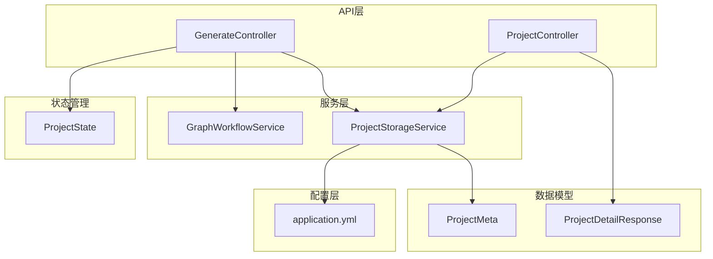
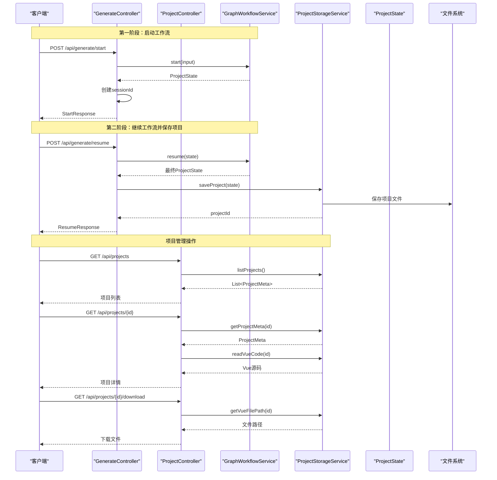
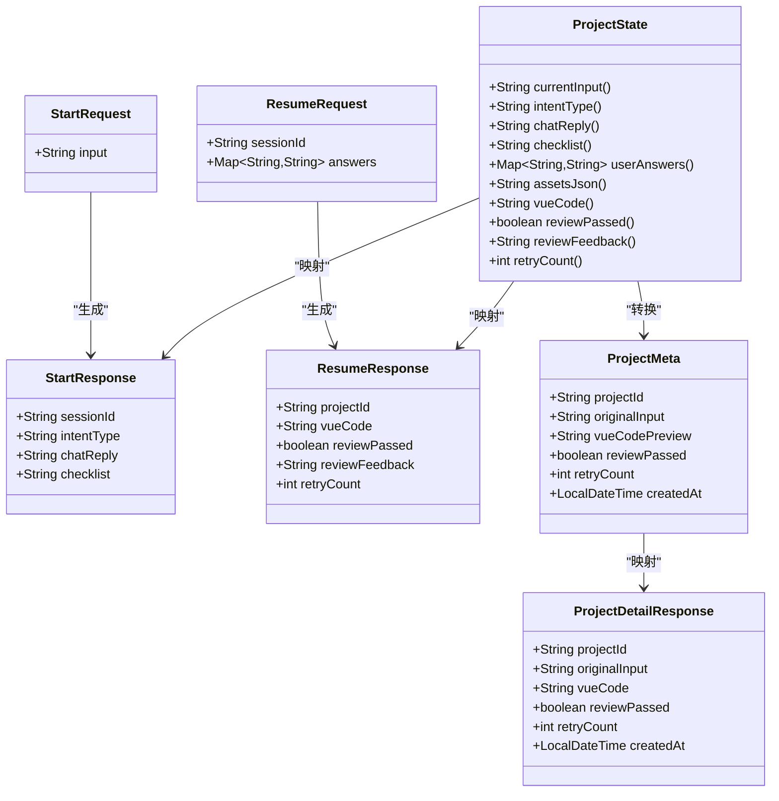
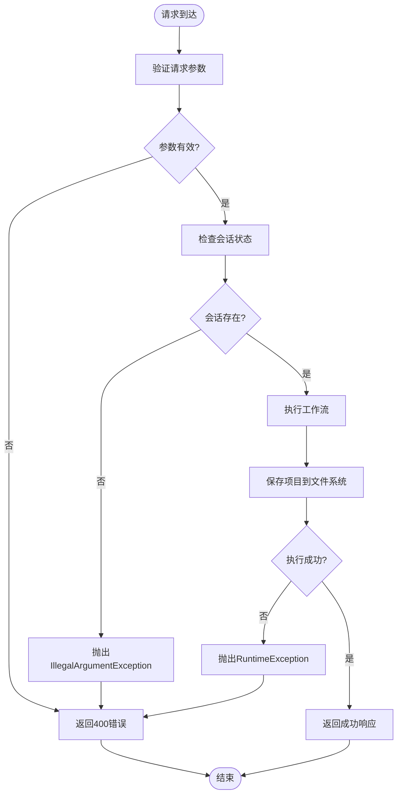
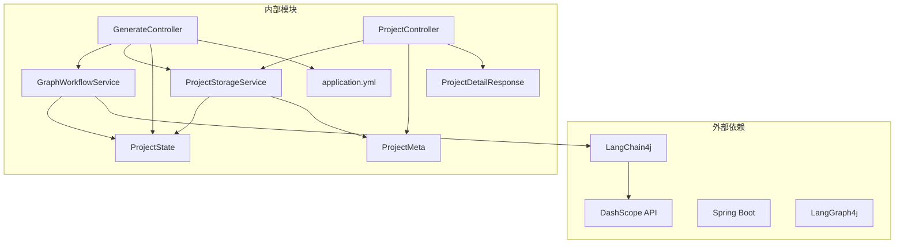
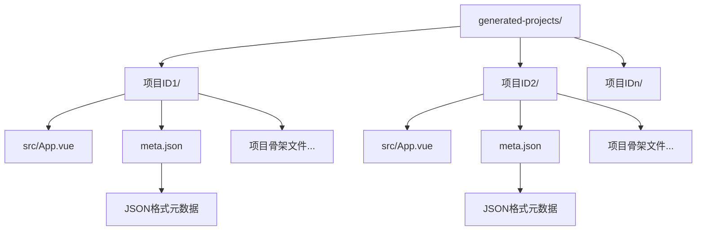
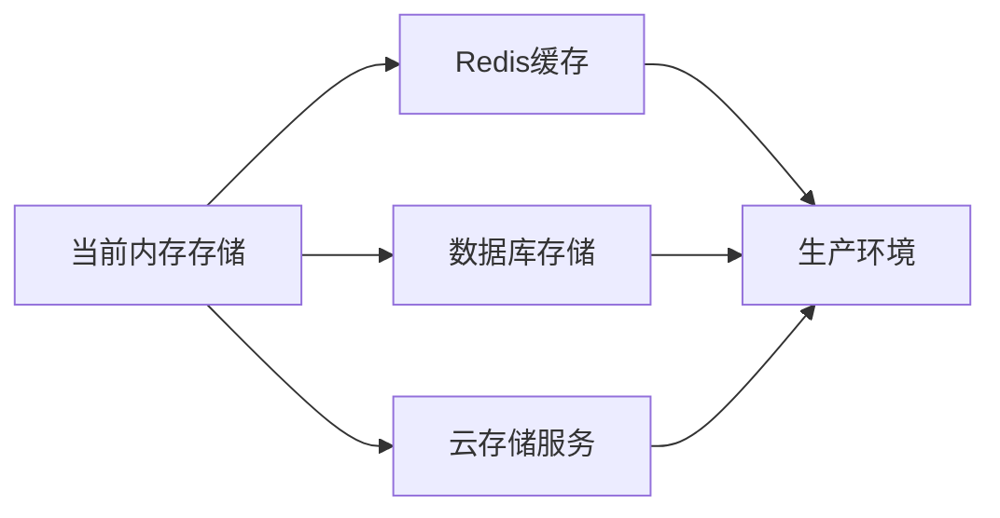

# API接口文档

<cite>
**本文档引用的文件**
- [GenerateController.java](file://src/main/java/com/example/websitemother/controller/GenerateController.java)
- [ProjectController.java](file://src/main/java/com/example/websitemother/controller/ProjectController.java)
- [ProjectStorageService.java](file://src/main/java/com/example/websitemother/service/ProjectStorageService.java)
- [ProjectMeta.java](file://src/main/java/com/example/websitemother/dto/ProjectMeta.java)
- [ProjectState.java](file://src/main/java/com/example/websitemother/state/ProjectState.java)
- [application.yml](file://src/main/resources/application.yml)
</cite>

## 更新摘要
**变更内容**
- 新增项目管理API：ProjectController提供项目列表、详情和下载功能
- 更新GenerateController：集成项目存储服务，自动保存生成的项目
- 新增ProjectStorageService：完整的项目持久化和管理服务
- 新增ProjectMeta数据模型：项目元数据结构定义
- 新增ProjectDetailResponse响应模型：项目详情数据结构
- 增强API功能：从纯生成API扩展为完整的项目管理API

## 目录
1. [简介](#简介)
2. [项目结构](#项目结构)
3. [核心组件](#核心组件)
4. [架构概览](#架构概览)
5. [详细组件分析](#详细组件分析)
6. [依赖关系分析](#依赖关系分析)
7. [性能考虑](#性能考虑)
8. [故障排除指南](#故障排除指南)
9. [结论](#结论)

## 简介

WebsiteMother是一个基于AI驱动的网站生成系统，通过LangGraph工作流引擎实现智能网站构建。该系统提供RESTful API接口，支持用户通过自然语言描述快速生成专业的Vue.js网站代码。

系统采用分阶段工作流架构：
- **第一阶段**：意图分析和需求清单生成
- **第二阶段**：素材收集、Vue代码生成和代码审查循环

**更新** 系统现已扩展为完整的项目管理平台，支持项目创建、存储、管理和下载功能。所有生成的项目都会自动保存到文件系统，并提供完整的项目管理API。

## 项目结构



**图表来源**
- [GenerateController.java:24-31](file://src/main/java/com/example/websitemother/controller/GenerateController.java#L24-L31)
- [ProjectController.java:26-30](file://src/main/java/com/example/websitemother/controller/ProjectController.java#L26-L30)
- [ProjectStorageService.java:26-28](file://src/main/java/com/example/websitemother/service/ProjectStorageService.java#L26-L28)
- [ProjectMeta.java:10-18](file://src/main/java/com/example/websitemother/dto/ProjectMeta.java#L10-L18)

## 核心组件

### GenerateController - 核心API控制器

GenerateController提供两个主要的RESTful API端点：

1. **POST /api/generate/start** - 启动生成流程
2. **POST /api/generate/resume** - 继续生成流程

**更新** 该控制器现在集成了ProjectStorageService，自动保存生成的项目到文件系统。

**章节来源**
- [GenerateController.java:24-31](file://src/main/java/com/example/websitemother/controller/GenerateController.java#L24-L31)
- [GenerateController.java:38-56](file://src/main/java/com/example/websitemother/controller/GenerateController.java#L38-L56)
- [GenerateController.java:61-99](file://src/main/java/com/example/websitemother/controller/GenerateController.java#L61-L99)

### ProjectController - 项目管理API控制器

**新增** ProjectController提供完整的项目管理功能：

1. **GET /api/projects** - 列出所有已保存的项目
2. **GET /api/projects/{id}** - 获取指定项目的详细信息和源码
3. **GET /api/projects/{id}/download** - 下载App.vue文件

**章节来源**
- [ProjectController.java:26-30](file://src/main/java/com/example/websitemother/controller/ProjectController.java#L26-L30)
- [ProjectController.java:35-38](file://src/main/java/com/example/websitemother/controller/ProjectController.java#L35-L38)
- [ProjectController.java:43-59](file://src/main/java/com/example/websitemother/controller/ProjectController.java#L43-L59)
- [ProjectController.java:64-76](file://src/main/java/com/example/websitemother/controller/ProjectController.java#L64-L76)

### ProjectStorageService - 项目存储服务

**新增** ProjectStorageService提供完整的项目持久化功能：

- **saveProject()**：保存生成的项目到文件系统
- **listProjects()**：列出所有已保存的项目
- **getProjectMeta()**：读取项目元数据
- **readVueCode()**：读取Vue源码
- **getVueFilePath()**：获取Vue文件路径

**章节来源**
- [ProjectStorageService.java:56-89](file://src/main/java/com/example/websitemother/service/ProjectStorageService.java#L56-L89)
- [ProjectStorageService.java:178-190](file://src/main/java/com/example/websitemother/service/ProjectStorageService.java#L178-L190)
- [ProjectStorageService.java:218-220](file://src/main/java/com/example/websitemother/service/ProjectStorageService.java#L218-L220)

### ProjectMeta - 项目元数据模型

**新增** ProjectMeta定义了项目的元数据结构：

- **projectId**：项目唯一标识符
- **originalInput**：原始用户输入
- **vueCodePreview**：Vue代码预览
- **reviewPassed**：代码审查是否通过
- **retryCount**：重试次数
- **createdAt**：创建时间

**章节来源**
- [ProjectMeta.java:10-18](file://src/main/java/com/example/websitemother/dto/ProjectMeta.java#L10-L18)

### ProjectDetailResponse - 项目详情响应模型

**新增** ProjectDetailResponse提供完整的项目详情数据结构：

- **projectId**：项目唯一标识符
- **originalInput**：原始用户输入
- **vueCode**：完整Vue源码
- **reviewPassed**：代码审查是否通过
- **retryCount**：重试次数
- **createdAt**：创建时间

**章节来源**
- [ProjectController.java:80-88](file://src/main/java/com/example/websitemother/controller/ProjectController.java#L80-L88)

## 架构概览



**图表来源**
- [GenerateController.java:38-56](file://src/main/java/com/example/websitemother/controller/GenerateController.java#L38-L56)
- [GenerateController.java:61-99](file://src/main/java/com/example/websitemother/controller/GenerateController.java#L61-L99)
- [ProjectController.java:35-38](file://src/main/java/com/example/websitemother/controller/ProjectController.java#L35-L38)
- [ProjectController.java:43-59](file://src/main/java/com/example/websitemother/controller/ProjectController.java#L43-L59)
- [ProjectController.java:64-76](file://src/main/java/com/example/websitemother/controller/ProjectController.java#L64-L76)

## 详细组件分析

### API接口规范

#### POST /api/generate/start

**功能描述**：启动网站生成流程，分析用户输入并生成需求清单。

**请求参数**：
```json
{
  "input": "string"
}
```

**响应数据结构**：
```json
{
  "sessionId": "string",
  "intentType": "string",
  "chatReply": "string",
  "checklist": "string"
}
```

**请求示例**：
```json
{
  "input": "我需要一个展示摄影作品的个人网站"
}
```

**响应示例**：
```json
{
  "sessionId": "550e8400-e29b-41d4-a716-446655440000",
  "intentType": "create",
  "chatReply": "",
  "checklist": "[{\"field\":\"theme\",\"label\":\"网站主题\",\"type\":\"text\",\"description\":\"例如：摄影、设计、科技等\"}]"
}
```

**章节来源**
- [GenerateController.java:38-56](file://src/main/java/com/example/websitemother/controller/GenerateController.java#L38-L56)
- [GenerateController.java:109-114](file://src/main/java/com/example/websitemother/controller/GenerateController.java#L109-L114)

#### POST /api/generate/resume

**功能描述**：继续网站生成流程，接收用户对需求清单的回答并执行后续生成。

**更新** 该接口现在会自动保存生成的项目到文件系统。

**请求参数**：
```json
{
  "sessionId": "string",
  "answers": {
    "field1": "string",
    "field2": "string"
  }
}
```

**响应数据结构**：
```json
{
  "projectId": "string",
  "vueCode": "string",
  "reviewPassed": "boolean",
  "reviewFeedback": "string",
  "retryCount": "integer"
}
```

**请求示例**：
```json
{
  "sessionId": "550e8400-e29b-41d4-a716-446655440000",
  "answers": {
    "theme": "摄影",
    "style": "简约现代",
    "features": "作品展示、联系表单"
  }
}
```

**响应示例**：
```json
{
  "projectId": "00ea7a70-313f-4163-99d8-5537435494ea",
  "vueCode": "<!-- Vue代码内容 -->",
  "reviewPassed": true,
  "reviewFeedback": "",
  "retryCount": 1
}
```

**章节来源**
- [GenerateController.java:61-99](file://src/main/java/com/example/websitemother/controller/GenerateController.java#L61-L99)
- [GenerateController.java:123-129](file://src/main/java/com/example/websitemother/controller/GenerateController.java#L123-L129)

#### GET /api/projects

**功能描述**：列出所有已保存的项目，按创建时间倒序排列。

**请求参数**：无

**响应数据结构**：
```json
[
  {
    "projectId": "string",
    "originalInput": "string",
    "vueCodePreview": "string",
    "reviewPassed": "boolean",
    "retryCount": "integer",
    "createdAt": "datetime"
  }
]
```

**响应示例**：
```json
[
  {
    "projectId": "00ea7a70-313f-4163-99d8-5537435494ea",
    "originalInput": "个人摄影作品网站",
    "vueCodePreview": "<!-- Vue代码预览 -->...",
    "reviewPassed": true,
    "retryCount": 1,
    "createdAt": "2024-01-15T10:30:00"
  }
]
```

**章节来源**
- [ProjectController.java:35-38](file://src/main/java/com/example/websitemother/controller/ProjectController.java#L35-L38)
- [ProjectStorageService.java:178-190](file://src/main/java/com/example/websitemother/service/ProjectStorageService.java#L178-L190)

#### GET /api/projects/{id}

**功能描述**：获取指定项目的详细信息和完整Vue源码。

**请求参数**：
- **id** (路径参数): 项目唯一标识符

**响应数据结构**：
```json
{
  "projectId": "string",
  "originalInput": "string",
  "vueCode": "string",
  "reviewPassed": "boolean",
  "retryCount": "integer",
  "createdAt": "datetime"
}
```

**响应示例**：
```json
{
  "projectId": "00ea7a70-313f-4163-99d8-5537435494ea",
  "originalInput": "个人摄影作品网站",
  "vueCode": "<!-- 完整Vue代码 -->",
  "reviewPassed": true,
  "retryCount": 1,
  "createdAt": "2024-01-15T10:30:00"
}
```

**章节来源**
- [ProjectController.java:43-59](file://src/main/java/com/example/websitemother/controller/ProjectController.java#L43-L59)
- [ProjectController.java:80-88](file://src/main/java/com/example/websitemother/controller/ProjectController.java#L80-L88)

#### GET /api/projects/{id}/download

**功能描述**：下载指定项目的App.vue文件。

**请求参数**：
- **id** (路径参数): 项目唯一标识符

**响应数据结构**：文件下载流

**响应示例**：
```
HTTP/1.1 200 OK
Content-Disposition: attachment; filename="00ea7a70-313f-4163-99d8-5537435494ea_App.vue"
Content-Type: text/x-vue
Content-Length: 12345

<!-- Vue代码内容 -->
```

**章节来源**
- [ProjectController.java:64-76](file://src/main/java/com/example/websitemother/controller/ProjectController.java#L64-L76)

### 数据模型定义



**图表来源**
- [GenerateController.java:109-129](file://src/main/java/com/example/websitemother/controller/GenerateController.java#L109-L129)
- [ProjectController.java:80-88](file://src/main/java/com/example/websitemother/controller/ProjectController.java#L80-L88)
- [ProjectMeta.java:10-18](file://src/main/java/com/example/websitemother/dto/ProjectMeta.java#L10-L18)
- [ProjectState.java:30-76](file://src/main/java/com/example/websitemother/state/ProjectState.java#L30-L76)

**章节来源**
- [GenerateController.java:109-129](file://src/main/java/com/example/websitemother/controller/GenerateController.java#L109-L129)
- [ProjectController.java:80-88](file://src/main/java/com/example/websitemother/controller/ProjectController.java#L80-L88)
- [ProjectMeta.java:10-18](file://src/main/java/com/example/websitemother/dto/ProjectMeta.java#L10-L18)
- [ProjectState.java:30-76](file://src/main/java/com/example/websitemother/state/ProjectState.java#L30-L76)

### 工作流节点组件

#### AssetCollector - 素材收集器

根据用户回答生成占位图片URL的JSON格式数据，使用Picsum.photos服务。

**功能特性**：
- 自动提取关键词生成确定性图片URL
- 确保至少包含一张主视觉图（hero）
- 支持多种图片尺寸和关键字组合

**章节来源**
- [AssetCollector.java:18-59](file://src/main/java/com/example/websitemother/node/AssetCollector.java#L18-L59)

#### VueGenerator - Vue代码生成器

基于用户需求和素材生成完整的Vue 3单文件组件代码。

**生成规范**：
- 使用Composition API语法
- 使用Tailwind CSS进行样式设计
- 生成可直接运行的完整组件
- 支持响应式设计和交互效果

**章节来源**
- [VueGenerator.java:19-62](file://src/main/java/com/example/websitemother/node/VueGenerator.java#L19-L62)

#### CodeReviewer - 代码审查器

对生成的Vue代码进行严格审查，检查语法正确性和代码质量。

**审查标准**：
- 完整的HTML结构标签
- 正确的Vue语法使用
- Tailwind CSS类名验证
- 组件独立运行能力

**章节来源**
- [CodeReviewer.java:19-59](file://src/main/java/com/example/websitemother/node/CodeReviewer.java#L19-L59)

### 错误处理机制

系统采用统一的异常处理策略：



**图表来源**
- [GenerateController.java:66-73](file://src/main/java/com/example/websitemother/controller/GenerateController.java#L66-L73)
- [GenerateController.java:87](file://src/main/java/com/example/websitemother/controller/GenerateController.java#L87)

**章节来源**
- [GenerateController.java:66-73](file://src/main/java/com/example/websitemother/controller/GenerateController.java#L66-L73)
- [GenerateController.java:87](file://src/main/java/com/example/websitemother/controller/GenerateController.java#L87)

## 依赖关系分析



**图表来源**
- [application.yml:4-10](file://src/main/resources/application.yml#L4-L10)
- [GenerateController.java:3-6](file://src/main/java/com/example/websitemother/controller/GenerateController.java#L3-L6)
- [ProjectController.java:3-5](file://src/main/java/com/example/websitemother/controller/ProjectController.java#L3-L5)

**章节来源**
- [application.yml:4-10](file://src/main/resources/application.yml#L4-L10)
- [GenerateController.java:3-6](file://src/main/java/com/example/websitemother/controller/GenerateController.java#L3-L6)
- [ProjectController.java:3-5](file://src/main/java/com/example/websitemother/controller/ProjectController.java#L3-L5)

### 外部API依赖

系统依赖以下外部服务：

1. **DashScope API**：阿里云通义千问大模型服务
2. **Picsum.photos**：免费占位图片服务

**章节来源**
- [application.yml:4-10](file://src/main/resources/application.yml#L4-L10)

### 项目存储架构

**新增** 项目存储采用文件系统持久化：



**图表来源**
- [ProjectStorageService.java:30-48](file://src/main/java/com/example/websitemother/service/ProjectStorageService.java#L30-L48)
- [ProjectStorageService.java:56-89](file://src/main/java/com/example/websitemother/service/ProjectStorageService.java#L56-L89)

**章节来源**
- [ProjectStorageService.java:30-48](file://src/main/java/com/example/websitemother/service/ProjectStorageService.java#L30-L48)
- [ProjectStorageService.java:56-89](file://src/main/java/com/example/websitemother/service/ProjectStorageService.java#L56-L89)

## 性能考虑

### 会话状态管理

当前实现使用内存级存储，存在以下限制：
- **内存占用**：所有会话状态保存在JVM内存中
- **重启丢失**：应用重启会导致所有会话状态丢失
- **扩展性限制**：无法水平扩展多个实例

**建议改进方案**：


### 项目存储优化

**新增** 项目存储的性能优化建议：

1. **文件系统优化**
   - 使用异步文件写入减少I/O阻塞
   - 实现文件缓存机制
   - 优化目录结构避免大量小文件

2. **内存管理**
   - 限制项目列表返回数量
   - 实现分页查询
   - 缓存常用项目元数据

3. **并发处理**
   - 使用连接池管理文件操作
   - 实现请求限流
   - 异步处理大型项目下载

### API调用最佳实践

1. **会话生命周期管理**
   - 合理设置会话超时时间
   - 实现会话清理机制
   - 提供会话状态查询接口

2. **并发处理优化**
   - 使用连接池管理外部API调用
   - 实现请求限流和熔断机制
   - 异步处理长时间运行的任务

3. **资源优化**
   - 缓存常用配置和模板
   - 压缩响应数据大小
   - 实现分页和流式传输

## 故障排除指南

### 常见错误及解决方案

| 错误类型 | 错误码 | 描述 | 解决方案 |
|---------|--------|------|----------|
| 会话不存在 | 400 | 会话ID无效或已过期 | 重新发起/start请求获取新会话 |
| 参数验证失败 | 400 | 请求参数格式不正确 | 检查请求体格式和必填字段 |
| 项目不存在 | 404 | 项目ID无效或已删除 | 检查项目ID或重新生成项目 |
| 外部API错误 | 502/504 | DashScope API调用失败 | 检查API密钥和网络连接 |
| 内存不足 | 500 | 会话状态过大导致内存溢出 | 优化会话状态大小或升级内存 |
| 文件系统错误 | 500 | 项目保存失败 | 检查磁盘空间和权限设置 |

### 调试建议

1. **启用详细日志**
   ```yaml
   logging:
     level:
       com.example.websitemother: DEBUG
   ```

2. **监控指标收集**
   - API响应时间
   - 外部API调用成功率
   - 内存使用情况
   - 文件系统I/O性能

3. **错误追踪**
   - 记录完整的请求和响应
   - 跟踪工作流执行状态
   - 监控异常堆栈信息
   - 监控项目存储状态

**章节来源**
- [GenerateController.java:66-73](file://src/main/java/com/example/websitemother/controller/GenerateController.java#L66-L73)
- [ProjectController.java:46-48](file://src/main/java/com/example/websitemother/controller/ProjectController.java#L46-L48)
- [ProjectController.java:68-70](file://src/main/java/com/example/websitemother/controller/ProjectController.java#L68-L70)

## 结论

WebsiteMother API提供了一个完整的AI驱动网站生成功能，现已扩展为完整的项目管理平台，具有以下特点：

**核心优势**：
- 清晰的分阶段工作流设计
- 完善的状态管理机制
- 灵活的配置和扩展能力
- 严格的错误处理和日志记录
- **新增** 完整的项目持久化和管理功能

**新增功能**：
- **项目管理API**：支持项目列表、详情查看和下载
- **自动项目保存**：生成完成后自动保存到文件系统
- **项目元数据管理**：完整的项目信息跟踪
- **可运行项目骨架**：生成完整的Vue项目结构
- **文件系统存储**：持久化的项目文件管理

**改进建议**：
1. 替换内存存储为持久化解决方案
2. 实现更完善的会话管理和超时控制
3. 添加API版本管理和向后兼容性策略
4. 增强安全机制和访问控制
5. 优化性能和资源使用效率
6. **新增** 实现项目存储的分布式架构
7. **新增** 添加项目搜索和过滤功能
8. **新增** 实现项目导出和批量管理功能

该API为前端开发者和第三方集成商提供了清晰的接口规范和使用指南，支持快速集成和二次开发。新的项目管理功能使其成为了一个完整的AI驱动网站生成和管理平台。