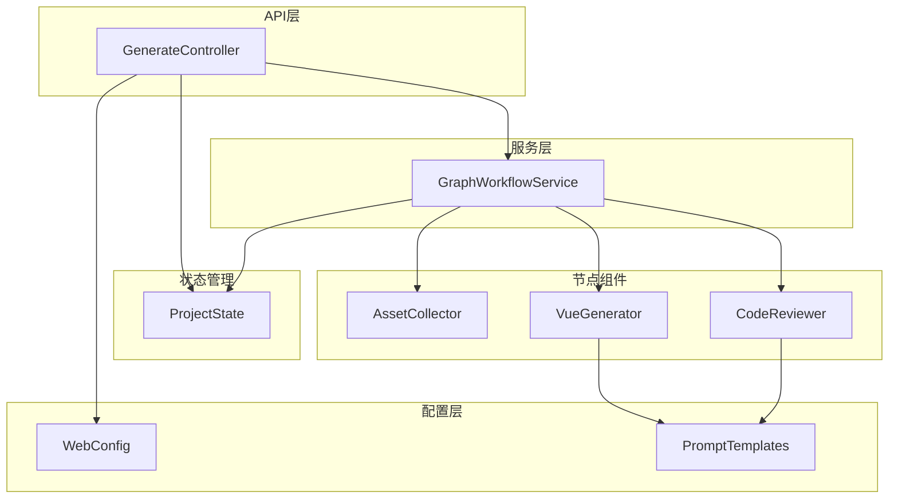
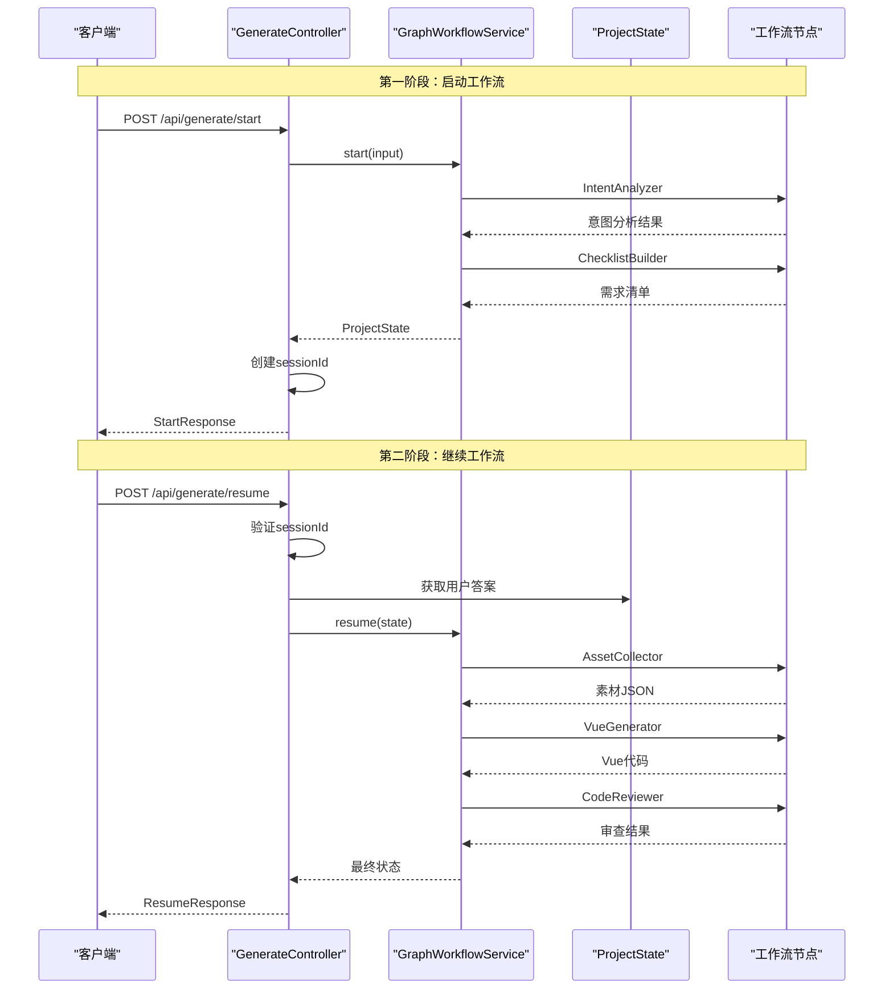
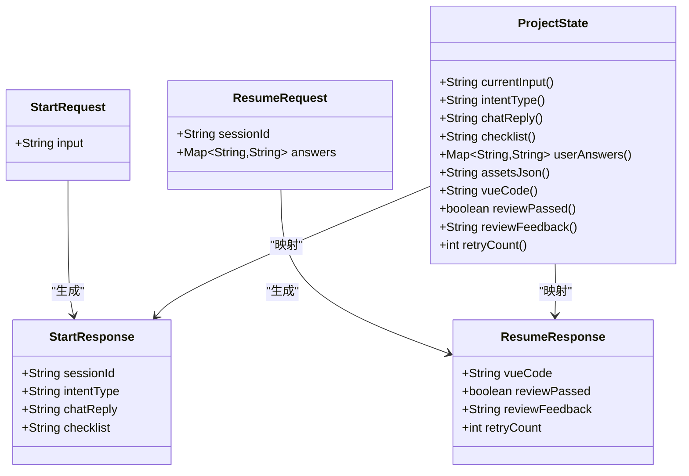
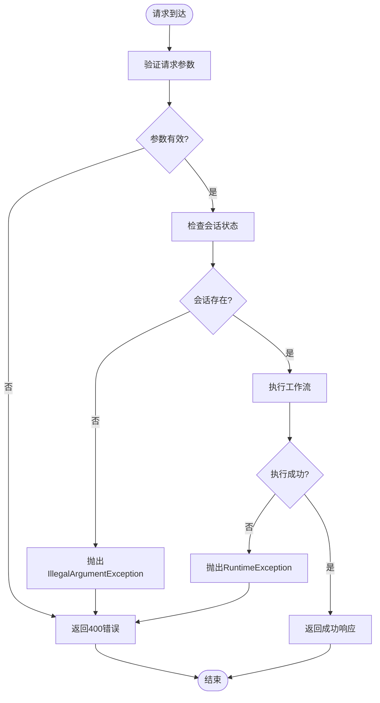
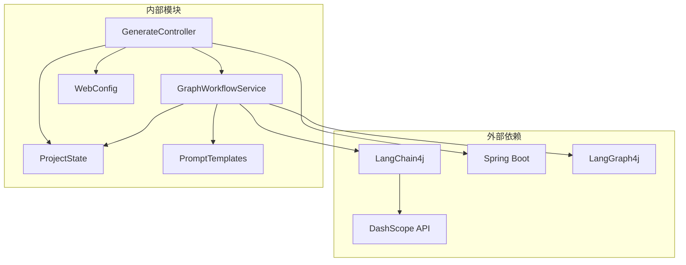
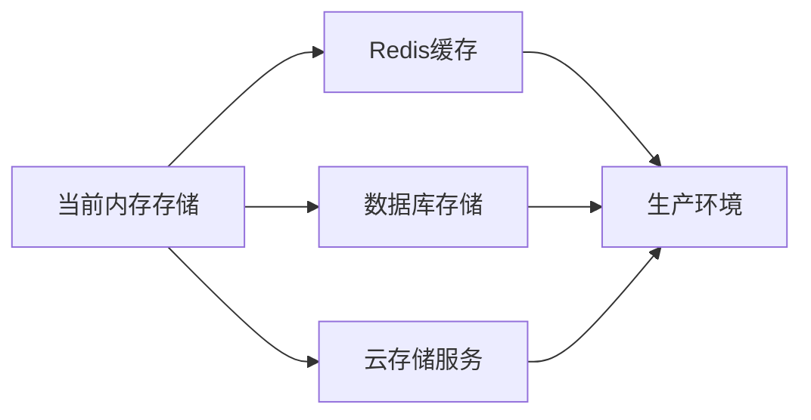

# API接口文档

<cite>
**本文档引用的文件**
- [GenerateController.java](file://src/main/java/com/example/websitemother/controller/GenerateController.java)
- [GraphWorkflowService.java](file://src/main/java/com/example/websitemother/service/GraphWorkflowService.java)
- [ProjectState.java](file://src/main/java/com/example/websitemother/state/ProjectState.java)
- [WebConfig.java](file://src/main/java/com/example/websitemother/config/WebConfig.java)
- [PromptTemplates.java](file://src/main/java/com/example/websitemother/prompt/PromptTemplates.java)
- [VueGenerator.java](file://src/main/java/com/example/websitemother/node/VueGenerator.java)
- [AssetCollector.java](file://src/main/java/com/example/websitemother/node/AssetCollector.java)
- [CodeReviewer.java](file://src/main/java/com/example/websitemother/node/CodeReviewer.java)
- [application.yml](file://src/main/resources/application.yml)
- [pom.xml](file://pom.xml)
</cite>

## 目录
1. [简介](#简介)
2. [项目结构](#项目结构)
3. [核心组件](#核心组件)
4. [架构概览](#架构概览)
5. [详细组件分析](#详细组件分析)
6. [依赖关系分析](#依赖关系分析)
7. [性能考虑](#性能考虑)
8. [故障排除指南](#故障排除指南)
9. [结论](#结论)

## 简介

WebsiteMother是一个基于AI驱动的网站生成系统，通过LangGraph工作流引擎实现智能网站构建。该系统提供RESTful API接口，支持用户通过自然语言描述快速生成专业的Vue.js网站代码。

系统采用分阶段工作流架构：
- **第一阶段**：意图分析和需求清单生成
- **第二阶段**：素材收集、Vue代码生成和代码审查循环

## 项目结构



**图表来源**
- [GenerateController.java:14-22](file://src/main/java/com/example/websitemother/controller/GenerateController.java#L14-L22)
- [GraphWorkflowService.java:15-24](file://src/main/java/com/example/websitemother/service/GraphWorkflowService.java#L15-L24)
- [WebConfig.java:10-22](file://src/main/java/com/example/websitemother/config/WebConfig.java#L10-L22)

**章节来源**
- [GenerateController.java:14-22](file://src/main/java/com/example/websitemother/controller/GenerateController.java#L14-L22)
- [GraphWorkflowService.java:15-24](file://src/main/java/com/example/websitemother/service/GraphWorkflowService.java#L15-L24)
- [WebConfig.java:10-22](file://src/main/java/com/example/websitemother/config/WebConfig.java#L10-L22)

## 核心组件

### GenerateController - 核心API控制器

GenerateController提供两个主要的RESTful API端点：

1. **POST /api/generate/start** - 启动生成流程
2. **POST /api/generate/resume** - 继续生成流程

该控制器使用内存级会话状态存储，适合演示用途，生产环境需要替换为Redis等持久化存储。

**章节来源**
- [GenerateController.java:14-22](file://src/main/java/com/example/websitemother/controller/GenerateController.java#L14-L22)
- [GenerateController.java:27-28](file://src/main/java/com/example/websitemother/controller/GenerateController.java#L27-L28)

### GraphWorkflowService - 工作流服务

封装了LangGraph工作流的执行逻辑，负责协调各个节点组件的工作。

- **start()方法**：执行第一阶段工作流（意图分析 + 清单生成）
- **resume()方法**：执行第二阶段工作流（素材收集 + Vue生成 + 代码审查）

**章节来源**
- [GraphWorkflowService.java:15-24](file://src/main/java/com/example/websitemother/service/GraphWorkflowService.java#L15-L24)
- [GraphWorkflowService.java:31-58](file://src/main/java/com/example/websitemother/service/GraphWorkflowService.java#L31-L58)

### ProjectState - 状态管理

继承自AgentState，作为整个工作流中的全局状态容器，管理所有中间结果和最终输出。

**章节来源**
- [ProjectState.java:13-28](file://src/main/java/com/example/websitemother/state/ProjectState.java#L13-L28)
- [ProjectState.java:15-24](file://src/main/java/com/example/websitemother/state/ProjectState.java#L15-L24)

## 架构概览



**图表来源**
- [GenerateController.java:33-51](file://src/main/java/com/example/websitemother/controller/GenerateController.java#L33-L51)
- [GenerateController.java:56-84](file://src/main/java/com/example/websitemother/controller/GenerateController.java#L56-L84)
- [GraphWorkflowService.java:31-58](file://src/main/java/com/example/websitemother/service/GraphWorkflowService.java#L31-L58)

## 详细组件分析

### API接口规范

#### POST /api/generate/start

**功能描述**：启动网站生成流程，分析用户输入并生成需求清单。

**请求参数**：
```json
{
  "input": "string"
}
```

**响应数据结构**：
```json
{
  "sessionId": "string",
  "intentType": "string",
  "chatReply": "string",
  "checklist": "string"
}
```

**请求示例**：
```json
{
  "input": "我需要一个展示摄影作品的个人网站"
}
```

**响应示例**：
```json
{
  "sessionId": "550e8400-e29b-41d4-a716-446655440000",
  "intentType": "create",
  "chatReply": "",
  "checklist": "[{\"field\":\"theme\",\"label\":\"网站主题\",\"type\":\"text\",\"description\":\"例如：摄影、设计、科技等\"}]"
}
```

**章节来源**
- [GenerateController.java:33-51](file://src/main/java/com/example/websitemother/controller/GenerateController.java#L33-L51)
- [GenerateController.java:88-99](file://src/main/java/com/example/websitemother/controller/GenerateController.java#L88-L99)

#### POST /api/generate/resume

**功能描述**：继续网站生成流程，接收用户对需求清单的回答并执行后续生成。

**请求参数**：
```json
{
  "sessionId": "string",
  "answers": {
    "field1": "string",
    "field2": "string"
  }
}
```

**响应数据结构**：
```json
{
  "vueCode": "string",
  "reviewPassed": "boolean",
  "reviewFeedback": "string",
  "retryCount": "integer"
}
```

**请求示例**：
```json
{
  "sessionId": "550e8400-e29b-41d4-a716-446655440000",
  "answers": {
    "theme": "摄影",
    "style": "简约现代",
    "features": "作品展示、联系表单"
  }
}
```

**响应示例**：
```json
{
  "vueCode": "<!-- Vue代码内容 -->",
  "reviewPassed": true,
  "reviewFeedback": "",
  "retryCount": 1
}
```

**章节来源**
- [GenerateController.java:56-84](file://src/main/java/com/example/websitemother/controller/GenerateController.java#L56-L84)
- [GenerateController.java:101-113](file://src/main/java/com/example/websitemother/controller/GenerateController.java#L101-L113)

### 数据模型定义



**图表来源**
- [GenerateController.java:88-113](file://src/main/java/com/example/websitemother/controller/GenerateController.java#L88-L113)
- [ProjectState.java:30-76](file://src/main/java/com/example/websitemother/state/ProjectState.java#L30-L76)

**章节来源**
- [GenerateController.java:88-113](file://src/main/java/com/example/websitemother/controller/GenerateController.java#L88-L113)
- [ProjectState.java:30-76](file://src/main/java/com/example/websitemother/state/ProjectState.java#L30-L76)

### 工作流节点组件

#### AssetCollector - 素材收集器

根据用户回答生成占位图片URL的JSON格式数据，使用Picsum.photos服务。

**功能特性**：
- 自动提取关键词生成确定性图片URL
- 确保至少包含一张主视觉图（hero）
- 支持多种图片尺寸和关键字组合

**章节来源**
- [AssetCollector.java:18-59](file://src/main/java/com/example/websitemother/node/AssetCollector.java#L18-L59)

#### VueGenerator - Vue代码生成器

基于用户需求和素材生成完整的Vue 3单文件组件代码。

**生成规范**：
- 使用Composition API语法
- 使用Tailwind CSS进行样式设计
- 生成可直接运行的完整组件
- 支持响应式设计和交互效果

**章节来源**
- [VueGenerator.java:19-62](file://src/main/java/com/example/websitemother/node/VueGenerator.java#L19-L62)

#### CodeReviewer - 代码审查器

对生成的Vue代码进行严格审查，检查语法正确性和代码质量。

**审查标准**：
- 完整的HTML结构标签
- 正确的Vue语法使用
- Tailwind CSS类名验证
- 组件独立运行能力

**章节来源**
- [CodeReviewer.java:19-59](file://src/main/java/com/example/websitemother/node/CodeReviewer.java#L19-L59)

### 错误处理机制

系统采用统一的异常处理策略：



**图表来源**
- [GenerateController.java:62-64](file://src/main/java/com/example/websitemother/controller/GenerateController.java#L62-L64)
- [GraphWorkflowService.java:37-40](file://src/main/java/com/example/websitemother/service/GraphWorkflowService.java#L37-L40)

**章节来源**
- [GenerateController.java:62-64](file://src/main/java/com/example/websitemother/controller/GenerateController.java#L62-L64)
- [GraphWorkflowService.java:37-40](file://src/main/java/com/example/websitemother/service/GraphWorkflowService.java#L37-L40)

## 依赖关系分析



**图表来源**
- [pom.xml:34-58](file://pom.xml#L34-L58)
- [GenerateController.java:3-6](file://src/main/java/com/example/websitemother/controller/GenerateController.java#L3-L6)

**章节来源**
- [pom.xml:34-58](file://pom.xml#L34-L58)
- [application.yml:4-8](file://src/main/resources/application.yml#L4-L8)

### 外部API依赖

系统依赖以下外部服务：

1. **DashScope API**：阿里云通义千问大模型服务
2. **Picsum.photos**：免费占位图片服务

**章节来源**
- [application.yml:4-8](file://src/main/resources/application.yml#L4-L8)
- [AssetCollector.java:84-87](file://src/main/java/com/example/websitemother/node/AssetCollector.java#L84-L87)

## 性能考虑

### 会话状态管理

当前实现使用内存级存储，存在以下限制：
- **内存占用**：所有会话状态保存在JVM内存中
- **重启丢失**：应用重启会导致所有会话状态丢失
- **扩展性限制**：无法水平扩展多个实例

**建议改进方案**：


### API调用最佳实践

1. **会话生命周期管理**
   - 合理设置会话超时时间
   - 实现会话清理机制
   - 提供会话状态查询接口

2. **并发处理优化**
   - 使用连接池管理外部API调用
   - 实现请求限流和熔断机制
   - 异步处理长时间运行的任务

3. **资源优化**
   - 缓存常用配置和模板
   - 压缩响应数据大小
   - 实现分页和流式传输

## 故障排除指南

### 常见错误及解决方案

| 错误类型 | 错误码 | 描述 | 解决方案 |
|---------|--------|------|----------|
| 会话不存在 | 400 | 会话ID无效或已过期 | 重新发起/start请求获取新会话 |
| 参数验证失败 | 400 | 请求参数格式不正确 | 检查请求体格式和必填字段 |
| 外部API错误 | 502/504 | DashScope API调用失败 | 检查API密钥和网络连接 |
| 内存不足 | 500 | 会话状态过大导致内存溢出 | 优化会话状态大小或升级内存 |

### 调试建议

1. **启用详细日志**
   ```yaml
   logging:
     level:
       com.example.websitemother: DEBUG
   ```

2. **监控指标收集**
   - API响应时间
   - 外部API调用成功率
   - 内存使用情况

3. **错误追踪**
   - 记录完整的请求和响应
   - 跟踪工作流执行状态
   - 监控异常堆栈信息

**章节来源**
- [GenerateController.java:62-64](file://src/main/java/com/example/websitemother/controller/GenerateController.java#L62-L64)
- [GraphWorkflowService.java:37-40](file://src/main/java/com/example/websitemother/service/GraphWorkflowService.java#L37-L40)

## 结论

WebsiteMother API提供了一个完整的AI驱动网站生成功能，具有以下特点：

**优势**：
- 清晰的分阶段工作流设计
- 完善的状态管理机制
- 灵活的配置和扩展能力
- 严格的错误处理和日志记录

**改进建议**：
1. 替换内存存储为持久化解决方案
2. 实现更完善的会话管理和超时控制
3. 添加API版本管理和向后兼容性策略
4. 增强安全机制和访问控制
5. 优化性能和资源使用效率

该API为前端开发者和第三方集成商提供了清晰的接口规范和使用指南，支持快速集成和二次开发。