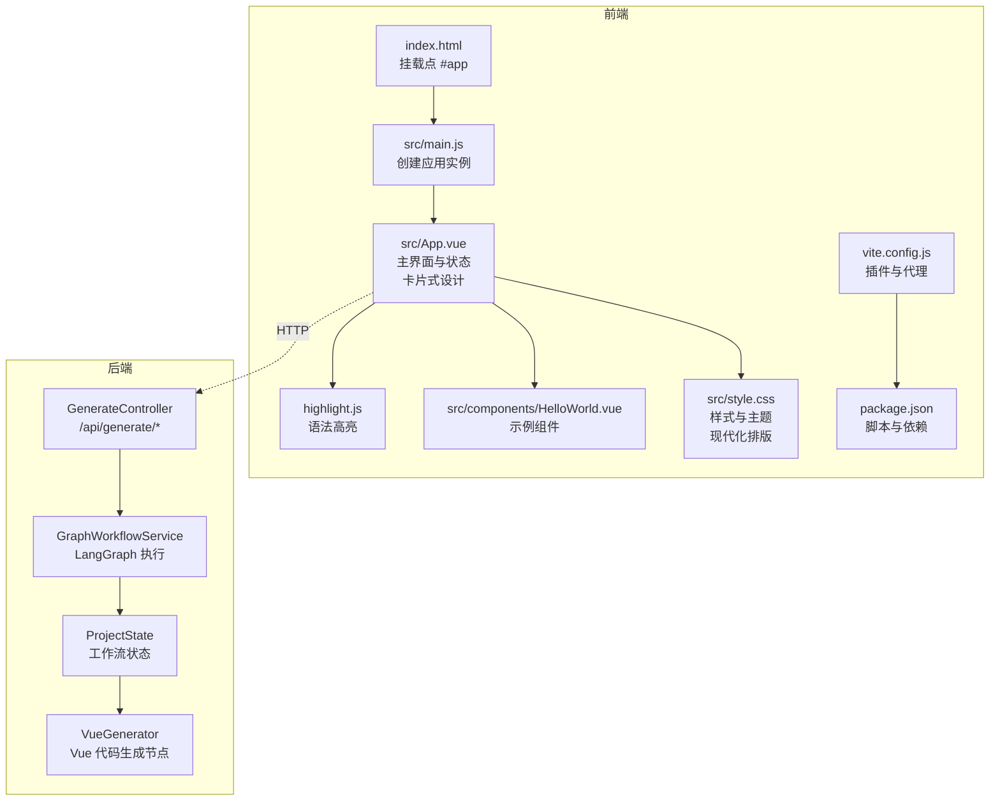
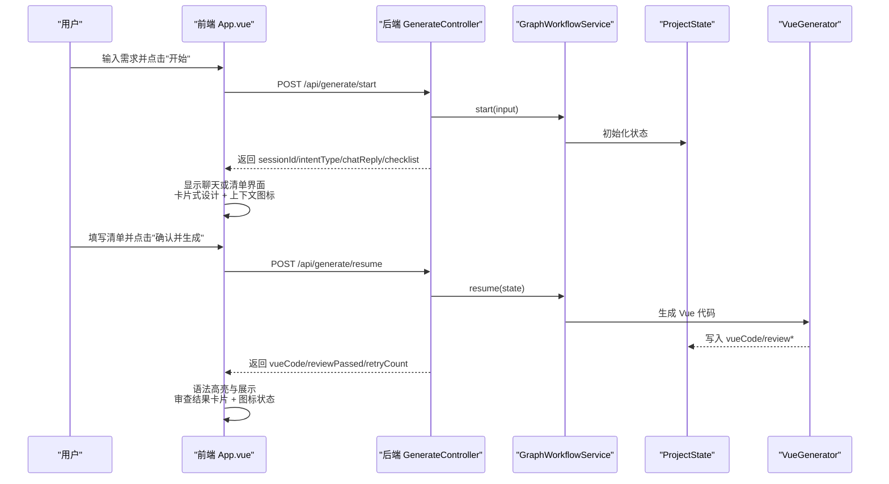
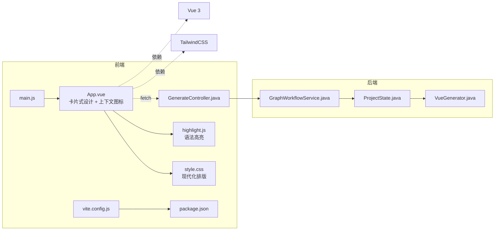

# 前端Vue.js应用

<cite>
**本文档引用的文件**
- [frontend/src/main.js](file://frontend/src/main.js)
- [frontend/src/App.vue](file://frontend/src/App.vue)
- [frontend/src/components/HelloWorld.vue](file://frontend/src/components/HelloWorld.vue)
- [frontend/src/style.css](file://frontend/src/style.css)
- [frontend/index.html](file://frontend/index.html)
- [frontend/vite.config.js](file://frontend/vite.config.js)
- [frontend/package.json](file://frontend/package.json)
- [src/main/java/com/example/websitemother/controller/GenerateController.java](file://src/main/java/com/example/websitemother/controller/GenerateController.java)
- [src/main/java/com/example/websitemother/service/GraphWorkflowService.java](file://src/main/java/com/example/websitemother/service/GraphWorkflowService.java)
- [src/main/java/com/example/websitemother/state/ProjectState.java](file://src/main/java/com/example/websitemother/state/ProjectState.java)
- [src/main/java/com/example/websitemother/node/VueGenerator.java](file://src/main/java/com/example/websitemother/node/VueGenerator.java)
- [src/main/resources/application.yml](file://src/main/resources/application.yml)
- [pom.xml](file://pom.xml)
- [generated-projects/23d1b9f2-d783-4d12-95bd-e3fb5aaa28b7/src/App.vue](file://generated-projects/23d1b9f2-d783-4d12-95bd-e3fb5aaa28b7/src/App.vue)
- [generated-projects/363fee09-14ea-4618-a8c0-30eebcf254a3/src/App.vue](file://generated-projects/363fee09-14ea-4618-a8c0-30eebcf254a3/src/App.vue)
</cite>

## 更新摘要
**变更内容**
- 重大UI重构：从简单列表升级为卡片式界面，包含上下文图标、改进排版和清晰的状态通信
- 新增了四阶段用户界面流程的详细描述，包含需求输入、AI对话、清单完成、代码生成四个完整步骤
- 新增了实时加载状态、错误处理和语法高亮显示功能的技术细节
- 完善了组件状态管理机制和用户交互流程
- 增强了后端API集成和工作流编排的技术说明

## 目录
1. [简介](#简介)
2. [项目结构](#项目结构)
3. [核心组件](#核心组件)
4. [架构总览](#架构总览)
5. [组件详解](#组件详解)
6. [依赖关系分析](#依赖关系分析)
7. [性能与构建优化](#性能与构建优化)
8. [故障排查指南](#故障排查指南)
9. [结论](#结论)
10. [附录](#附录)

## 简介
本项目是一个基于 Vue 3 单文件组件（SFC）的前端应用，配合后端 Spring Boot 服务，实现"零代码网站生成"的完整交互式流程。前端负责用户交互、状态管理与 UI 展示；后端通过 LangGraph 工作流编排 AI 节点，完成从需求理解到 Vue 代码生成与审查的全流程。Vite 作为构建工具，提供快速热更新与代理能力，TailwindCSS 实现响应式与暗色主题支持。

**更新** 项目现已实现四阶段用户界面流程：需求输入→AI对话→清单完成→代码生成，每个阶段都有明确的加载状态和错误处理机制。UI采用卡片式设计，通过上下文图标和改进的排版提供清晰的状态通信。

## 项目结构
前端采用典型的 Vue 3 应用目录结构：
- 入口与根组件：main.js、App.vue
- 样式与模板：style.css、index.html
- 构建与依赖：vite.config.js、package.json
- 示例组件：components/HelloWorld.vue
- 后端接口：Spring Boot 控制器与服务层



**图表来源**
- [frontend/index.html:1-14](file://frontend/index.html#L1-L14)
- [frontend/src/main.js:1-6](file://frontend/src/main.js#L1-L6)
- [frontend/src/App.vue:1-372](file://frontend/src/App.vue#L1-L372)
- [frontend/src/style.css:1-275](file://frontend/src/style.css#L1-L275)
- [frontend/src/components/HelloWorld.vue:1-94](file://frontend/src/components/HelloWorld.vue#L1-L94)
- [frontend/vite.config.js:1-17](file://frontend/vite.config.js#L1-L17)
- [frontend/package.json:1-24](file://frontend/package.json#L1-L24)
- [src/main/java/com/example/websitemother/controller/GenerateController.java:1-131](file://src/main/java/com/example/websitemother/controller/GenerateController.java#L1-L131)
- [src/main/java/com/example/websitemother/service/GraphWorkflowService.java:1-60](file://src/main/java/com/example/websitemother/service/GraphWorkflowService.java#L1-L60)
- [src/main/java/com/example/websitemother/state/ProjectState.java:1-78](file://src/main/java/com/example/websitemother/state/ProjectState.java#L1-L78)
- [src/main/java/com/example/websitemother/node/VueGenerator.java:1-64](file://src/main/java/com/example/websitemother/node/VueGenerator.java#L1-L64)

**章节来源**
- [frontend/src/main.js:1-6](file://frontend/src/main.js#L1-L6)
- [frontend/src/App.vue:1-372](file://frontend/src/App.vue#L1-L372)
- [frontend/src/style.css:1-275](file://frontend/src/style.css#L1-L275)
- [frontend/index.html:1-14](file://frontend/index.html#L1-L14)
- [frontend/vite.config.js:1-17](file://frontend/vite.config.js#L1-L17)
- [frontend/package.json:1-24](file://frontend/package.json#L1-L24)

## 核心组件
- 应用入口与挂载
  - main.js 创建 Vue 应用实例并挂载到 index.html 的 #app。
- 主界面组件 App.vue
  - 使用组合式 API 管理四阶段状态机（input、chatting、checklist、generating、result）。
  - 通过 fetch 与后端 /api/generate 接口交互，驱动完整工作流。
  - 使用 highlight.js 对生成的 Vue 代码进行语法高亮。
  - 实时加载状态显示和错误处理机制。
  - **重大UI重构**：采用卡片式设计，所有主要区域使用圆角边框、阴影和内边距，提供更好的视觉层次。
- 示例组件 HelloWorld.vue
  - 展示静态资源引入与基础交互按钮。
- 样式系统
  - style.css 引入 TailwindCSS 并定义深色主题变量与响应式布局。
  - **改进排版**：统一的标题、段落、间距和字体系统，提供现代化的阅读体验。
- 构建与开发服务器
  - vite.config.js 配置 Vue 插件、TailwindCSS 插件与 /api 代理到后端 8080 端口。
  - package.json 提供 dev/build/preview 脚本。

**更新** 新增了实时加载状态、错误处理和语法高亮显示功能，增强了用户体验和系统稳定性。UI重构采用卡片式设计和改进的排版系统。

**章节来源**
- [frontend/src/main.js:1-6](file://frontend/src/main.js#L1-L6)
- [frontend/src/App.vue:1-372](file://frontend/src/App.vue#L1-L372)
- [frontend/src/components/HelloWorld.vue:1-94](file://frontend/src/components/HelloWorld.vue#L1-L94)
- [frontend/src/style.css:1-275](file://frontend/src/style.css#L1-L275)
- [frontend/vite.config.js:1-17](file://frontend/vite.config.js#L1-L17)
- [frontend/package.json:1-24](file://frontend/package.json#L1-L24)

## 架构总览
前端与后端通过 REST API 协作，形成"前端交互 + 后端工作流"的分层架构。前端负责 UI 与用户交互，后端负责业务编排与 AI 生成。



**更新** 四阶段流程更加清晰：输入→聊天/清单→生成→结果展示，每个阶段都有明确的UI反馈和状态管理。UI采用卡片式设计，通过上下文图标提供清晰的状态通信。

**图表来源**
- [frontend/src/App.vue:24-103](file://frontend/src/App.vue#L24-L103)
- [src/main/java/com/example/websitemother/controller/GenerateController.java:38-99](file://src/main/java/com/example/websitemother/controller/GenerateController.java#L38-L99)
- [src/main/java/com/example/websitemother/service/GraphWorkflowService.java:31-58](file://src/main/java/com/example/websitemother/service/GraphWorkflowService.java#L31-L58)
- [src/main/java/com/example/websitemother/node/VueGenerator.java:24-62](file://src/main/java/com/example/websitemother/node/VueGenerator.java#L24-L62)

## 组件详解

### App.vue：四阶段工作流与状态管理
- 状态设计
  - 用户输入、加载态、当前步骤（input、chatting、checklist、generating、result）
  - 会话 ID、聊天回复、清单数据与答案映射、生成的 Vue 代码、审查结果与重试计数、复制成功提示
- 方法与流程
  - handleStart：调用 /api/generate/start，根据返回的 intentType 决定下一步是聊天还是清单
  - handleResume：调用 /api/generate/resume，接收生成的 Vue 代码与审查反馈
  - reset/copyCode/handleKeydown：辅助交互
- 模板结构
  - 分步渲染：输入、聊天、清单表单、生成动画、结果展示与复制
  - 使用 highlight.js 在结果页对代码块进行高亮
  - **重大UI重构**：所有主要区域采用卡片式设计（圆角边框、阴影、内边距），通过上下文图标提供清晰的状态通信

**更新** 四阶段流程更加完善，包含实时加载状态、错误处理和用户友好的界面反馈。UI采用卡片式设计，通过上下文图标和改进的排版提供清晰的状态通信。

```mermaid
flowchart TD
S["开始"] --> I["输入步骤<br/>卡片式设计"]
I --> |用户点击"开始"| START["调用 /api/generate/start"]
START --> |返回 intentType=chat| CHAT["聊天步骤<br/>卡片式设计 + 上下文图标"]
START --> |返回 checklist| CHECK["清单步骤<br/>动态表单卡片"]
CHAT --> |继续发送| START
CHECK --> RESUME["调用 /api/generate/resume<br/>生成中动画"]
RESUME --> GEN["生成动画<br/>进度指示器"]
GEN --> RESULT["结果步骤<br/>审查结果卡片 + 图标状态"]
RESULT --> COPY["复制代码"]
RESULT --> RESET["重新开始"]
RESET --> I
```

**图表来源**
- [frontend/src/App.vue:160-372](file://frontend/src/App.vue#L160-L372)

**章节来源**
- [frontend/src/App.vue:1-372](file://frontend/src/App.vue#L1-L372)

### HelloWorld.vue：示例与静态资源
- 展示如何在 SFC 中使用组合式 API、静态资源导入与基础交互。
- 适合用于学习组件结构与资源路径。

**章节来源**
- [frontend/src/components/HelloWorld.vue:1-94](file://frontend/src/components/HelloWorld.vue#L1-L94)

### 样式与主题：style.css
- 引入 TailwindCSS 并自定义深色主题变量，适配系统偏好。
- 定义响应式断点与组件化布局，如主容器、卡片、列表等。
- **改进排版**：统一的标题层级、段落样式、间距系统和字体配置，提供现代化的阅读体验。

**章节来源**
- [frontend/src/style.css:1-275](file://frontend/src/style.css#L1-L275)

### 构建与开发：vite.config.js 与 package.json
- 插件
  - @vitejs/plugin-vue：支持 Vue SFC
  - @tailwindcss/vite：集成 TailwindCSS
- 代理
  - /api 代理到 http://localhost:8080，便于前后端联调
- 脚本
  - dev/build/preview：本地开发、打包与预览

**章节来源**
- [frontend/vite.config.js:1-17](file://frontend/vite.config.js#L1-L17)
- [frontend/package.json:1-24](file://frontend/package.json#L1-L24)

## 依赖关系分析



**更新** 增加了 highlight.js 依赖关系，用于代码语法高亮功能。UI重构增加了卡片式设计和上下文图标的支持。

**图表来源**
- [frontend/src/main.js:1-6](file://frontend/src/main.js#L1-L6)
- [frontend/src/App.vue:1-372](file://frontend/src/App.vue#L1-L372)
- [frontend/src/style.css:1-275](file://frontend/src/style.css#L1-L275)
- [frontend/vite.config.js:1-17](file://frontend/vite.config.js#L1-L17)
- [frontend/package.json:1-24](file://frontend/package.json#L1-L24)
- [src/main/java/com/example/websitemother/controller/GenerateController.java:1-131](file://src/main/java/com/example/websitemother/controller/GenerateController.java#L1-L131)
- [src/main/java/com/example/websitemother/service/GraphWorkflowService.java:1-60](file://src/main/java/com/example/websitemother/service/GraphWorkflowService.java#L1-L60)
- [src/main/java/com/example/websitemother/state/ProjectState.java:1-78](file://src/main/java/com/example/websitemother/state/ProjectState.java#L1-L78)
- [src/main/java/com/example/websitemother/node/VueGenerator.java:1-64](file://src/main/java/com/example/websitemother/node/VueGenerator.java#L1-L64)

**章节来源**
- [frontend/src/main.js:1-6](file://frontend/src/main.js#L1-L6)
- [frontend/src/App.vue:1-372](file://frontend/src/App.vue#L1-L372)
- [frontend/vite.config.js:1-17](file://frontend/vite.config.js#L1-L17)
- [src/main/java/com/example/websitemother/controller/GenerateController.java:1-131](file://src/main/java/com/example/websitemother/controller/GenerateController.java#L1-L131)
- [src/main/java/com/example/websitemother/service/GraphWorkflowService.java:1-60](file://src/main/java/com/example/websitemother/service/GraphWorkflowService.java#L1-L60)
- [src/main/java/com/example/websitemother/state/ProjectState.java:1-78](file://src/main/java/com/example/websitemother/state/ProjectState.java#L1-L78)
- [src/main/java/com/example/websitemother/node/VueGenerator.java:1-64](file://src/main/java/com/example/websitemother/node/VueGenerator.java#L1-L64)

## 性能与构建优化
- Vite 快速冷启动与热更新
  - 使用 @vitejs/plugin-vue 与 @tailwindcss/vite，减少打包体积与编译时间
- 代码高亮按需渲染
  - 在 nextTick 后对结果页代码块进行高亮，避免首屏阻塞
- 样式与主题
  - TailwindCSS 提供原子化样式，减少自定义 CSS 体积；深色主题变量减少重复计算
- 代理与跨域
  - 本地开发通过 /api 代理到后端，避免 CORS 问题
- 生产构建建议
  - 启用压缩与 Tree-shaking（由 Vite 默认开启）
  - 对第三方库进行外部化（如 highlight.js）以减小 bundle 体积
  - 使用 CDN 加速静态资源
- **UI性能优化**：卡片式设计采用硬件加速的阴影和过渡效果，提升视觉性能

**更新** 增加了 highlight.js 的性能优化建议，包括按需加载和外部化处理。UI重构增加了硬件加速的阴影和过渡效果。

**章节来源**
- [frontend/vite.config.js:1-17](file://frontend/vite.config.js#L1-L17)
- [frontend/src/App.vue:92-96](file://frontend/src/App.vue#L92-L96)
- [frontend/src/style.css:1-275](file://frontend/src/style.css#L1-L275)
- [frontend/package.json:1-24](file://frontend/package.json#L1-L24)

## 故障排查指南
- 前端无法访问后端接口
  - 确认 vite.config.js 中 /api 代理是否指向正确地址
  - 检查后端是否在 8080 端口运行
- 生成结果为空或报错
  - 检查后端 GenerateController 是否正确返回 sessionId 与数据
  - 查看 GraphWorkflowService 执行日志，确认 resumeGraph 是否抛出异常
- 代码高亮不生效
  - 确保在 nextTick 后再调用 highlight.js
  - 检查代码块的 class 与语言标识
- 样式异常或主题不生效
  - 确认 TailwindCSS 插件已正确安装与配置
  - 检查深色主题变量是否被覆盖
- 加载状态显示异常
  - 检查 loading 状态的设置和重置逻辑
  - 确认异步操作的错误处理机制
- **UI显示问题**
  - 检查卡片式设计的圆角、阴影和内边距是否正确应用
  - 确认上下文图标是否正确显示和切换
  - 验证响应式布局在不同屏幕尺寸下的表现

**更新** 新增了加载状态显示异常的排查指南和UI显示问题的故障排除方法。

**章节来源**
- [frontend/vite.config.js:8-15](file://frontend/vite.config.js#L8-L15)
- [frontend/src/App.vue:24-103](file://frontend/src/App.vue#L24-L103)
- [src/main/java/com/example/websitemother/controller/GenerateController.java:38-99](file://src/main/java/com/example/websitemother/controller/GenerateController.java#L38-L99)
- [src/main/java/com/example/websitemother/service/GraphWorkflowService.java:31-58](file://src/main/java/com/example/websitemother/service/GraphWorkflowService.java#L31-L58)
- [frontend/src/style.css:11-29](file://frontend/src/style.css#L11-L29)

## 结论
本项目以 Vue 3 + Vite 为基础，结合 Spring Boot 与 LangGraph 工作流，实现了从需求采集到 Vue 代码生成的完整链路。前端通过清晰的状态机与分步 UI，提供了良好的用户体验；后端通过可扩展的工作流节点，支撑了复杂业务编排。整体架构简洁、模块化程度高，具备良好的可维护性与扩展性。

**更新** 四阶段用户界面流程的实现进一步提升了用户体验，实时加载状态、错误处理和语法高亮等功能使应用更加健壮和用户友好。UI重构采用卡片式设计和改进的排版系统，通过上下文图标提供清晰的状态通信，显著提升了视觉层次和用户体验。

## 附录

### 后端集成要点
- 接口规范
  - POST /api/generate/start：启动工作流，返回 sessionId、intentType、chatReply、checklist
  - POST /api/generate/resume：提交清单答案，返回 vueCode、reviewPassed、reviewFeedback、retryCount
- 状态流转
  - GenerateController 负责会话存储与请求转发
  - GraphWorkflowService 封装 startGraph/resumeGraph 的执行
  - ProjectState 作为全局状态载体，贯穿工作流
  - VueGenerator 负责最终 Vue 代码生成

**更新** 四阶段流程的后端支持，包括聊天阶段和清单阶段的数据传递机制。

**章节来源**
- [src/main/java/com/example/websitemother/controller/GenerateController.java:16-99](file://src/main/java/com/example/websitemother/controller/GenerateController.java#L16-L99)
- [src/main/java/com/example/websitemother/service/GraphWorkflowService.java:11-58](file://src/main/java/com/example/websitemother/service/GraphWorkflowService.java#L11-L58)
- [src/main/java/com/example/websitemother/state/ProjectState.java:9-77](file://src/main/java/com/example/websitemother/state/ProjectState.java#L9-L77)
- [src/main/java/com/example/websitemother/node/VueGenerator.java:13-62](file://src/main/java/com/example/websitemother/node/VueGenerator.java#L13-L62)

### 开发环境搭建与调试
- 安装与启动
  - 前端：npm install → npm run dev（默认监听 5173）
  - 后端：mvn spring-boot:run（默认监听 8080）
- 调试技巧
  - 前端：利用浏览器 DevTools 观察网络请求与状态变化
  - 后端：查看日志输出，定位 startGraph/resumeGraph 执行异常
- 代理配置
  - 若后端端口变更，同步修改 vite.config.js 中的 proxy.target
- **UI调试建议**
  - 使用浏览器开发者工具检查卡片式设计的圆角、阴影和内边距
  - 验证上下文图标的显示和状态切换
  - 测试响应式布局在不同设备上的表现

**更新** 增加了四阶段流程的调试建议，包括各阶段的状态检查点和UI调试方法。

**章节来源**
- [frontend/package.json:6-10](file://frontend/package.json#L6-L10)
- [frontend/vite.config.js:8-15](file://frontend/vite.config.js#L8-L15)
- [src/main/resources/application.yml:1-11](file://src/main/resources/application.yml#L1-L11)
- [pom.xml](file://pom.xml)

### 四阶段用户界面流程详解
- 阶段一：需求输入
  - 用户输入网站需求描述
  - 实时验证输入内容
  - 显示加载状态等待AI分析
  - **UI特性**：卡片式输入框，圆角边框和阴影，提供良好的触控体验
- 阶段二：AI对话
  - 展示AI的初步分析和建议
  - 支持多轮对话完善需求
  - 实时加载状态指示分析进度
  - **UI特性**：聊天气泡卡片，包含上下文图标和消息头像
- 阶段三：清单完成
  - 动态生成需求清单表单
  - 支持文本、文本域、下拉框等多种输入类型
  - 实时表单验证和错误提示
  - **UI特性**：每个表单项独立卡片，清晰的标签和占位符提示
- 阶段四：代码生成
  - 展示生成进度动画和状态指示
  - 实时代码高亮显示
  - 审查结果状态反馈和重试机制
  - **UI特性**：审查结果卡片，使用绿色/琥珀色图标和状态指示器
  - 一键复制生成的Vue代码，包含成功状态反馈

**新增** 四阶段用户界面流程的详细技术实现说明，重点描述UI重构带来的用户体验提升。

### UI重构技术实现

#### 卡片式设计系统
- **统一设计语言**：所有主要区域采用圆角边框（rounded-2xl）、浅阴影（shadow-sm）和内边距（p-6/p-4）
- **色彩系统**：使用白色背景（bg-white）和浅灰色边框（border-slate-200）提供清晰的视觉层次
- **间距系统**：采用space-y-6和space-y-5等间距类，确保内容间的合理留白

#### 上下文图标系统
- **状态图标**：使用SVG图标明确传达状态信息（通过/未通过、成功/警告）
- **功能图标**：聊天界面使用对话图标，复制功能使用文件复制图标
- **颜色编码**：通过绿色（通过）和琥珀色（未通过）提供直观的状态反馈

#### 改进的排版系统
- **标题层级**：h1（text-3xl）用于输入页面，h2（text-2xl）用于步骤页面
- **段落样式**：使用text-slate-500提供合适的对比度和可读性
- **字体系统**：统一的系统字体，确保跨平台一致性

**章节来源**
- [frontend/src/App.vue:160-372](file://frontend/src/App.vue#L160-L372)
- [frontend/src/style.css:1-275](file://frontend/src/style.css#L1-L275)

### 生成项目示例分析
- **螺蛳粉官网示例**：展示了完整的卡片式设计实现，包括导航栏、特色展示、产品展示等模块
- **响应式网格系统**：使用grid-cols-3、md:grid-cols-4等类实现响应式布局
- **悬停效果**：统一的hover:scale-105和transition-all类提供流畅的交互体验
- **颜色系统**：使用red-500作为主色调，配合渐变背景增强视觉效果

**章节来源**
- [generated-projects/23d1b9f2-d783-4d12-95bd-e3fb5aaa28b7/src/App.vue:1-223](file://generated-projects/23d1b9f2-d783-4d12-95bd-e3fb5aaa28b7/src/App.vue#L1-L223)
- [generated-projects/363fee09-14ea-4618-a8c0-30eebcf254a3/src/App.vue:1-66](file://generated-projects/363fee09-14ea-4618-a8c0-30eebcf254a3/src/App.vue#L1-L66)