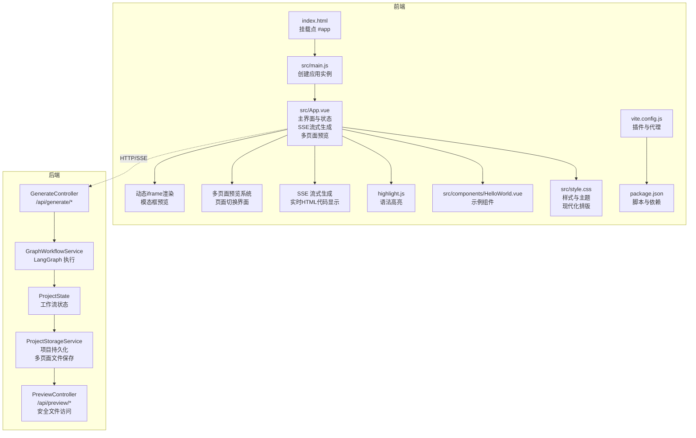
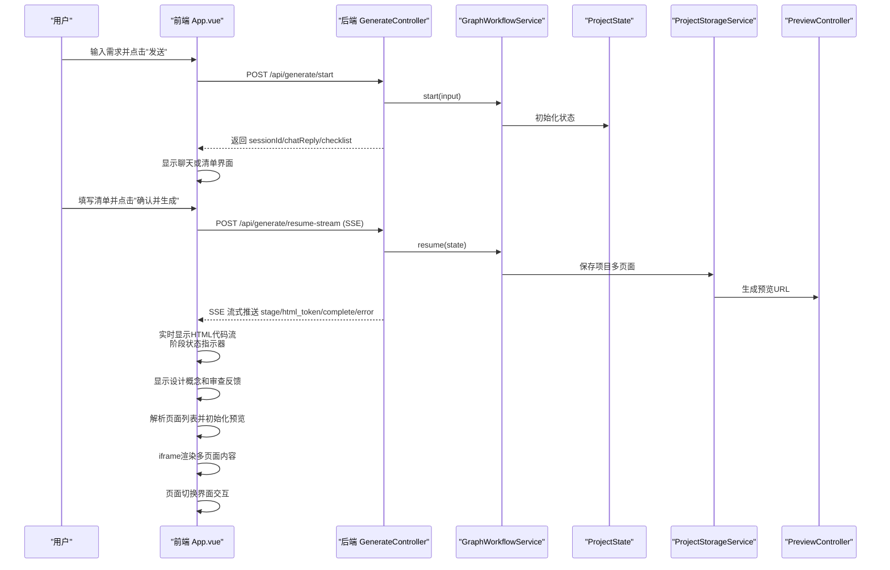
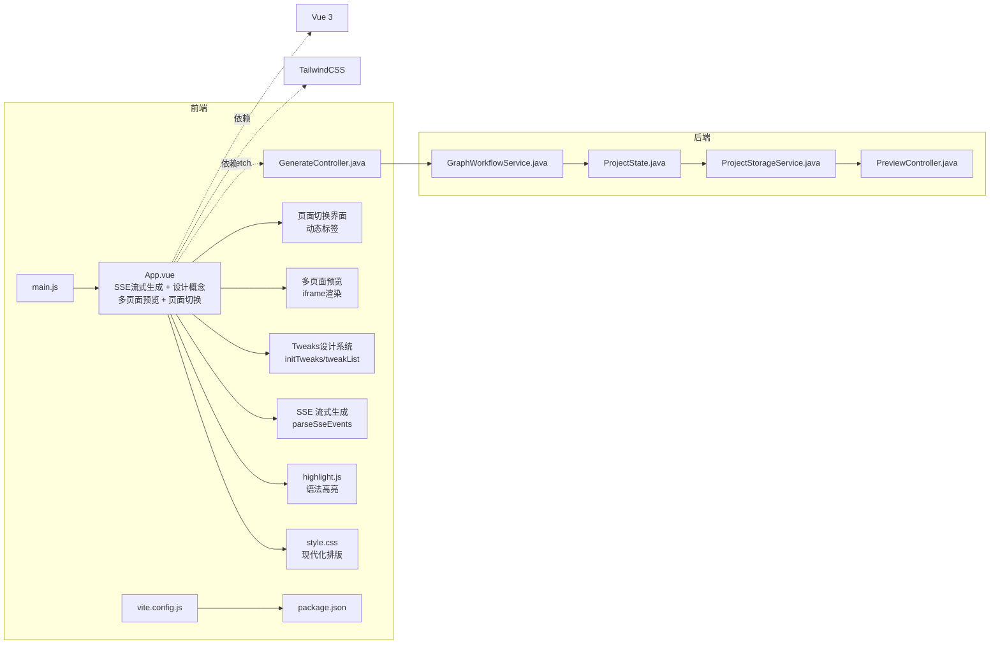

# 前端Vue.js应用

<cite>
**本文档引用的文件**
- [frontend/src/main.js](file://frontend/src/main.js)
- [frontend/src/App.vue](file://frontend/src/App.vue)
- [frontend/src/components/HelloWorld.vue](file://frontend/src/components/HelloWorld.vue)
- [frontend/src/style.css](file://frontend/src/style.css)
- [frontend/index.html](file://frontend/index.html)
- [frontend/vite.config.js](file://frontend/vite.config.js)
- [frontend/package.json](file://frontend/package.json)
- [src/main/java/com/example/websitemother/controller/GenerateController.java](file://src/main/java/com/example/websitemother/controller/GenerateController.java)
- [src/main/java/com/example/websitemother/controller/PreviewController.java](file://src/main/java/com/example/websitemother/controller/PreviewController.java)
- [src/main/java/com/example/websitemother/service/GraphWorkflowService.java](file://src/main/java/com/example/websitemother/service/GraphWorkflowService.java)
- [src/main/java/com/example/websitemother/state/ProjectState.java](file://src/main/java/com/example/websitemother/state/ProjectState.java)
- [src/main/java/com/example/websitemother/service/ProjectStorageService.java](file://src/main/java/com/example/websitemother/service/ProjectStorageService.java)
- [src/main/resources/application.yml](file://src/main/resources/application.yml)
- [pom.xml](file://pom.xml)
- [generated-projects/22c2d1db-bb2f-4eda-8a6c-d03ceb55c6da/index.html](file://generated-projects/22c2d1db-bb2f-4eda-8a6c-d03ceb55c6da/index.html)
- [generated-projects/22c2d1db-bb2f-4eda-8a6c-d03ceb55c6da/meta.json](file://generated-projects/22c2d1db-bb2f-4eda-8a6c-d03ceb55c6da/meta.json)
- [generated-projects/75964816-0b87-4e06-907a-7266e495939c/index.html](file://generated-projects/75964816-0b87-4e06-907a-7266e495939c/index.html)
- [generated-projects/75964816-0b87-4e06-907a-7266e495939c/about.html](file://generated-projects/75964816-0b87-4e06-907a-7266e495939c/about.html)
- [generated-projects/bce3d047-558f-46c0-a346-2b4d08ee7d78/index.html](file://generated-projects/bce3d047-558f-46c0-a346-2b4d08ee7d78/index.html)
- [generated-projects/bce3d047-558f-46c0-a346-2b4d08ee7d78/contact.html](file://generated-projects/bce3d047-558f-46c0-a346-2b4d08ee7d78/contact.html)
</cite>

## 更新摘要
**变更内容**
- 新增多页面网站生成功能：支持多页面HTML项目生成与预览
- 新增页面切换界面：动态生成页面标签，支持多页面导航
- 新增动态iframe渲染：支持iframe预览和模态框放大预览功能
- 新增多页面预览系统：通过PreviewController提供安全的文件访问
- 新增页面列表状态管理：pages和currentPage状态跟踪当前预览页面

## 目录
1. [简介](#简介)
2. [项目结构](#项目结构)
3. [核心组件](#核心组件)
4. [架构总览](#架构总览)
5. [组件详解](#组件详解)
6. [依赖关系分析](#依赖关系分析)
7. [性能与构建优化](#性能与构建优化)
8. [故障排查指南](#故障排查指南)
9. [结论](#结论)
10. [附录](#附录)

## 简介
本项目是一个基于 Vue 3 单文件组件（SFC）的前端应用，配合后端 Spring Boot 服务，实现"零代码网站生成"的完整交互式流程。前端负责用户交互、状态管理与 UI 展示；后端通过 LangGraph 工作流编排 AI 节点，完成从需求理解到 HTML 代码生成与审查的全流程。Vite 作为构建工具，提供快速热更新与代理能力，TailwindCSS 实现响应式与暗色主题支持。

**更新** 项目现已实现四阶段用户界面流程：需求输入→AI对话→清单完成→HTML生成，每个阶段都有明确的加载状态和错误处理机制。前端采用SSE流式生成技术，实时显示HTML代码生成过程，支持设计概念可视化、Tweaks设计系统调节、多页面预览和下载功能。多页面网站生成功能现已完全集成，支持动态页面切换和iframe渲染。

## 项目结构
前端采用典型的 Vue 3 应用目录结构：
- 入口与根组件：main.js、App.vue
- 样式与模板：style.css、index.html
- 构建与依赖：vite.config.js、package.json
- 示例组件：components/HelloWorld.vue
- 后端接口：Spring Boot 控制器与服务层



**图表来源**
- [frontend/index.html:1-14](file://frontend/index.html#L1-L14)
- [frontend/src/main.js:1-6](file://frontend/src/main.js#L1-L6)
- [frontend/src/App.vue:1-790](file://frontend/src/App.vue#L1-L790)
- [frontend/src/style.css:1-275](file://frontend/src/style.css#L1-L275)
- [frontend/src/components/HelloWorld.vue:1-94](file://frontend/src/components/HelloWorld.vue#L1-L94)
- [frontend/vite.config.js:1-17](file://frontend/vite.config.js#L1-L17)
- [frontend/package.json:1-24](file://frontend/package.json#L1-L24)
- [src/main/java/com/example/websitemother/controller/GenerateController.java:1-262](file://src/main/java/com/example/websitemother/controller/GenerateController.java#L1-L262)
- [src/main/java/com/example/websitemother/service/GraphWorkflowService.java:1-60](file://src/main/java/com/example/websitemother/service/GraphWorkflowService.java#L1-L60)
- [src/main/java/com/example/websitemother/state/ProjectState.java:1-78](file://src/main/java/com/example/websitemother/state/ProjectState.java#L1-L78)
- [src/main/java/com/example/websitemother/service/ProjectStorageService.java:1-169](file://src/main/java/com/example/websitemother/service/ProjectStorageService.java#L1-L169)
- [src/main/java/com/example/websitemother/controller/PreviewController.java:1-109](file://src/main/java/com/example/websitemother/controller/PreviewController.java#L1-L109)

**章节来源**
- [frontend/src/main.js:1-6](file://frontend/src/main.js#L1-L6)
- [frontend/src/App.vue:1-790](file://frontend/src/App.vue#L1-L790)
- [frontend/src/style.css:1-275](file://frontend/src/style.css#L1-L275)
- [frontend/index.html:1-14](file://frontend/index.html#L1-L14)
- [frontend/vite.config.js:1-17](file://frontend/vite.config.js#L1-L17)
- [frontend/package.json:1-24](file://frontend/package.json#L1-L24)

## 核心组件
- 应用入口与挂载
  - main.js 创建 Vue 应用实例并挂载到 index.html 的 #app。
- 主界面组件 App.vue
  - 使用组合式 API 管理四阶段状态机（chatting、checklist、generating、result）。
  - 通过 fetch 与后端 /api/generate 接口交互，驱动完整工作流。
  - **新增SSE流式生成**：支持实时HTML代码流式传输和阶段状态显示。
  - **新增设计概念可视化**：解析并显示设计概念的配色方案、字体系统等信息。
  - **新增Tweaks设计系统**：支持动态调节CSS变量，实时预览设计修改。
  - **新增多页面预览**：支持iframe预览和模态框放大预览功能。
  - **新增页面切换界面**：动态生成页面标签，支持多页面导航。
  - **新增代码高亮显示**：使用highlight.js对生成的HTML代码进行语法高亮。
- 示例组件 HelloWorld.vue
  - 展示静态资源引入与基础交互按钮。
- 样式系统
  - style.css 引入 TailwindCSS 并定义深色主题变量与响应式布局。
  - **改进排版**：统一的标题、段落、间距和字体系统，提供现代化的阅读体验。
- 构建与开发服务器
  - vite.config.js 配置 Vue 插件、TailwindCSS 插件与 /api 代理到后端 8080 端口。
  - package.json 提供 dev/build/preview 脚本。

**更新** 新增多页面网站生成功能，包括页面切换界面、动态iframe渲染和多页面预览系统，增强了用户体验和系统功能完整性。

**章节来源**
- [frontend/src/main.js:1-6](file://frontend/src/main.js#L1-L6)
- [frontend/src/App.vue:1-790](file://frontend/src/App.vue#L1-L790)
- [frontend/src/components/HelloWorld.vue:1-94](file://frontend/src/components/HelloWorld.vue#L1-L94)
- [frontend/src/style.css:1-275](file://frontend/src/style.css#L1-L275)
- [frontend/vite.config.js:1-17](file://frontend/vite.config.js#L1-L17)
- [frontend/package.json:1-24](file://frontend/package.json#L1-L24)

## 架构总览
前端与后端通过 REST API 和 SSE 协作，形成"前端交互 + 后端工作流"的分层架构。前端负责 UI 与用户交互，后端负责业务编排与 AI 生成。



**更新** 四阶段流程更加清晰：输入→聊天/清单→SSE流式生成→结果展示，每个阶段都有明确的UI反馈和状态管理。新增了SSE流式生成技术、多页面预览系统和页面切换界面，支持实时HTML代码显示和阶段状态跟踪。

**图表来源**
- [frontend/src/App.vue:156-223](file://frontend/src/App.vue#L156-L223)
- [src/main/java/com/example/websitemother/controller/GenerateController.java:83-144](file://src/main/java/com/example/websitemother/controller/GenerateController.java#L83-L144)
- [src/main/java/com/example/websitemother/service/GraphWorkflowService.java:31-58](file://src/main/java/com/example/websitemother/service/GraphWorkflowService.java#L31-L58)
- [src/main/java/com/example/websitemother/service/ProjectStorageService.java:57-105](file://src/main/java/com/example/websitemother/service/ProjectStorageService.java#L57-L105)
- [src/main/java/com/example/websitemother/controller/PreviewController.java:29-80](file://src/main/java/com/example/websitemother/controller/PreviewController.java#L29-L80)

## 组件详解

### App.vue：四阶段工作流与多页面预览系统
- 状态设计
  - 用户输入、加载态、当前步骤（chatting、checklist、generating、result）
  - 会话 ID、聊天回复、清单数据与答案映射、生成的HTML代码、设计概念、设计令牌
  - 审查结果与重试计数、复制成功提示、SSE流式生成状态
  - Tweaks设计系统调节状态、预览URL、Agent聊天消息流
  - **新增多页面状态**：pages（页面列表）、currentPage（当前选中页面）
  - **新增预览状态**：previewUrl（预览基础URL）、showPreviewModal（模态框显示）
- 方法与流程
  - handleStart：调用 /api/generate/start，根据返回的 intentType 决定下一步是聊天还是清单
  - handleResume：调用 /api/generate/resume-stream（SSE），接收实时HTML代码流和阶段状态
  - SSE事件处理：parseSseEvents解析stage、html_token、complete、error事件
  - **新增页面解析**：从complete事件中提取pages和previewUrl，初始化页面列表
  - reset/copyCode/downloadHtml/handleKeydown：辅助交互
  - **新增Tweaks系统**：initTweaks初始化设计令牌，tweakList动态生成调节面板
  - **新增设计概念解析**：parsedDesignConcept解析JSON格式的设计概念
- 模板结构
  - 分步渲染：输入、聊天、清单表单、SSE流式生成、结果展示与复制
  - **新增侧边栏聊天界面**：显示Agent消息流和执行流程状态
  - **新增大型预览面板**：支持iframe预览和模态框放大预览功能
  - **新增页面切换标签**：动态生成页面列表，支持多页面导航
  - **新增设计概念卡片**：可视化显示配色方案、字体系统等设计信息
  - **新增审查反馈卡片**：显示代码审查结果和改进建议

**更新** 四阶段流程更加完善，包含SSE流式生成、设计概念可视化、Tweaks设计系统调节、多页面预览和页面切换界面功能。UI采用现代化设计，通过侧边栏聊天界面、大型预览面板和页面切换标签提供更好的用户体验。

```mermaid
flowchart TD
S["开始"] --> I["输入步骤<br/>现代化设计"]
I --> |用户点击"发送"| START["调用 /api/generate/start"]
START --> |返回 intentType=chat| CHAT["聊天步骤<br/>Agent消息流"]
START --> |返回 checklist| CHECK["清单步骤<br/>动态表单"]
CHAT --> |继续发送| START
CHECK --> RESUME["调用 /api/generate/resume-stream<br/>SSE流式生成"]
RESUME --> STREAM["SSE流式生成<br/>实时HTML代码显示"]
STREAM --> COMPLETE["complete事件<br/>解析页面列表"]
COMPLETE --> PREVIEW["多页面预览<br/>iframe渲染"]
PREVIEW --> SWITCH["页面切换界面<br/>动态标签"]
PREVIEW --> MODAL["模态框预览<br/>放大查看"]
PREVIEW --> RESULT["结果步骤<br/>设计概念 + 审查反馈"]
RESULT --> DOWNLOAD["下载HTML文件"]
RESULT --> RESET["重新开始"]
RESET --> I
```

**图表来源**
- [frontend/src/App.vue:200-207](file://frontend/src/App.vue#L200-L207)
- [frontend/src/App.vue:674-744](file://frontend/src/App.vue#L674-L744)
- [frontend/src/App.vue:248-271](file://frontend/src/App.vue#L248-L271)
- [frontend/src/App.vue:273-287](file://frontend/src/App.vue#L273-L287)

**章节来源**
- [frontend/src/App.vue:1-790](file://frontend/src/App.vue#L1-L790)

### HelloWorld.vue：示例与静态资源
- 展示如何在 SFC 中使用组合式 API、静态资源导入与基础交互。
- 适合用于学习组件结构与资源路径。

**章节来源**
- [frontend/src/components/HelloWorld.vue:1-94](file://frontend/src/components/HelloWorld.vue#L1-L94)

### 样式与主题：style.css
- 引入 TailwindCSS 并自定义深色主题变量，适配系统偏好。
- 定义响应式断点与组件化布局，如主容器、卡片、列表等。
- **改进排版**：统一的标题层级、段落样式、间距系统和字体配置，提供现代化的阅读体验。

**章节来源**
- [frontend/src/style.css:1-275](file://frontend/src/style.css#L1-L275)

### 构建与开发：vite.config.js 与 package.json
- 插件
  - @vitejs/plugin-vue：支持 Vue SFC
  - @tailwindcss/vite：集成 TailwindCSS
- 代理
  - /api 代理到 http://localhost:8080，便于前后端联调
- 脚本
  - dev/build/preview：本地开发、打包与预览

**章节来源**
- [frontend/vite.config.js:1-17](file://frontend/vite.config.js#L1-L17)
- [frontend/package.json:1-24](file://frontend/package.json#L1-L24)

## 依赖关系分析



**更新** 增加了SSE流式生成、设计概念可视化、Tweaks设计系统、多页面预览和页面切换界面的依赖关系。UI重构增加了现代化设计和多页面预览的支持。

**图表来源**
- [frontend/src/main.js:1-6](file://frontend/src/main.js#L1-L6)
- [frontend/src/App.vue:1-790](file://frontend/src/App.vue#L1-L790)
- [frontend/src/style.css:1-275](file://frontend/src/style.css#L1-L275)
- [frontend/vite.config.js:1-17](file://frontend/vite.config.js#L1-L17)
- [frontend/package.json:1-24](file://frontend/package.json#L1-L24)
- [src/main/java/com/example/websitemother/controller/GenerateController.java:1-262](file://src/main/java/com/example/websitemother/controller/GenerateController.java#L1-L262)
- [src/main/java/com/example/websitemother/service/GraphWorkflowService.java:1-60](file://src/main/java/com/example/websitemother/service/GraphWorkflowService.java#L1-L60)
- [src/main/java/com/example/websitemother/state/ProjectState.java:1-78](file://src/main/java/com/example/websitemother/state/ProjectState.java#L1-L78)
- [src/main/java/com/example/websitemother/service/ProjectStorageService.java:1-169](file://src/main/java/com/example/websitemother/service/ProjectStorageService.java#L1-L169)
- [src/main/java/com/example/websitemother/controller/PreviewController.java:1-109](file://src/main/java/com/example/websitemother/controller/PreviewController.java#L1-L109)

**章节来源**
- [frontend/src/main.js:1-6](file://frontend/src/main.js#L1-L6)
- [frontend/src/App.vue:1-790](file://frontend/src/App.vue#L1-L790)
- [frontend/vite.config.js:1-17](file://frontend/vite.config.js#L1-L17)
- [src/main/java/com/example/websitemother/controller/GenerateController.java:1-262](file://src/main/java/com/example/websitemother/controller/GenerateController.java#L1-L262)
- [src/main/java/com/example/websitemother/service/GraphWorkflowService.java:1-60](file://src/main/java/com/example/websitemother/service/GraphWorkflowService.java#L1-L60)
- [src/main/java/com/example/websitemother/state/ProjectState.java:1-78](file://src/main/java/com/example/websitemother/state/ProjectState.java#L1-L78)
- [src/main/java/com/example/websitemother/service/ProjectStorageService.java:1-169](file://src/main/java/com/example/websitemother/service/ProjectStorageService.java#L1-L169)
- [src/main/java/com/example/websitemother/controller/PreviewController.java:1-109](file://src/main/java/com/example/websitemother/controller/PreviewController.java#L1-L109)

## 性能与构建优化
- Vite 快速冷启动与热更新
  - 使用 @vitejs/plugin-vue 与 @tailwindcss/vite，减少打包体积与编译时间
- SSE流式生成性能优化
  - 使用TextDecoder和流式读取，避免内存溢出
  - 实时事件解析和缓冲区管理，提高SSE处理效率
- 代码高亮按需渲染
  - 在 nextTick 后对结果页代码块进行高亮，避免首屏阻塞
  - 使用highlight.js的按需加载，减少bundle体积
- 样式与主题
  - TailwindCSS 提供原子化样式，减少自定义 CSS 体积；深色主题变量减少重复计算
- 代理与跨域
  - 本地开发通过 /api 代理到后端，避免 CORS 问题
- 多页面预览性能优化
  - **新增iframe懒加载**：仅在需要时加载iframe内容
  - **新增页面缓存**：避免重复渲染相同页面
  - **新增模态框优化**：使用transform替代display切换，提升动画性能
- 生产构建建议
  - 启用压缩与 Tree-shaking（由 Vite 默认开启）
  - 对第三方库进行外部化（如 highlight.js）以减小 bundle 体积
  - 使用 CDN 加速静态资源
- **UI性能优化**：现代化设计采用硬件加速的阴影和过渡效果，提升视觉性能

**更新** 增加了SSE流式生成、设计概念可视化、Tweaks设计系统和多页面预览的性能优化建议，包括iframe懒加载、页面缓存和模态框优化。

**章节来源**
- [frontend/vite.config.js:1-17](file://frontend/vite.config.js#L1-L17)
- [frontend/src/App.vue:167-205](file://frontend/src/App.vue#L167-L205)
- [frontend/src/style.css:1-275](file://frontend/src/style.css#L1-L275)
- [frontend/package.json:1-24](file://frontend/package.json#L1-L24)

## 故障排查指南
- 前端无法访问后端接口
  - 确认 vite.config.js 中 /api 代理是否指向正确地址
  - 检查后端是否在 8080 端口运行
- SSE流式生成异常
  - 检查 /api/generate/resume-stream 接口是否正常返回SSE流
  - 确认parseSseEvents函数是否正确解析stage、html_token、complete、error事件
  - 验证SSE连接是否保持活跃状态
- 生成结果为空或报错
  - 检查后端 GenerateController 是否正确返回 sessionId 与数据
  - 查看 GraphWorkflowService 执行日志，确认 resumeGraph 是否抛出异常
  - 确认ProjectStorageService是否正确保存项目文件（支持多页面）
- 代码高亮不生效
  - 确保在 nextTick 后再调用 highlight.js
  - 检查代码块的 class 与语言标识
- 设计概念解析失败
  - 检查designConcept字段是否为有效的JSON格式
  - 确认parsedDesignConcept计算属性是否正确解析
- Tweaks设计系统异常
  - 检查CSS变量是否存在于:root样式块中
  - 确认tweakList计算属性是否正确提取设计令牌
- 多页面预览功能问题
  - **新增** 检查PreviewController是否正确验证projectId和文件名
  - 确认项目文件是否存在且可访问
  - **新增** 验证页面列表解析是否正确，检查pages状态
  - **新增** 确认iframe渲染是否正常，检查activePreviewUrl计算属性
- 页面切换界面异常
  - **新增** 检查页面列表数据格式，确认extractPageList方法正确解析
  - **新增** 验证currentPage状态是否正确更新
  - **新增** 确认页面切换按钮的事件绑定是否正常
- 预览模态框问题
  - **新增** 检查showPreviewModal状态控制
  - **新增** 验证模态框的点击事件和键盘事件处理
- 样式异常或主题不生效
  - 确认 TailwindCSS 插件已正确安装与配置
  - 检查深色主题变量是否被覆盖
- 加载状态显示异常
  - 检查 loading 状态的设置和重置逻辑
  - 确认异步操作的错误处理机制

**更新** 新增了SSE流式生成、设计概念解析、Tweaks设计系统、多页面预览、页面切换界面和预览模态框的故障排查指南。

**章节来源**
- [frontend/vite.config.js:8-15](file://frontend/vite.config.js#L8-L15)
- [frontend/src/App.vue:156-223](file://frontend/src/App.vue#L156-L223)
- [frontend/src/App.vue:200-207](file://frontend/src/App.vue#L200-L207)
- [src/main/java/com/example/websitemother/controller/GenerateController.java:83-144](file://src/main/java/com/example/websitemother/controller/GenerateController.java#L83-L144)
- [src/main/java/com/example/websitemother/service/GraphWorkflowService.java:31-58](file://src/main/java/com/example/websitemother/service/GraphWorkflowService.java#L31-L58)
- [src/main/java/com/example/websitemother/service/ProjectStorageService.java:57-105](file://src/main/java/com/example/websitemother/service/ProjectStorageService.java#L57-L105)
- [src/main/java/com/example/websitemother/controller/PreviewController.java:29-80](file://src/main/java/com/example/websitemother/controller/PreviewController.java#L29-L80)
- [frontend/src/style.css:11-29](file://frontend/src/style.css#L11-L29)

## 结论
本项目以 Vue 3 + Vite 为基础，结合 Spring Boot 与 LangGraph 工作流，实现了从需求采集到 HTML 代码生成的完整链路。前端通过清晰的状态机与分步 UI，提供了良好的用户体验；后端通过可扩展的工作流节点，支撑了复杂业务编排。整体架构简洁、模块化程度高，具备良好的可维护性与扩展性。

**更新** 四阶段用户界面流程的实现进一步提升了用户体验，SSE流式生成、设计概念可视化、Tweaks设计系统调节、多页面预览和页面切换界面等功能使应用更加健壮和用户友好。现代化的UI设计通过侧边栏聊天界面、大型预览面板和页面切换标签提供更好的交互体验。多页面网站生成功能现已完全集成，支持动态页面切换和iframe渲染，为用户提供完整的多页面网站预览体验。

## 附录

### 后端集成要点
- 接口规范
  - POST /api/generate/start：启动工作流，返回 sessionId、intentType、chatReply、checklist
  - POST /api/generate/resume-stream：SSE流式生成，推送stage、html_token、complete、error事件
  - POST /api/generate/resume：同步版本，返回完整的生成结果（包含多页面信息）
  - GET /api/preview/{projectId}：项目预览静态文件服务（支持多页面）
  - GET /api/preview/{projectId}/{fileName}：获取指定页面文件
- 状态流转
  - GenerateController 负责会话存储与请求转发
  - GraphWorkflowService 封装 startGraph/resumeGraph 的执行
  - ProjectState 作为全局状态载体，贯穿工作流（支持多页面数据）
  - ProjectStorageService 负责项目文件持久化（多页面文件保存）
  - PreviewController 提供多页面网站预览（安全文件访问）

**更新** 四阶段流程的后端支持，包括SSE流式生成接口、多页面项目保存和安全预览功能。

**章节来源**
- [src/main/java/com/example/websitemother/controller/GenerateController.java:54-191](file://src/main/java/com/example/websitemother/controller/GenerateController.java#L54-L191)
- [src/main/java/com/example/websitemother/controller/PreviewController.java:29-80](file://src/main/java/com/example/websitemother/controller/PreviewController.java#L29-L80)
- [src/main/java/com/example/websitemother/service/GraphWorkflowService.java:11-58](file://src/main/java/com/example/websitemother/service/GraphWorkflowService.java#L11-L58)
- [src/main/java/com/example/websitemother/state/ProjectState.java:9-77](file://src/main/java/com/example/websitemother/state/ProjectState.java#L9-L77)
- [src/main/java/com/example/websitemother/service/ProjectStorageService.java:57-105](file://src/main/java/com/example/websitemother/service/ProjectStorageService.java#L57-L105)

### 开发环境搭建与调试
- 安装与启动
  - 前端：npm install → npm run dev（默认监听 5173）
  - 后端：mvn spring-boot:run（默认监听 8080）
- 调试技巧
  - 前端：利用浏览器 DevTools 观察网络请求与状态变化，检查SSE连接状态
  - 后端：查看日志输出，定位 startGraph/resumeGraph 执行异常
  - SSE调试：检查事件流格式和缓冲区处理
  - **新增** 多页面调试：检查页面列表解析和iframe渲染
- 代理配置
  - 若后端端口变更，同步修改 vite.config.js 中的 proxy.target
- **UI调试建议**
  - 使用浏览器开发者工具检查现代化设计的圆角、阴影和内边距
  - 验证SSE流式生成的实时显示效果
  - 测试设计概念卡片的JSON解析和显示
  - 验证Tweaks设计系统的实时调节功能
  - **新增** 测试多页面预览的页面切换功能
  - **新增** 验证iframe渲染的页面加载性能

**更新** 增加了SSE流式生成、设计概念可视化、Tweaks设计系统和多页面预览的调试建议。

**章节来源**
- [frontend/package.json:6-10](file://frontend/package.json#L6-L10)
- [frontend/vite.config.js:8-15](file://frontend/vite.config.js#L8-L15)
- [src/main/resources/application.yml:1-11](file://src/main/resources/application.yml#L1-L11)
- [pom.xml](file://pom.xml)

### 四阶段用户界面流程详解
- 阶段一：需求输入
  - 用户输入网站需求描述
  - 实时验证输入内容
  - 显示加载状态等待AI分析
  - **UI特性**：现代化输入框设计，支持模型选择下拉菜单
- 阶段二：AI对话
  - 展示AI的初步分析和建议
  - 支持多轮对话完善需求
  - 实时加载状态指示分析进度
  - **UI特性**：Agent消息流显示，支持用户消息和AI回复的区分
- 阶段三：清单完成
  - 动态生成需求清单表单
  - 支持文本、文本域、下拉框、多选框等多种输入类型
  - 实时表单验证和错误提示
  - **UI特性**：每个表单项独立卡片，清晰的标签和占位符提示
- 阶段四：HTML生成
  - **新增SSE流式生成**：实时显示HTML代码生成过程
  - **新增设计概念可视化**：解析并显示设计概念的配色方案、字体系统等
  - **新增Tweaks设计系统**：支持动态调节CSS变量，实时预览设计修改
  - **新增多页面预览**：支持iframe预览和模态框放大预览
  - **新增页面切换界面**：动态生成页面标签，支持多页面导航
  - **新增审查反馈**：显示代码审查结果和改进建议
  - 一键复制生成的HTML代码，包含成功状态反馈

**新增** 四阶段用户界面流程的详细技术实现说明，重点描述SSE流式生成、设计概念可视化、Tweaks设计系统、多页面预览和页面切换界面等新功能。

### SSE流式生成技术实现

#### 实时HTML代码流式传输
- **SSE连接建立**：handleResume方法建立到/api/generate/resume-stream的SSE连接
- **流式读取**：使用TextDecoder和流式reader逐块读取SSE事件
- **事件解析**：parseSseEvents函数解析stage、html_token、complete、error事件
- **实时显示**：streamingHtml实时累积HTML片段，currentStage显示当前处理阶段

#### 阶段状态跟踪
- **阶段映射**：asset_collector→正在收集素材...，design_concept→正在生成设计概念...
- **状态指示**：isStageActive判断当前激活阶段，isStageDone判断已完成阶段
- **执行流程卡片**：侧边栏显示完整的执行流程和状态指示

#### 设计概念可视化
- **JSON解析**：parsedDesignConcept计算属性解析设计概念JSON
- **配色方案**：显示主色、辅色、背景色等设计令牌
- **字体系统**：显示标题和正文字体配置
- **布局方向**：显示整体布局设计理念
- **情感氛围**：显示设计的整体情感表达

**章节来源**
- [frontend/src/App.vue:156-223](file://frontend/src/App.vue#L156-L223)
- [frontend/src/App.vue:225-257](file://frontend/src/App.vue#L225-L257)
- [frontend/src/App.vue:65-71](file://frontend/src/App.vue#L65-L71)

### 多页面预览系统与页面切换界面

#### 多页面项目持久化
- **项目保存**：ProjectStorageService.saveProject支持多页面文件保存
- **页面解析**：从ProjectState的PAGES数据中提取页面列表
- **文件写入**：循环保存每个页面的HTML内容到对应文件名
- **回退机制**：若无页面数据，回退到单文件模式保存index.html

#### 预览URL生成与安全访问
- **URL生成**：GenerateController在complete事件中返回previewUrl
- **安全访问**：PreviewController.validate projectId和文件路径
- **文件类型检测**：自动识别HTML、CSS、JS、图片等文件类型
- **回退机制**：HTML文件不存在时回退到index.html

#### 页面切换界面实现
- **状态管理**：pages（页面列表）、currentPage（当前页面）
- **动态标签**：v-for循环生成页面切换按钮
- **样式控制**：当前页面使用深色背景，其他页面使用浅色背景
- **事件处理**：点击按钮更新currentPage状态

#### 动态iframe渲染
- **基础URL**：activePreviewUrl计算属性生成当前页面URL
- **iframe渲染**：src属性绑定activePreviewUrl，srcdoc回退到tweakedHtmlCode
- **模态框预览**：showPreviewModal控制模态框显示，支持全屏预览
- **沙箱安全**：iframe启用allow-scripts和allow-same-origin权限

**章节来源**
- [frontend/src/App.vue:39-46](file://frontend/src/App.vue#L39-L46)
- [frontend/src/App.vue:674-744](file://frontend/src/App.vue#L674-L744)
- [src/main/java/com/example/websitemother/controller/GenerateController.java:185-186](file://src/main/java/com/example/websitemother/controller/GenerateController.java#L185-L186)
- [src/main/java/com/example/websitemother/service/ProjectStorageService.java:65-84](file://src/main/java/com/example/websitemother/service/ProjectStorageService.java#L65-L84)
- [src/main/java/com/example/websitemother/controller/PreviewController.java:29-80](file://src/main/java/com/example/websitemother/controller/PreviewController.java#L29-L80)

### 设计系统与Tweaks功能

#### CSS变量设计系统
- **根变量定义**：:root样式块定义完整的CSS变量设计系统
- **颜色系统**：--color-primary、--color-secondary等主色调变量
- **字体系统**：--font-heading、--font-body等字体变量
- **间距系统**：--space-unit、--space-2等间距变量
- **阴影系统**：--shadow-card、--shadow-hover等阴影变量

#### Tweaks设计系统调节
- **变量提取**：initTweaks函数从CSS变量中提取可调节的设计令牌
- **动态面板**：tweakList计算属性生成Tweaks调节面板
- **实时预览**：tweakedHtmlCode计算属性实时应用设计修改
- **颜色调节**：支持颜色选择器和文本输入两种调节方式

**章节来源**
- [frontend/src/App.vue:284-298](file://frontend/src/App.vue#L284-L298)
- [frontend/src/App.vue：73-92:73-92](file://frontend/src/App.vue#L73-L92)
- [frontend/src/App.vue：53-63:53-63](file://frontend/src/App.vue#L53-L63)

### 生成项目示例分析
- **螺蛳粉官网示例**：展示了完整的现代化设计实现，包括固定导航、Hero全屏沉浸式设计、网格布局等
- **个人摄影网站示例**：包含多页面结构，支持index.html、about.html、gallery.html等页面
- **个人摄影主页示例**：包含多页面结构，支持index.html、about.html、contact.html等页面
- **设计系统应用**：使用CSS变量实现统一的设计风格，支持Tweaks调节
- **响应式布局**：使用现代CSS Grid和Flexbox实现响应式设计
- **交互效果**：包含悬停效果、过渡动画和阴影效果
- **多页面结构**：支持多页面网站生成，包括页面间的导航链接和样式一致性

**章节来源**
- [generated-projects/22c2d1db-bb2f-4eda-8a6c-d03ceb55c6da/index.html:1-200](file://generated-projects/22c2d1db-bb2f-4eda-8a6c-d03ceb55c6da/index.html#L1-L200)
- [generated-projects/22c2d1db-bb2f-4eda-8a6c-d03ceb55c6da/meta.json:1-9](file://generated-projects/22c2d1db-bb2f-4eda-8a6c-d03ceb55c6da/meta.json#L1-L9)
- [generated-projects/75964816-0b87-4e06-907a-7266e495939c/index.html:1-200](file://generated-projects/75964816-0b87-4e06-907a-7266e495939c/index.html#L1-L200)
- [generated-projects/75964816-0b87-4e06-907a-7266e495939c/about.html:1-200](file://generated-projects/75964816-0b87-4e06-907a-7266e495939c/about.html#L1-L200)
- [generated-projects/bce3d047-558f-46c0-a346-2b4d08ee7d78/index.html:1-200](file://generated-projects/bce3d047-558f-46c0-a346-2b4d08ee7d78/index.html#L1-L200)
- [generated-projects/bce3d047-558f-46c0-a346-2b4d08ee7d78/contact.html:1-200](file://generated-projects/bce3d047-558f-46c0-a346-2b4d08ee7d78/contact.html#L1-L200)