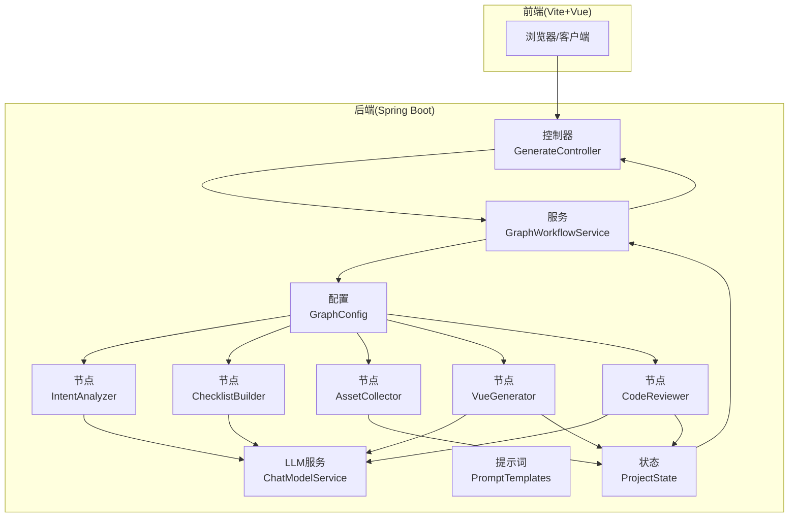
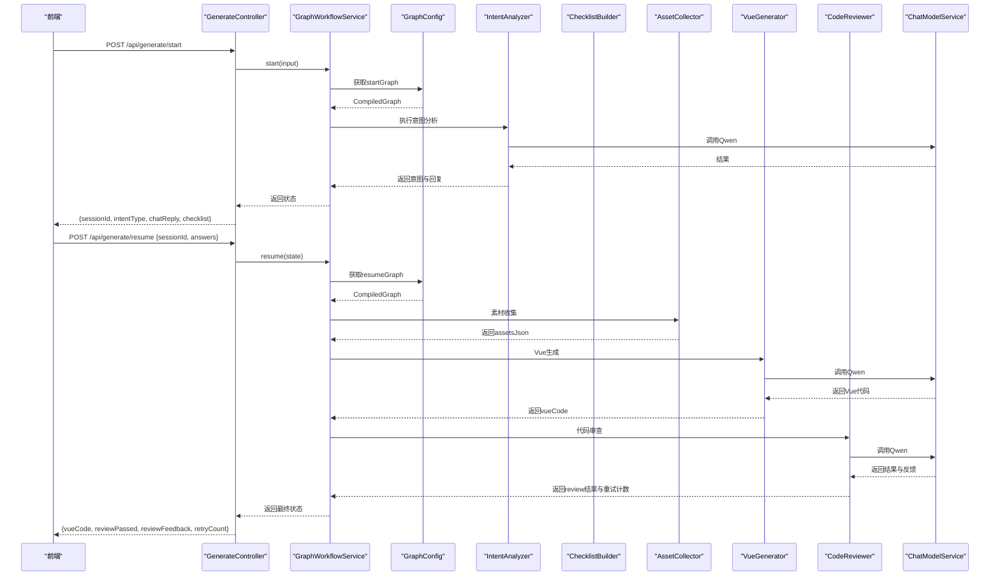
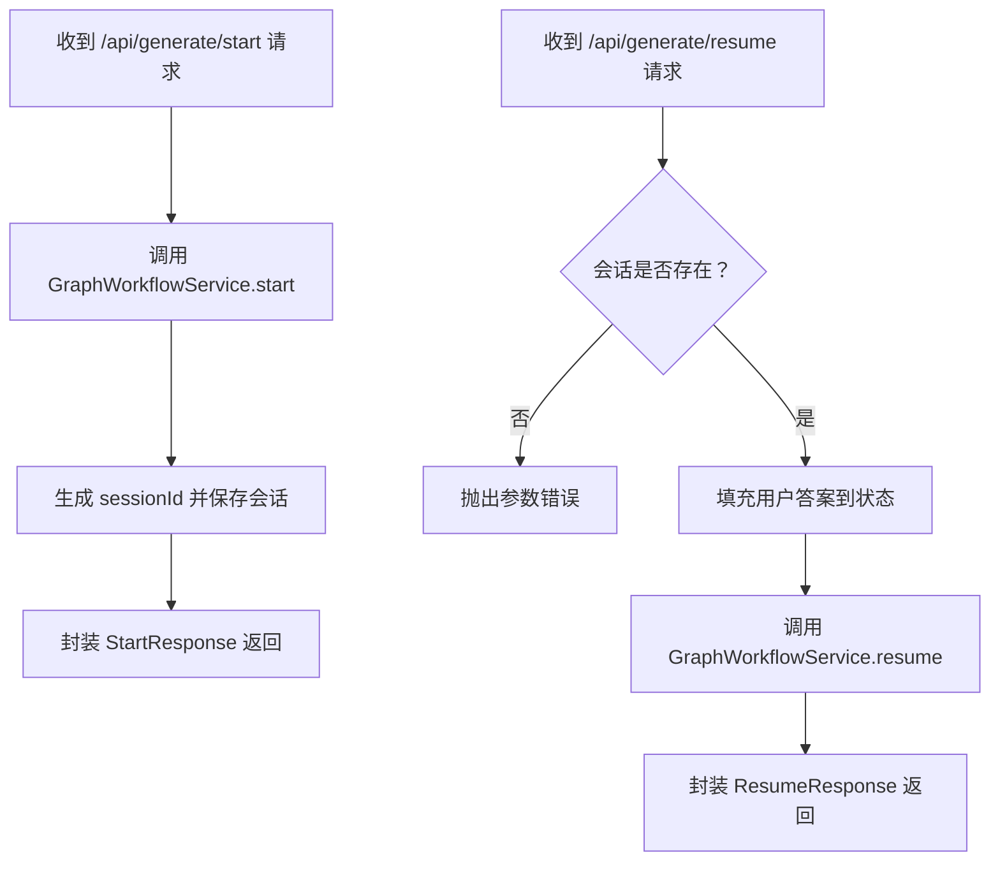
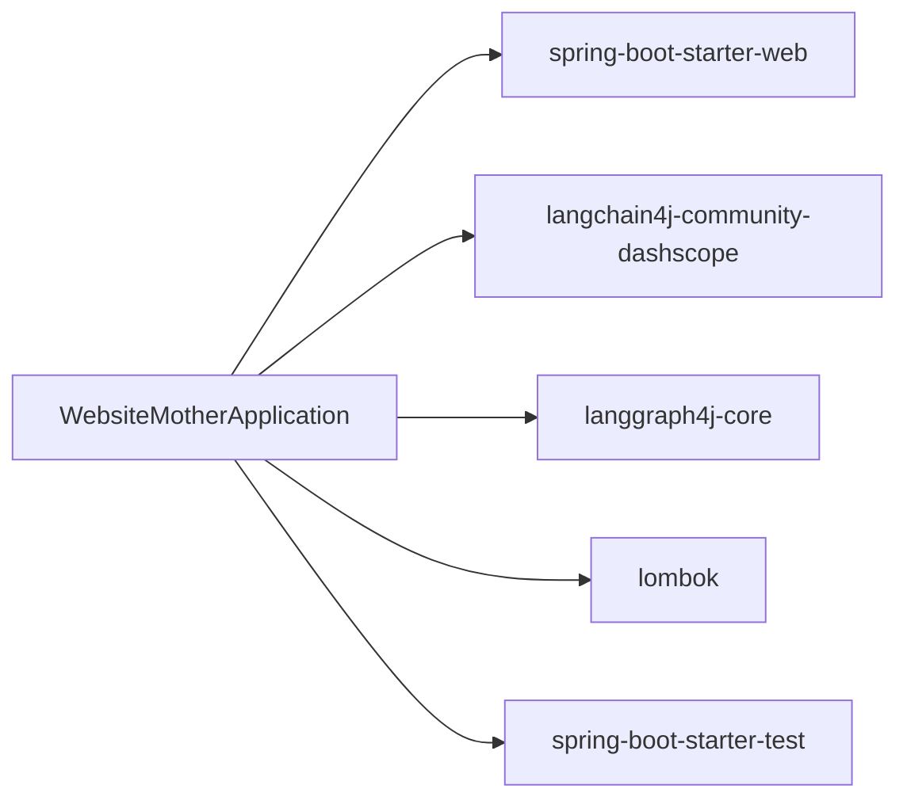

# 开发指南

<cite>
**本文引用的文件**
- [pom.xml](file://pom.xml)
- [WebsiteMotherApplication.java](file://src/main/java/com/example/websitemother/WebsiteMotherApplication.java)
- [application.yml](file://src/main/resources/application.yml)
- [package.json](file://frontend/package.json)
- [GenerateController.java](file://src/main/java/com/example/websitemother/controller/GenerateController.java)
- [GraphWorkflowService.java](file://src/main/java/com/example/websitemother/service/GraphWorkflowService.java)
- [ProjectState.java](file://src/main/java/com/example/websitemother/state/ProjectState.java)
- [GraphConfig.java](file://src/main/java/com/example/websitemother/config/GraphConfig.java)
- [ChatModelService.java](file://src/main/java/com/example/websitemother/service/ChatModelService.java)
- [PromptTemplates.java](file://src/main/java/com/example/websitemother/prompt/PromptTemplates.java)
- [IntentAnalyzer.java](file://src/main/java/com/example/websitemother/node/IntentAnalyzer.java)
- [ChecklistBuilder.java](file://src/main/java/com/example/websitemother/node/ChecklistBuilder.java)
- [AssetCollector.java](file://src/main/java/com/example/websitemother/node/AssetCollector.java)
- [VueGenerator.java](file://src/main/java/com/example/websitemother/node/VueGenerator.java)
- [CodeReviewer.java](file://src/main/java/com/example/websitemother/node/CodeReviewer.java)
</cite>

## 目录
1. [简介](#简介)
2. [项目结构](#项目结构)
3. [核心组件](#核心组件)
4. [架构总览](#架构总览)
5. [详细组件分析](#详细组件分析)
6. [依赖分析](#依赖分析)
7. [性能考虑](#性能考虑)
8. [故障排查指南](#故障排查指南)
9. [结论](#结论)
10. [附录](#附录)

## 简介
本指南面向WebsiteMother项目的开发者，提供从环境搭建、代码规范、版本控制到开发流程、测试策略、代码评审、调试与排错、扩展与插件机制的全流程说明。项目采用Spring Boot后端与Vue前端分离的架构，结合LangGraph4j实现状态化工作流，通过DashScope Qwen模型完成意图分析、需求清单生成、素材收集、Vue代码生成与代码审查。

## 项目结构
项目采用多模块分层组织：
- 后端（Spring Boot）
  - controller：对外API入口，负责请求解析与响应封装
  - service：业务服务编排，封装工作流执行
  - state：工作流全局状态载体
  - node：LangGraph节点实现（意图分析、清单生成、素材收集、Vue生成、代码审查）
  - prompt：统一的提示词模板
  - config：LangGraph状态图装配
  - resources：应用配置与静态资源
- 前端（Vite + Vue 3）
  - 使用Vite构建，集成TailwindCSS与Vue生态

图表来源
- [GenerateController.java:1-115](file://src/main/java/com/example/websitemother/controller/GenerateController.java#L1-L115)
- [GraphWorkflowService.java:1-60](file://src/main/java/com/example/websitemother/service/GraphWorkflowService.java#L1-L60)
- [GraphConfig.java:1-99](file://src/main/java/com/example/websitemother/config/GraphConfig.java#L1-L99)
- [ProjectState.java:1-78](file://src/main/java/com/example/websitemother/state/ProjectState.java#L1-L78)
- [IntentAnalyzer.java:1-61](file://src/main/java/com/example/websitemother/node/IntentAnalyzer.java#L1-L61)
- [ChecklistBuilder.java:1-51](file://src/main/java/com/example/websitemother/node/ChecklistBuilder.java#L1-L51)
- [AssetCollector.java:1-89](file://src/main/java/com/example/websitemother/node/AssetCollector.java#L1-L89)
- [VueGenerator.java:1-64](file://src/main/java/com/example/websitemother/node/VueGenerator.java#L1-L64)
- [CodeReviewer.java:1-61](file://src/main/java/com/example/websitemother/node/CodeReviewer.java#L1-L61)
- [ChatModelService.java:1-58](file://src/main/java/com/example/websitemother/service/ChatModelService.java#L1-L58)
- [PromptTemplates.java:1-93](file://src/main/java/com/example/websitemother/prompt/PromptTemplates.java#L1-L93)

章节来源
- [pom.xml:1-115](file://pom.xml#L1-L115)
- [WebsiteMotherApplication.java:1-14](file://src/main/java/com/example/websitemother/WebsiteMotherApplication.java#L1-L14)
- [application.yml:1-9](file://src/main/resources/application.yml#L1-L9)
- [package.json:1-24](file://frontend/package.json#L1-L24)

## 核心组件
- 应用入口与配置
  - 应用入口类负责启动Spring Boot应用
  - 应用配置文件定义应用名称与DashScope模型参数
- 控制器
  - 对外暴露两组API：启动工作流与继续工作流，并在内存中维护会话状态
- 服务层
  - 工作流服务封装LangGraph执行，分别处理“开始”和“恢复”阶段
- 状态模型
  - ProjectState作为全局状态容器，承载当前输入、意图类型、聊天回复、清单、用户答案、素材、Vue代码、审查结果与重试次数等键值
- 节点与提示词
  - 各节点实现NodeAction接口，按顺序执行意图分析、清单生成、素材收集、Vue生成、代码审查
  - PromptTemplates集中管理各Agent的系统提示与用户提示
- LLM服务
  - ChatModelService封装DashScope Qwen模型调用，统一消息组装与异常处理

章节来源
- [WebsiteMotherApplication.java:1-14](file://src/main/java/com/example/websitemother/WebsiteMotherApplication.java#L1-L14)
- [application.yml:1-9](file://src/main/resources/application.yml#L1-L9)
- [GenerateController.java:1-115](file://src/main/java/com/example/websitemother/controller/GenerateController.java#L1-L115)
- [GraphWorkflowService.java:1-60](file://src/main/java/com/example/websitemother/service/GraphWorkflowService.java#L1-L60)
- [ProjectState.java:1-78](file://src/main/java/com/example/websitemother/state/ProjectState.java#L1-L78)
- [PromptTemplates.java:1-93](file://src/main/java/com/example/websitemother/prompt/PromptTemplates.java#L1-L93)
- [ChatModelService.java:1-58](file://src/main/java/com/example/websitemother/service/ChatModelService.java#L1-L58)

## 架构总览
后端通过LangGraph4j的状态图驱动工作流，前后端通过REST API交互。前端负责用户交互与展示，后端负责AI推理与状态流转。

图表来源
- [GenerateController.java:1-115](file://src/main/java/com/example/websitemother/controller/GenerateController.java#L1-L115)
- [GraphWorkflowService.java:1-60](file://src/main/java/com/example/websitemother/service/GraphWorkflowService.java#L1-L60)
- [GraphConfig.java:1-99](file://src/main/java/com/example/websitemother/config/GraphConfig.java#L1-L99)
- [IntentAnalyzer.java:1-61](file://src/main/java/com/example/websitemother/node/IntentAnalyzer.java#L1-L61)
- [ChecklistBuilder.java:1-51](file://src/main/java/com/example/websitemother/node/ChecklistBuilder.java#L1-L51)
- [AssetCollector.java:1-89](file://src/main/java/com/example/websitemother/node/AssetCollector.java#L1-L89)
- [VueGenerator.java:1-64](file://src/main/java/com/example/websitemother/node/VueGenerator.java#L1-L64)
- [CodeReviewer.java:1-61](file://src/main/java/com/example/websitemother/node/CodeReviewer.java#L1-L61)
- [ChatModelService.java:1-58](file://src/main/java/com/example/websitemother/service/ChatModelService.java#L1-L58)

## 详细组件分析

### 控制器：GenerateController
- 职责
  - 提供启动与继续两个API，封装会话状态（内存级，生产需替换为Redis）
  - 将LLM输出映射为响应DTO
- 关键流程
  - 启动：接收输入，调用工作流服务，生成sessionId并返回意图/清单
  - 继续：校验会话，填充用户答案，执行第二阶段工作流，返回Vue代码与审查结果

图表来源
- [GenerateController.java:1-115](file://src/main/java/com/example/websitemother/controller/GenerateController.java#L1-L115)

章节来源
- [GenerateController.java:1-115](file://src/main/java/com/example/websitemother/controller/GenerateController.java#L1-L115)

### 服务层：GraphWorkflowService
- 职责
  - 以CompiledGraph形式执行LangGraph工作流
  - start阶段：意图分析+清单生成
  - resume阶段：素材收集+Vue生成+代码审查循环
- 异常处理
  - 对工作流执行异常进行捕获与包装，便于上层统一处理

章节来源
- [GraphWorkflowService.java:1-60](file://src/main/java/com/example/websitemother/service/GraphWorkflowService.java#L1-L60)

### 状态模型：ProjectState
- 职责
  - 统一承载工作流中的所有键值，提供类型安全的读取方法
- 关键键
  - 当前输入、意图类型、聊天回复、清单、用户答案、素材JSON、Vue代码、审查结果、重试次数等

章节来源
- [ProjectState.java:1-78](file://src/main/java/com/example/websitemother/state/ProjectState.java#L1-L78)

### LangGraph配置：GraphConfig
- 职责
  - 组装两个状态图：startGraph与resumeGraph
  - startGraph：意图分析 → 清单生成（条件路由：chat结束，create进入清单生成）
  - resumeGraph：素材收集 → Vue生成 → 代码审查（条件路由：通过则结束，不通过回到Vue生成）

章节来源
- [GraphConfig.java:1-99](file://src/main/java/com/example/websitemother/config/GraphConfig.java#L1-L99)

### 节点实现
- 意图分析：IntentAnalyzer
  - 输入：当前输入
  - 输出：意图类型与可选回复
- 清单生成：ChecklistBuilder
  - 输入：当前输入
  - 输出：JSON格式的清单
- 素材收集：AssetCollector
  - 输入：用户答案
  - 输出：素材JSON（包含URL、描述、关键词）
- Vue生成：VueGenerator
  - 输入：需求、素材、审查反馈
  - 输出：Vue单文件组件代码
- 代码审查：CodeReviewer
  - 输入：Vue代码
  - 输出：审查结果与反馈，以及重试计数

章节来源
- [IntentAnalyzer.java:1-61](file://src/main/java/com/example/websitemother/node/IntentAnalyzer.java#L1-L61)
- [ChecklistBuilder.java:1-51](file://src/main/java/com/example/websitemother/node/ChecklistBuilder.java#L1-L51)
- [AssetCollector.java:1-89](file://src/main/java/com/example/websitemother/node/AssetCollector.java#L1-L89)
- [VueGenerator.java:1-64](file://src/main/java/com/example/websitemother/node/VueGenerator.java#L1-L64)
- [CodeReviewer.java:1-61](file://src/main/java/com/example/websitemother/node/CodeReviewer.java#L1-L61)

### 提示词模板：PromptTemplates
- 职责
  - 集中管理各节点的系统提示与用户提示，便于统一维护与优化
- 节点对应模板
  - 意图分析、清单生成、Vue生成、代码审查

章节来源
- [PromptTemplates.java:1-93](file://src/main/java/com/example/websitemother/prompt/PromptTemplates.java#L1-L93)

### LLM服务：ChatModelService
- 职责
  - 封装DashScope Qwen模型调用，统一SystemMessage与UserMessage组装
  - 提供简化调用接口

章节来源
- [ChatModelService.java:1-58](file://src/main/java/com/example/websitemother/service/ChatModelService.java#L1-L58)

## 依赖分析
- 后端依赖
  - Spring Boot Web：提供Web框架与嵌入式服务器
  - langchain4j-community-dashscope：集成DashScope Qwen模型
  - langgraph4j-core：状态图与工作流执行
  - Lombok：减少样板代码
  - 测试：Spring Boot Starter Test
- 前端依赖
  - Vue 3、Vite、TailwindCSS、highlight.js等

图表来源
- [pom.xml:1-115](file://pom.xml#L1-L115)
- [WebsiteMotherApplication.java:1-14](file://src/main/java/com/example/websitemother/WebsiteMotherApplication.java#L1-L14)

章节来源
- [pom.xml:1-115](file://pom.xml#L1-L115)

## 性能考虑
- 会话存储
  - 当前使用内存存储，适合开发与演示；生产环境建议迁移到Redis，支持水平扩展与持久化
- LLM调用
  - 控制台日志记录响应文本，建议在生产关闭或降级日志级别，避免敏感信息泄露
- 工作流并发
  - LangGraph节点默认异步执行，注意避免共享状态竞争；必要时在节点内部加锁或使用不可变数据结构
- 前端构建
  - 生产构建开启压缩与Tree Shaking，确保包体最小化

## 故障排查指南
- API调用失败
  - 检查会话ID是否有效；确认GenerateController中会话存储逻辑
  - 查看GraphWorkflowService异常日志，定位工作流执行失败位置
- LLM调用异常
  - 检查ChatModelService的日志与异常栈；确认DashScope API Key与模型名称配置
- Vue生成异常
  - 检查PromptTemplates中Vue生成模板是否被修改；确认审查节点返回的反馈是否触发了重试循环
- 状态不一致
  - 检查ProjectState键值是否被正确更新；核对各节点返回的键集合

章节来源
- [GenerateController.java:1-115](file://src/main/java/com/example/websitemother/controller/GenerateController.java#L1-L115)
- [GraphWorkflowService.java:1-60](file://src/main/java/com/example/websitemother/service/GraphWorkflowService.java#L1-L60)
- [ChatModelService.java:1-58](file://src/main/java/com/example/websitemother/service/ChatModelService.java#L1-L58)
- [ProjectState.java:1-78](file://src/main/java/com/example/websitemother/state/ProjectState.java#L1-L78)

## 结论
WebsiteMother通过LangGraph4j实现了清晰的工作流编排，结合DashScope Qwen模型完成了从意图分析到Vue代码生成的自动化流程。建议在开发阶段遵循本文档的开发与测试规范，生产阶段完善会话存储与日志策略，并持续优化提示词模板以提升生成质量。

## 附录

### 开发环境搭建
- Java与Maven
  - JDK版本：21
  - Maven：使用项目自带的wrapper脚本
- IDE建议
  - IntelliJ IDEA：启用Lombok注解处理与Spring Boot插件
  - VS Code：安装Java扩展包与Spring Boot扩展
- 前端环境
  - Node.js：安装依赖后运行开发服务器
  - 构建与预览命令见前端package.json脚本

章节来源
- [pom.xml:1-115](file://pom.xml#L1-L115)
- [package.json:1-24](file://frontend/package.json#L1-L24)

### 代码规范与版本控制最佳实践
- 代码规范
  - 使用Lombok减少样板代码，保持类简洁
  - 控制器与服务层职责清晰，避免在控制器中直接操作状态
  - 日志记录遵循“请求入口-内部处理-响应返回”的层次
- 版本控制
  - 分支策略：主分支保护，特性分支开发，合并前进行代码评审
  - 提交信息：采用“类型(作用域): 描述”的格式，如feat(controller): 新增会话清理逻辑
  - 大文件与敏感信息：确保不在仓库中提交API Key与构建产物

### 新增AI节点开发流程
- 步骤
  - 在node包中新增实现NodeAction的类，定义apply方法
  - 在prompt包中新增或调整提示词模板
  - 在GraphConfig中注册节点与边，确保状态键正确传递
  - 在控制器或服务层调用链中接入新节点
- 注意事项
  - 明确输入/输出状态键，避免遗漏
  - 对LLM输出进行严格解析与清洗
  - 编写单元测试验证节点行为

章节来源
- [GraphConfig.java:1-99](file://src/main/java/com/example/websitemother/config/GraphConfig.java#L1-L99)
- [PromptTemplates.java:1-93](file://src/main/java/com/example/websitemother/prompt/PromptTemplates.java#L1-L93)
- [IntentAnalyzer.java:1-61](file://src/main/java/com/example/websitemother/node/IntentAnalyzer.java#L1-L61)

### 扩展API接口开发流程
- 步骤
  - 在controller包中新增或扩展现有控制器方法
  - 设计请求/响应DTO，确保字段与状态模型一致
  - 在GraphWorkflowService中新增或复用现有工作流
  - 在GraphConfig中调整状态图以适配新流程
- 注意事项
  - 保持幂等性与可回滚性
  - 对会话状态进行安全校验

章节来源
- [GenerateController.java:1-115](file://src/main/java/com/example/websitemother/controller/GenerateController.java#L1-L115)
- [GraphWorkflowService.java:1-60](file://src/main/java/com/example/websitemother/service/GraphWorkflowService.java#L1-L60)
- [GraphConfig.java:1-99](file://src/main/java/com/example/websitemother/config/GraphConfig.java#L1-L99)

### 修改工作流的开发流程
- 步骤
  - 在GraphConfig中调整节点顺序与条件边
  - 确认状态键在各节点间正确传递
  - 对新增或变更的节点编写单元测试
- 注意事项
  - 条件路由需覆盖所有分支
  - 重试与终止逻辑要清晰

章节来源
- [GraphConfig.java:1-99](file://src/main/java/com/example/websitemother/config/GraphConfig.java#L1-L99)
- [ProjectState.java:1-78](file://src/main/java/com/example/websitemother/state/ProjectState.java#L1-L78)

### 单元测试与集成测试
- 单元测试
  - 针对节点类：Mock ChatModelService，验证apply方法的输入输出与状态键
  - 针对服务类：Mock CompiledGraph，验证start/resume的执行与异常处理
  - 针对控制器：Mock GraphWorkflowService，验证请求解析与响应封装
- 集成测试
  - 使用Spring Boot Test启动完整上下文，验证端到端流程
  - 覆盖会话生命周期：start → resume → 多次审查循环
- 覆盖率要求
  - 建议关键路径与异常分支覆盖率≥80%，核心节点≥90%

章节来源
- [GraphWorkflowService.java:1-60](file://src/main/java/com/example/websitemother/service/GraphWorkflowService.java#L1-L60)
- [GenerateController.java:1-115](file://src/main/java/com/example/websitemother/controller/GenerateController.java#L1-L115)
- [ChatModelService.java:1-58](file://src/main/java/com/example/websitemother/service/ChatModelService.java#L1-L58)

### 代码评审标准与流程
- 标准
  - 代码可读性与一致性
  - 状态键命名与传递是否规范
  - LLM提示词是否清晰、可维护
  - 错误处理与日志记录是否充分
  - 测试覆盖与边界条件
- 流程
  - 提交PR前自测
  - 指定至少一名Reviewer进行同行评审
  - 修复问题后重新评审直至通过

### 调试技巧与问题排查
- 后端
  - 启用DEBUG日志查看LLM响应与工作流状态
  - 使用断点定位节点执行与状态更新
- 前端
  - 使用浏览器开发者工具查看网络请求与响应
  - 校验会话ID与状态键在前后端的一致性

### 扩展点与插件机制
- 提示词模板扩展
  - 通过PromptTemplates集中管理，便于A/B测试与灰度发布
- LangGraph节点扩展
  - 通过实现NodeAction接口即可接入工作流
- LLM提供商切换
  - 通过ChatModelService抽象，可在不改动上层的情况下切换模型

章节来源
- [PromptTemplates.java:1-93](file://src/main/java/com/example/websitemother/prompt/PromptTemplates.java#L1-L93)
- [GraphConfig.java:1-99](file://src/main/java/com/example/websitemother/config/GraphConfig.java#L1-L99)
- [ChatModelService.java:1-58](file://src/main/java/com/example/websitemother/service/ChatModelService.java#L1-L58)

### 快速上手指南
- 后端
  - 使用Maven Wrapper启动应用
  - 访问API：启动与继续接口
- 前端
  - 安装依赖后运行开发服务器
  - 构建与预览命令参考package.json脚本

章节来源
- [pom.xml:1-115](file://pom.xml#L1-L115)
- [package.json:1-24](file://frontend/package.json#L1-L24)
- [application.yml:1-9](file://src/main/resources/application.yml#L1-L9)