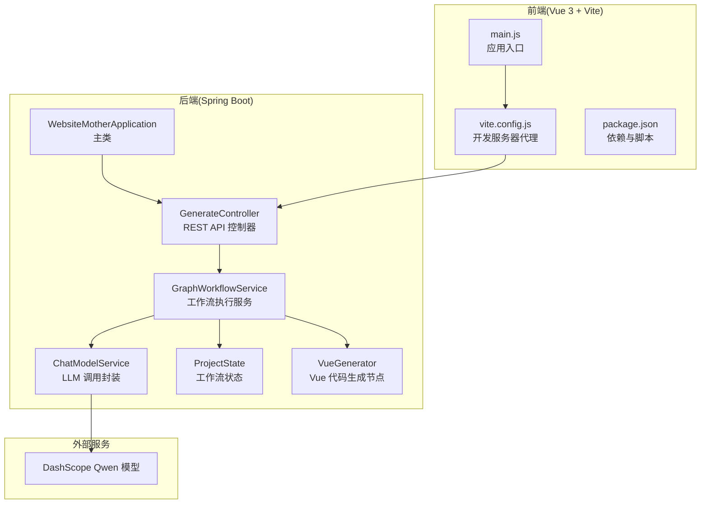
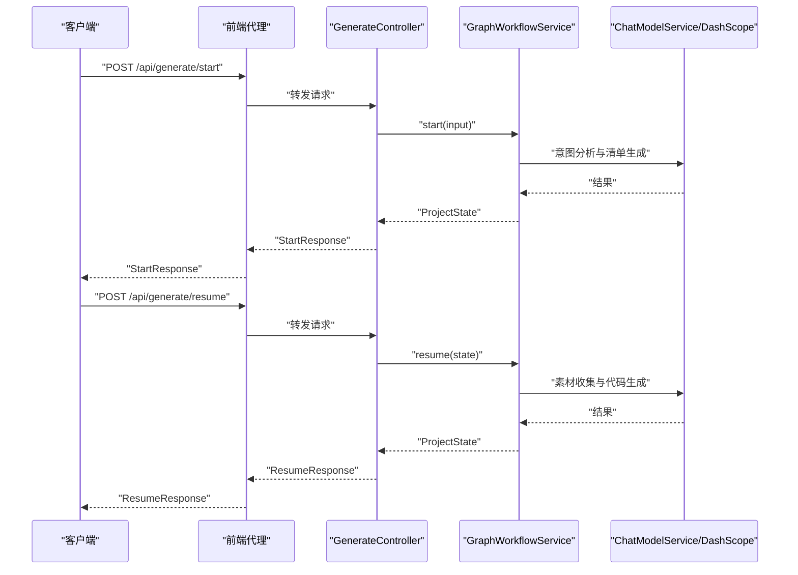

# 快速开始

<cite>
**本文引用的文件**
- [pom.xml](file://pom.xml)
- [application.yml](file://src/main/resources/application.yml)
- [WebsiteMotherApplication.java](file://src/main/java/com/example/websitemother/WebsiteMotherApplication.java)
- [GenerateController.java](file://src/main/java/com/example/websitemother/controller/GenerateController.java)
- [ChatModelService.java](file://src/main/java/com/example/websitemother/service/ChatModelService.java)
- [GraphWorkflowService.java](file://src/main/java/com/example/websitemother/service/GraphWorkflowService.java)
- [ProjectState.java](file://src/main/java/com/example/websitemother/state/ProjectState.java)
- [VueGenerator.java](file://src/main/java/com/example/websitemother/node/VueGenerator.java)
- [vite.config.js](file://frontend/vite.config.js)
- [package.json](file://frontend/package.json)
- [main.js](file://frontend/src/main.js)
</cite>

## 目录
1. [简介](#简介)
2. [项目结构](#项目结构)
3. [环境准备](#环境准备)
4. [安装与配置](#安装与配置)
5. [启动步骤](#启动步骤)
6. [API 接口快速测试](#api-接口快速测试)
7. [配置项详解](#配置项详解)
8. [开发与生产环境差异](#开发与生产环境差异)
9. [常见问题与故障排除](#常见问题与故障排除)
10. [性能与优化建议](#性能与优化建议)
11. [结语](#结语)

## 简介
WebsiteMother 是一个基于 Spring Boot + Vue.js 的 AI 网站生成系统，通过 LangChain4j 与 DashScope 的 Qwen 模型集成，实现从用户需求到完整 Vue 单文件组件的自动化生成。系统采用 LangGraph 工作流管理生成流程，支持“意图分析 + 清单收集 + 素材生成 + Vue 代码生成 + 代码审查”的多阶段流程。

本快速开始指南将帮助你在 30 分钟内完成环境准备、项目启动与核心功能体验，并提供 API 测试、配置说明与故障排除建议。

## 项目结构
项目采用前后端分离架构：
- 后端：Spring Boot 应用，提供 REST API 与 AI 工作流执行
- 前端：Vue 3 + Vite 应用，提供交互界面与代码展示
- 配置：Spring Boot YAML 配置文件与 Vite 开发服务器代理

图表来源
- [WebsiteMotherApplication.java:1-14](file://src/main/java/com/example/websitemother/WebsiteMotherApplication.java#L1-L14)
- [GenerateController.java:1-115](file://src/main/java/com/example/websitemother/controller/GenerateController.java#L1-L115)
- [GraphWorkflowService.java:1-60](file://src/main/java/com/example/websitemother/service/GraphWorkflowService.java#L1-L60)
- [ChatModelService.java:1-58](file://src/main/java/com/example/websitemother/service/ChatModelService.java#L1-L58)
- [ProjectState.java:1-78](file://src/main/java/com/example/websitemother/state/ProjectState.java#L1-L78)
- [VueGenerator.java:1-64](file://src/main/java/com/example/websitemother/node/VueGenerator.java#L1-L64)
- [main.js:1-6](file://frontend/src/main.js#L1-L6)
- [vite.config.js:1-17](file://frontend/vite.config.js#L1-L17)
- [package.json:1-24](file://frontend/package.json#L1-L24)

章节来源
- [pom.xml:1-115](file://pom.xml#L1-L115)
- [application.yml:1-9](file://src/main/resources/application.yml#L1-L9)
- [vite.config.js:1-17](file://frontend/vite.config.js#L1-L17)
- [package.json:1-24](file://frontend/package.json#L1-L24)

## 环境准备
为确保顺利运行项目，请准备以下工具与环境：
- JDK 21：用于编译与运行 Spring Boot 后端
- Maven：用于构建后端项目
- Node.js 18+：用于安装前端依赖与启动开发服务器
- Git：用于克隆仓库
- 文本编辑器或 IDE：如 VS Code、IntelliJ IDEA

章节来源
- [pom.xml:29-31](file://pom.xml#L29-L31)
- [package.json:1-24](file://frontend/package.json#L1-L24)

## 安装与配置
### 1) 克隆项目
使用 Git 将项目克隆到本地目录。

章节来源
- [pom.xml:1-115](file://pom.xml#L1-L115)

### 2) 后端依赖安装与构建
- 进入项目根目录，使用 Maven 构建后端：
  - Windows: 使用 Maven Wrapper 命令进行构建
  - Linux/macOS: 使用 Maven Wrapper 命令进行构建

章节来源
- [pom.xml:61-112](file://pom.xml#L61-L112)

### 3) 前端依赖安装
- 在 frontend 目录下安装依赖：
  - 使用 npm 或 yarn 安装依赖

章节来源
- [package.json:1-24](file://frontend/package.json#L1-L24)

### 4) 配置 DashScope API 密钥
- 打开后端配置文件，修改 DashScope API 密钥与模型名称：
  - 文件路径：src/main/resources/application.yml
  - 修改项：langchain4j.community.dashscope.chat-model.api-key 与 model-name

章节来源
- [application.yml:1-9](file://src/main/resources/application.yml#L1-L9)

### 5) 配置前端开发服务器代理
- 打开前端配置文件，确认开发服务器代理指向后端地址：
  - 文件路径：frontend/vite.config.js
  - 确认代理目标为 http://localhost:8080

章节来源
- [vite.config.js:1-17](file://frontend/vite.config.js#L1-L17)

## 启动步骤
### 启动后端 Spring Boot 应用
- 使用 Maven 启动后端：
  - Windows: 使用 Maven Wrapper 命令启动
  - Linux/macOS: 使用 Maven Wrapper 命令启动
- 默认端口：8080

章节来源
- [WebsiteMotherApplication.java:1-14](file://src/main/java/com/example/websitemother/WebsiteMotherApplication.java#L1-L14)
- [pom.xml:61-74](file://pom.xml#L61-L74)

### 启动前端 Vue 应用
- 在 frontend 目录下启动开发服务器：
  - 使用 npm 或 yarn 启动开发服务器
- 默认端口：5173
- 访问地址：http://localhost:5173

章节来源
- [package.json:6-10](file://frontend/package.json#L6-L10)
- [vite.config.js:8-15](file://frontend/vite.config.js#L8-L15)
- [main.js:1-6](file://frontend/src/main.js#L1-L6)

## API 接口快速测试
系统提供两个核心 API，用于启动与继续生成流程。以下为使用 curl 的示例，也可在 Postman 中导入并测试。

- 启动生成流程
  - 方法：POST
  - 地址：http://localhost:5173/api/generate/start
  - 请求体：包含用户输入字段
  - 返回：会话 ID、意图类型、聊天回复、清单内容

- 继续生成流程
  - 方法：POST
  - 地址：http://localhost:5173/api/generate/resume
  - 请求体：包含会话 ID 与用户答案映射
  - 返回：Vue 代码、审查结果、反馈与重试次数

图表来源
- [GenerateController.java:33-84](file://src/main/java/com/example/websitemother/controller/GenerateController.java#L33-L84)
- [GraphWorkflowService.java:31-58](file://src/main/java/com/example/websitemother/service/GraphWorkflowService.java#L31-L58)
- [ChatModelService.java:33-49](file://src/main/java/com/example/websitemother/service/ChatModelService.java#L33-L49)

章节来源
- [GenerateController.java:14-84](file://src/main/java/com/example/websitemother/controller/GenerateController.java#L14-L84)

## 配置项详解
- DashScope API 密钥
  - 位置：src/main/resources/application.yml
  - 作用：用于调用 DashScope Qwen 模型
  - 注意：请替换为你的有效密钥

- 模型名称
  - 位置：src/main/resources/application.yml
  - 作用：指定使用的 DashScope 模型版本

- 前端代理
  - 位置：frontend/vite.config.js
  - 作用：将 /api 前缀的请求代理到后端 8080 端口

- 后端端口
  - 位置：Spring Boot 默认端口 8080
  - 作用：后端 REST API 服务端口

章节来源
- [application.yml:1-9](file://src/main/resources/application.yml#L1-L9)
- [vite.config.js:8-15](file://frontend/vite.config.js#L8-L15)

## 开发与生产环境差异
- 开发环境
  - 前端：Vite 开发服务器，热更新，代理到后端 8080
  - 后端：Spring Boot 默认端口 8080
  - 数据存储：内存级会话存储（演示用途）

- 生产环境
  - 建议使用 Nginx 反向代理，统一暴露 80/443 端口
  - 建议将会话存储替换为 Redis，以支持多实例部署
  - 建议启用 HTTPS 与访问日志
  - 建议将 DashScope API 密钥放入安全的环境变量中

章节来源
- [GenerateController.java:27-28](file://src/main/java/com/example/websitemother/controller/GenerateController.java#L27-L28)
- [vite.config.js:8-15](file://frontend/vite.config.js#L8-L15)

## 常见问题与故障排除
- 启动后端报错：找不到 Java 21
  - 解决：安装 JDK 21 并配置 JAVA_HOME 与 PATH

- 启动前端报错：缺少 Node.js
  - 解决：安装 Node.js 18+ 并重新安装依赖

- API 调用失败：404 或跨域错误
  - 检查：前端代理是否正确指向后端 8080 端口
  - 检查：后端是否正常启动且监听 8080 端口

- DashScope API 调用失败
  - 检查：application.yml 中的 API 密钥是否正确
  - 检查：网络连通性与代理设置

- 生成流程中断或返回空代码
  - 检查：LLM 返回内容是否包含代码块标记，系统会自动清理
  - 检查：工作流状态是否正确传递

章节来源
- [vite.config.js:8-15](file://frontend/vite.config.js#L8-L15)
- [application.yml:1-9](file://src/main/resources/application.yml#L1-L9)
- [ChatModelService.java:45-48](file://src/main/java/com/example/websitemother/service/ChatModelService.java#L45-L48)

## 性能与优化建议
- 会话存储
  - 当前使用内存存储，适合演示；生产环境建议迁移到 Redis
- 代理与缓存
  - 前端静态资源可配合 CDN 缓存
  - 后端可增加限流与熔断策略
- 日志与监控
  - 建议开启访问日志与错误日志，便于排查问题
- 模型调用
  - 合理控制请求频率，避免触发平台限流

[本节为通用建议，无需特定文件来源]

## 结语
至此，你已经完成了 WebsiteMother 项目的环境准备、依赖安装、启动与核心 API 测试。建议在体验完生成流程后，进一步阅读后端控制器与工作流服务的实现细节，以便更好地理解系统的运行机制与扩展点。