# AI节点系统架构

<cite>
**本文引用的文件**
- [IntentAnalyzer.java](file://src/main/java/com/example/websitemother/node/IntentAnalyzer.java)
- [ChecklistBuilder.java](file://src/main/java/com/example/websitemother/node/ChecklistBuilder.java)
- [AssetCollector.java](file://src/main/java/com/example/websitemother/node/AssetCollector.java)
- [VueGenerator.java](file://src/main/java/com/example/websitemother/node/VueGenerator.java)
- [CodeReviewer.java](file://src/main/java/com/example/websitemother/node/CodeReviewer.java)
- [ChatModelService.java](file://src/main/java/com/example/websitemother/service/ChatModelService.java)
- [GraphWorkflowService.java](file://src/main/java/com/example/websitemother/service/GraphWorkflowService.java)
- [GraphConfig.java](file://src/main/java/com/example/websitemother/config/GraphConfig.java)
- [IntentRouter.java](file://src/main/java/com/example/websitemother/edge/IntentRouter.java)
- [ReviewRouter.java](file://src/main/java/com/example/websitemother/edge/ReviewRouter.java)
- [ProjectState.java](file://src/main/java/com/example/websitemother/state/ProjectState.java)
- [PromptTemplates.java](file://src/main/java/com/example/websitemother/prompt/PromptTemplates.java)
- [GenerateController.java](file://src/main/java/com/example/websitemother/controller/GenerateController.java)
- [application.yml](file://src/main/resources/application.yml)
- [pom.xml](file://pom.xml)
</cite>

## 目录
1. [简介](#简介)
2. [项目结构](#项目结构)
3. [核心组件](#核心组件)
4. [架构总览](#架构总览)
5. [详细组件分析](#详细组件分析)
6. [依赖关系分析](#依赖关系分析)
7. [性能考量](#性能考量)
8. [故障排查指南](#故障排查指南)
9. [结论](#结论)
10. [附录](#附录)

## 简介
本文件面向AI工程师与系统架构师，系统化阐述WebsiteMother项目的AI节点系统架构。该系统基于LangGraph4J构建状态图工作流，围绕意图分析、需求清单生成、素材收集、Vue代码生成与代码审查五大节点，结合LangChain4J与DashScope大模型API，形成“人机协同”的可迭代生成流水线。文档重点涵盖：
- 节点设计模式与职责边界
- 状态共享、错误处理与重试策略
- 异步节点执行与并发处理
- 与LangChain4J/DashScope的集成与调用流程
- 可扩展性设计与新节点接入规范
- 性能优化与最佳实践

## 项目结构
系统采用按职责分层与按功能域划分相结合的组织方式：
- controller：对外HTTP接口，负责会话态管理与请求转发
- service：工作流编排与执行，封装LLM调用
- node：具体AI节点，实现单一职责的NodeAction
- edge：条件边路由，控制工作流分支与循环
- state：全局状态容器，承载跨节点的数据传递
- prompt：统一管理各节点Prompt模板
- config：LangGraph4J状态图装配与编译
- resources：Spring配置与DashScope密钥

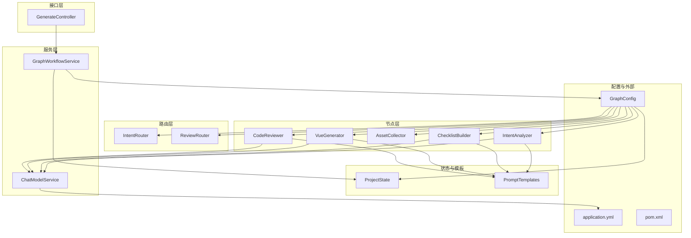

图表来源
- [GenerateController.java](file://src/main/java/com/example/websitemother/controller/GenerateController.java)
- [GraphWorkflowService.java](file://src/main/java/com/example/websitemother/service/GraphWorkflowService.java)
- [GraphConfig.java](file://src/main/java/com/example/websitemother/config/GraphConfig.java)
- [IntentAnalyzer.java](file://src/main/java/com/example/websitemother/node/IntentAnalyzer.java)
- [ChecklistBuilder.java](file://src/main/java/com/example/websitemother/node/ChecklistBuilder.java)
- [AssetCollector.java](file://src/main/java/com/example/websitemother/node/AssetCollector.java)
- [VueGenerator.java](file://src/main/java/com/example/websitemother/node/VueGenerator.java)
- [CodeReviewer.java](file://src/main/java/com/example/websitemother/node/CodeReviewer.java)
- [IntentRouter.java](file://src/main/java/com/example/websitemother/edge/IntentRouter.java)
- [ReviewRouter.java](file://src/main/java/com/example/websitemother/edge/ReviewRouter.java)
- [ProjectState.java](file://src/main/java/com/example/websitemother/state/ProjectState.java)
- [PromptTemplates.java](file://src/main/java/com/example/websitemother/prompt/PromptTemplates.java)
- [ChatModelService.java](file://src/main/java/com/example/websitemother/service/ChatModelService.java)
- [application.yml](file://src/main/resources/application.yml)
- [pom.xml](file://pom.xml)

章节来源
- [GenerateController.java](file://src/main/java/com/example/websitemother/controller/GenerateController.java)
- [GraphConfig.java](file://src/main/java/com/example/websitemother/config/GraphConfig.java)
- [GraphWorkflowService.java](file://src/main/java/com/example/websitemother/service/GraphWorkflowService.java)

## 核心组件
- 意图分析节点（IntentAnalyzer）
  - 职责：判断用户输入是闲聊还是建站需求，并生成可选的闲聊回复
  - 关键点：解析LLM输出中的固定字段，写入状态键值
- 需求清单节点（ChecklistBuilder）
  - 职责：基于用户输入生成需补充的字段清单（JSON数组），供前端收集
  - 关键点：清理可能的代码块标记，确保下游可用
- 素材收集节点（AssetCollector）
  - 职责：根据用户答案生成占位图片资源（Picsum），保证至少一张主图
  - 关键点：关键词提取与URL构造，输出assetsJson
- Vue生成节点（VueGenerator）
  - 职责：整合需求、素材与审查反馈，生成完整Vue单文件组件
  - 关键点：组装完整需求描述，清理代码块标记
- 代码审查节点（CodeReviewer）
  - 职责：判定生成代码是否满足规范，产出通过与否与反馈
  - 关键点：解析RESULT/FEEDBACK字段，更新重试计数

章节来源
- [IntentAnalyzer.java](file://src/main/java/com/example/websitemother/node/IntentAnalyzer.java)
- [ChecklistBuilder.java](file://src/main/java/com/example/websitemother/node/ChecklistBuilder.java)
- [AssetCollector.java](file://src/main/java/com/example/websitemother/node/AssetCollector.java)
- [VueGenerator.java](file://src/main/java/com/example/websitemother/node/VueGenerator.java)
- [CodeReviewer.java](file://src/main/java/com/example/websitemother/node/CodeReviewer.java)

## 架构总览
系统采用双阶段工作流：
- 第一阶段：意图分析 → 条件路由 → 清单生成（人类暂停点）
- 第二阶段：素材收集 → Vue生成 → 代码审查 → 条件路由（循环/结束）

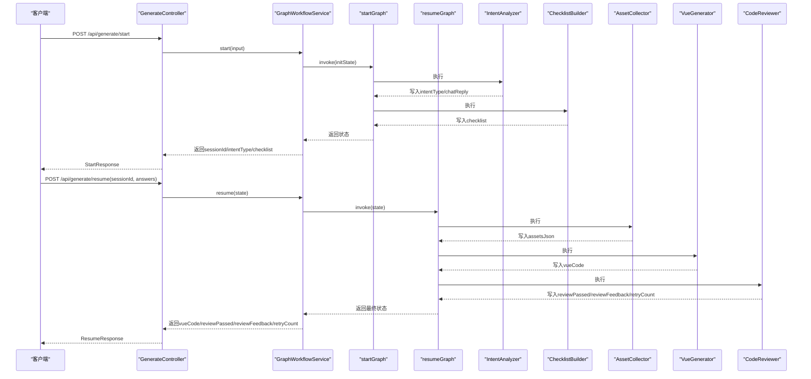

图表来源
- [GenerateController.java](file://src/main/java/com/example/websitemother/controller/GenerateController.java)
- [GraphWorkflowService.java](file://src/main/java/com/example/websitemother/service/GraphWorkflowService.java)
- [GraphConfig.java](file://src/main/java/com/example/websitemother/config/GraphConfig.java)
- [IntentAnalyzer.java](file://src/main/java/com/example/websitemother/node/IntentAnalyzer.java)
- [ChecklistBuilder.java](file://src/main/java/com/example/websitemother/node/ChecklistBuilder.java)
- [AssetCollector.java](file://src/main/java/com/example/websitemother/node/AssetCollector.java)
- [VueGenerator.java](file://src/main/java/com/example/websitemother/node/VueGenerator.java)
- [CodeReviewer.java](file://src/main/java/com/example/websitemother/node/CodeReviewer.java)

## 详细组件分析

### 状态管理与数据传递
- 全局状态ProjectState继承自AgentState，统一承载当前输入、意图类型、聊天回复、清单、用户答案、素材JSON、Vue代码、审查结果、反馈与重试计数等键值
- 节点通过读取/写入状态键实现数据共享，避免重复计算与耦合
- 状态访问器具备默认值与类型安全处理，降低空指针与解析错误风险

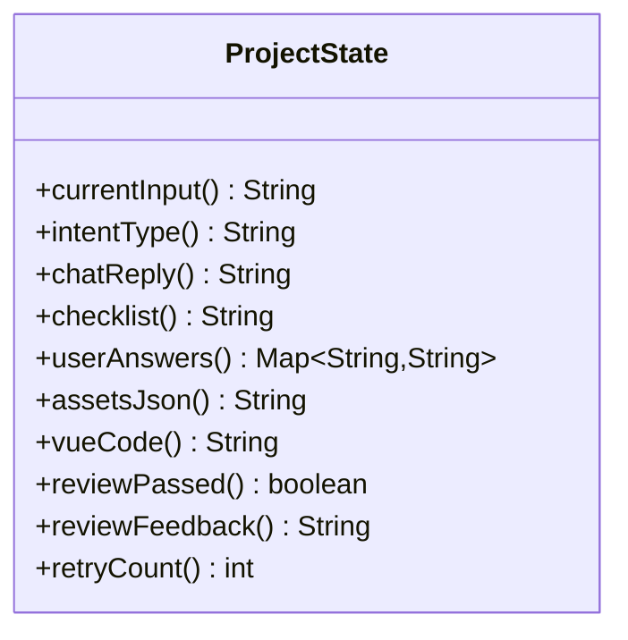

图表来源
- [ProjectState.java](file://src/main/java/com/example/websitemother/state/ProjectState.java)

章节来源
- [ProjectState.java](file://src/main/java/com/example/websitemother/state/ProjectState.java)

### 意图分析节点（IntentAnalyzer）
- 输入：当前用户输入
- 处理：调用LLM进行意图分类，解析输出中的INTENT与REPLY字段
- 输出：写入intentType与chatReply，供条件边路由使用

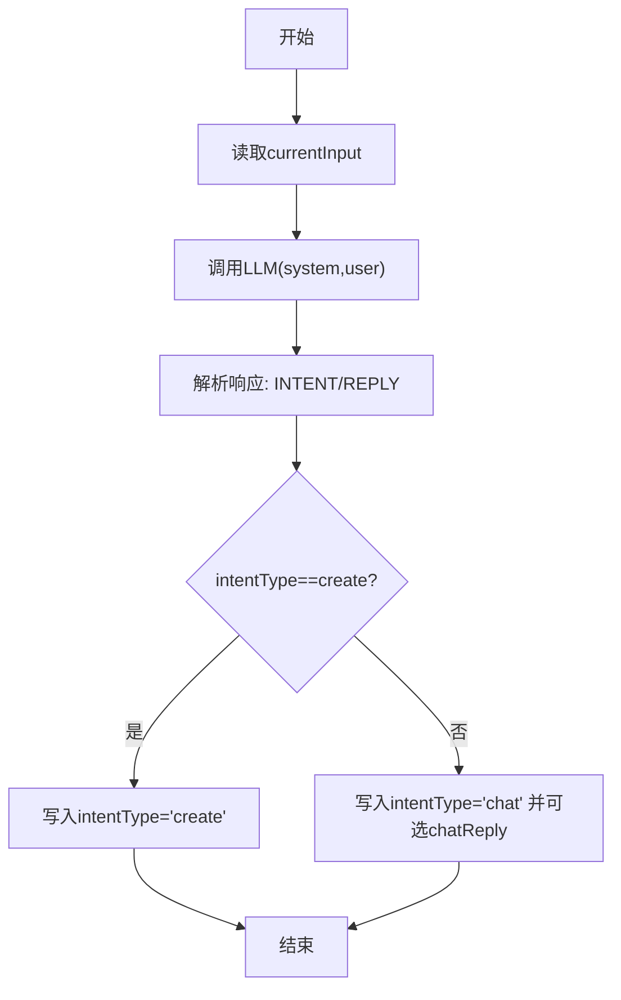

图表来源
- [IntentAnalyzer.java](file://src/main/java/com/example/websitemother/node/IntentAnalyzer.java)
- [PromptTemplates.java](file://src/main/java/com/example/websitemother/prompt/PromptTemplates.java)
- [ChatModelService.java](file://src/main/java/com/example/websitemother/service/ChatModelService.java)

章节来源
- [IntentAnalyzer.java](file://src/main/java/com/example/websitemother/node/IntentAnalyzer.java)
- [PromptTemplates.java](file://src/main/java/com/example/websitemother/prompt/PromptTemplates.java)
- [ChatModelService.java](file://src/main/java/com/example/websitemother/service/ChatModelService.java)

### 需求清单节点（ChecklistBuilder）
- 输入：用户输入
- 处理：调用LLM生成JSON数组形式的清单字段
- 输出：写入checklist（清理代码块标记后的JSON）

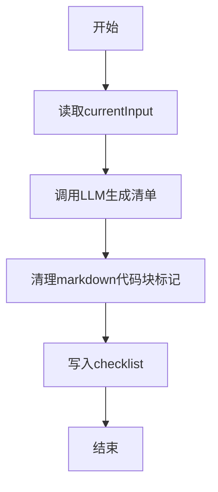

图表来源
- [ChecklistBuilder.java](file://src/main/java/com/example/websitemother/node/ChecklistBuilder.java)
- [PromptTemplates.java](file://src/main/java/com/example/websitemother/prompt/PromptTemplates.java)
- [ChatModelService.java](file://src/main/java/com/example/websitemother/service/ChatModelService.java)

章节来源
- [ChecklistBuilder.java](file://src/main/java/com/example/websitemother/node/ChecklistBuilder.java)
- [PromptTemplates.java](file://src/main/java/com/example/websitemother/prompt/PromptTemplates.java)
- [ChatModelService.java](file://src/main/java/com/example/websitemother/service/ChatModelService.java)

### 素材收集节点（AssetCollector）
- 输入：用户答案Map
- 处理：为每个有效答案提取关键词，构造Picsum占位图URL，保证至少一张hero图
- 输出：写入assetsJson（JSON字符串）

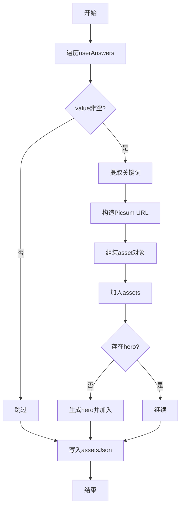

图表来源
- [AssetCollector.java](file://src/main/java/com/example/websitemother/node/AssetCollector.java)

章节来源
- [AssetCollector.java](file://src/main/java/com/example/websitemother/node/AssetCollector.java)

### Vue生成节点（VueGenerator）
- 输入：原始需求、用户答案、assetsJson、审查反馈
- 处理：组装完整需求描述，调用LLM生成Vue代码，清理代码块标记
- 输出：写入vueCode

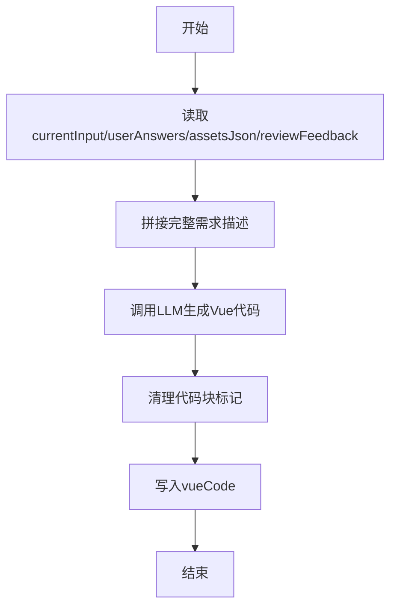

图表来源
- [VueGenerator.java](file://src/main/java/com/example/websitemother/node/VueGenerator.java)
- [PromptTemplates.java](file://src/main/java/com/example/websitemother/prompt/PromptTemplates.java)
- [ChatModelService.java](file://src/main/java/com/example/websitemother/service/ChatModelService.java)

章节来源
- [VueGenerator.java](file://src/main/java/com/example/websitemother/node/VueGenerator.java)
- [PromptTemplates.java](file://src/main/java/com/example/websitemother/prompt/PromptTemplates.java)
- [ChatModelService.java](file://src/main/java/com/example/websitemother/service/ChatModelService.java)

### 代码审查节点（CodeReviewer）
- 输入：vueCode、retryCount
- 处理：调用LLM审查，解析RESULT/FEEDBACK，递增重试计数
- 输出：写入reviewPassed、reviewFeedback、retryCount

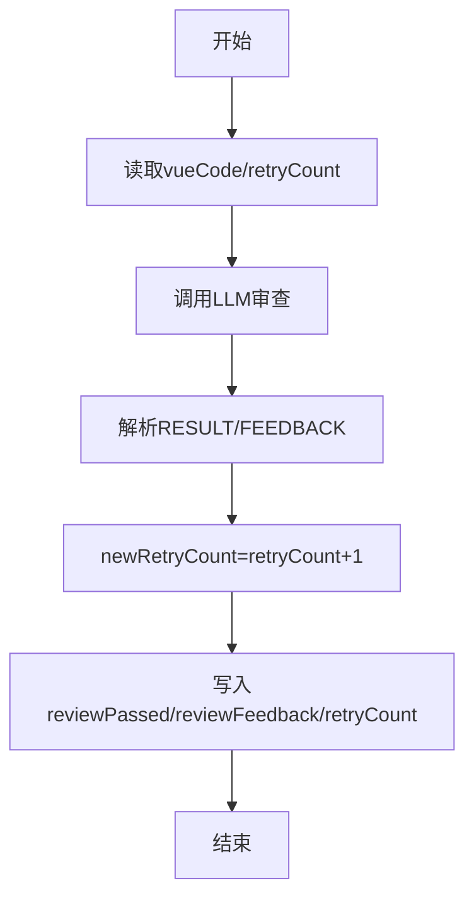

图表来源
- [CodeReviewer.java](file://src/main/java/com/example/websitemother/node/CodeReviewer.java)
- [PromptTemplates.java](file://src/main/java/com/example/websitemother/prompt/PromptTemplates.java)
- [ChatModelService.java](file://src/main/java/com/example/websitemother/service/ChatModelService.java)

章节来源
- [CodeReviewer.java](file://src/main/java/com/example/websitemother/node/CodeReviewer.java)
- [PromptTemplates.java](file://src/main/java/com/example/websitemother/prompt/PromptTemplates.java)
- [ChatModelService.java](file://src/main/java/com/example/websitemother/service/ChatModelService.java)

### 路由与条件边
- 意图路由（IntentRouter）
  - chat → 结束
  - create → checklist_builder
- 代码审查路由（ReviewRouter）
  - 通过 → 结束
  - 未通过且重试次数<3 → 回到VueGenerator重试
  - 达到最大重试 → 结束（失败）

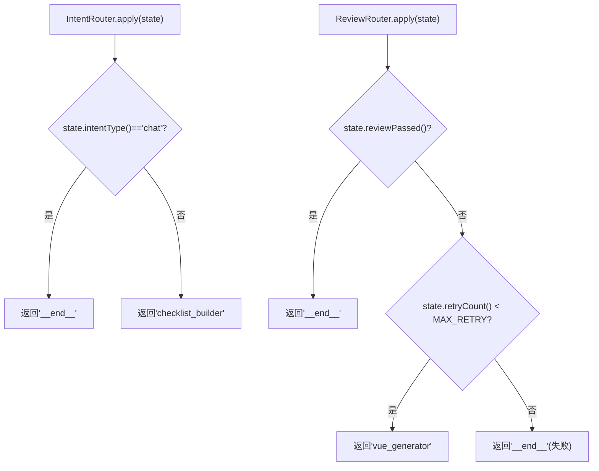

图表来源
- [IntentRouter.java](file://src/main/java/com/example/websitemother/edge/IntentRouter.java)
- [ReviewRouter.java](file://src/main/java/com/example/websitemother/edge/ReviewRouter.java)
- [ProjectState.java](file://src/main/java/com/example/websitemother/state/ProjectState.java)

章节来源
- [IntentRouter.java](file://src/main/java/com/example/websitemother/edge/IntentRouter.java)
- [ReviewRouter.java](file://src/main/java/com/example/websitemother/edge/ReviewRouter.java)
- [ProjectState.java](file://src/main/java/com/example/websitemother/state/ProjectState.java)

### 与LangChain4J/DashScope集成
- LangChain4J Spring Boot Starter自动装配QwenChatModel
- ChatModelService统一组装SystemMessage/UserMessage并调用模型
- application.yml提供DashScope API Key与模型名称
- 节点通过注入ChatModelService调用LLM，保持解耦

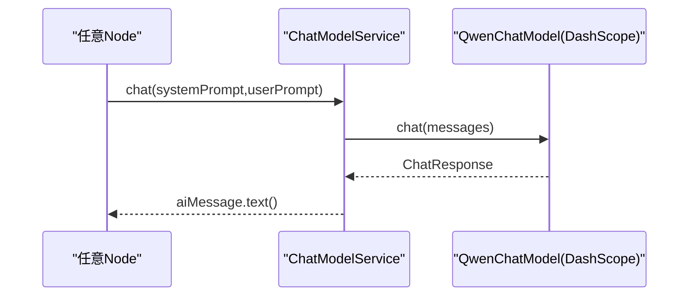

图表来源
- [ChatModelService.java](file://src/main/java/com/example/websitemother/service/ChatModelService.java)
- [application.yml](file://src/main/resources/application.yml)
- [pom.xml](file://pom.xml)

章节来源
- [ChatModelService.java](file://src/main/java/com/example/websitemother/service/ChatModelService.java)
- [application.yml](file://src/main/resources/application.yml)
- [pom.xml](file://pom.xml)

### 异步节点执行与并发处理
- GraphConfig中所有节点均通过node_async包装，支持LangGraph4J异步执行
- GraphWorkflowService分别持有startGraph与resumeGraph的CompiledGraph实例，按阶段调用invoke
- GenerateController使用ConcurrentHashMap作为内存会话存储（演示用途，生产建议Redis）
- 并发场景下，每个请求分配独立sessionId，避免状态串扰

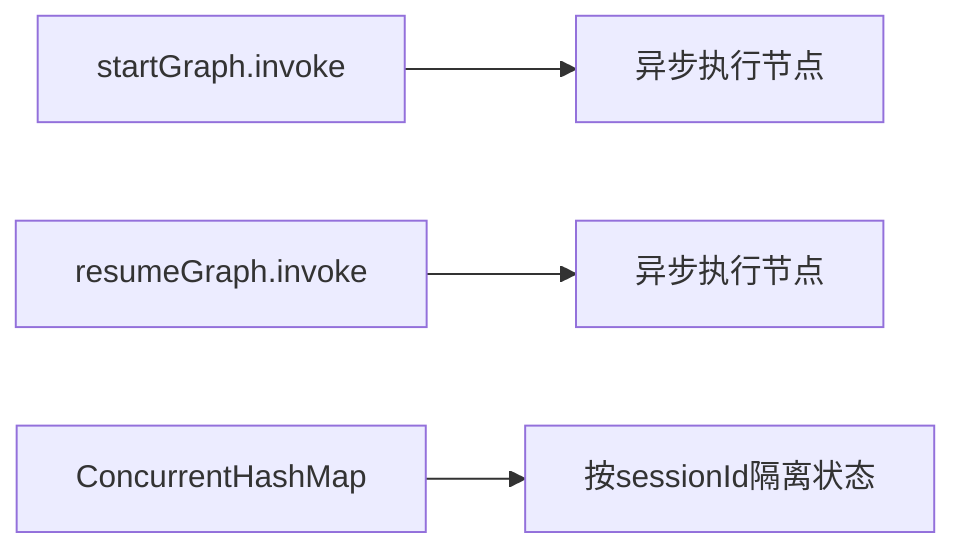

图表来源
- [GraphConfig.java](file://src/main/java/com/example/websitemother/config/GraphConfig.java)
- [GraphWorkflowService.java](file://src/main/java/com/example/websitemother/service/GraphWorkflowService.java)
- [GenerateController.java](file://src/main/java/com/example/websitemother/controller/GenerateController.java)

章节来源
- [GraphConfig.java](file://src/main/java/com/example/websitemother/config/GraphConfig.java)
- [GraphWorkflowService.java](file://src/main/java/com/example/websitemother/service/GraphWorkflowService.java)
- [GenerateController.java](file://src/main/java/com/example/websitemother/controller/GenerateController.java)

### 错误处理与重试策略
- LLM调用异常统一捕获并抛出运行时异常，便于上层感知
- 代码审查失败时，ReviewRouter根据retryCount决定是否回退到VueGenerator重试，最多3次
- 控制器侧对会话不存在进行显式校验与错误提示
- 建议：生产环境增加熔断、超时与指数退避策略

章节来源
- [ChatModelService.java](file://src/main/java/com/example/websitemother/service/ChatModelService.java)
- [ReviewRouter.java](file://src/main/java/com/example/websitemother/edge/ReviewRouter.java)
- [GenerateController.java](file://src/main/java/com/example/websitemother/controller/GenerateController.java)

## 依赖关系分析
- Maven依赖：Spring Web、LangGraph4J Core、LangChain4J DashScope Starter、Lombok
- 运行时依赖：DashScope Qwen模型服务
- 组件耦合：节点仅依赖ChatModelService与ProjectState，低耦合高内聚；路由与状态共同决定流程走向

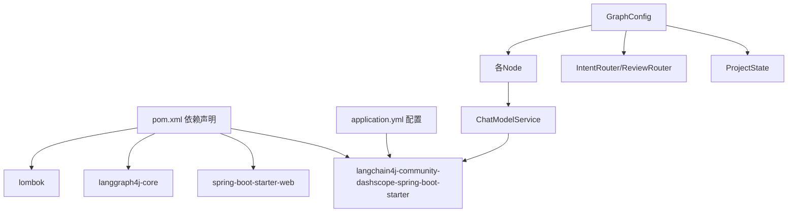

图表来源
- [pom.xml](file://pom.xml)
- [application.yml](file://src/main/resources/application.yml)
- [ChatModelService.java](file://src/main/java/com/example/websitemother/service/ChatModelService.java)
- [GraphConfig.java](file://src/main/java/com/example/websitemother/config/GraphConfig.java)

章节来源
- [pom.xml](file://pom.xml)
- [application.yml](file://src/main/resources/application.yml)
- [GraphConfig.java](file://src/main/java/com/example/websitemother/config/GraphConfig.java)

## 性能考量
- LLM调用成本与延迟
  - 建议：批量/合并相似请求、缓存热点Prompt与中间产物、引入限流与超时
- 图像生成与网络I/O
  - Picsum请求可能成为瓶颈，建议本地CDN或预缓存
- 状态体积控制
  - assetsJson与vueCode较大，建议在持久化前做压缩或分片
- 并发与内存
  - 当前内存会话存储适合演示，生产务必迁移到Redis并设置TTL
- Prompt工程
  - 严格约束输出格式与长度，减少解析开销与LLM上下文浪费

## 故障排查指南
- LLM调用失败
  - 现象：运行时异常，日志包含错误堆栈
  - 排查：确认DashScope API Key与模型名称配置正确，检查网络连通性
- 意图识别异常
  - 现象：intentType非预期
  - 排查：检查Prompt模板与LLM输出格式一致性
- 清单生成JSON不合法
  - 现象：下游解析失败
  - 排查：确认ChecklistBuilder清理了代码块标记
- 审查未通过循环
  - 现象：超过3次仍失败
  - 排查：关注CodeReviewer反馈，必要时放宽阈值或优化Prompt
- 会话丢失
  - 现象：resume报错会话不存在
  - 排查：确认sessionId有效且未过期

章节来源
- [ChatModelService.java](file://src/main/java/com/example/websitemother/service/ChatModelService.java)
- [GenerateController.java](file://src/main/java/com/example/websitemother/controller/GenerateController.java)
- [ReviewRouter.java](file://src/main/java/com/example/websitemother/edge/ReviewRouter.java)

## 结论
WebsiteMother的AI节点系统以LangGraph4J为核心，通过明确的状态契约与节点职责，实现了从意图分析到Vue代码生成的闭环。系统具备良好的可扩展性与可维护性：新增节点只需实现NodeAction并接入状态键；路由与条件边统一管理流程；LLM集成通过ChatModelService抽象，便于替换与扩展。建议在生产环境中强化容错、缓存与并发治理，持续优化Prompt与模板，以获得更稳定与高效的用户体验。

## 附录

### 新节点接入规范
- 实现NodeAction<ProjectState>，在apply中读取/写入ProjectState键
- 在GraphConfig中注册节点与异步包装
- 如需LLM能力，注入ChatModelService并使用PromptTemplates
- 在对应路由中添加条件边或调整工作流连接
- 编写单元测试与集成测试，覆盖关键分支与异常路径

章节来源
- [GraphConfig.java](file://src/main/java/com/example/websitemother/config/GraphConfig.java)
- [ProjectState.java](file://src/main/java/com/example/websitemother/state/ProjectState.java)
- [PromptTemplates.java](file://src/main/java/com/example/websitemother/prompt/PromptTemplates.java)
- [ChatModelService.java](file://src/main/java/com/example/websitemother/service/ChatModelService.java)