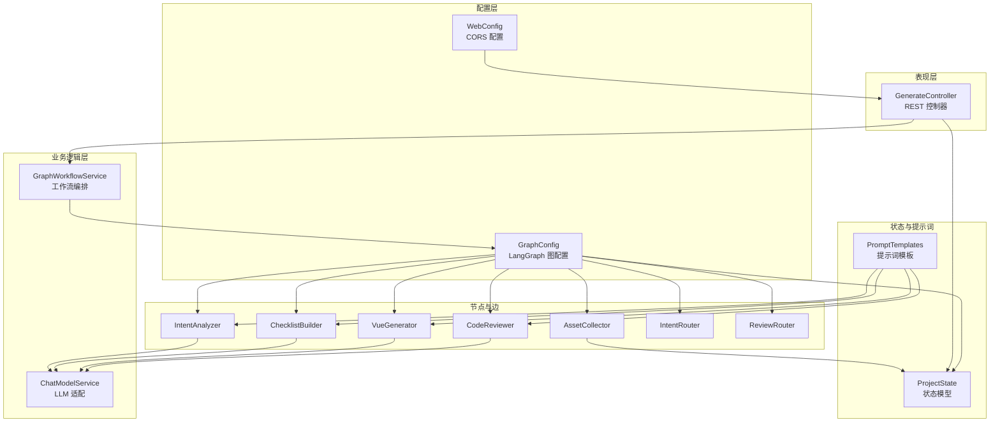
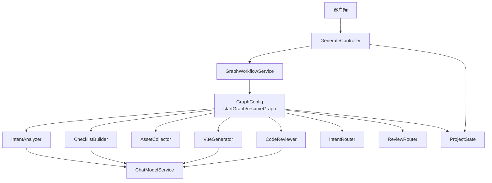
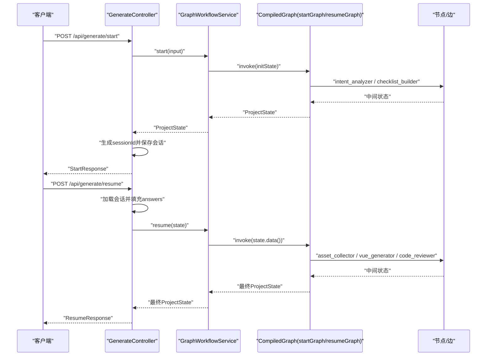
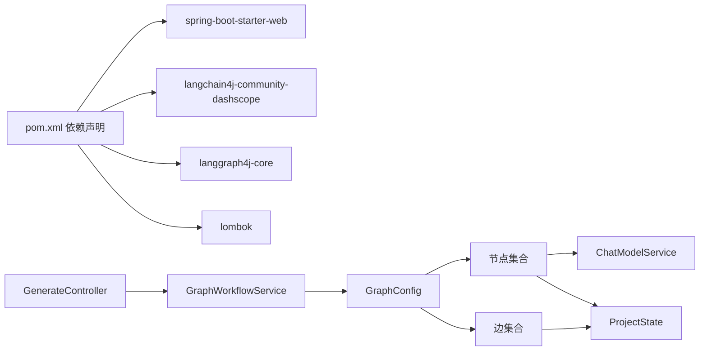

# 分层架构设计

<cite>
**本文引用的文件**
- [WebsiteMotherApplication.java](file://src/main/java/com/example/websitemother/WebsiteMotherApplication.java)
- [GenerateController.java](file://src/main/java/com/example/websitemother/controller/GenerateController.java)
- [GraphWorkflowService.java](file://src/main/java/com/example/websitemother/service/GraphWorkflowService.java)
- [ChatModelService.java](file://src/main/java/com/example/websitemother/service/ChatModelService.java)
- [WebConfig.java](file://src/main/java/com/example/websitemother/config/WebConfig.java)
- [GraphConfig.java](file://src/main/java/com/example/websitemother/config/GraphConfig.java)
- [ProjectState.java](file://src/main/java/com/example/websitemother/state/ProjectState.java)
- [PromptTemplates.java](file://src/main/java/com/example/websitemother/prompt/PromptTemplates.java)
- [IntentAnalyzer.java](file://src/main/java/com/example/websitemother/node/IntentAnalyzer.java)
- [ChecklistBuilder.java](file://src/main/java/com/example/websitemother/node/ChecklistBuilder.java)
- [AssetCollector.java](file://src/main/java/com/example/websitemother/node/AssetCollector.java)
- [VueGenerator.java](file://src/main/java/com/example/websitemother/node/VueGenerator.java)
- [CodeReviewer.java](file://src/main/java/com/example/websitemother/node/CodeReviewer.java)
- [IntentRouter.java](file://src/main/java/com/example/websitemother/edge/IntentRouter.java)
- [ReviewRouter.java](file://src/main/java/com/example/websitemother/edge/ReviewRouter.java)
- [application.yml](file://src/main/resources/application.yml)
- [pom.xml](file://pom.xml)
</cite>

## 目录
1. [简介](#简介)
2. [项目结构](#项目结构)
3. [核心组件](#核心组件)
4. [架构总览](#架构总览)
5. [详细组件分析](#详细组件分析)
6. [依赖分析](#依赖分析)
7. [性能考虑](#性能考虑)
8. [故障排查指南](#故障排查指南)
9. [结论](#结论)
10. [附录](#附录)

## 简介
本文件为 WebsiteMother 项目的分层架构设计文档，围绕表现层（Controller 层）、业务逻辑层（Service 层）、数据访问/外部集成层进行职责划分与设计原则说明。重点阐述 GenerateController 如何协调 GraphWorkflowService 进行工作流管理，并结合 Spring Boot 的依赖注入与组件扫描策略，解释 RESTful API 设计与 HTTP 请求处理流程。同时总结分层架构在代码复用性、可测试性与可维护性方面的优势，并提供面向开发者的实现模式与最佳实践。

## 项目结构
WebsiteMother 采用典型的 Spring Boot 多模块分层组织方式：
- 表现层：controller 包，负责接收 HTTP 请求、封装响应 DTO、协调工作流执行
- 业务逻辑层：service 包，封装领域工作流编排与状态流转
- 数据/外部集成层：node/edge 包（LangGraph 节点与边），prompt 包（统一提示词模板）
- 配置层：config 包（Web MVC CORS 与 LangGraph 图配置）
- 状态模型：state 包（ProjectState 作为全局状态载体）
- 应用入口：WebsiteMotherApplication（Spring Boot 启动类）

图表来源
- [GenerateController.java:1-115](file://src/main/java/com/example/websitemother/controller/GenerateController.java#L1-L115)
- [GraphWorkflowService.java:1-60](file://src/main/java/com/example/websitemother/service/GraphWorkflowService.java#L1-L60)
- [ChatModelService.java:1-58](file://src/main/java/com/example/websitemother/service/ChatModelService.java#L1-L58)
- [WebConfig.java:1-23](file://src/main/java/com/example/websitemother/config/WebConfig.java#L1-L23)
- [GraphConfig.java:1-99](file://src/main/java/com/example/websitemother/config/GraphConfig.java#L1-L99)
- [ProjectState.java:1-78](file://src/main/java/com/example/websitemother/state/ProjectState.java#L1-L78)
- [PromptTemplates.java:1-93](file://src/main/java/com/example/websitemother/prompt/PromptTemplates.java#L1-L93)
- [IntentAnalyzer.java:1-61](file://src/main/java/com/example/websitemother/node/IntentAnalyzer.java#L1-L61)
- [ChecklistBuilder.java:1-51](file://src/main/java/com/example/websitemother/node/ChecklistBuilder.java#L1-L51)
- [AssetCollector.java:1-89](file://src/main/java/com/example/websitemother/node/AssetCollector.java#L1-L89)
- [VueGenerator.java:1-64](file://src/main/java/com/example/websitemother/node/VueGenerator.java#L1-L64)
- [CodeReviewer.java:1-61](file://src/main/java/com/example/websitemother/node/CodeReviewer.java#L1-L61)
- [IntentRouter.java:1-31](file://src/main/java/com/example/websitemother/edge/IntentRouter.java#L1-L31)
- [ReviewRouter.java:1-43](file://src/main/java/com/example/websitemother/edge/ReviewRouter.java#L1-L43)

章节来源
- [WebsiteMotherApplication.java:1-14](file://src/main/java/com/example/websitemother/WebsiteMotherApplication.java#L1-L14)
- [pom.xml:1-115](file://pom.xml#L1-L115)

## 核心组件
- GenerateController：暴露 /api/generate/start 与 /api/generate/resume 两个 REST 接口，负责请求参数校验、会话状态管理与响应封装，协调 GraphWorkflowService 执行工作流。
- GraphWorkflowService：封装 LangGraph 工作流的两阶段执行（startGraph 与 resumeGraph），屏蔽状态图细节，向上提供简洁的 start/resume API。
- ChatModelService：封装 DashScope Qwen 模型调用，统一消息组装与异常处理，为各节点提供稳定的 LLM 服务能力。
- GraphConfig：装配 LangGraph 状态图，定义 startGraph 与 resumeGraph 的节点与边，实现意图分析、清单生成、素材收集、Vue 生成与代码审查的编排。
- ProjectState：继承 LangGraph 的 AgentState，作为工作流全局状态载体，提供强类型的读写方法。
- PromptTemplates：集中管理各节点的系统提示词与用户提示词模板，便于统一维护与优化。
- 节点与边：IntentAnalyzer、ChecklistBuilder、AssetCollector、VueGenerator、CodeReviewer 实现具体业务步骤；IntentRouter、ReviewRouter 实现条件路由。

章节来源
- [GenerateController.java:1-115](file://src/main/java/com/example/websitemother/controller/GenerateController.java#L1-L115)
- [GraphWorkflowService.java:1-60](file://src/main/java/com/example/websitemother/service/GraphWorkflowService.java#L1-L60)
- [ChatModelService.java:1-58](file://src/main/java/com/example/websitemother/service/ChatModelService.java#L1-L58)
- [GraphConfig.java:1-99](file://src/main/java/com/example/websitemother/config/GraphConfig.java#L1-L99)
- [ProjectState.java:1-78](file://src/main/java/com/example/websitemother/state/ProjectState.java#L1-L78)
- [PromptTemplates.java:1-93](file://src/main/java/com/example/websitemother/prompt/PromptTemplates.java#L1-L93)
- [IntentAnalyzer.java:1-61](file://src/main/java/com/example/websitemother/node/IntentAnalyzer.java#L1-L61)
- [ChecklistBuilder.java:1-51](file://src/main/java/com/example/websitemother/node/ChecklistBuilder.java#L1-L51)
- [AssetCollector.java:1-89](file://src/main/java/com/example/websitemother/node/AssetCollector.java#L1-L89)
- [VueGenerator.java:1-64](file://src/main/java/com/example/websitemother/node/VueGenerator.java#L1-L64)
- [CodeReviewer.java:1-61](file://src/main/java/com/example/websitemother/node/CodeReviewer.java#L1-L61)
- [IntentRouter.java:1-31](file://src/main/java/com/example/websitemother/edge/IntentRouter.java#L1-L31)
- [ReviewRouter.java:1-43](file://src/main/java/com/example/websitemother/edge/ReviewRouter.java#L1-L43)

## 架构总览
WebsiteMother 采用“表现层-业务层-工作流层-节点层”的四层架构：
- 表现层（Controller）：REST 接口与会话状态管理，负责请求/响应映射与错误传播。
- 业务层（Service）：工作流编排与状态推进，屏蔽底层 LangGraph 细节。
- 工作流层（GraphConfig）：定义状态图与节点/边关系，实现业务流程编排。
- 节点层（Node/Edge）：具体业务动作与条件分支，实现细粒度能力单元。

图表来源
- [GenerateController.java:1-115](file://src/main/java/com/example/websitemother/controller/GenerateController.java#L1-L115)
- [GraphWorkflowService.java:1-60](file://src/main/java/com/example/websitemother/service/GraphWorkflowService.java#L1-L60)
- [GraphConfig.java:1-99](file://src/main/java/com/example/websitemother/config/GraphConfig.java#L1-L99)
- [ChatModelService.java:1-58](file://src/main/java/com/example/websitemother/service/ChatModelService.java#L1-L58)
- [ProjectState.java:1-78](file://src/main/java/com/example/websitemother/state/ProjectState.java#L1-L78)
- [IntentAnalyzer.java:1-61](file://src/main/java/com/example/websitemother/node/IntentAnalyzer.java#L1-L61)
- [ChecklistBuilder.java:1-51](file://src/main/java/com/example/websitemother/node/ChecklistBuilder.java#L1-L51)
- [AssetCollector.java:1-89](file://src/main/java/com/example/websitemother/node/AssetCollector.java#L1-L89)
- [VueGenerator.java:1-64](file://src/main/java/com/example/websitemother/node/VueGenerator.java#L1-L64)
- [CodeReviewer.java:1-61](file://src/main/java/com/example/websitemother/node/CodeReviewer.java#L1-L61)
- [IntentRouter.java:1-31](file://src/main/java/com/example/websitemother/edge/IntentRouter.java#L1-L31)
- [ReviewRouter.java:1-43](file://src/main/java/com/example/websitemother/edge/ReviewRouter.java#L1-L43)

## 详细组件分析

### 表现层（Controller 层）
- GenerateController
  - 职责：暴露 /api/generate/start 与 /api/generate/resume；管理内存会话状态；调用 GraphWorkflowService 执行工作流；封装响应 DTO。
  - 关键点：使用 @Resource 注入 GraphWorkflowService；使用 ConcurrentHashMap 存储会话状态（演示用途，生产建议 Redis）；对不存在的会话抛出参数异常。
  - 依赖：GraphWorkflowService、ProjectState；对外提供 StartRequest/ResumeRequest/StartResponse/ResumeResponse。
- WebConfig
  - 职责：配置 CORS，允许前端开发服务器跨域访问 /api/**。

章节来源
- [GenerateController.java:1-115](file://src/main/java/com/example/websitemother/controller/GenerateController.java#L1-L115)
- [WebConfig.java:1-23](file://src/main/java/com/example/websitemother/config/WebConfig.java#L1-L23)

### 业务逻辑层（Service 层）
- GraphWorkflowService
  - 职责：封装 startGraph 与 resumeGraph 的执行；对外提供 start(input) 与 resume(state)；异常统一包装。
  - 关键点：使用 @Resource 注入 CompiledGraph<ProjectState>；将输入封装为初始化状态并调用 invoke；捕获异常并记录日志。
- ChatModelService
  - 职责：封装 DashScope Qwen 调用；组装 SystemMessage 与 UserMessage；统一异常处理。
  - 关键点：支持简化 chat(userPrompt) 与完整 chat(systemPrompt, userPrompt) 两种签名；异常统一转换为运行时异常。

章节来源
- [GraphWorkflowService.java:1-60](file://src/main/java/com/example/websitemother/service/GraphWorkflowService.java#L1-L60)
- [ChatModelService.java:1-58](file://src/main/java/com/example/websitemother/service/ChatModelService.java#L1-L58)

### 工作流层（配置与状态）
- GraphConfig
  - 职责：装配两个状态图 startGraph 与 resumeGraph；注册节点与边；返回 CompiledGraph。
  - 关键点：startGraph：intent_analyzer -> checklist_builder，条件边由 IntentRouter 决定是否结束或进入清单构建；resumeGraph：asset_collector -> vue_generator -> code_reviewer，条件边由 ReviewRouter 决定结束或重试。
- ProjectState
  - 职责：全局状态载体；提供强类型 getter 方法；定义常量键（CURRENT_INPUT、INTENT_TYPE、CHECKLIST、USER_ANSWERS、ASSETS_JSON、VUE_CODE、REVIEW_PASSED、REVIEW_FEEDBACK、RETRY_COUNT）。
- PromptTemplates
  - 职责：集中管理各节点提示词模板；提供系统提示词与用户提示词构造方法。

章节来源
- [GraphConfig.java:1-99](file://src/main/java/com/example/websitemother/config/GraphConfig.java#L1-L99)
- [ProjectState.java:1-78](file://src/main/java/com/example/websitemother/state/ProjectState.java#L1-L78)
- [PromptTemplates.java:1-93](file://src/main/java/com/example/websitemother/prompt/PromptTemplates.java#L1-L93)

### 节点与边（工作流执行单元）
- IntentAnalyzer：意图分析，输出 intentType 与 chatReply。
- ChecklistBuilder：生成需求清单（JSON 数组），供前端展示与收集用户答案。
- AssetCollector：根据用户答案生成占位图片 JSON（基于 picsum.photos），确保至少一张 hero 主图。
- VueGenerator：综合需求、素材与审查反馈生成 Vue 单文件组件代码，清理 markdown 代码块标记。
- CodeReviewer：严格审查 Vue 代码，输出 RESULT 与 FEEDBACK，并更新 retryCount。
- IntentRouter：根据 intentType 决定结束或进入清单构建。
- ReviewRouter：根据 reviewPassed 与 retryCount 决定结束或重试。

章节来源
- [IntentAnalyzer.java:1-61](file://src/main/java/com/example/websitemother/node/IntentAnalyzer.java#L1-L61)
- [ChecklistBuilder.java:1-51](file://src/main/java/com/example/websitemother/node/ChecklistBuilder.java#L1-L51)
- [AssetCollector.java:1-89](file://src/main/java/com/example/websitemother/node/AssetCollector.java#L1-L89)
- [VueGenerator.java:1-64](file://src/main/java/com/example/websitemother/node/VueGenerator.java#L1-L64)
- [CodeReviewer.java:1-61](file://src/main/java/com/example/websitemother/node/CodeReviewer.java#L1-L61)
- [IntentRouter.java:1-31](file://src/main/java/com/example/websitemother/edge/IntentRouter.java#L1-L31)
- [ReviewRouter.java:1-43](file://src/main/java/com/example/websitemother/edge/ReviewRouter.java#L1-L43)

### GenerateController 协调 GraphWorkflowService 的调用链

图表来源
- [GenerateController.java:1-115](file://src/main/java/com/example/websitemother/controller/GenerateController.java#L1-L115)
- [GraphWorkflowService.java:1-60](file://src/main/java/com/example/websitemother/service/GraphWorkflowService.java#L1-L60)
- [GraphConfig.java:1-99](file://src/main/java/com/example/websitemother/config/GraphConfig.java#L1-L99)
- [IntentAnalyzer.java:1-61](file://src/main/java/com/example/websitemother/node/IntentAnalyzer.java#L1-L61)
- [ChecklistBuilder.java:1-51](file://src/main/java/com/example/websitemother/node/ChecklistBuilder.java#L1-L51)
- [AssetCollector.java:1-89](file://src/main/java/com/example/websitemother/node/AssetCollector.java#L1-L89)
- [VueGenerator.java:1-64](file://src/main/java/com/example/websitemother/node/VueGenerator.java#L1-L64)
- [CodeReviewer.java:1-61](file://src/main/java/com/example/websitemother/node/CodeReviewer.java#L1-L61)

### RESTful API 设计与 HTTP 请求处理流程
- 设计原则
  - 资源命名：/api/generate/start 与 /api/generate/resume，语义明确，符合 REST 风格。
  - 方法选择：POST 用于启动与继续工作流，避免 GET 的副作用与长度限制。
  - 响应封装：StartResponse/ResumeResponse 明确返回字段，便于前端消费。
  - 错误处理：会话不存在抛出参数异常，便于前端区分业务错误与系统异常。
- 处理流程
  - /start：接收 StartRequest，调用 GraphWorkflowService.start，生成 sessionId 并返回 StartResponse。
  - /resume：接收 ResumeRequest，加载会话并填充 answers，调用 GraphWorkflowService.resume，返回 ResumeResponse。

章节来源
- [GenerateController.java:1-115](file://src/main/java/com/example/websitemother/controller/GenerateController.java#L1-L115)

### Spring Boot 依赖注入与组件扫描策略
- 启动类 WebsiteMotherApplication 使用 @SpringBootApplication，启用自动扫描与条件化配置。
- 组件注解
  - @RestController、@Service、@Component、@Configuration：分别标识控制器、服务、组件与配置类。
  - @Resource：按类型注入，用于注入 ChatModelService、CompiledGraph、节点与边实例。
- 配置类
  - WebConfig 实现 WebMvcConfigurer，开放 /api/** 的跨域访问。
  - GraphConfig 通过 @Bean 定义 startGraph 与 resumeGraph，装配节点与边。
- YAML 配置
  - application.yml 提供 LangChain4J DashScope 的 API Key 与模型名称。

章节来源
- [WebsiteMotherApplication.java:1-14](file://src/main/java/com/example/websitemother/WebsiteMotherApplication.java#L1-L14)
- [WebConfig.java:1-23](file://src/main/java/com/example/websitemother/config/WebConfig.java#L1-L23)
- [GraphConfig.java:1-99](file://src/main/java/com/example/websitemother/config/GraphConfig.java#L1-L99)
- [application.yml:1-9](file://src/main/resources/application.yml#L1-L9)

### 分层架构优势
- 代码复用性：节点与边作为独立组件，可在不同工作流中复用；提示词模板集中管理，便于统一优化。
- 可测试性：Controller 通过 Service 抽象隔离外部依赖；Service 通过 ChatModelService 抽象 LLM 调用；节点通过接口 NodeAction/EdgeAction 抽象具体行为，便于单元测试。
- 可维护性：工作流通过状态图可视化表达，GraphConfig 集中配置；状态模型 ProjectState 统一数据结构；提示词模板集中维护。

## 依赖分析
- 外部依赖
  - Spring Boot Starter Web：提供 Web MVC 与嵌入式容器。
  - LangChain4J DashScope：提供 Qwen 模型调用能力。
  - langgraph4j-core：提供状态图与工作流编排能力。
  - Lombok：减少样板代码。
- 内部依赖
  - Controller 依赖 Service；Service 依赖 ChatModelService 与 CompiledGraph；节点依赖 ChatModelService 与 ProjectState；GraphConfig 依赖所有节点与边。

图表来源
- [pom.xml:1-115](file://pom.xml#L1-L115)
- [GenerateController.java:1-115](file://src/main/java/com/example/websitemother/controller/GenerateController.java#L1-L115)
- [GraphWorkflowService.java:1-60](file://src/main/java/com/example/websitemother/service/GraphWorkflowService.java#L1-L60)
- [GraphConfig.java:1-99](file://src/main/java/com/example/websitemother/config/GraphConfig.java#L1-L99)
- [ChatModelService.java:1-58](file://src/main/java/com/example/websitemother/service/ChatModelService.java#L1-L58)
- [ProjectState.java:1-78](file://src/main/java/com/example/websitemother/state/ProjectState.java#L1-L78)

章节来源
- [pom.xml:1-115](file://pom.xml#L1-L115)

## 性能考虑
- 会话存储：当前使用内存 ConcurrentHashMap，适合演示；生产建议使用 Redis，支持水平扩展与持久化。
- LLM 调用：ChatModelService 已做异常处理与日志记录；建议引入超时控制与重试策略，避免阻塞请求线程。
- 工作流并发：LangGraph 编译图支持异步节点；合理设置线程池与队列容量，避免资源争用。
- 前端跨域：CORS 已配置，建议在网关层统一管理跨域策略，减少重复配置。

## 故障排查指南
- 会话不存在或过期
  - 现象：/resume 返回参数异常。
  - 排查：确认 sessionId 是否正确传递；检查会话存储是否被清理；考虑引入 TTL 与过期策略。
- LLM 调用失败
  - 现象：ChatModelService 抛出运行时异常。
  - 排查：检查 application.yml 中 API Key 与模型名称；查看日志中的错误堆栈；确认网络连通性。
- 工作流执行异常
  - 现象：GraphWorkflowService 包装 RuntimeException。
  - 排查：查看 startGraph/resumeGraph 的节点日志；确认节点返回的状态键是否完整；检查 ReviewRouter 的重试上限。
- 跨域问题
  - 现象：浏览器报跨域错误。
  - 排查：确认 WebConfig 对 /api/** 的 CORS 配置；核对前端请求的 Origin 与端口。

章节来源
- [GenerateController.java:1-115](file://src/main/java/com/example/websitemother/controller/GenerateController.java#L1-L115)
- [GraphWorkflowService.java:1-60](file://src/main/java/com/example/websitemother/service/GraphWorkflowService.java#L1-L60)
- [ChatModelService.java:1-58](file://src/main/java/com/example/websitemother/service/ChatModelService.java#L1-L58)
- [WebConfig.java:1-23](file://src/main/java/com/example/websitemother/config/WebConfig.java#L1-L23)

## 结论
WebsiteMother 通过清晰的分层架构实现了“表现层-业务层-工作流层-节点层”的职责分离：表现层专注接口与会话管理，业务层专注工作流编排，工作流层专注流程可视化与状态推进，节点层专注具体业务动作。配合 Spring Boot 的依赖注入与组件扫描，以及 LangGraph 的状态图编排，项目具备良好的可扩展性与可维护性。建议在生产环境中替换内存会话为 Redis、增强 LLM 调用的容错与可观测性，并在网关层统一跨域与限流策略。

## 附录
- 最佳实践清单
  - 使用 @Resource 按类型注入，保持依赖关系清晰。
  - 将提示词模板集中管理，便于统一优化与版本控制。
  - 在节点中严格遵循单一职责，必要时拆分为更小的子节点。
  - 为每个工作流阶段设置明确的边界与输出键，避免状态污染。
  - 引入监控与日志埋点，定位工作流瓶颈与异常。
  - 生产部署使用 Redis 会话存储与限流熔断策略。