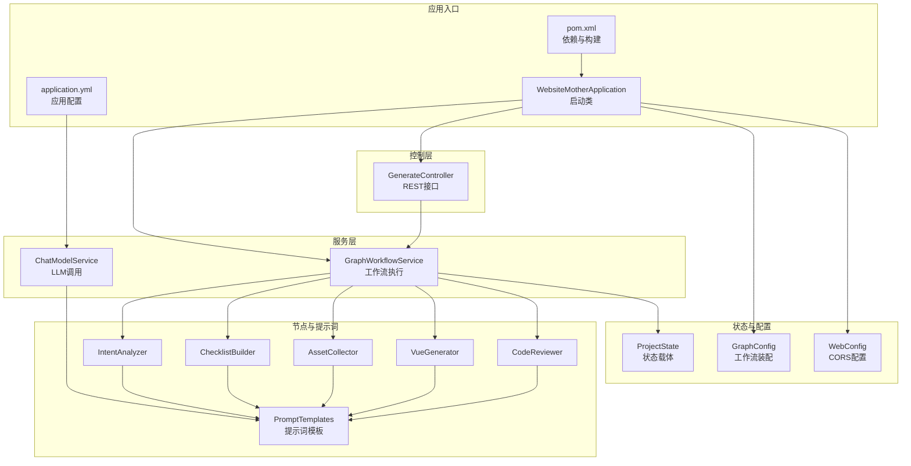
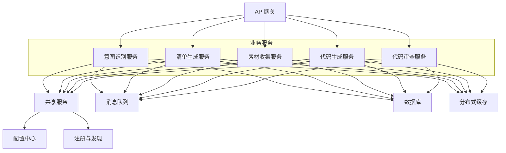
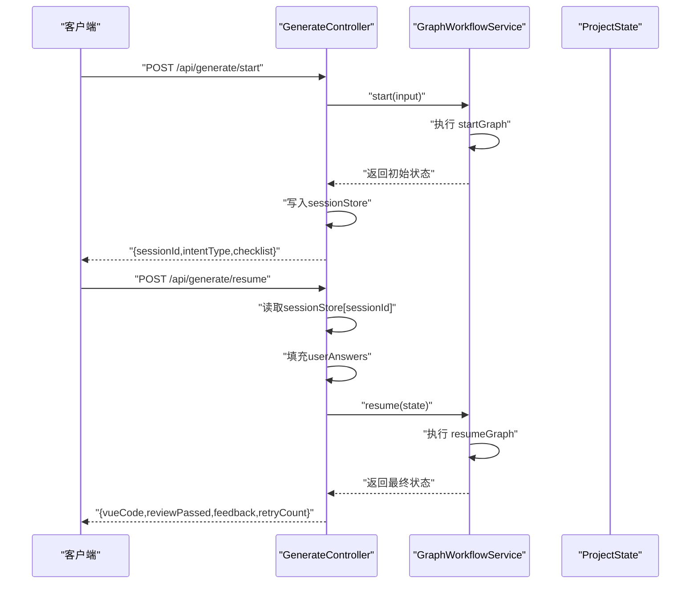
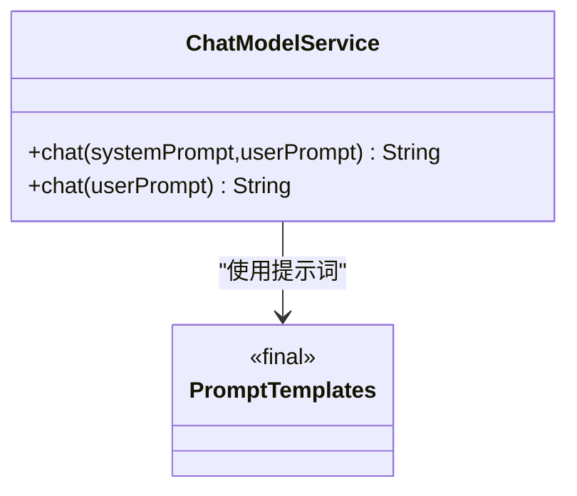
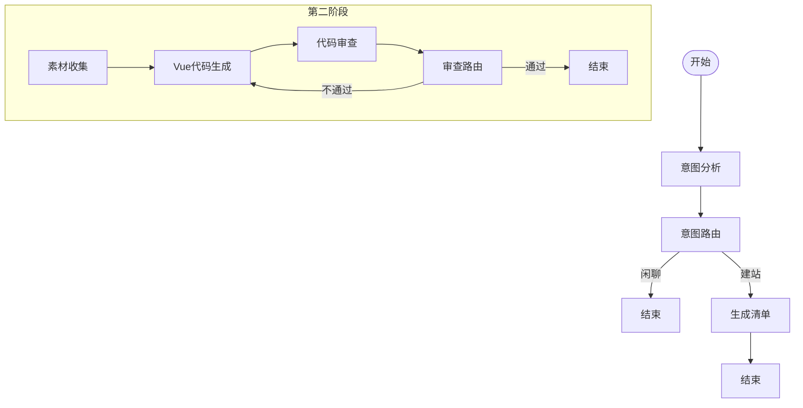
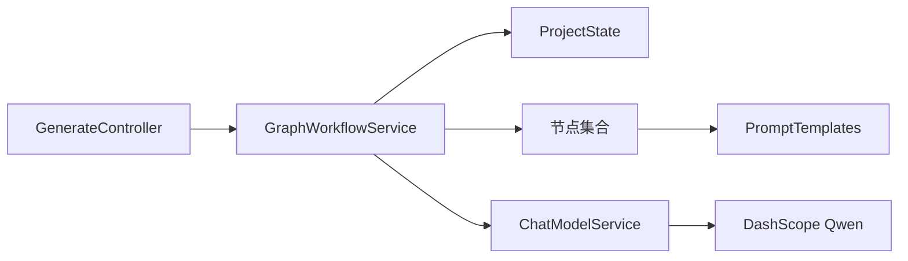

# 微服务化架构设计

<cite>
**本文引用的文件**
- [WebsiteMotherApplication.java](file://src/main/java/com/example/websitemother/WebsiteMotherApplication.java)
- [application.yml](file://src/main/resources/application.yml)
- [pom.xml](file://pom.xml)
- [GenerateController.java](file://src/main/java/com/example/websitemother/controller/GenerateController.java)
- [ChatModelService.java](file://src/main/java/com/example/websitemother/service/ChatModelService.java)
- [GraphWorkflowService.java](file://src/main/java/com/example/websitemother/service/GraphWorkflowService.java)
- [ProjectState.java](file://src/main/java/com/example/websitemother/state/ProjectState.java)
- [GraphConfig.java](file://src/main/java/com/example/websitemother/config/GraphConfig.java)
- [WebConfig.java](file://src/main/java/com/example/websitemother/config/WebConfig.java)
- [PromptTemplates.java](file://src/main/java/com/example/websitemother/prompt/PromptTemplates.java)
- [IntentAnalyzer.java](file://src/main/java/com/example/websitemother/node/IntentAnalyzer.java)
- [ChecklistBuilder.java](file://src/main/java/com/example/websitemother/node/ChecklistBuilder.java)
- [AssetCollector.java](file://src/main/java/com/example/websitemother/node/AssetCollector.java)
- [VueGenerator.java](file://src/main/java/com/example/websitemother/node/VueGenerator.java)
- [CodeReviewer.java](file://src/main/java/com/example/websitemother/node/CodeReviewer.java)
</cite>

## 目录
1. [引言](#引言)
2. [项目结构](#项目结构)
3. [核心组件](#核心组件)
4. [架构总览](#架构总览)
5. [详细组件分析](#详细组件分析)
6. [依赖关系分析](#依赖关系分析)
7. [性能考量](#性能考量)
8. [故障排查指南](#故障排查指南)
9. [结论](#结论)
10. [附录](#附录)

## 引言
本设计文档面向WebsiteMother项目的微服务化演进，结合当前单体式Spring Boot应用的代码结构，系统阐述微服务化的设计理念、边界划分原则、模块化设计思路、配置管理机制、服务间通信与API设计原则、可扩展性（水平扩展、负载均衡、故障隔离）、容器化与云原生支持现状，以及监控、日志与分布式追踪的实施建议。文档旨在为系统架构师与DevOps工程师提供可操作的指导。

## 项目结构
WebsiteMother采用Spring Boot单体架构，核心模块围绕“AI驱动的网站生成工作流”展开，主要目录与职责如下：
- 应用入口与配置
  - WebsiteMotherApplication：Spring Boot启动类
  - application.yml：应用名称与第三方AI模型接入配置
  - pom.xml：依赖与构建配置
- 控制层
  - GenerateController：对外API入口，负责会话状态管理与工作流编排
- 服务层
  - ChatModelService：封装DashScope Qwen模型调用
  - GraphWorkflowService：LangGraph工作流执行器
- 状态与配置
  - ProjectState：LangGraph全局状态载体
  - GraphConfig：工作流图装配与编译
  - WebConfig：CORS跨域配置
- Prompt与节点
  - PromptTemplates：各Agent节点的Prompt模板
  - IntentAnalyzer、ChecklistBuilder、AssetCollector、VueGenerator、CodeReviewer：LangGraph节点实现

图表来源
- [WebsiteMotherApplication.java:1-14](file://src/main/java/com/example/websitemother/WebsiteMotherApplication.java#L1-L14)
- [application.yml:1-9](file://src/main/resources/application.yml#L1-L9)
- [pom.xml:1-115](file://pom.xml#L1-L115)
- [GenerateController.java:1-115](file://src/main/java/com/example/websitemother/controller/GenerateController.java#L1-L115)
- [ChatModelService.java:1-58](file://src/main/java/com/example/websitemother/service/ChatModelService.java#L1-L58)
- [GraphWorkflowService.java:1-60](file://src/main/java/com/example/websitemother/service/GraphWorkflowService.java#L1-L60)
- [ProjectState.java:1-78](file://src/main/java/com/example/websitemother/state/ProjectState.java#L1-L78)
- [GraphConfig.java:1-99](file://src/main/java/com/example/websitemother/config/GraphConfig.java#L1-L99)
- [WebConfig.java:1-23](file://src/main/java/com/example/websitemother/config/WebConfig.java#L1-L23)
- [PromptTemplates.java:1-93](file://src/main/java/com/example/websitemother/prompt/PromptTemplates.java#L1-L93)
- [IntentAnalyzer.java:1-61](file://src/main/java/com/example/websitemother/node/IntentAnalyzer.java#L1-L61)
- [ChecklistBuilder.java:1-51](file://src/main/java/com/example/websitemother/node/ChecklistBuilder.java#L1-L51)
- [AssetCollector.java:1-89](file://src/main/java/com/example/websitemother/node/AssetCollector.java#L1-L89)
- [VueGenerator.java:1-64](file://src/main/java/com/example/websitemother/node/VueGenerator.java#L1-L64)
- [CodeReviewer.java:1-61](file://src/main/java/com/example/websitemother/node/CodeReviewer.java#L1-L61)

章节来源
- [WebsiteMotherApplication.java:1-14](file://src/main/java/com/example/websitemother/WebsiteMotherApplication.java#L1-L14)
- [application.yml:1-9](file://src/main/resources/application.yml#L1-L9)
- [pom.xml:1-115](file://pom.xml#L1-L115)

## 核心组件
- 应用启动入口
  - WebsiteMotherApplication：通过Spring Boot自动装配启动Web与业务组件，作为微服务化后的单一入口。
- API与会话管理
  - GenerateController：提供“启动生成”和“继续生成”的REST接口，内部以内存Map模拟会话状态，适合演示；生产需替换为分布式缓存。
- LLM服务封装
  - ChatModelService：统一封装Qwen模型调用，负责消息组装与错误处理。
- 工作流执行
  - GraphWorkflowService：封装LangGraph两阶段工作流（startGraph/resumeGraph），屏蔽状态流转细节。
- 状态与配置
  - ProjectState：LangGraph状态载体，定义键常量与便捷访问方法。
  - GraphConfig：装配两条工作流图，定义节点与路由规则。
  - WebConfig：开放前端开发服务器跨域访问。
- 节点与提示词
  - PromptTemplates：集中管理各Agent节点的系统提示词与用户提示词模板。
  - IntentAnalyzer、ChecklistBuilder、AssetCollector、VueGenerator、CodeReviewer：实现具体工作流节点。

章节来源
- [GenerateController.java:1-115](file://src/main/java/com/example/websitemother/controller/GenerateController.java#L1-L115)
- [ChatModelService.java:1-58](file://src/main/java/com/example/websitemother/service/ChatModelService.java#L1-L58)
- [GraphWorkflowService.java:1-60](file://src/main/java/com/example/websitemother/service/GraphWorkflowService.java#L1-L60)
- [ProjectState.java:1-78](file://src/main/java/com/example/websitemother/state/ProjectState.java#L1-L78)
- [GraphConfig.java:1-99](file://src/main/java/com/example/websitemother/config/GraphConfig.java#L1-L99)
- [WebConfig.java:1-23](file://src/main/java/com/example/websitemother/config/WebConfig.java#L1-L23)
- [PromptTemplates.java:1-93](file://src/main/java/com/example/websitemother/prompt/PromptTemplates.java#L1-L93)
- [IntentAnalyzer.java:1-61](file://src/main/java/com/example/websitemother/node/IntentAnalyzer.java#L1-L61)
- [ChecklistBuilder.java:1-51](file://src/main/java/com/example/websitemother/node/ChecklistBuilder.java#L1-L51)
- [AssetCollector.java:1-89](file://src/main/java/com/example/websitemother/node/AssetCollector.java#L1-L89)
- [VueGenerator.java:1-64](file://src/main/java/com/example/websitemother/node/VueGenerator.java#L1-L64)
- [CodeReviewer.java:1-61](file://src/main/java/com/example/websitemother/node/CodeReviewer.java#L1-L61)

## 架构总览
WebsiteMother当前为单体应用，但其模块化设计已具备微服务化基础。微服务化建议如下：
- 边界划分
  - API网关层：统一入口、鉴权、限流、路由
  - 业务服务层：按功能拆分为“意图识别服务”、“清单生成服务”、“素材收集服务”、“代码生成服务”、“代码审查服务”
  - 共享服务层：LLM服务抽象、提示词模板库、工作流引擎
  - 数据与缓存：会话状态、持久化数据、分布式缓存
- 通信方式
  - 内部：RPC（如gRPC/Feign）或事件驱动（消息队列）
  - 外部：HTTP/REST或WebSocket（长连接）
- 配置管理
  - 使用集中式配置中心（如Spring Cloud Config、Consul、Vault）
  - 环境变量注入（如AI模型密钥、服务端口）
- 可观测性
  - 日志：结构化日志、统一采集（ELK/Fluent Bit）
  - 监控：指标采集（Prometheus）、告警（AlertManager）
  - 追踪：分布式追踪（OpenTelemetry/Jaeger）

## 详细组件分析

### 控制层与API设计
- 设计原则
  - 幂等性：/api/generate/start不改变系统状态，仅产生会话ID
  - 错误隔离：针对会话不存在、AI调用异常分别抛出明确异常
  - 会话状态：演示使用内存Map，生产需迁移到Redis等分布式缓存
- 关键流程
  - 启动：接收输入，调用工作流startGraph，返回sessionId与初始意图/清单
  - 继续：根据sessionId读取状态，填充用户答案，调用resumeGraph，返回Vue代码与审查结果

图表来源
- [GenerateController.java:33-84](file://src/main/java/com/example/websitemother/controller/GenerateController.java#L33-L84)
- [GraphWorkflowService.java:31-58](file://src/main/java/com/example/websitemother/service/GraphWorkflowService.java#L31-L58)
- [ProjectState.java:26-77](file://src/main/java/com/example/websitemother/state/ProjectState.java#L26-L77)

章节来源
- [GenerateController.java:1-115](file://src/main/java/com/example/websitemother/controller/GenerateController.java#L1-L115)
- [GraphWorkflowService.java:1-60](file://src/main/java/com/example/websitemother/service/GraphWorkflowService.java#L1-L60)
- [ProjectState.java:1-78](file://src/main/java/com/example/websitemother/state/ProjectState.java#L1-L78)

### LLM服务封装与提示词模板
- ChatModelService
  - 统一消息组装：SystemMessage + UserMessage
  - 错误处理：捕获异常并转换为运行时异常，便于上层感知
- PromptTemplates
  - 集中式管理：便于版本控制与调优
  - 规范化输出：严格约束LLM输出格式，降低解析成本

图表来源
- [ChatModelService.java:19-57](file://src/main/java/com/example/websitemother/service/ChatModelService.java#L19-L57)
- [PromptTemplates.java:7-92](file://src/main/java/com/example/websitemother/prompt/PromptTemplates.java#L7-L92)

章节来源
- [ChatModelService.java:1-58](file://src/main/java/com/example/websitemother/service/ChatModelService.java#L1-L58)
- [PromptTemplates.java:1-93](file://src/main/java/com/example/websitemother/prompt/PromptTemplates.java#L1-L93)

### 工作流与节点设计
- GraphConfig
  - startGraph：意图分析 → 清单生成（条件路由至闲聊结束或进入清单生成）
  - resumeGraph：素材收集 → Vue生成 → 代码审查（条件路由至结束或重试）
- 节点职责
  - IntentAnalyzer：识别意图并决定后续分支
  - ChecklistBuilder：生成需求补充清单（JSON数组）
  - AssetCollector：基于用户答案生成占位图片素材
  - VueGenerator：生成完整Vue单文件组件
  - CodeReviewer：审查代码完整性与质量

图表来源
- [GraphConfig.java:51-97](file://src/main/java/com/example/websitemother/config/GraphConfig.java#L51-L97)
- [IntentAnalyzer.java:24-59](file://src/main/java/com/example/websitemother/node/IntentAnalyzer.java#L24-L59)
- [ChecklistBuilder.java:24-49](file://src/main/java/com/example/websitemother/node/ChecklistBuilder.java#L24-L49)
- [AssetCollector.java:22-58](file://src/main/java/com/example/websitemother/node/AssetCollector.java#L22-L58)
- [VueGenerator.java:24-62](file://src/main/java/com/example/websitemother/node/VueGenerator.java#L24-L62)
- [CodeReviewer.java:24-58](file://src/main/java/com/example/websitemother/node/CodeReviewer.java#L24-L58)

章节来源
- [GraphConfig.java:1-99](file://src/main/java/com/example/websitemother/config/GraphConfig.java#L1-L99)
- [IntentAnalyzer.java:1-61](file://src/main/java/com/example/websitemother/node/IntentAnalyzer.java#L1-L61)
- [ChecklistBuilder.java:1-51](file://src/main/java/com/example/websitemother/node/ChecklistBuilder.java#L1-L51)
- [AssetCollector.java:1-89](file://src/main/java/com/example/websitemother/node/AssetCollector.java#L1-L89)
- [VueGenerator.java:1-64](file://src/main/java/com/example/websitemother/node/VueGenerator.java#L1-L64)
- [CodeReviewer.java:1-61](file://src/main/java/com/example/websitemother/node/CodeReviewer.java#L1-L61)

### 配置管理与环境变量
- application.yml
  - spring.application.name：应用标识
  - langchain4j.community.dashscope.chat-model.api-key：AI模型密钥
  - langchain4j.community.dashscope.chat-model.model-name：模型名称
- 环境变量建议
  - 通过环境变量注入敏感配置（如API密钥）
  - 通过配置中心动态下发非敏感配置（如超时、开关）
- 构建与打包
  - pom.xml声明Spring Boot与LangChain4J依赖，使用Java 21

章节来源
- [application.yml:1-9](file://src/main/resources/application.yml#L1-L9)
- [pom.xml:29-58](file://pom.xml#L29-L58)

## 依赖关系分析
- 组件耦合
  - 控制层依赖服务层；服务层依赖LLM封装与工作流执行；工作流依赖节点与提示词模板
- 外部依赖
  - DashScope Qwen模型（LangChain4J社区starter）
  - LangGraph4J状态图引擎
  - Spring Web与测试依赖
- 可能的循环依赖
  - 当前模块化清晰，未见循环依赖迹象

图表来源
- [GenerateController.java:24-25](file://src/main/java/com/example/websitemother/controller/GenerateController.java#L24-L25)
- [GraphWorkflowService.java:19-23](file://src/main/java/com/example/websitemother/service/GraphWorkflowService.java#L19-L23)
- [ProjectState.java:13-28](file://src/main/java/com/example/websitemother/state/ProjectState.java#L13-L28)
- [IntentAnalyzer.java:21-22](file://src/main/java/com/example/websitemother/node/IntentAnalyzer.java#L21-L22)
- [ChecklistBuilder.java:21-22](file://src/main/java/com/example/websitemother/node/ChecklistBuilder.java#L21-L22)
- [AssetCollector.java:20](file://src/main/java/com/example/websitemother/node/AssetCollector.java#L20)
- [VueGenerator.java:21-22](file://src/main/java/com/example/websitemother/node/VueGenerator.java#L21-L22)
- [CodeReviewer.java:21-22](file://src/main/java/com/example/websitemother/node/CodeReviewer.java#L21-L22)
- [ChatModelService.java:23-24](file://src/main/java/com/example/websitemother/service/ChatModelService.java#L23-L24)
- [PromptTemplates.java:7-92](file://src/main/java/com/example/websitemother/prompt/PromptTemplates.java#L7-L92)

章节来源
- [pom.xml:33-58](file://pom.xml#L33-L58)

## 性能考量
- 会话状态
  - 演示使用内存Map，生产需迁移至Redis，支持多实例共享与持久化
- LLM调用
  - 建议引入连接池、超时与重试策略、熔断降级
  - 对提示词与输出进行缓存（同输入命中缓存）
- 工作流执行
  - 节点异步化已启用，可进一步拆分长耗时节点为独立服务
- 网关与限流
  - 在API网关层实施QPS限制、IP白名单与速率控制
- 监控与压测
  - 建立端到端链路指标，定期进行压力测试与容量规划

## 故障排查指南
- 常见问题定位
  - 会话不存在：检查sessionId是否过期或被清理
  - LLM调用失败：查看错误日志与网络连通性，确认密钥与模型名
  - 工作流执行异常：关注节点输出格式与条件路由逻辑
- 日志与追踪
  - 为每个请求生成TraceId，贯穿API网关、服务与下游LLM
  - 结构化日志输出，便于检索与聚合
- 健康检查与自愈
  - 提供/health端点，集成探针与自动重启策略

章节来源
- [GenerateController.java:62-64](file://src/main/java/com/example/websitemother/controller/GenerateController.java#L62-L64)
- [ChatModelService.java:45-48](file://src/main/java/com/example/websitemother/service/ChatModelService.java#L45-L48)
- [GraphWorkflowService.java:37-40](file://src/main/java/com/example/websitemother/service/GraphWorkflowService.java#L37-L40)

## 结论
WebsiteMother当前以模块化单体形式实现了“意图识别—清单生成—素材收集—代码生成—代码审查”的完整工作流。微服务化演进的关键在于：以业务边界拆分服务、统一配置与注册发现、强化可观测性、提升可扩展性与弹性。建议优先将LLM调用与工作流节点拆分为独立服务，并配套完善的监控、日志与追踪体系，逐步过渡到云原生与事件驱动架构。

## 附录
- 微服务化落地步骤建议
  - 第一阶段：LLM服务与工作流节点服务化，引入API网关与注册中心
  - 第二阶段：事件驱动改造，引入消息队列与异步处理
  - 第三阶段：全链路可观测性建设，完善CI/CD与混沌工程