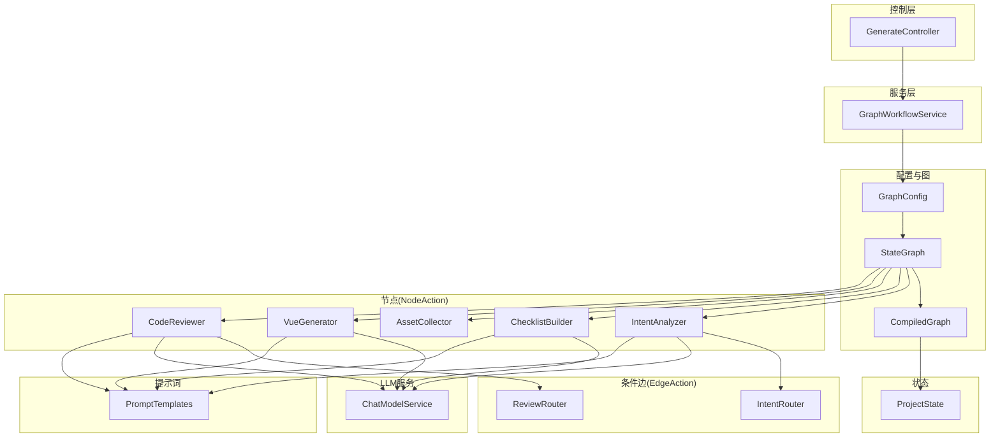
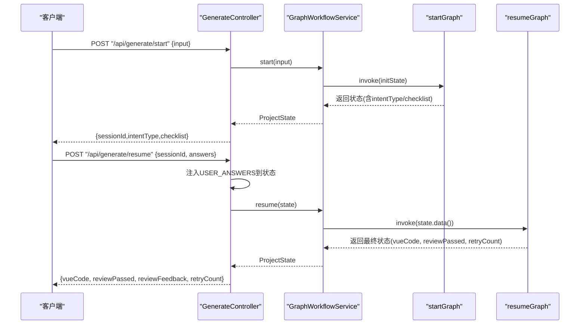
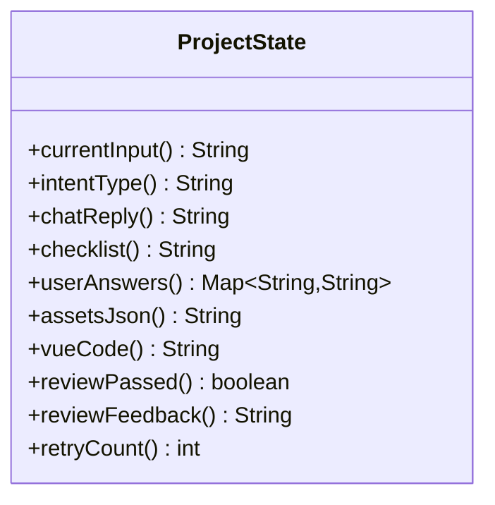
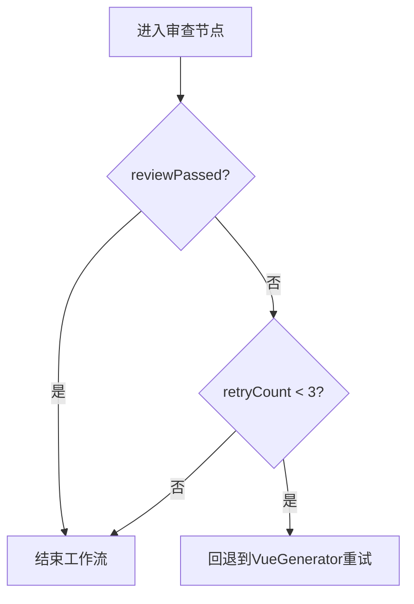
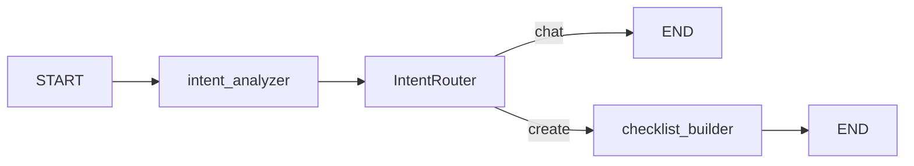
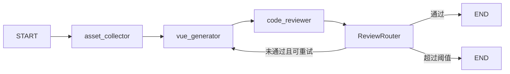
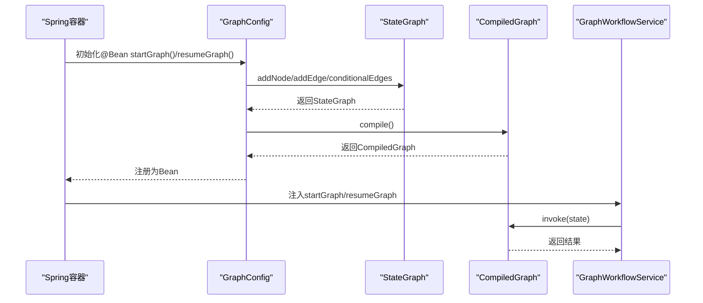
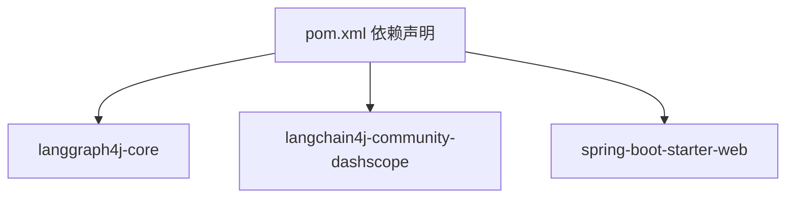

# 状态图工作流架构

<cite>
**本文引用的文件**
- [ProjectState.java](file://src/main/java/com/example/websitemother/state/ProjectState.java)
- [IntentRouter.java](file://src/main/java/com/example/websitemother/edge/IntentRouter.java)
- [ReviewRouter.java](file://src/main/java/com/example/websitemother/edge/ReviewRouter.java)
- [IntentAnalyzer.java](file://src/main/java/com/example/websitemother/node/IntentAnalyzer.java)
- [ChecklistBuilder.java](file://src/main/java/com/example/websitemother/node/ChecklistBuilder.java)
- [AssetCollector.java](file://src/main/java/com/example/websitemother/node/AssetCollector.java)
- [VueGenerator.java](file://src/main/java/com/example/websitemother/node/VueGenerator.java)
- [CodeReviewer.java](file://src/main/java/com/example/websitemother/node/CodeReviewer.java)
- [GraphWorkflowService.java](file://src/main/java/com/example/websitemother/service/GraphWorkflowService.java)
- [GraphConfig.java](file://src/main/java/com/example/websitemother/config/GraphConfig.java)
- [GenerateController.java](file://src/main/java/com/example/websitemother/controller/GenerateController.java)
- [PromptTemplates.java](file://src/main/java/com/example/websitemother/prompt/PromptTemplates.java)
- [ChatModelService.java](file://src/main/java/com/example/websitemother/service/ChatModelService.java)
- [application.yml](file://src/main/resources/application.yml)
- [pom.xml](file://pom.xml)
</cite>

## 目录
1. [简介](#简介)
2. [项目结构](#项目结构)
3. [核心组件](#核心组件)
4. [架构总览](#架构总览)
5. [详细组件分析](#详细组件分析)
6. [依赖关系分析](#依赖关系分析)
7. [性能考量](#性能考量)
8. [故障排查指南](#故障排查指南)
9. [结论](#结论)
10. [附录](#附录)

## 简介
本文件面向架构师与高级开发者，系统性阐述WebsiteMother项目基于LangGraph4J的状态图工作流架构。重点包括：
- LangGraph4J在系统中的核心作用与实现原理：状态图构建、节点定义、边连接机制与异步执行。
- ProjectState状态管理的设计理念：状态字段、转换规则与数据持久化策略。
- 条件路由机制：IntentRouter与ReviewRouter的决策逻辑。
- 双阶段工作流设计：startGraph（意图分析+清单生成）与resumeGraph（素材收集+代码生成+审查循环）。
- 异步节点执行与状态图编译过程。
- 状态图可视化示例与调试技巧。

## 项目结构
WebsiteMother采用分层与按职责划分的组织方式：
- controller：对外HTTP接口，负责会话状态存储与请求/响应封装。
- service：工作流执行服务，封装两阶段图的invoke调用。
- config：状态图装配与编译，定义startGraph与resumeGraph。
- node：工作流节点（动作），每个节点实现NodeAction并返回增量状态映射。
- edge：条件边（动作），实现EdgeAction并返回下一节点名称。
- state：全局状态载体，继承AgentState并提供强类型访问器。
- prompt：统一管理各节点的提示词模板。
- service/ChatModelService：封装DashScope Qwen模型调用。
- resources/application.yml：LangChain4j/DashScope配置。

图表来源
- [GenerateController.java:1-115](file://src/main/java/com/example/websitemother/controller/GenerateController.java#L1-L115)
- [GraphWorkflowService.java:1-60](file://src/main/java/com/example/websitemother/service/GraphWorkflowService.java#L1-L60)
- [GraphConfig.java:1-99](file://src/main/java/com/example/websitemother/config/GraphConfig.java#L1-L99)
- [ProjectState.java:1-78](file://src/main/java/com/example/websitemother/state/ProjectState.java#L1-L78)
- [IntentAnalyzer.java:1-61](file://src/main/java/com/example/websitemother/node/IntentAnalyzer.java#L1-L61)
- [ChecklistBuilder.java:1-51](file://src/main/java/com/example/websitemother/node/ChecklistBuilder.java#L1-L51)
- [AssetCollector.java:1-89](file://src/main/java/com/example/websitemother/node/AssetCollector.java#L1-L89)
- [VueGenerator.java:1-64](file://src/main/java/com/example/websitemother/node/VueGenerator.java#L1-L64)
- [CodeReviewer.java:1-61](file://src/main/java/com/example/websitemother/node/CodeReviewer.java#L1-L61)
- [IntentRouter.java:1-31](file://src/main/java/com/example/websitemother/edge/IntentRouter.java#L1-L31)
- [ReviewRouter.java:1-43](file://src/main/java/com/example/websitemother/edge/ReviewRouter.java#L1-L43)
- [PromptTemplates.java:1-93](file://src/main/java/com/example/websitemother/prompt/PromptTemplates.java#L1-L93)
- [ChatModelService.java:1-58](file://src/main/java/com/example/websitemother/service/ChatModelService.java#L1-L58)

章节来源
- [GenerateController.java:1-115](file://src/main/java/com/example/websitemother/controller/GenerateController.java#L1-L115)
- [GraphConfig.java:1-99](file://src/main/java/com/example/websitemother/config/GraphConfig.java#L1-L99)
- [GraphWorkflowService.java:1-60](file://src/main/java/com/example/websitemother/service/GraphWorkflowService.java#L1-L60)
- [ProjectState.java:1-78](file://src/main/java/com/example/websitemother/state/ProjectState.java#L1-L78)

## 核心组件
- ProjectState：LangGraph4J的全局状态容器，提供强类型字段访问器，承载意图类型、聊天回复、清单、用户答案、素材JSON、Vue代码、审查结果、重试计数等。
- NodeAction节点：IntentAnalyzer、ChecklistBuilder、AssetCollector、VueGenerator、CodeReviewer，分别承担意图识别、清单生成、素材收集、代码生成、代码审查。
- EdgeAction条件边：IntentRouter、ReviewRouter，分别在startGraph与resumeGraph中进行条件路由。
- GraphWorkflowService：封装startGraph与resumeGraph的执行入口，负责初始化状态与结果映射。
- GraphConfig：装配StateGraph并编译为CompiledGraph，定义双阶段工作流的节点与边。
- GenerateController：REST接口，负责会话生命周期与状态持久化（内存级演示）。
- PromptTemplates：统一管理各节点提示词模板。
- ChatModelService：封装DashScope Qwen调用，统一消息组装与异常处理。

章节来源
- [ProjectState.java:1-78](file://src/main/java/com/example/websitemother/state/ProjectState.java#L1-L78)
- [IntentAnalyzer.java:1-61](file://src/main/java/com/example/websitemother/node/IntentAnalyzer.java#L1-L61)
- [ChecklistBuilder.java:1-51](file://src/main/java/com/example/websitemother/node/ChecklistBuilder.java#L1-L51)
- [AssetCollector.java:1-89](file://src/main/java/com/example/websitemother/node/AssetCollector.java#L1-L89)
- [VueGenerator.java:1-64](file://src/main/java/com/example/websitemother/node/VueGenerator.java#L1-L64)
- [CodeReviewer.java:1-61](file://src/main/java/com/example/websitemother/node/CodeReviewer.java#L1-L61)
- [IntentRouter.java:1-31](file://src/main/java/com/example/websitemother/edge/IntentRouter.java#L1-L31)
- [ReviewRouter.java:1-43](file://src/main/java/com/example/websitemother/edge/ReviewRouter.java#L1-L43)
- [GraphWorkflowService.java:1-60](file://src/main/java/com/example/websitemother/service/GraphWorkflowService.java#L1-L60)
- [GraphConfig.java:1-99](file://src/main/java/com/example/websitemother/config/GraphConfig.java#L1-L99)
- [GenerateController.java:1-115](file://src/main/java/com/example/websitemother/controller/GenerateController.java#L1-L115)
- [PromptTemplates.java:1-93](file://src/main/java/com/example/websitemother/prompt/PromptTemplates.java#L1-L93)
- [ChatModelService.java:1-58](file://src/main/java/com/example/websitemother/service/ChatModelService.java#L1-L58)

## 架构总览
WebsiteMother采用LangGraph4J实现“状态驱动”的工作流，分为两个阶段：
- startGraph：意图分析 → 清单生成（条件边根据意图类型决定是否结束或进入清单生成）。
- resumeGraph：素材收集 → Vue代码生成 → 代码审查（条件边根据审查结果与重试计数决定结束或回退重试）。

图表来源
- [GenerateController.java:1-115](file://src/main/java/com/example/websitemother/controller/GenerateController.java#L1-L115)
- [GraphWorkflowService.java:1-60](file://src/main/java/com/example/websitemother/service/GraphWorkflowService.java#L1-L60)
- [GraphConfig.java:1-99](file://src/main/java/com/example/websitemother/config/GraphConfig.java#L1-L99)

## 详细组件分析

### ProjectState 状态管理
- 设计理念
  - 继承LangGraph4J的AgentState，作为全局状态载体贯穿整条状态图。
  - 使用静态常量定义键名，确保跨组件一致的键访问。
  - 提供强类型访问器，自动处理缺失键与类型转换（如retryCount的容错解析）。
- 关键字段
  - 当前输入、意图类型、聊天回复、清单、用户答案、素材JSON、Vue代码、审查通过标志、审查反馈、重试计数。
- 数据持久化策略
  - 控制器层以内存Map形式存储会话状态（演示用途），生产环境建议替换为Redis等持久化存储。
  - GraphWorkflowService在每次invoke后返回新的ProjectState实例，确保不可变性与可追踪性。

图表来源
- [ProjectState.java:1-78](file://src/main/java/com/example/websitemother/state/ProjectState.java#L1-L78)

章节来源
- [ProjectState.java:1-78](file://src/main/java/com/example/websitemother/state/ProjectState.java#L1-L78)
- [GenerateController.java:1-115](file://src/main/java/com/example/websitemother/controller/GenerateController.java#L1-L115)
- [GraphWorkflowService.java:1-60](file://src/main/java/com/example/websitemother/service/GraphWorkflowService.java#L1-L60)

### 条件路由机制
- IntentRouter
  - 输入：ProjectState.intentType
  - 决策：若为chat则结束；否则进入checklist_builder
- ReviewRouter
  - 输入：ProjectState.reviewPassed与ProjectState.retryCount
  - 决策：通过则结束；未通过且retryCount小于阈值则回退到vue_generator；达到阈值则结束

图表来源
- [ReviewRouter.java:1-43](file://src/main/java/com/example/websitemother/edge/ReviewRouter.java#L1-L43)
- [ProjectState.java:1-78](file://src/main/java/com/example/websitemother/state/ProjectState.java#L1-L78)

章节来源
- [IntentRouter.java:1-31](file://src/main/java/com/example/websitemother/edge/IntentRouter.java#L1-L31)
- [ReviewRouter.java:1-43](file://src/main/java/com/example/websitemother/edge/ReviewRouter.java#L1-L43)

### 双阶段工作流设计

#### startGraph：意图分析 + 清单生成
- 节点与边
  - START → intent_analyzer（异步）
  - intent_analyzer → 条件边(IntentRouter)
  - 若chat：结束
  - 若create：进入checklist_builder（异步），再结束
- 关键点
  - 异步节点通过node_async包装，提升吞吐。
  - 条件边通过edge_async包装，支持异步条件判断。

图表来源
- [GraphConfig.java:48-70](file://src/main/java/com/example/websitemother/config/GraphConfig.java#L48-L70)
- [IntentRouter.java:1-31](file://src/main/java/com/example/websitemother/edge/IntentRouter.java#L1-L31)
- [IntentAnalyzer.java:1-61](file://src/main/java/com/example/websitemother/node/IntentAnalyzer.java#L1-L61)
- [ChecklistBuilder.java:1-51](file://src/main/java/com/example/websitemother/node/ChecklistBuilder.java#L1-L51)

章节来源
- [GraphConfig.java:48-70](file://src/main/java/com/example/websitemother/config/GraphConfig.java#L48-L70)
- [GraphWorkflowService.java:25-41](file://src/main/java/com/example/websitemother/service/GraphWorkflowService.java#L25-L41)

#### resumeGraph：素材收集 + Vue代码生成 + 代码审查循环
- 节点与边
  - START → asset_collector（异步）
  - asset_collector → vue_generator（异步）
  - vue_generator → code_reviewer（异步）
  - code_reviewer → 条件边(ReviewRouter)
  - 通过：END；未通过且可重试：回退到vue_generator；超过阈值：END
- 关键点
  - 通过ProjectState.userAnswers注入用户答案，驱动后续节点。
  - ReviewRouter控制重试次数，避免无限循环。

图表来源
- [GraphConfig.java:72-97](file://src/main/java/com/example/websitemother/config/GraphConfig.java#L72-L97)
- [AssetCollector.java:1-89](file://src/main/java/com/example/websitemother/node/AssetCollector.java#L1-L89)
- [VueGenerator.java:1-64](file://src/main/java/com/example/websitemother/node/VueGenerator.java#L1-L64)
- [CodeReviewer.java:1-61](file://src/main/java/com/example/websitemother/node/CodeReviewer.java#L1-L61)
- [ReviewRouter.java:1-43](file://src/main/java/com/example/websitemother/edge/ReviewRouter.java#L1-L43)

章节来源
- [GraphConfig.java:72-97](file://src/main/java/com/example/websitemother/config/GraphConfig.java#L72-L97)
- [GraphWorkflowService.java:43-58](file://src/main/java/com/example/websitemother/service/GraphWorkflowService.java#L43-L58)

### 异步节点执行与状态图编译
- 异步节点
  - 使用node_async包装各NodeAction，使节点执行非阻塞，提升并发能力。
- 异步条件边
  - 使用edge_async包装EdgeAction，支持异步条件判断。
- 编译过程
  - GraphConfig在Spring容器启动时装配StateGraph并调用compile()生成CompiledGraph。
  - GraphWorkflowService通过@Resource注入CompiledGraph，并在invoke时传入或返回状态Map。

图表来源
- [GraphConfig.java:28-99](file://src/main/java/com/example/websitemother/config/GraphConfig.java#L28-L99)
- [GraphWorkflowService.java:17-58](file://src/main/java/com/example/websitemother/service/GraphWorkflowService.java#L17-L58)

章节来源
- [GraphConfig.java:28-99](file://src/main/java/com/example/websitemother/config/GraphConfig.java#L28-L99)
- [GraphWorkflowService.java:17-58](file://src/main/java/com/example/websitemother/service/GraphWorkflowService.java#L17-L58)

### 节点实现要点
- IntentAnalyzer
  - 读取当前输入，调用LLM进行意图分类，解析输出并设置intentType与chatReply。
- ChecklistBuilder
  - 生成需求清单JSON，清理可能的代码块标记，保证下游可用。
- AssetCollector
  - 基于用户答案生成占位图JSON，至少保证hero主图，使用确定性seed构造URL。
- VueGenerator
  - 组装需求与素材，必要时叠加上次审查反馈，生成Vue单文件组件。
- CodeReviewer
  - 严格审查模板、脚本、样式完整性与语法正确性，输出RESULT与FEEDBACK，并递增retryCount。

章节来源
- [IntentAnalyzer.java:1-61](file://src/main/java/com/example/websitemother/node/IntentAnalyzer.java#L1-L61)
- [ChecklistBuilder.java:1-51](file://src/main/java/com/example/websitemother/node/ChecklistBuilder.java#L1-L51)
- [AssetCollector.java:1-89](file://src/main/java/com/example/websitemother/node/AssetCollector.java#L1-L89)
- [VueGenerator.java:1-64](file://src/main/java/com/example/websitemother/node/VueGenerator.java#L1-L64)
- [CodeReviewer.java:1-61](file://src/main/java/com/example/websitemother/node/CodeReviewer.java#L1-L61)

### 提示词与LLM集成
- PromptTemplates集中管理各节点提示词，确保一致性与可维护性。
- ChatModelService封装DashScope Qwen调用，统一SystemMessage/UserMessage组装与异常处理。

章节来源
- [PromptTemplates.java:1-93](file://src/main/java/com/example/websitemother/prompt/PromptTemplates.java#L1-L93)
- [ChatModelService.java:1-58](file://src/main/java/com/example/websitemother/service/ChatModelService.java#L1-L58)
- [application.yml:1-9](file://src/main/resources/application.yml#L1-L9)

## 依赖关系分析
- 外部依赖
  - LangGraph4J核心库：状态图构建与编译。
  - LangChain4j DashScope集成：Qwen模型调用。
  - Spring Boot Web：REST接口与依赖注入。
- 内部耦合
  - GraphConfig对所有节点与边的装配，耦合度高但集中管理，便于变更。
  - GraphWorkflowService仅依赖CompiledGraph，低耦合，易测试。
  - Controller仅依赖服务层，保持薄控制器。

图表来源
- [pom.xml:33-58](file://pom.xml#L33-L58)

章节来源
- [pom.xml:33-58](file://pom.xml#L33-L58)

## 性能考量
- 异步执行
  - 所有节点与条件边均使用异步包装，提升并发吞吐与响应时间。
- 状态最小化
  - 仅在必要字段间传递，避免冗余序列化与网络开销。
- LLM调用优化
  - 统一提示词模板，减少重复计算；合理控制输入长度，避免超限。
- 并发与会话
  - 控制器层使用ConcurrentHashMap存储会话（演示），生产需使用分布式缓存与锁策略。

## 故障排查指南
- 常见问题
  - 会话不存在：检查sessionId是否正确传递与存储。
  - LLM调用失败：确认DashScope API Key与模型名称配置正确。
  - 审查未通过循环：关注retryCount阈值与ReviewRouter逻辑。
- 调试技巧
  - 启用详细日志：观察各节点与条件边的输入输出与分支选择。
  - 分阶段验证：先验证startGraph，再验证resumeGraph。
  - 状态快照：在关键节点打印ProjectState关键字段，定位数据不一致。

章节来源
- [GenerateController.java:27-84](file://src/main/java/com/example/websitemother/controller/GenerateController.java#L27-L84)
- [application.yml:4-9](file://src/main/resources/application.yml#L4-L9)
- [GraphWorkflowService.java:25-58](file://src/main/java/com/example/websitemother/service/GraphWorkflowService.java#L25-L58)

## 结论
WebsiteMother以LangGraph4J为核心，构建了清晰、可扩展、可观测的状态图工作流。通过双阶段设计与条件路由，实现了从意图分析到清单生成再到代码生成与审查的闭环。ProjectState提供强类型状态管理，GraphConfig集中装配与编译，GraphWorkflowService与GenerateController分别承担执行与接口职责。该架构适合进一步扩展更多节点与更复杂的业务分支，同时具备良好的可测试性与可维护性。

## 附录
- 状态图可视化示例
  - startGraph：START → intent_analyzer → 条件边(IntentRouter) → checklist_builder → END
  - resumeGraph：START → asset_collector → vue_generator → code_reviewer → 条件边(ReviewRouter) → {END | 回退到vue_generator}
- 扩展建议
  - 引入中间态暂停：在清单生成后暂停等待人工确认。
  - 增加重试上限与退避策略：防止审查循环导致资源浪费。
  - 会话持久化：替换内存存储为Redis，支持多实例部署。
  - 监控与追踪：引入链路追踪与指标埋点，提升可观测性。