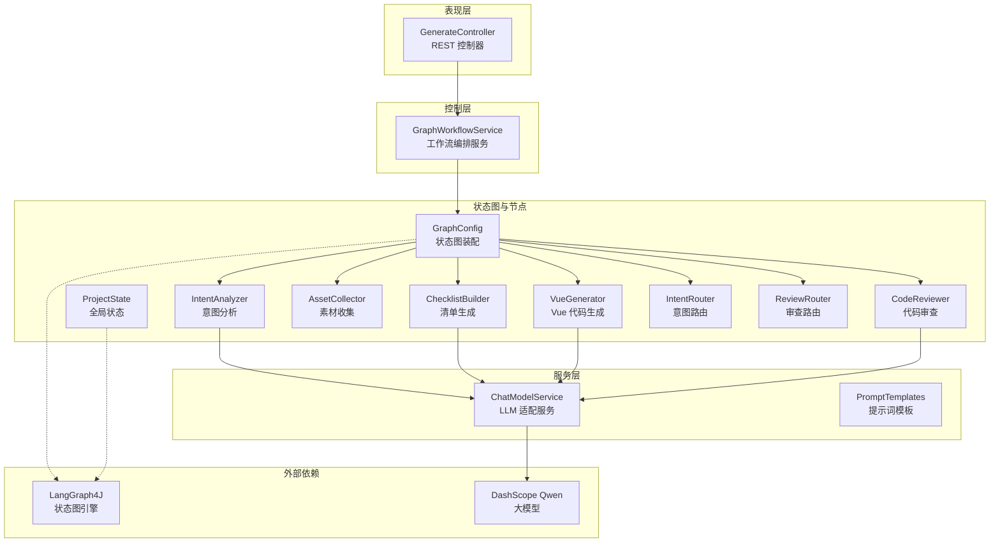
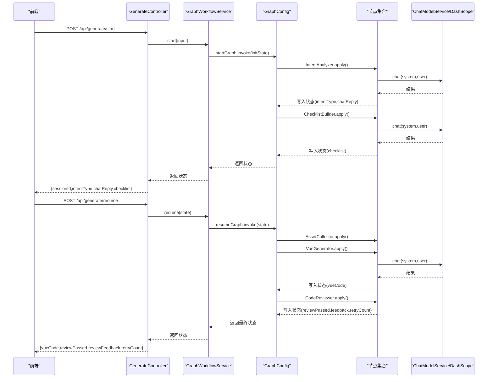
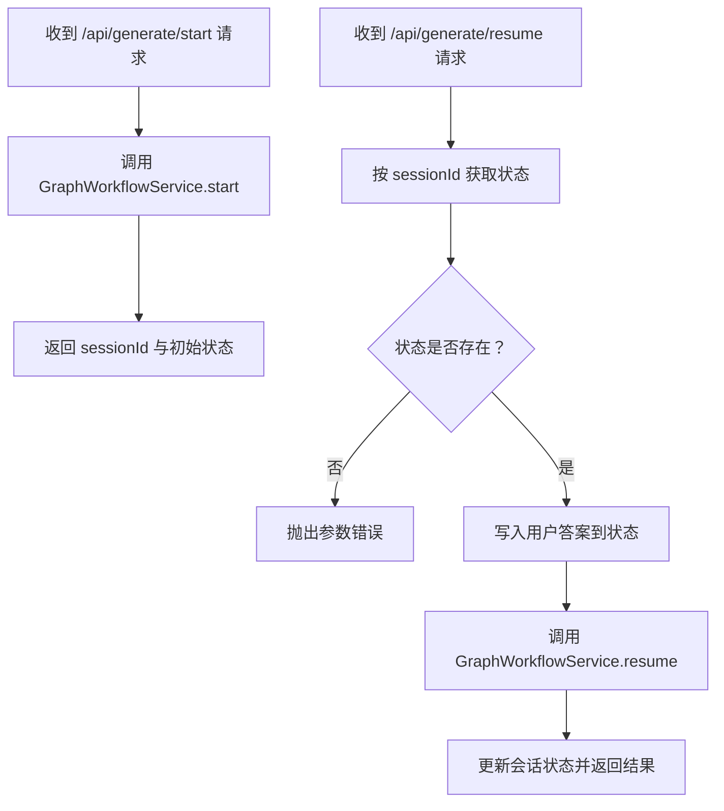
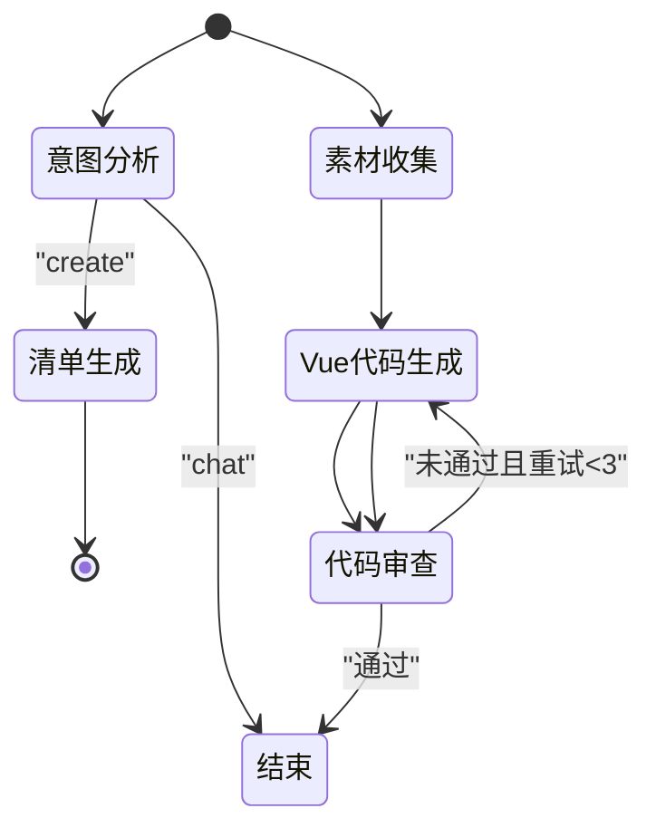
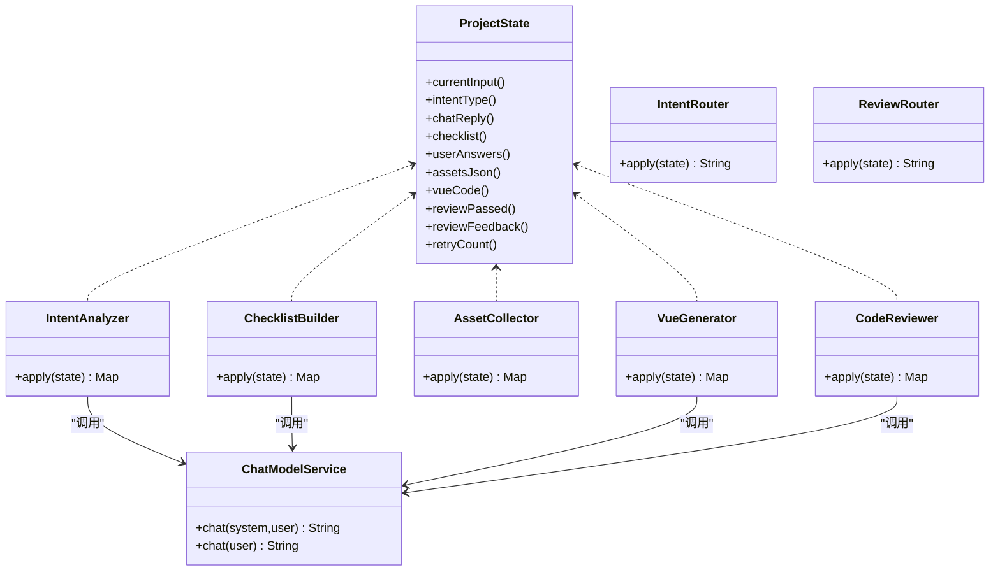
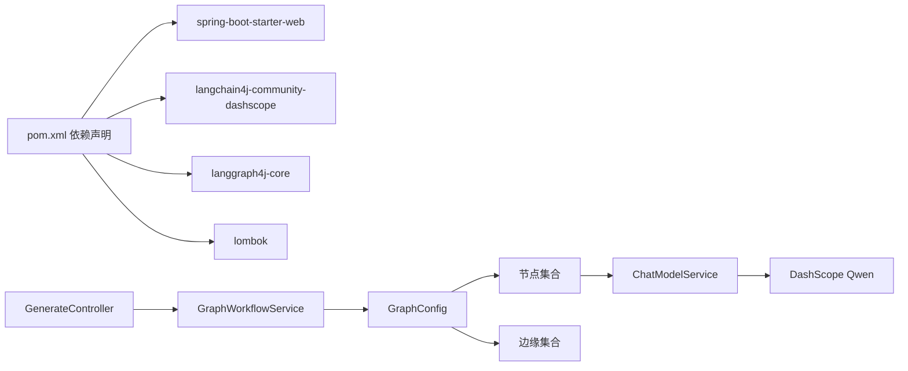

# 系统架构设计

<cite>
**本文引用的文件**
- [WebsiteMotherApplication.java](file://src/main/java/com/example/websitemother/WebsiteMotherApplication.java)
- [GraphConfig.java](file://src/main/java/com/example/websitemother/config/GraphConfig.java)
- [WebConfig.java](file://src/main/java/com/example/websitemother/config/WebConfig.java)
- [GenerateController.java](file://src/main/java/com/example/websitemother/controller/GenerateController.java)
- [GraphWorkflowService.java](file://src/main/java/com/example/websitemother/service/GraphWorkflowService.java)
- [ChatModelService.java](file://src/main/java/com/example/websitemother/service/ChatModelService.java)
- [ProjectState.java](file://src/main/java/com/example/websitemother/state/ProjectState.java)
- [IntentAnalyzer.java](file://src/main/java/com/example/websitemother/node/IntentAnalyzer.java)
- [ChecklistBuilder.java](file://src/main/java/com/example/websitemother/node/ChecklistBuilder.java)
- [AssetCollector.java](file://src/main/java/com/example/websitemother/node/AssetCollector.java)
- [VueGenerator.java](file://src/main/java/com/example/websitemother/node/VueGenerator.java)
- [CodeReviewer.java](file://src/main/java/com/example/websitemother/node/CodeReviewer.java)
- [IntentRouter.java](file://src/main/java/com/example/websitemother/edge/IntentRouter.java)
- [ReviewRouter.java](file://src/main/java/com/example/websitemother/edge/ReviewRouter.java)
- [PromptTemplates.java](file://src/main/java/com/example/websitemother/prompt/PromptTemplates.java)
- [application.yml](file://src/main/resources/application.yml)
- [pom.xml](file://pom.xml)
</cite>

## 目录
1. [简介](#简介)
2. [项目结构](#项目结构)
3. [核心组件](#核心组件)
4. [架构总览](#架构总览)
5. [详细组件分析](#详细组件分析)
6. [依赖分析](#依赖分析)
7. [性能考量](#性能考量)
8. [故障排查指南](#故障排查指南)
9. [结论](#结论)
10. [附录](#附录)

## 简介
WebsiteMother 是一个基于 Spring Boot 的 AI 驱动网站生成系统，采用分层架构与状态图工作流（LangGraph4J）实现“意图识别—需求清单—素材收集—代码生成—代码审查”的闭环流程。系统通过多智能体节点协作，结合条件边路由实现人机协同与自动迭代优化，支持前端与后端的清晰边界与可扩展的微服务化演进。

## 项目结构
系统采用典型的三层表现层（Controller）、业务层（Service）、数据访问/外部集成层（ChatModelService）与状态图编排层（GraphConfig），配合状态实体（ProjectState）与提示词模板（PromptTemplates）实现高内聚低耦合的模块化设计。

图表来源
- [GenerateController.java:1-115](file://src/main/java/com/example/websitemother/controller/GenerateController.java#L1-L115)
- [GraphWorkflowService.java:1-60](file://src/main/java/com/example/websitemother/service/GraphWorkflowService.java#L1-L60)
- [GraphConfig.java:1-99](file://src/main/java/com/example/websitemother/config/GraphConfig.java#L1-L99)
- [ProjectState.java:1-78](file://src/main/java/com/example/websitemother/state/ProjectState.java#L1-L78)
- [IntentAnalyzer.java:1-61](file://src/main/java/com/example/websitemother/node/IntentAnalyzer.java#L1-L61)
- [ChecklistBuilder.java:1-51](file://src/main/java/com/example/websitemother/node/ChecklistBuilder.java#L1-L51)
- [AssetCollector.java:1-89](file://src/main/java/com/example/websitemother/node/AssetCollector.java#L1-L89)
- [VueGenerator.java:1-64](file://src/main/java/com/example/websitemother/node/VueGenerator.java#L1-L64)
- [CodeReviewer.java:1-61](file://src/main/java/com/example/websitemother/node/CodeReviewer.java#L1-L61)
- [IntentRouter.java:1-31](file://src/main/java/com/example/websitemother/edge/IntentRouter.java#L1-L31)
- [ReviewRouter.java:1-43](file://src/main/java/com/example/websitemother/edge/ReviewRouter.java#L1-L43)
- [ChatModelService.java:1-58](file://src/main/java/com/example/websitemother/service/ChatModelService.java#L1-L58)
- [PromptTemplates.java:1-93](file://src/main/java/com/example/websitemother/prompt/PromptTemplates.java#L1-L93)

章节来源
- [WebsiteMotherApplication.java:1-14](file://src/main/java/com/example/websitemother/WebsiteMotherApplication.java#L1-L14)
- [pom.xml:1-115](file://pom.xml#L1-L115)

## 核心组件
- 表现层（Controller）
  - GenerateController 提供 /api/generate/start 与 /api/generate/resume 两个核心接口，负责接收请求、维护会话状态、协调工作流执行与响应封装。
- 控制层（Service）
  - GraphWorkflowService 封装 LangGraph4J 编译图的执行，分别处理“开始图”和“恢复图”，屏蔽状态图细节。
- 服务层（LLM 适配）
  - ChatModelService 统一封装 DashScope Qwen 的调用，支持 SystemMessage + UserMessage 组合，简化各节点对大模型的接入。
- 状态图与状态
  - GraphConfig 装配两个状态图：startGraph（意图分析→清单生成）与 resumeGraph（素材收集→Vue 生成→代码审查循环）。ProjectState 作为全局状态容器，承载输入、意图、清单、素材、代码、审查结果与重试计数等键值。
- 节点与边缘
  - 节点：IntentAnalyzer、ChecklistBuilder、AssetCollector、VueGenerator、CodeReviewer 实现具体工作单元。
  - 边缘：IntentRouter、ReviewRouter 实现条件路由，驱动工作流分支与循环。

章节来源
- [GenerateController.java:1-115](file://src/main/java/com/example/websitemother/controller/GenerateController.java#L1-L115)
- [GraphWorkflowService.java:1-60](file://src/main/java/com/example/websitemother/service/GraphWorkflowService.java#L1-L60)
- [GraphConfig.java:1-99](file://src/main/java/com/example/websitemother/config/GraphConfig.java#L1-L99)
- [ProjectState.java:1-78](file://src/main/java/com/example/websitemother/state/ProjectState.java#L1-L78)
- [ChatModelService.java:1-58](file://src/main/java/com/example/websitemother/service/ChatModelService.java#L1-L58)

## 架构总览
系统采用分层架构与状态图工作流的组合设计：
- 分层架构
  - 表现层：REST 接口、CORS 配置、会话状态管理。
  - 控制层：工作流编排、状态图执行。
  - 服务层：LLM 适配、提示词模板。
  - 数据访问层：本项目以内存会话存储演示（ConcurrentHashMap），生产环境建议替换为 Redis 等持久化缓存。
- 状态图工作流
  - LangGraph4J 提供状态图编排能力，节点间通过状态传递数据，边缘根据状态值进行条件跳转，形成“人机协同 + 自动迭代”的闭环。

图表来源
- [GenerateController.java:1-115](file://src/main/java/com/example/websitemother/controller/GenerateController.java#L1-L115)
- [GraphWorkflowService.java:1-60](file://src/main/java/com/example/websitemother/service/GraphWorkflowService.java#L1-L60)
- [GraphConfig.java:1-99](file://src/main/java/com/example/websitemother/config/GraphConfig.java#L1-L99)
- [IntentAnalyzer.java:1-61](file://src/main/java/com/example/websitemother/node/IntentAnalyzer.java#L1-L61)
- [ChecklistBuilder.java:1-51](file://src/main/java/com/example/websitemother/node/ChecklistBuilder.java#L1-L51)
- [AssetCollector.java:1-89](file://src/main/java/com/example/websitemother/node/AssetCollector.java#L1-L89)
- [VueGenerator.java:1-64](file://src/main/java/com/example/websitemother/node/VueGenerator.java#L1-L64)
- [CodeReviewer.java:1-61](file://src/main/java/com/example/websitemother/node/CodeReviewer.java#L1-L61)
- [ChatModelService.java:1-58](file://src/main/java/com/example/websitemother/service/ChatModelService.java#L1-L58)

## 详细组件分析

### 控制层：GenerateController
- 职责
  - 提供启动与恢复两个 API，负责会话 ID 生成、状态存储与响应封装。
  - 使用内存 ConcurrentHashMap 存储会话状态（演示用途，生产需替换为 Redis）。
- 关键流程
  - /start：调用 GraphWorkflowService.start，返回 sessionId 与初始状态字段。
  - /resume：读取会话状态，填充用户答案，调用 GraphWorkflowService.resume，返回最终状态字段。

图表来源
- [GenerateController.java:1-115](file://src/main/java/com/example/websitemother/controller/GenerateController.java#L1-L115)

章节来源
- [GenerateController.java:1-115](file://src/main/java/com/example/websitemother/controller/GenerateController.java#L1-L115)

### 控制层：GraphWorkflowService
- 职责
  - 暴露 start/resume 两个入口，封装 LangGraph4J 图的执行。
- 处理逻辑
  - start：构造初始状态并执行 startGraph。
  - resume：直接执行 resumeGraph 并返回最终状态。

章节来源
- [GraphWorkflowService.java:1-60](file://src/main/java/com/example/websitemother/service/GraphWorkflowService.java#L1-L60)

### 状态图与状态：GraphConfig 与 ProjectState
- GraphConfig
  - 装配 startGraph：IntentAnalyzer → 条件边（IntentRouter）→ ChecklistBuilder → END。
  - 装配 resumeGraph：AssetCollector → VueGenerator → CodeReviewer → 条件边（ReviewRouter）→ END 或回退到 VueGenerator。
- ProjectState
  - 全局状态键：当前输入、意图类型、闲聊回复、清单、用户答案、素材 JSON、Vue 代码、审查结果、反馈、重试计数。
  - 提供类型安全的 getter 方法，便于节点读取与更新。

图表来源
- [GraphConfig.java:1-99](file://src/main/java/com/example/websitemother/config/GraphConfig.java#L1-L99)
- [IntentRouter.java:1-31](file://src/main/java/com/example/websitemother/edge/IntentRouter.java#L1-L31)
- [ReviewRouter.java:1-43](file://src/main/java/com/example/websitemother/edge/ReviewRouter.java#L1-L43)
- [ProjectState.java:1-78](file://src/main/java/com/example/websitemother/state/ProjectState.java#L1-L78)

章节来源
- [GraphConfig.java:1-99](file://src/main/java/com/example/websitemother/config/GraphConfig.java#L1-L99)
- [ProjectState.java:1-78](file://src/main/java/com/example/websitemother/state/ProjectState.java#L1-L78)

### 节点与边缘：AI 节点协作机制
- IntentAnalyzer
  - 输入：currentInput。
  - 输出：intentType、chatReply。
  - 通过 ChatModelService 调用 LLM，解析固定格式输出。
- ChecklistBuilder
  - 输入：currentInput。
  - 输出：checklist（JSON 字符串）。
  - 清洗 LLM 输出的代码块标记。
- AssetCollector
  - 输入：userAnswers。
  - 输出：assetsJson（包含每项素材的 URL、描述、关键词）。
  - 保证至少一张 hero 主图，使用确定性 seed 构造图片 URL。
- VueGenerator
  - 输入：currentInput、assetsJson、reviewFeedback。
  - 输出：vueCode。
  - 组装完整需求描述，清洗 LLM 输出的代码块标记。
- CodeReviewer
  - 输入：vueCode、retryCount。
  - 输出：reviewPassed、reviewFeedback、retryCount。
  - 固定格式 RESULT/FEEDBACK，支持最多 3 次重试。

图表来源
- [ProjectState.java:1-78](file://src/main/java/com/example/websitemother/state/ProjectState.java#L1-L78)
- [IntentAnalyzer.java:1-61](file://src/main/java/com/example/websitemother/node/IntentAnalyzer.java#L1-L61)
- [ChecklistBuilder.java:1-51](file://src/main/java/com/example/websitemother/node/ChecklistBuilder.java#L1-L51)
- [AssetCollector.java:1-89](file://src/main/java/com/example/websitemother/node/AssetCollector.java#L1-L89)
- [VueGenerator.java:1-64](file://src/main/java/com/example/websitemother/node/VueGenerator.java#L1-L64)
- [CodeReviewer.java:1-61](file://src/main/java/com/example/websitemother/node/CodeReviewer.java#L1-L61)
- [ChatModelService.java:1-58](file://src/main/java/com/example/websitemother/service/ChatModelService.java#L1-L58)

章节来源
- [IntentAnalyzer.java:1-61](file://src/main/java/com/example/websitemother/node/IntentAnalyzer.java#L1-L61)
- [ChecklistBuilder.java:1-51](file://src/main/java/com/example/websitemother/node/ChecklistBuilder.java#L1-L51)
- [AssetCollector.java:1-89](file://src/main/java/com/example/websitemother/node/AssetCollector.java#L1-L89)
- [VueGenerator.java:1-64](file://src/main/java/com/example/websitemother/node/VueGenerator.java#L1-L64)
- [CodeReviewer.java:1-61](file://src/main/java/com/example/websitemother/node/CodeReviewer.java#L1-L61)
- [IntentRouter.java:1-31](file://src/main/java/com/example/websitemother/edge/IntentRouter.java#L1-L31)
- [ReviewRouter.java:1-43](file://src/main/java/com/example/websitemother/edge/ReviewRouter.java#L1-L43)
- [ChatModelService.java:1-58](file://src/main/java/com/example/websitemother/service/ChatModelService.java#L1-L58)

### 提示词模板与安全边界
- PromptTemplates
  - 集中管理各节点的系统提示词与用户提示词模板，确保输出格式可控，便于审查与迭代。
- 安全边界
  - 通过固定格式输出（如 INTENT/REPLY、RESULT/FEEDBACK）降低 LLM 输出不确定性带来的风险。
  - 对 LLM 输出进行清洗与校验，避免直接透传不可控内容。

章节来源
- [PromptTemplates.java:1-93](file://src/main/java/com/example/websitemother/prompt/PromptTemplates.java#L1-L93)

### CORS 与 Web 配置
- WebConfig
  - 针对 /api/** 开放本地前端开发服务器域名的跨域访问，支持常用方法与头，并允许凭证与缓存预检请求。

章节来源
- [WebConfig.java:1-23](file://src/main/java/com/example/websitemother/config/WebConfig.java#L1-L23)

## 依赖分析
- 外部依赖
  - Spring Boot Web：提供 Web MVC 与嵌入式服务器。
  - LangChain4J DashScope Starter：集成阿里 DashScope Qwen 模型。
  - LangGraph4J Core：状态图编排引擎。
  - Lombok：减少样板代码。
- 内部依赖
  - Controller 依赖 Service。
  - Service 依赖 GraphConfig（通过 Bean 注入）、ChatModelService。
  - 节点依赖 ChatModelService 与 PromptTemplates。
  - GraphConfig 依赖所有节点与边缘。

图表来源
- [pom.xml:1-115](file://pom.xml#L1-L115)
- [GenerateController.java:1-115](file://src/main/java/com/example/websitemother/controller/GenerateController.java#L1-L115)
- [GraphWorkflowService.java:1-60](file://src/main/java/com/example/websitemother/service/GraphWorkflowService.java#L1-L60)
- [GraphConfig.java:1-99](file://src/main/java/com/example/websitemother/config/GraphConfig.java#L1-L99)
- [ChatModelService.java:1-58](file://src/main/java/com/example/websitemother/service/ChatModelService.java#L1-L58)

章节来源
- [pom.xml:1-115](file://pom.xml#L1-L115)

## 性能考量
- 并发处理
  - 控制层使用线程安全的 ConcurrentHashMap 存储会话状态，适合单实例演示；生产环境建议迁移到 Redis 集群，支持水平扩展与高可用。
- 缓存策略
  - LLM 调用成本较高，可在 ChatModelService 层引入本地缓存（如基于输入指纹的简单缓存）以减少重复调用；同时注意缓存失效策略与一致性。
- 负载均衡
  - 采用无状态设计，后端可水平扩展；前端通过反向代理（Nginx）做静态资源与 API 路由，实现多实例负载均衡。
- I/O 与序列化
  - AssetCollector 与 VueGenerator 涉及 JSON 序列化，建议使用高性能库（Jackson 默认已较优）并避免不必要的对象拷贝。
- 状态图执行
  - LangGraph4J 在 JVM 内部执行，节点间通过状态传递数据，避免频繁网络调用；合理拆分节点粒度，避免单节点计算过重。

## 故障排查指南
- 常见问题定位
  - LLM 调用异常：检查 ChatModelService 的日志与 DashScope API Key 配置，确认网络连通性与配额。
  - 工作流执行失败：查看 GraphWorkflowService 的异常堆栈，定位具体节点与状态键值。
  - 会话状态缺失：确认 GenerateController 的会话存储是否被清理或过期。
- 日志与监控
  - 控制层与服务层均使用 SLF4J 记录关键事件，建议接入统一日志平台与链路追踪（如 SkyWalking/OpenTelemetry）。
- 安全加固
  - 生产环境务必启用 HTTPS、CORS 白名单收敛、API 限流与鉴权（如基于 Token 的认证）。
  - 对用户输入进行最小必要清洗与长度限制，避免提示词注入与超长输入导致的性能问题。

章节来源
- [ChatModelService.java:1-58](file://src/main/java/com/example/websitemother/service/ChatModelService.java#L1-L58)
- [GraphWorkflowService.java:1-60](file://src/main/java/com/example/websitemother/service/GraphWorkflowService.java#L1-L60)
- [GenerateController.java:1-115](file://src/main/java/com/example/websitemother/controller/GenerateController.java#L1-L115)
- [application.yml:1-9](file://src/main/resources/application.yml#L1-L9)

## 结论
WebsiteMother 通过分层架构与状态图工作流实现了清晰的职责划分与可演进的 AI 协作流程。LangGraph4J 将复杂的多智能体协作抽象为状态图，结合固定的提示词格式与条件路由，既保证了可解释性，也为后续扩展（如增加更多节点、边缘或微服务化）奠定了基础。建议在生产环境中强化缓存、会话存储与安全防护，并逐步引入可观测性与弹性伸缩能力。

## 附录
- 微服务化设计建议
  - 按功能拆分：LLM 服务、工作流编排服务、会话存储服务、前端网关服务。
  - 边界划分：每个服务独立部署、独立扩缩容；通过 API 网关统一入口。
  - 数据一致性：会话状态迁移至分布式缓存/数据库，节点间通过消息队列异步解耦。
- 安全架构
  - 强制 HTTPS 与最小权限原则；对敏感配置（API Key）进行加密存储与动态注入。
  - 对外暴露的 API 加强限流、鉴权与审计日志。