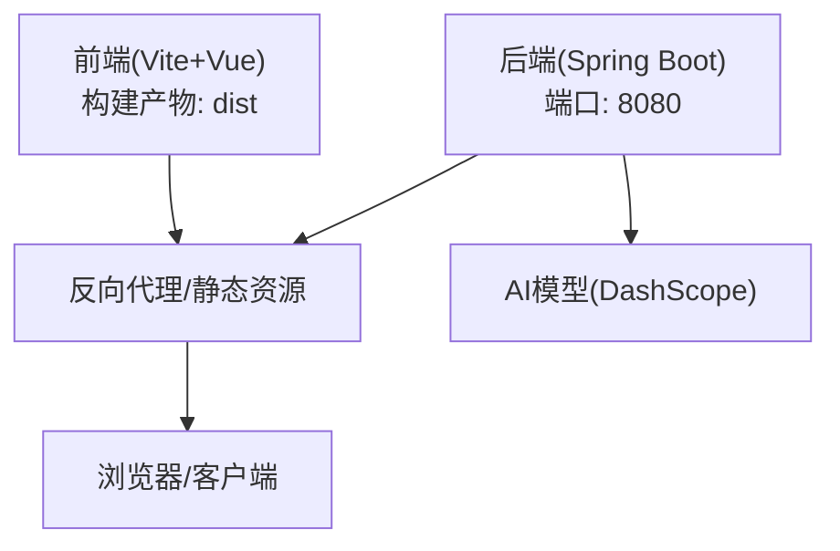
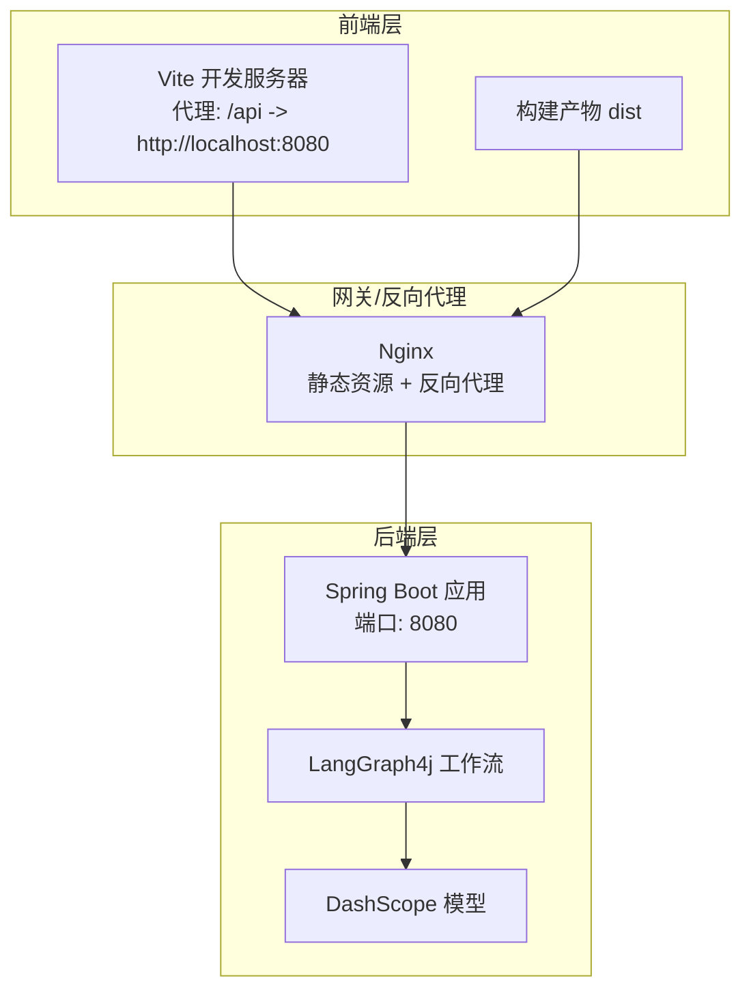
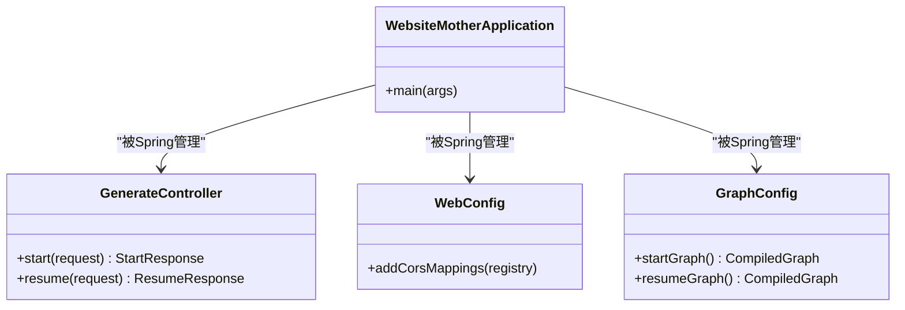
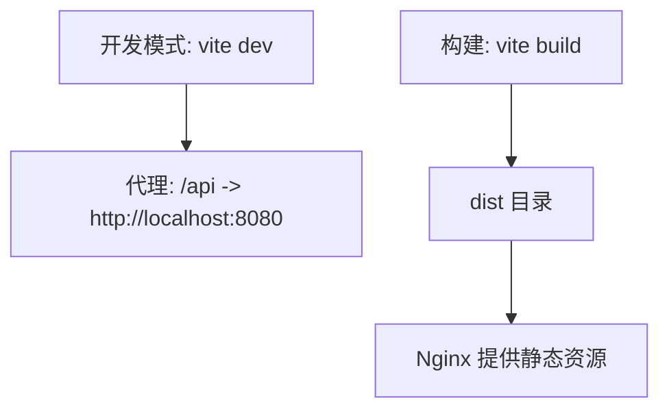
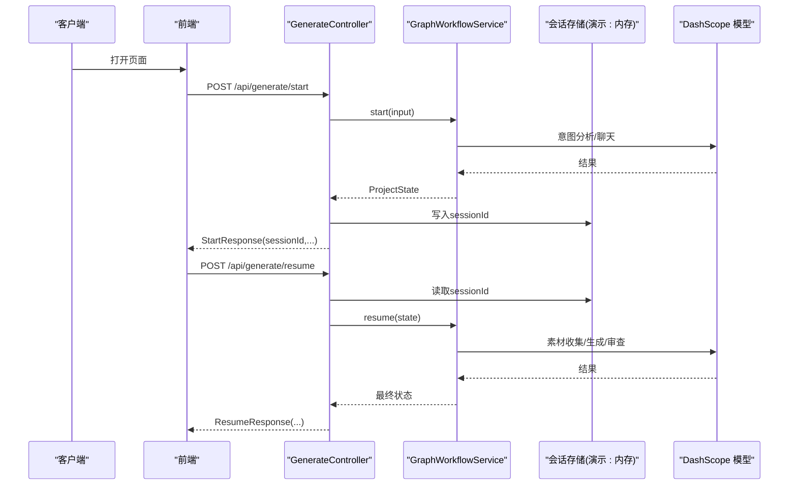
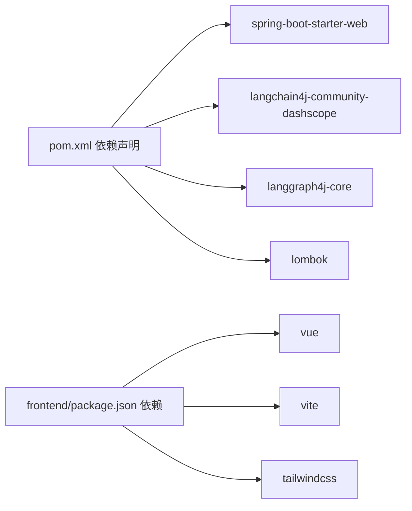

# 部署运维

<cite>
**本文引用的文件**
- [pom.xml](file://pom.xml)
- [application.yml](file://src/main/resources/application.yml)
- [WebsiteMotherApplication.java](file://src/main/java/com/example/websitemother/WebsiteMotherApplication.java)
- [GenerateController.java](file://src/main/java/com/example/websitemother/controller/GenerateController.java)
- [WebConfig.java](file://src/main/java/com/example/websitemother/config/WebConfig.java)
- [GraphConfig.java](file://src/main/java/com/example/websitemother/config/GraphConfig.java)
- [package.json](file://frontend/package.json)
- [vite.config.js](file://frontend/vite.config.js)
- [.gitignore](file://.gitignore)
</cite>

## 目录
1. [简介](#简介)
2. [项目结构](#项目结构)
3. [核心组件](#核心组件)
4. [架构总览](#架构总览)
5. [详细组件分析](#详细组件分析)
6. [依赖分析](#依赖分析)
7. [性能考虑](#性能考虑)
8. [故障排查指南](#故障排查指南)
9. [结论](#结论)
10. [附录](#附录)

## 简介
本文件面向运维与平台工程团队，提供WebsiteMother项目的生产部署与运维操作手册。内容覆盖服务器与环境准备、依赖安装、Spring Boot后端打包、前端静态资源构建、容器化部署与编排、CI/CD流水线建议、性能监控与日志管理、故障恢复与备份策略、安全加固与漏洞防护，以及系统维护与升级操作指南。目标是帮助系统在生产环境稳定运行并具备良好可维护性。

## 项目结构
WebsiteMother采用前后端分离架构：
- 后端基于Spring Boot 3.x与Java 21，使用Maven进行构建与依赖管理。
- 前端基于Vite + Vue 3，通过代理将/api前缀转发至后端服务。
- 应用通过LangGraph4j实现状态图工作流，结合DashScope模型提供AI能力。
- 配置文件集中于后端resources目录，前端构建产物输出至dist目录。

**章节来源**
- [pom.xml:1-115](file://pom.xml#L1-L115)
- [package.json:1-24](file://frontend/package.json#L1-L24)
- [vite.config.js:1-17](file://frontend/vite.config.js#L1-L17)
- [application.yml:1-9](file://src/main/resources/application.yml#L1-L9)

## 核心组件
- 应用入口与启动
  - 后端主类负责Spring Boot启动，作为应用入口。
- 控制器层
  - 生成流程控制器提供两阶段API：启动与继续；内部使用内存会话存储演示级状态。
- 配置层
  - Web配置启用CORS，允许本地开发源访问；LangGraph4j配置定义两阶段工作流图。
- 资源配置
  - application.yml集中配置AI模型参数（如API Key、模型名），用于生产环境注入。

**章节来源**
- [WebsiteMotherApplication.java:1-14](file://src/main/java/com/example/websitemother/WebsiteMotherApplication.java#L1-L14)
- [GenerateController.java:1-115](file://src/main/java/com/example/websitemother/controller/GenerateController.java#L1-L115)
- [WebConfig.java:1-23](file://src/main/java/com/example/websitemother/config/WebConfig.java#L1-L23)
- [GraphConfig.java:1-99](file://src/main/java/com/example/websitemother/config/GraphConfig.java#L1-L99)
- [application.yml:1-9](file://src/main/resources/application.yml#L1-L9)

## 架构总览
系统由“前端静态站点 + 反向代理 + 后端服务”三层组成。前端通过Vite代理将/api请求转发至后端；后端通过LangGraph4j驱动工作流，调用DashScope模型完成AI生成任务。生产部署建议将前端构建产物托管于Nginx，后端以容器形式运行，并通过反向代理统一对外提供服务。

**图表来源**
- [vite.config.js:1-17](file://frontend/vite.config.js#L1-L17)
- [WebConfig.java:1-23](file://src/main/java/com/example/websitemother/config/WebConfig.java#L1-L23)
- [GraphConfig.java:1-99](file://src/main/java/com/example/websitemother/config/GraphConfig.java#L1-L99)

## 详细组件分析

### 后端服务组件
- 启动与打包
  - 使用Spring Boot Maven插件进行打包，排除Lombok等注解处理器依赖。
- 依赖与运行时
  - Java版本要求21；依赖Spring Web、LangChain4j DashScope集成、LangGraph4j核心库。
- 配置与密钥
  - AI模型配置集中在application.yml，建议通过环境变量或Kubernetes Secret注入敏感信息。
- 控制器与会话
  - 生成API支持启动与继续；演示使用内存Map存储会话，生产需替换为Redis等持久化缓存。

**图表来源**
- [WebsiteMotherApplication.java:1-14](file://src/main/java/com/example/websitemother/WebsiteMotherApplication.java#L1-L14)
- [GenerateController.java:1-115](file://src/main/java/com/example/websitemother/controller/GenerateController.java#L1-L115)
- [WebConfig.java:1-23](file://src/main/java/com/example/websitemother/config/WebConfig.java#L1-L23)
- [GraphConfig.java:1-99](file://src/main/java/com/example/websitemother/config/GraphConfig.java#L1-L99)

**章节来源**
- [pom.xml:33-59](file://pom.xml#L33-L59)
- [pom.xml:61-112](file://pom.xml#L61-L112)
- [application.yml:1-9](file://src/main/resources/application.yml#L1-L9)
- [GenerateController.java:27-84](file://src/main/java/com/example/websitemother/controller/GenerateController.java#L27-L84)

### 前端组件
- 构建与开发
  - 使用Vite进行开发与构建；开发服务器通过代理将/api转发至后端。
- 产物与部署
  - 构建产物位于dist目录，建议通过Nginx提供静态服务。

**图表来源**
- [vite.config.js:1-17](file://frontend/vite.config.js#L1-L17)
- [package.json:6-10](file://frontend/package.json#L6-L10)

**章节来源**
- [package.json:1-24](file://frontend/package.json#L1-L24)
- [vite.config.js:1-17](file://frontend/vite.config.js#L1-L17)

### API工作流序列
以下序列图展示生成流程的典型调用链：前端发起启动请求，后端工作流执行并返回会话标识与清单；前端提交答案后继续执行素材收集、代码生成与审查循环。

**图表来源**
- [GenerateController.java:33-84](file://src/main/java/com/example/websitemother/controller/GenerateController.java#L33-L84)
- [GraphConfig.java:52-97](file://src/main/java/com/example/websitemother/config/GraphConfig.java#L52-L97)
- [application.yml:4-9](file://src/main/resources/application.yml#L4-L9)

## 依赖分析
- 运行时依赖
  - Spring Web：提供REST接口与嵌入式Web容器。
  - LangChain4j DashScope集成：提供模型调用能力。
  - LangGraph4j核心：实现状态图与工作流编排。
- 构建工具
  - Spring Boot Maven插件：打包可执行JAR。
  - Lombok：简化POJO与日志注解。
- 前端依赖
  - Vue 3、Vite、TailwindCSS等，用于快速构建现代化前端界面。

**图表来源**
- [pom.xml:33-59](file://pom.xml#L33-L59)
- [package.json:11-22](file://frontend/package.json#L11-L22)

**章节来源**
- [pom.xml:29-59](file://pom.xml#L29-L59)
- [package.json:1-24](file://frontend/package.json#L1-L24)

## 性能考虑
- JVM与容器资源
  - 建议设置JVM堆大小与GC参数，结合容器CPU/内存限制，避免资源争用。
- 并发与会话
  - 当前会话存储为内存Map，高并发场景下应迁移到Redis等外部缓存，提升扩展性与可靠性。
- 前端静态资源
  - 启用Gzip/Brotli压缩与长期缓存策略，减少带宽与延迟。
- 模型调用
  - 对AI调用增加超时与重试策略，避免阻塞请求线程；对高频调用引入限流与熔断。
- 日志与指标
  - 后端开启结构化日志，采集关键指标（请求耗时、错误率、队列长度、模型响应时间）。

[本节为通用指导，无需列出章节来源]

## 故障排查指南
- 常见问题定位
  - CORS错误：确认WebConfig中允许的源与方法是否覆盖前端开发地址。
  - 会话丢失：检查GenerateController中的内存会话存储是否过期或被清理。
  - 模型调用失败：核对application.yml中的API Key与模型名，必要时通过环境变量注入。
- 日志与可观测性
  - 后端使用SLF4J记录请求与工作流状态；建议接入集中式日志系统（如ELK/Fluent Bit）。
- 健康检查
  - 提供/health端点（可通过Spring Actuator或自定义）用于探活与滚动更新校验。

**章节来源**
- [WebConfig.java:14-21](file://src/main/java/com/example/websitemother/config/WebConfig.java#L14-L21)
- [GenerateController.java:27-84](file://src/main/java/com/example/websitemother/controller/GenerateController.java#L27-L84)
- [application.yml:4-9](file://src/main/resources/application.yml#L4-L9)

## 结论
WebsiteMother项目具备清晰的前后端分层与工作流编排设计。生产部署的关键在于：明确服务器与环境要求、正确配置AI模型密钥、将前端静态资源与后端服务解耦并通过反向代理统一对外提供；同时，将演示级内存会话替换为Redis，完善CI/CD与监控告警体系，确保系统在高并发与复杂业务场景下的稳定性与可维护性。

[本节为总结性内容，无需列出章节来源]

## 附录

### 生产环境部署配置清单
- 服务器与环境
  - 操作系统：Linux（推荐Ubuntu/CentOS）
  - CPU/内存：根据QPS与模型调用成本评估，建议至少2核4GB起步
  - 存储：系统盘+日志盘分离；日志与静态资源独立挂载
  - 网络：开放80/443与后端8080端口；内网访问AI服务
- 依赖安装
  - Java 21运行时
  - Nginx（提供静态资源与反向代理）
  - Docker与Docker Compose（可选容器化部署）
- 环境准备
  - 创建非root用户与专用部署组
  - 准备SSL证书（可选HTTPS）
  - 配置NTP同步与防火墙规则

[本节为通用指导，无需列出章节来源]

### Docker容器化部署指南
- 镜像构建
  - 后端：基于OpenJDK 21镜像，复制Maven构建产物，暴露8080端口
  - 前端：基于Nginx镜像，复制dist目录，配置静态资源与反向代理
- 容器编排
  - 使用Docker Compose编排：nginx + app（后端）；或使用Kubernetes Deployment/Service/Ingress
  - 将AI密钥通过环境变量或Secret注入
  - 挂载日志卷与静态资源卷
- 健康检查
  - 在Compose/K8s中配置HTTP健康检查路径，确保滚动更新时平滑切换

[本节为通用指导，无需列出章节来源]

### CI/CD流水线配置与自动化部署
- 触发条件
  - 主分支合并触发构建；打标签触发发布
- 步骤建议
  - 代码检出 → 前端构建（Vite） → 后端构建（Maven） → 单元测试 → 镜像构建 → 推送镜像 → 编排部署 → 健康检查
- 发布策略
  - 蓝绿/金丝雀发布，结合滚动更新与回滚机制
  - 失败自动回滚与通知

[本节为通用指导，无需列出章节来源]

### 性能监控与日志管理策略
- 指标采集
  - 请求量、错误率、P95/P99延迟、模型调用耗时、工作流节点耗时
- 日志管理
  - 结构化日志格式；按天切割；保留周期与归档策略
  - 前端错误上报与后端异常捕获
- 告警
  - 基于阈值与趋势的多维告警；结合值班与自动处置

[本节为通用指导，无需列出章节来源]

### 故障恢复与备份策略
- 数据备份
  - Redis/数据库定期快照；重要配置与密钥纳入版本化管理
- 灾备演练
  - 定期演练故障切换与数据恢复流程
- 回滚与应急
  - 版本化发布与一键回滚；紧急修复与热补丁流程

[本节为通用指导，无需列出章节来源]

### 安全加固与漏洞防护最佳实践
- 访问控制
  - 强密码与多因素认证；最小权限原则；网络ACL限制
- 传输安全
  - HTTPS/TLS；禁用弱加密套件；HSTS
- 供应链安全
  - 依赖审计与自动扫描；镜像与制品仓库安全策略
- 输入验证与防护
  - 参数校验、CORS白名单、速率限制、WAF

[本节为通用指导，无需列出章节来源]

### 系统维护与升级操作手册
- 升级流程
  - 先后端再前端；灰度发布；回滚预案
- 维护窗口
  - 计划性维护与变更管理；变更评审与测试
- 监控与巡检
  - 关键指标巡检；日志与告警核查；容量与性能评估

[本节为通用指导，无需列出章节来源]