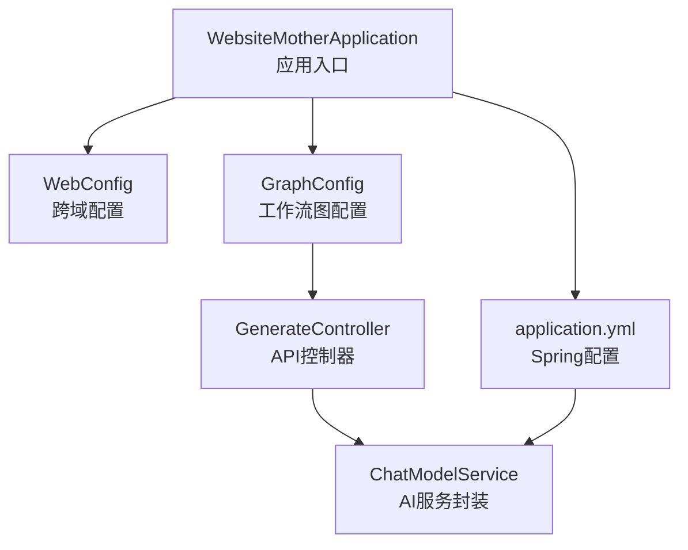
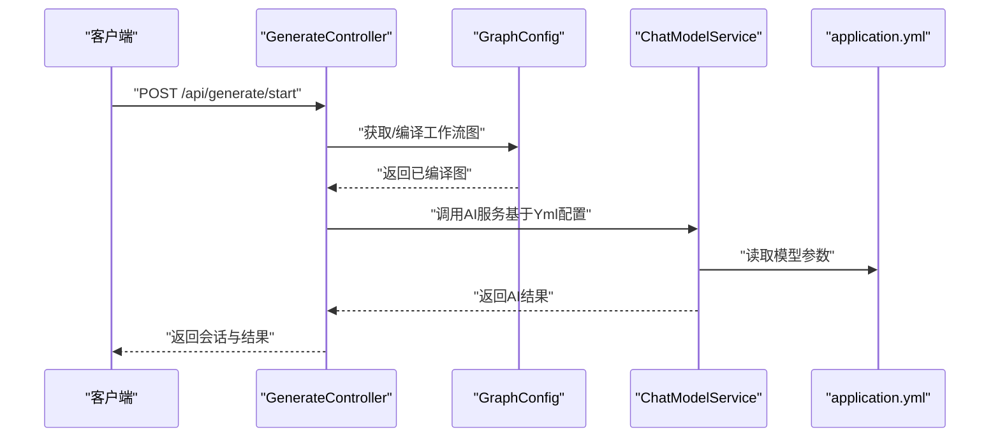
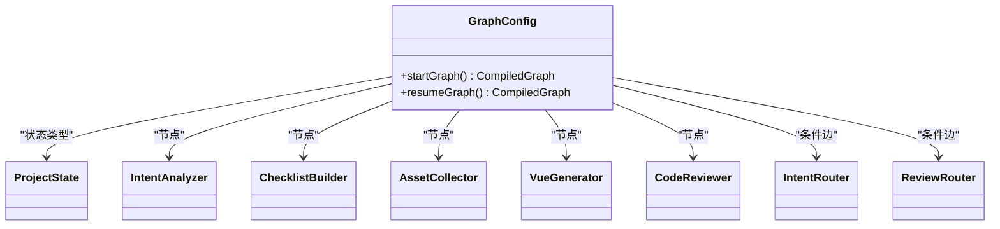
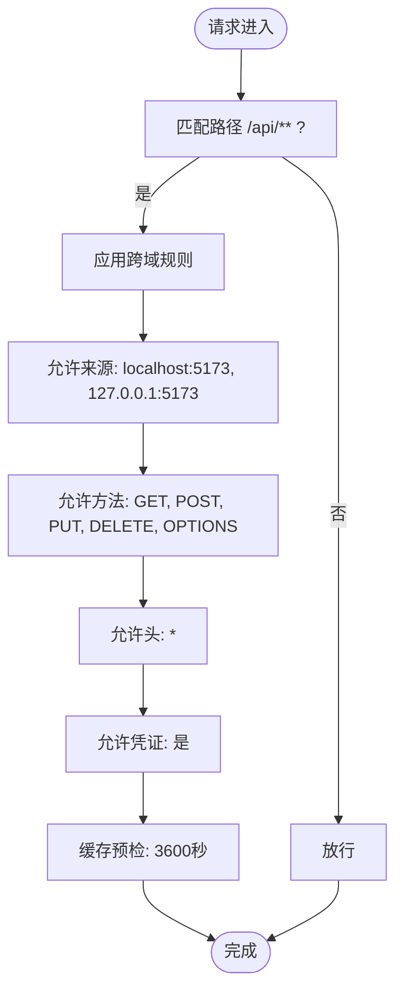
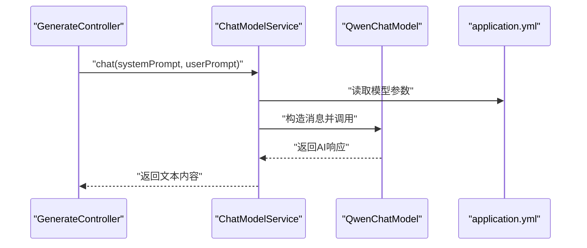
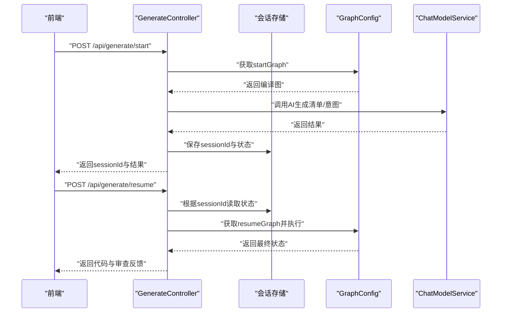
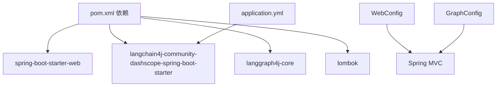

# 配置管理

<cite>
**本文引用的文件**
- [application.yml](file://src/main/resources/application.yml)
- [GraphConfig.java](file://src/main/java/com/example/websitemother/config/GraphConfig.java)
- [WebConfig.java](file://src/main/java/com/example/websitemother/config/WebConfig.java)
- [ChatModelService.java](file://src/main/java/com/example/websitemother/service/ChatModelService.java)
- [GenerateController.java](file://src/main/java/com/example/websitemother/controller/GenerateController.java)
- [WebsiteMotherApplication.java](file://src/main/java/com/example/websitemother/WebsiteMotherApplication.java)
- [pom.xml](file://pom.xml)
</cite>

## 目录
1. [简介](#简介)
2. [项目结构](#项目结构)
3. [核心组件](#核心组件)
4. [架构总览](#架构总览)
5. [详细组件分析](#详细组件分析)
6. [依赖关系分析](#依赖关系分析)
7. [性能考量](#性能考量)
8. [故障排除指南](#故障排除指南)
9. [结论](#结论)
10. [附录](#附录)

## 简介
本文件面向WebsiteMother项目的运维与开发者，系统化梳理配置管理相关内容，覆盖以下主题：
- Spring Boot配置文件application.yml的结构与关键项说明
- 数据库连接、AI模型API配置与服务器设置现状与建议
- 不同环境（开发、测试、生产）的配置管理策略
- 自定义配置类设计与实现（GraphConfig、WebConfig）
- 配置安全与敏感信息保护（密钥与环境变量）
- 动态更新与热加载机制现状与替代方案
- 故障排除与性能调优建议

## 项目结构
WebsiteMother采用Spring Boot标准布局，核心配置位于resources目录下的application.yml；业务配置通过Java配置类注入容器，控制器负责对外API。

图表来源
- [WebsiteMotherApplication.java:1-13](file://src/main/java/com/example/websitemother/WebsiteMotherApplication.java#L1-L13)
- [application.yml:1-9](file://src/main/resources/application/application.yml#L1-L9)
- [WebConfig.java:1-23](file://src/main/java/com/example/websitemother/config/WebConfig.java#L1-L23)
- [GraphConfig.java:1-99](file://src/main/java/com/example/websitemother/config/GraphConfig.java#L1-L99)
- [GenerateController.java:1-115](file://src/main/java/com/example/websitemother/controller/GenerateController.java#L1-L115)
- [ChatModelService.java:1-58](file://src/main/java/com/example/websitemother/service/ChatModelService.java#L1-L58)

章节来源
- [WebsiteMotherApplication.java:1-13](file://src/main/java/com/example/websitemother/WebsiteMotherApplication.java#L1-L13)
- [application.yml:1-9](file://src/main/resources/application.yml#L1-L9)

## 核心组件
- 应用入口与启动
  - 应用程序入口类负责启动Spring Boot容器，加载所有配置与组件。
- 配置文件
  - application.yml中定义了应用名称以及LangChain4j DashScope模型的API Key与模型名。
- 自定义配置类
  - WebConfig：启用跨域支持，便于前端开发调试。
  - GraphConfig：构建LangGraph4j状态图，组织工作流节点与路由逻辑。
- 服务与控制器
  - ChatModelService：封装DashScope Qwen模型调用。
  - GenerateController：对外提供生成流程的REST接口。

章节来源
- [WebsiteMotherApplication.java:1-13](file://src/main/java/com/example/websitemother/WebsiteMotherApplication.java#L1-L13)
- [application.yml:1-9](file://src/main/resources/application.yml#L1-L9)
- [WebConfig.java:1-23](file://src/main/java/com/example/websitemother/config/WebConfig.java#L1-L23)
- [GraphConfig.java:1-99](file://src/main/java/com/example/websitemother/config/GraphConfig.java#L1-L99)
- [ChatModelService.java:1-58](file://src/main/java/com/example/websitemother/service/ChatModelService.java#L1-L58)
- [GenerateController.java:1-115](file://src/main/java/com/example/websitemother/controller/GenerateController.java#L1-L115)

## 架构总览
下图展示配置在系统中的作用与流向：application.yml提供AI模型参数；WebConfig与GraphConfig在容器初始化时装配；控制器通过服务层调用AI模型完成业务流程。

图表来源
- [GenerateController.java:1-115](file://src/main/java/com/example/websitemother/controller/GenerateController.java#L1-L115)
- [GraphConfig.java:1-99](file://src/main/java/com/example/websitemother/config/GraphConfig.java#L1-L99)
- [ChatModelService.java:1-58](file://src/main/java/com/example/websitemother/service/ChatModelService.java#L1-L58)
- [application.yml:1-9](file://src/main/resources/application.yml#L1-L9)

## 详细组件分析

### application.yml 配置项说明
- spring.application.name
  - 作用：设置应用名称，便于日志与监控识别。
- langchain4j.community.dashscope.chat-model.api-key
  - 作用：DashScope Qwen模型的认证密钥。
- langchain4j.community.dashscope.chat-model.model-name
  - 作用：指定使用的模型名称。

建议与注意事项
- 当前配置未包含数据库连接参数，如需持久化，请在相应位置添加数据源配置。
- API Key等敏感信息不建议直接写入版本控制，推荐使用环境变量或外部配置中心。

章节来源
- [application.yml:1-9](file://src/main/resources/application.yml#L1-L9)

### 自定义配置类：GraphConfig
- 职责
  - 定义LangGraph4j状态图，组装两套工作流：startGraph（意图分析→清单生成）与resumeGraph（素材收集→代码生成→审查循环）。
  - 通过条件边与节点异步动作实现流程编排与状态传递。
- 关键点
  - 使用注解驱动的Bean装配各节点与路由组件。
  - 编译后的图对象在运行时被控制器调用以推进流程。

图表来源
- [GraphConfig.java:1-99](file://src/main/java/com/example/websitemother/config/GraphConfig.java#L1-L99)

章节来源
- [GraphConfig.java:1-99](file://src/main/java/com/example/websitemother/config/GraphConfig.java#L1-L99)

### 自定义配置类：WebConfig
- 职责
  - 配置跨域规则，允许前端开发服务器（默认本地端口）访问后端API。
- 关键点
  - 仅针对/api/**路径生效，支持常见HTTP方法与凭证传递。

图表来源
- [WebConfig.java:1-23](file://src/main/java/com/example/websitemother/config/WebConfig.java#L1-L23)

章节来源
- [WebConfig.java:1-23](file://src/main/java/com/example/websitemother/config/WebConfig.java#L1-L23)

### ChatModelService 与 AI 模型集成
- 职责
  - 封装DashScope Qwen模型调用，统一消息格式（SystemMessage + UserMessage），并处理异常与日志。
- 关联配置
  - 通过LangChain4j自动装配的QwenChatModel读取application.yml中的模型参数。

图表来源
- [ChatModelService.java:1-58](file://src/main/java/com/example/websitemother/service/ChatModelService.java#L1-L58)
- [application.yml:1-9](file://src/main/resources/application.yml#L1-L9)

章节来源
- [ChatModelService.java:1-58](file://src/main/java/com/example/websitemother/service/ChatModelService.java#L1-L58)
- [application.yml:1-9](file://src/main/resources/application.yml#L1-L9)

### GenerateController 与会话状态
- 职责
  - 对外提供/start与/resume两个API，分别启动与继续生成流程。
  - 使用内存Map模拟会话状态存储（演示用途，生产建议替换为Redis等）。
- 关联配置
  - WebConfig确保前端可访问后端API。

图表来源
- [GenerateController.java:1-115](file://src/main/java/com/example/websitemother/controller/GenerateController.java#L1-L115)
- [WebConfig.java:1-23](file://src/main/java/com/example/websitemother/config/WebConfig.java#L1-L23)
- [GraphConfig.java:1-99](file://src/main/java/com/example/websitemother/config/GraphConfig.java#L1-L99)
- [ChatModelService.java:1-58](file://src/main/java/com/example/websitemother/service/ChatModelService.java#L1-L58)

章节来源
- [GenerateController.java:1-115](file://src/main/java/com/example/websitemother/controller/GenerateController.java#L1-L115)
- [WebConfig.java:1-23](file://src/main/java/com/example/websitemother/config/WebConfig.java#L1-L23)
- [GraphConfig.java:1-99](file://src/main/java/com/example/websitemother/config/GraphConfig.java#L1-L99)
- [ChatModelService.java:1-58](file://src/main/java/com/example/websitemother/service/ChatModelService.java#L1-L58)

## 依赖关系分析
- Maven依赖要点
  - Spring Web Starter：提供Web与嵌入式服务器能力。
  - LangChain4j DashScope Spring Boot Starter：自动装配AI模型相关组件。
  - Lombok：简化实体与配置类代码。
  - LangGraph4j Core：用于状态图编排。
- 运行时装配
  - application.yml中的AI模型参数由LangChain4j Starter自动解析并注入对应组件。
  - WebConfig与GraphConfig作为@Configuration类在容器启动时被扫描并注册。

图表来源
- [pom.xml:1-115](file://pom.xml#L1-L115)
- [application.yml:1-9](file://src/main/resources/application.yml#L1-L9)
- [WebConfig.java:1-23](file://src/main/java/com/example/websitemother/config/WebConfig.java#L1-L23)
- [GraphConfig.java:1-99](file://src/main/java/com/example/websitemother/config/GraphConfig.java#L1-L99)

章节来源
- [pom.xml:1-115](file://pom.xml#L1-L115)

## 性能考量
- 会话存储
  - 当前使用内存Map存储会话状态，适合演示，不适合高并发生产场景。建议迁移到Redis等外部缓存，提升扩展性与持久化能力。
- 跨域配置
  - WebConfig的跨域规则仅限开发环境使用，生产环境应收紧来源列表并限制方法与头。
- AI调用
  - ChatModelService对异常进行捕获与日志记录，建议在生产增加重试、超时与熔断策略，避免阻塞请求线程。
- 工作流编排
  - GraphConfig中使用异步节点与条件边，建议结合监控指标观察节点耗时与失败率，优化关键路径。

## 故障排除指南
- AI服务调用异常
  - 现象：调用AI模型时抛出异常并记录错误日志。
  - 排查：检查application.yml中的API Key与模型名是否正确；确认网络可达性与配额状态。
  - 参考
    - [ChatModelService.java:1-58](file://src/main/java/com/example/websitemother/service/ChatModelService.java#L1-L58)
    - [application.yml:1-9](file://src/main/resources/application.yml#L1-L9)
- 跨域问题
  - 现象：前端无法访问后端API。
  - 排查：确认前端开发服务器地址与端口是否在WebConfig允许列表内；检查浏览器控制台的CORS错误。
  - 参考
    - [WebConfig.java:1-23](file://src/main/java/com/example/websitemother/config/WebConfig.java#L1-L23)
- 会话状态丢失
  - 现象：/resume接口报“会话不存在或已过期”。
  - 排查：确认sessionId是否正确传递；检查内存存储是否被GC清理（演示场景）；生产环境请使用Redis。
  - 参考
    - [GenerateController.java:1-115](file://src/main/java/com/example/websitemother/controller/GenerateController.java#L1-L115)

## 结论
WebsiteMother当前的配置体系以application.yml为核心，结合WebConfig与GraphConfig实现了基础的跨域与工作流编排能力。AI模型通过LangChain4j自动装配接入，整体结构清晰、易于扩展。建议在生产环境中完善数据库配置、引入外部配置中心与密钥管理、替换内存会话存储，并强化AI调用的稳定性与可观测性。

## 附录

### 不同环境的配置管理策略
- 开发环境
  - 允许本地前端开发服务器跨域访问；使用演示级内存会话存储；可开启更详细的日志级别以便调试。
  - 参考
    - [WebConfig.java:1-23](file://src/main/java/com/example/websitemother/config/WebConfig.java#L1-L23)
- 测试环境
  - 使用独立的配置文件或环境变量覆盖敏感参数；限制跨域范围；启用必要的健康检查与监控。
- 生产环境
  - 所有敏感信息通过环境变量或配置中心注入；严格限制跨域来源；使用Redis等外部存储会话状态；开启限流与熔断策略。

### 配置安全管理最佳实践
- 敏感信息加密与外部化
  - 将API Key、数据库密码等敏感信息移出application.yml，使用环境变量或配置中心（如Spring Cloud Config、Vault）管理。
- 最小权限原则
  - 为不同环境分配最小必要权限，避免在开发环境使用生产密钥。
- 审计与变更控制
  - 对配置变更建立审批与回滚机制，保留变更历史。

### 动态更新与热加载机制
- 现状
  - 当前未发现显式的配置热加载实现（如Spring Cloud Config Bus或Actuator的refresh端点）。
- 替代方案
  - 使用环境变量与容器编排（如Kubernetes ConfigMap/Secret）实现滚动重启更新。
  - 引入Spring Cloud Config与Bus，结合消息总线实现配置广播刷新。