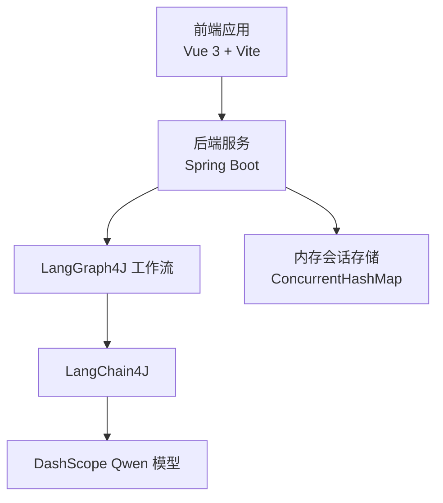
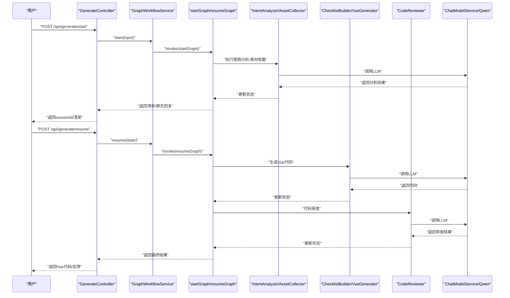
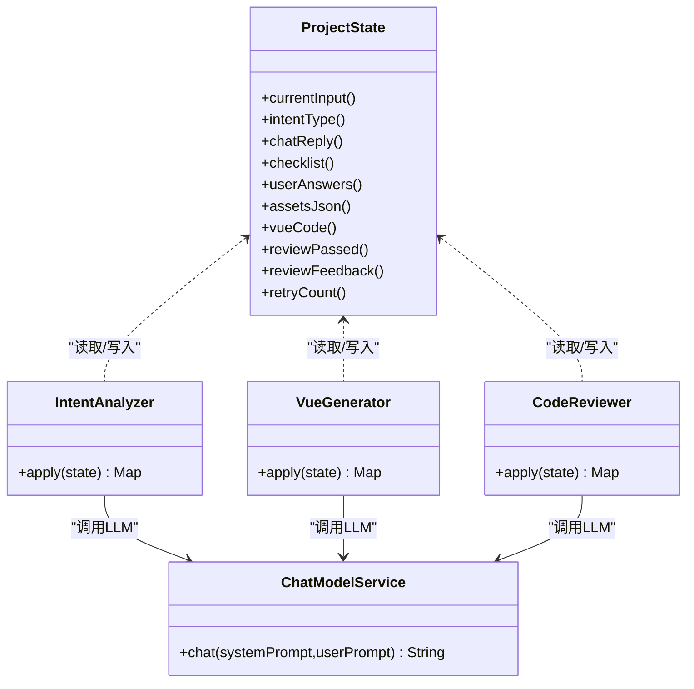
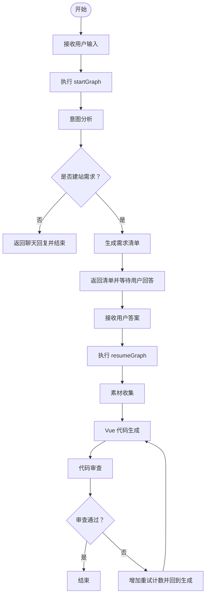
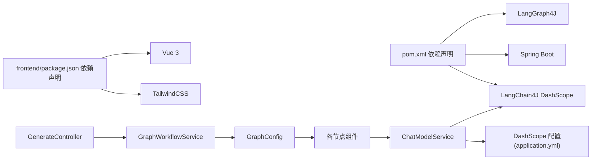

# 项目概述

<cite>
**本文引用的文件**
- [WebsiteMotherApplication.java](file://src/main/java/com/example/websitemother/WebsiteMotherApplication.java)
- [pom.xml](file://pom.xml)
- [application.yml](file://src/main/resources/application.yml)
- [package.json](file://frontend/package.json)
- [README.md](file://frontend/README.md)
- [GenerateController.java](file://src/main/java/com/example/websitemother/controller/GenerateController.java)
- [GraphWorkflowService.java](file://src/main/java/com/example/websitemother/service/GraphWorkflowService.java)
- [ChatModelService.java](file://src/main/java/com/example/websitemother/service/ChatModelService.java)
- [GraphConfig.java](file://src/main/java/com/example/websitemother/config/GraphConfig.java)
- [ProjectState.java](file://src/main/java/com/example/websitemother/state/ProjectState.java)
- [IntentAnalyzer.java](file://src/main/java/com/example/websitemother/node/IntentAnalyzer.java)
- [VueGenerator.java](file://src/main/java/com/example/websitemother/node/VueGenerator.java)
- [CodeReviewer.java](file://src/main/java/com/example/websitemother/node/CodeReviewer.java)
- [PromptTemplates.java](file://src/main/java/com/example/websitemother/prompt/PromptTemplates.java)
</cite>

## 目录
1. [引言](#引言)
2. [项目结构](#项目结构)
3. [核心组件](#核心组件)
4. [架构总览](#架构总览)
5. [详细组件分析](#详细组件分析)
6. [依赖关系分析](#依赖关系分析)
7. [性能考虑](#性能考虑)
8. [故障排查指南](#故障排查指南)
9. [结论](#结论)
10. [附录](#附录)

## 引言
WebsiteMother 是一个基于人工智能的大规模语言模型（LLM）驱动的智能网站生成平台。其核心价值在于通过“意图分析—需求收集—代码生成—代码审查”的闭环工作流，将非技术用户的自然语言需求转化为可直接运行的 Vue 3 单文件组件代码，显著降低建站门槛，提升前端开发效率。

项目目标：
- 以低门槛的方式实现“所想即所得”的智能建站体验
- 通过可控的多轮审查机制保证生成代码的质量与合规性
- 提供可扩展的微服务化与工作流化架构，支撑未来业务演进

## 项目结构
项目采用前后端分离架构：
- 后端：基于 Spring Boot 的 Java 应用，负责 AI 工作流编排、LLM 调用与状态管理
- 前端：基于 Vue 3 + Vite 的静态站点，负责用户交互与结果展示
- AI 集成：通过 LangChain4J 与 DashScope（Qwen 大模型）对接，构建 LangGraph4J 工作流

图表来源
- [GenerateController.java:1-115](file://src/main/java/com/example/websitemother/controller/GenerateController.java#L1-L115)
- [GraphWorkflowService.java:1-60](file://src/main/java/com/example/websitemother/service/GraphWorkflowService.java#L1-L60)
- [ChatModelService.java:1-58](file://src/main/java/com/example/websitemother/service/ChatModelService.java#L1-L58)
- [GraphConfig.java:1-99](file://src/main/java/com/example/websitemother/config/GraphConfig.java#L1-L99)
- [application.yml:1-9](file://src/main/resources/application.yml#L1-L9)

章节来源
- [pom.xml:1-115](file://pom.xml#L1-L115)
- [package.json:1-24](file://frontend/package.json#L1-L24)
- [README.md:1-6](file://frontend/README.md#L1-L6)

## 核心组件
- 控制器层：对外暴露 /api/generate/start 与 /api/generate/resume 两个核心接口，负责接收用户输入、协调工作流执行与状态回传
- 工作流服务：封装 startGraph 与 resumeGraph 的执行，串联各节点动作
- LLM 服务：统一抽象对 DashScope Qwen 的调用，支持 System/User 消息组装
- 状态管理：ProjectState 作为全局状态载体，贯穿工作流各节点
- Prompt 模板：集中管理各节点的系统提示词与用户提示词模板
- 工作流配置：GraphConfig 组装两条主干工作流（意图分析+清单生成；素材收集+代码生成+审查循环）

章节来源
- [GenerateController.java:1-115](file://src/main/java/com/example/websitemother/controller/GenerateController.java#L1-L115)
- [GraphWorkflowService.java:1-60](file://src/main/java/com/example/websitemother/service/GraphWorkflowService.java#L1-L60)
- [ChatModelService.java:1-58](file://src/main/java/com/example/websitemother/service/ChatModelService.java#L1-L58)
- [ProjectState.java:1-78](file://src/main/java/com/example/websitemother/state/ProjectState.java#L1-L78)
- [PromptTemplates.java:1-93](file://src/main/java/com/example/websitemother/prompt/PromptTemplates.java#L1-L93)
- [GraphConfig.java:1-99](file://src/main/java/com/example/websitemother/config/GraphConfig.java#L1-L99)

## 架构总览
系统采用“控制器-工作流-节点-LLM”分层设计：
- 控制器接收请求，维护会话状态，触发工作流
- 工作流由 LangGraph4J 编排，按条件路由在节点间流转
- 节点通过 ChatModelService 调用 DashScope Qwen，产出中间结果
- ProjectState 在各节点之间传递数据，确保状态一致

图表来源
- [GenerateController.java:1-115](file://src/main/java/com/example/websitemother/controller/GenerateController.java#L1-L115)
- [GraphWorkflowService.java:1-60](file://src/main/java/com/example/websitemother/service/GraphWorkflowService.java#L1-L60)
- [GraphConfig.java:1-99](file://src/main/java/com/example/websitemother/config/GraphConfig.java#L1-L99)
- [IntentAnalyzer.java:1-61](file://src/main/java/com/example/websitemother/node/IntentAnalyzer.java#L1-L61)
- [VueGenerator.java:1-64](file://src/main/java/com/example/websitemother/node/VueGenerator.java#L1-L64)
- [CodeReviewer.java:1-61](file://src/main/java/com/example/websitemother/node/CodeReviewer.java#L1-L61)
- [ChatModelService.java:1-58](file://src/main/java/com/example/websitemother/service/ChatModelService.java#L1-L58)

## 详细组件分析

### 控制器层：GenerateController
- 负责会话生命周期管理（内存级存储）
- 提供两阶段工作流入口：
  - /api/generate/start：启动意图分析与清单生成
  - /api/generate/resume：提交用户答案后继续执行素材收集、代码生成与审查循环
- 返回结构包含 sessionId、意图类型、聊天回复、清单、Vue 代码、审查结果与重试次数

章节来源
- [GenerateController.java:1-115](file://src/main/java/com/example/websitemother/controller/GenerateController.java#L1-L115)

### 工作流服务：GraphWorkflowService
- 封装 startGraph 与 resumeGraph 的执行
- start：从用户输入开始，进入第一阶段工作流
- resume：基于已填充用户答案的状态继续执行第二阶段工作流

章节来源
- [GraphWorkflowService.java:1-60](file://src/main/java/com/example/websitemother/service/GraphWorkflowService.java#L1-L60)

### LLM 服务：ChatModelService
- 统一封装对 DashScope Qwen 的调用
- 支持 SystemMessage + UserMessage 组合，简化节点调用
- 错误处理：捕获异常并抛出统一错误

章节来源
- [ChatModelService.java:1-58](file://src/main/java/com/example/websitemother/service/ChatModelService.java#L1-L58)
- [application.yml:1-9](file://src/main/resources/application.yml#L1-L9)

### 状态管理：ProjectState
- 继承 LangGraph4J 的 AgentState，承载工作流全链路数据
- 关键字段：当前输入、意图类型、聊天回复、清单、用户答案、素材 JSON、Vue 代码、审查结果、反馈、重试次数
- 提供类型安全的访问器方法

章节来源
- [ProjectState.java:1-78](file://src/main/java/com/example/websitemother/state/ProjectState.java#L1-L78)

### Prompt 模板：PromptTemplates
- 集中管理各节点的系统提示词与用户提示词
- 覆盖意图分析、需求清单、Vue 代码生成、代码审查四大场景
- 严格约束输出格式，便于解析与一致性控制

章节来源
- [PromptTemplates.java:1-93](file://src/main/java/com/example/websitemother/prompt/PromptTemplates.java#L1-L93)

### 工作流配置：GraphConfig
- startGraph：意图分析 → 条件路由 → 清单生成 → 结束
- resumeGraph：素材收集 → Vue 生成 → 代码审查 → 条件路由（通过则结束，不通过则回到生成）
- 使用异步节点与边动作，提升吞吐与稳定性

章节来源
- [GraphConfig.java:1-99](file://src/main/java/com/example/websitemother/config/GraphConfig.java#L1-L99)

### 节点组件
- 意图分析（IntentAnalyzer）：判断用户输入是闲聊还是建站需求，并生成对应回复
- Vue 代码生成（VueGenerator）：整合需求与素材，生成完整单文件 Vue 组件
- 代码审查（CodeReviewer）：校验代码完整性与规范性，输出通过/失败与反馈

图表来源
- [ProjectState.java:1-78](file://src/main/java/com/example/websitemother/state/ProjectState.java#L1-L78)
- [IntentAnalyzer.java:1-61](file://src/main/java/com/example/websitemother/node/IntentAnalyzer.java#L1-L61)
- [VueGenerator.java:1-64](file://src/main/java/com/example/websitemother/node/VueGenerator.java#L1-L64)
- [CodeReviewer.java:1-61](file://src/main/java/com/example/websitemother/node/CodeReviewer.java#L1-L61)
- [ChatModelService.java:1-58](file://src/main/java/com/example/websitemother/service/ChatModelService.java#L1-L58)

章节来源
- [IntentAnalyzer.java:1-61](file://src/main/java/com/example/websitemother/node/IntentAnalyzer.java#L1-L61)
- [VueGenerator.java:1-64](file://src/main/java/com/example/websitemother/node/VueGenerator.java#L1-L64)
- [CodeReviewer.java:1-61](file://src/main/java/com/example/websitemother/node/CodeReviewer.java#L1-L61)

### 工作流执行流程（算法）

图表来源
- [GraphConfig.java:1-99](file://src/main/java/com/example/websitemother/config/GraphConfig.java#L1-L99)
- [GraphWorkflowService.java:1-60](file://src/main/java/com/example/websitemother/service/GraphWorkflowService.java#L1-L60)
- [IntentAnalyzer.java:1-61](file://src/main/java/com/example/websitemother/node/IntentAnalyzer.java#L1-L61)
- [VueGenerator.java:1-64](file://src/main/java/com/example/websitemother/node/VueGenerator.java#L1-L64)
- [CodeReviewer.java:1-61](file://src/main/java/com/example/websitemother/node/CodeReviewer.java#L1-L61)

## 依赖关系分析
- 技术栈与版本
  - 后端：Spring Boot 3.x、Java 21、LangGraph4J 1.6.5、LangChain4J DashScope Starter 1.13.0-beta23
  - 前端：Vue 3.5.32、Vite、TailwindCSS
- 关键依赖关系
  - 控制器依赖工作流服务与状态对象
  - 工作流服务依赖已编译的工作流图
  - 节点依赖 LLM 服务与 Prompt 模板
  - LLM 服务依赖 LangChain4J 与 DashScope 配置

图表来源
- [pom.xml:1-115](file://pom.xml#L1-L115)
- [package.json:1-24](file://frontend/package.json#L1-L24)
- [application.yml:1-9](file://src/main/resources/application.yml#L1-L9)
- [GenerateController.java:1-115](file://src/main/java/com/example/websitemother/controller/GenerateController.java#L1-L115)
- [GraphWorkflowService.java:1-60](file://src/main/java/com/example/websitemother/service/GraphWorkflowService.java#L1-L60)
- [GraphConfig.java:1-99](file://src/main/java/com/example/websitemother/config/GraphConfig.java#L1-L99)
- [ChatModelService.java:1-58](file://src/main/java/com/example/websitemother/service/ChatModelService.java#L1-L58)

章节来源
- [pom.xml:1-115](file://pom.xml#L1-L115)
- [package.json:1-24](file://frontend/package.json#L1-L24)
- [application.yml:1-9](file://src/main/resources/application.yml#L1-L9)

## 性能考虑
- 并发与会话：当前会话存储为内存级（ConcurrentHashMap），适合演示与小规模并发；生产环境建议替换为 Redis 等持久化缓存
- LLM 调用：统一在 ChatModelService 中进行，建议引入连接池、超时与重试策略，避免阻塞
- 工作流编译：LangGraph4J 的工作流图在启动时编译一次，运行时复用，具备较好性能
- 前端构建：Vite 提供快速开发与热更新能力，生产构建可进一步优化资源体积与加载时间

## 故障排查指南
- LLM 调用异常
  - 现象：调用失败并记录错误日志
  - 排查：确认 DashScope API Key 与模型名称配置正确；检查网络连通性
- 会话不存在或过期
  - 现象：resume 接口抛出参数异常
  - 排查：确认 sessionId 是否有效且未过期；检查会话存储策略
- 审查结果解析失败
  - 现象：审查结果无法识别通过/失败
  - 排查：确认 Prompt 模板输出格式是否被 LLM 修改；保持输出格式严格一致
- 生成代码不完整
  - 现象：审查失败或缺少必要标签
  - 排查：检查 Prompt 模板中的规范要求是否被遵守；必要时增加示例引导

章节来源
- [ChatModelService.java:1-58](file://src/main/java/com/example/websitemother/service/ChatModelService.java#L1-L58)
- [GenerateController.java:1-115](file://src/main/java/com/example/websitemother/controller/GenerateController.java#L1-L115)
- [CodeReviewer.java:1-61](file://src/main/java/com/example/websitemother/node/CodeReviewer.java#L1-L61)

## 结论
WebsiteMother 通过“意图分析—需求收集—代码生成—代码审查”的闭环工作流，结合 LangGraph4J 的状态图编排与 DashScope 的大模型能力，实现了从自然语言到可运行 Vue 组件的自动化转换。项目采用前后端分离与微服务化理念，具备良好的扩展性与可维护性，适合在教育、低代码平台与企业内部工具等场景落地。

## 附录
- 应用场景
  - 教育培训：帮助学生快速上手 Vue 开发
  - 产品原型：快速验证页面设计方案
  - 企业内部：零基础员工快速搭建展示页
- 目标用户
  - 非技术背景的业务人员
  - 前端开发新手与学习者
  - 需要快速产出页面原型的团队
- 预期价值
  - 降低建站成本与技术门槛
  - 提升需求沟通与交付效率
  - 通过多轮审查保障代码质量