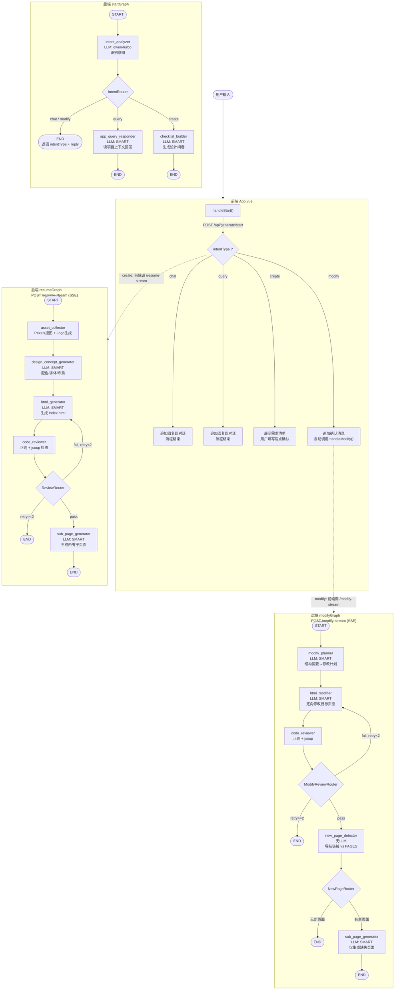

# WebsiteMother 完整工作流

## 总览：前端作为编排器

每次用户输入都从同一个入口开始，前端根据后端返回的 `intentType` 决定下一步。



## 三步决策链

```
用户输入 "帮我做一个电商网站"
  │
  ▼
① POST /api/generate/start  →  startGraph
  │  IntentAnalyzer 识别 → intentType = "create"
  │  返回: sessionId + checklist
  ▼
② 前端展示问卷，用户填写
  │
  ▼
③ POST /api/generate/resume-stream  →  resumeGraph
  │  AssetCollector → DesignConcept → HtmlGenerator
  │  → CodeReviewer ⇄ (重试) → SubPageGenerator
  │  SSE 流式返回 html_token / page_token / complete
  ▼
  网站生成完成
```

```
用户输入 "把背景色改成蓝色"（已有项目上下文）
  │
  ▼
① POST /api/generate/start  →  startGraph
  │  IntentAnalyzer 识别 → intentType = "modify"
  │  返回: sessionId + reply = "好的，我来修改..."
  ▼
② 前端自动调用 POST /api/generate/modify-stream  →  modifyGraph
  │  ModifyPlanner → HtmlModifier → CodeReviewer ⇄ (重试)
  │  → NewPageDetector → [SubPageGenerator]
  │  SSE 流式返回 modify_plan / html_token / complete
  ▼
  修改完成
```

```
用户输入 "这个网站有哪些页面？"（已有项目上下文）
  │
  ▼
① POST /api/generate/start  →  startGraph
  │  IntentAnalyzer 识别 → intentType = "query"
  │  → AppQueryResponder 读取项目上下文生成回答
  │  返回: sessionId + chatReply
  ▼
  前端直接显示回答，流程结束
```

## 三个后端图的职责

| 图 | 触发 API | 触发条件 | 核心能力 |
|---|---|---|---|
| **startGraph** | `POST /start` | 每次用户输入 | 意图识别 + 闲聊/查询/问卷 |
| **resumeGraph** | `POST /resume-stream` | intentType=create | 完整建站：素材→设计→首页→审查⇄重试→子页面 |
| **modifyGraph** | `POST /modify-stream` | intentType=modify | 定向修改：规划→改代码→审查⇄重试→检测新页面→生成 |
